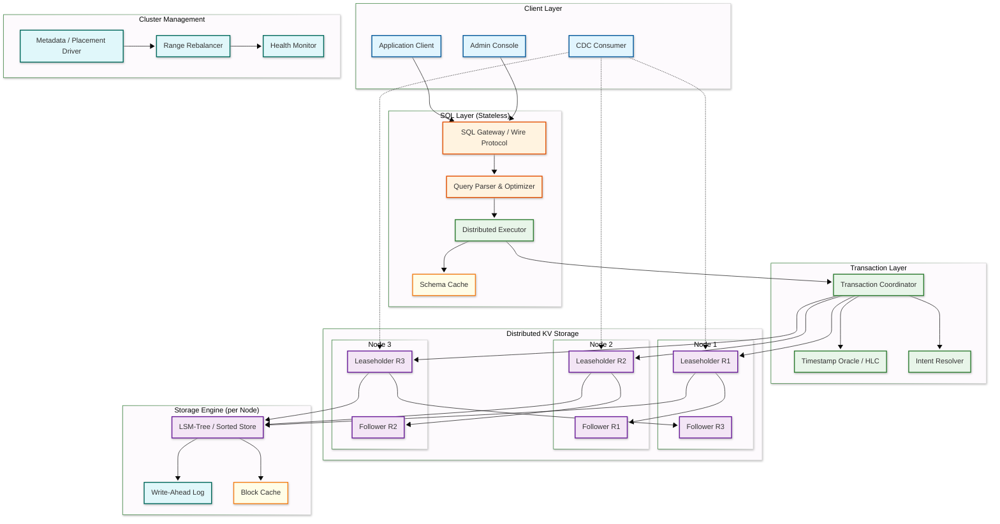

# High-Level Design — NewSQL Database

## System Architecture



---

## Component Descriptions

| Component | Role |
|-----------|------|
| **SQL Gateway** | Accepts client connections via PostgreSQL/MySQL wire protocol; authenticates, parses SQL, and routes to the query optimizer |
| **Query Parser & Optimizer** | Transforms SQL into a logical plan, applies cost-based optimization considering range distribution, and produces a distributed physical plan |
| **Distributed Executor** | Executes the physical plan by sending KV operations to the leaseholders of relevant ranges; coordinates parallel scans and distributed joins |
| **Transaction Coordinator** | Manages the lifecycle of distributed transactions: assigns timestamps, tracks write intents across ranges, coordinates commit via parallel commits or 2PC |
| **Timestamp Oracle / HLC** | Issues hybrid logical clock timestamps combining physical time (NTP) with a logical counter for causal ordering across nodes |
| **Intent Resolver** | Resolves encountered write intents from other transactions — checks if the intent's transaction committed or aborted, then cleans up accordingly |
| **Leaseholder** | The designated replica in each range's Raft group that serves reads and coordinates writes; typically co-located with the Raft leader |
| **LSM-Tree Storage** | Log-structured merge-tree that stores MVCC key-value pairs sorted by key and timestamp; supports efficient range scans and point lookups |
| **Block Cache** | In-memory cache for frequently accessed data blocks from the LSM-tree; sized to hold the hot working set |
| **Metadata / Placement Driver** | Stores cluster topology, range-to-node mapping, and zone configuration; directs range placement and rebalancing decisions |

---

## Data Flow

### Write Path (Distributed Transaction)

```mermaid
---
config:
  theme: base
  look: neo
---
sequenceDiagram
    participant Client
    participant SQL as SQL Gateway
    participant Coord as Txn Coordinator
    participant HLC as HLC Clock
    participant LH1 as Leaseholder R1
    participant LH2 as Leaseholder R2
    participant Raft1 as Raft Group R1
    participant Raft2 as Raft Group R2

    Client->>SQL: BEGIN; INSERT INTO orders...; UPDATE accounts...; COMMIT;
    SQL->>Coord: Begin transaction
    Coord->>HLC: Assign provisional timestamp
    HLC-->>Coord: ts = (wall_time, logical_counter)

    Note over Coord: INSERT maps to Range R1, UPDATE maps to Range R2

    par Write intents in parallel
        Coord->>LH1: Write intent (key, value, txn_id, ts)
        LH1->>Raft1: Propose intent via Raft
        Raft1-->>LH1: Quorum ACK
        LH1-->>Coord: Intent written
    and
        Coord->>LH2: Write intent (key, value, txn_id, ts)
        LH2->>Raft2: Propose intent via Raft
        Raft2-->>LH2: Quorum ACK
        LH2-->>Coord: Intent written
    end

    Note over Coord: Parallel Commits: write STAGING record + verify intents concurrently

    par Commit in parallel
        Coord->>LH1: Mark txn record STAGING
        LH1->>Raft1: Replicate txn record
        Raft1-->>LH1: Quorum ACK
    and
        Coord->>LH2: Verify intent on R2 succeeded
    end

    Coord-->>Client: Transaction committed
    Note over Coord: Async: resolve intents → remove txn record
```

**Write path key points:**

1. **Intent-based writes** — Each write creates an MVCC intent (provisional value) associated with the transaction ID, not a final committed value
2. **Parallel Raft consensus** — Write intents to different ranges replicate through their respective Raft groups concurrently
3. **Parallel commits** — Instead of sequential 2PC, the transaction record transitions to STAGING while verifying all intents succeeded, completing commit in one consensus round-trip
4. **Async intent resolution** — After commit, intents are asynchronously resolved (rewritten as committed MVCC values) by background processes or encountering transactions

### Read Path (Consistent Read)

```mermaid
---
config:
  theme: base
  look: neo
---
sequenceDiagram
    participant Client
    participant SQL as SQL Gateway
    participant Opt as Query Optimizer
    participant Exec as Distributed Executor
    participant LH as Leaseholder
    participant LSM as LSM-Tree
    participant Cache as Block Cache

    Client->>SQL: SELECT * FROM orders WHERE user_id = 42
    SQL->>Opt: Parse SQL → logical plan
    Opt->>Opt: Cost-based optimization (range lookup, index selection)
    Opt->>Exec: Physical plan: IndexScan(orders_user_idx, key=42)
    Exec->>LH: KV Scan(start_key, end_key, timestamp)
    LH->>LH: Verify lease is valid (not expired)
    LH->>Cache: Lookup in block cache
    alt Cache hit
        Cache-->>LH: Return cached blocks
    else Cache miss
        LH->>LSM: Read from LSM-tree (check memtable → L0 → L1 → ...)
        LSM-->>LH: Return MVCC versions
    end
    LH->>LH: Filter MVCC versions visible at read timestamp
    LH->>LH: Check for write intents → resolve if encountered
    LH-->>Exec: Return qualifying rows
    Exec-->>SQL: Merge results from multiple ranges (if needed)
    SQL-->>Client: Result set
```

**Read path key points:**

1. **Leaseholder-only reads** — Only the leaseholder serves consistent reads, avoiding the need for a Raft round-trip on the read path
2. **MVCC visibility** — The reader evaluates all versions of a key and returns the latest version whose timestamp is less than or equal to the read timestamp
3. **Intent resolution on read** — If the reader encounters an uncommitted intent, it must determine the intent's transaction status (committed, aborted, or pending) before proceeding
4. **Block cache** — The LSM-tree's block cache eliminates disk I/O for hot data; bloom filters skip SST files that definitely do not contain the key

---

## Key Architectural Decisions

### 1. Sorted Key-Value Store vs. B-Tree Storage Engine

| Aspect | LSM-Tree (Log-Structured Merge) | B-Tree (Traditional) |
|--------|-------------------------------|---------------------|
| Write performance | Excellent — sequential writes to memtable | Moderate — random I/O for page updates |
| Read performance | Good with bloom filters | Excellent — single-page reads |
| Space amplification | Higher (multiple SST levels) | Lower (in-place updates) |
| Write amplification | Higher (compaction rewrites) | Lower |
| MVCC fit | Natural — append-only versioning | Requires additional version chains |
| Compaction overhead | Background CPU and I/O | No compaction needed |

**Decision:** LSM-tree storage engine. The append-only nature aligns perfectly with MVCC (each version is a new entry), write throughput is critical for Raft replication (each replica must persist every write), and range scans over sorted keys map directly to the LSM's sorted run structure.

### 2. TrueTime (Atomic Clocks) vs. Hybrid Logical Clocks

| Aspect | TrueTime | Hybrid Logical Clock (HLC) |
|--------|----------|---------------------------|
| Accuracy | < 7ms uncertainty interval | NTP-based (~100-250ms uncertainty) |
| Infrastructure | Requires GPS + atomic clocks in every datacenter | Standard NTP; no special hardware |
| Commit latency | Must wait out uncertainty interval (~7ms) | No commit-wait, but must handle clock skew |
| External consistency | Guaranteed via commit-wait | Causal consistency; serializable via conflict detection |
| Deployment complexity | High (specialized hardware) | Low (software-only) |

**Decision:** Hybrid logical clocks for commodity deployments. HLC provides causal ordering guarantees sufficient for serializable isolation without specialized hardware. Clock skew is handled by uncertainty intervals in the transaction protocol: if two transactions' timestamps are within the uncertainty window, conflict detection determines ordering.

### 3. Replication: Raft vs. Paxos vs. Primary-Backup

| Aspect | Raft | Multi-Paxos | Primary-Backup |
|--------|------|-------------|----------------|
| Understandability | High (designed for clarity) | Low (complex protocol) | High |
| Leader election | Built-in, fast | Separate protocol needed | External failover |
| Log ordering | Strict sequential | Allows gaps | Sequential |
| Production adoption | CockroachDB, TiKV, YugabyteDB | Spanner, Chubby | Traditional RDBMS |
| Throughput | Good (pipeline-able) | Excellent (parallel slots) | Highest (no consensus overhead) |

**Decision:** Raft consensus per range. Industry standard for NewSQL, with clear leader election semantics and well-understood failure modes. Each range operates an independent Raft group, allowing the cluster to run thousands of Raft groups concurrently.

### 4. Transaction Protocol: 2PC vs. Parallel Commits

| Aspect | Traditional 2PC | Parallel Commits |
|--------|-----------------|-----------------|
| Consensus rounds | 2 sequential (prepare + commit) | 1 (prepare + commit in parallel) |
| Latency | 2x consensus latency | 1x consensus latency |
| Complexity | Simple, well-understood | More complex intent resolution |
| Recovery | Coordinator failure blocks resolution | STAGING record enables recovery by any node |

**Decision:** Parallel commits as the default protocol. By writing a STAGING transaction record concurrently with the final intent writes, the commit completes in one consensus round-trip — halving distributed transaction latency compared to traditional 2PC.

### 5. Caching Strategy

| Cache Layer | What It Caches | Eviction Policy |
|-------------|---------------|-----------------|
| Block cache | LSM-tree data blocks and index blocks | LRU with partitioned pools |
| Row cache | Deserialized rows for point lookups | LRU with TTL, invalidated on write |
| SQL plan cache | Compiled query execution plans | LRU, invalidated on schema change |
| Range descriptor cache | Range-to-node mapping for routing | Invalidated on range split/merge/move |
| Lease cache | Active lease information per range | Invalidated on lease transfer |

---

## Architecture Pattern Checklist

- [x] **Sync vs Async communication** — Synchronous for transactional reads/writes; async for CDC, intent resolution, and analytics replication
- [x] **Event-driven vs Request-response** — Request-response for SQL queries; event-driven CDC for downstream consumers
- [x] **Push vs Pull model** — Push-based Raft replication (leader pushes log entries); pull-based compaction triggers
- [x] **Stateless vs Stateful services** — SQL gateway is stateless (any node can serve any query); KV storage nodes are stateful (own their ranges)
- [x] **Read-heavy vs Write-heavy** — Read-heavy (8:1); leaseholder reads avoid Raft round-trips; block cache optimizes hot data
- [x] **Real-time vs Batch processing** — Real-time for OLTP; batch for MVCC garbage collection and range rebalancing
- [x] **Edge vs Origin processing** — Origin processing; query pushdown moves computation to the storage nodes holding the data
