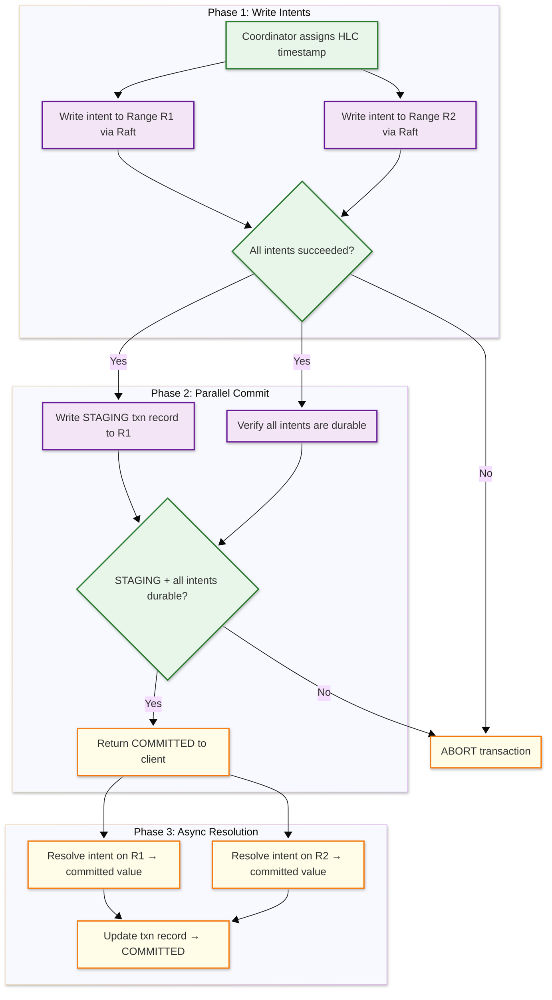

# Low-Level Design — NewSQL Database

## Data Model

### Key Encoding Scheme

All relational data is encoded into a sorted key-value representation. The key encoding determines how SQL tables map to the distributed KV store:

```
Key Format:
  /<table_id>/<index_id>/<encoded_column_values>/<timestamp>

Examples:
  /52/1/42/1709856000.000000001  → Table 52, primary index, row key=42, MVCC timestamp
  /52/2/"alice"/42/1709856000    → Table 52, secondary index on name, pointing to key=42
```

### MVCC Value Structure

```
┌─────────────────────────────────────────────────────────────┐
│ MVCC Key-Value Entry                                         │
├──────────────┬──────────────────────────────────────────────┤
│ key          │ encoded_table/index/columns                   │
│ timestamp    │ HLC timestamp (wall_time_ns + logical)        │
│ value_type   │ COMMITTED | INTENT                            │
│ txn_id       │ UUID (only for intents, NULL for committed)   │
│ value        │ encoded column data (protobuf / columnar)     │
│ prev_version │ pointer to previous MVCC version (optional)   │
└──────────────┴──────────────────────────────────────────────┘
```

### Range Descriptor

Each range is described by metadata stored in a system range:

```
┌─────────────────────────────────────────────────────────────┐
│ Range Descriptor                                             │
├──────────────┬──────────────────────────────────────────────┤
│ range_id     │ Globally unique range identifier              │
│ start_key    │ First key in the range (inclusive)            │
│ end_key      │ Last key in the range (exclusive)             │
│ replicas     │ List of (node_id, store_id, replica_type)     │
│ leaseholder  │ Node ID of current leaseholder                │
│ raft_term    │ Current Raft term number                      │
│ generation   │ Incremented on each split/merge               │
│ zone_config  │ Replication factor, placement constraints      │
└──────────────┴──────────────────────────────────────────────┘
```

### Transaction Record

```
┌─────────────────────────────────────────────────────────────┐
│ Transaction Record                                           │
├──────────────┬──────────────────────────────────────────────┤
│ txn_id       │ UUID                                          │
│ status       │ PENDING | STAGING | COMMITTED | ABORTED       │
│ write_ts     │ Commit timestamp (HLC)                        │
│ read_ts      │ Read timestamp (snapshot point)               │
│ max_ts       │ Upper bound for read uncertainty window        │
│ intents      │ List of (range_id, key) for all write intents │
│ heartbeat_ts │ Last heartbeat from coordinator               │
│ priority     │ LOW | NORMAL | HIGH (for conflict resolution) │
│ epoch        │ Incremented on coordinator restart             │
└──────────────┴──────────────────────────────────────────────┘
```

### LSM-Tree Storage Layout

```
┌──────────────────────────────────────────────┐
│ Memtable (in-memory, sorted skip list)       │
│   Active writes → sorted KV pairs             │
├──────────────────────────────────────────────┤
│ WAL (Write-Ahead Log)                         │
│   Sequential append of every write for        │
│   crash recovery                              │
├──────────────────────────────────────────────┤
│ Level 0 (flushed memtables, may overlap)     │
│   SST files: sorted, immutable                │
├──────────────────────────────────────────────┤
│ Level 1 (compacted, non-overlapping)         │
│   SST files: sorted, partitioned by key range │
├──────────────────────────────────────────────┤
│ Level 2-6 (progressively larger levels)      │
│   Each level ~10x size of previous            │
│   Compaction merges adjacent levels            │
└──────────────────────────────────────────────┘
```

### Indexing Strategy

| Index Type | Structure | Use Case |
|-----------|-----------|----------|
| **Primary index** | Encoded primary key → row data in LSM | Row lookups by primary key |
| **Secondary index (global)** | Encoded index columns → primary key; distributed across its own ranges | Cross-shard index lookups |
| **Secondary index (local)** | Co-located with base table range | Index lookups within a single range |
| **Covering index** | Index includes additional columns | Index-only scans without table lookup |
| **Hash-sharded index** | Hash prefix on sequential keys | Prevent write hot spots on sequential inserts |
| **Partial index** | Index only rows matching a predicate | Reduce index size for selective queries |
| **GIN index** | Inverted index on JSON/array columns | JSON field queries and array containment |

---

## API Design

### SQL Wire Protocol

```
Connection: PostgreSQL wire protocol (port 26257)

Client connects using any PostgreSQL driver:
  psql, JDBC, Go pgx, Python psycopg, Node pg

Session commands:
  SET CLUSTER SETTING ...       → Configure cluster parameters
  SET SESSION ...               → Configure session parameters
  SHOW RANGES FROM TABLE ...    → Inspect range distribution
```

### Transaction Lifecycle

```
BEGIN;                                    → Start transaction
  INSERT INTO orders (id, amount)
    VALUES (1001, 99.99);                 → Write intent to Range R1
  UPDATE accounts SET balance = balance - 99.99
    WHERE id = 42;                        → Write intent to Range R2
COMMIT;                                   → Parallel commit across R1, R2

-- Savepoints for partial rollback
BEGIN;
  INSERT INTO orders ...;
  SAVEPOINT sp1;
  UPDATE inventory ...;                   → If this fails:
  ROLLBACK TO sp1;                        → Undo only the UPDATE
  UPDATE inventory_v2 ...;                → Retry with different table
COMMIT;
```

### Administrative API

```
-- Range management
ALTER TABLE orders SPLIT AT VALUES (10000);     → Manual range split
ALTER TABLE orders SCATTER;                     → Redistribute ranges
SHOW RANGES FROM TABLE orders;                  → View range distribution

-- Zone configuration (placement)
ALTER TABLE orders CONFIGURE ZONE USING
  num_replicas = 5,
  constraints = '{+region=us-east: 2, +region=eu-west: 2, +region=ap-south: 1}',
  lease_preferences = '[[+region=us-east]]';

-- Schema change
ALTER TABLE orders ADD COLUMN status STRING DEFAULT 'pending';
CREATE INDEX CONCURRENTLY idx_orders_user ON orders (user_id);
```

### Idempotency

- Transactions are identified by a unique `txn_id`; replaying the same transaction is detected and returns the original result
- Raft log entries carry a command ID; duplicate proposals are rejected by the state machine
- Client retries after ambiguous errors (timeout, network failure) use the same `txn_id` to check if the original transaction committed

### Rate Limiting

| Endpoint | Limit | Window |
|----------|-------|--------|
| SQL connections per client | 100 concurrent | Session-based |
| Queries per second per client | 10,000 | Sliding window |
| DDL operations | 10/min | Fixed window |
| Cluster-wide write throughput | Configurable per-range QPS | Admission control |

---

## Core Algorithms

### 1. Raft Consensus for Range Replication

```
FUNCTION raft_propose_write(range, key, value, txn_id):
    leader = range.raft_group.leader

    IF this_node != leader:
        RETURN redirect_to_leader(leader)

    // Create log entry
    entry = RaftLogEntry(
        term = current_term,
        index = next_log_index,
        command = WriteIntent(key, value, txn_id)
    )

    // Append to leader's log
    leader.log.append(entry)
    leader.wal.fsync(entry)

    // Send AppendEntries to followers in parallel
    ack_count = 1  // leader counts as one
    FOR EACH follower IN range.raft_group.followers:
        ASYNC send_append_entries(follower, entry)

    // Wait for quorum (majority)
    WAIT UNTIL ack_count >= majority(range.replica_count):
        ON follower_ack(follower_id):
            ack_count += 1

    // Commit: apply to state machine (LSM-tree)
    lsm_tree.put(key, value, txn_id, timestamp)
    advance_commit_index(entry.index)

    RETURN success

// Followers handle AppendEntries:
FUNCTION on_append_entries(leader_id, entries, leader_commit):
    IF entries.term < current_term:
        RETURN reject(current_term)

    FOR EACH entry IN entries:
        log.append(entry)
        wal.fsync(entry)

    // Apply committed entries to local LSM-tree
    WHILE commit_index < leader_commit:
        apply_to_state_machine(log[commit_index + 1])
        commit_index += 1

    RETURN ack(last_log_index)
```

### 2. Distributed Transaction with Parallel Commits



```
FUNCTION parallel_commit(txn, intents):
    // Phase 1: Write all intents in parallel
    results = PARALLEL FOR EACH intent IN intents:
        range = lookup_range(intent.key)
        raft_propose_write(range, intent.key, intent.value, txn.id)

    IF any result is FAILURE:
        abort_transaction(txn)
        RETURN ABORTED

    // Phase 2: Parallel commit
    //   Write STAGING record AND verify intents concurrently
    txn.status = STAGING
    txn.intent_keys = [intent.key FOR intent IN intents]

    staging_result = ASYNC raft_propose_write(
        txn_record_range, txn.id, txn.serialize()
    )

    // Verify all intents are durable (they already are from Phase 1)
    // The STAGING record + durable intents = implicitly committed

    WAIT staging_result

    // Client can be notified of success NOW
    // (one consensus round-trip, not two)
    RETURN COMMITTED

    // Phase 3: Async cleanup (background)
    ASYNC:
        FOR EACH intent IN intents:
            resolve_intent(intent.key, txn.id, COMMITTED)
        update_txn_record(txn.id, COMMITTED)
```

### 3. Hybrid Logical Clock Synchronization

```
FUNCTION hlc_now():
    physical = system_clock_ns()

    IF physical > local_hlc.wall_time:
        local_hlc.wall_time = physical
        local_hlc.logical = 0
    ELSE:
        // Physical clock hasn't advanced; increment logical
        local_hlc.logical += 1

    RETURN HLC(local_hlc.wall_time, local_hlc.logical)

FUNCTION hlc_update(received_hlc):
    // Called when receiving a message with a remote HLC timestamp
    physical = system_clock_ns()

    IF physical > local_hlc.wall_time AND physical > received_hlc.wall_time:
        local_hlc.wall_time = physical
        local_hlc.logical = 0
    ELSE IF received_hlc.wall_time > local_hlc.wall_time:
        local_hlc.wall_time = received_hlc.wall_time
        local_hlc.logical = received_hlc.logical + 1
    ELSE IF local_hlc.wall_time > received_hlc.wall_time:
        local_hlc.logical += 1
    ELSE:
        // Equal wall times
        local_hlc.logical = max(local_hlc.logical, received_hlc.logical) + 1

    RETURN HLC(local_hlc.wall_time, local_hlc.logical)

// Properties:
//   1. HLC is always >= physical clock (causality with real time)
//   2. If event A causes event B, then hlc(A) < hlc(B)
//   3. HLC advances monotonically on each node
//   4. No special hardware required (uses NTP)
```

### 4. SQL Query Distribution and Planning

```
FUNCTION plan_distributed_query(sql_text, schema):
    // Step 1: Parse SQL → AST
    ast = parse(sql_text)

    // Step 2: Logical plan
    logical_plan = ast_to_logical(ast, schema)
    //   Resolve table/column references
    //   Apply view expansion
    //   Normalize predicates

    // Step 3: Enumerate physical plans
    candidates = []
    FOR EACH join_order IN enumerate_join_orders(logical_plan):
        FOR EACH access_path IN enumerate_access_paths(join_order):
            plan = PhysicalPlan(join_order, access_path)
            plan.cost = estimate_cost(plan, statistics)
            candidates.append(plan)

    best_plan = min(candidates, key=lambda p: p.cost)

    // Step 4: Distribute plan across ranges
    distributed_plan = distribute(best_plan)
    //   For each table scan: identify affected ranges
    //   For each range: create a "leaf" plan fragment
    //   Pushdown: move filters, projections, limits to leaf fragments
    //   Determine coordinator node for result aggregation

    // Step 5: Pushdown optimizations
    FOR EACH leaf IN distributed_plan.leaves:
        push_down_predicates(leaf)    // WHERE clauses
        push_down_projections(leaf)   // SELECT columns
        push_down_limits(leaf)        // LIMIT / TOP-K
        push_down_aggregations(leaf)  // Partial SUM, COUNT, AVG

    RETURN distributed_plan

FUNCTION estimate_cost(plan, stats):
    total_cost = 0
    FOR EACH node IN plan.nodes:
        row_count = estimate_cardinality(node, stats)
        io_cost = row_count * COST_PER_ROW_IO
        cpu_cost = row_count * COST_PER_ROW_CPU
        network_cost = 0

        IF node.requires_cross_range_data:
            network_cost = row_count * COST_PER_ROW_NETWORK

        total_cost += io_cost + cpu_cost + network_cost

    RETURN total_cost

// Cost factors for distributed SQL:
//   - Number of ranges touched (network round-trips)
//   - Data volume transferred between nodes
//   - Whether predicate can be pushed to storage layer
//   - Index selectivity at each range
//   - Estimated rows at each plan node (cardinality)
```
