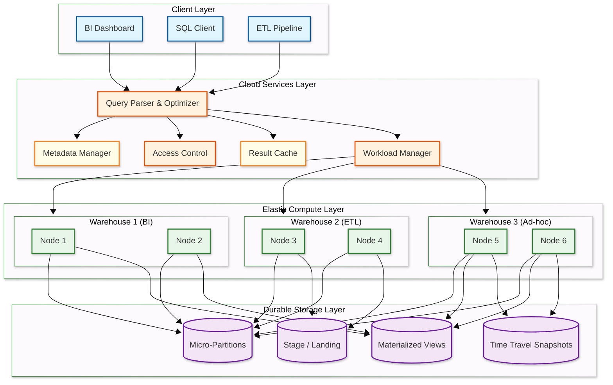
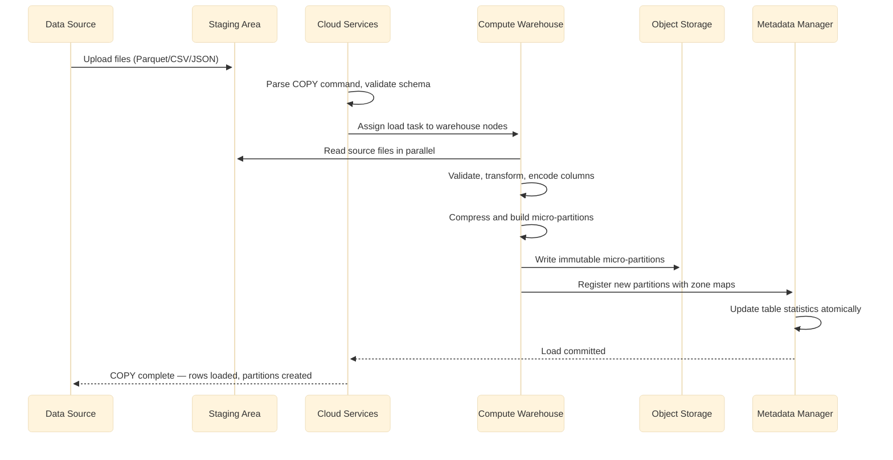
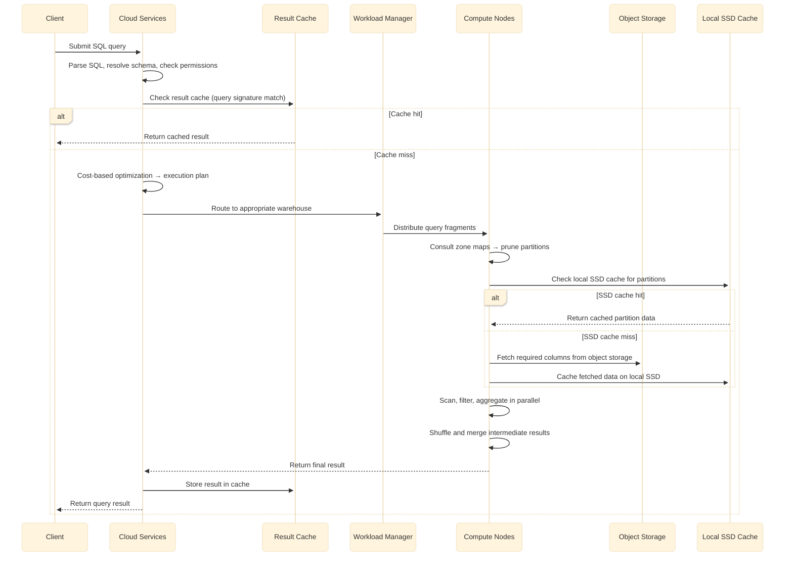

# High-Level Design — Data Warehouse

## System Architecture

### Component Descriptions

| Component | Responsibility |
|-----------|---------------|
| **Cloud Services Layer** | Stateless, always-on: query parsing, optimization, metadata management, authentication, result caching, and workload routing |
| **Metadata Manager** | Maintains table schemas, micro-partition statistics (zone maps), access policies, and query history |
| **Workload Manager** | Routes queries to appropriate compute warehouses based on workload class, priority, and resource availability |
| **Elastic Compute Layer** | Stateless compute clusters (warehouses) that can be independently started, stopped, and resized; each warehouse is a set of nodes that execute query fragments in parallel |
| **Durable Storage Layer** | Immutable micro-partitions stored in cloud object storage with 11-nines durability; shared across all compute warehouses |

---

## Data Flow

### Ingestion Path (Bulk Load)

**Ingestion key points:**

1. **Staging isolation** — Source files are uploaded to a staging area (internal or external) before being processed
2. **Parallel processing** — Each compute node processes a subset of source files simultaneously
3. **Columnar encoding** — During load, the engine selects optimal encoding per column (dictionary, RLE, delta, bit-packing)
4. **Immutable writes** — New data creates new micro-partitions; existing partitions are never modified
5. **Atomic commit** — All new partitions become visible simultaneously via metadata pointer swap

### Query Path (Analytical Query)

---

## Key Architectural Decisions

### 1. Separation of Compute and Storage vs. Coupled Architecture

| Aspect | Separated (Cloud-Native) | Coupled (Traditional MPP) |
|--------|-------------------------|--------------------------|
| Scaling independence | Compute and storage scale independently | Must scale both together |
| Workload isolation | Separate warehouses share same data | Workloads compete for same resources |
| Cost efficiency | Pay only for active compute | Always-on cluster cost |
| Cold start latency | Seconds to provision; cache warm-up needed | Immediate — data is local |
| Data sharing | Zero-copy across warehouses | Requires data replication |

**Decision:** Separation of compute and storage. The ability to scale compute elastically, run isolated workloads over the same data, and pay only for active resources outweighs the cold-start penalty, which is mitigated by multi-tier caching (result cache → local SSD → object storage).

### 2. Immutable Micro-Partitions vs. Mutable Row Storage

| Aspect | Immutable Micro-Partitions | Mutable Row Storage |
|--------|--------------------------|-------------------|
| Write pattern | Append-only; updates create new partitions | In-place updates |
| Concurrency | No read-write contention (snapshot isolation) | Lock contention on hot rows |
| Time travel | Free — old partitions retained by policy | Expensive — requires separate versioning |
| Compression | Excellent — entire partition compressed at once | Poor — random updates fragment compression |
| Update cost | Expensive — rewrite entire partition for single-row update | Cheap per row |

**Decision:** Immutable micro-partitions. Analytical workloads are append-heavy with rare updates. Immutability enables zero-contention reads, excellent compression, and trivial time travel. The occasional UPDATE/DELETE is handled by copy-on-write at the partition level.

### 3. Columnar vs. Row-Oriented Storage

| Aspect | Columnar | Row-Oriented |
|--------|----------|-------------|
| Analytical query I/O | Read only needed columns (~3 of 50 = 94% I/O saved) | Read entire rows regardless |
| Compression ratio | 10:1 typical (homogeneous data per column) | 3:1 typical (mixed types per row) |
| Point lookups | Inefficient — must reconstruct row from columns | O(1) — row stored contiguously |
| Write throughput | Lower — must decompose rows into columns | Higher — append entire row |
| CPU efficiency | Vectorized processing on column batches | Row-at-a-time processing |

**Decision:** Columnar storage. The warehouse's primary workload is analytical queries that scan millions of rows but touch few columns. Columnar storage with vectorized execution provides 10-100x throughput improvement over row storage for this workload.

### 4. Eager Materialization vs. Late Materialization

| Aspect | Eager (construct tuples early) | Late (carry column references) |
|--------|-------------------------------|-------------------------------|
| Memory usage | Higher — materializes full rows early | Lower — carries only column offsets |
| Filter efficiency | All columns available for filtering | Filter on compressed columns, materialize only survivors |
| Join performance | Join on full tuples | Join on keys, fetch remaining columns post-join |
| Implementation complexity | Simpler | More complex column tracking |

**Decision:** Late materialization. Most analytical queries filter aggressively (WHERE clause eliminates 90%+ of rows) before projecting columns. Late materialization avoids reading and decompressing columns that will be discarded by filters.

### 5. Caching Strategy

| Cache Layer | What It Caches | Scope | Eviction |
|-------------|---------------|-------|----------|
| Result cache | Complete query results by query signature | Cross-warehouse (shared) | Invalidated on underlying data change |
| Metadata cache | Zone maps, schemas, statistics | Cloud services layer | LRU with refresh on DDL |
| Local SSD cache | Raw micro-partition data | Per compute node | LRU; survives warehouse suspend/resume |
| Partition header cache | Column statistics, Bloom filters | Per compute node | Pinned in memory |

---

## Architecture Pattern Checklist

- [x] **Sync vs Async communication** — Synchronous for interactive queries; async for bulk loading and materialized view refresh
- [x] **Event-driven vs Request-response** — Request-response for SQL queries; event-driven for ingestion notifications and view invalidation
- [x] **Push vs Pull model** — Pull-based query execution (compute pulls partitions from storage); push-based cache invalidation on data change
- [x] **Stateless vs Stateful services** — Cloud services and compute are stateless; all durable state lives in object storage and metadata store
- [x] **Read-heavy vs Write-heavy** — Read-heavy (100:1); columnar storage and caching optimize the read path
- [x] **Real-time vs Batch processing** — Batch-first with micro-batch for near-real-time freshness (< 60s latency)
- [x] **Edge vs Origin processing** — Origin processing; compute nodes pull data from centralized storage, no edge caching of analytical data
