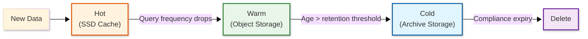

# Scalability & Reliability — Data Warehouse

## Scalability

### Horizontal vs. Vertical Scaling

| Aspect | Vertical Scaling | Horizontal Scaling |
|--------|-----------------|-------------------|
| Approach | Larger compute nodes (more CPU, RAM) | More compute nodes per warehouse |
| Query performance | More memory for joins/sorts; fewer spills | More parallelism for scan-heavy queries |
| Capacity ceiling | Limited by largest available instance | Theoretically unlimited |
| Cost model | Linear (2x resources = 2x cost) | Sub-linear (adding nodes adds parallelism) |
| Warm-up time | Seconds (resize existing cluster) | Seconds (add nodes, populate cache gradually) |
| When to use | Complex queries hitting memory limits | High concurrency or scan-heavy workloads |

**Strategy:** Use vertical scaling (larger warehouse size) when individual queries are memory-bound (large joins, sorts). Use horizontal scaling (more clusters or multi-cluster warehouses) when the bottleneck is concurrent query throughput.

### Elastic Compute Scaling

```
FUNCTION auto_scale_warehouse(warehouse, metrics):
    // Scale UP: add compute clusters when queries are queuing
    IF metrics.query_queue_depth > QUEUE_THRESHOLD
       AND metrics.queue_wait_time_p95 > 5_SECONDS:
        new_cluster_count = MIN(
            warehouse.current_clusters + 1,
            warehouse.max_clusters
        )
        provision_cluster(warehouse, new_cluster_count)
        // New cluster starts accepting queued queries immediately
        // SSD cache warms organically from query traffic

    // Scale DOWN: remove idle clusters to save cost
    IF metrics.cluster_utilization < 0.1
       AND metrics.active_queries == 0
       AND time_since_last_query > IDLE_TIMEOUT:
        IF warehouse.current_clusters > warehouse.min_clusters:
            drain_cluster(warehouse, warehouse.current_clusters - 1)
            // Drain: stop accepting new queries, wait for in-flight to complete

    // Auto-suspend: pause entire warehouse when idle
    IF ALL clusters idle for > warehouse.auto_suspend_timeout:
        suspend_warehouse(warehouse)
        // Compute cost drops to zero; SSD cache retained for resume
```

### Storage Scaling

Storage scales independently of compute through object storage:

| Storage Tier | Use Case | Latency | Cost Model |
|-------------|----------|---------|------------|
| Hot (NVMe SSD cache) | Frequently queried partitions | ~100 μs | Per node, included in compute cost |
| Warm (object storage, standard) | Active tables within retention window | ~50 ms first byte | Per GB/month |
| Cold (object storage, archive) | Historical data, compliance retention | ~hours (retrieval) | Per GB/month (5-10x cheaper) |

**Tiered storage lifecycle:**



### Multi-Cluster Warehouse Architecture

```
┌─────────────────────────────────────────────────────────────┐
│ Workload Manager                                             │
│ - Routes queries to least-loaded cluster                     │
│ - Provisions/deprovisions clusters based on queue depth      │
│ - Scaling policy: Standard (favor performance) or            │
│   Economy (favor cost — wait before scaling)                 │
└───────┬──────────┬──────────┬──────────┬────────────────────┘
        │          │          │          │
   ┌────▼───┐ ┌───▼────┐ ┌───▼────┐ ┌───▼────┐
   │Cluster 1│ │Cluster 2│ │Cluster 3│ │Cluster N│
   │ (base)  │ │ (auto)  │ │ (auto)  │ │ (auto)  │
   │ 4 nodes │ │ 4 nodes │ │ 4 nodes │ │ 4 nodes │
   │ Always  │ │ On-     │ │ On-     │ │ On-     │
   │ running │ │ demand  │ │ demand  │ │ demand  │
   └────┬────┘ └────┬────┘ └────┬────┘ └────┬────┘
        │           │           │           │
        └───────────┴───────────┴───────────┘
                        │
            ┌───────────▼───────────┐
            │  Shared Object Storage │
            │  (Micro-Partitions)    │
            └───────────────────────┘
```

All clusters read the same data in object storage — no data duplication. Each cluster maintains its own SSD cache that warms independently.

### Caching Layers

| Layer | Component | Strategy | Scope | Size |
|-------|-----------|----------|-------|------|
| L1 | Result cache | Exact query match; invalidated on data change | Cross-warehouse | 100 GB shared |
| L2 | Metadata cache | Table schemas, zone maps, statistics | Cloud services layer | 50 GB per node |
| L3 | Local SSD cache | Micro-partition data | Per compute node | 2 TB NVMe per node |
| L4 | Columnar buffer | Decompressed column batches in memory | Per query execution | Up to 80% of node RAM |

### Hot Spot Mitigation

| Hot Spot Type | Cause | Mitigation |
|--------------|-------|------------|
| Single large table scan | One table dominates all queries | Partition across all nodes; materialized views for common aggregations |
| Metadata hot key | Popular table schema accessed by every query | Metadata cache with long TTL; read replicas |
| SSD cache thrashing | Working set exceeds cache capacity | Prioritize cache for high-frequency queries; LRU with frequency weighting |
| Skewed partition sizes | Data distribution creates oversized partitions | Automatic re-partitioning to target 50-500 MB per partition |

### Auto-Scaling Triggers

| Metric | Threshold | Action |
|--------|-----------|--------|
| Query queue time (p95) | > 5 seconds sustained | Add compute cluster |
| Cluster CPU utilization | > 80% sustained 10 min | Scale up warehouse size |
| SSD cache hit ratio | < 60% | Add nodes (more cache) or scale up (more RAM) |
| Spill-to-disk ratio | > 20% of data processed | Scale up warehouse size (more memory) |
| Query queue depth | 0 for 10+ minutes | Remove surplus compute cluster |
| All clusters idle | > auto-suspend timeout | Suspend warehouse |

---

## Reliability & Fault Tolerance

### Single Points of Failure

| Component | SPOF Risk | Mitigation |
|-----------|-----------|------------|
| Cloud services layer | Loss stops query parsing and routing | Multiple stateless instances behind load balancer |
| Metadata store | Loss prevents schema resolution | 3-node replicated key-value store with Raft consensus |
| Compute node | Loss interrupts in-flight queries | Stateless; queries retried on remaining nodes |
| Object storage | Loss causes data loss | Cloud-provider managed 11-nines durability across AZs |
| Result cache | Loss causes performance degradation | Distributed cache with replication; cache miss falls through to compute |

### Redundancy Strategy

- **Cloud services:** 3+ stateless instances across availability zones with health-check routing
- **Metadata store:** 3-node Raft cluster with cross-AZ placement; write quorum of 2
- **Compute clusters:** Each warehouse has N nodes; loss of 1 node redistributes work to N-1 with automatic retry
- **Object storage:** Cloud-managed, triple-replicated across availability zones by default
- **Result cache:** Distributed cache ring with 2x replication

### Failover Mechanisms

**Compute Node Failure:**

```
1. Workload manager detects node heartbeat timeout (10 seconds)
2. In-flight query fragments on failed node are identified
3. Fragments reassigned to surviving nodes in the same cluster
4. Surviving nodes fetch required partitions (from SSD cache or object storage)
5. Query resumes from last checkpoint (no full restart needed)
6. Replacement node provisioned in background

Total query impact: 10-30 second delay for affected queries
Zero impact on queries running on other nodes
```

**Metadata Store Failure:**

```
1. Raft follower detects leader heartbeat timeout (5 seconds)
2. Election completes in < 5 seconds
3. New leader serves metadata requests
4. Cloud services layer retries pending metadata lookups

Total impact: < 10 seconds of metadata unavailability
Queries already compiled and executing are unaffected
```

### Circuit Breaker Pattern

| Circuit | Trigger | Open Duration | Fallback |
|---------|---------|---------------|----------|
| Object storage fetch | > 50% timeouts in 60s | 30 seconds | Serve from SSD cache only; reject uncached queries |
| Metadata service | > 3 failures in 30s | 15 seconds | Serve from local metadata cache (may be slightly stale) |
| Cross-cluster shuffle | > 30% failures in 60s | 30 seconds | Execute join locally (slower) or return partial results |
| Result cache | > 5 failures in 30s | 60 seconds | Bypass cache; execute queries directly |

### Retry Strategy

| Operation | Retry Count | Backoff | Notes |
|-----------|-------------|---------|-------|
| Object storage read | 3 | Exponential (200ms, 400ms, 800ms) | Switch to different AZ endpoint on retry |
| Query fragment execution | 2 | Immediate (reassign to different node) | Fragment-level retry, not full query |
| Metadata lookup | 3 | Exponential (100ms, 200ms, 400ms) | Retry against different replica |
| Query compilation | 1 | Immediate | Fall back to simplified plan if optimization times out |

### Graceful Degradation

| Severity | Condition | Degradation |
|----------|-----------|-------------|
| Level 1 | Single compute node down | Query fragments redistributed; slight latency increase |
| Level 2 | Entire compute cluster down | Queries routed to other clusters; auto-provision replacement |
| Level 3 | Metadata store degraded | Serve from cache; new table DDL blocked |
| Level 4 | Object storage latency spike | SSD-cached queries unaffected; cold queries delayed |
| Level 5 | Full region outage | Failover to standby region; stale data until replication catches up |

### Bulkhead Pattern

Separate resource pools for different workload types:

| Bulkhead | Resources | Purpose |
|----------|-----------|---------|
| BI dashboards | Dedicated warehouse, priority routing | Protect dashboard latency from ad-hoc queries |
| ETL / loading | Dedicated warehouse, isolated compute | Prevent bulk loads from starving query workloads |
| Ad-hoc analytics | Separate warehouse, elastic scaling | Allow exploratory queries without impacting production |
| System operations | Reserved metadata capacity | Schema changes, access policy updates |

---

## Disaster Recovery

### Recovery Objectives

| Metric | Target | Strategy |
|--------|--------|----------|
| RPO (same region) | 0 | Data in object storage with immediate consistency |
| RTO (same region) | < 60 seconds | Stateless compute re-provisioned from object storage |
| RPO (cross-region) | < 5 minutes | Asynchronous replication of object storage and metadata |
| RTO (cross-region) | < 15 minutes | Standby metadata store promoted + compute provisioned |

### Backup Strategy

| Backup Type | Frequency | Retention | Method |
|-------------|-----------|-----------|--------|
| Time travel snapshots | Continuous | 1-90 days (configurable) | Retain old micro-partitions in object storage |
| Metadata snapshot | Continuous | 30 days | Replicated metadata store with point-in-time recovery |
| Cross-region replication | Continuous | Same as primary | Async object storage replication + metadata sync |
| Compliance archive | Monthly | 7 years | Cold storage with write-once-read-many (WORM) policy |

### Multi-Region Considerations

| Topology | Write Latency | Read Latency | Consistency | Complexity |
|----------|--------------|-------------|-------------|------------|
| Single-region, multi-AZ | Low | Low | Strong | Low |
| Active-passive cross-region | Low in primary | Low in primary | Strong in primary | Medium |
| Active-active cross-region | Medium | Low (local reads) | Eventual | Very High |

**Recommendation:** Active-passive for most analytical workloads. Data is ingested and managed in the primary region; the standby region maintains a replicated copy for disaster recovery. Active-active is rarely justified for data warehouses because analytical workloads are latency-tolerant and data freshness requirements (< 60s) are easily met with single-region deployment.
