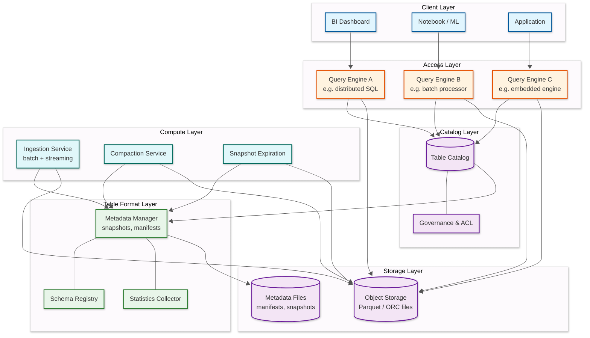
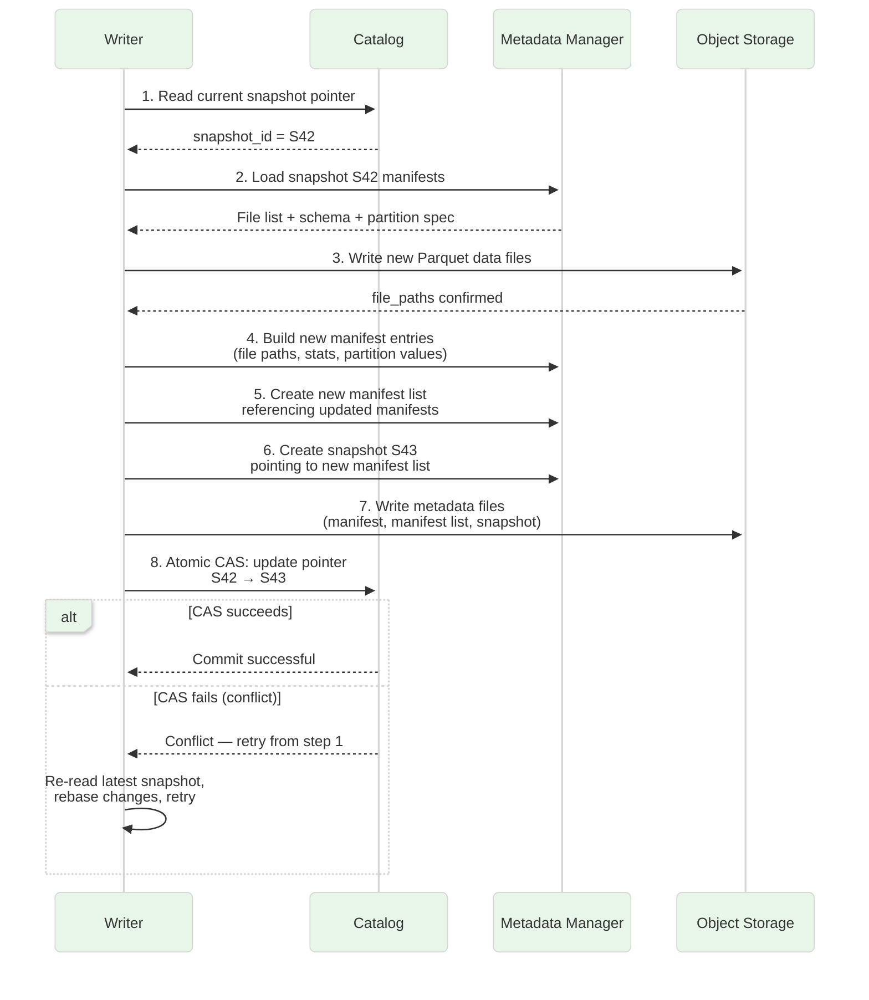
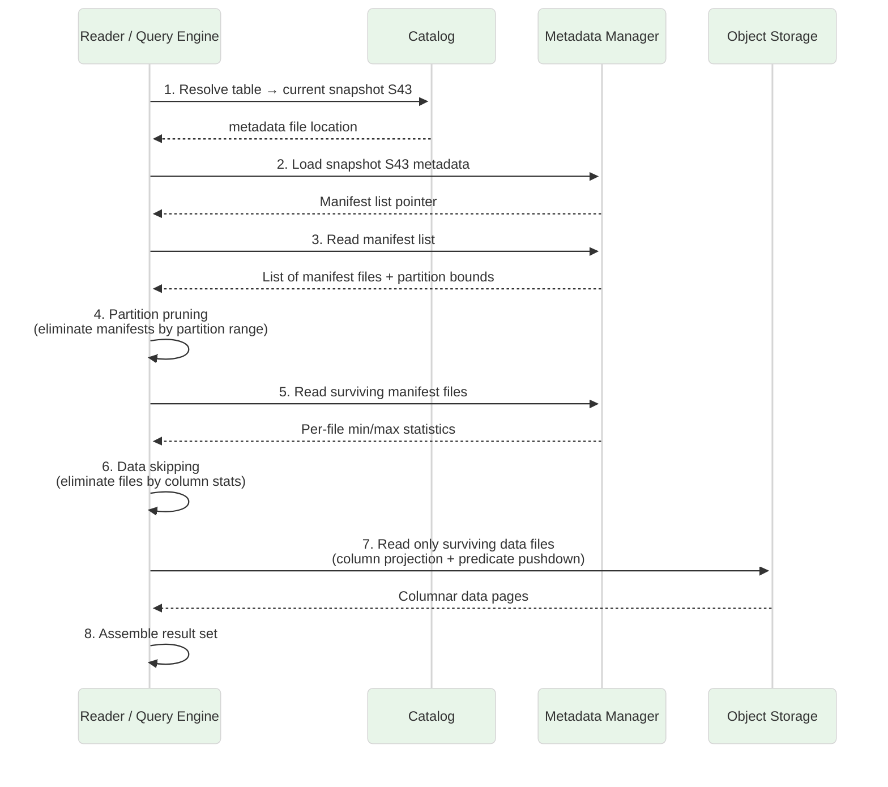

# High-Level Design — Data Lakehouse Architecture

## System Architecture

## Component Descriptions

### Catalog Layer

The catalog is the **single source of truth** for table identity. It maps a table name to the location of its current metadata file (the latest snapshot pointer). All commits go through the catalog to guarantee atomicity — a compare-and-swap on the metadata pointer ensures only one writer wins per commit cycle.

- **Table Catalog**: Stores table name -> current metadata location mapping. Implements atomic pointer updates via CAS or sequential log append.
- **Governance & ACL**: Enforces role-based access control, column-level masking, and credential vending so query engines receive scoped, short-lived tokens for object storage access.

### Table Format Layer

This layer sits logically between the catalog and the raw data files. It owns the metadata hierarchy that makes ACID possible on immutable object storage.

- **Metadata Manager**: Maintains the chain of snapshots -> manifest lists -> manifest files -> data file references. Each commit produces a new immutable snapshot.
- **Schema Registry**: Tracks column IDs, types, nullability, and evolution history. Column-ID-based tracking (rather than name or position) ensures correctness across renames and reorders.
- **Statistics Collector**: Gathers per-file and per-column statistics (min, max, null count, value count) and writes them into manifest entries for data-skipping decisions.

### Compute Layer

- **Ingestion Service**: Accepts batch loads and streaming micro-batches; writes Parquet files to object storage and commits new file references atomically.
- **Compaction Service**: Reads small files, rewrites them into optimally-sized files (128 – 256 MB), applies Z-ordering or sort-based clustering, and commits a replacement snapshot.
- **Snapshot Expiration (Vacuum)**: Removes data files that are no longer referenced by any live snapshot after a configurable retention period.

### Storage Layer

- **Object Storage**: Holds the actual data files (Parquet, ORC, or Avro). Provides virtually infinite capacity, high durability (11 nines), and pay-per-use economics.
- **Metadata Files**: Stores manifests, manifest lists, and snapshot metadata as small Avro or JSON files alongside data files. The table format layer reads these to reconstruct table state.

## Data Flow

### Write Path (ACID Commit)

**Key properties of the write path:**

1. **Optimistic concurrency** — writers proceed without locks; conflicts detected only at commit time (step 8).
2. **Immutable files** — new data files are written; existing files are never modified.
3. **Atomic visibility** — until the CAS succeeds, no reader sees the new files; after CAS, all readers see the complete set.
4. **Retry safety** — failed writers leave orphan data files that are cleaned up by the vacuum process.

### Read Path (Snapshot Isolation)

**Key properties of the read path:**

1. **Snapshot isolation** — the reader pins snapshot S43; concurrent writes creating S44 do not affect this query.
2. **Progressive pruning** — manifests are pruned first (partition-level), then files (column-stats-level), minimizing I/O.
3. **No listing** — the reader never lists object-storage directories; all file references come from manifests, avoiding eventual-consistency hazards.
4. **Merge-on-read** (if applicable) — for tables using the MoR strategy, the reader merges base data files with delete files or log files before returning results.

## Key Design Decisions

| Decision | Choice | Trade-off |
|:---|:---|:---|
| **File-level tracking vs. directory listing** | File-level tracking in manifests | Higher metadata overhead but eliminates eventual-consistency issues with directory listings |
| **Optimistic concurrency vs. pessimistic locking** | OCC with CAS at commit | Higher conflict rate under heavy contention but zero lock overhead for the common case |
| **Copy-on-Write vs. Merge-on-Read** | Configurable per table | CoW optimizes reads at cost of write amplification; MoR optimizes writes but adds read-time merge cost |
| **Columnar format (Parquet) vs. row-oriented** | Parquet as default | Best for analytical scans; row-oriented access requires full-row reconstruction |
| **Centralized catalog vs. storage-level metadata** | Centralized catalog (REST protocol) | Single authority for governance and multi-engine consistency; catalog becomes an availability dependency |
| **Hidden partitioning vs. explicit partitioning** | Hidden (partition transforms derived from source columns) | Users write queries on source columns; physical layout is transparent and evolvable |
| **Embedded statistics vs. external statistics store** | Embedded in manifest files | Co-located with file references for single-fetch planning; limits statistics richness |

## Architecture Pattern Checklist

| Pattern | Choice | Notes |
|:---|:---|:---|
| Synchronous / Asynchronous | Async writes, sync metadata commit | Data files written in parallel; single atomic commit |
| Event-driven | Yes | Commit events trigger compaction, cache invalidation, downstream consumers |
| Push / Pull | Pull for reads, push for ingest | Query engines pull data; ingestion pushes files to storage |
| Stateless / Stateful | Stateless compute, stateful catalog | Query engines are ephemeral; catalog and object storage hold state |
| Read-heavy / Write-heavy | Read-heavy (typical 10:1 – 100:1) | Optimized for analytical scan throughput |
| Real-time / Batch | Unified | Same table supports streaming micro-batch ingest and batch analytical queries |
| Edge / Origin | Origin (centralized storage) | Object storage in a single region; multi-region via replication |
