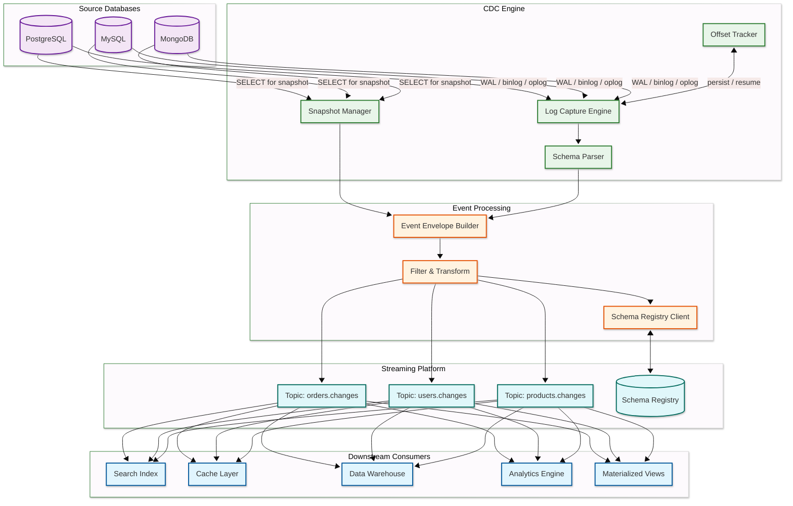
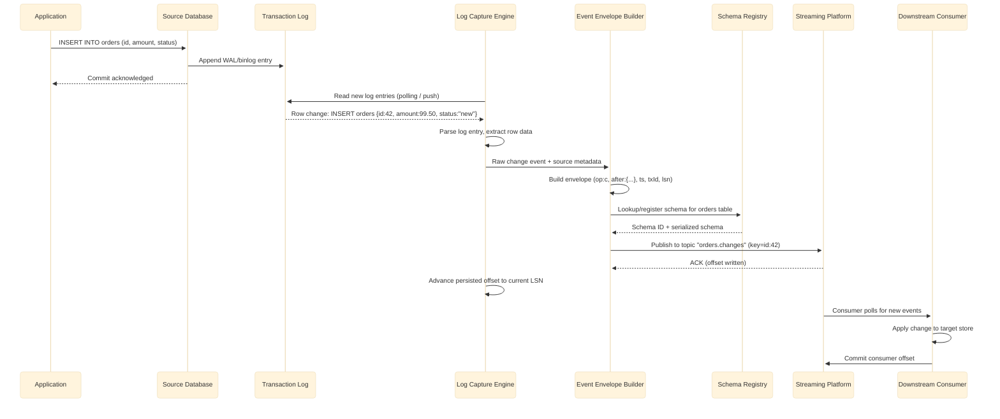
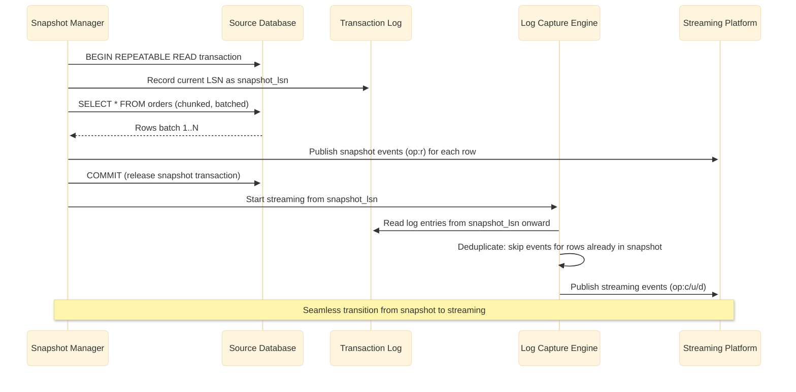

# High-Level Design — Change Data Capture (CDC) System

## System Architecture

### Component Descriptions

| Component | Role |
|-----------|------|
| **Source Databases** | The upstream databases whose changes are captured. Each exposes its transaction log for reading. |
| **Log Capture Engine** | Core component that connects to the source database's replication slot (PostgreSQL) or binlog reader (MySQL) and receives a continuous stream of row-level change events. |
| **Snapshot Manager** | Handles initial full-table loads and on-demand incremental snapshots. Reads table data via SELECT queries while coordinating with the log capture engine to ensure no gaps or duplicates. |
| **Schema Parser** | Extracts DDL changes from the transaction log, detects column additions/removals/type changes, and updates the schema history. |
| **Offset Tracker** | Persists the current log position (LSN, binlog file:position, GTID set) to durable storage, enabling crash recovery and exactly-once restart. |
| **Event Envelope Builder** | Wraps raw database changes into a standardized envelope format containing operation type, before/after images, source metadata, timestamp, and transaction ID. |
| **Filter & Transform** | Applies configurable event filtering (include/exclude tables, columns), lightweight transformations (field masking, renaming), and routing rules (table-to-topic mapping). |
| **Schema Registry** | Centralized schema store that versions event schemas (Avro, Protobuf, JSON Schema) and enforces compatibility rules across schema evolution. |
| **Streaming Platform** | Durable, partitioned log (Kafka-like) that stores change events with configurable retention. Provides ordering guarantees per partition and enables multiple consumers to independently read at their own pace. |
| **Downstream Consumers** | Sink connectors or applications that read change events and apply them to target systems (search indexes, caches, warehouses, analytics). |

---

## Data Flow

### Change Capture Path (Steady-State Streaming)

**Streaming path key points:**

1. **Zero-impact capture** — CDC reads the existing transaction log; no triggers, no polling queries, no load on the source database
2. **Commit-order preservation** — Events are emitted in the order they were committed, maintaining causality
3. **Schema registration** — Each event's schema is registered/looked up in the schema registry for serialization compatibility
4. **Idempotent publishing** — Producer uses idempotent writes to the streaming platform (deduplication by sequence number)
5. **Offset advancement** — Connector offset is advanced only after successful publish, ensuring no events are lost

### Snapshot Path (Initial Load)

**Snapshot path key points:**

1. **Consistent snapshot** — Uses a repeatable-read transaction to get a point-in-time consistent view of the table
2. **LSN recording** — The exact log position at snapshot start is recorded so streaming can resume from that exact point
3. **Chunked reads** — Large tables are read in configurable chunks to avoid long-running transactions and memory pressure
4. **Deduplication at handoff** — Changes that occurred during the snapshot (between snapshot_lsn and snapshot completion) are deduplicated to prevent duplicate events
5. **Operation type** — Snapshot events use operation type "r" (read) to distinguish them from streaming events ("c" create, "u" update, "d" delete)

---

## Key Architectural Decisions

### 1. Log-Based CDC vs. Query-Based CDC vs. Trigger-Based CDC

| Aspect | Log-Based CDC | Query-Based CDC | Trigger-Based CDC |
|--------|--------------|----------------|-------------------|
| Source impact | Zero (reads existing log) | High (polling queries consume CPU/IO) | High (triggers fire on every mutation) |
| Capture completeness | All changes including schema migrations | Only changes visible at poll time | All changes but only in trigger-equipped tables |
| Delete capture | Yes (log records deletes) | No (deleted rows are absent at poll time) | Yes (trigger fires on DELETE) |
| Latency | Sub-second (continuous log tailing) | Poll-interval dependent (seconds to minutes) | Sub-second but synchronous overhead |
| Schema changes | Captured from log | Not captured | Requires trigger updates |
| Operational complexity | Medium (requires replication slot configuration) | Low (just SQL queries) | High (trigger management across all tables) |

**Decision:** Log-based CDC. The zero-impact on source databases, complete change capture (including deletes and schema changes), and sub-second latency make it the only viable approach for production event-driven architectures.

### 2. Push vs. Pull Event Delivery to Consumers

| Aspect | Push (Broker → Consumer) | Pull (Consumer → Broker) |
|--------|--------------------------|--------------------------|
| Backpressure handling | Complex (broker must manage per-consumer rate) | Natural (consumer controls its own pace) |
| Consumer failure | Messages buffer or drop | Messages retained; consumer resumes |
| Ordering | Harder to guarantee per-consumer | Consumer controls read order |
| Latency | Lower (immediate delivery) | Slightly higher (poll interval) |

**Decision:** Pull-based consumption. Consumers poll the streaming platform at their own pace, enabling natural backpressure, independent consumer groups, and replay from any offset. This is the standard Kafka consumer model.

### 3. Single Event Stream vs. Per-Table Topics

| Aspect | Single Stream | Per-Table Topics |
|--------|--------------|-----------------|
| Ordering | All events globally ordered | Per-table ordering (sufficient for most use cases) |
| Consumer flexibility | All consumers see all events | Consumers subscribe only to needed tables |
| Scalability | Single bottleneck | Independent parallelism per table |
| Topic management | Simple (one topic) | More topics to manage (automated via naming convention) |

**Decision:** Per-table topics with a naming convention (e.g., `{server}.{database}.{table}`). This enables independent scaling, selective consumption, and per-table retention policies while keeping each topic's ordering semantics clear.

### 4. Schema Serialization Format

| Aspect | Avro | Protobuf | JSON Schema |
|--------|------|----------|-------------|
| Binary size | Compact | Very compact | Verbose |
| Schema evolution | Excellent (forward + backward) | Good (forward + backward) | Limited |
| Human readability | Requires deserialization | Requires deserialization | Human-readable |
| Tooling ecosystem | Mature (Kafka-native) | Growing | Universal |
| Registry support | First-class | First-class | Supported |

**Decision:** Avro as the default serialization format with schema registry integration. Avro's compact binary format, excellent schema evolution support, and native Kafka ecosystem integration make it the strongest choice. JSON Schema available as an option for debugging and development.

### 5. Exactly-Once Strategy

**Decision:** Achieve exactly-once end-to-end through the combination of: (1) idempotent producers (streaming platform deduplication), (2) transactional offset commits (connector offset and event publish in a single atomic operation), and (3) idempotent consumers (sink writes are idempotent using primary keys). This avoids the need for distributed two-phase commits.

### 6. Connector Deployment Model

| Aspect | Embedded in Application | Standalone Workers | Managed Service |
|--------|------------------------|-------------------|-----------------|
| Operational overhead | Low (co-located with app) | Medium (separate cluster) | Minimal |
| Scalability | Limited by app resources | Independent scaling | Auto-scaling |
| Fault isolation | Connector failures affect app | Isolated failure domain | Fully isolated |
| Use case | Single-service CDC | Multi-service CDC platform | Enterprise-wide CDC |

**Decision:** Standalone distributed worker cluster (Kafka Connect model) for production. Provides fault isolation from source applications, independent scaling, automatic task rebalancing on worker failure, and centralized management of all connectors.

---

## Architecture Pattern Checklist

- [x] **Sync vs Async communication** — Fully asynchronous: log tailing, event streaming, and consumer polling are all async
- [x] **Event-driven vs Request-response** — Event-driven throughout: changes become events that flow through the pipeline
- [x] **Push vs Pull model** — Pull at both ends: CDC pulls from WAL; consumers pull from streaming platform
- [x] **Stateless vs Stateful services** — Stateful connectors (maintain offsets); stateless transformers; stateful consumers
- [x] **Read-heavy vs Write-heavy** — Write-heavy at capture and delivery; read-heavy at consumer side
- [x] **Real-time vs Batch processing** — Real-time streaming with optional micro-batch semantics at consumers
- [x] **Edge vs Origin processing** — Origin processing: transformations happen close to the source, before fan-out to multiple consumers
