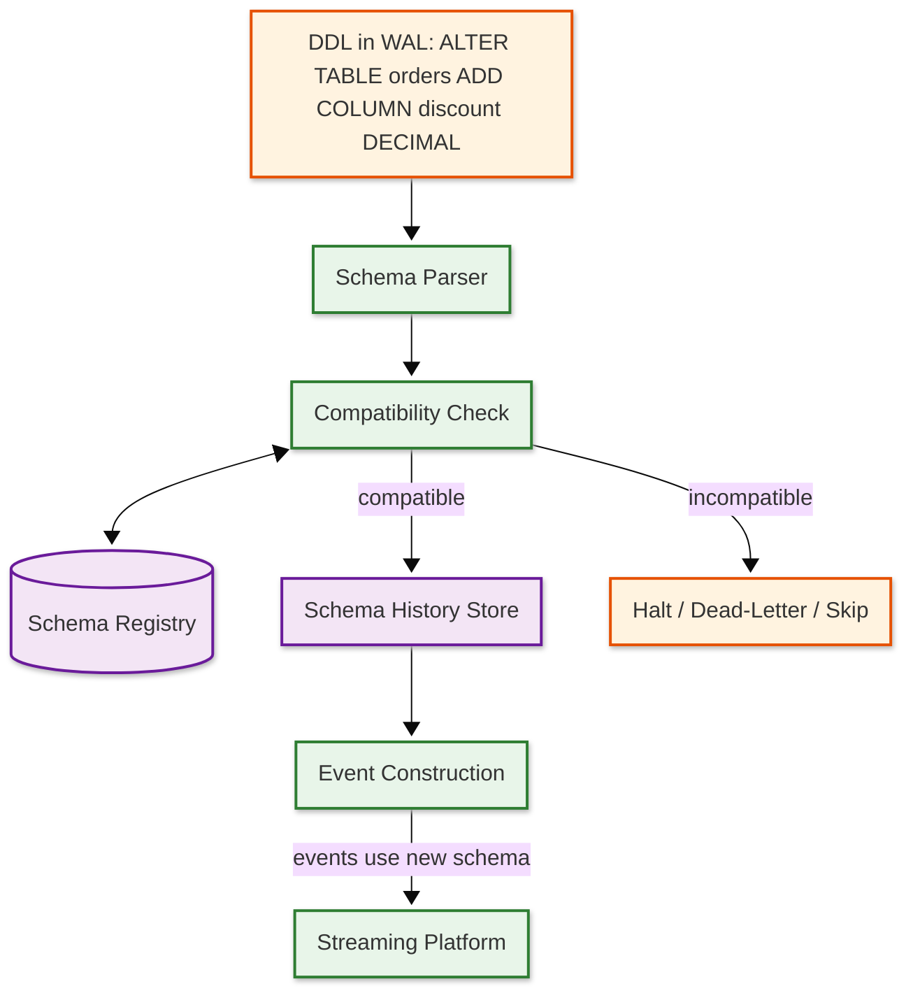

# Deep Dive & Bottlenecks — Change Data Capture (CDC) System

## Critical Component 1: WAL Retention and Disk Pressure

### Why Is This Critical?

The CDC connector reads from the source database's transaction log (WAL in PostgreSQL, binlog in MySQL). The database retains log segments as long as there is an active consumer (replication slot) that hasn't confirmed processing. If the CDC connector falls behind — due to downstream outages, slow consumers, or connector failures — the database must retain all unprocessed log segments, and WAL files accumulate indefinitely. On PostgreSQL, a stalled replication slot can fill the disk in hours on a write-heavy system, leading to database outage when the disk is full and no more transactions can be committed.

### How It Works Internally

**PostgreSQL WAL Retention:**

```
Normal Operation:
  WAL Segment 001 → confirmed by CDC → eligible for recycling ✓
  WAL Segment 002 → confirmed by CDC → eligible for recycling ✓
  WAL Segment 003 → being read by CDC → retained
  WAL Segment 004 → not yet read → retained

Stalled Connector (offline for 6 hours):
  WAL Segment 001 → NOT confirmed → RETAINED (cannot recycle)
  WAL Segment 002 → NOT confirmed → RETAINED
  ...
  WAL Segment 500 → NOT confirmed → RETAINED
  WAL Segment 501 → current → being written
  → 500 segments × 16 MB = 8 GB accumulated and growing
```

**MySQL Binlog Retention:**

MySQL binlog retention is controlled by `binlog_expire_logs_seconds` (or `expire_logs_days`). Unlike PostgreSQL's replication slot model, MySQL does not automatically retain binlogs for a specific consumer. If binlogs expire before the CDC connector processes them, events are permanently lost.

### Failure Modes

1. **PostgreSQL disk exhaustion** — A stalled replication slot prevents WAL recycling; disk fills up; database stops accepting writes.
   - **Mitigation:** Configure `max_slot_wal_keep_size` to cap WAL retention per slot. Monitor replication slot lag and alert at thresholds. Implement automatic slot drop after configurable retention limit (with data loss acknowledgment). Use heartbeat events to advance the slot even when tables have no writes.

2. **MySQL binlog gap** — Binlogs expire before CDC processes them; connector loses its position and cannot resume streaming.
   - **Mitigation:** Set binlog retention longer than maximum expected downtime. Monitor binlog reader position relative to the oldest available binlog. If gap is detected, trigger automatic re-snapshot of affected tables.

3. **Heartbeat starvation** — Tables with infrequent writes cause the replication slot to appear stalled even though the connector is healthy, because no new WAL entries reference that slot.
   - **Mitigation:** CDC connectors emit periodic heartbeat events by writing a timestamp to a dedicated heartbeat table, generating WAL entries that advance the slot position.

### Monitoring Points

| Metric | Alert Threshold | Action |
|--------|----------------|--------|
| `pg_replication_slots.wal_status` | "reserved" → "extended" → "lost" | Investigate connector lag; consider slot drop |
| Replication slot lag (bytes) | > 1 GB | Warn; investigate downstream bottleneck |
| Replication slot lag (bytes) | > 10 GB | Critical; consider emergency slot drop |
| WAL disk usage (%) | > 80% | Critical; immediate investigation |
| Binlog reader position age | > 12 hours | Warn; verify connector health |

---

## Critical Component 2: Snapshot-to-Streaming Handoff

### Why Is This Critical?

The snapshot-to-streaming handoff is the most dangerous moment in a CDC connector's lifecycle. During initial snapshot, the connector reads the full table state via SELECT queries. Simultaneously, the source database continues accepting writes. When the snapshot completes, the connector must transition to streaming from the transaction log at the exact position where the snapshot began — without duplicating events for changes that occurred during the snapshot and without missing events that happened between the snapshot start and the streaming start.

### How It Works Internally

**The Handoff Problem:**

```
Timeline:
  T1: Snapshot begins, records LSN = 1000
  T2: Application writes Order #42 (LSN 1005) → included in snapshot SELECT
  T3: Application updates Order #42 (LSN 1010) → NOT in snapshot (already past that row)
  T4: Snapshot completes
  T5: Streaming begins from LSN 1000
  T6: Streaming processes LSN 1005 (Order #42 INSERT) → DUPLICATE with snapshot
  T7: Streaming processes LSN 1010 (Order #42 UPDATE) → NOT duplicate, must emit
```

**Resolution approach:**

```
Classic Snapshot (Lock-Based):
  1. Acquire global read lock (brief)
  2. Record current LSN
  3. Start REPEATABLE READ transaction
  4. Release global lock
  5. Read all tables within the transaction (consistent snapshot at recorded LSN)
  6. Commit transaction
  7. Start streaming from recorded LSN
  8. For events between recorded LSN and snapshot completion:
     - If event's row was included in snapshot → skip (snapshot has the later state)
     - If event's row was NOT in snapshot → emit

Watermark Snapshot (Lock-Free, DBLog approach):
  1. No global lock required
  2. Process tables in chunks, interleaving with streaming
  3. For each chunk: write LOW watermark → SELECT chunk → write HIGH watermark
  4. Buffer log events between LOW and HIGH watermarks
  5. Emit snapshot rows, replacing any that appear in the buffer
  6. Emit remaining buffered log events (they are more recent)
```

### Failure Modes

1. **Long-running snapshot transaction** — On very large tables (billions of rows), the snapshot transaction may run for hours, holding a MVCC snapshot that prevents vacuum from cleaning up dead tuples.
   - **Mitigation:** Use chunked snapshots with periodic transaction restarts. Accept slightly weaker consistency (use the watermark approach instead of a single transaction). Monitor `pg_stat_activity` for long-running snapshot transactions.

2. **Duplicate events at handoff** — If deduplication logic has a bug, downstream consumers receive both the snapshot event and the streaming event for the same row.
   - **Mitigation:** Consumer-side idempotency using primary key + operation timestamp. Snapshot events carry `op: "r"` which consumers can use to implement last-writer-wins logic.

3. **Gap at handoff** — If the recorded LSN is after the actual snapshot point (race condition), some changes are missed.
   - **Mitigation:** Record LSN inside the snapshot transaction before reading any data. Use the database's built-in `txid_snapshot` (PostgreSQL) or `SHOW MASTER STATUS` (MySQL) within the transaction context.

---

## Critical Component 3: Schema Evolution During Streaming

### Why Is This Critical?

Source databases undergo schema changes (ALTER TABLE) as applications evolve. The CDC system must handle DDL changes gracefully because: (1) the change event format changes mid-stream (new columns appear, columns are dropped, types change), (2) downstream consumers may not be ready for the new schema, (3) serialization frameworks (Avro, Protobuf) have strict compatibility rules, and (4) the schema change appears in the transaction log interleaved with data changes, requiring precise detection and handling.

### How It Works Internally

**Schema Change Processing Pipeline:**



**Compatibility levels enforced by schema registry:**

| Level | Rule | CDC Impact |
|-------|------|-----------|
| **BACKWARD** | New schema can read old data | Safe for adding optional columns with defaults |
| **FORWARD** | Old schema can read new data | Safe for removing optional columns |
| **FULL** | Both backward and forward | Safest; only allows compatible changes in both directions |
| **NONE** | No compatibility check | Dangerous; any change allowed |

### Failure Modes

1. **Breaking schema change** — A column type change (e.g., INT → VARCHAR) may be incompatible with the registered schema, causing serialization failures.
   - **Mitigation:** Schema registry rejects incompatible schemas. Connector pauses and alerts. Resolution: register a new subject version with a migration strategy, or use schema compatibility overrides with careful consumer coordination.

2. **Schema-data mismatch window** — Between the DDL execution and the schema cache update, events may be serialized with the wrong schema.
   - **Mitigation:** Schema history is keyed by LSN position. For any event, the connector looks up the schema that was active at that event's LSN, not the current schema. This ensures events always match their contemporary schema.

3. **Consumer deserialization failure** — A consumer running old code encounters events with new fields it doesn't understand.
   - **Mitigation:** Use BACKWARD compatibility (new reader can read old data) or FULL compatibility. Consumers using Avro/Protobuf automatically ignore unknown fields. JSON consumers require explicit handling.

---

## Critical Component 4: Large Transaction Handling

### Why Is This Critical?

Some database operations produce transactions that modify millions of rows — batch updates, bulk imports, partition maintenance. These "mega-transactions" create challenges at every layer: the WAL reader must buffer all events until the transaction commits (to avoid emitting events for transactions that roll back), the event pipeline must handle enormous batches, and downstream consumers face a flood of events.

### How It Works Internally

A large transaction (e.g., `UPDATE orders SET status = 'archived' WHERE created_at < '2025-01-01'`) modifying 10 million rows produces 10 million WAL entries, all sharing the same transaction ID. The CDC engine must:

1. **Detect transaction boundaries** — WAL entries include BEGIN and COMMIT markers
2. **Buffer or stream** — Either buffer all events until COMMIT (safe but memory-intensive) or stream events speculatively and mark them "uncommitted" (lower latency but complex)
3. **Handle rollback** — If the transaction rolls back, all buffered events must be discarded

**Strategies:**

| Strategy | Memory Cost | Latency | Complexity |
|----------|-----------|---------|-----------|
| **Full buffering** | O(transaction_size) | High (wait for COMMIT) | Low |
| **Disk spill** | O(1) memory, O(N) disk | High (wait for COMMIT) | Medium |
| **Streaming with commit markers** | O(1) | Low (stream immediately) | High (consumers must handle uncommitted events) |

### Failure Modes

1. **Out-of-memory on large transaction** — Buffering 10 million events in memory crashes the connector.
   - **Mitigation:** Configure `max.batch.size` and spill to disk for transactions exceeding the threshold. Use streaming mode with transaction markers for very large transactions.

2. **Consumer timeout during mega-transaction delivery** — The burst of millions of events overwhelms downstream consumers.
   - **Mitigation:** Rate-limit delivery; use consumer backpressure mechanisms. Consumers batch-process large transactions using the transaction boundary markers.

---

## Concurrency & Race Conditions

### Race Condition 1: Connector Restart During Offset Commit

**Scenario:** The connector has published events to the streaming platform but crashes before persisting the updated offset. On restart, it re-reads from the last committed offset and re-publishes those events.

**Resolution:** Use transactional offset commits — events and offset update are written in a single atomic transaction to the streaming platform. If the transaction didn't complete, neither the events nor the offset are visible, and the connector safely re-reads and re-publishes.

### Race Condition 2: Concurrent Snapshot and DDL

**Scenario:** While a snapshot is reading table X, an ALTER TABLE X ADD COLUMN runs. Some snapshot rows have the old schema, others have the new schema.

**Resolution:** The snapshot runs within a REPEATABLE READ transaction, which sees a consistent point-in-time view regardless of concurrent DDL. The schema change is captured in the streaming phase after the snapshot completes.

### Race Condition 3: Rebalancing During Event Processing

**Scenario:** In a distributed connector cluster, a worker failure triggers rebalancing. Tasks are reassigned to surviving workers. The failing worker may have published events but not committed offsets.

**Resolution:** The streaming platform's consumer group protocol handles this. During rebalancing, the new task owner reads from the last committed offset. Duplicate events may be published (at-least-once), but idempotent producers and consumer-side deduplication ensure exactly-once semantics.

---

## Bottleneck Analysis

### Bottleneck 1: Source Database Replication Slot Throughput

**Problem:** The logical decoding output plugin on the source database has a CPU cost per WAL entry decoded. Under heavy write load, the decoding can't keep up with the WAL generation rate, causing the replication slot to fall behind.

**Impact:** Growing replication lag; WAL retention increases; potential disk exhaustion.

**Mitigation:**
- Use parallel decoding where supported (PostgreSQL 15+ supports parallel apply on the subscriber side; source-side parallelism is limited)
- Filter tables at the publication level to reduce decoding work
- Use more efficient output plugins (pgoutput vs. wal2json)
- Consider dedicated read replicas for CDC to isolate CPU impact from the primary

### Bottleneck 2: Streaming Platform Ingestion Rate

**Problem:** During burst periods (flash sales, batch jobs), the event production rate may exceed the streaming platform's ingestion capacity.

**Impact:** Producer backpressure causes the CDC connector to slow down, increasing replication lag.

**Mitigation:**
- Pre-provision streaming platform capacity for peak load
- Use producer batching and compression (lz4/zstd) to reduce network and broker load
- Increase partition count for high-throughput topics
- Auto-scale streaming platform brokers based on ingestion rate metrics

### Bottleneck 3: Schema Registry as Synchronous Dependency

**Problem:** Every event serialization requires a schema lookup from the registry. If the registry is slow or unavailable, the entire pipeline stalls.

**Impact:** Increased end-to-end latency; potential pipeline halt if registry is down.

**Mitigation:**
- Client-side schema cache with TTL (schemas rarely change)
- Schema registry deployed as HA cluster (3+ nodes)
- Circuit breaker on registry calls with cached fallback
- Batch schema lookups for events in the same table (same schema)
