# Security & Compliance — Change Data Capture (CDC) System

## Authentication & Authorization

### Authentication Mechanisms

| Mechanism | Use Case | Implementation |
|-----------|----------|---------------|
| Database credentials | Connector → Source database | Dedicated CDC user with replication privileges only |
| mTLS | Connector → Streaming platform | Certificate-based mutual authentication between workers and brokers |
| SASL/SCRAM | Connector → Streaming platform | Username/password authentication with challenge-response |
| OAuth 2.0 / OIDC | API clients → CDC management API | JWT validation for connector management endpoints |
| API Keys | Programmatic access | HMAC-signed keys for monitoring and connector management |
| Certificate Auth | Inter-broker, schema registry | mTLS for all internal service-to-service communication |

### Authorization Model

CDC systems require a layered authorization model because the connector has privileged access to the source database's transaction log — which contains every row mutation across all tables.

**Level 1: Source Database Permissions**

```
-- PostgreSQL: Minimal CDC user with REPLICATION privilege
CREATE ROLE cdc_user WITH REPLICATION LOGIN PASSWORD '...';

-- Grant SELECT on monitored tables (for snapshot)
GRANT SELECT ON TABLE orders, order_items, users TO cdc_user;

-- Grant usage on replication slot
-- (slot creation requires REPLICATION privilege)

-- IMPORTANT: cdc_user can read ALL WAL entries, not just the granted tables
-- Table filtering must happen in the connector, not at the database level
```

**Level 2: Connector-Level Table Filtering**

| Configuration | Purpose |
|---------------|---------|
| `table.include.list` | Whitelist of tables to capture (everything else ignored) |
| `table.exclude.list` | Blacklist of tables to skip |
| `column.include.list` | Whitelist of columns per table |
| `column.exclude.list` | Blacklist of columns (e.g., exclude PII columns) |

**Level 3: Streaming Platform ACLs**

| Principal | Permission | Resource |
|-----------|-----------|----------|
| CDC connectors | Write | CDC event topics, offset topics, schema history topics |
| Sink consumers | Read | Specific CDC event topics they need |
| Admin users | All | Connector management API, schema registry |
| Monitoring | Read | Metrics endpoints, consumer group metadata |

**Level 4: Schema Registry Authorization**

| Operation | Who | Why |
|-----------|-----|-----|
| Register schema | CDC connectors only | Only connectors should register new schemas (tied to DDL changes) |
| Read schema | All consumers | Consumers need schemas for deserialization |
| Delete schema | Admin only | Schema deletion can break consumers |
| Modify compatibility | Admin only | Changing compatibility rules is a governance decision |

### Token Management

| Token Type | Lifetime | Refresh | Storage |
|-----------|----------|---------|---------|
| Database password | 90 days | Auto-rotation via secret manager | Encrypted config store |
| mTLS certificate | 30 days | Auto-rotation via certificate manager | Worker-local keystore |
| API key | 90 days | Manual rotation with overlap period | Server-side encrypted store |
| OAuth access token | 15 minutes | Via refresh token | Client-side, in-memory |

---

## Data Security

### The WAL Access Problem

**Critical security consideration:** The transaction log (WAL/binlog) contains all row-level changes for all tables in the database, regardless of which tables the CDC connector is configured to capture. A CDC user with replication privileges can theoretically read changes to any table, including tables containing passwords, secrets, financial data, or medical records.

**Mitigation layers:**

| Layer | Control | Implementation |
|-------|---------|---------------|
| Database | Publication filtering (PostgreSQL) | `CREATE PUBLICATION cdc_pub FOR TABLE orders, users` — only specified tables' WAL entries are decoded |
| Connector | Table/column filtering | Connector configuration whitelist ensures only permitted data is processed |
| Pipeline | Field-level masking | Sensitive columns are masked or hashed before events reach the streaming platform |
| Platform | Topic-level ACLs | Consumers can only read topics they are authorized for |
| Storage | Encryption at rest | Events encrypted at rest in the streaming platform |

### Encryption at Rest

| Component | Encryption | Key Management |
|-----------|-----------|----------------|
| Streaming platform (events) | AES-256-GCM | Per-topic key, managed by external KMS |
| Streaming platform (offsets) | AES-256-GCM | Platform-level key |
| Schema registry | AES-256-GCM | Separate registry key |
| Connector configuration | AES-256 | Secrets encrypted in config store; decrypted at runtime |
| Schema history topic | AES-256-GCM | Platform-level key |

### Encryption in Transit

| Connection | Protocol | Minimum Version |
|-----------|----------|----------------|
| Connector → Source database | TLS 1.3 | Required (replication connection carries full WAL data) |
| Connector → Streaming platform | TLS 1.3 / mTLS | Required |
| Streaming platform inter-broker | mTLS | Required |
| Consumer → Streaming platform | TLS 1.3 / mTLS | Required |
| Client → Schema registry | TLS 1.3 | Required |
| Client → CDC management API | TLS 1.3 | Required |

### PII Handling

| Data Category | Classification | Handling |
|--------------|---------------|---------|
| User names, emails, phone numbers | PII | Field-level masking or hashing in the transform layer |
| Financial data (account numbers, amounts) | Sensitive | Encrypt at field level; restrict topic access |
| Health records | PHI | Separate topic with strict ACLs; encrypt at field level |
| Passwords, secrets | Highly sensitive | MUST be excluded via column.exclude.list; never captured |
| Before-images with PII | PII | Apply same masking rules to "before" image as "after" |

### Data Masking / Transformation Pipeline

```mermaid
---
config:
  theme: base
  look: neo
---
flowchart LR
    RAW[Raw Change Event]
    MASK[PII Masking Engine]
    HASH[Hash Sensitive Fields]
    FILTER[Column Filter]
    OUT[Masked Event]

    RAW --> FILTER -->|"remove excluded columns"| MASK
    MASK -->|"email → sha256(email)"| HASH
    HASH --> OUT

    classDef raw fill:#fff3e0,stroke:#e65100,stroke-width:2px
    classDef proc fill:#e8f5e9,stroke:#2e7d32,stroke-width:2px
    classDef out fill:#e0f7fa,stroke:#00695c,stroke-width:2px

    class RAW raw
    class MASK,HASH,FILTER proc
    class OUT out
```



| Masking Technique | When Used | Example |
|-------------------|-----------|---------|
| SHA-256 hash | Pseudonymize PII for analytics | `email → sha256(email)` |
| Truncation | Reduce precision | `phone: "555-123-4567" → "555-***-****"` |
| Nullification | Remove entirely | `ssn: "123-45-6789" → null` |
| Tokenization | Reversible replacement | `card: "4111..." → "tok_abc123"` (mapping stored separately) |
| Generalization | Reduce granularity | `age: 34 → "30-39"` |

---

## Threat Model

### Top 5 Attack Vectors

#### 1. WAL Data Exfiltration

**Threat:** An attacker compromises the CDC connector's database credentials and uses the replication connection to read the full WAL, accessing data from all tables — not just the configured capture set.

**Impact:** Complete data breach; all database mutations visible to attacker.

**Mitigation:**
- Use PostgreSQL publications to restrict which tables' WAL entries are decoded for the replication slot
- Rotate database credentials frequently (90-day maximum)
- Monitor replication slot connections for unexpected clients
- Network-level restriction: CDC connector IP allowlisted on database firewall
- Audit all replication slot creation and usage

#### 2. Connector Configuration Tampering

**Threat:** An attacker with access to the CDC management API modifies a connector's configuration to capture additional tables (including sensitive ones) or redirect events to an attacker-controlled topic.

**Impact:** Unauthorized data capture; data exfiltration via rogue topics.

**Mitigation:**
- Strong authentication (mTLS + RBAC) on the management API
- Configuration change audit log with alerting on sensitive field changes
- Immutable connector configs: changes require approval workflow
- Topic namespace enforcement: connectors can only write to their assigned topic prefix

#### 3. Event Poisoning / Injection

**Threat:** An attacker injects fabricated change events into the CDC topic, causing downstream consumers to apply false data mutations.

**Impact:** Data corruption in downstream systems (search index, cache, warehouse).

**Mitigation:**
- Only CDC connectors have write access to CDC topics (ACL enforcement)
- Event signing: connector signs each event with its private key; consumers verify signatures
- Schema validation: events must conform to the registered schema in the registry
- Anomaly detection: alert on events from unexpected sources or with unusual patterns

#### 4. Offset Manipulation

**Threat:** An attacker resets a connector's offset to an earlier position, causing the connector to re-process and re-emit millions of events, overwhelming downstream systems (denial-of-service via replay).

**Impact:** Duplicate event flood; downstream system overload; potential data inconsistency.

**Mitigation:**
- Offset modification requires elevated privileges (admin role)
- Offset change triggers audit alert
- Consumer-side idempotency limits impact of duplicate events
- Rate limiting on offset modification API

#### 5. Sensitive Data in Dead Letter Queues

**Threat:** Events that fail processing (schema incompatibility, serialization errors) are routed to dead-letter topics. These topics may contain unmasked PII and may have weaker access controls.

**Impact:** PII exposure in error handling paths.

**Mitigation:**
- Apply the same PII masking rules to dead-letter events as to normal events
- Dead-letter topics have the same (or stricter) ACLs as source topics
- Automatic expiration (TTL) on dead-letter topics
- Alerting on dead-letter topic growth

### Rate Limiting & DDoS Protection

| Layer | Mechanism |
|-------|-----------|
| Network | Connector workers in private subnet; no public internet access |
| Management API | Per-client rate limiting (100 requests/min) |
| Streaming platform | Producer quotas (bytes/sec per client ID) |
| Schema registry | Read rate limiting (1000 lookups/min per client) |
| Offset API | Strict rate limit (10 operations/min) with admin-only access |

---

## Compliance

### GDPR Considerations

| Requirement | Implementation |
|------------|---------------|
| Right to be forgotten | CDC captures DELETE events, which propagate deletion to all downstream systems. For historical data in retained topics, tombstone events (key with null value) trigger compaction-based deletion. |
| Data minimization | Column filtering in connector config captures only necessary fields. PII masking reduces data exposure in transit and at rest. |
| Consent tracking | Consent changes (opt-in/opt-out) are captured as normal CDC events and propagated to all downstream systems in real time. |
| Data portability | Events in standardized format (Avro/JSON) enable data export from any topic. |
| Processing records | Full audit trail: which connectors capture which tables, topic ACLs showing which consumers access which data. |
| Retention limits | Per-topic retention policies enforce data lifecycle. Compacted topics with tombstones support right-to-delete. |

### SOC 2 Considerations

| Control | Implementation |
|---------|---------------|
| Access control | RBAC on management API, database-level CDC user, topic ACLs |
| Audit logging | All connector operations, configuration changes, and offset modifications logged |
| Encryption | At-rest (AES-256) and in-transit (TLS 1.3/mTLS) for all data paths |
| Availability | 99.99% SLA with automatic failover and redundancy |
| Change management | Connector configuration changes version-controlled and approval-gated |

### HIPAA Considerations (if handling health data)

| Requirement | Implementation |
|------------|---------------|
| PHI isolation | Health-related tables captured to dedicated topics with separate encryption keys |
| Minimum necessary | Column-level filtering ensures only required health fields are captured |
| Audit trail | Every access to PHI topics logged with user identity and timestamp |
| BAA coverage | CDC infrastructure provider must be covered under Business Associate Agreement |
| Encryption | Field-level encryption for PHI columns in addition to transport and storage encryption |
