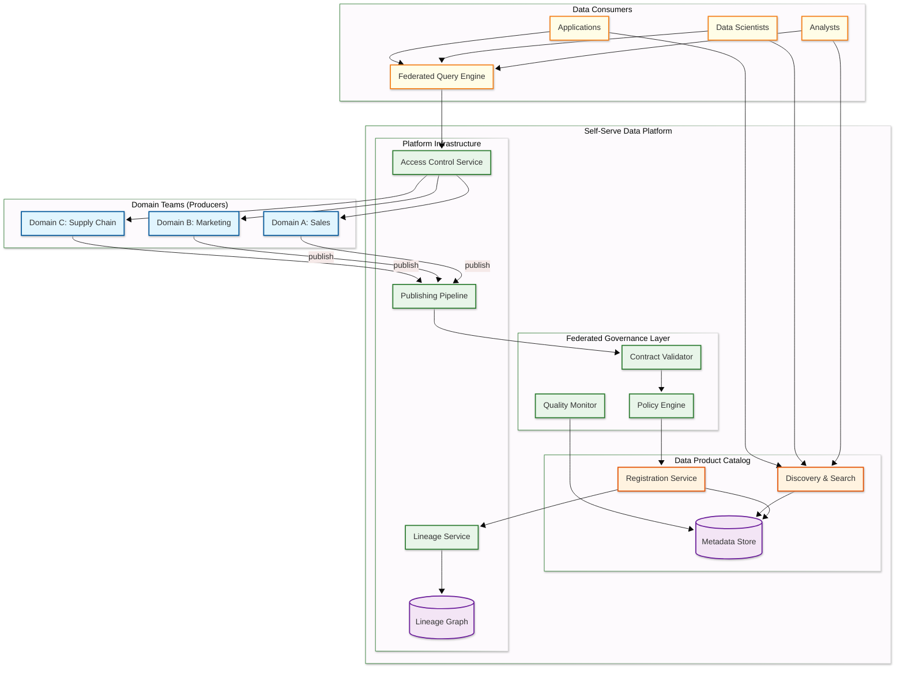
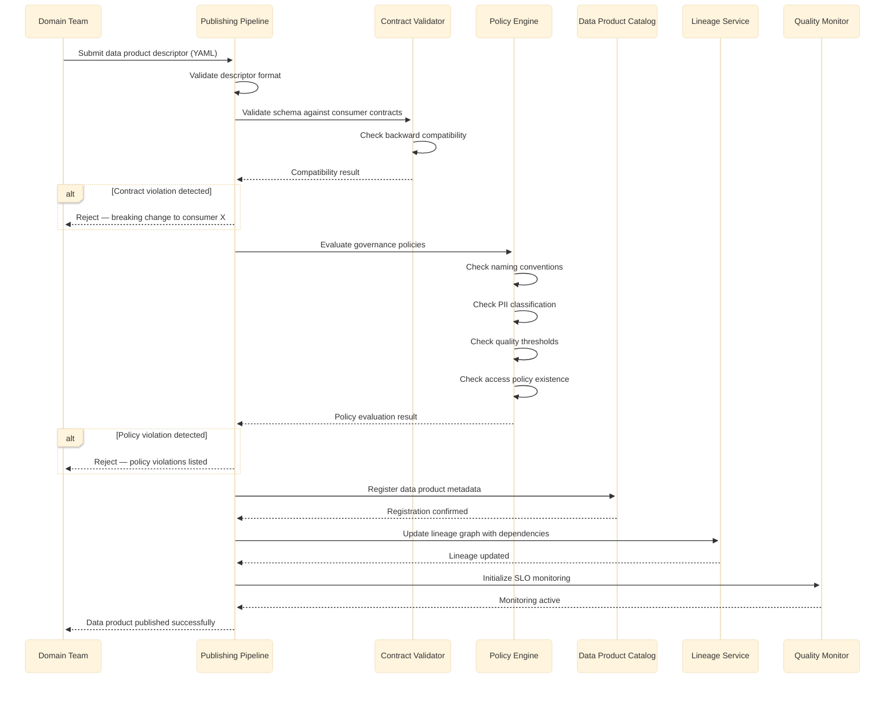
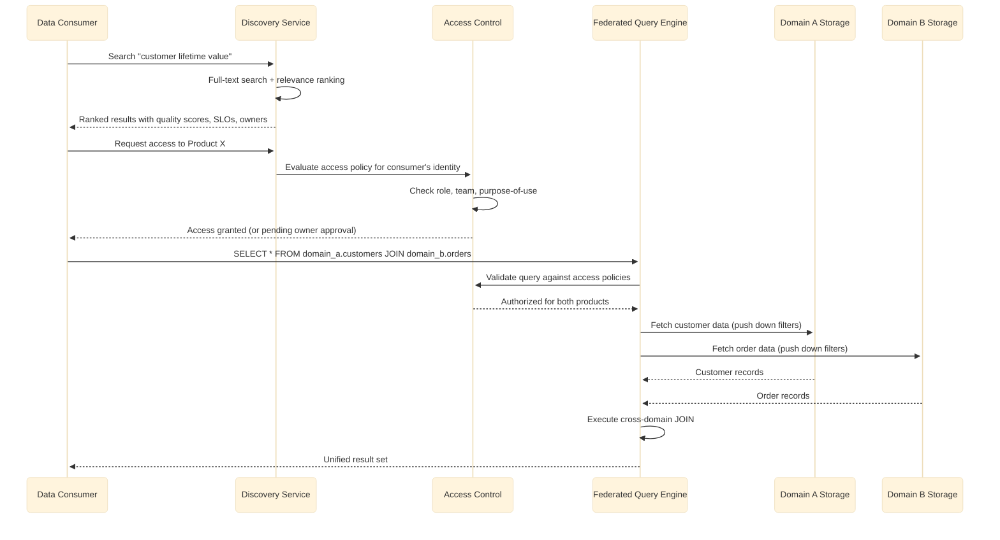

# High-Level Design — Data Mesh Architecture

## System Architecture

---

## Data Flow

### Data Product Publishing Flow

**Publishing flow key points:**

1. **Contract-first** — Schema compatibility with existing consumers is validated before governance policies, failing fast on breaking changes
2. **Policy-as-code** — All governance rules are machine-executable; no manual approval gates in the publishing pipeline
3. **Lineage capture** — Declared dependencies are recorded in the lineage graph at publish time, not discovered retroactively
4. **SLO activation** — Quality monitoring begins immediately upon publication with the declared freshness and quality thresholds
5. **Rejection with specifics** — Failed publications return actionable feedback identifying exactly which contracts or policies were violated

### Data Product Consumption Flow

---

## Key Architectural Decisions

### 1. Decentralized Data Ownership vs. Central Data Team

| Aspect | Decentralized (Data Mesh) | Centralized (Data Lake/Warehouse) |
|--------|--------------------------|----------------------------------|
| Ownership | Domain teams own their data products | Central data engineering team owns all pipelines |
| Bottleneck | No central bottleneck; domains publish independently | Central team becomes bottleneck as domains grow |
| Quality accountability | Producer is accountable; SLOs are contractual | Central team must understand every domain's data |
| Coordination cost | Higher (many teams must follow standards) | Lower (one team, one standard) |
| Scaling | Scales with organizational growth | Breaks at 20-30 domains (central team cannot keep up) |

**Decision:** Decentralized ownership with federated governance. The central data engineering team evolves into a platform team that provides self-serve infrastructure rather than building all pipelines. This is the architectural response to the observation that centralized data teams become organizational bottlenecks that scale linearly with headcount while data complexity grows exponentially.

### 2. Contract-Driven vs. Schema-on-Read

| Aspect | Contract-Driven | Schema-on-Read |
|--------|----------------|----------------|
| Producer burden | Must declare and maintain contracts | Minimal — publish data in any format |
| Consumer reliability | Consumers can depend on guaranteed structure | Consumers must handle any structure |
| Breaking change detection | Automated at publish time | Discovered at query time (production failure) |
| Flexibility | Lower (changes require contract negotiation) | Higher (any format, any time) |
| Trust | High (contractual guarantees) | Low (hope the data looks right) |

**Decision:** Contract-driven with automated validation. The overhead of maintaining contracts is significantly lower than the cost of debugging production failures caused by undocumented schema changes. Contracts are YAML descriptors versioned alongside the data product.

### 3. Embedded Governance vs. External Governance

| Aspect | Embedded (Policy-as-Code) | External (Manual Review) |
|--------|--------------------------|-------------------------|
| Enforcement speed | Milliseconds (automated) | Days/weeks (committee review) |
| Consistency | 100% — policies apply to every product | Variable — depends on reviewer attention |
| Scalability | Scales to thousands of products | Breaks at dozens of products |
| Flexibility | Rigid (rules are binary) | Flexible (human judgment) |
| Auditability | Complete (every evaluation is logged) | Partial (meeting notes, email threads) |

**Decision:** Policy-as-code with automated enforcement. Manual review committees do not scale beyond a handful of data products. Policies are encoded as executable rules (declarative YAML or code), evaluated automatically during the publishing pipeline, and produce deterministic pass/fail results with specific violation messages.

### 4. Federated Query Engine vs. Data Replication

| Aspect | Federated Query | Data Replication |
|--------|----------------|-----------------|
| Data freshness | Always current (queries source) | Stale by replication lag |
| Cross-domain JOINs | Network-bound, latency depends on sources | Local, fast after initial replication |
| Storage cost | No duplication | Copies of all consumed products |
| Governance | Access checked at query time | Access checked at replication time |
| Complexity | Query optimization across heterogeneous sources | Replication pipeline management |

**Decision:** Federated queries as the default with optional materialized views for high-frequency cross-domain joins. This preserves the single-source-of-truth principle while allowing performance optimization where needed.

### 5. Data Product Storage Strategy

**Decision:** Domain teams choose their own storage technology (columnar store, object storage, relational database) as long as the data product exposes a standard interface (SQL-accessible via the federated query engine or API). The platform provides recommended templates but does not mandate a single storage technology — this preserves domain autonomy while ensuring interoperability through interface standardization.

### 6. Event-Driven vs. Polling for Change Notification

**Decision:** Event-driven change notifications via a central event bus. When a data product is published, updated, deprecated, or has a quality SLO violation, an event is emitted. Consumers subscribe to events for products they depend on. This enables reactive lineage updates, automated quality alerting, and consumer-side cache invalidation without polling.

---

## Architecture Pattern Checklist

- [x] **Sync vs Async communication** — Synchronous for catalog queries and access control; async for publishing pipeline and governance evaluation
- [x] **Event-driven vs Request-response** — Event-driven for data product lifecycle notifications; request-response for discovery and federated queries
- [x] **Push vs Pull model** — Push-based notifications for data product changes; pull-based for data consumption and discovery
- [x] **Stateless vs Stateful services** — Catalog and governance services are stateless (state in metadata store); lineage service maintains graph state
- [x] **Read-heavy vs Write-heavy** — Read-heavy (100:1); discovery and consumption dominate; publishing is infrequent per product
- [x] **Real-time vs Batch processing** — Batch for data product publishing (daily/hourly cadence); real-time for governance enforcement and access control
- [x] **Edge vs Origin processing** — Origin processing; governance policies must be evaluated against the full catalog, not cached at the edge
