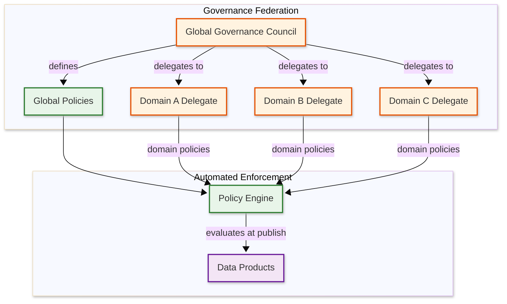

# Deep Dive & Bottlenecks — Data Mesh Architecture

## Critical Component 1: Cross-Domain Data Product Composition

### Why Is This Critical?

The value of a data mesh multiplies when data products from different domains can be composed — a marketing team joining customer lifetime value (Sales domain) with campaign performance (Marketing domain) to measure ROI. If cross-domain composition is slow, unreliable, or governance-bypassing, consumers will revert to copying data into local silos, defeating the mesh's purpose. Cross-domain composition is where the architectural promises of data mesh are either fulfilled or exposed as theoretical.

### How It Works Internally

**Federated Query Architecture:**

```
Consumer Query: SELECT c.name, c.ltv, o.total_orders
                FROM sales.customer_ltv c
                JOIN fulfillment.order_summary o ON c.customer_id = o.customer_id
                WHERE c.segment = 'enterprise'

Execution Plan:
  1. Query parser identifies two data products from different domains
  2. Access control validates consumer has access to both products
  3. Optimizer decides execution strategy:
     a. Push-down: Send filtered subqueries to each domain's storage
     b. Pull-up:   Fetch full datasets and join at the query engine
     c. Hybrid:    Push filters, pull results, join locally
  4. Federated engine sends subqueries to domain endpoints
  5. Results are joined at the query engine layer
  6. Combined result returned to consumer
```

**Optimization Strategies:**

| Strategy | Description | When Used |
|----------|-------------|-----------|
| Filter push-down | Push WHERE clauses to source domains | Always (reduces data transfer) |
| Projection push-down | Request only needed columns | Always (reduces data transfer) |
| Join push-down | Execute join at the source if both products are co-located | Same-domain joins |
| Broadcast join | Broadcast smaller table to all nodes | One side < 100 MB |
| Partition-aware join | Exploit compatible partitioning across domains | Both products partitioned on join key |

### Failure Modes

1. **Heterogeneous schema mismatch** — Domain A uses `customer_id` as STRING, Domain B uses INT64. The join fails or silently produces wrong results with implicit casting.
   - **Mitigation:** Data contracts declare canonical types for shared identifiers. The governance policy engine enforces that all products sharing a key type use the same data type.

2. **Temporal misalignment** — Sales data is refreshed hourly, fulfillment data is refreshed daily. A cross-domain join at 10 AM includes today's sales against yesterday's fulfillment data.
   - **Mitigation:** Data products declare their refresh cadence in the descriptor. The query engine annotates results with the "as-of" timestamp of each source. Consumers are warned when freshness differs by more than a configurable threshold.

3. **Fan-out explosion** — A query that joins five data products from five domains sends subqueries to five independent storage systems, each with different latency characteristics.
   - **Mitigation:** Query planner limits cross-domain fan-out. For queries exceeding 3 domains, the engine suggests materializing an intermediate data product rather than executing a 5-way federated join.

---

## Critical Component 2: Federated Governance Without Centralization

### Why Is This Critical?

Governance in a data mesh must balance two contradictory forces: global consistency (every data product must comply with security, compliance, and interoperability standards) and domain autonomy (each domain team must be free to make local decisions about schema design, technology choices, and publishing cadence). If governance is too centralized, the mesh devolves into a rebranded centralized data team. If governance is too loose, the mesh devolves into incompatible data silos.

### How It Works Internally

**Governance Federation Structure:**



**Policy Layering:**

| Layer | Scope | Examples | Mutability |
|-------|-------|----------|------------|
| Global mandatory | All products | PII classification required, access policy mandatory, naming conventions | Only governance council can modify |
| Global recommended | Advisory | Quality score > 0.8, documentation completeness | Can be overridden by domain with justification |
| Domain mandatory | One domain | Finance: encryption required on all monetary fields | Domain delegate defines |
| Domain recommended | One domain | Marketing: UTM tag standardization | Domain delegate defines |

**Policy Conflict Resolution:**

```
FUNCTION resolve_policy_conflict(global_policy, domain_policy):
    // Global mandatory always wins
    IF global_policy.scope == GLOBAL AND global_policy.severity == ERROR:
        RETURN global_policy

    // Domain can be more restrictive than global, never less
    IF domain_policy.is_more_restrictive_than(global_policy):
        RETURN domain_policy  // Domain adds additional constraints

    // Domain tries to be less restrictive — violation
    RETURN {
        error: "Domain policy cannot weaken global policy",
        global: global_policy,
        domain: domain_policy,
        resolution: "Adjust domain policy to meet or exceed global standard"
    }
```

### Failure Modes

1. **Governance drift** — Over time, global policies become outdated as domains evolve. New data products pass technically valid but substantively outdated rules.
   - **Mitigation:** Policy versioning with mandatory review cycles. The governance council reviews and updates global policies quarterly. Policies have an `expires_at` field; expired policies trigger a review workflow rather than silently continuing enforcement.

2. **Policy explosion** — Too many policies (hundreds) make the evaluation slow and the results incomprehensible. Domain teams cannot understand why their products fail governance.
   - **Mitigation:** Policy grouping into "policy packs" (e.g., "PII pack", "finance compliance pack"). Clear categorization and priority ordering. Governance evaluation reports group violations by category with actionable remediation steps.

3. **Shadow data products** — Teams bypass governance by sharing data directly (file shares, ad-hoc queries) rather than publishing through the platform.
   - **Mitigation:** Observability layer detects data movement outside the mesh (audit logs, network traffic analysis). Executive-level metrics track "governance coverage" — the percentage of known analytical datasets that are registered as governed data products.

---

## Critical Component 3: Data Product Versioning and Deprecation

### Why Is This Critical?

Data products evolve — schemas change, quality definitions tighten, fields are added or removed. Unlike microservice APIs where the producer controls all consumers, data mesh consumers may be unknown or from different domains. A breaking schema change in a Sales data product could silently break a Finance team's automated reporting pipeline. The versioning and deprecation strategy determines whether the mesh can evolve without cascading failures.

### How It Works Internally

**Semantic Versioning for Data Products:**

| Version Change | Meaning | Compatibility |
|----------------|---------|---------------|
| PATCH (1.0.x) | Bug fixes, data corrections | Fully compatible; consumers unaffected |
| MINOR (1.x.0) | New columns added, quality improvements | Backward compatible; existing consumers work without changes |
| MAJOR (x.0.0) | Breaking changes: removed columns, type changes, renamed fields | Not backward compatible; consumers must update |

**Deprecation Workflow:**

```
Phase 1: ANNOUNCE (Day 0)
  - Owner marks version as DEPRECATED in catalog
  - All registered consumers receive notification
  - Catalog shows deprecation warning on discovery

Phase 2: SUNSET PERIOD (Day 0 → Day 90)
  - Both old and new versions are published simultaneously
  - Quality monitoring continues on deprecated version
  - Migration guide published with mapping from old to new schema
  - Consumer adoption of new version is tracked

Phase 3: RETIREMENT WARNING (Day 60)
  - Consumers still using deprecated version receive escalated alerts
  - Owner contacts remaining consumers directly
  - Lineage shows which downstream products depend on deprecated version

Phase 4: RETIREMENT (Day 90)
  - Deprecated version is removed from discovery (not deleted)
  - Direct access remains for 30 additional days (grace period)
  - After grace period, data is archived but no longer queryable
```

### Failure Modes

1. **Version sprawl** — Domain teams maintain too many versions simultaneously, increasing operational burden and confusion.
   - **Mitigation:** Global policy limits active versions to 2 (current + previous). Versions older than N-2 must be retired. Automated alerts when a product has >2 active versions.

2. **Consumer orphaning** — Consumers never migrate from deprecated versions because migration requires effort and the old version "still works."
   - **Mitigation:** Forced deprecation deadlines with automatic access revocation. Track consumer migration progress in the catalog. Provide automated schema migration tooling where possible.

---

## Concurrency & Race Conditions

### Race Condition 1: Simultaneous Schema Updates by Producer and Consumer Contract Change

**Scenario:** A producer publishes a new schema version while a consumer simultaneously updates their contract subscription, creating a window where the contract references a schema that is being replaced.

**Resolution:** Optimistic concurrency control on contracts. Each contract has a version number. The update operation includes the expected version; if it has changed (another party modified it), the update is rejected and must be retried with the latest version.

### Race Condition 2: Governance Policy Update During Product Evaluation

**Scenario:** A data product is mid-evaluation when a governance council member updates a global policy, potentially changing the evaluation result.

**Resolution:** Snapshot isolation for evaluations. When evaluation begins, the policy engine captures a consistent snapshot of all applicable policies. The evaluation completes against this snapshot regardless of concurrent policy changes. The evaluation result records which policy versions were used.

### Race Condition 3: Concurrent Publishing from Same Domain

**Scenario:** Two team members publish different versions of the same data product simultaneously.

**Resolution:** Distributed lock per data product ID. The publishing pipeline acquires an advisory lock on the product URN before starting evaluation. The second publish request waits (with timeout) or fails fast with a "concurrent publish in progress" error.

---

## Bottleneck Analysis

### Bottleneck 1: Federated Query Performance Across Domains

**Problem:** Cross-domain queries route through a federated query engine that must communicate with multiple independent storage systems. Each domain may use different storage technology (columnar store, object storage, relational database) with different performance characteristics.

**Impact:** Cross-domain query latency is dominated by the slowest source domain. A 3-way join where one domain responds in 100ms, another in 2 seconds, and a third in 15 seconds takes at least 15 seconds total.

**Mitigation:**
- Asynchronous parallel subquery execution (all domains queried simultaneously)
- Timeout per domain with partial result return (respond with available data + "domain X timed out" warning)
- Materialized cross-domain views for frequently joined products (maintained by the consuming team)
- Caching layer for repeated subquery results with TTL aligned to source freshness

### Bottleneck 2: Governance Evaluation Latency at Scale

**Problem:** As the number of global policies grows (50+ policies) and products increase (2,000+ products), the time to evaluate all applicable policies during publishing increases. Complex policies (e.g., PII detection across all fields) are computationally expensive.

**Impact:** Publishing latency grows from seconds to minutes, frustrating domain teams and discouraging frequent publishing.

**Mitigation:**
- Incremental evaluation: if only metadata changed (not schema), skip schema-related policies
- Policy caching: cache expensive policy results (PII classification) and only re-evaluate when schema changes
- Parallel policy evaluation: evaluate independent policies concurrently
- Policy tiering: fast policies (naming conventions) run first; slow policies (PII scanning) run asynchronously with results posted later

### Bottleneck 3: Catalog Discovery at Scale

**Problem:** As the catalog grows to thousands of products with rich metadata, full-text search becomes slower and ranking accuracy degrades (too many results for broad queries).

**Impact:** Consumers cannot find relevant data products, leading to duplicate product creation or direct data sharing outside the mesh.

**Mitigation:**
- Faceted search with pre-computed aggregations per domain, quality tier, and tag category
- Personalized ranking using consumer's domain, past consumption patterns, and team affiliation
- AI-assisted recommendation: "consumers who used Product X also used Product Y"
- Data product curation: domain champions manually highlight recommended products
