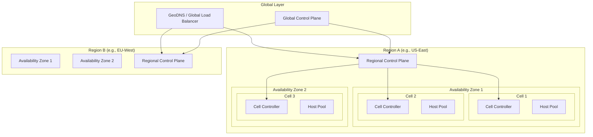
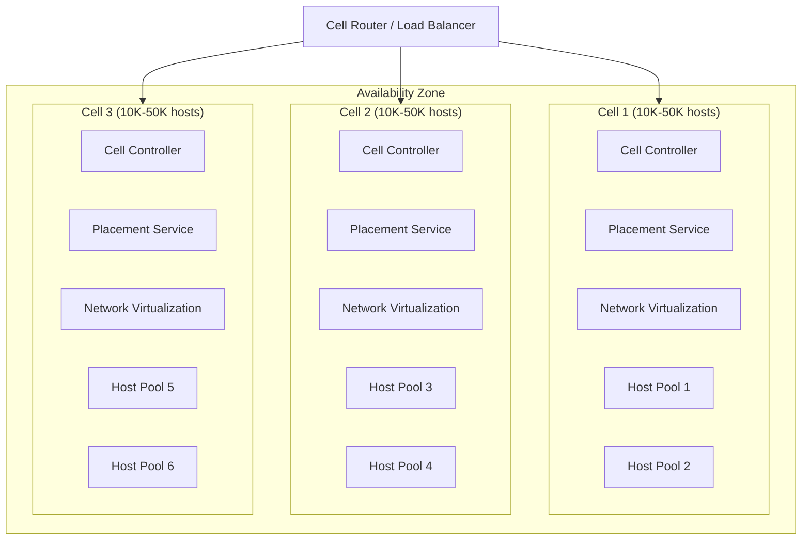
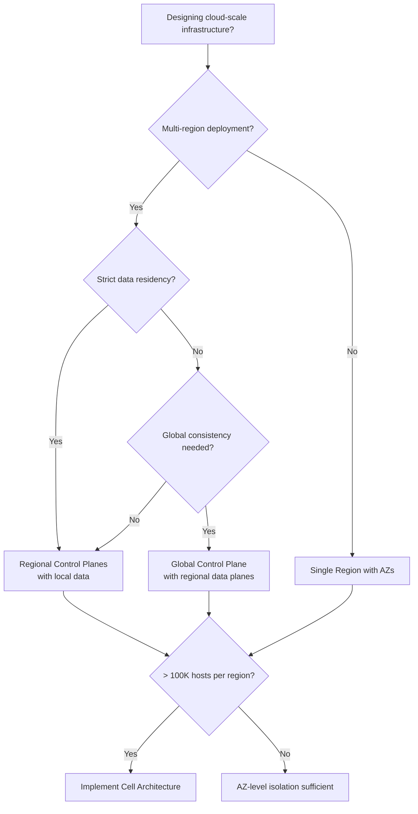
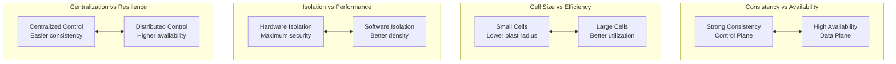

# Cloud Provider Architecture

## System Design Document

| Attribute | Value |
|-----------|-------|
| **Complexity** | Very High |
| **Category** | Cloud & Platform Engineering |
| **Prerequisites** | Service Discovery (1.10), DNS System (1.16), Distributed Lock Manager (1.8) |
| **Related Topics** | Container Orchestration (2.2), Serverless (2.3), IAM (2.5), Service Mesh (2.11) |

---

## Quick Navigation

| Document | Description |
|----------|-------------|
| [01 - Requirements & Estimations](./01-requirements-and-estimations.md) | Functional/non-functional requirements, capacity planning |
| [02 - High-Level Design](./02-high-level-design.md) | Global architecture, control/data plane separation |
| [03 - Low-Level Design](./03-low-level-design.md) | Data models, APIs, scheduling algorithms |
| [04 - Deep Dive & Bottlenecks](./04-deep-dive-and-bottlenecks.md) | Static stability, cell architecture, network virtualization |
| [05 - Scalability & Reliability](./05-scalability-and-reliability.md) | Scaling strategies, AZ independence, deployment safety |
| [06 - Security & Compliance](./06-security-and-compliance.md) | Multi-tenant isolation, threat model, compliance |
| [07 - Observability](./07-observability.md) | Metrics, logging, tracing, alerting |
| [08 - Interview Guide](./08-interview-guide.md) | 45-min pacing, trap questions, quick reference |

---

## System Overview

**Cloud Provider Architecture** is the foundational infrastructure that powers public cloud platforms. It encompasses the physical and logical organization of data centers, the separation between control plane and data plane operations, resource management and scheduling, and multi-tenant isolation - all operating at global scale with millions of resources across dozens of geographic regions.



---

## What Makes Cloud Provider Architecture Unique

| Aspect | Traditional Data Center | Cloud Provider |
|--------|------------------------|----------------|
| **Scale** | Thousands of servers | Millions of servers globally |
| **Tenancy** | Single organization | Millions of independent tenants |
| **Failure Domain** | Entire data center | Isolated cells within zones |
| **Provisioning** | Days/weeks | Seconds/minutes |
| **Control/Data Separation** | Often coupled | Strictly separated for resilience |
| **Isolation** | Network-based | Hardware + hypervisor + network |
| **API Surface** | Internal tools | Public APIs with SLAs |

---

## Core Concepts

### Infrastructure Hierarchy

Cloud providers organize infrastructure in a hierarchical structure to optimize for both performance and fault isolation.

```
┌─────────────────────────────────────────────────────────────────────────┐
│ INFRASTRUCTURE HIERARCHY                                                 │
├─────────────────────────────────────────────────────────────────────────┤
│                                                                          │
│  Global (1)                                                              │
│  └── Regions (30+)                  Geographic areas, 100s of km apart  │
│      └── Availability Zones (3-6)   Independent failure domains         │
│          └── Cells (10-50+)         Blast radius units, 10K-50K hosts   │
│              └── Racks (100s)       Physical organization               │
│                  └── Hosts (10-40)  Individual servers                  │
│                                                                          │
│  Additional Concepts:                                                    │
│  • Local Zones: Single-AZ extensions near population centers            │
│  • Edge Locations: CDN/caching nodes (100s globally)                    │
│  • Wavelength Zones: 5G edge deployments                                │
│                                                                          │
└─────────────────────────────────────────────────────────────────────────┘
```

### Provider Comparison: Infrastructure Hierarchy

| Concept | Provider A | Provider B | Provider C |
|---------|------------|------------|------------|
| **Regions** | 33+ regions | 35+ regions | 60+ regions |
| **Availability Zones** | 3-6 per region | 3+ per region | 3+ per region |
| **Edge Locations** | 450+ PoPs | 140+ edge nodes | 180+ edge locations |
| **Network Backbone** | Private fiber | Private fiber | Private fiber |
| **Cells** | Internal concept | Zones | Fault domains |

### Control Plane vs Data Plane

The most critical architectural pattern in cloud infrastructure is the strict separation between control plane and data plane.

```
┌─────────────────────────────────────────────────────────────────────────┐
│ CONTROL PLANE vs DATA PLANE                                              │
├─────────────────────────────────────────────────────────────────────────┤
│                                                                          │
│  CONTROL PLANE (Management Operations)                                   │
│  ┌───────────────────────────────────────────────────────────────────┐  │
│  │ • Create/Read/Update/Delete/List resources                        │  │
│  │ • API endpoints for provisioning                                  │  │
│  │ • Configuration changes                                           │  │
│  │ • Billing and metering                                            │  │
│  │ • IAM policy evaluation                                           │  │
│  │                                                                    │  │
│  │ Characteristics:                                                   │  │
│  │ - Stateful (needs consistent metadata store)                      │  │
│  │ - Lower availability tolerance (99.9% typical)                    │  │
│  │ - May be centralized per region or globally                       │  │
│  │ - Changes are infrequent relative to data operations              │  │
│  └───────────────────────────────────────────────────────────────────┘  │
│                                                                          │
│  DATA PLANE (Runtime Operations)                                         │
│  ┌───────────────────────────────────────────────────────────────────┐  │
│  │ • VM compute execution                                            │  │
│  │ • Network packet forwarding                                       │  │
│  │ • Storage I/O operations                                          │  │
│  │ • Load balancer traffic handling                                  │  │
│  │ • DNS resolution                                                  │  │
│  │                                                                    │  │
│  │ Characteristics:                                                   │  │
│  │ - Stateless or locally cached state                               │  │
│  │ - Higher availability requirements (99.99%+)                      │  │
│  │ - Distributed across all cells/zones                              │  │
│  │ - High volume, low latency operations                             │  │
│  └───────────────────────────────────────────────────────────────────┘  │
│                                                                          │
│  KEY PRINCIPLE: Static Stability                                         │
│  ┌───────────────────────────────────────────────────────────────────┐  │
│  │ The data plane must continue operating even when the control       │  │
│  │ plane is unavailable. Running resources should not fail just       │  │
│  │ because you can't create new ones.                                 │  │
│  └───────────────────────────────────────────────────────────────────┘  │
│                                                                          │
└─────────────────────────────────────────────────────────────────────────┘
```

### Static Stability Example

```
┌─────────────────────────────────────────────────────────────────────────┐
│ STATIC STABILITY: DNS SERVICE EXAMPLE                                    │
├─────────────────────────────────────────────────────────────────────────┤
│                                                                          │
│  Control Plane (may be centralized in one region):                      │
│  ┌────────────────────────────────────────────────────────────────┐     │
│  │  • DNS Record CRUD API                                          │     │
│  │  • Zone management                                               │     │
│  │  • Health check configuration                                    │     │
│  │  • Hosted in: Single region (e.g., us-east-1)                   │     │
│  │  • SLA: 99.9%                                                    │     │
│  └────────────────────────────────────────────────────────────────┘     │
│                          │                                               │
│                          │ Async replication                             │
│                          ▼                                               │
│  Data Plane (globally distributed):                                      │
│  ┌────────────────────────────────────────────────────────────────┐     │
│  │  • DNS Query resolution                                          │     │
│  │  • Anycast endpoints worldwide                                   │     │
│  │  • Locally cached zone data                                      │     │
│  │  • Hosted in: 100+ edge locations                               │     │
│  │  • SLA: 100% (statically stable)                                │     │
│  └────────────────────────────────────────────────────────────────┘     │
│                                                                          │
│  During Control Plane Outage:                                            │
│  ✗ Cannot create/modify DNS records                                     │
│  ✓ All existing DNS queries continue to resolve                         │
│  ✓ Health checks continue using cached configuration                    │
│                                                                          │
└─────────────────────────────────────────────────────────────────────────┘
```

### Cell-Based Architecture

Cells are the fundamental unit of blast radius containment in cloud infrastructure.



### Cell Design Principles

```
┌─────────────────────────────────────────────────────────────────────────┐
│ CELL-BASED ARCHITECTURE PRINCIPLES                                       │
├─────────────────────────────────────────────────────────────────────────┤
│                                                                          │
│  1. Independent Operation                                                │
│     • Each cell has its own controller, metadata store, scheduler       │
│     • Cell failure affects only resources in that cell                  │
│     • No cross-cell dependencies for runtime operations                 │
│                                                                          │
│  2. Fixed Size                                                           │
│     • Cells have a maximum capacity (e.g., 50K hosts)                   │
│     • Growth = new cells, not larger cells                              │
│     • Predictable failure blast radius                                   │
│                                                                          │
│  3. Shuffle Sharding for Shared Services                                │
│     • Each customer's resources spread across multiple cells            │
│     • Each cell serves a random subset of customers                     │
│     • Reduces correlated failures across customers                      │
│                                                                          │
│  4. Per-Cell Deployment                                                  │
│     • Software updates deployed cell-by-cell                            │
│     • Canary cells catch issues before wider rollout                    │
│     • Rollback scope limited to affected cells                          │
│                                                                          │
└─────────────────────────────────────────────────────────────────────────┘
```

---

## Key Components

| Component | Responsibility | Scale |
|-----------|---------------|-------|
| **Resource Manager** | API gateway for all resource operations | 100K+ requests/sec per region |
| **Metadata Store** | Consistent store for resource state | Millions of records per region |
| **Placement Service** | Decides where to place resources | Thousands of placements/sec |
| **Fabric Controller** | Manages physical host lifecycle | Millions of hosts globally |
| **Hypervisor** | Hardware-level tenant isolation | Every physical server |
| **SDN Controller** | Virtual network management | Millions of flows |
| **Scheduler** | Bin-packing for resource allocation | Per-cell scheduling |

---

## Pattern Comparison

| Architecture Pattern | Use Case | Trade-offs |
|---------------------|----------|------------|
| **Centralized Control Plane** | Simpler consistency | Single point of failure |
| **Regional Control Plane** | Better latency, regional isolation | Cross-region consistency challenges |
| **Cell-Based** | Blast radius containment | Operational complexity |
| **Fully Distributed** | Maximum resilience | Eventual consistency, harder debugging |

---

## Decision Matrix: When to Consider These Patterns



---

## When to Apply These Patterns

| Scenario | Recommended Pattern |
|----------|---------------------|
| **Building a cloud platform** | Full architecture with cells |
| **Multi-tenant SaaS at scale** | Cell-based isolation |
| **Global real-time system** | Control/data plane separation |
| **Regional compliance requirements** | Regional control planes |
| **High-availability data system** | Static stability design |
| **Internal platform (< 10K servers)** | Simplified zone-based |

---

## Real-World Implementations

| Provider | Key Patterns | Notable Features |
|----------|--------------|------------------|
| **AWS** | Cells, Nitro hypervisor, Hyperplane SDN | Strict AZ independence, cell-based deployments |
| **Azure** | Fault domains, Fabric Controller | Resource manager ARM, stamp-based isolation |
| **GCP** | Zones, Andromeda SDN, Borg/Omega scheduler | Global VPC, live migration |
| **Oracle Cloud** | Fault domains, isolated regions | Government-focused isolation |

---

## Key Trade-offs



### Trade-off Analysis

| Trade-off | Option A | Option B | Decision Factors |
|-----------|----------|----------|------------------|
| **Cell Size** | Small (10K hosts): Lower blast radius | Large (100K hosts): Better efficiency | SLA requirements, operational maturity |
| **Control Plane Location** | Global: Simpler consistency | Regional: Lower latency, data residency | Compliance, latency requirements |
| **Hypervisor Type** | Custom silicon: Maximum isolation | Software-only: Flexibility | Security requirements, cost |
| **Oversubscription** | None: Guaranteed performance | High: Better economics | Workload characteristics |

---

## Complexity Rating Breakdown

| Area | Complexity | Reason |
|------|------------|--------|
| **Basic Region/Zone Design** | Medium | Well-understood patterns |
| **Control/Data Plane Separation** | High | Requires careful boundary design |
| **Cell Architecture** | Very High | Complex operational model |
| **Multi-tenant Isolation** | Very High | Hardware + software + network layers |
| **Resource Scheduling** | Very High | NP-hard bin packing at scale |
| **Network Virtualization** | Very High | SDN at massive scale |
| **Static Stability** | High | Requires rethinking dependencies |

---

## Document Reading Order

### For Interview Prep (Time-Limited)
1. This index (overview)
2. [02 - High-Level Design](./02-high-level-design.md) (architecture diagrams)
3. [08 - Interview Guide](./08-interview-guide.md) (pacing, trade-offs)

### For Deep Understanding
1. All documents in order (00 → 08)
2. Focus on [04 - Deep Dive](./04-deep-dive-and-bottlenecks.md) for production challenges
3. Study [03 - Low-Level Design](./03-low-level-design.md) for algorithms

### For Production Design
1. [01 - Requirements](./01-requirements-and-estimations.md) (capacity planning)
2. [05 - Scalability](./05-scalability-and-reliability.md) (production concerns)
3. [06 - Security](./06-security-and-compliance.md) (isolation, compliance)
4. [07 - Observability](./07-observability.md) (monitoring)

---

## Related System Designs

| Design | Relationship |
|--------|--------------|
| [1.10 Service Discovery System](../1.10-service-discovery-system/00-index.md) | Service registration within cells |
| [1.11 Configuration Management System](../1.11-configuration-management-system/00-index.md) | Config distribution to cells |
| [1.14 API Gateway Design](../1.14-api-gateway-design/00-index.md) | Public API management layer |
| [1.16 DNS System Design](../1.16-dns-system-design/00-index.md) | GeoDNS for global routing |
| [2.2 Container Orchestration](../2.2-container-orchestration/00-index.md) | Runs on this infrastructure |

---

## Further Reading

- AWS Builders' Library: Static Stability Using Availability Zones
- AWS Fault Isolation Boundaries Whitepaper
- AWS Nitro System Security Design
- Azure Resource Manager Architecture
- Google Cloud Regions and Zones Documentation
- Meta: Scaling Services with Shard Manager
- Research Paper: Large-scale Cluster Management at Google with Borg
