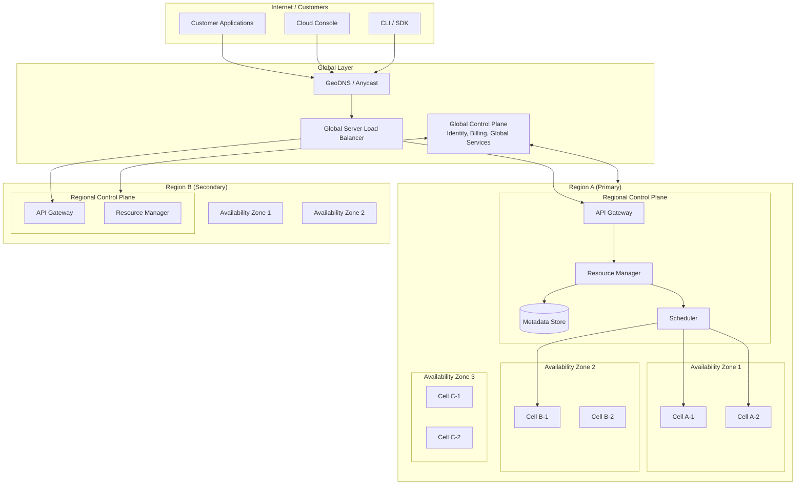
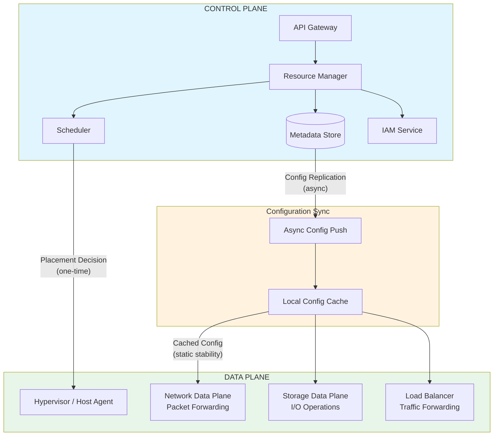
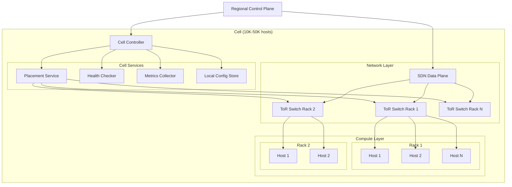
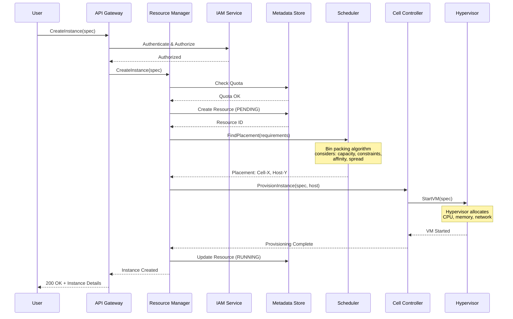
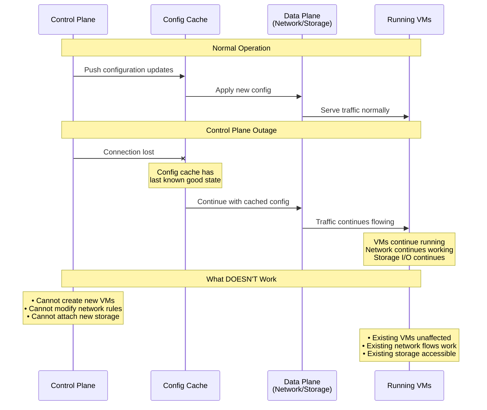
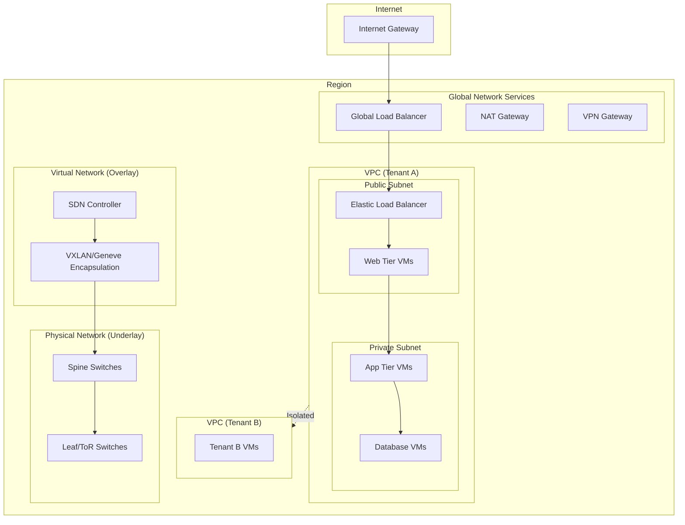
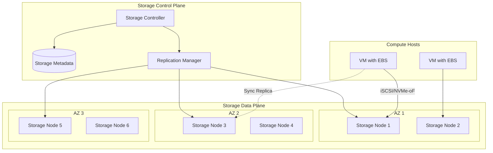

# High-Level Design

[← Back to Index](./00-index.md) | [← Requirements](./01-requirements-and-estimations.md)

---

## Overview

This document presents the high-level architecture of a cloud provider platform, covering the global infrastructure layout, control plane and data plane separation, key component responsibilities, and the flow of resource operations.

---

## Global Architecture



---

## Infrastructure Hierarchy Detail

```
┌─────────────────────────────────────────────────────────────────────────────┐
│ INFRASTRUCTURE HIERARCHY                                                     │
├─────────────────────────────────────────────────────────────────────────────┤
│                                                                              │
│  GLOBAL                                                                      │
│  ├── Global Control Plane                                                    │
│  │   ├── Identity & Access Management (IAM)                                 │
│  │   ├── Billing & Cost Management                                          │
│  │   ├── Global Service Catalog                                             │
│  │   └── Cross-Region Replication Coordination                              │
│  │                                                                           │
│  ├── GeoDNS / Global Load Balancing                                         │
│  │   ├── Anycast IP addresses                                               │
│  │   ├── Latency-based routing                                              │
│  │   └── Health-based failover                                              │
│  │                                                                           │
│  └── REGION (e.g., us-east-1)                                               │
│      ├── Regional Control Plane                                              │
│      │   ├── API Gateway (rate limiting, auth)                              │
│      │   ├── Resource Manager (CRUD orchestration)                          │
│      │   ├── Metadata Store (resource state)                                │
│      │   ├── Scheduler / Placement Service                                   │
│      │   └── Network Controller (SDN control plane)                         │
│      │                                                                       │
│      └── AVAILABILITY ZONE (e.g., us-east-1a)                               │
│          ├── Zone Controller                                                 │
│          ├── Storage Subsystem                                               │
│          │                                                                   │
│          └── CELL (e.g., cell-001)                                          │
│              ├── Cell Controller                                             │
│              ├── Local Placement Service                                     │
│              ├── Network Virtualization (SDN data plane)                    │
│              │                                                               │
│              └── RACK (e.g., rack-a01)                                      │
│                  ├── Top-of-Rack Switch                                      │
│                  │                                                           │
│                  └── HOST (physical server)                                  │
│                      ├── Hypervisor / Host Agent                            │
│                      ├── Network Agent                                       │
│                      └── VM Instances (tenant workloads)                    │
│                                                                              │
└─────────────────────────────────────────────────────────────────────────────┘
```

---

## Control Plane vs Data Plane Architecture



### Separation Principles

```
┌─────────────────────────────────────────────────────────────────────────────┐
│ CONTROL PLANE vs DATA PLANE SEPARATION                                       │
├─────────────────────────────────────────────────────────────────────────────┤
│                                                                              │
│  CONTROL PLANE                          DATA PLANE                           │
│  ─────────────────────────────────────  ─────────────────────────────────   │
│                                                                              │
│  Responsibilities:                      Responsibilities:                    │
│  • Create/Update/Delete resources       • Execute compute workloads          │
│  • Authenticate/Authorize requests      • Forward network packets            │
│  • Placement decisions                  • Serve storage I/O                  │
│  • Configuration management             • Route load balancer traffic        │
│  • Billing/Metering                     • Resolve DNS queries                │
│                                                                              │
│  Characteristics:                       Characteristics:                     │
│  • Strongly consistent                  • Eventually consistent config       │
│  • Can tolerate higher latency          • Low latency critical               │
│  • Lower availability OK (99.9%)        • High availability required (99.99%)│
│  • Stateful operations                  • Stateless (cached state)           │
│  • Centralized per region               • Distributed across all hosts       │
│                                                                              │
│  Failure Impact:                        Failure Impact:                      │
│  • Cannot create new resources          • Existing resources fail            │
│  • Cannot modify configuration          • Customer workloads impacted        │
│  • Users retry later                    • Immediate business impact          │
│                                                                              │
│  KEY INSIGHT: Data plane must operate WITHOUT control plane (static          │
│  stability). All configuration is pre-pushed and cached locally.             │
│                                                                              │
└─────────────────────────────────────────────────────────────────────────────┘
```

---

## Component Responsibilities

| Component | Layer | Responsibilities | Availability Target |
|-----------|-------|------------------|---------------------|
| **GeoDNS / GSLB** | Global | Route users to nearest region, failover | 100% (anycast) |
| **Global Control Plane** | Global | IAM, billing, cross-region coordination | 99.9% |
| **API Gateway** | Regional | Auth, rate limiting, request routing | 99.9% |
| **Resource Manager** | Regional | Orchestrate CRUD operations | 99.9% |
| **Metadata Store** | Regional | Store resource state, strongly consistent | 99.99% |
| **Scheduler** | Regional | Placement decisions, bin packing | 99.9% |
| **Cell Controller** | Cell | Manage hosts in cell, local placement | 99.9% |
| **Hypervisor** | Host | VM isolation, resource allocation | 99.99% |
| **SDN Controller** | Regional | Network policy, flow programming | 99.9% |
| **SDN Data Plane** | Host | Packet forwarding, encapsulation | 99.99% |
| **Storage Controller** | Zone | Volume management, replication | 99.9% |
| **Storage Data Plane** | Host | I/O operations, caching | 99.99% |

---

## Cell Architecture Detail



---

## Host Architecture

```
┌─────────────────────────────────────────────────────────────────────────────┐
│ HOST ARCHITECTURE                                                            │
├─────────────────────────────────────────────────────────────────────────────┤
│                                                                              │
│  Physical Server                                                             │
│  ┌─────────────────────────────────────────────────────────────────────┐    │
│  │                                                                      │    │
│  │  ┌──────────────────────────────────────────────────────────────┐   │    │
│  │  │ Security Chip / Hardware Root of Trust                        │   │    │
│  │  │ (Secure boot, key storage, attestation)                      │   │    │
│  │  └──────────────────────────────────────────────────────────────┘   │    │
│  │                                                                      │    │
│  │  ┌──────────────────────────────────────────────────────────────┐   │    │
│  │  │ Hypervisor / VMM                                              │   │    │
│  │  │ ┌────────────────────────────────────────────────────────┐   │   │    │
│  │  │ │ • VM Lifecycle Management                               │   │   │    │
│  │  │ │ • Memory Isolation (hardware-enforced)                  │   │   │    │
│  │  │ │ • CPU Scheduling                                        │   │   │    │
│  │  │ │ • Device Emulation / Paravirtualization                 │   │   │    │
│  │  │ └────────────────────────────────────────────────────────┘   │   │    │
│  │  └──────────────────────────────────────────────────────────────┘   │    │
│  │                                                                      │    │
│  │  ┌──────────────────┐ ┌──────────────────┐ ┌──────────────────┐    │    │
│  │  │ Network Card     │ │ Storage Card     │ │ Security Card    │    │    │
│  │  │ (Offload NIC)    │ │ (NVMe/SSD)       │ │ (Encryption)     │    │    │
│  │  │ • VXLAN/Geneve   │ │ • Local NVMe     │ │ • AES-256        │    │    │
│  │  │ • Flow tables    │ │ • Remote attach  │ │ • Key management │    │    │
│  │  │ • Rate limiting  │ │ • Snapshots      │ │ • Attestation    │    │    │
│  │  └──────────────────┘ └──────────────────┘ └──────────────────┘    │    │
│  │                                                                      │    │
│  │  ┌─────────────────────────────────────────────────────────────┐    │    │
│  │  │ Guest VMs (Tenant Workloads)                                 │    │    │
│  │  │                                                              │    │    │
│  │  │  ┌─────────┐  ┌─────────┐  ┌─────────┐  ┌─────────┐        │    │    │
│  │  │  │ VM 1    │  │ VM 2    │  │ VM 3    │  │ VM N    │        │    │    │
│  │  │  │Tenant A │  │Tenant B │  │Tenant A │  │Tenant C │        │    │    │
│  │  │  └─────────┘  └─────────┘  └─────────┘  └─────────┘        │    │    │
│  │  │                                                              │    │    │
│  │  └─────────────────────────────────────────────────────────────┘    │    │
│  │                                                                      │    │
│  └─────────────────────────────────────────────────────────────────────┘    │
│                                                                              │
└─────────────────────────────────────────────────────────────────────────────┘
```

---

## Resource Creation Flow



---

## Static Stability Flow



---

## Network Architecture



### Network Virtualization Layers

```
┌─────────────────────────────────────────────────────────────────────────────┐
│ NETWORK VIRTUALIZATION STACK                                                 │
├─────────────────────────────────────────────────────────────────────────────┤
│                                                                              │
│  Layer 7 (Application)                                                       │
│  ┌─────────────────────────────────────────────────────────────────────┐    │
│  │ Application Load Balancer, API Gateway, WAF                          │    │
│  └─────────────────────────────────────────────────────────────────────┘    │
│                                                                              │
│  Layer 4 (Transport)                                                         │
│  ┌─────────────────────────────────────────────────────────────────────┐    │
│  │ Network Load Balancer, NAT Gateway, Security Groups                  │    │
│  └─────────────────────────────────────────────────────────────────────┘    │
│                                                                              │
│  Layer 3 (Network - Overlay)                                                 │
│  ┌─────────────────────────────────────────────────────────────────────┐    │
│  │ VPC Routing, Subnet Routing, VPC Peering, Transit Gateway            │    │
│  │ Virtual IP addresses, VXLAN/Geneve encapsulation                     │    │
│  └─────────────────────────────────────────────────────────────────────┘    │
│                                                                              │
│  SDN Control Plane                                                           │
│  ┌─────────────────────────────────────────────────────────────────────┐    │
│  │ Flow programming, Policy distribution, Route calculation             │    │
│  └─────────────────────────────────────────────────────────────────────┘    │
│                                                                              │
│  Layer 2/3 (Physical - Underlay)                                            │
│  ┌─────────────────────────────────────────────────────────────────────┐    │
│  │ Spine-Leaf topology, BGP/ECMP, Physical switches                     │    │
│  └─────────────────────────────────────────────────────────────────────┘    │
│                                                                              │
│  Layer 1 (Physical)                                                          │
│  ┌─────────────────────────────────────────────────────────────────────┐    │
│  │ Fiber optics, 100G/400G links, Cross-connects                        │    │
│  └─────────────────────────────────────────────────────────────────────┘    │
│                                                                              │
└─────────────────────────────────────────────────────────────────────────────┘
```

---

## Storage Architecture



---

## Key Architectural Decisions

| Decision | Options Considered | Choice | Rationale |
|----------|-------------------|--------|-----------|
| **Control/Data Separation** | Unified vs Separated | Separated | Static stability, independent scaling |
| **Cell Size** | Small (10K) vs Large (100K) | 10K-50K | Balance blast radius vs efficiency |
| **Metadata Store** | Single global vs Regional | Regional with global sync | Latency, data residency |
| **Scheduler Location** | Global vs Regional vs Cell | Hierarchical (Regional + Cell) | Latency for placement decisions |
| **Network Isolation** | VLAN vs Overlay (VXLAN) | Overlay | Scale, flexibility, multi-tenancy |
| **Hypervisor Type** | Type-1 vs Type-2 vs Custom | Custom hardware-backed | Security, performance |
| **Storage Replication** | Sync vs Async | Sync within AZ, async cross-AZ | Durability vs latency trade-off |

---

## Data Flow Patterns

### Pattern 1: API Request (Control Plane)

```
User → GeoDNS → Regional API GW → Resource Manager → Metadata Store
                                                   → Scheduler
                                                   → Cell Controller
```

### Pattern 2: VM Network Traffic (Data Plane)

```
VM-A → Virtual NIC → VXLAN Encap → ToR Switch → Spine → ToR → VXLAN Decap → VM-B
```

### Pattern 3: Configuration Update

```
Control Plane → Metadata Store → Config Pusher → Cell Config Cache → Host Agent
```

### Pattern 4: Storage I/O

```
VM → Virtual Block Device → Host Storage Agent → Network → Storage Node (Primary)
                                                        → Storage Node (Replica)
```

---

## Failure Domain Isolation

```
┌─────────────────────────────────────────────────────────────────────────────┐
│ FAILURE DOMAIN HIERARCHY                                                     │
├─────────────────────────────────────────────────────────────────────────────┤
│                                                                              │
│  Failure Domain        Blast Radius              Recovery Strategy           │
│  ─────────────────────────────────────────────────────────────────────────  │
│                                                                              │
│  Host                  10-100 VMs                Auto-migrate to other hosts│
│                                                                              │
│  Rack                  400-1000 VMs              Spread groups avoid racks  │
│                                                                              │
│  Cell                  100K-500K VMs             Cell isolation, shuffle    │
│                                                   sharding limits impact     │
│                                                                              │
│  Availability Zone     Millions of VMs           Multi-AZ deployment        │
│                                                   required for HA            │
│                                                                              │
│  Region                All resources in region   Multi-region for DR         │
│                                                                              │
│  DESIGN PRINCIPLE: Every layer has independent failure boundaries.          │
│  Failures don't cascade up. Resources can survive failures at any           │
│  single layer if properly distributed.                                       │
│                                                                              │
└─────────────────────────────────────────────────────────────────────────────┘
```

---

## Summary

The high-level architecture of a cloud provider platform is characterized by:

1. **Strict Control/Data Plane Separation**: Enables static stability where data plane continues operating during control plane outages

2. **Hierarchical Organization**: Global → Region → AZ → Cell → Rack → Host provides multiple levels of isolation and scaling

3. **Cell-Based Architecture**: Cells (10K-50K hosts) provide blast radius containment and independent operation

4. **Overlay Networking**: Virtual networks (VXLAN/Geneve) on top of physical infrastructure enable multi-tenancy

5. **Hardware-Backed Isolation**: Custom hypervisors and security chips provide tenant isolation at the hardware level

6. **Regional Control Planes**: Each region operates independently with its own metadata store and scheduler

---

[Next: Low-Level Design →](./03-low-level-design.md)
