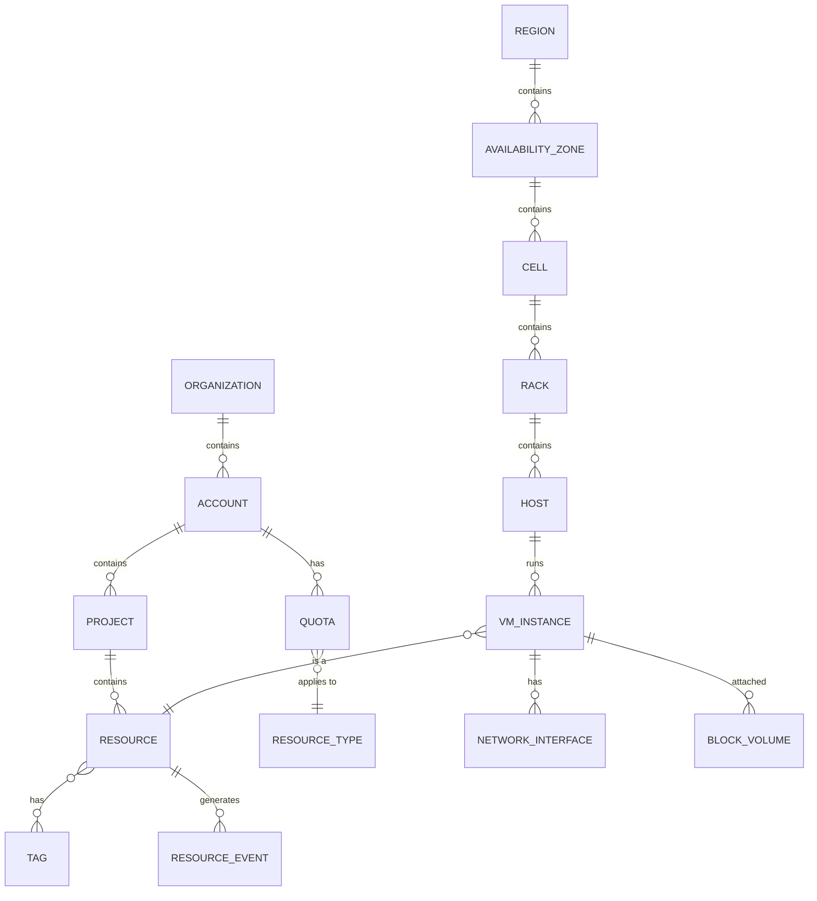
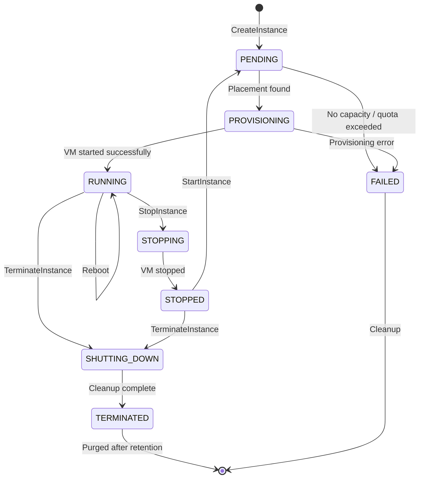

# Low-Level Design

[← Back to Index](./00-index.md) | [← High-Level Design](./02-high-level-design.md)

---

## Overview

This document covers the low-level design details including data models, API specifications, and core algorithms for resource scheduling, placement, and quota management in a cloud provider architecture.

---

## Data Models

### Resource Hierarchy Entity Relationship



### Core Data Structures

#### Resource Record

```
┌─────────────────────────────────────────────────────────────────────────────┐
│ RESOURCE RECORD                                                              │
├─────────────────────────────────────────────────────────────────────────────┤
│                                                                              │
│  Resource {                                                                  │
│    // Identity                                                               │
│    resource_id:        string      // Globally unique, e.g., "i-abc123def"  │
│    resource_type:      enum        // VM, VOLUME, VPC, SUBNET, etc.         │
│    arn:                string      // Full resource path                    │
│                                                                              │
│    // Ownership                                                              │
│    account_id:         string      // Owner account                         │
│    project_id:         string      // Optional project/resource group       │
│    created_by:         string      // IAM principal who created             │
│                                                                              │
│    // Location                                                               │
│    region:             string      // e.g., "us-east-1"                     │
│    availability_zone:  string      // e.g., "us-east-1a"                    │
│    cell_id:            string      // Internal cell identifier              │
│    host_id:            string      // For placed resources                  │
│                                                                              │
│    // State                                                                  │
│    state:              enum        // PENDING, RUNNING, STOPPING, etc.      │
│    desired_state:      enum        // What user wants                       │
│    state_reason:       string      // Why in current state                  │
│                                                                              │
│    // Specification (polymorphic based on resource_type)                    │
│    spec:               ResourceSpec                                         │
│                                                                              │
│    // Timestamps                                                             │
│    created_at:         timestamp                                            │
│    updated_at:         timestamp                                            │
│    launched_at:        timestamp   // When started running                  │
│                                                                              │
│    // Metadata                                                               │
│    tags:               map<string, string>                                  │
│    labels:             map<string, string>   // System labels               │
│                                                                              │
│    // Versioning                                                             │
│    version:            int64       // Optimistic locking                    │
│    etag:               string      // For conditional updates               │
│  }                                                                           │
│                                                                              │
└─────────────────────────────────────────────────────────────────────────────┘
```

#### VM Instance Specification

```
┌─────────────────────────────────────────────────────────────────────────────┐
│ VM INSTANCE SPECIFICATION                                                    │
├─────────────────────────────────────────────────────────────────────────────┤
│                                                                              │
│  VMInstanceSpec {                                                            │
│    // Instance Type                                                          │
│    instance_type:      string      // e.g., "m5.large"                      │
│    instance_family:    string      // e.g., "m5" (general purpose)          │
│                                                                              │
│    // Compute Resources                                                      │
│    vcpus:              int         // Virtual CPUs                          │
│    memory_mb:          int         // Memory in MB                          │
│    gpu_count:          int         // GPU count (0 for non-GPU)             │
│    gpu_type:           string      // GPU model if applicable               │
│                                                                              │
│    // Storage                                                                │
│    root_volume: {                                                            │
│      size_gb:          int                                                   │
│      volume_type:      string      // SSD, HDD, etc.                        │
│      iops:             int         // Provisioned IOPS                      │
│      encrypted:        bool                                                  │
│      kms_key_id:       string                                               │
│    }                                                                         │
│    ephemeral_storage:  list<EphemeralDisk>                                  │
│                                                                              │
│    // Networking                                                             │
│    network_interfaces: list<NetworkInterfaceSpec>                           │
│    security_groups:    list<string>                                         │
│                                                                              │
│    // Boot                                                                   │
│    image_id:           string      // AMI/Image ID                          │
│    kernel_id:          string      // Optional custom kernel                │
│    user_data:          bytes       // Cloud-init script                     │
│                                                                              │
│    // Placement                                                              │
│    placement: {                                                              │
│      availability_zone: string     // Preferred AZ                          │
│      placement_group:   string     // Cluster, spread, partition            │
│      tenancy:           enum       // DEFAULT, DEDICATED, HOST              │
│      host_id:           string     // For dedicated host placement          │
│      affinity:          string     // Host affinity                         │
│    }                                                                         │
│                                                                              │
│    // Identity                                                               │
│    iam_role:           string      // Instance profile/role                 │
│    key_pair:           string      // SSH key pair name                     │
│                                                                              │
│    // Monitoring                                                             │
│    monitoring_enabled: bool        // Detailed monitoring                   │
│    ebs_optimized:      bool        // Dedicated EBS bandwidth               │
│  }                                                                           │
│                                                                              │
└─────────────────────────────────────────────────────────────────────────────┘
```

#### Host Record

```
┌─────────────────────────────────────────────────────────────────────────────┐
│ HOST RECORD                                                                  │
├─────────────────────────────────────────────────────────────────────────────┤
│                                                                              │
│  Host {                                                                      │
│    // Identity                                                               │
│    host_id:            string      // Unique host identifier                │
│    hostname:           string      // DNS name                              │
│    serial_number:      string      // Hardware serial                       │
│                                                                              │
│    // Location                                                               │
│    region:             string                                               │
│    availability_zone:  string                                               │
│    cell_id:            string                                               │
│    rack_id:            string                                               │
│    rack_position:      int                                                  │
│                                                                              │
│    // Capacity (Total)                                                       │
│    total_vcpus:        int                                                  │
│    total_memory_mb:    int                                                  │
│    total_storage_gb:   int                                                  │
│    total_network_gbps: int                                                  │
│    gpu_count:          int                                                  │
│    gpu_type:           string                                               │
│                                                                              │
│    // Capacity (Available)                                                   │
│    available_vcpus:    int                                                  │
│    available_memory_mb: int                                                 │
│    available_storage_gb: int                                                │
│                                                                              │
│    // State                                                                  │
│    state:              enum        // AVAILABLE, IMPAIRED, RETIRING         │
│    hypervisor_version: string                                               │
│    last_health_check:  timestamp                                            │
│                                                                              │
│    // Instance Types Supported                                               │
│    supported_types:    list<string>                                         │
│                                                                              │
│    // Running Instances                                                      │
│    instances:          list<string>  // Instance IDs                        │
│    instance_count:     int                                                  │
│  }                                                                           │
│                                                                              │
└─────────────────────────────────────────────────────────────────────────────┘
```

#### Placement Request

```
┌─────────────────────────────────────────────────────────────────────────────┐
│ PLACEMENT REQUEST                                                            │
├─────────────────────────────────────────────────────────────────────────────┤
│                                                                              │
│  PlacementRequest {                                                          │
│    // Request Identity                                                       │
│    request_id:         string                                               │
│    account_id:         string                                               │
│    instance_id:        string                                               │
│                                                                              │
│    // Resource Requirements                                                  │
│    vcpus:              int                                                  │
│    memory_mb:          int                                                  │
│    storage_gb:         int                                                  │
│    network_mbps:       int                                                  │
│    gpu_count:          int                                                  │
│    gpu_type:           string                                               │
│    instance_type:      string                                               │
│                                                                              │
│    // Hard Constraints (must satisfy)                                       │
│    constraints: {                                                            │
│      availability_zone:  string    // Required AZ                           │
│      placement_group:    string    // Required placement group              │
│      tenancy:            enum      // Dedicated/shared                      │
│      dedicated_host_id:  string    // Specific host                         │
│      supported_features: list<string> // ENA, EBS-optimized, etc.          │
│    }                                                                         │
│                                                                              │
│    // Soft Preferences (best effort)                                        │
│    preferences: {                                                            │
│      spread_level:       enum      // RACK, CELL, AZ                        │
│      affinity_group:     string    // Co-locate with group                  │
│      anti_affinity:      list<string> // Avoid these instances             │
│    }                                                                         │
│                                                                              │
│    // Priority                                                               │
│    priority:           int         // Higher = more important               │
│    preemptible:        bool        // Can be evicted for capacity           │
│  }                                                                           │
│                                                                              │
└─────────────────────────────────────────────────────────────────────────────┘
```

### Resource State Machine



---

## API Design

### Resource Manager API

```
┌─────────────────────────────────────────────────────────────────────────────┐
│ RESOURCE MANAGER API                                                         │
├─────────────────────────────────────────────────────────────────────────────┤
│                                                                              │
│  // Create a new VM instance                                                 │
│  CreateInstance(request: CreateInstanceRequest) -> CreateInstanceResponse    │
│                                                                              │
│  CreateInstanceRequest {                                                     │
│    spec:               VMInstanceSpec     // Instance specification          │
│    count:              int                // Number of instances             │
│    client_token:       string             // Idempotency key                 │
│    tags:               map<string, string>                                  │
│  }                                                                           │
│                                                                              │
│  CreateInstanceResponse {                                                    │
│    instances:          list<Instance>     // Created instances              │
│    request_id:         string             // For tracking                   │
│  }                                                                           │
│                                                                              │
│  // ─────────────────────────────────────────────────────────────────────   │
│                                                                              │
│  // Describe instances with filtering                                        │
│  DescribeInstances(request: DescribeRequest) -> DescribeResponse            │
│                                                                              │
│  DescribeRequest {                                                           │
│    instance_ids:       list<string>       // Specific IDs (optional)        │
│    filters:            list<Filter>       // Filter criteria                │
│    max_results:        int                // Pagination                     │
│    next_token:         string             // Pagination cursor              │
│  }                                                                           │
│                                                                              │
│  Filter {                                                                    │
│    name:               string             // e.g., "instance-state-name"    │
│    values:             list<string>       // e.g., ["running", "stopped"]   │
│  }                                                                           │
│                                                                              │
│  // ─────────────────────────────────────────────────────────────────────   │
│                                                                              │
│  // Lifecycle operations                                                     │
│  StartInstances(instance_ids: list<string>) -> StateChangeResponse          │
│  StopInstances(instance_ids: list<string>, force: bool) -> StateChangeResponse
│  RebootInstances(instance_ids: list<string>) -> StateChangeResponse         │
│  TerminateInstances(instance_ids: list<string>) -> StateChangeResponse      │
│                                                                              │
│  StateChangeResponse {                                                       │
│    state_changes:      list<StateChange>                                    │
│  }                                                                           │
│                                                                              │
│  StateChange {                                                               │
│    instance_id:        string                                               │
│    previous_state:     InstanceState                                        │
│    current_state:      InstanceState                                        │
│  }                                                                           │
│                                                                              │
│  // ─────────────────────────────────────────────────────────────────────   │
│                                                                              │
│  // Modification operations                                                  │
│  ModifyInstanceAttribute(request: ModifyRequest) -> ModifyResponse          │
│                                                                              │
│  ModifyRequest {                                                             │
│    instance_id:        string                                               │
│    attribute:          string             // What to modify                 │
│    value:              any                // New value                      │
│  }                                                                           │
│                                                                              │
└─────────────────────────────────────────────────────────────────────────────┘
```

### Scheduler API (Internal)

```
┌─────────────────────────────────────────────────────────────────────────────┐
│ SCHEDULER API (INTERNAL)                                                     │
├─────────────────────────────────────────────────────────────────────────────┤
│                                                                              │
│  // Find optimal placement for instance                                      │
│  FindPlacement(request: PlacementRequest) -> PlacementResponse              │
│                                                                              │
│  PlacementResponse {                                                         │
│    success:            bool                                                  │
│    placement: {                                                              │
│      cell_id:          string                                               │
│      host_id:          string                                               │
│      rack_id:          string                                               │
│    }                                                                         │
│    failure_reason:     string             // If success = false             │
│    alternatives:       list<Placement>    // Other options considered       │
│  }                                                                           │
│                                                                              │
│  // ─────────────────────────────────────────────────────────────────────   │
│                                                                              │
│  // Batch placement for multiple instances                                   │
│  FindBatchPlacement(requests: list<PlacementRequest>) -> BatchResponse      │
│                                                                              │
│  BatchResponse {                                                             │
│    placements:         list<PlacementResponse>                              │
│    partial_success:    bool               // Some failed                    │
│  }                                                                           │
│                                                                              │
│  // ─────────────────────────────────────────────────────────────────────   │
│                                                                              │
│  // Reserve capacity for future use                                          │
│  ReserveCapacity(request: ReservationRequest) -> ReservationResponse        │
│                                                                              │
│  ReservationRequest {                                                        │
│    instance_type:      string                                               │
│    count:              int                                                  │
│    availability_zone:  string                                               │
│    duration:           duration           // How long to hold               │
│  }                                                                           │
│                                                                              │
│  // ─────────────────────────────────────────────────────────────────────   │
│                                                                              │
│  // Report host capacity changes                                             │
│  UpdateHostCapacity(host_id: string, capacity: HostCapacity) -> void        │
│                                                                              │
│  HostCapacity {                                                              │
│    available_vcpus:    int                                                  │
│    available_memory_mb: int                                                 │
│    available_storage_gb: int                                                │
│    state:              HostState                                            │
│  }                                                                           │
│                                                                              │
└─────────────────────────────────────────────────────────────────────────────┘
```

---

## Core Algorithms

### Algorithm 1: Vector Bin Packing

The scheduler uses multi-dimensional bin packing to place VMs on hosts, considering CPU, memory, storage, and network as dimensions.

```
┌─────────────────────────────────────────────────────────────────────────────┐
│ VECTOR BIN PACKING ALGORITHM                                                 │
├─────────────────────────────────────────────────────────────────────────────┤
│                                                                              │
│  FUNCTION FindBestFitHost(request: PlacementRequest, hosts: list<Host>)     │
│    -> Host or NULL                                                           │
│                                                                              │
│    // Filter hosts that meet hard constraints                                │
│    eligible_hosts = []                                                       │
│    FOR host IN hosts:                                                        │
│      IF MeetsConstraints(host, request.constraints):                         │
│        IF HasCapacity(host, request):                                        │
│          eligible_hosts.append(host)                                         │
│                                                                              │
│    IF eligible_hosts is empty:                                               │
│      RETURN NULL  // No capacity                                             │
│                                                                              │
│    // Score each host using multi-dimensional best-fit                       │
│    scored_hosts = []                                                         │
│    FOR host IN eligible_hosts:                                               │
│      score = CalculateFitScore(host, request)                                │
│      scored_hosts.append((host, score))                                      │
│                                                                              │
│    // Sort by score (lower is better fit = less waste)                       │
│    scored_hosts.sort(by: score, ascending: true)                             │
│                                                                              │
│    // Apply soft preferences as tiebreaker                                   │
│    best_host = ApplyPreferences(scored_hosts, request.preferences)           │
│                                                                              │
│    RETURN best_host                                                          │
│                                                                              │
│  // ─────────────────────────────────────────────────────────────────────   │
│                                                                              │
│  FUNCTION HasCapacity(host: Host, request: PlacementRequest) -> bool         │
│    RETURN host.available_vcpus >= request.vcpus                              │
│       AND host.available_memory_mb >= request.memory_mb                      │
│       AND host.available_storage_gb >= request.storage_gb                    │
│       AND (request.gpu_count == 0 OR                                        │
│            (host.gpu_type == request.gpu_type AND                           │
│             host.available_gpus >= request.gpu_count))                       │
│                                                                              │
│  // ─────────────────────────────────────────────────────────────────────   │
│                                                                              │
│  FUNCTION CalculateFitScore(host: Host, request: PlacementRequest) -> float  │
│    // Calculate waste ratio for each dimension                               │
│    // Lower score = better fit (less wasted resources)                       │
│                                                                              │
│    cpu_remaining = host.available_vcpus - request.vcpus                      │
│    mem_remaining = host.available_memory_mb - request.memory_mb              │
│    stor_remaining = host.available_storage_gb - request.storage_gb           │
│                                                                              │
│    // Normalize to percentages of total capacity                             │
│    cpu_waste = cpu_remaining / host.total_vcpus                              │
│    mem_waste = mem_remaining / host.total_memory_mb                          │
│    stor_waste = stor_remaining / host.total_storage_gb                       │
│                                                                              │
│    // Weighted combination (memory usually scarcest)                         │
│    score = (0.3 * cpu_waste) + (0.5 * mem_waste) + (0.2 * stor_waste)       │
│                                                                              │
│    // Penalty for stranding resources (can't fit any more standard VMs)     │
│    IF WouldStrandResources(host, request):                                   │
│      score = score + 0.5  // Penalty                                         │
│                                                                              │
│    RETURN score                                                              │
│                                                                              │
│  // ─────────────────────────────────────────────────────────────────────   │
│                                                                              │
│  FUNCTION MeetsConstraints(host: Host, constraints: Constraints) -> bool     │
│    IF constraints.availability_zone != NULL:                                 │
│      IF host.availability_zone != constraints.availability_zone:             │
│        RETURN false                                                          │
│                                                                              │
│    IF constraints.tenancy == DEDICATED:                                      │
│      IF host.tenancy != DEDICATED:                                           │
│        RETURN false                                                          │
│                                                                              │
│    IF constraints.dedicated_host_id != NULL:                                 │
│      IF host.host_id != constraints.dedicated_host_id:                       │
│        RETURN false                                                          │
│                                                                              │
│    FOR feature IN constraints.supported_features:                            │
│      IF feature NOT IN host.supported_features:                              │
│        RETURN false                                                          │
│                                                                              │
│    RETURN true                                                               │
│                                                                              │
└─────────────────────────────────────────────────────────────────────────────┘
```

### Algorithm 2: Shuffle Sharding

Shuffle sharding distributes tenant resources across cells to limit blast radius from cell failures.

```
┌─────────────────────────────────────────────────────────────────────────────┐
│ SHUFFLE SHARDING ALGORITHM                                                   │
├─────────────────────────────────────────────────────────────────────────────┤
│                                                                              │
│  // Assign tenant to a subset of cells (shard)                              │
│  FUNCTION AssignTenantShard(tenant_id: string, all_cells: list<Cell>,       │
│                              shard_size: int) -> list<Cell>                  │
│                                                                              │
│    // Use consistent hashing to deterministically assign cells              │
│    // Same tenant always gets same cells (stable assignment)                 │
│    seed = Hash(tenant_id)                                                    │
│    rng = RandomGenerator(seed)                                               │
│                                                                              │
│    // Shuffle cells deterministically based on tenant                        │
│    shuffled_cells = ShuffleWithSeed(all_cells, rng)                         │
│                                                                              │
│    // Take first shard_size cells                                            │
│    tenant_cells = shuffled_cells[0:shard_size]                               │
│                                                                              │
│    RETURN tenant_cells                                                       │
│                                                                              │
│  // ─────────────────────────────────────────────────────────────────────   │
│                                                                              │
│  // Calculate blast radius with shuffle sharding                             │
│  FUNCTION CalculateBlastRadius(total_cells: int, shard_size: int,            │
│                                 tenants_affected: int) -> float              │
│                                                                              │
│    // Probability that any two tenants share a cell                          │
│    // With random sharding, this is minimized                                │
│                                                                              │
│    // If one cell fails, what fraction of tenants are affected?             │
│    fraction_affected = shard_size / total_cells                              │
│                                                                              │
│    // With 100 cells and shard_size=5:                                       │
│    // Each cell failure affects only 5% of tenants                           │
│                                                                              │
│    RETURN fraction_affected                                                  │
│                                                                              │
│  // ─────────────────────────────────────────────────────────────────────   │
│                                                                              │
│  // Example configuration:                                                   │
│  //   total_cells = 100                                                      │
│  //   shard_size = 5                                                         │
│  //   Cell failure impact = 5% of tenants                                   │
│  //   Probability two random tenants share all 5 cells = (5/100)^5          │
│  //                                                    = 0.00000003%        │
│                                                                              │
└─────────────────────────────────────────────────────────────────────────────┘
```

### Algorithm 3: Quota Enforcement

```
┌─────────────────────────────────────────────────────────────────────────────┐
│ QUOTA ENFORCEMENT ALGORITHM                                                  │
├─────────────────────────────────────────────────────────────────────────────┤
│                                                                              │
│  FUNCTION CheckAndReserveQuota(account_id: string, resource_type: string,   │
│                                 amount: int, region: string) -> QuotaResult  │
│                                                                              │
│    // Get current quota and usage atomically                                 │
│    quota_record = GetQuota(account_id, resource_type, region)                │
│                                                                              │
│    current_usage = quota_record.current_usage                                │
│    limit = quota_record.limit                                                │
│    reserved = quota_record.reserved  // Pending reservations                 │
│                                                                              │
│    // Check if request fits within quota                                     │
│    IF current_usage + reserved + amount > limit:                             │
│      RETURN QuotaResult {                                                    │
│        success: false,                                                       │
│        reason: "QUOTA_EXCEEDED",                                             │
│        current_usage: current_usage,                                         │
│        limit: limit,                                                         │
│        requested: amount                                                     │
│      }                                                                       │
│                                                                              │
│    // Reserve quota (will be confirmed or released)                          │
│    reservation_id = GenerateId()                                             │
│    reservation = QuotaReservation {                                          │
│      id: reservation_id,                                                     │
│      amount: amount,                                                         │
│      expires_at: now() + RESERVATION_TTL,  // e.g., 5 minutes               │
│      account_id: account_id,                                                 │
│      resource_type: resource_type                                            │
│    }                                                                         │
│                                                                              │
│    // Atomic update                                                          │
│    success = AtomicUpdate(quota_record, ADD_RESERVATION, reservation)        │
│                                                                              │
│    IF NOT success:                                                           │
│      // Concurrent modification, retry                                       │
│      RETURN CheckAndReserveQuota(account_id, resource_type, amount, region) │
│                                                                              │
│    RETURN QuotaResult {                                                      │
│      success: true,                                                          │
│      reservation_id: reservation_id                                          │
│    }                                                                         │
│                                                                              │
│  // ─────────────────────────────────────────────────────────────────────   │
│                                                                              │
│  FUNCTION ConfirmQuotaReservation(reservation_id: string) -> bool            │
│    reservation = GetReservation(reservation_id)                              │
│    IF reservation is NULL OR reservation.expires_at < now():                 │
│      RETURN false                                                            │
│                                                                              │
│    // Convert reservation to actual usage                                    │
│    AtomicUpdate(quota_record,                                                │
│                 CONFIRM_RESERVATION,                                         │
│                 reservation_id)                                              │
│    RETURN true                                                               │
│                                                                              │
│  // ─────────────────────────────────────────────────────────────────────   │
│                                                                              │
│  FUNCTION ReleaseQuotaReservation(reservation_id: string) -> void            │
│    // Called when provisioning fails or times out                            │
│    AtomicUpdate(quota_record, RELEASE_RESERVATION, reservation_id)           │
│                                                                              │
└─────────────────────────────────────────────────────────────────────────────┘
```

### Algorithm 4: Spread Placement

```
┌─────────────────────────────────────────────────────────────────────────────┐
│ SPREAD PLACEMENT ALGORITHM                                                   │
├─────────────────────────────────────────────────────────────────────────────┤
│                                                                              │
│  // Place instances across failure domains for high availability            │
│                                                                              │
│  FUNCTION SpreadAcrossRacks(requests: list<PlacementRequest>,                │
│                              hosts: list<Host>) -> list<Placement>           │
│                                                                              │
│    // Group hosts by rack                                                    │
│    hosts_by_rack = GroupBy(hosts, host -> host.rack_id)                      │
│    racks = hosts_by_rack.keys()                                              │
│                                                                              │
│    placements = []                                                           │
│    rack_index = 0                                                            │
│                                                                              │
│    FOR request IN requests:                                                  │
│      // Try each rack in round-robin until placement found                   │
│      attempts = 0                                                            │
│      placed = false                                                          │
│                                                                              │
│      WHILE attempts < len(racks) AND NOT placed:                             │
│        rack = racks[rack_index]                                              │
│        rack_hosts = hosts_by_rack[rack]                                      │
│                                                                              │
│        // Try to find host in this rack                                      │
│        host = FindBestFitHost(request, rack_hosts)                           │
│                                                                              │
│        IF host != NULL:                                                      │
│          placements.append(Placement {                                       │
│            request_id: request.request_id,                                   │
│            host_id: host.host_id,                                            │
│            rack_id: rack                                                     │
│          })                                                                  │
│          UpdateHostCapacity(host, request)  // Reserve capacity             │
│          placed = true                                                       │
│                                                                              │
│        // Move to next rack                                                  │
│        rack_index = (rack_index + 1) % len(racks)                            │
│        attempts = attempts + 1                                               │
│                                                                              │
│      IF NOT placed:                                                          │
│        placements.append(PlacementFailure {                                  │
│          request_id: request.request_id,                                     │
│          reason: "INSUFFICIENT_SPREAD_CAPACITY"                              │
│        })                                                                    │
│                                                                              │
│    RETURN placements                                                         │
│                                                                              │
└─────────────────────────────────────────────────────────────────────────────┘
```

### Algorithm 5: Preemption for Spot Instances

```
┌─────────────────────────────────────────────────────────────────────────────┐
│ SPOT INSTANCE PREEMPTION ALGORITHM                                           │
├─────────────────────────────────────────────────────────────────────────────┤
│                                                                              │
│  FUNCTION HandleCapacityShortage(cell: Cell, required: ResourceVector)       │
│    -> PreemptionPlan                                                         │
│                                                                              │
│    // Find all preemptible instances in the cell                            │
│    preemptible = GetPreemptibleInstances(cell)                               │
│                                                                              │
│    // Sort by priority (lowest first) then by age (newest first)            │
│    preemptible.sort(by: (priority ASC, created_at DESC))                     │
│                                                                              │
│    to_preempt = []                                                           │
│    freed_resources = ResourceVector.zero()                                   │
│                                                                              │
│    FOR instance IN preemptible:                                              │
│      IF freed_resources >= required:                                         │
│        BREAK  // Enough capacity freed                                       │
│                                                                              │
│      to_preempt.append(instance)                                             │
│      freed_resources = freed_resources + instance.resources                  │
│                                                                              │
│    IF freed_resources < required:                                            │
│      RETURN PreemptionPlan {                                                 │
│        success: false,                                                       │
│        reason: "INSUFFICIENT_PREEMPTIBLE_CAPACITY"                           │
│      }                                                                       │
│                                                                              │
│    RETURN PreemptionPlan {                                                   │
│      success: true,                                                          │
│      instances_to_preempt: to_preempt,                                       │
│      freed_resources: freed_resources                                        │
│    }                                                                         │
│                                                                              │
│  // ─────────────────────────────────────────────────────────────────────   │
│                                                                              │
│  FUNCTION ExecutePreemption(plan: PreemptionPlan) -> void                    │
│    FOR instance IN plan.instances_to_preempt:                                │
│      // Send 2-minute warning (configurable)                                 │
│      SendPreemptionNotice(instance, WARNING_PERIOD)                          │
│                                                                              │
│      // Schedule termination                                                 │
│      ScheduleTermination(instance, now() + WARNING_PERIOD)                   │
│                                                                              │
│      // Update instance metadata                                             │
│      instance.state = MARKED_FOR_PREEMPTION                                  │
│      instance.preemption_time = now() + WARNING_PERIOD                       │
│                                                                              │
└─────────────────────────────────────────────────────────────────────────────┘
```

---

## Database Schema

### Metadata Store Tables

```
┌─────────────────────────────────────────────────────────────────────────────┐
│ METADATA STORE SCHEMA                                                        │
├─────────────────────────────────────────────────────────────────────────────┤
│                                                                              │
│  TABLE resources (                                                           │
│    resource_id         VARCHAR(64) PRIMARY KEY,                             │
│    resource_type       VARCHAR(32) NOT NULL,                                │
│    account_id          VARCHAR(32) NOT NULL,                                │
│    region              VARCHAR(32) NOT NULL,                                │
│    availability_zone   VARCHAR(32),                                         │
│    cell_id             VARCHAR(32),                                         │
│    state               VARCHAR(32) NOT NULL,                                │
│    spec                JSONB NOT NULL,                                      │
│    created_at          TIMESTAMP NOT NULL,                                  │
│    updated_at          TIMESTAMP NOT NULL,                                  │
│    version             BIGINT NOT NULL DEFAULT 1,                           │
│                                                                              │
│    INDEX idx_account_type (account_id, resource_type),                      │
│    INDEX idx_region_state (region, state),                                  │
│    INDEX idx_cell (cell_id)                                                  │
│  )                                                                           │
│                                                                              │
│  // ─────────────────────────────────────────────────────────────────────   │
│                                                                              │
│  TABLE hosts (                                                               │
│    host_id             VARCHAR(64) PRIMARY KEY,                             │
│    region              VARCHAR(32) NOT NULL,                                │
│    availability_zone   VARCHAR(32) NOT NULL,                                │
│    cell_id             VARCHAR(32) NOT NULL,                                │
│    rack_id             VARCHAR(32) NOT NULL,                                │
│    state               VARCHAR(32) NOT NULL,                                │
│    total_vcpus         INT NOT NULL,                                        │
│    total_memory_mb     BIGINT NOT NULL,                                     │
│    available_vcpus     INT NOT NULL,                                        │
│    available_memory_mb BIGINT NOT NULL,                                     │
│    supported_types     VARCHAR[] NOT NULL,                                  │
│    last_heartbeat      TIMESTAMP NOT NULL,                                  │
│                                                                              │
│    INDEX idx_cell_state (cell_id, state),                                   │
│    INDEX idx_capacity (available_vcpus, available_memory_mb)                │
│  )                                                                           │
│                                                                              │
│  // ─────────────────────────────────────────────────────────────────────   │
│                                                                              │
│  TABLE quotas (                                                              │
│    account_id          VARCHAR(32) NOT NULL,                                │
│    resource_type       VARCHAR(32) NOT NULL,                                │
│    region              VARCHAR(32) NOT NULL,                                │
│    limit_value         BIGINT NOT NULL,                                     │
│    current_usage       BIGINT NOT NULL DEFAULT 0,                           │
│    reserved            BIGINT NOT NULL DEFAULT 0,                           │
│    updated_at          TIMESTAMP NOT NULL,                                  │
│                                                                              │
│    PRIMARY KEY (account_id, resource_type, region)                          │
│  )                                                                           │
│                                                                              │
│  // ─────────────────────────────────────────────────────────────────────   │
│                                                                              │
│  TABLE resource_events (                                                     │
│    event_id            VARCHAR(64) PRIMARY KEY,                             │
│    resource_id         VARCHAR(64) NOT NULL,                                │
│    event_type          VARCHAR(32) NOT NULL,                                │
│    event_time          TIMESTAMP NOT NULL,                                  │
│    actor               VARCHAR(64) NOT NULL,                                │
│    details             JSONB,                                               │
│                                                                              │
│    INDEX idx_resource_time (resource_id, event_time DESC)                   │
│  )                                                                           │
│                                                                              │
└─────────────────────────────────────────────────────────────────────────────┘
```

---

## Hypervisor Architecture

```
┌─────────────────────────────────────────────────────────────────────────────┐
│ HYPERVISOR ARCHITECTURE (Nitro-style)                                        │
├─────────────────────────────────────────────────────────────────────────────┤
│                                                                              │
│  ┌─────────────────────────────────────────────────────────────────────┐    │
│  │                         PHYSICAL SERVER                              │    │
│  │                                                                      │    │
│  │  ┌─────────────────────────────────────────────────────────────┐    │    │
│  │  │ Security Processor (Separate chip)                           │    │    │
│  │  │ • Hardware root of trust                                     │    │    │
│  │  │ • Secure boot validation                                     │    │    │
│  │  │ • Key management                                             │    │    │
│  │  │ • Attestation                                                │    │    │
│  │  └─────────────────────────────────────────────────────────────┘    │    │
│  │                                                                      │    │
│  │  ┌─────────────────────────────────────────────────────────────┐    │    │
│  │  │ Hypervisor (Minimal, < 100K lines)                          │    │    │
│  │  │ • Memory isolation (hardware page tables)                   │    │    │
│  │  │ • CPU virtualization (VT-x/AMD-V)                           │    │    │
│  │  │ • No storage/network code (offloaded)                       │    │    │
│  │  └─────────────────────────────────────────────────────────────┘    │    │
│  │                                                                      │    │
│  │  ┌──────────────────┐  ┌──────────────────┐  ┌────────────────┐    │    │
│  │  │ Network Card     │  │ Storage Card     │  │ Management     │    │    │
│  │  │ (Dedicated HW)   │  │ (Dedicated HW)   │  │ Card           │    │    │
│  │  │                  │  │                  │  │                │    │    │
│  │  │ • VPC routing    │  │ • EBS I/O        │  │ • Host agent   │    │    │
│  │  │ • Security grps  │  │ • Encryption     │  │ • Monitoring   │    │    │
│  │  │ • VXLAN encap    │  │ • Snapshots      │  │ • Updates      │    │    │
│  │  │ • Rate limiting  │  │ • Replication    │  │ • Console      │    │    │
│  │  └──────────────────┘  └──────────────────┘  └────────────────┘    │    │
│  │                                                                      │    │
│  │  ┌─────────────────────────────────────────────────────────────┐    │    │
│  │  │                    CUSTOMER VMs                              │    │    │
│  │  │                                                              │    │    │
│  │  │  ┌───────────┐  ┌───────────┐  ┌───────────┐  ┌─────────┐  │    │    │
│  │  │  │   VM 1    │  │   VM 2    │  │   VM 3    │  │  VM N   │  │    │    │
│  │  │  │ Tenant A  │  │ Tenant B  │  │ Tenant A  │  │Tenant X │  │    │    │
│  │  │  │           │  │           │  │           │  │         │  │    │    │
│  │  │  │ [OS]      │  │ [OS]      │  │ [OS]      │  │ [OS]    │  │    │    │
│  │  │  │ [App]     │  │ [App]     │  │ [App]     │  │ [App]   │  │    │    │
│  │  │  └───────────┘  └───────────┘  └───────────┘  └─────────┘  │    │    │
│  │  │                                                              │    │    │
│  │  └─────────────────────────────────────────────────────────────┘    │    │
│  │                                                                      │    │
│  └─────────────────────────────────────────────────────────────────────┘    │
│                                                                              │
│  KEY DESIGN PRINCIPLES:                                                      │
│  1. Minimal hypervisor attack surface (no storage/network code)             │
│  2. Hardware-enforced isolation (CPU, memory)                               │
│  3. Dedicated offload cards for I/O (no shared code paths)                 │
│  4. Separate security processor (physically isolated)                       │
│  5. No customer workload runs on management plane                           │
│                                                                              │
└─────────────────────────────────────────────────────────────────────────────┘
```

---

## Configuration Distribution

```
┌─────────────────────────────────────────────────────────────────────────────┐
│ CONFIGURATION DISTRIBUTION FLOW                                              │
├─────────────────────────────────────────────────────────────────────────────┤
│                                                                              │
│  1. Control Plane writes configuration to metadata store                    │
│                                                                              │
│  2. Config Pusher service detects changes (CDC or polling)                  │
│                                                                              │
│  3. Config is pushed to cell-level config caches                            │
│                                                                              │
│  4. Host agents pull from cell config cache                                 │
│                                                                              │
│  5. Data plane components read from local cache                             │
│                                                                              │
│  ┌──────────────┐     ┌──────────────┐     ┌──────────────┐                │
│  │   Control    │     │    Config    │     │    Cell      │                │
│  │    Plane     │────>│    Pusher    │────>│   Config     │                │
│  │  Metadata    │     │   Service    │     │   Cache      │                │
│  └──────────────┘     └──────────────┘     └──────────────┘                │
│                                                   │                          │
│                                                   │ Pull (5 sec interval)   │
│                                                   ▼                          │
│                                            ┌──────────────┐                  │
│                                            │    Host      │                  │
│                                            │    Agent     │                  │
│                                            │  (local      │                  │
│                                            │   cache)     │                  │
│                                            └──────────────┘                  │
│                                                   │                          │
│                                                   ▼                          │
│                                       ┌──────────────────────┐               │
│                                       │   Data Plane         │               │
│                                       │   (Network, Storage) │               │
│                                       └──────────────────────┘               │
│                                                                              │
│  CACHE PROPERTIES:                                                           │
│  • TTL: Indefinite (static stability)                                       │
│  • Refresh: Background, non-blocking                                        │
│  • Failure mode: Use cached version                                         │
│  • Staleness tolerance: Hours to days                                       │
│                                                                              │
└─────────────────────────────────────────────────────────────────────────────┘
```

---

## Summary

| Component | Key Algorithm/Pattern | Complexity |
|-----------|----------------------|------------|
| **Placement** | Vector bin packing (multi-dimensional) | O(n × m) per request |
| **Blast Radius** | Shuffle sharding | O(1) assignment |
| **Quota** | Optimistic locking with reservations | O(1) check |
| **Spread** | Round-robin across failure domains | O(n) for n instances |
| **Preemption** | Priority-based eviction | O(n log n) sort |
| **Config Distribution** | Eventually consistent push | O(cells) |

---

[Next: Deep Dive & Bottlenecks →](./04-deep-dive-and-bottlenecks.md)
