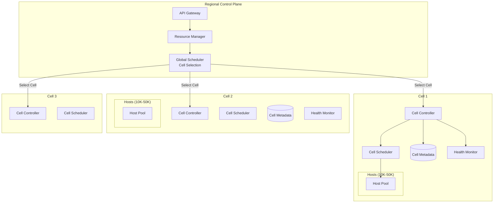
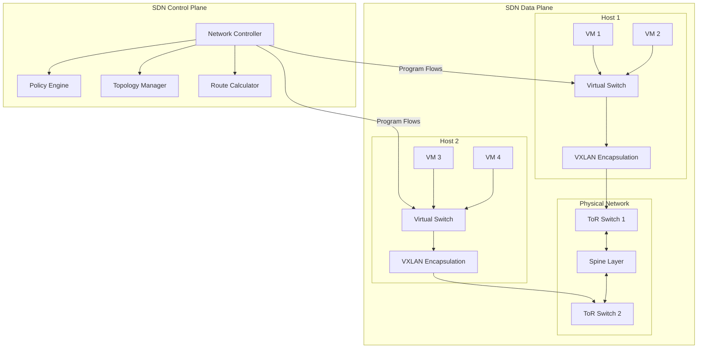

# Deep Dive and Bottlenecks

[← Back to Index](./00-index.md) | [← Low-Level Design](./03-low-level-design.md)

---

## Overview

This document provides deep dives into the most critical aspects of cloud provider architecture: static stability design, cell-based architecture, network virtualization (SDN), and resource scheduling. We also analyze bottlenecks and failure scenarios.

---

## Deep Dive 1: Static Stability Design

### The Core Principle

Static stability is the design principle that ensures the data plane continues operating even when the control plane is unavailable. This is achieved by eliminating runtime dependencies between data plane operations and control plane services.

```
┌─────────────────────────────────────────────────────────────────────────────┐
│ STATIC STABILITY PRINCIPLE                                                   │
├─────────────────────────────────────────────────────────────────────────────┤
│                                                                              │
│  WRONG: Runtime dependency on control plane                                 │
│  ┌─────────────────────────────────────────────────────────────────────┐    │
│  │                                                                      │    │
│  │  Packet Arrives → Query Control Plane → Get Routing Rule → Forward  │    │
│  │                          ↑                                           │    │
│  │                   (Control plane down = packets dropped)             │    │
│  │                                                                      │    │
│  └─────────────────────────────────────────────────────────────────────┘    │
│                                                                              │
│  RIGHT: Pre-pushed configuration with local caching                         │
│  ┌─────────────────────────────────────────────────────────────────────┐    │
│  │                                                                      │    │
│  │  Control Plane ──(push)──> Local Cache                              │    │
│  │                                 ↓                                    │    │
│  │  Packet Arrives ──────> Check Local Cache ──────> Forward           │    │
│  │                                                                      │    │
│  │  (Control plane down = use cached rules, packets flow)              │    │
│  │                                                                      │    │
│  └─────────────────────────────────────────────────────────────────────┘    │
│                                                                              │
│  KEY INSIGHT: Every piece of data needed for runtime operations must be    │
│  available locally, without network calls to central services.              │
│                                                                              │
└─────────────────────────────────────────────────────────────────────────────┘
```

### Implementation Patterns

```
┌─────────────────────────────────────────────────────────────────────────────┐
│ STATIC STABILITY IMPLEMENTATION                                              │
├─────────────────────────────────────────────────────────────────────────────┤
│                                                                              │
│  1. CONFIGURATION PRE-PUSH                                                   │
│     ─────────────────────────────────────────────────────────────────────   │
│     • All configuration pushed to data plane before needed                  │
│     • Local caches hold complete state (not just hot data)                  │
│     • TTL = infinite (never evict operational config)                       │
│     • Refresh in background, don't block on refresh                         │
│                                                                              │
│  2. CREDENTIAL CACHING                                                       │
│     ─────────────────────────────────────────────────────────────────────   │
│     • IAM policies cached locally with long TTL                             │
│     • Short-lived credentials refreshed proactively (before expiry)         │
│     • Grace period: accept recently-expired creds during outages           │
│     • Example: Credential valid 1hr, refresh at 45min, grace 15min         │
│                                                                              │
│  3. HEALTH CHECK CONTINUATION                                                │
│     ─────────────────────────────────────────────────────────────────────   │
│     • Health check configs cached locally                                   │
│     • Continue checking with cached config during control plane outage     │
│     • Don't remove healthy backends just because CP is down                 │
│     • Hysteresis: require multiple failures before removal                  │
│                                                                              │
│  4. DNS RESOLUTION                                                           │
│     ─────────────────────────────────────────────────────────────────────   │
│     • DNS data plane = anycast resolvers with cached zone data             │
│     • DNS control plane = single region for record management              │
│     • Zone data replicated async, resolvers serve cached                   │
│     • 100% availability for resolution, 99.9% for management               │
│                                                                              │
│  5. NETWORK FLOW TABLES                                                      │
│     ─────────────────────────────────────────────────────────────────────   │
│     • SDN controller pushes flow rules to switches/hosts                   │
│     • Switches continue forwarding with existing rules                     │
│     • No new flows can be programmed during outage                         │
│     • Existing connections unaffected                                       │
│                                                                              │
└─────────────────────────────────────────────────────────────────────────────┘
```

### What Breaks During Control Plane Outage

```
┌─────────────────────────────────────────────────────────────────────────────┐
│ CONTROL PLANE OUTAGE: WHAT WORKS vs WHAT DOESN'T                            │
├─────────────────────────────────────────────────────────────────────────────┤
│                                                                              │
│  CONTINUES WORKING (Data Plane)           STOPS WORKING (Control Plane)    │
│  ────────────────────────────────────     ────────────────────────────     │
│                                                                              │
│  ✓ Running VMs continue running          ✗ Cannot launch new VMs           │
│  ✓ Network traffic flows normally        ✗ Cannot create new VPCs          │
│  ✓ Storage I/O continues                 ✗ Cannot attach new volumes       │
│  ✓ Load balancers forward traffic        ✗ Cannot modify LB config         │
│  ✓ DNS queries resolve                   ✗ Cannot update DNS records       │
│  ✓ Existing security groups work         ✗ Cannot create/modify rules      │
│  ✓ Health checks continue                ✗ Cannot add new health checks    │
│  ✓ Auto-scaling rules execute*           ✗ Cannot modify scaling policies  │
│  ✓ Metrics still collected               ✗ Cannot create new alarms        │
│                                                                              │
│  * Auto-scaling works if scale-out VMs were pre-warmed or if scaling       │
│    down only (terminating VMs works, launching new may not)                 │
│                                                                              │
│  PARTIAL AVAILABILITY:                                                       │
│  • Console/CLI: May be degraded (reads cached, writes fail)                │
│  • Billing: Metering continues, invoice generation may delay               │
│  • Logs: Collection continues, querying may be degraded                    │
│                                                                              │
└─────────────────────────────────────────────────────────────────────────────┘
```

---

## Deep Dive 2: Cell-Based Architecture

### Why Cells?

```
┌─────────────────────────────────────────────────────────────────────────────┐
│ THE CASE FOR CELL-BASED ARCHITECTURE                                         │
├─────────────────────────────────────────────────────────────────────────────┤
│                                                                              │
│  PROBLEM: Large blast radius                                                │
│  ─────────────────────────────────────────────────────────────────────────  │
│  • Single scheduler failure affects entire AZ (millions of VMs)            │
│  • Bad deployment affects all customers simultaneously                      │
│  • Correlated failures cascade across entire infrastructure                 │
│  • Recovery time increases with scale                                       │
│                                                                              │
│  SOLUTION: Divide infrastructure into cells                                 │
│  ─────────────────────────────────────────────────────────────────────────  │
│  • Each cell = independent unit with own controller, scheduler, metadata   │
│  • Cell failure affects only that cell (10K-50K hosts)                     │
│  • Deployments rolled out cell-by-cell                                     │
│  • Shuffle sharding distributes customer impact                            │
│                                                                              │
│  CELL SIZE TRADE-OFF:                                                        │
│  ─────────────────────────────────────────────────────────────────────────  │
│                                                                              │
│  Smaller Cells (10K hosts)        Larger Cells (100K hosts)                 │
│  ✓ Lower blast radius             ✓ Better bin packing efficiency          │
│  ✓ Faster recovery                ✓ Lower operational overhead             │
│  ✓ Safer deployments              ✓ Fewer cells to manage                  │
│  ✗ More operational overhead      ✗ Larger blast radius                    │
│  ✗ Less efficient packing         ✗ Slower recovery                        │
│  ✗ More cross-cell complexity     ✗ Higher correlated failure risk         │
│                                                                              │
│  TYPICAL CHOICE: 10K-50K hosts per cell                                     │
│                                                                              │
└─────────────────────────────────────────────────────────────────────────────┘
```

### Cell Architecture Components



### Shuffle Sharding Deep Dive

```
┌─────────────────────────────────────────────────────────────────────────────┐
│ SHUFFLE SHARDING VISUALIZATION                                               │
├─────────────────────────────────────────────────────────────────────────────┤
│                                                                              │
│  Without Shuffle Sharding (All tenants in all cells):                       │
│  ┌─────────────────────────────────────────────────────────────────────┐    │
│  │  Cell 1    Cell 2    Cell 3    Cell 4    Cell 5                     │    │
│  │  ┌───┐     ┌───┐     ┌───┐     ┌───┐     ┌───┐                     │    │
│  │  │A,B│     │A,B│     │A,B│     │A,B│     │A,B│                     │    │
│  │  │C,D│     │C,D│     │C,D│     │C,D│     │C,D│                     │    │
│  │  │E,F│     │E,F│     │E,F│     │E,F│     │E,F│                     │    │
│  │  └───┘     └───┘     └───┘     └───┘     └───┘                     │    │
│  │                                                                      │    │
│  │  Cell 1 fails → ALL tenants (A-F) affected                          │    │
│  └─────────────────────────────────────────────────────────────────────┘    │
│                                                                              │
│  With Shuffle Sharding (Each tenant in 2 random cells):                     │
│  ┌─────────────────────────────────────────────────────────────────────┐    │
│  │  Cell 1    Cell 2    Cell 3    Cell 4    Cell 5                     │    │
│  │  ┌───┐     ┌───┐     ┌───┐     ┌───┐     ┌───┐                     │    │
│  │  │ A │     │ B │     │ A │     │ C │     │ D │                     │    │
│  │  │ E │     │ C │     │ D │     │ F │     │ B │                     │    │
│  │  │   │     │ E │     │   │     │   │     │ F │                     │    │
│  │  └───┘     └───┘     └───┘     └───┘     └───┘                     │    │
│  │                                                                      │    │
│  │  Cell 1 fails → Only tenants A, E partially affected                │    │
│  │  (They still have resources in Cell 3 and Cell 2)                   │    │
│  └─────────────────────────────────────────────────────────────────────┘    │
│                                                                              │
│  MATH:                                                                       │
│  • 100 cells, shard_size = 8                                                │
│  • Prob two tenants share ALL 8 cells = (8/100)^8 = 1.7 × 10^-9           │
│  • Effectively: No two tenants have same failure profile                    │
│                                                                              │
└─────────────────────────────────────────────────────────────────────────────┘
```

### Cell Deployment Strategy

```
┌─────────────────────────────────────────────────────────────────────────────┐
│ CELL-BASED DEPLOYMENT STRATEGY                                               │
├─────────────────────────────────────────────────────────────────────────────┤
│                                                                              │
│  DEPLOYMENT WAVES:                                                           │
│                                                                              │
│  Wave 1: One-Box (1 host)                                                    │
│  ├── Deploy to single host                                                   │
│  ├── Verify health for 15 minutes                                           │
│  └── Auto-rollback on any errors                                            │
│                                                                              │
│  Wave 2: Canary Cell (1 cell, internal traffic only)                        │
│  ├── Deploy to designated canary cell                                        │
│  ├── Route only internal/test traffic                                        │
│  ├── Monitor for 1 hour                                                      │
│  └── Compare metrics to baseline cells                                       │
│                                                                              │
│  Wave 3: Production Canary (1 cell, real traffic)                           │
│  ├── Deploy to one production cell                                           │
│  ├── Monitor for 2-4 hours                                                   │
│  ├── Watch error rates, latency, resource usage                             │
│  └── Human approval required to proceed                                      │
│                                                                              │
│  Wave 4: Regional Rollout (10% of cells per hour)                           │
│  ├── Deploy to 10% of region's cells                                         │
│  ├── Monitor, auto-pause on anomalies                                        │
│  ├── Continue to 25%, 50%, 100%                                              │
│  └── Time-boxed bake periods between waves                                   │
│                                                                              │
│  Wave 5: Global Rollout (region by region)                                  │
│  ├── Complete one region before starting next                               │
│  ├── Follow sun (deploy during business hours)                              │
│  └── 1-2 weeks for full global deployment                                   │
│                                                                              │
│  ROLLBACK TRIGGERS:                                                          │
│  • Error rate > 0.1% increase                                               │
│  • Latency p99 > 20% increase                                               │
│  • Any customer-reported issues                                             │
│  • Monitoring gaps (missing metrics = rollback)                             │
│                                                                              │
└─────────────────────────────────────────────────────────────────────────────┘
```

---

## Deep Dive 3: Network Virtualization (SDN)

### SDN Architecture



### Packet Flow in Overlay Network

```
┌─────────────────────────────────────────────────────────────────────────────┐
│ PACKET FLOW: VM-A (Tenant X) → VM-B (Tenant X) on different hosts          │
├─────────────────────────────────────────────────────────────────────────────┤
│                                                                              │
│  STEP 1: VM-A sends packet                                                  │
│  ┌─────────────────────────────────────────────────────────────────────┐    │
│  │  [Ethernet][IP: 10.0.1.5 → 10.0.1.10][TCP][Payload]                 │    │
│  │   Inner packet with VPC private IPs                                  │    │
│  └─────────────────────────────────────────────────────────────────────┘    │
│                                                                              │
│  STEP 2: Virtual switch on Host-A                                           │
│  ┌─────────────────────────────────────────────────────────────────────┐    │
│  │  • Check flow table for destination 10.0.1.10                       │    │
│  │  • Lookup: 10.0.1.10 → Host-B (172.16.5.20)                         │    │
│  │  • Apply security group rules (egress check)                         │    │
│  │  • Encapsulate in VXLAN                                              │    │
│  └─────────────────────────────────────────────────────────────────────┘    │
│                                                                              │
│  STEP 3: Encapsulated packet on physical network                            │
│  ┌─────────────────────────────────────────────────────────────────────┐    │
│  │  [Outer Eth][Outer IP: 172.16.2.10 → 172.16.5.20][UDP:4789]         │    │
│  │  [VXLAN Header: VNI=12345]                                           │    │
│  │  [Inner Ethernet][Inner IP: 10.0.1.5 → 10.0.1.10][TCP][Payload]     │    │
│  │                                                                      │    │
│  │  VNI (VXLAN Network ID) = Tenant's virtual network identifier       │    │
│  └─────────────────────────────────────────────────────────────────────┘    │
│                                                                              │
│  STEP 4: Physical network routing (underlay)                                │
│  ┌─────────────────────────────────────────────────────────────────────┐    │
│  │  Host-A → ToR-1 → Spine → ToR-2 → Host-B                            │    │
│  │  (Routed by outer IP addresses, physical switches unaware of VMs)   │    │
│  └─────────────────────────────────────────────────────────────────────┘    │
│                                                                              │
│  STEP 5: Virtual switch on Host-B                                           │
│  ┌─────────────────────────────────────────────────────────────────────┐    │
│  │  • Receive VXLAN packet                                              │    │
│  │  • Validate VNI matches tenant                                       │    │
│  │  • Decapsulate (remove outer headers)                               │    │
│  │  • Apply security group rules (ingress check)                        │    │
│  │  • Deliver to VM-B's virtual NIC                                     │    │
│  └─────────────────────────────────────────────────────────────────────┘    │
│                                                                              │
│  STEP 6: VM-B receives original packet                                      │
│  ┌─────────────────────────────────────────────────────────────────────┐    │
│  │  [Ethernet][IP: 10.0.1.5 → 10.0.1.10][TCP][Payload]                 │    │
│  │   Same as what VM-A sent (overlay is transparent)                    │    │
│  └─────────────────────────────────────────────────────────────────────┘    │
│                                                                              │
└─────────────────────────────────────────────────────────────────────────────┘
```

### Flow Table Management

```
┌─────────────────────────────────────────────────────────────────────────────┐
│ FLOW TABLE MANAGEMENT                                                        │
├─────────────────────────────────────────────────────────────────────────────┤
│                                                                              │
│  FLOW TABLE STRUCTURE (per host):                                           │
│  ─────────────────────────────────────────────────────────────────────────  │
│                                                                              │
│  Priority  Match                              Action                         │
│  ───────────────────────────────────────────────────────────────────────    │
│  100       dst_ip=10.0.1.10, vni=12345       encap(vxlan), out(172.16.5.20)│
│  100       dst_ip=10.0.1.5, vni=12345        deliver(vm-a-port)            │
│  90        vni=12345, dst=0.0.0.0/0          encap(vxlan), out(gateway)    │
│  50        arp, vni=12345                    flood(vni-12345-ports)        │
│  10        any                               drop                           │
│                                                                              │
│  FLOW PROGRAMMING:                                                           │
│  ─────────────────────────────────────────────────────────────────────────  │
│                                                                              │
│  FUNCTION ProgramFlowForNewVM(vm: VM)                                       │
│    host = vm.host                                                            │
│    vni = vm.vpc.vni                                                          │
│    local_ip = vm.private_ip                                                  │
│                                                                              │
│    // Flow for traffic TO this VM                                           │
│    local_flow = Flow {                                                       │
│      match: {dst_ip: local_ip, vni: vni},                                   │
│      action: {deliver: vm.vnic_port}                                        │
│    }                                                                         │
│    ProgramFlow(host, local_flow)                                            │
│                                                                              │
│    // Flow on all other hosts with VMs in same VPC                          │
│    FOR other_host IN GetHostsWithVPC(vm.vpc):                               │
│      remote_flow = Flow {                                                    │
│        match: {dst_ip: local_ip, vni: vni},                                 │
│        action: {encap: vxlan, tunnel_dst: host.physical_ip}                │
│      }                                                                       │
│      ProgramFlow(other_host, remote_flow)                                   │
│                                                                              │
│  SCALE CHALLENGE:                                                            │
│  • Millions of VMs = millions of flows                                      │
│  • Each VM launch/terminate requires flow updates on multiple hosts         │
│  • Solution: Hierarchical flow tables, wildcard rules, on-demand flows     │
│                                                                              │
└─────────────────────────────────────────────────────────────────────────────┘
```

---

## Deep Dive 4: Resource Scheduling

### Scheduler Architecture

```
┌─────────────────────────────────────────────────────────────────────────────┐
│ HIERARCHICAL SCHEDULER ARCHITECTURE                                          │
├─────────────────────────────────────────────────────────────────────────────┤
│                                                                              │
│  LEVEL 1: Global/Regional Scheduler                                          │
│  ┌─────────────────────────────────────────────────────────────────────┐    │
│  │  Responsibility: Select which cell should handle the request         │    │
│  │                                                                      │    │
│  │  Inputs:                                                             │    │
│  │  • Placement constraints (AZ, placement group)                       │    │
│  │  • Cell capacity summaries (not individual hosts)                    │    │
│  │  • Cell health status                                                │    │
│  │  • Tenant's cell shard (shuffle sharding)                           │    │
│  │                                                                      │    │
│  │  Output: Cell ID                                                     │    │
│  │                                                                      │    │
│  │  Latency target: < 10ms                                              │    │
│  └─────────────────────────────────────────────────────────────────────┘    │
│                        │                                                     │
│                        ▼                                                     │
│  LEVEL 2: Cell Scheduler                                                    │
│  ┌─────────────────────────────────────────────────────────────────────┐    │
│  │  Responsibility: Select which host within the cell                   │    │
│  │                                                                      │    │
│  │  Inputs:                                                             │    │
│  │  • Detailed host capacity (real-time)                                │    │
│  │  • Host health status                                                │    │
│  │  • Spread/affinity requirements                                      │    │
│  │  • Instance type constraints                                         │    │
│  │                                                                      │    │
│  │  Output: Host ID                                                     │    │
│  │                                                                      │    │
│  │  Algorithm: Vector bin packing (Best Fit Decreasing)                │    │
│  │  Latency target: < 100ms                                             │    │
│  └─────────────────────────────────────────────────────────────────────┘    │
│                        │                                                     │
│                        ▼                                                     │
│  LEVEL 3: Host Agent                                                        │
│  ┌─────────────────────────────────────────────────────────────────────┐    │
│  │  Responsibility: Actually start the VM                               │    │
│  │                                                                      │    │
│  │  Actions:                                                            │    │
│  │  • Reserve local resources                                           │    │
│  │  • Create VM via hypervisor                                          │    │
│  │  • Configure networking                                              │    │
│  │  • Attach storage                                                    │    │
│  │  • Report success/failure                                            │    │
│  │                                                                      │    │
│  │  Latency target: < 60s (dominated by boot time)                     │    │
│  └─────────────────────────────────────────────────────────────────────┘    │
│                                                                              │
└─────────────────────────────────────────────────────────────────────────────┘
```

### Scheduling Challenges

```
┌─────────────────────────────────────────────────────────────────────────────┐
│ SCHEDULING CHALLENGES                                                        │
├─────────────────────────────────────────────────────────────────────────────┤
│                                                                              │
│  1. BIN PACKING IS NP-HARD                                                   │
│     ─────────────────────────────────────────────────────────────────────   │
│     Problem: Optimal placement of VMs on hosts is computationally hard     │
│     Solution: Use heuristics (First Fit Decreasing, Best Fit)              │
│     Trade-off: ~10% less efficient than optimal, but fast                  │
│                                                                              │
│  2. MULTI-DIMENSIONAL RESOURCES                                              │
│     ─────────────────────────────────────────────────────────────────────   │
│     Problem: Optimize for CPU, memory, storage, network, GPU simultaneously│
│     Solution: Weighted scoring, avoid stranding (leftover unusable)        │
│     Example: Host has 2 vCPU left but 64GB RAM = stranded RAM              │
│                                                                              │
│  3. STALE CAPACITY DATA                                                      │
│     ─────────────────────────────────────────────────────────────────────   │
│     Problem: Scheduler sees capacity that's already claimed by others      │
│     Solutions:                                                               │
│     • Optimistic locking (try, fail, retry elsewhere)                      │
│     • Capacity reservations (short-lived holds)                            │
│     • Probabilistic under-reporting                                         │
│                                                                              │
│  4. SPREAD/ANTI-AFFINITY                                                    │
│     ─────────────────────────────────────────────────────────────────────   │
│     Problem: User wants VMs spread across racks (for HA)                   │
│     Challenge: Constrains placement significantly                           │
│     Solution: Placement groups with guaranteed spread                       │
│                                                                              │
│  5. HETEROGENEOUS HARDWARE                                                   │
│     ─────────────────────────────────────────────────────────────────────   │
│     Problem: Different host types (CPU generations, GPU types)             │
│     Solution: Instance type → host type mapping, separate pools            │
│                                                                              │
│  6. FRAGMENTATION OVER TIME                                                  │
│     ─────────────────────────────────────────────────────────────────────   │
│     Problem: As VMs come and go, capacity becomes fragmented               │
│     Solutions:                                                               │
│     • Background defragmentation (live migrate VMs)                        │
│     • "Tetris" scoring to prefer filling hosts completely                  │
│     • Periodic compaction during low-usage windows                         │
│                                                                              │
└─────────────────────────────────────────────────────────────────────────────┘
```

---

## Bottleneck Analysis

### Critical Bottlenecks

| Bottleneck | Symptom | Root Cause | Mitigation |
|------------|---------|------------|------------|
| **Metadata Store** | High API latency, timeouts | Single-leader writes, hot partitions | Sharding, read replicas, caching |
| **Scheduler** | Slow provisioning, placement failures | O(hosts) scanning per request | Cell-based scheduling, capacity indexing |
| **SDN Controller** | Slow network setup, connectivity issues | Flow table explosion | Flow aggregation, on-demand flows |
| **Host Agent** | VM launch failures | Resource exhaustion, hypervisor bugs | Health checks, host evacuation |
| **Cell Controller** | Cell-wide degradation | Single point of failure per cell | HA cell controller, cell failover |

### Metadata Store Bottleneck Deep Dive

```
┌─────────────────────────────────────────────────────────────────────────────┐
│ METADATA STORE BOTTLENECK                                                    │
├─────────────────────────────────────────────────────────────────────────────┤
│                                                                              │
│  PROBLEM: All resource operations hit the metadata store                    │
│                                                                              │
│  Write Path:                                                                 │
│  CreateVM → Metadata Write (consistent) → Scheduler → Host → Metadata Write │
│                                                                              │
│  Read Path:                                                                  │
│  DescribeInstances → Metadata Read (possibly stale) → Return                │
│                                                                              │
│  BOTTLENECK SCENARIOS:                                                       │
│  ─────────────────────────────────────────────────────────────────────────  │
│                                                                              │
│  1. Hot Account (one account creates 10K VMs)                               │
│     • All writes to same account partition                                  │
│     • Solution: Account-level rate limiting, async writes                   │
│                                                                              │
│  2. List Queries (list all VMs in region)                                   │
│     • Scans entire table or large partitions                                │
│     • Solution: Limit results, require filters, read replicas              │
│                                                                              │
│  3. Launch Storm (Black Friday, new game release)                           │
│     • 100x normal write rate                                                │
│     • Solution: Pre-provisioned capacity, write batching                   │
│                                                                              │
│  MITIGATIONS:                                                                │
│  ─────────────────────────────────────────────────────────────────────────  │
│  • Sharding: Partition by (region, account_id hash)                         │
│  • Read replicas: Eventually consistent reads for DescribeInstances        │
│  • Write-ahead log: Async durability for non-critical updates              │
│  • Caching: Cache resource metadata at API gateway layer                   │
│  • Rate limiting: Per-account and per-region limits                        │
│                                                                              │
└─────────────────────────────────────────────────────────────────────────────┘
```

---

## Failure Scenarios

### Scenario 1: Availability Zone Failure

```
┌─────────────────────────────────────────────────────────────────────────────┐
│ FAILURE SCENARIO: AZ FAILURE                                                 │
├─────────────────────────────────────────────────────────────────────────────┤
│                                                                              │
│  Trigger: Power failure, network partition, natural disaster               │
│                                                                              │
│  Impact:                                                                     │
│  • All VMs in AZ become unreachable                                         │
│  • Single-AZ storage volumes unavailable                                    │
│  • AZ-specific endpoints fail                                               │
│                                                                              │
│  Detection:                                                                  │
│  • Health checks fail for all hosts in AZ                                   │
│  • Network monitoring shows AZ unreachable                                  │
│  • Control plane loses contact with AZ components                          │
│                                                                              │
│  Automatic Response:                                                         │
│  • Load balancers stop routing to AZ (health check failure)                │
│  • DNS failover removes AZ endpoints                                        │
│  • Auto-scaling launches replacements in other AZs                         │
│                                                                              │
│  Manual Response:                                                            │
│  • Declare AZ impaired (prevent new launches)                              │
│  • Customer communication                                                   │
│  • Assess recovery timeline                                                 │
│                                                                              │
│  Customer Best Practice:                                                     │
│  • Deploy across multiple AZs                                               │
│  • Use cross-AZ load balancing                                              │
│  • Replicate data across AZs                                                │
│                                                                              │
└─────────────────────────────────────────────────────────────────────────────┘
```

### Scenario 2: Cell Controller Failure

```
┌─────────────────────────────────────────────────────────────────────────────┐
│ FAILURE SCENARIO: CELL CONTROLLER FAILURE                                    │
├─────────────────────────────────────────────────────────────────────────────┤
│                                                                              │
│  Trigger: Software bug, resource exhaustion, hardware failure              │
│                                                                              │
│  Impact:                                                                     │
│  • Cannot launch new VMs in that cell                                       │
│  • Cannot terminate VMs gracefully (hard stop only)                        │
│  • Cannot modify VM configurations                                          │
│  • Running VMs continue (static stability)                                  │
│                                                                              │
│  Detection:                                                                  │
│  • Cell controller heartbeat missing                                        │
│  • Placement requests to cell timing out                                    │
│  • Cell metrics stop updating                                               │
│                                                                              │
│  Automatic Response:                                                         │
│  • Mark cell as IMPAIRED                                                    │
│  • Route new placements to other cells                                      │
│  • Attempt controller restart                                               │
│  • Failover to standby controller (if HA)                                  │
│                                                                              │
│  Recovery:                                                                   │
│  • Restart cell controller                                                  │
│  • Rebuild cell state from host reports                                     │
│  • Resume normal operations                                                 │
│                                                                              │
│  WHY IMPACT IS LIMITED:                                                      │
│  • Cell only contains 10K-50K hosts (not entire AZ)                        │
│  • Shuffle sharding means only subset of customers affected                │
│  • Other cells in AZ continue operating                                     │
│                                                                              │
└─────────────────────────────────────────────────────────────────────────────┘
```

### Scenario 3: Correlated Deployment Failure

```
┌─────────────────────────────────────────────────────────────────────────────┐
│ FAILURE SCENARIO: CORRELATED DEPLOYMENT FAILURE                              │
├─────────────────────────────────────────────────────────────────────────────┤
│                                                                              │
│  Trigger: Bad software update deployed to multiple cells                   │
│                                                                              │
│  Example: Host agent update causes 5% of hosts to crash                    │
│                                                                              │
│  Without Cell-Based Deployment:                                              │
│  ┌─────────────────────────────────────────────────────────────────────┐    │
│  │  Update deployed globally → 5% of ALL hosts crash                   │    │
│  │  Impact: 5% of global capacity lost, affects all customers          │    │
│  │  Recovery: 4+ hours to rollback everywhere                          │    │
│  └─────────────────────────────────────────────────────────────────────┘    │
│                                                                              │
│  With Cell-Based Deployment:                                                 │
│  ┌─────────────────────────────────────────────────────────────────────┐    │
│  │  Wave 1: Deploy to 1 canary cell                                     │    │
│  │  Detect: 5% host failures in canary                                  │    │
│  │  Action: Auto-halt deployment, rollback canary cell                 │    │
│  │  Impact: 5% of ONE cell lost (~2500 hosts of 50K)                   │    │
│  │  Recovery: < 30 minutes (single cell rollback)                      │    │
│  └─────────────────────────────────────────────────────────────────────┘    │
│                                                                              │
│  KEY METRICS THAT TRIGGER HALT:                                              │
│  • Host failure rate > 0.1% in deployment wave                             │
│  • VM launch failure rate > 1%                                              │
│  • API error rate increase > 0.05%                                          │
│  • Latency p99 increase > 20%                                               │
│                                                                              │
└─────────────────────────────────────────────────────────────────────────────┘
```

---

## Summary

| Deep Dive Topic | Key Insight | Production Impact |
|-----------------|-------------|-------------------|
| **Static Stability** | Data plane operates without control plane | Running workloads survive outages |
| **Cell Architecture** | Fixed-size independent units | Blast radius containment |
| **Shuffle Sharding** | Randomized customer-cell mapping | No customer shares all failures |
| **Network Virtualization** | Overlay on physical underlay | Millions of isolated networks |
| **Resource Scheduling** | Hierarchical bin packing | Fast placement at scale |

---

[Next: Scalability & Reliability →](./05-scalability-and-reliability.md)
