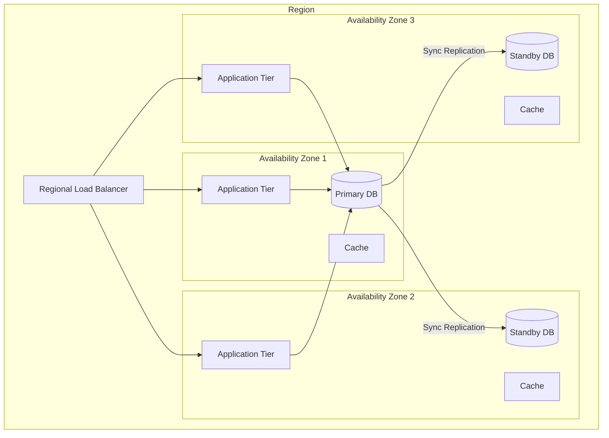
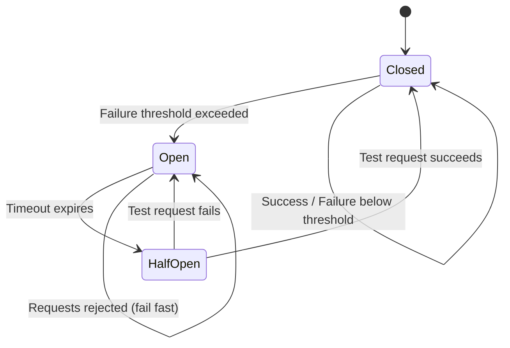

# Scalability and Reliability

[← Back to Index](./00-index.md) | [← Deep Dive & Bottlenecks](./04-deep-dive-and-bottlenecks.md)

---

## Overview

This document covers the scalability and reliability strategies for cloud provider architecture, including horizontal scaling approaches, redundancy patterns, deployment safety, and disaster recovery.

---

## Horizontal Scaling Strategy

### Control Plane Scaling

```
┌─────────────────────────────────────────────────────────────────────────────┐
│ CONTROL PLANE SCALING                                                        │
├─────────────────────────────────────────────────────────────────────────────┤
│                                                                              │
│  COMPONENT: API Gateway                                                      │
│  ─────────────────────────────────────────────────────────────────────────  │
│  Scaling: Horizontal (stateless)                                            │
│  Trigger: CPU > 60%, Request rate > threshold                               │
│  Method: Add instances behind load balancer                                 │
│  Capacity: 10K-50K requests/second per instance                            │
│                                                                              │
│  COMPONENT: Resource Manager                                                 │
│  ─────────────────────────────────────────────────────────────────────────  │
│  Scaling: Horizontal (mostly stateless)                                     │
│  Trigger: Queue depth > threshold, Latency p99 > target                    │
│  Method: Add worker instances                                               │
│  Bottleneck: Metadata store becomes the limit                               │
│                                                                              │
│  COMPONENT: Metadata Store                                                   │
│  ─────────────────────────────────────────────────────────────────────────  │
│  Scaling: Vertical + Sharding                                               │
│  Sharding key: (region, account_id_hash)                                   │
│  Read scaling: Add read replicas                                            │
│  Write scaling: Add shards (requires data migration)                       │
│  Capacity: ~10K writes/sec per shard, ~100K reads/sec per replica          │
│                                                                              │
│  COMPONENT: Scheduler                                                        │
│  ─────────────────────────────────────────────────────────────────────────  │
│  Scaling: Per-cell (bounded by cell size)                                   │
│  Each cell has its own scheduler                                            │
│  Global scheduler routes to cell schedulers                                 │
│  Add capacity = add cells                                                   │
│                                                                              │
│  COMPONENT: SDN Controller                                                   │
│  ─────────────────────────────────────────────────────────────────────────  │
│  Scaling: Regional with cell delegation                                     │
│  Flow programming delegated to cell-level controllers                      │
│  Add capacity = add controller replicas per cell                           │
│                                                                              │
└─────────────────────────────────────────────────────────────────────────────┘
```

### Data Plane Scaling

```
┌─────────────────────────────────────────────────────────────────────────────┐
│ DATA PLANE SCALING                                                           │
├─────────────────────────────────────────────────────────────────────────────┤
│                                                                              │
│  COMPONENT: Compute (Hosts)                                                  │
│  ─────────────────────────────────────────────────────────────────────────  │
│  Scaling: Add physical servers                                              │
│  Trigger: Cell utilization > 70%, insufficient capacity for instance type  │
│  Lead time: Weeks to months (hardware procurement)                          │
│  Mitigation: Maintain 20-30% headroom per cell                             │
│                                                                              │
│  COMPONENT: Network Capacity                                                 │
│  ─────────────────────────────────────────────────────────────────────────  │
│  Scaling: Add spine switches, uplinks                                       │
│  Trigger: Link utilization > 50% sustained                                  │
│  Oversubscription: 3:1 to 5:1 typical (depends on workload)                │
│  Method: Add leaf-spine fabric capacity                                     │
│                                                                              │
│  COMPONENT: Storage Nodes                                                    │
│  ─────────────────────────────────────────────────────────────────────────  │
│  Scaling: Add storage servers                                               │
│  Trigger: Capacity > 70%, IOPS > threshold                                  │
│  Method: Add nodes to storage cluster                                       │
│  Rebalancing: Automatic data redistribution                                │
│                                                                              │
│  COMPONENT: Load Balancers                                                   │
│  ─────────────────────────────────────────────────────────────────────────  │
│  Scaling: Horizontal (distributed)                                          │
│  Method: Anycast + ECMP for L4, scale-out nodes for L7                     │
│  Trigger: Connection rate > threshold, bandwidth > capacity                │
│                                                                              │
└─────────────────────────────────────────────────────────────────────────────┘
```

### Scaling Triggers and Thresholds

| Component | Metric | Warning | Critical | Action |
|-----------|--------|---------|----------|--------|
| API Gateway | CPU utilization | 60% | 80% | Add instances |
| API Gateway | Request rate | 80% capacity | 95% capacity | Add instances |
| Metadata Store | Write latency p99 | 100ms | 500ms | Add shards |
| Metadata Store | Storage utilization | 60% | 80% | Add capacity |
| Cell Scheduler | Placement queue depth | 1000 | 5000 | Add cells |
| Host Pool | Capacity utilization | 70% | 85% | Add hosts |
| Network Links | Bandwidth utilization | 50% | 70% | Add capacity |
| Storage Cluster | IOPS utilization | 70% | 85% | Add nodes |

---

## Capacity Planning

### Cell Capacity Model

```
┌─────────────────────────────────────────────────────────────────────────────┐
│ CELL CAPACITY PLANNING MODEL                                                 │
├─────────────────────────────────────────────────────────────────────────────┤
│                                                                              │
│  INPUTS:                                                                     │
│  • Growth forecast: 30% YoY                                                 │
│  • Current utilization: 65%                                                 │
│  • Target utilization: 70%                                                  │
│  • Procurement lead time: 6 months                                          │
│  • Buffer for failures: 10%                                                 │
│                                                                              │
│  FORMULA:                                                                    │
│  ─────────────────────────────────────────────────────────────────────────  │
│                                                                              │
│  Required_Capacity_T+1 = Current_Usage × (1 + Growth_Rate)                  │
│                                                                              │
│  Provisioned_Capacity = Required_Capacity / Target_Utilization              │
│                                                                              │
│  Including_Buffer = Provisioned_Capacity / (1 - Buffer_Rate)                │
│                                                                              │
│  EXAMPLE:                                                                    │
│  ─────────────────────────────────────────────────────────────────────────  │
│  Current usage: 1,000,000 VMs                                               │
│  Next year need: 1,000,000 × 1.3 = 1,300,000 VMs                           │
│  At 70% util: 1,300,000 / 0.7 = 1,857,142 VM capacity                      │
│  With 10% buffer: 1,857,142 / 0.9 = 2,063,492 VM capacity                  │
│                                                                              │
│  At 20 VMs/host: 103,175 hosts needed                                       │
│  At 30,000 hosts/cell: 4 cells needed                                       │
│                                                                              │
│  WHEN TO ADD NEW CELL:                                                       │
│  ─────────────────────────────────────────────────────────────────────────  │
│  • Existing cells > 70% utilized                                            │
│  • Projected growth exceeds current cell headroom                          │
│  • New instance types require dedicated hardware                           │
│  • Geographic expansion into new AZ                                         │
│                                                                              │
└─────────────────────────────────────────────────────────────────────────────┘
```

### Regional Capacity Planning

```
┌─────────────────────────────────────────────────────────────────────────────┐
│ REGIONAL CAPACITY PLANNING                                                   │
├─────────────────────────────────────────────────────────────────────────────┤
│                                                                              │
│  PRINCIPLE: N+1 AZ Capacity                                                  │
│  ─────────────────────────────────────────────────────────────────────────  │
│  • With 3 AZs, each should handle 50% of peak load                         │
│  • If one AZ fails, remaining 2 can absorb traffic                         │
│  • This requires 3 × 50% = 150% total capacity (50% "overhead")            │
│                                                                              │
│  FORMULA:                                                                    │
│  Per_AZ_Capacity = Peak_Region_Load / (Num_AZs - 1)                         │
│  Total_Capacity = Per_AZ_Capacity × Num_AZs                                 │
│                                                                              │
│  EXAMPLE (3 AZs):                                                            │
│  Peak load: 1,000,000 VMs                                                   │
│  Per AZ: 1,000,000 / 2 = 500,000 VMs capacity                              │
│  Total: 500,000 × 3 = 1,500,000 VMs capacity                               │
│                                                                              │
│  CAPACITY BY SERVICE TIER:                                                   │
│  ─────────────────────────────────────────────────────────────────────────  │
│  • On-demand: Guarantee capacity up to account limits                       │
│  • Reserved: Capacity pre-allocated, guaranteed                             │
│  • Spot: Use spare capacity, no guarantees                                  │
│                                                                              │
│  Allocation: 60% On-demand, 25% Reserved, 15% Spot (typical)               │
│                                                                              │
└─────────────────────────────────────────────────────────────────────────────┘
```

---

## Redundancy Strategy

### Component-Level Redundancy

| Component | Redundancy Pattern | Failover Time | Notes |
|-----------|-------------------|---------------|-------|
| API Gateway | Active-Active (multi-instance) | Immediate | LB health checks |
| Resource Manager | Active-Active | Immediate | Stateless workers |
| Metadata Store | Leader + Replicas (3+) | < 30 seconds | Automatic leader election |
| Cell Controller | Active-Standby (per cell) | < 60 seconds | Lease-based leadership |
| Scheduler | Active-Active (per cell) | Immediate | Sharded by cell |
| SDN Controller | Active-Standby (per cell) | < 30 seconds | State replicated |
| Hypervisor | N+1 hosts per cell | Minutes | VM migration |
| Storage | 3-way replication | Immediate | Synchronous within AZ |

### AZ Independence

```
┌─────────────────────────────────────────────────────────────────────────────┐
│ AZ INDEPENDENCE GUARANTEES                                                   │
├─────────────────────────────────────────────────────────────────────────────┤
│                                                                              │
│  PHYSICAL ISOLATION:                                                         │
│  ─────────────────────────────────────────────────────────────────────────  │
│  • Separate physical buildings                                              │
│  • Independent power feeds and generators                                   │
│  • Separate cooling systems                                                 │
│  • Different network entry points                                           │
│  • No shared single points of failure                                       │
│                                                                              │
│  LOGICAL ISOLATION:                                                          │
│  ─────────────────────────────────────────────────────────────────────────  │
│  • Independent control plane instances per AZ                               │
│  • No cross-AZ synchronous dependencies                                     │
│  • Separate failure domains in software                                     │
│  • Independent deployment waves                                              │
│                                                                              │
│  DATA ISOLATION:                                                             │
│  ─────────────────────────────────────────────────────────────────────────  │
│  • Synchronous replication within AZ only (by default)                     │
│  • Asynchronous replication cross-AZ (optional)                            │
│  • Regional services span AZs but tolerate AZ failure                      │
│                                                                              │
│  FAILURE CORRELATION:                                                        │
│  ─────────────────────────────────────────────────────────────────────────  │
│  AZs are designed so that probability of simultaneous failure is minimal:  │
│                                                                              │
│  P(AZ1 fails) = 0.001 (1 hour/year ~ 99.99%)                               │
│  P(AZ2 fails) = 0.001                                                       │
│  P(Both fail independently) = 0.001 × 0.001 = 0.000001                     │
│                                                                              │
│  Multi-AZ availability: 99.9999% (vs 99.99% single AZ)                     │
│                                                                              │
└─────────────────────────────────────────────────────────────────────────────┘
```

### Multi-AZ Architecture Pattern



---

## Deployment Safety

### Deployment Pipeline

```
┌─────────────────────────────────────────────────────────────────────────────┐
│ DEPLOYMENT PIPELINE STAGES                                                   │
├─────────────────────────────────────────────────────────────────────────────┤
│                                                                              │
│  STAGE 1: Pre-Production                                                     │
│  ─────────────────────────────────────────────────────────────────────────  │
│  • Build verification tests                                                 │
│  • Integration tests                                                         │
│  • Security scanning                                                         │
│  • Performance benchmarks                                                   │
│  Duration: Hours                                                             │
│                                                                              │
│  STAGE 2: One-Box                                                            │
│  ─────────────────────────────────────────────────────────────────────────  │
│  • Deploy to single production host                                         │
│  • Synthetic traffic only                                                   │
│  • Full monitoring                                                           │
│  • Bake time: 15-30 minutes                                                 │
│  Rollback: Auto on any errors                                               │
│                                                                              │
│  STAGE 3: Canary Cell                                                        │
│  ─────────────────────────────────────────────────────────────────────────  │
│  • Deploy to one cell (5% of region traffic)                               │
│  • Real production traffic                                                   │
│  • Compare metrics to baseline cells                                        │
│  • Bake time: 2-4 hours                                                     │
│  Rollback: Auto on metric degradation                                       │
│                                                                              │
│  STAGE 4: Regional Wave                                                      │
│  ─────────────────────────────────────────────────────────────────────────  │
│  • Wave 1: 10% of cells                                                     │
│  • Wave 2: 25% of cells                                                     │
│  • Wave 3: 50% of cells                                                     │
│  • Wave 4: 100% of cells                                                    │
│  • 1-2 hours between waves                                                  │
│  Rollback: Cell-by-cell rollback                                            │
│                                                                              │
│  STAGE 5: Global Rollout                                                     │
│  ─────────────────────────────────────────────────────────────────────────  │
│  • Region by region (follow the sun)                                        │
│  • 1-3 regions per day                                                      │
│  • Full deployment: 1-2 weeks                                               │
│  Rollback: Regional rollback                                                │
│                                                                              │
└─────────────────────────────────────────────────────────────────────────────┘
```

### Deployment Safety Mechanisms

```
┌─────────────────────────────────────────────────────────────────────────────┐
│ DEPLOYMENT SAFETY MECHANISMS                                                 │
├─────────────────────────────────────────────────────────────────────────────┤
│                                                                              │
│  1. AUTOMATIC ROLLBACK TRIGGERS                                              │
│     ─────────────────────────────────────────────────────────────────────   │
│     • Error rate increase > 0.1%                                            │
│     • Latency p99 increase > 20%                                            │
│     • Availability drop > 0.01%                                             │
│     • Crash rate increase > 0.01%                                           │
│     • Customer-reported issues                                              │
│                                                                              │
│  2. BAKE TIME REQUIREMENTS                                                   │
│     ─────────────────────────────────────────────────────────────────────   │
│     • Minimum time in each stage before proceeding                         │
│     • Ensures sufficient data to detect issues                             │
│     • Cannot be bypassed except for security emergencies                   │
│                                                                              │
│  3. BLAST RADIUS LIMITS                                                      │
│     ─────────────────────────────────────────────────────────────────────   │
│     • Maximum % of fleet that can be in new version                        │
│     • Gradually increased as confidence grows                               │
│     • Hard cap until explicit approval                                      │
│                                                                              │
│  4. DEPLOYMENT WINDOWS                                                       │
│     ─────────────────────────────────────────────────────────────────────   │
│     • Avoid deployments during peak hours                                   │
│     • No deployments on major event days                                    │
│     • Reduced deployment speed during high-traffic periods                 │
│                                                                              │
│  5. HUMAN CHECKPOINTS                                                        │
│     ─────────────────────────────────────────────────────────────────────   │
│     • Manual approval required at certain stages                            │
│     • On-call engineer review of metrics                                    │
│     • Senior approval for high-risk changes                                 │
│                                                                              │
│  6. EMERGENCY STOP                                                           │
│     ─────────────────────────────────────────────────────────────────────   │
│     • One-click halt of all deployments globally                           │
│     • Automatic triggering on major incidents                              │
│     • Requires explicit re-enable                                          │
│                                                                              │
└─────────────────────────────────────────────────────────────────────────────┘
```

### Rollback Strategy

```
┌─────────────────────────────────────────────────────────────────────────────┐
│ ROLLBACK STRATEGY                                                            │
├─────────────────────────────────────────────────────────────────────────────┤
│                                                                              │
│  ROLLBACK TYPES:                                                             │
│                                                                              │
│  1. Code Rollback                                                            │
│     • Revert to previous binary/container version                          │
│     • Fast (seconds to minutes per host)                                   │
│     • Suitable for most software issues                                     │
│                                                                              │
│  2. Configuration Rollback                                                   │
│     • Revert config changes                                                 │
│     • Fast (pushed via config system)                                       │
│     • For feature flags, settings                                           │
│                                                                              │
│  3. Data Rollback                                                            │
│     • Restore from backup/point-in-time                                     │
│     • Slow and risky (data loss possible)                                  │
│     • Last resort for data corruption                                       │
│                                                                              │
│  ROLLBACK PROCEDURE:                                                         │
│  ─────────────────────────────────────────────────────────────────────────  │
│                                                                              │
│  FUNCTION Rollback(component, from_version, to_version)                     │
│    1. Halt ongoing deployment of component                                  │
│    2. Identify affected cells/hosts                                         │
│    3. FOR each affected unit (cell or host):                                │
│       a. Drain traffic (if applicable)                                      │
│       b. Deploy previous version                                            │
│       c. Verify health checks pass                                          │
│       d. Restore traffic                                                    │
│    4. Verify global metrics recovered                                       │
│    5. Mark rollback complete                                                │
│    6. Post-incident review                                                  │
│                                                                              │
│  ROLLBACK TIME TARGETS:                                                      │
│  • Single host: < 5 minutes                                                 │
│  • Single cell: < 15 minutes                                                │
│  • Single region: < 1 hour                                                  │
│  • Global: < 4 hours                                                        │
│                                                                              │
└─────────────────────────────────────────────────────────────────────────────┘
```

---

## Disaster Recovery

### Recovery Objectives

| Scenario | RTO (Recovery Time) | RPO (Recovery Point) | Strategy |
|----------|--------------------|--------------------|----------|
| Host failure | Minutes | 0 (live migrate) | VM restart on other host |
| Rack failure | Minutes | 0 | Spread placement, migration |
| Cell failure | Minutes | 0 | Other cells absorb load |
| AZ failure | Minutes to hours | Minutes | Multi-AZ deployment |
| Region failure | Hours | Minutes to hours | Multi-region + async replication |
| Global outage | Hours | Minutes to hours | Manual intervention |

### Multi-Region DR

```
┌─────────────────────────────────────────────────────────────────────────────┐
│ MULTI-REGION DISASTER RECOVERY                                               │
├─────────────────────────────────────────────────────────────────────────────┤
│                                                                              │
│  ACTIVE-ACTIVE REGIONS:                                                      │
│  ─────────────────────────────────────────────────────────────────────────  │
│  • Both regions serve traffic simultaneously                                │
│  • Data replicated asynchronously (conflict resolution needed)             │
│  • GeoDNS routes users to nearest region                                    │
│  • Failover: Shift traffic via DNS/GSLB                                    │
│  • RPO: Minutes (replication lag)                                          │
│  • RTO: Minutes (DNS TTL)                                                  │
│                                                                              │
│  ACTIVE-PASSIVE REGIONS:                                                     │
│  ─────────────────────────────────────────────────────────────────────────  │
│  • Primary region serves all traffic                                        │
│  • Standby region receives replicated data                                  │
│  • Failover: Promote standby, redirect traffic                             │
│  • RPO: Minutes (replication lag)                                          │
│  • RTO: Minutes to hours (promotion time)                                  │
│                                                                              │
│  PILOT LIGHT:                                                                │
│  ─────────────────────────────────────────────────────────────────────────  │
│  • Minimal standby infrastructure (data only)                              │
│  • Failover: Spin up compute, restore from data                            │
│  • RPO: Hours (backup frequency)                                           │
│  • RTO: Hours (infrastructure provisioning)                                │
│  • Lower cost, slower recovery                                              │
│                                                                              │
│  CLOUD PROVIDER CHOICE:                                                      │
│  ─────────────────────────────────────────────────────────────────────────  │
│  • Control plane: Active-Passive per region (regional CP)                  │
│  • Data plane: Active-Active per AZ (all AZs serve traffic)               │
│  • Global services: Active-Active (IAM, billing)                           │
│  • Customer data: Customer chooses (single region to multi-region)        │
│                                                                              │
└─────────────────────────────────────────────────────────────────────────────┘
```

### DR Testing

```
┌─────────────────────────────────────────────────────────────────────────────┐
│ DISASTER RECOVERY TESTING                                                    │
├─────────────────────────────────────────────────────────────────────────────┤
│                                                                              │
│  TESTING CADENCE:                                                            │
│  ─────────────────────────────────────────────────────────────────────────  │
│  • Cell failover: Weekly (automated)                                        │
│  • AZ failover: Monthly (semi-automated)                                   │
│  • Region failover: Quarterly (planned exercise)                           │
│  • Full DR simulation: Annually                                             │
│                                                                              │
│  GAMEDAY EXERCISES:                                                          │
│  ─────────────────────────────────────────────────────────────────────────  │
│  1. Chaos Engineering                                                        │
│     • Inject failures in production                                         │
│     • Verify automatic recovery                                             │
│     • Tools: Chaos Monkey, custom fault injection                          │
│                                                                              │
│  2. Tabletop Exercises                                                       │
│     • Walk through DR runbooks                                              │
│     • Identify gaps in documentation                                        │
│     • Practice decision-making                                              │
│                                                                              │
│  3. Failover Drills                                                          │
│     • Actually fail over to DR site                                         │
│     • Measure RTO/RPO achieved                                              │
│     • Identify bottlenecks                                                  │
│                                                                              │
│  SUCCESS CRITERIA:                                                           │
│  ─────────────────────────────────────────────────────────────────────────  │
│  • RTO met within target                                                    │
│  • RPO met within target                                                    │
│  • No data loss or corruption                                               │
│  • All critical services recovered                                          │
│  • Runbooks accurate and usable                                             │
│                                                                              │
└─────────────────────────────────────────────────────────────────────────────┘
```

---

## Load Management

### Admission Control

```
┌─────────────────────────────────────────────────────────────────────────────┐
│ ADMISSION CONTROL                                                            │
├─────────────────────────────────────────────────────────────────────────────┤
│                                                                              │
│  PRINCIPLE: Reject requests early rather than fail late                     │
│                                                                              │
│  LAYER 1: API Gateway                                                        │
│  ─────────────────────────────────────────────────────────────────────────  │
│  • Rate limiting per account                                                │
│  • Rate limiting per API                                                    │
│  • Reject requests when overloaded                                          │
│  • Return 429 (Too Many Requests) or 503 (Service Unavailable)             │
│                                                                              │
│  LAYER 2: Quota Checks                                                       │
│  ─────────────────────────────────────────────────────────────────────────  │
│  • Check resource quotas before processing                                  │
│  • Fail fast if quota exceeded                                              │
│  • Reserve quota before expensive operations                                │
│                                                                              │
│  LAYER 3: Capacity Checks                                                    │
│  ─────────────────────────────────────────────────────────────────────────  │
│  • Scheduler checks capacity before attempting placement                   │
│  • Return clear error if no capacity                                       │
│  • Don't queue indefinitely                                                 │
│                                                                              │
│  LAYER 4: Backpressure                                                       │
│  ─────────────────────────────────────────────────────────────────────────  │
│  • Downstream services signal overload                                      │
│  • Upstream services reduce request rate                                    │
│  • Graceful degradation (not complete failure)                              │
│                                                                              │
└─────────────────────────────────────────────────────────────────────────────┘
```

### Load Shedding

```
┌─────────────────────────────────────────────────────────────────────────────┐
│ LOAD SHEDDING PRIORITY                                                       │
├─────────────────────────────────────────────────────────────────────────────┤
│                                                                              │
│  During overload, shed load in this order (first shed first):              │
│                                                                              │
│  PRIORITY 1 (Shed First): Best-effort operations                            │
│  • Spot instance launches                                                   │
│  • Non-critical API calls                                                   │
│  • Bulk operations                                                          │
│  • Analytics/reporting queries                                              │
│                                                                              │
│  PRIORITY 2: Normal operations                                              │
│  • On-demand instance launches                                              │
│  • Configuration changes                                                    │
│  • Resource modifications                                                   │
│                                                                              │
│  PRIORITY 3: Important operations                                           │
│  • Reserved instance activations                                            │
│  • Critical customer operations                                             │
│  • Internal service operations                                              │
│                                                                              │
│  PRIORITY 4 (Never Shed): Critical operations                               │
│  • Data plane operations (running VMs, network, storage)                   │
│  • Health checks                                                            │
│  • Billing/metering                                                         │
│  • Security operations                                                      │
│                                                                              │
│  IMPLEMENTATION:                                                             │
│  • Tag requests with priority at API gateway                               │
│  • Queue processing respects priority                                       │
│  • Low-priority requests timeout faster                                    │
│  • Monitoring tracks shed rate by priority                                 │
│                                                                              │
└─────────────────────────────────────────────────────────────────────────────┘
```

---

## Circuit Breaker Pattern



### Circuit Breaker Configuration

```
┌─────────────────────────────────────────────────────────────────────────────┐
│ CIRCUIT BREAKER CONFIGURATION                                                │
├─────────────────────────────────────────────────────────────────────────────┤
│                                                                              │
│  PER DEPENDENCY SETTINGS:                                                    │
│                                                                              │
│  Dependency: Metadata Store                                                  │
│  ─────────────────────────────────────────────────────────────────────────  │
│  • Failure threshold: 50% failures in 30 seconds                           │
│  • Minimum requests: 20 (don't trip on low volume)                         │
│  • Open timeout: 30 seconds                                                 │
│  • Half-open test requests: 3                                               │
│  • Recovery threshold: 3 consecutive successes                              │
│                                                                              │
│  Dependency: Cell Controller                                                 │
│  ─────────────────────────────────────────────────────────────────────────  │
│  • Failure threshold: 75% failures in 60 seconds                           │
│  • Minimum requests: 10                                                     │
│  • Open timeout: 60 seconds                                                 │
│  • Action when open: Route to other cells                                   │
│                                                                              │
│  Dependency: External Service                                                │
│  ─────────────────────────────────────────────────────────────────────────  │
│  • Failure threshold: 30% failures in 15 seconds                           │
│  • Minimum requests: 5                                                      │
│  • Open timeout: 15 seconds                                                 │
│  • Action when open: Return cached data / graceful degradation             │
│                                                                              │
│  METRICS TO TRACK:                                                           │
│  • Circuit state (closed/open/half-open)                                   │
│  • Trip count                                                               │
│  • Requests rejected due to open circuit                                   │
│  • Recovery time                                                            │
│                                                                              │
└─────────────────────────────────────────────────────────────────────────────┘
```

---

## Summary

| Aspect | Strategy | Key Metric |
|--------|----------|------------|
| **Control Plane Scaling** | Horizontal + Sharding | Requests/sec, Latency p99 |
| **Data Plane Scaling** | Add cells/hosts | Utilization % |
| **Redundancy** | N+1 per layer | MTTR, Failover time |
| **AZ Independence** | No cross-AZ sync dependencies | Correlation coefficient |
| **Deployment Safety** | Cell-by-cell, canaries | Rollback rate, MTTR |
| **Disaster Recovery** | Multi-AZ, Multi-region | RTO, RPO |
| **Load Management** | Admission control, shedding | Rejection rate, SLO met |

---

[Next: Security & Compliance →](./06-security-and-compliance.md)
