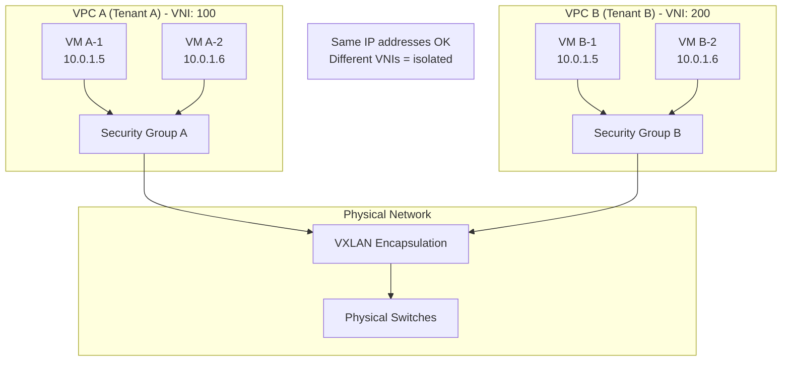
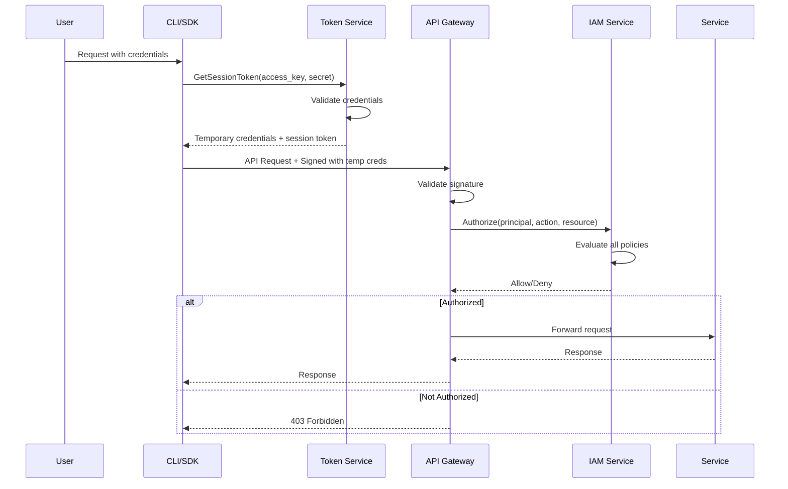

# Security and Compliance

[← Back to Index](./00-index.md) | [← Scalability & Reliability](./05-scalability-and-reliability.md)

---

## Overview

This document covers the security architecture and compliance requirements for cloud provider infrastructure, including multi-tenant isolation, threat modeling, encryption, and regulatory compliance.

---

## Multi-Tenant Isolation

### Isolation Layers

```
┌─────────────────────────────────────────────────────────────────────────────┐
│ MULTI-TENANT ISOLATION LAYERS                                                │
├─────────────────────────────────────────────────────────────────────────────┤
│                                                                              │
│  LAYER 1: HARDWARE ISOLATION                                                 │
│  ─────────────────────────────────────────────────────────────────────────  │
│  • Dedicated security chips (root of trust)                                 │
│  • Hardware memory protection (no shared memory between VMs)                │
│  • IOMMU for device isolation                                               │
│  • Separate physical NICs/offload cards                                     │
│  • Hardware-based encryption engines                                        │
│                                                                              │
│  LAYER 2: HYPERVISOR ISOLATION                                               │
│  ─────────────────────────────────────────────────────────────────────────  │
│  • Type-1 hypervisor (runs directly on hardware)                           │
│  • Minimal attack surface (< 100K lines of code)                           │
│  • Hardware-enforced VM boundaries (VT-x/AMD-V)                            │
│  • Memory isolation via nested page tables                                  │
│  • No storage/network code in hypervisor (offloaded)                       │
│                                                                              │
│  LAYER 3: NETWORK ISOLATION                                                  │
│  ─────────────────────────────────────────────────────────────────────────  │
│  • Virtual Private Clouds (VPCs) per tenant                                 │
│  • VXLAN/Geneve encapsulation with unique VNI per VPC                      │
│  • Security groups (stateful firewalls)                                     │
│  • Network ACLs (stateless rules)                                           │
│  • No cross-tenant traffic by default                                       │
│                                                                              │
│  LAYER 4: STORAGE ISOLATION                                                  │
│  ─────────────────────────────────────────────────────────────────────────  │
│  • Per-tenant encryption keys                                               │
│  • Logical volume isolation                                                 │
│  • Access control on every I/O operation                                   │
│  • Secure deletion (crypto-shredding)                                      │
│                                                                              │
│  LAYER 5: API/CONTROL PLANE ISOLATION                                       │
│  ─────────────────────────────────────────────────────────────────────────  │
│  • Authentication required for all operations                               │
│  • IAM policies enforced at every API call                                 │
│  • Resource-level permissions                                               │
│  • Tenant-scoped API responses                                              │
│                                                                              │
└─────────────────────────────────────────────────────────────────────────────┘
```

### Hardware Isolation Technologies

```
┌─────────────────────────────────────────────────────────────────────────────┐
│ HARDWARE ISOLATION TECHNOLOGIES                                              │
├─────────────────────────────────────────────────────────────────────────────┤
│                                                                              │
│  CUSTOM HYPERVISOR SYSTEM (e.g., Nitro-style)                               │
│  ─────────────────────────────────────────────────────────────────────────  │
│  Architecture:                                                               │
│  • Security chip: Hardware root of trust, secure boot                       │
│  • Hypervisor card: Minimal hypervisor on dedicated hardware               │
│  • Network card: All VPC processing offloaded                              │
│  • Storage card: All EBS processing offloaded                              │
│  • No customer code runs on management plane                               │
│                                                                              │
│  Security Benefits:                                                          │
│  • Hypervisor attack surface reduced 10-100x                               │
│  • Side-channel attacks mitigated (separate hardware)                      │
│  • No shared code paths between tenants                                    │
│                                                                              │
│  CONFIDENTIAL COMPUTING                                                      │
│  ─────────────────────────────────────────────────────────────────────────  │
│  AMD SEV (Secure Encrypted Virtualization):                                 │
│  • Memory encrypted per-VM with unique key                                  │
│  • Hypervisor cannot read VM memory                                         │
│  • Protection from physical memory attacks                                  │
│                                                                              │
│  Intel TDX (Trust Domain Extensions):                                       │
│  • Hardware-isolated trust domains                                          │
│  • Encrypted memory, CPU state protection                                   │
│  • Remote attestation support                                               │
│                                                                              │
│  ENCLAVES (e.g., AWS Nitro Enclaves, Intel SGX):                            │
│  • Isolated compute environment within a VM                                 │
│  • No persistent storage, network, or admin access                         │
│  • Cryptographic attestation                                                │
│  • For processing highly sensitive data                                     │
│                                                                              │
└─────────────────────────────────────────────────────────────────────────────┘
```

### Network Isolation Detail



---

## Identity and Access Management

### Identity Hierarchy

```
┌─────────────────────────────────────────────────────────────────────────────┐
│ IDENTITY HIERARCHY                                                           │
├─────────────────────────────────────────────────────────────────────────────┤
│                                                                              │
│  ORGANIZATION (root)                                                        │
│  └── ACCOUNT (billing/isolation boundary)                                   │
│      ├── ROOT USER (emergency access only)                                  │
│      ├── IAM USERS (human users)                                            │
│      │   └── Access Keys (programmatic access)                              │
│      ├── IAM ROLES (assumable identities)                                   │
│      │   ├── Service Roles (for services to assume)                        │
│      │   ├── Cross-Account Roles (for other accounts)                       │
│      │   └── Instance Profiles (for VMs to assume)                         │
│      ├── IAM GROUPS (collection of users)                                   │
│      └── SERVICE ACCOUNTS (for applications)                                │
│                                                                              │
│  PRINCIPAL TYPES:                                                            │
│  • User: Long-lived identity for humans                                     │
│  • Role: Short-lived identity assumed by services/users                     │
│  • Service: Identity for cloud services (internal)                          │
│  • Federated: External identity (SSO, SAML, OIDC)                          │
│                                                                              │
└─────────────────────────────────────────────────────────────────────────────┘
```

### Authorization Model

```
┌─────────────────────────────────────────────────────────────────────────────┐
│ AUTHORIZATION MODEL                                                          │
├─────────────────────────────────────────────────────────────────────────────┤
│                                                                              │
│  POLICY STRUCTURE:                                                           │
│  ─────────────────────────────────────────────────────────────────────────  │
│  Policy {                                                                    │
│    version: "2024-01-01"                                                    │
│    statements: [                                                             │
│      {                                                                       │
│        effect: "Allow" | "Deny"                                             │
│        principal: who (user, role, service, account)                        │
│        action: what (service:operation)                                     │
│        resource: which (specific resources or wildcards)                    │
│        condition: when (IP range, time, MFA, tags)                          │
│      }                                                                       │
│    ]                                                                         │
│  }                                                                           │
│                                                                              │
│  POLICY EVALUATION:                                                          │
│  ─────────────────────────────────────────────────────────────────────────  │
│                                                                              │
│  1. Start with implicit DENY                                                │
│  2. Evaluate all applicable policies:                                       │
│     • Identity-based policies (attached to principal)                       │
│     • Resource-based policies (attached to resource)                        │
│     • Permission boundaries (maximum permissions)                           │
│     • Organization SCPs (account-level restrictions)                        │
│     • Session policies (temporary restrictions)                             │
│  3. If any explicit DENY → DENY                                             │
│  4. If any ALLOW → ALLOW                                                    │
│  5. Otherwise → DENY (implicit)                                             │
│                                                                              │
│  POLICY TYPES:                                                               │
│  ─────────────────────────────────────────────────────────────────────────  │
│  • Identity policies: What can this principal do?                           │
│  • Resource policies: Who can access this resource?                         │
│  • SCPs: What can this account do? (guardrails)                            │
│  • Permission boundaries: What can this user maximum do?                   │
│                                                                              │
└─────────────────────────────────────────────────────────────────────────────┘
```

### Authentication Flow



---

## Encryption

### Encryption at Rest

```
┌─────────────────────────────────────────────────────────────────────────────┐
│ ENCRYPTION AT REST                                                           │
├─────────────────────────────────────────────────────────────────────────────┤
│                                                                              │
│  KEY HIERARCHY:                                                              │
│  ─────────────────────────────────────────────────────────────────────────  │
│                                                                              │
│  Master Key (HSM)                                                            │
│  └── Customer Master Key (CMK)                                              │
│      └── Data Encryption Key (DEK)                                          │
│          └── Encrypted Data                                                 │
│                                                                              │
│  ENVELOPE ENCRYPTION:                                                        │
│  ─────────────────────────────────────────────────────────────────────────  │
│  1. Generate random DEK                                                     │
│  2. Encrypt data with DEK (fast, symmetric AES-256)                        │
│  3. Encrypt DEK with CMK (slow, but only small key)                        │
│  4. Store: Encrypted DEK + Encrypted Data                                   │
│                                                                              │
│  DECRYPT:                                                                    │
│  1. Get encrypted DEK                                                        │
│  2. Decrypt DEK using CMK (requires KMS call)                              │
│  3. Decrypt data with DEK (local, fast)                                    │
│                                                                              │
│  KEY MANAGEMENT:                                                             │
│  ─────────────────────────────────────────────────────────────────────────  │
│  • CMKs stored in HSMs (FIPS 140-2 Level 3)                                │
│  • Key material never leaves HSM boundary                                   │
│  • Automatic key rotation available                                         │
│  • Customer can bring own keys (BYOK)                                      │
│  • Key policies control key usage                                          │
│                                                                              │
│  DATA TYPES ENCRYPTED:                                                       │
│  • Block storage volumes (EBS)                                              │
│  • Object storage                                                           │
│  • Database storage                                                         │
│  • Snapshots and backups                                                    │
│  • VM memory (with confidential computing)                                 │
│                                                                              │
└─────────────────────────────────────────────────────────────────────────────┘
```

### Encryption in Transit

```
┌─────────────────────────────────────────────────────────────────────────────┐
│ ENCRYPTION IN TRANSIT                                                        │
├─────────────────────────────────────────────────────────────────────────────┤
│                                                                              │
│  API TRAFFIC (Customer → Cloud):                                            │
│  ─────────────────────────────────────────────────────────────────────────  │
│  • TLS 1.2+ required for all API endpoints                                 │
│  • TLS 1.3 preferred                                                        │
│  • Strong cipher suites only (AES-GCM, ChaCha20)                          │
│  • Perfect Forward Secrecy (ECDHE key exchange)                            │
│  • Certificate pinning available for high-security                          │
│                                                                              │
│  INTERNAL TRAFFIC (Service → Service):                                      │
│  ─────────────────────────────────────────────────────────────────────────  │
│  • mTLS (mutual TLS) for service-to-service                                │
│  • Automatic certificate provisioning and rotation                         │
│  • Service mesh can enforce encryption                                      │
│                                                                              │
│  VM-TO-VM TRAFFIC:                                                           │
│  ─────────────────────────────────────────────────────────────────────────  │
│  • Encrypted by default on physical network (for some providers)           │
│  • IPsec VPN available for explicit encryption                             │
│  • Application-level TLS recommended                                        │
│                                                                              │
│  STORAGE TRAFFIC:                                                            │
│  ─────────────────────────────────────────────────────────────────────────  │
│  • Block storage I/O encrypted on wire                                     │
│  • Object storage uses TLS                                                  │
│  • Dedicated storage network (not shared with tenant traffic)              │
│                                                                              │
└─────────────────────────────────────────────────────────────────────────────┘
```

---

## Threat Model

### Attack Surface Analysis

```
┌─────────────────────────────────────────────────────────────────────────────┐
│ ATTACK SURFACE ANALYSIS                                                      │
├─────────────────────────────────────────────────────────────────────────────┤
│                                                                              │
│  EXTERNAL ATTACK SURFACES:                                                   │
│  ─────────────────────────────────────────────────────────────────────────  │
│  1. Public APIs                                                              │
│     • Authentication bypass                                                 │
│     • Authorization flaws                                                   │
│     • API abuse / DoS                                                       │
│     Mitigations: Strong auth, rate limiting, input validation              │
│                                                                              │
│  2. Customer VMs (compromised tenant)                                       │
│     • VM escape attempts                                                    │
│     • Side-channel attacks                                                  │
│     • Network attacks on other tenants                                      │
│     Mitigations: Hypervisor hardening, network isolation                   │
│                                                                              │
│  3. Internet-facing services (DNS, CDN)                                     │
│     • DDoS attacks                                                          │
│     • DNS hijacking                                                         │
│     Mitigations: DDoS protection, DNSSEC                                   │
│                                                                              │
│  INTERNAL ATTACK SURFACES:                                                   │
│  ─────────────────────────────────────────────────────────────────────────  │
│  4. Privileged insiders                                                      │
│     • Unauthorized data access                                              │
│     • Configuration tampering                                               │
│     Mitigations: Least privilege, audit logging, separation of duties      │
│                                                                              │
│  5. Supply chain                                                             │
│     • Compromised hardware                                                  │
│     • Malicious software dependencies                                       │
│     Mitigations: Hardware verification, code signing, SBOM                 │
│                                                                              │
│  6. Physical access                                                          │
│     • Hardware tampering                                                    │
│     • Data center breach                                                    │
│     Mitigations: Physical security, tamper-evident seals                   │
│                                                                              │
└─────────────────────────────────────────────────────────────────────────────┘
```

### Threat Scenarios

| Threat | Attack Vector | Impact | Mitigation |
|--------|--------------|--------|------------|
| **Cross-tenant data access** | VM escape, memory exploit | Data breach | Hardware isolation, confidential computing |
| **Side-channel attack** | Spectre/Meltdown variants | Information leakage | Microcode patches, process isolation |
| **Privilege escalation** | IAM misconfiguration | Unauthorized access | Policy validation, guardrails |
| **Data exfiltration** | Compromised instance | Data loss | VPC isolation, egress filtering |
| **DDoS** | Volumetric attack | Service unavailable | DDoS protection, auto-scaling |
| **Credential theft** | Phishing, key compromise | Account takeover | MFA, short-lived credentials |
| **Insider threat** | Malicious employee | Data breach, sabotage | Audit logging, access reviews |

### Noisy Neighbor Mitigation

```
┌─────────────────────────────────────────────────────────────────────────────┐
│ NOISY NEIGHBOR MITIGATION                                                    │
├─────────────────────────────────────────────────────────────────────────────┤
│                                                                              │
│  PROBLEM: One tenant's workload affects another's performance               │
│                                                                              │
│  CPU ISOLATION:                                                              │
│  ─────────────────────────────────────────────────────────────────────────  │
│  • Dedicated vCPUs (no sharing in most instance types)                     │
│  • CPU credit/burst systems for burstable instances                        │
│  • cgroup limits enforced by hypervisor                                    │
│                                                                              │
│  MEMORY ISOLATION:                                                           │
│  ─────────────────────────────────────────────────────────────────────────  │
│  • Hard memory limits (no overcommit for guaranteed instances)             │
│  • NUMA awareness for performance                                           │
│  • Memory bandwidth monitoring                                              │
│                                                                              │
│  NETWORK ISOLATION:                                                          │
│  ─────────────────────────────────────────────────────────────────────────  │
│  • Per-VM bandwidth limits                                                  │
│  • Fair queuing on virtual switches                                         │
│  • EBS-optimized instances with dedicated bandwidth                        │
│                                                                              │
│  STORAGE ISOLATION:                                                          │
│  ─────────────────────────────────────────────────────────────────────────  │
│  • IOPS limits per volume                                                   │
│  • Throughput limits per volume                                             │
│  • Provisioned IOPS for guaranteed performance                             │
│  • Storage credit systems for burstable volumes                            │
│                                                                              │
│  NETWORK I/O:                                                                │
│  ─────────────────────────────────────────────────────────────────────────  │
│  • Enhanced networking (SR-IOV) for consistent performance                 │
│  • Placement groups for low-latency                                        │
│  • Dedicated hosts for full hardware isolation                             │
│                                                                              │
└─────────────────────────────────────────────────────────────────────────────┘
```

---

## Security Controls

### Defense in Depth

```
┌─────────────────────────────────────────────────────────────────────────────┐
│ DEFENSE IN DEPTH LAYERS                                                      │
├─────────────────────────────────────────────────────────────────────────────┤
│                                                                              │
│  ┌─────────────────────────────────────────────────────────────────────┐    │
│  │ LAYER 7: DATA SECURITY                                               │    │
│  │ Encryption at rest, data classification, DLP                         │    │
│  └─────────────────────────────────────────────────────────────────────┘    │
│                              ↓                                               │
│  ┌─────────────────────────────────────────────────────────────────────┐    │
│  │ LAYER 6: APPLICATION SECURITY                                        │    │
│  │ Input validation, WAF, secure coding                                 │    │
│  └─────────────────────────────────────────────────────────────────────┘    │
│                              ↓                                               │
│  ┌─────────────────────────────────────────────────────────────────────┐    │
│  │ LAYER 5: ACCESS CONTROL                                              │    │
│  │ IAM, MFA, least privilege, RBAC/ABAC                                │    │
│  └─────────────────────────────────────────────────────────────────────┘    │
│                              ↓                                               │
│  ┌─────────────────────────────────────────────────────────────────────┐    │
│  │ LAYER 4: NETWORK SECURITY                                            │    │
│  │ VPC, security groups, NACLs, TLS                                     │    │
│  └─────────────────────────────────────────────────────────────────────┘    │
│                              ↓                                               │
│  ┌─────────────────────────────────────────────────────────────────────┐    │
│  │ LAYER 3: COMPUTE ISOLATION                                           │    │
│  │ Hypervisor, hardware isolation, patching                             │    │
│  └─────────────────────────────────────────────────────────────────────┘    │
│                              ↓                                               │
│  ┌─────────────────────────────────────────────────────────────────────┐    │
│  │ LAYER 2: INFRASTRUCTURE SECURITY                                     │    │
│  │ DDoS protection, edge filtering, BGP security                        │    │
│  └─────────────────────────────────────────────────────────────────────┘    │
│                              ↓                                               │
│  ┌─────────────────────────────────────────────────────────────────────┐    │
│  │ LAYER 1: PHYSICAL SECURITY                                           │    │
│  │ Data center access, surveillance, tamper detection                   │    │
│  └─────────────────────────────────────────────────────────────────────┘    │
│                                                                              │
└─────────────────────────────────────────────────────────────────────────────┘
```

### Security Monitoring

```
┌─────────────────────────────────────────────────────────────────────────────┐
│ SECURITY MONITORING                                                          │
├─────────────────────────────────────────────────────────────────────────────┤
│                                                                              │
│  API LOGGING:                                                                │
│  ─────────────────────────────────────────────────────────────────────────  │
│  • Every API call logged (who, what, when, from where)                     │
│  • Request and response captured (sanitized)                               │
│  • Tamper-proof log storage                                                 │
│  • 90+ days retention (configurable)                                        │
│                                                                              │
│  NETWORK FLOW LOGS:                                                          │
│  ─────────────────────────────────────────────────────────────────────────  │
│  • VPC flow logs capture all network traffic metadata                      │
│  • Source/dest IPs, ports, protocols, bytes                                │
│  • Accepted/rejected packets                                                │
│  • Used for forensics and anomaly detection                                │
│                                                                              │
│  THREAT DETECTION:                                                           │
│  ─────────────────────────────────────────────────────────────────────────  │
│  • ML-based anomaly detection                                               │
│  • Known threat signature matching                                          │
│  • Cryptocurrency mining detection                                          │
│  • Data exfiltration patterns                                               │
│  • Compromised credential usage                                             │
│                                                                              │
│  INCIDENT RESPONSE:                                                          │
│  ─────────────────────────────────────────────────────────────────────────  │
│  • Automated containment (block IPs, revoke credentials)                   │
│  • Alert routing to SOC                                                     │
│  • Forensic data collection                                                 │
│  • Customer notification (for their resources)                             │
│                                                                              │
└─────────────────────────────────────────────────────────────────────────────┘
```

---

## Compliance

### Compliance Certifications

| Standard | Scope | Key Requirements |
|----------|-------|------------------|
| **SOC 2 Type II** | Security, availability, confidentiality | Annual audit of controls |
| **ISO 27001** | Information security management | Risk management, ISMS |
| **ISO 27017** | Cloud-specific security | Cloud security controls |
| **ISO 27018** | PII protection in cloud | Privacy, data handling |
| **PCI DSS** | Payment card data | Cardholder data protection |
| **HIPAA** | Healthcare data (US) | PHI protection, BAA |
| **FedRAMP** | US government | Federal security standards |
| **GDPR** | EU personal data | Data protection, privacy rights |
| **SOX** | Financial reporting | Internal controls |

### Shared Responsibility Model

```
┌─────────────────────────────────────────────────────────────────────────────┐
│ SHARED RESPONSIBILITY MODEL                                                  │
├─────────────────────────────────────────────────────────────────────────────┤
│                                                                              │
│  CLOUD PROVIDER RESPONSIBILITY ("Security OF the Cloud"):                   │
│  ─────────────────────────────────────────────────────────────────────────  │
│  • Physical data center security                                            │
│  • Hardware security (servers, storage, networking)                         │
│  • Hypervisor security and patching                                         │
│  • Network infrastructure security                                          │
│  • Service availability                                                     │
│  • Compliance certifications for infrastructure                             │
│                                                                              │
│  CUSTOMER RESPONSIBILITY ("Security IN the Cloud"):                         │
│  ─────────────────────────────────────────────────────────────────────────  │
│  • Guest OS security and patching                                           │
│  • Application security                                                     │
│  • Data encryption (customer chooses)                                       │
│  • IAM configuration (who can access what)                                 │
│  • Network configuration (security groups, NACLs)                          │
│  • Firewall rules                                                           │
│  • Compliance for their workloads                                           │
│                                                                              │
│  SHARED / VARIES BY SERVICE:                                                │
│  ─────────────────────────────────────────────────────────────────────────  │
│  • IaaS (VMs): Customer manages OS and up                                  │
│  • PaaS (Managed DBs): Provider manages more, customer manages data        │
│  • SaaS (Applications): Provider manages almost everything                 │
│                                                                              │
│  ┌───────────────────────────────────────────────────────────────────────┐  │
│  │           IaaS             PaaS              SaaS                      │  │
│  │  Customer ████████████     ████████          ████                     │  │
│  │  Provider ████             ████████████      ████████████████         │  │
│  └───────────────────────────────────────────────────────────────────────┘  │
│                                                                              │
└─────────────────────────────────────────────────────────────────────────────┘
```

### Data Residency and Sovereignty

```
┌─────────────────────────────────────────────────────────────────────────────┐
│ DATA RESIDENCY AND SOVEREIGNTY                                               │
├─────────────────────────────────────────────────────────────────────────────┤
│                                                                              │
│  DATA RESIDENCY (where data is stored):                                     │
│  ─────────────────────────────────────────────────────────────────────────  │
│  • Customer chooses region for resources                                    │
│  • Data stays in selected region (by default)                              │
│  • Replication only within region unless configured otherwise              │
│  • Some metadata may be global (resource names, not content)               │
│                                                                              │
│  DATA SOVEREIGNTY (which laws apply):                                       │
│  ─────────────────────────────────────────────────────────────────────────  │
│  • Data subject to laws of storage location                                │
│  • Some countries require local data centers                               │
│  • Government access laws vary by jurisdiction                              │
│                                                                              │
│  COMPLIANCE OFFERINGS:                                                       │
│  ─────────────────────────────────────────────────────────────────────────  │
│  • Dedicated/isolated regions (government, regulated industries)           │
│  • Local zones with data residency guarantees                              │
│  • Customer-managed keys (BYOK) for key sovereignty                        │
│  • Audit logs with data access transparency                                │
│                                                                              │
│  EXAMPLES:                                                                   │
│  • GDPR (EU): Data of EU residents, strict transfer rules                  │
│  • China: Data localization required                                        │
│  • Australia: Government data must stay in-country                         │
│  • Germany: Stricter privacy requirements                                   │
│                                                                              │
└─────────────────────────────────────────────────────────────────────────────┘
```

---

## Secure Development

### Security in Software Development

```
┌─────────────────────────────────────────────────────────────────────────────┐
│ SECURE DEVELOPMENT LIFECYCLE                                                 │
├─────────────────────────────────────────────────────────────────────────────┤
│                                                                              │
│  DESIGN PHASE:                                                               │
│  • Threat modeling for new features                                         │
│  • Security architecture review                                             │
│  • Principle of least privilege                                             │
│                                                                              │
│  DEVELOPMENT PHASE:                                                          │
│  • Secure coding training                                                   │
│  • Static analysis (SAST) on every commit                                  │
│  • Dependency scanning (SCA)                                                │
│  • Secrets detection (no hardcoded credentials)                            │
│                                                                              │
│  TESTING PHASE:                                                              │
│  • Dynamic analysis (DAST)                                                  │
│  • Penetration testing                                                      │
│  • Security-focused code review                                             │
│  • Fuzz testing                                                             │
│                                                                              │
│  DEPLOYMENT PHASE:                                                           │
│  • Signed artifacts only                                                    │
│  • Immutable infrastructure                                                 │
│  • Canary deployments with security monitoring                             │
│                                                                              │
│  OPERATIONS PHASE:                                                           │
│  • Continuous vulnerability scanning                                        │
│  • Bug bounty program                                                       │
│  • Incident response procedures                                             │
│  • Regular security audits                                                  │
│                                                                              │
└─────────────────────────────────────────────────────────────────────────────┘
```

---

## Summary

| Security Aspect | Key Controls | Responsible Party |
|----------------|--------------|-------------------|
| **Hardware Isolation** | Custom silicon, dedicated cards | Provider |
| **Hypervisor Security** | Minimal surface, hardware-backed | Provider |
| **Network Isolation** | VPC, security groups, encryption | Shared |
| **Data Encryption** | At-rest and in-transit, KMS | Shared |
| **Access Control** | IAM, MFA, least privilege | Customer (config) |
| **Compliance** | Certifications, audits | Provider (infra), Customer (apps) |
| **Monitoring** | API logs, flow logs, threat detection | Shared |

---

[Next: Observability →](./07-observability.md)
