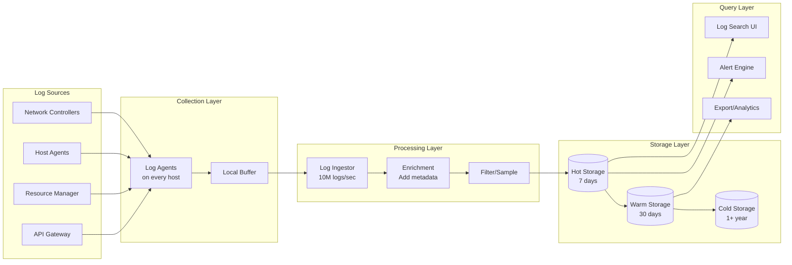

# Observability

[← Back to Index](./00-index.md) | [← Security & Compliance](./06-security-and-compliance.md)

---

## Overview

This document covers the observability strategy for cloud provider architecture, including metrics collection, logging, distributed tracing, dashboards, and alerting for both the control plane and data plane components.

---

## Metrics

### Control Plane Metrics

```
┌─────────────────────────────────────────────────────────────────────────────┐
│ CONTROL PLANE METRICS                                                        │
├─────────────────────────────────────────────────────────────────────────────┤
│                                                                              │
│  API GATEWAY METRICS:                                                        │
│  ─────────────────────────────────────────────────────────────────────────  │
│  api_request_total{api, method, status_code, region}                        │
│  api_request_latency_ms{api, method, quantile}                              │
│  api_request_size_bytes{api, direction}                                     │
│  api_rate_limit_rejections_total{api, account}                              │
│  api_auth_failures_total{reason}                                            │
│                                                                              │
│  RESOURCE MANAGER METRICS:                                                   │
│  ─────────────────────────────────────────────────────────────────────────  │
│  resource_operations_total{operation, resource_type, status}                │
│  resource_operation_latency_ms{operation, resource_type, quantile}          │
│  resource_state_transitions_total{from_state, to_state, resource_type}     │
│  resource_count{resource_type, state, region}                               │
│  quota_usage_percent{account, resource_type, region}                       │
│                                                                              │
│  METADATA STORE METRICS:                                                     │
│  ─────────────────────────────────────────────────────────────────────────  │
│  metadata_query_total{operation, table}                                     │
│  metadata_query_latency_ms{operation, table, quantile}                     │
│  metadata_replication_lag_ms{follower}                                      │
│  metadata_storage_bytes{table}                                              │
│  metadata_connections_active                                                 │
│                                                                              │
│  SCHEDULER METRICS:                                                          │
│  ─────────────────────────────────────────────────────────────────────────  │
│  placement_requests_total{status, cell}                                     │
│  placement_latency_ms{quantile}                                             │
│  placement_queue_depth{cell}                                                │
│  placement_failures_total{reason}                                           │
│  placement_retries_total{cell}                                              │
│                                                                              │
└─────────────────────────────────────────────────────────────────────────────┘
```

### Data Plane Metrics

```
┌─────────────────────────────────────────────────────────────────────────────┐
│ DATA PLANE METRICS                                                           │
├─────────────────────────────────────────────────────────────────────────────┤
│                                                                              │
│  COMPUTE (HOST) METRICS:                                                     │
│  ─────────────────────────────────────────────────────────────────────────  │
│  host_cpu_utilization_percent{host, cell}                                   │
│  host_memory_utilization_percent{host, cell}                                │
│  host_vm_count{host, cell}                                                   │
│  host_available_capacity{host, resource_type}                               │
│  host_health_status{host, cell}                                             │
│  vm_launch_latency_ms{cell, quantile}                                       │
│  vm_boot_time_ms{image_type, quantile}                                      │
│                                                                              │
│  NETWORK METRICS:                                                            │
│  ─────────────────────────────────────────────────────────────────────────  │
│  network_packets_total{direction, vpc}                                      │
│  network_bytes_total{direction, vpc}                                        │
│  network_packet_drops_total{reason, cell}                                   │
│  network_latency_ms{src_az, dst_az, quantile}                              │
│  flow_table_entries{host}                                                    │
│  flow_programming_latency_ms{quantile}                                      │
│  security_group_rule_count{vpc}                                             │
│                                                                              │
│  STORAGE METRICS:                                                            │
│  ─────────────────────────────────────────────────────────────────────────  │
│  storage_iops_total{volume_type, operation}                                 │
│  storage_throughput_bytes{volume_type, operation}                           │
│  storage_latency_ms{volume_type, operation, quantile}                      │
│  storage_queue_depth{volume}                                                 │
│  storage_capacity_bytes{pool, type}                                         │
│  storage_replication_lag_ms{volume}                                         │
│                                                                              │
│  LOAD BALANCER METRICS:                                                      │
│  ─────────────────────────────────────────────────────────────────────────  │
│  lb_connections_active{lb}                                                   │
│  lb_requests_total{lb, status_code}                                         │
│  lb_healthy_targets{lb, target_group}                                       │
│  lb_latency_ms{lb, quantile}                                                │
│  lb_spillover_count{lb}                                                      │
│                                                                              │
└─────────────────────────────────────────────────────────────────────────────┘
```

### Cell Health Metrics

```
┌─────────────────────────────────────────────────────────────────────────────┐
│ CELL HEALTH METRICS                                                          │
├─────────────────────────────────────────────────────────────────────────────┤
│                                                                              │
│  CELL AGGREGATE METRICS:                                                     │
│  ─────────────────────────────────────────────────────────────────────────  │
│  cell_host_count{cell, state}                                               │
│  cell_vm_count{cell, state}                                                  │
│  cell_capacity_utilization_percent{cell, resource_type}                    │
│  cell_controller_health{cell}                                               │
│  cell_placement_success_rate{cell}                                          │
│  cell_last_deployment_timestamp{cell}                                       │
│                                                                              │
│  CELL COMPARISON METRICS:                                                    │
│  ─────────────────────────────────────────────────────────────────────────  │
│  cell_error_rate_vs_baseline{cell}                                          │
│  cell_latency_vs_baseline{cell}                                             │
│  cell_deployment_version{cell}                                              │
│                                                                              │
│  GOLDEN SIGNALS PER CELL:                                                    │
│  ─────────────────────────────────────────────────────────────────────────  │
│  • Latency: p50, p95, p99 for key operations                               │
│  • Traffic: Requests per second                                             │
│  • Errors: Error rate by type                                               │
│  • Saturation: CPU, memory, network, storage utilization                   │
│                                                                              │
└─────────────────────────────────────────────────────────────────────────────┘
```

---

## Dashboards

### Global Operations Dashboard

```
┌─────────────────────────────────────────────────────────────────────────────┐
│ GLOBAL OPERATIONS DASHBOARD                                                  │
├─────────────────────────────────────────────────────────────────────────────┤
│                                                                              │
│  ┌─────────────────────────────────────────────────────────────────────┐    │
│  │ GLOBAL HEALTH                                          [HEALTHY]    │    │
│  │                                                                      │    │
│  │  Regions: 33/33 healthy    AZs: 100/100 healthy                     │    │
│  │  Cells: 2000/2002 healthy  Hosts: 59.8M/60M healthy                 │    │
│  └─────────────────────────────────────────────────────────────────────┘    │
│                                                                              │
│  ┌────────────────────────┐  ┌────────────────────────┐                     │
│  │ API REQUEST RATE       │  │ API LATENCY (p99)      │                     │
│  │                        │  │                        │                     │
│  │  ████████████████████  │  │  ████████              │                     │
│  │  150K req/s            │  │  245 ms                │                     │
│  │  ↑ 2% from yesterday   │  │  ↓ 5% from yesterday   │                     │
│  └────────────────────────┘  └────────────────────────┘                     │
│                                                                              │
│  ┌────────────────────────┐  ┌────────────────────────┐                     │
│  │ VM LAUNCHES/MIN        │  │ ERROR RATE             │                     │
│  │                        │  │                        │                     │
│  │  ████████████          │  │  █                     │                     │
│  │  85K launches/min      │  │  0.02%                 │                     │
│  │  Peak: 120K            │  │  Target: < 0.1%        │                     │
│  └────────────────────────┘  └────────────────────────┘                     │
│                                                                              │
│  ┌─────────────────────────────────────────────────────────────────────┐    │
│  │ REGION MAP                                                           │    │
│  │                                                                      │    │
│  │  [us-east-1: ✓]  [us-west-2: ✓]  [eu-west-1: ✓]  [ap-south-1: ✓]  │    │
│  │  [us-east-2: ✓]  [eu-central-1: ✓] [ap-northeast-1: ✓] ...         │    │
│  │                                                                      │    │
│  └─────────────────────────────────────────────────────────────────────┘    │
│                                                                              │
│  ┌─────────────────────────────────────────────────────────────────────┐    │
│  │ ACTIVE DEPLOYMENTS                                                   │    │
│  │                                                                      │    │
│  │  • host-agent v2.45.1 → Wave 3 (25% complete)                       │    │
│  │  • network-controller v1.88.0 → Canary (5% complete)                │    │
│  │  • api-gateway v3.12.4 → Completed                                  │    │
│  └─────────────────────────────────────────────────────────────────────┘    │
│                                                                              │
└─────────────────────────────────────────────────────────────────────────────┘
```

### Cell Drill-Down Dashboard

```
┌─────────────────────────────────────────────────────────────────────────────┐
│ CELL DRILL-DOWN: cell-us-east-1a-042                                        │
├─────────────────────────────────────────────────────────────────────────────┤
│                                                                              │
│  ┌─────────────────────────────────────────────────────────────────────┐    │
│  │ CELL STATUS: HEALTHY                                                 │    │
│  │                                                                      │    │
│  │  Hosts: 28,450 / 30,000          VMs: 425,000                       │    │
│  │  Utilization: 72%                Controller: v2.45.0                │    │
│  │  Last Deployment: 2h ago         Deployment Wave: Production        │    │
│  └─────────────────────────────────────────────────────────────────────┘    │
│                                                                              │
│  ┌─────────────────────────────────┐  ┌─────────────────────────────────┐  │
│  │ CAPACITY BY RESOURCE            │  │ HOST HEALTH                     │  │
│  │                                 │  │                                 │  │
│  │ CPU:     ████████████░░░ 72%   │  │ Healthy:  ████████████████ 98%  │  │
│  │ Memory:  ███████████░░░░ 68%   │  │ Impaired: █                2%   │  │
│  │ Storage: █████████░░░░░░ 55%   │  │ Retiring: (none)               │  │
│  │ Network: ████████░░░░░░░ 45%   │  │                                 │  │
│  └─────────────────────────────────┘  └─────────────────────────────────┘  │
│                                                                              │
│  ┌─────────────────────────────────────────────────────────────────────┐    │
│  │ PLACEMENT METRICS                                                    │    │
│  │                                                                      │    │
│  │  Success Rate: 99.7%    Avg Latency: 45ms    Queue Depth: 12       │    │
│  │                                                                      │    │
│  │  Failures by Reason:                                                 │    │
│  │  • Capacity exhausted: 15                                            │    │
│  │  • Spread constraint: 8                                              │    │
│  │  • Instance type unavailable: 3                                      │    │
│  └─────────────────────────────────────────────────────────────────────┘    │
│                                                                              │
│  ┌─────────────────────────────────────────────────────────────────────┐    │
│  │ CELL vs BASELINE COMPARISON (last 1 hour)                           │    │
│  │                                                                      │    │
│  │  Metric          This Cell    Region Avg    Status                  │    │
│  │  ─────────────────────────────────────────────────────────────────  │    │
│  │  Error rate      0.018%       0.020%        ✓ GOOD                  │    │
│  │  Latency p99     52ms         48ms          ✓ GOOD                  │    │
│  │  Launch time     28s          32s           ✓ GOOD                  │    │
│  │  Host failures   2            3             ✓ GOOD                  │    │
│  └─────────────────────────────────────────────────────────────────────┘    │
│                                                                              │
└─────────────────────────────────────────────────────────────────────────────┘
```

### SLO Dashboard

```
┌─────────────────────────────────────────────────────────────────────────────┐
│ SLO DASHBOARD                                                                │
├─────────────────────────────────────────────────────────────────────────────┤
│                                                                              │
│  ┌─────────────────────────────────────────────────────────────────────┐    │
│  │ AVAILABILITY SLOs (30-day window)                                    │    │
│  │                                                                      │    │
│  │  Service            Target    Current    Budget    Status           │    │
│  │  ─────────────────────────────────────────────────────────────────  │    │
│  │  Compute API        99.9%     99.95%     4.3 hrs   ✓ HEALTHY       │    │
│  │  Compute Data Plane 99.99%    99.992%    38 min    ✓ HEALTHY       │    │
│  │  Network API        99.9%     99.91%     3.9 hrs   ✓ HEALTHY       │    │
│  │  Network Data Plane 99.99%    99.995%    21 min    ✓ HEALTHY       │    │
│  │  Storage API        99.9%     99.87%     5.6 hrs   ⚠ AT RISK       │    │
│  │  Storage Data Plane 99.99%    99.988%    52 min    ✓ HEALTHY       │    │
│  └─────────────────────────────────────────────────────────────────────┘    │
│                                                                              │
│  ┌─────────────────────────────────────────────────────────────────────┐    │
│  │ LATENCY SLOs (7-day window)                                          │    │
│  │                                                                      │    │
│  │  Operation           Target p99  Current p99  Status                │    │
│  │  ─────────────────────────────────────────────────────────────────  │    │
│  │  API Request         500ms       245ms        ✓ HEALTHY             │    │
│  │  VM Provisioning     120s        85s          ✓ HEALTHY             │    │
│  │  Network Setup       30s         18s          ✓ HEALTHY             │    │
│  │  Storage Attach      60s         42s          ✓ HEALTHY             │    │
│  └─────────────────────────────────────────────────────────────────────┘    │
│                                                                              │
│  ┌─────────────────────────────────────────────────────────────────────┐    │
│  │ ERROR BUDGET BURN RATE                                               │    │
│  │                                                                      │    │
│  │  Compute API:   ▓▓▓▓▓▓░░░░░░░░░░  38% consumed (22 days remaining) │    │
│  │  Storage API:   ▓▓▓▓▓▓▓▓▓▓▓░░░░░  72% consumed (8 days remaining)  │    │
│  │                                                                      │    │
│  └─────────────────────────────────────────────────────────────────────┘    │
│                                                                              │
└─────────────────────────────────────────────────────────────────────────────┘
```

---

## Logging

### Structured Logging Format

```
┌─────────────────────────────────────────────────────────────────────────────┐
│ STRUCTURED LOG FORMAT                                                        │
├─────────────────────────────────────────────────────────────────────────────┤
│                                                                              │
│  {                                                                           │
│    "timestamp": "2024-01-15T10:23:45.123Z",                                 │
│    "level": "INFO",                                                          │
│    "service": "resource-manager",                                            │
│    "version": "v2.45.1",                                                     │
│    "region": "us-east-1",                                                    │
│    "cell": "cell-us-east-1a-042",                                           │
│    "host": "host-abc123",                                                    │
│                                                                              │
│    "trace_id": "abc123def456",                                              │
│    "span_id": "789ghi",                                                      │
│    "parent_span_id": "456def",                                              │
│                                                                              │
│    "event": "resource_created",                                              │
│    "resource_type": "instance",                                              │
│    "resource_id": "i-abc123def",                                            │
│    "account_id": "123456789",                                               │
│                                                                              │
│    "duration_ms": 145,                                                       │
│    "status": "success",                                                      │
│                                                                              │
│    "attributes": {                                                           │
│      "instance_type": "m5.large",                                           │
│      "availability_zone": "us-east-1a",                                     │
│      "placement_cell": "cell-042"                                           │
│    }                                                                         │
│  }                                                                           │
│                                                                              │
└─────────────────────────────────────────────────────────────────────────────┘
```

### Log Categories

| Category | Retention | Use Case |
|----------|-----------|----------|
| **API Audit Logs** | 90+ days | Security, compliance, debugging |
| **Resource Events** | 90 days | Customer visibility, debugging |
| **System Logs** | 30 days | Operational debugging |
| **Security Logs** | 1+ year | Forensics, compliance |
| **Performance Logs** | 14 days | Optimization, debugging |
| **Debug Logs** | 7 days | Development, troubleshooting |

### Log Aggregation Pipeline



---

## Distributed Tracing

### Trace Structure

```
┌─────────────────────────────────────────────────────────────────────────────┐
│ DISTRIBUTED TRACE EXAMPLE: CreateInstance                                    │
├─────────────────────────────────────────────────────────────────────────────┤
│                                                                              │
│  Trace ID: abc123def456                                                      │
│  Total Duration: 45,230 ms                                                   │
│                                                                              │
│  ─────────────────────────────────────────────────────────────────────────  │
│                                                                              │
│  [API Gateway] span-001 (145ms)                                              │
│  ├── operation: CreateInstance                                               │
│  ├── status: success                                                         │
│  └── attributes: {api: "ec2", method: "POST"}                               │
│      │                                                                       │
│      └─► [IAM Service] span-002 (35ms)                                      │
│          ├── operation: Authorize                                            │
│          └── status: allowed                                                 │
│      │                                                                       │
│      └─► [Resource Manager] span-003 (45,000ms)                             │
│          ├── operation: CreateInstance                                       │
│          │                                                                   │
│          ├─► [Quota Service] span-004 (12ms)                                │
│          │   └── operation: CheckQuota                                      │
│          │                                                                   │
│          ├─► [Metadata Store] span-005 (28ms)                               │
│          │   └── operation: InsertResource                                  │
│          │                                                                   │
│          ├─► [Scheduler] span-006 (85ms)                                    │
│          │   ├── operation: FindPlacement                                   │
│          │   └── attributes: {cell: "cell-042", host: "host-789"}          │
│          │                                                                   │
│          └─► [Cell Controller] span-007 (44,800ms)                          │
│              ├── operation: ProvisionInstance                               │
│              │                                                               │
│              └─► [Host Agent] span-008 (44,500ms)                           │
│                  ├── operation: StartVM                                     │
│                  ├── attributes: {boot_time_ms: 28000}                      │
│                  │                                                           │
│                  ├─► [Network Agent] span-009 (1,200ms)                     │
│                  │   └── operation: ConfigureNetworking                     │
│                  │                                                           │
│                  └─► [Storage Agent] span-010 (2,500ms)                     │
│                      └── operation: AttachRootVolume                        │
│                                                                              │
└─────────────────────────────────────────────────────────────────────────────┘
```

### Span Attributes

```
┌─────────────────────────────────────────────────────────────────────────────┐
│ STANDARD SPAN ATTRIBUTES                                                     │
├─────────────────────────────────────────────────────────────────────────────┤
│                                                                              │
│  REQUIRED ATTRIBUTES:                                                        │
│  ─────────────────────────────────────────────────────────────────────────  │
│  • trace_id: Unique identifier for the entire request                       │
│  • span_id: Unique identifier for this operation                            │
│  • parent_span_id: Parent span (null for root)                              │
│  • operation_name: What this span represents                                │
│  • service_name: Which service executed this                                │
│  • start_time: When operation started                                        │
│  • duration_ms: How long it took                                            │
│  • status: success/error                                                    │
│                                                                              │
│  RECOMMENDED ATTRIBUTES:                                                     │
│  ─────────────────────────────────────────────────────────────────────────  │
│  • region: Geographic region                                                │
│  • availability_zone: AZ within region                                      │
│  • cell_id: Cell identifier                                                 │
│  • host_id: Host identifier                                                 │
│  • account_id: Customer account                                             │
│  • resource_id: Resource being operated on                                  │
│  • resource_type: Type of resource                                          │
│  • error_type: Error category if failed                                     │
│  • error_message: Error details if failed                                   │
│                                                                              │
│  CUSTOM ATTRIBUTES (per operation type):                                    │
│  ─────────────────────────────────────────────────────────────────────────  │
│  • Placement: cell_id, host_id, placement_strategy                         │
│  • Network: vpc_id, subnet_id, security_groups                             │
│  • Storage: volume_id, volume_type, iops                                   │
│                                                                              │
└─────────────────────────────────────────────────────────────────────────────┘
```

---

## Alerting

### Alert Definitions

```
┌─────────────────────────────────────────────────────────────────────────────┐
│ CRITICAL ALERTS                                                              │
├─────────────────────────────────────────────────────────────────────────────┤
│                                                                              │
│  ALERT: CellControllerDown                                                   │
│  ─────────────────────────────────────────────────────────────────────────  │
│  Condition: cell_controller_health{cell} == 0 for > 2 minutes              │
│  Severity: CRITICAL                                                          │
│  Response: Page on-call, initiate cell failover runbook                     │
│  Runbook: /runbooks/cell-controller-failure                                 │
│                                                                              │
│  ALERT: APIErrorRateHigh                                                     │
│  ─────────────────────────────────────────────────────────────────────────  │
│  Condition: rate(api_errors_total[5m]) / rate(api_requests_total[5m]) > 1% │
│  Severity: CRITICAL                                                          │
│  Response: Page on-call, halt deployments                                   │
│  Runbook: /runbooks/api-error-investigation                                 │
│                                                                              │
│  ALERT: MetadataStoreReplicationLag                                          │
│  ─────────────────────────────────────────────────────────────────────────  │
│  Condition: metadata_replication_lag_ms > 30000 for > 5 minutes            │
│  Severity: CRITICAL                                                          │
│  Response: Page DBA, consider read-only mode                                │
│  Runbook: /runbooks/metadata-replication-lag                                │
│                                                                              │
│  ALERT: AZHealthDegraded                                                     │
│  ─────────────────────────────────────────────────────────────────────────  │
│  Condition: az_healthy_cells / az_total_cells < 0.8                        │
│  Severity: CRITICAL                                                          │
│  Response: Incident commander, customer communication                       │
│  Runbook: /runbooks/az-degradation                                          │
│                                                                              │
└─────────────────────────────────────────────────────────────────────────────┘
```

```
┌─────────────────────────────────────────────────────────────────────────────┐
│ WARNING ALERTS                                                               │
├─────────────────────────────────────────────────────────────────────────────┤
│                                                                              │
│  ALERT: CellCapacityHigh                                                     │
│  ─────────────────────────────────────────────────────────────────────────  │
│  Condition: cell_capacity_utilization_percent > 80 for > 30 minutes        │
│  Severity: WARNING                                                           │
│  Response: Review capacity, consider adding hosts                           │
│  Runbook: /runbooks/capacity-planning                                       │
│                                                                              │
│  ALERT: PlacementFailureRateHigh                                             │
│  ─────────────────────────────────────────────────────────────────────────  │
│  Condition: placement_failures_total / placement_requests_total > 0.5%     │
│  Severity: WARNING                                                           │
│  Response: Investigate placement constraints, capacity                      │
│  Runbook: /runbooks/placement-failures                                      │
│                                                                              │
│  ALERT: DeploymentStalled                                                    │
│  ─────────────────────────────────────────────────────────────────────────  │
│  Condition: deployment_progress == 0 for > 1 hour                          │
│  Severity: WARNING                                                           │
│  Response: Check deployment metrics, consider rollback                      │
│  Runbook: /runbooks/deployment-troubleshooting                              │
│                                                                              │
│  ALERT: SLOBudgetBurning                                                     │
│  ─────────────────────────────────────────────────────────────────────────  │
│  Condition: slo_budget_remaining_percent < 20                               │
│  Severity: WARNING                                                           │
│  Response: Review recent incidents, prioritize reliability                  │
│  Runbook: /runbooks/slo-management                                          │
│                                                                              │
└─────────────────────────────────────────────────────────────────────────────┘
```

### Alert Routing

```
┌─────────────────────────────────────────────────────────────────────────────┐
│ ALERT ROUTING MATRIX                                                         │
├─────────────────────────────────────────────────────────────────────────────┤
│                                                                              │
│  Severity     Response Time    Notification               Escalation        │
│  ────────────────────────────────────────────────────────────────────────   │
│  CRITICAL     < 5 minutes      Page + Phone + Slack       15 min → Manager  │
│  HIGH         < 15 minutes     Page + Slack               30 min → Manager  │
│  WARNING      < 1 hour         Slack + Email              4 hr → Team Lead  │
│  INFO         Next business    Email                      None              │
│                day                                                           │
│                                                                              │
│  ON-CALL ROTATION:                                                           │
│  ────────────────────────────────────────────────────────────────────────   │
│  Primary: First responder (1 week rotation)                                 │
│  Secondary: Backup if primary unavailable                                   │
│  Manager: Escalation point for extended incidents                           │
│                                                                              │
│  TEAM ROUTING:                                                               │
│  ────────────────────────────────────────────────────────────────────────   │
│  • Control Plane alerts → Control Plane team                                │
│  • Compute alerts → Compute team                                            │
│  • Network alerts → Network team                                            │
│  • Storage alerts → Storage team                                            │
│  • Cross-cutting → Incident Commander rotation                             │
│                                                                              │
└─────────────────────────────────────────────────────────────────────────────┘
```

---

## Runbooks

### Runbook Template

```
┌─────────────────────────────────────────────────────────────────────────────┐
│ RUNBOOK: Cell Controller Failure                                             │
├─────────────────────────────────────────────────────────────────────────────┤
│                                                                              │
│  TRIGGER: CellControllerDown alert                                          │
│  SEVERITY: CRITICAL                                                          │
│  EXPECTED IMPACT: Cannot launch/terminate VMs in affected cell             │
│                                                                              │
│  TRIAGE (< 5 minutes):                                                       │
│  ─────────────────────────────────────────────────────────────────────────  │
│  1. Verify alert is not a false positive                                    │
│     - Check cell controller dashboard                                       │
│     - Verify from multiple monitoring sources                               │
│  2. Assess blast radius                                                     │
│     - How many VMs in this cell?                                            │
│     - Are other cells in this AZ affected?                                  │
│  3. Check for ongoing deployments                                           │
│     - Halt if deployment in progress                                        │
│                                                                              │
│  MITIGATION (< 15 minutes):                                                  │
│  ─────────────────────────────────────────────────────────────────────────  │
│  1. Mark cell as IMPAIRED (stops new placements)                           │
│     Command: cell-admin mark-impaired --cell=<cell-id>                     │
│  2. Attempt controller restart                                              │
│     Command: cell-admin restart-controller --cell=<cell-id>                │
│  3. If restart fails, initiate failover to standby                         │
│     Command: cell-admin failover --cell=<cell-id>                          │
│  4. Verify cell operations resuming                                         │
│                                                                              │
│  RESOLUTION:                                                                 │
│  ─────────────────────────────────────────────────────────────────────────  │
│  1. Confirm cell is healthy                                                 │
│  2. Unmark cell as impaired                                                 │
│  3. Monitor for 30 minutes for recurrence                                   │
│                                                                              │
│  POST-INCIDENT:                                                              │
│  ─────────────────────────────────────────────────────────────────────────  │
│  1. Collect controller logs                                                 │
│  2. Create incident report                                                  │
│  3. Schedule post-mortem if outage > 5 minutes                             │
│                                                                              │
│  ESCALATION:                                                                 │
│  ─────────────────────────────────────────────────────────────────────────  │
│  If not resolved in 30 minutes → Page Cell Engineering Manager             │
│  If AZ-wide impact → Initiate Incident Commander protocol                  │
│                                                                              │
└─────────────────────────────────────────────────────────────────────────────┘
```

---

## Health Checks

### Health Check Hierarchy

```
┌─────────────────────────────────────────────────────────────────────────────┐
│ HEALTH CHECK HIERARCHY                                                       │
├─────────────────────────────────────────────────────────────────────────────┤
│                                                                              │
│  LEVEL 1: Component Health (every 10 seconds)                               │
│  ─────────────────────────────────────────────────────────────────────────  │
│  • Process alive?                                                           │
│  • Can accept connections?                                                  │
│  • Memory/CPU within limits?                                                │
│                                                                              │
│  LEVEL 2: Dependency Health (every 30 seconds)                              │
│  ─────────────────────────────────────────────────────────────────────────  │
│  • Can reach required dependencies?                                         │
│  • Dependency response time acceptable?                                     │
│  • Dependency error rate acceptable?                                        │
│                                                                              │
│  LEVEL 3: Functional Health (every 1 minute)                                │
│  ─────────────────────────────────────────────────────────────────────────  │
│  • Can perform core operations?                                             │
│  • Synthetic transaction success?                                           │
│  • End-to-end path working?                                                 │
│                                                                              │
│  LEVEL 4: Business Health (every 5 minutes)                                 │
│  ─────────────────────────────────────────────────────────────────────────  │
│  • SLOs being met?                                                          │
│  • Customer-visible metrics healthy?                                        │
│  • Capacity sufficient for demand?                                          │
│                                                                              │
│  HEALTH STATUS VALUES:                                                       │
│  • HEALTHY: All checks passing                                              │
│  • DEGRADED: Some non-critical checks failing                              │
│  • UNHEALTHY: Critical checks failing                                       │
│  • UNKNOWN: Cannot determine health                                        │
│                                                                              │
└─────────────────────────────────────────────────────────────────────────────┘
```

---

## Summary

| Observability Pillar | Key Metrics | Retention | Primary Use |
|---------------------|-------------|-----------|-------------|
| **Metrics** | Golden signals, capacity, SLOs | 15 months | Alerting, dashboards |
| **Logs** | API audit, events, debug | 7-365 days | Debugging, compliance |
| **Traces** | Request paths, latencies | 7-30 days | Performance analysis |
| **Health Checks** | Component status | Real-time | Load balancing, routing |
| **Alerts** | Anomaly detection | N/A | Incident response |

---

[Next: Interview Guide →](./08-interview-guide.md)
