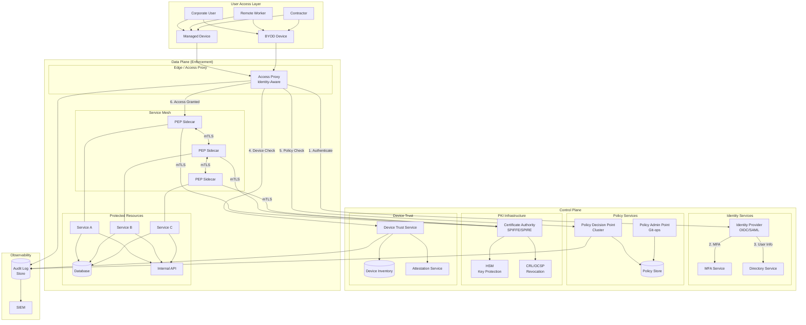
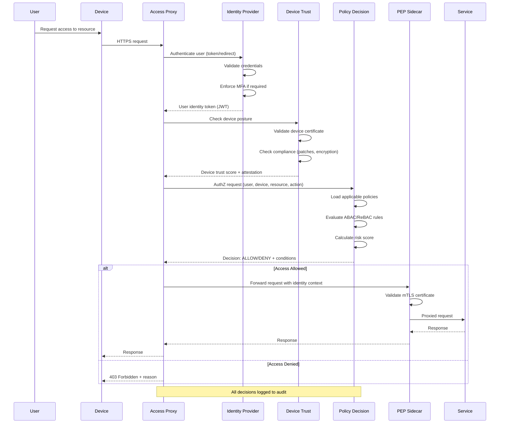
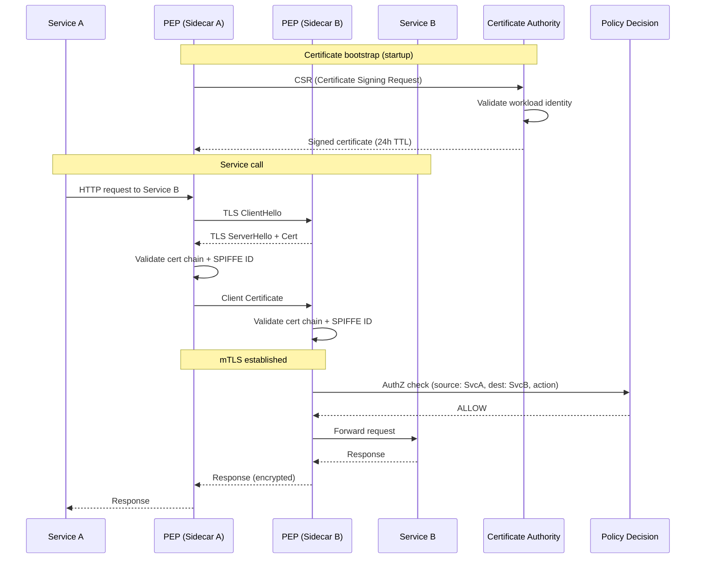
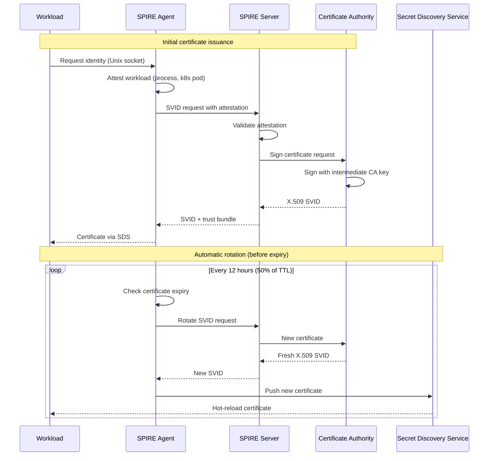
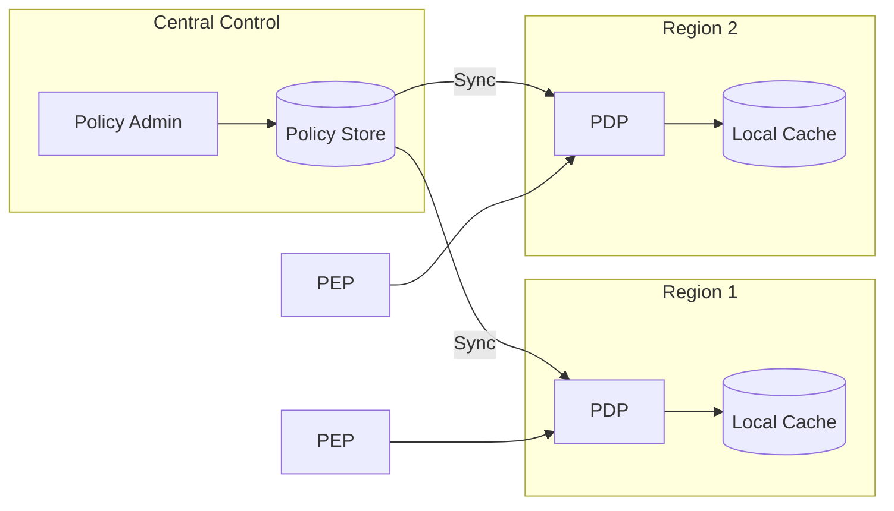
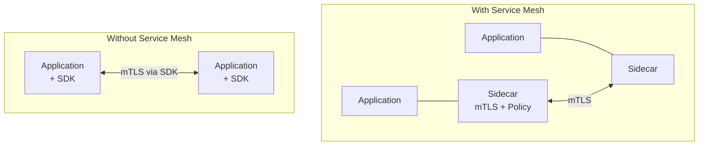
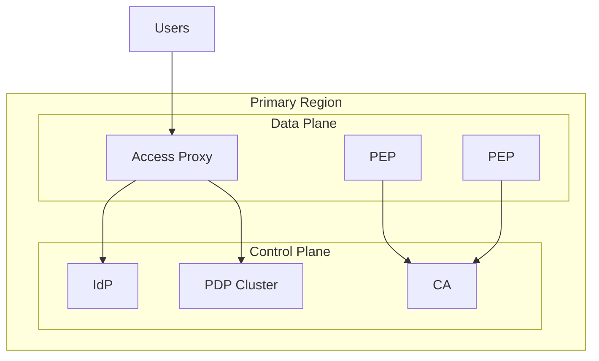
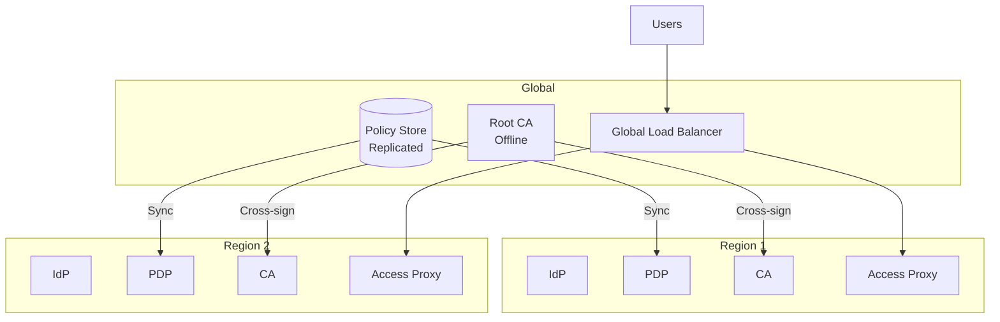
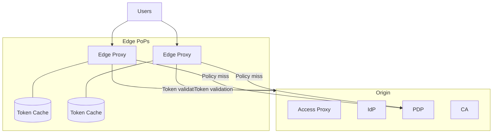
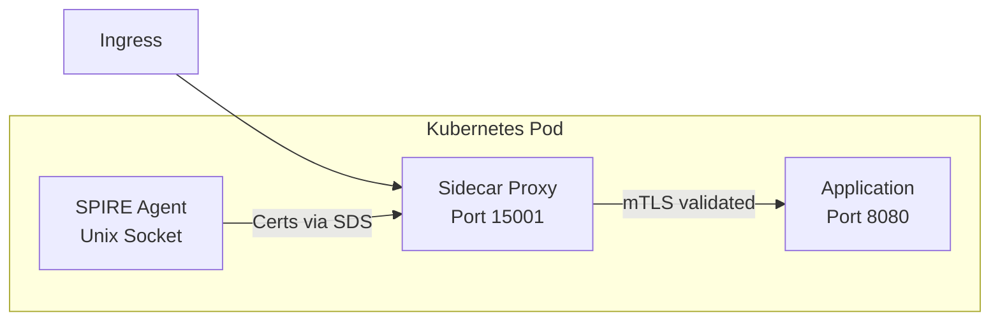

# High-Level Design

[← Back to Index](./00-index.md)

---

## System Architecture

### Component Overview



### Component Responsibilities

| Component | Responsibility |
|-----------|---------------|
| **Access Proxy** | Entry point for user access, identity verification, device checks |
| **Identity Provider (IdP)** | User authentication, SSO, token issuance |
| **MFA Service** | Multi-factor authentication challenges |
| **Policy Decision Point (PDP)** | Evaluate access requests against policies |
| **Policy Admin Point (PAP)** | Manage policy lifecycle, version control |
| **Policy Store** | Store and replicate policies across regions |
| **Certificate Authority (CA)** | Issue/revoke workload certificates |
| **Device Trust Service** | Assess and track device security posture |
| **Policy Enforcement Point (PEP)** | Enforce decisions at service mesh sidecar |
| **Audit Log Store** | Immutable record of all access decisions |

---

## Data Flow

### User Access Request Flow



### Service-to-Service mTLS Flow



### Certificate Issuance and Rotation



---

## Key Architectural Decisions

### 1. Control Plane vs Data Plane Separation

| Aspect | Control Plane | Data Plane |
|--------|--------------|------------|
| **Components** | PDP, CA, IdP, Policy Store | PEP sidecars, Access Proxy |
| **Traffic pattern** | Moderate, config/policy sync | High, every request |
| **Latency sensitivity** | Lower (batch sync) | Very high (inline) |
| **Scaling approach** | Scale for consistency | Scale for throughput |
| **Failure mode** | Cached policies continue | Direct user impact |

**Recommendation:** Keep control plane centralized for consistency, data plane distributed for performance.

### 2. Centralized vs Distributed Policy Evaluation

| Approach | Pros | Cons | Best For |
|----------|------|------|----------|
| **Centralized PDP** | Consistent decisions, easier audit | Latency, SPOF | Smaller deployments |
| **Distributed PDP** | Low latency, fault tolerant | Consistency lag | High-scale, global |
| **Hybrid** | Balance of both | Complexity | Enterprise (recommended) |

**Recommendation:** Hybrid with local PDP cache and central policy sync.



### 3. Push vs Pull Certificate Distribution

| Approach | Pros | Cons | Use Case |
|----------|------|------|----------|
| **Pull (on-demand)** | Fresh certs, simple | Latency on first use | Low-volume workloads |
| **Push (SDS)** | Pre-loaded, no latency | Agent complexity | Service mesh (recommended) |
| **Hybrid** | Balance | More components | Large scale |

**Recommendation:** Secret Discovery Service (SDS) pattern for service mesh workloads.

### 4. JWT vs Opaque Tokens

| Token Type | Pros | Cons | Use Case |
|------------|------|------|----------|
| **JWT (self-contained)** | No lookup needed, claims included | Size, can't revoke easily | User sessions |
| **Opaque (reference)** | Small, revocable | Requires lookup | Service tokens |
| **PASETO** | Modern JWT alternative | Less adoption | Security-critical |

**Recommendation:** JWT for user identity (short-lived), with token binding to device.

### 5. Service Mesh Integration



**Recommendation:** Service mesh for uniform mTLS; SDK for legacy or non-containerized workloads.

---

## Architecture Pattern Checklist

- [x] **Sync vs Async:** Sync for access decisions, async for audit logging
- [x] **Event-driven vs Request-response:** Request-response for policy checks
- [x] **Push vs Pull:** Push for certs (SDS), pull for policy sync
- [x] **Stateless vs Stateful:** Stateless PEP, stateful PDP (policy cache)
- [x] **Read-heavy vs Write-heavy:** Read-heavy (policy checks >> policy updates)
- [x] **Real-time vs Batch:** Real-time decisions, batch analytics
- [x] **Edge vs Origin:** Both (edge proxy + origin PEP)

---

## Deployment Options

### Option A: Single Region



**Pros:** Simple, consistent
**Cons:** Single region failure = total outage

### Option B: Multi-Region Active-Active



**Pros:** High availability, regional failover
**Cons:** Policy sync complexity, cross-region latency

### Option C: Hybrid with Edge



**Pros:** Low latency, edge caching
**Cons:** Cache invalidation complexity

**Recommendation:** Option B for enterprise, Option C for global consumer apps.

---

## Integration Points

### Upstream (Identity Sources)

```
Identity Providers:
├── Corporate IdP (SAML/OIDC)
├── Cloud IAM (AWS IAM, Azure AD, GCP IAM)
├── Social login (for B2C)
└── Partner IdPs (federated)

Device Sources:
├── MDM/UEM systems (device inventory)
├── EDR agents (security posture)
├── TPM attestation (hardware trust)
└── Browser fingerprinting (web access)
```

### Downstream (Protected Resources)

```
Resource Types:
├── Web applications
├── APIs (REST, gRPC)
├── Databases
├── Cloud resources
├── SaaS applications (via SAML proxy)
└── SSH/RDP access
```

### Sidecar Pattern (Service Mesh)



---

## Failure Modes

| Failure | Impact | Mitigation |
|---------|--------|------------|
| **IdP unavailable** | No new logins | Cached tokens valid, graceful degradation |
| **PDP cluster down** | No policy decisions | Local cache with TTL, fail-closed or fail-open choice |
| **CA unavailable** | No new certificates | Existing certs valid until expiry, extended TTL |
| **Device Trust down** | No posture checks | Cached posture data with expiry |
| **mTLS cert expired** | Service-to-service fails | Grace period, automatic rotation |
| **Policy store corrupt** | Incorrect decisions | Versioned backups, instant rollback |

**Default Failure Policy:** Fail-closed (deny access) for security, with cached decisions to maintain continuity.
