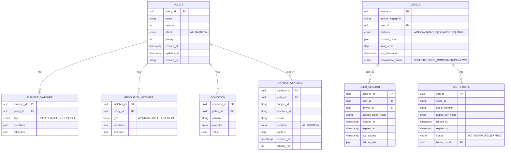
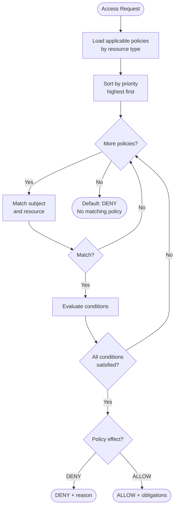
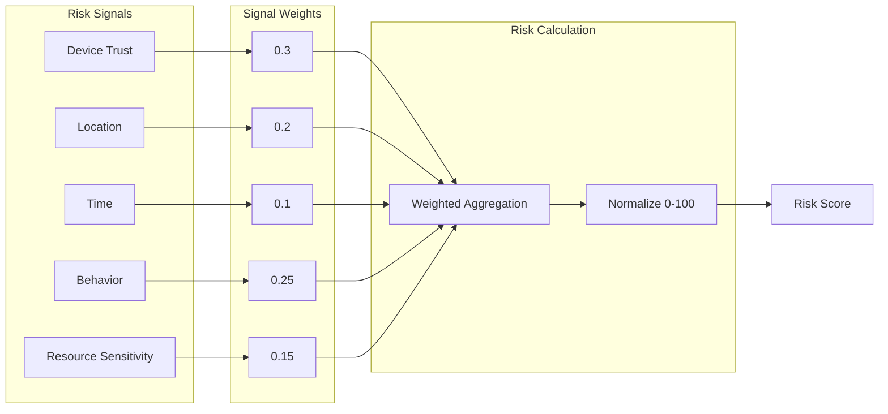
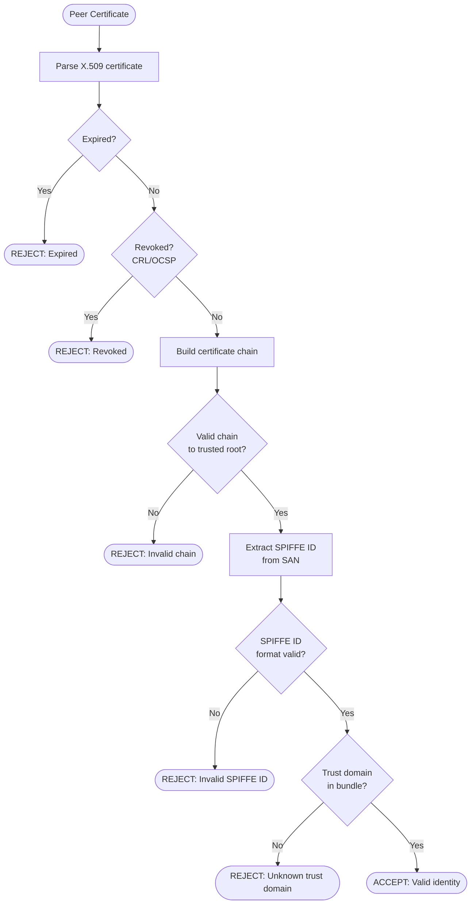
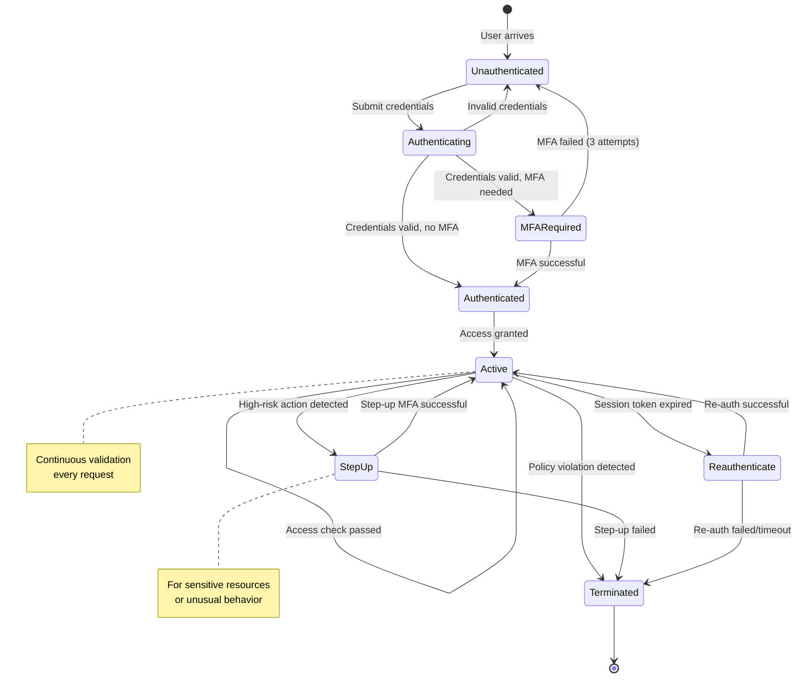
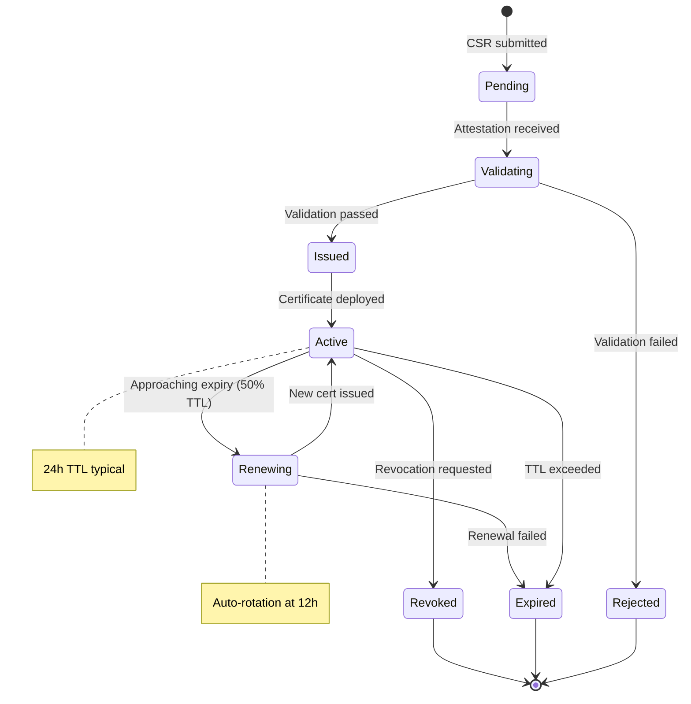

# Low-Level Design

[← Back to Index](./00-index.md)

---

## Data Model

### Policy Schema

```
Policy Definition Structure:
┌──────────────────────────────────────────────────────────────────────┐
│ Policy                                                                │
├──────────────────────────────────────────────────────────────────────┤
│ policy_id: string (UUID)                                             │
│ name: string                                                          │
│ version: int                                                          │
│ effect: ALLOW | DENY                                                  │
│ priority: int (higher = evaluated first)                              │
│ subjects: SubjectMatcher[]                                            │
│ resources: ResourceMatcher[]                                          │
│ actions: string[]                                                     │
│ conditions: Condition[]                                               │
│ metadata: {created_at, updated_at, created_by, description}          │
└──────────────────────────────────────────────────────────────────────┘

SubjectMatcher:
┌──────────────────────────────────────────────────────────────────────┐
│ type: USER | SERVICE | GROUP | ROLE                                   │
│ identifiers: string[]                                                 │
│ attributes: {key: value}[]                                            │
└──────────────────────────────────────────────────────────────────────┘

ResourceMatcher:
┌──────────────────────────────────────────────────────────────────────┐
│ type: API | DATABASE | FILE | SERVICE                                 │
│ identifiers: string[] (supports wildcards)                           │
│ attributes: {sensitivity: HIGH|MEDIUM|LOW, environment: string}      │
└──────────────────────────────────────────────────────────────────────┘

Condition:
┌──────────────────────────────────────────────────────────────────────┐
│ attribute: string (e.g., "device.trust_score", "context.time")       │
│ operator: EQ | NEQ | GT | LT | IN | NOT_IN | CONTAINS | MATCHES      │
│ value: any                                                            │
└──────────────────────────────────────────────────────────────────────┘
```

### Entity Relationship Diagram



### SPIFFE ID Structure

```
SPIFFE ID Format:
spiffe://<trust-domain>/<workload-path>

Examples:
- spiffe://example.com/ns/production/sa/payment-service
- spiffe://example.com/region/us-east-1/service/api-gateway
- spiffe://example.com/cluster/k8s-prod/ns/default/pod/web-abc123

Components:
┌────────────────────────────────────────────────────────────────────┐
│ Trust Domain: example.com                                          │
│   - Organization's unique namespace                                │
│   - Maps to root CA                                                │
│                                                                    │
│ Workload Path: /ns/production/sa/payment-service                   │
│   - Hierarchical identity                                          │
│   - Encoded in certificate SAN (Subject Alternative Name)         │
│   - Used for policy matching                                       │
└────────────────────────────────────────────────────────────────────┘
```

### Device Posture Schema

```
DevicePosture {
    device_id: string
    platform: enum (WINDOWS | MACOS | IOS | ANDROID | LINUX)
    os_version: string
    security_patch_level: string

    encryption: {
        disk_encrypted: bool
        encryption_type: string
    }

    firewall: {
        enabled: bool
        inbound_rules: int
    }

    antivirus: {
        installed: bool
        definitions_updated: timestamp
    }

    mdm: {
        enrolled: bool
        compliant: bool
        last_check_in: timestamp
    }

    attestation: {
        tpm_present: bool
        secure_boot: bool
        measured_boot: bool
        attestation_token: string
        attestation_time: timestamp
    }

    trust_score: float (0.0 - 1.0)
    risk_factors: string[]
    last_updated: timestamp
}
```

### Audit Event Schema

```
AccessDecisionEvent {
    event_id: uuid
    timestamp: timestamp (nanosecond precision)
    event_type: "ACCESS_DECISION"

    subject: {
        user_id: string
        user_email: string (hashed)
        service_id: string
        spiffe_id: string
        ip_address: string
        user_agent: string
    }

    device: {
        device_id: string
        platform: string
        trust_score: float
        compliance_status: string
    }

    resource: {
        resource_type: string
        resource_id: string
        action: string
        sensitivity: string
    }

    decision: {
        result: "ALLOW" | "DENY"
        policy_id: string
        policy_version: int
        matched_conditions: string[]
        deny_reasons: string[]
    }

    context: {
        session_id: string
        request_id: string
        trace_id: string
        geo_location: string
        time_of_day: string
        risk_score: float
    }

    performance: {
        total_latency_ms: int
        policy_eval_ms: int
        device_check_ms: int
    }
}
```

---

## API Design

### Policy Decision API (PDP)

**gRPC Service Definition:**

```
service PolicyDecisionService {
    // Evaluate access request against policies
    rpc CheckAccess(CheckAccessRequest) returns (CheckAccessResponse);

    // Batch evaluation for multiple requests
    rpc CheckAccessBatch(CheckAccessBatchRequest) returns (CheckAccessBatchResponse);

    // Stream policy updates to PEPs
    rpc WatchPolicies(WatchPoliciesRequest) returns (stream PolicyUpdate);
}

message CheckAccessRequest {
    string request_id = 1;

    Subject subject = 2;
    Resource resource = 3;
    string action = 4;
    Context context = 5;
}

message Subject {
    string user_id = 1;
    string service_id = 2;
    string spiffe_id = 3;
    map<string, string> attributes = 4;
    DeviceInfo device = 5;
}

message Resource {
    string type = 1;
    string id = 2;
    map<string, string> attributes = 3;
}

message Context {
    string session_id = 1;
    string ip_address = 2;
    string geo_location = 3;
    int64 timestamp = 4;
    map<string, string> custom = 5;
}

message CheckAccessResponse {
    string request_id = 1;
    Decision decision = 2;
    string policy_id = 3;
    int32 policy_version = 4;
    repeated string reasons = 5;
    map<string, string> obligations = 6;  // Actions to perform (e.g., log, audit)
    int32 latency_ms = 7;
}

enum Decision {
    ALLOW = 0;
    DENY = 1;
    NOT_APPLICABLE = 2;  // No matching policy
}
```

### Certificate Signing API (CA)

```
service CertificateAuthorityService {
    // Request new workload certificate
    rpc SignCertificate(SignCertificateRequest) returns (SignCertificateResponse);

    // Renew existing certificate
    rpc RenewCertificate(RenewCertificateRequest) returns (RenewCertificateResponse);

    // Revoke certificate
    rpc RevokeCertificate(RevokeCertificateRequest) returns (RevokeCertificateResponse);

    // Get trust bundle (root + intermediate certs)
    rpc GetTrustBundle(GetTrustBundleRequest) returns (TrustBundle);

    // Stream certificate updates via SDS
    rpc StreamSecrets(StreamSecretsRequest) returns (stream Secret);
}

message SignCertificateRequest {
    bytes csr = 1;  // PKCS#10 Certificate Signing Request
    string spiffe_id = 2;
    int64 ttl_seconds = 3;
    AttestationData attestation = 4;
}

message AttestationData {
    string attestation_type = 1;  // "k8s_sat", "aws_iid", "tpm"
    bytes attestation_payload = 2;
}

message SignCertificateResponse {
    bytes certificate = 1;  // X.509 certificate (PEM)
    bytes certificate_chain = 2;  // Intermediate certs
    int64 expires_at = 3;
}
```

### Device Trust API

```
service DeviceTrustService {
    // Register new device
    rpc RegisterDevice(RegisterDeviceRequest) returns (RegisterDeviceResponse);

    // Submit device posture
    rpc SubmitPosture(SubmitPostureRequest) returns (SubmitPostureResponse);

    // Check device trust status
    rpc CheckDeviceTrust(CheckDeviceTrustRequest) returns (CheckDeviceTrustResponse);

    // Get device attestation challenge
    rpc GetAttestationChallenge(AttestationChallengeRequest) returns (AttestationChallenge);

    // Submit attestation response
    rpc SubmitAttestation(SubmitAttestationRequest) returns (SubmitAttestationResponse);
}

message CheckDeviceTrustResponse {
    string device_id = 1;
    bool trusted = 2;
    float trust_score = 3;  // 0.0 - 1.0
    ComplianceStatus compliance = 4;
    repeated string risk_factors = 5;
    int64 posture_timestamp = 6;
}

enum ComplianceStatus {
    COMPLIANT = 0;
    NON_COMPLIANT = 1;
    UNKNOWN = 2;
    PENDING_EVALUATION = 3;
}
```

### Policy Administration API (REST)

```
# Policy Management
GET    /api/v1/policies                     # List all policies
GET    /api/v1/policies/{policy_id}         # Get specific policy
POST   /api/v1/policies                     # Create new policy
PUT    /api/v1/policies/{policy_id}         # Update policy (creates new version)
DELETE /api/v1/policies/{policy_id}         # Delete policy

# Policy Versions
GET    /api/v1/policies/{policy_id}/versions           # List versions
GET    /api/v1/policies/{policy_id}/versions/{version} # Get specific version
POST   /api/v1/policies/{policy_id}/rollback/{version} # Rollback to version

# Policy Simulation (dry-run)
POST   /api/v1/policies/simulate            # Test policy against request

# Device Management
GET    /api/v1/devices                      # List registered devices
GET    /api/v1/devices/{device_id}          # Get device details
DELETE /api/v1/devices/{device_id}          # Remove device

# Certificate Management
GET    /api/v1/certificates                 # List active certificates
POST   /api/v1/certificates/{serial}/revoke # Revoke certificate
GET    /api/v1/crl                          # Get Certificate Revocation List
```

### Idempotency and Retries

```
Every request includes:
    X-Request-ID: {uuid}           # Client-generated request ID
    X-Idempotency-Key: {uuid}      # For mutating operations

Server behavior:
    IF idempotency_key exists in cache THEN
        RETURN cached_response
    ELSE
        process_request()
        cache_response(idempotency_key, response, TTL=24h)
        RETURN response
```

---

## Core Algorithms

### 1. Policy Evaluation Engine

**Concept:** Evaluate ABAC/ReBAC policies to determine access decisions.



**Pseudocode:**

```
CLASS PolicyEvaluationEngine:

    FUNCTION evaluate(request: AccessRequest) -> AccessDecision:
        // Load policies applicable to this resource type
        policies = policy_store.get_policies_for_resource(
            request.resource.type,
            request.resource.id
        )

        // Sort by priority (higher first), then by specificity
        policies = SORT(policies, BY priority DESC, specificity DESC)

        matched_policy = NULL
        deny_reasons = []

        FOR policy IN policies:
            // Check if subject matches
            IF NOT match_subject(policy.subjects, request.subject) THEN
                CONTINUE

            // Check if resource matches
            IF NOT match_resource(policy.resources, request.resource) THEN
                CONTINUE

            // Check if action matches
            IF request.action NOT IN policy.actions THEN
                CONTINUE

            // Evaluate all conditions
            conditions_met = evaluate_conditions(
                policy.conditions,
                request.subject,
                request.resource,
                request.context
            )

            IF conditions_met THEN
                IF policy.effect == DENY THEN
                    RETURN AccessDecision(
                        decision: DENY,
                        policy_id: policy.id,
                        reasons: [policy.name + ": explicit deny"]
                    )
                ELSE  // ALLOW
                    matched_policy = policy
                    BREAK  // First matching ALLOW wins

        IF matched_policy != NULL THEN
            RETURN AccessDecision(
                decision: ALLOW,
                policy_id: matched_policy.id,
                obligations: matched_policy.obligations
            )
        ELSE
            RETURN AccessDecision(
                decision: DENY,
                reasons: ["No matching policy found"]
            )


    FUNCTION match_subject(matchers: SubjectMatcher[], subject: Subject) -> bool:
        FOR matcher IN matchers:
            IF matcher.type == USER AND subject.user_id IN matcher.identifiers THEN
                IF attributes_match(matcher.attributes, subject.attributes) THEN
                    RETURN TRUE

            IF matcher.type == SERVICE AND subject.spiffe_id MATCHES matcher.identifiers THEN
                RETURN TRUE

            IF matcher.type == GROUP THEN
                user_groups = directory.get_user_groups(subject.user_id)
                IF ANY(group IN matcher.identifiers FOR group IN user_groups) THEN
                    RETURN TRUE

            IF matcher.type == ROLE THEN
                user_roles = directory.get_user_roles(subject.user_id)
                IF ANY(role IN matcher.identifiers FOR role IN user_roles) THEN
                    RETURN TRUE

        RETURN FALSE


    FUNCTION evaluate_conditions(conditions: Condition[], subject, resource, context) -> bool:
        FOR condition IN conditions:
            value = resolve_attribute(condition.attribute, subject, resource, context)

            result = evaluate_operator(condition.operator, value, condition.value)

            IF NOT result THEN
                RETURN FALSE

        RETURN TRUE  // All conditions satisfied


    FUNCTION resolve_attribute(attribute_path: string, subject, resource, context) -> any:
        // Parse attribute path like "device.trust_score" or "context.time"
        parts = attribute_path.SPLIT(".")
        root = parts[0]

        IF root == "subject" THEN
            RETURN get_nested(subject, parts[1:])
        ELSE IF root == "device" THEN
            RETURN get_nested(subject.device, parts[1:])
        ELSE IF root == "resource" THEN
            RETURN get_nested(resource, parts[1:])
        ELSE IF root == "context" THEN
            RETURN get_nested(context, parts[1:])
        ELSE IF root == "time" THEN
            RETURN get_time_attribute(parts[1])  // hour, day_of_week, etc.

        RETURN NULL
```

**Complexity:**
- Time: O(P × C) where P = policies, C = conditions per policy
- Space: O(P) for policy cache

---

### 2. Risk Scoring Algorithm

**Concept:** Calculate real-time risk score based on multiple signals.



**Pseudocode:**

```
CLASS RiskScoringAlgorithm:

    // Signal weights (configurable)
    WEIGHTS = {
        device_trust: 0.30,
        location: 0.20,
        behavior: 0.25,
        time: 0.10,
        resource_sensitivity: 0.15
    }

    // Risk thresholds
    THRESHOLDS = {
        low: 30,
        medium: 60,
        high: 80
    }

    FUNCTION calculate_risk_score(request: AccessRequest) -> RiskAssessment:
        scores = {}

        // Device trust score (inverse: low trust = high risk)
        device_score = calculate_device_risk(request.subject.device)
        scores["device_trust"] = device_score

        // Location risk
        location_score = calculate_location_risk(
            request.context.ip_address,
            request.context.geo_location,
            request.subject.user_id
        )
        scores["location"] = location_score

        // Behavioral risk
        behavior_score = calculate_behavior_risk(
            request.subject.user_id,
            request.action,
            request.resource
        )
        scores["behavior"] = behavior_score

        // Time-based risk
        time_score = calculate_time_risk(request.context.timestamp)
        scores["time"] = time_score

        // Resource sensitivity
        sensitivity_score = calculate_sensitivity_risk(request.resource)
        scores["resource_sensitivity"] = sensitivity_score

        // Weighted aggregation
        total_score = 0
        FOR signal, weight IN WEIGHTS:
            total_score += scores[signal] * weight

        // Normalize to 0-100
        risk_score = MIN(100, MAX(0, total_score * 100))

        RETURN RiskAssessment(
            score: risk_score,
            level: get_risk_level(risk_score),
            signals: scores,
            recommended_action: get_recommended_action(risk_score)
        )


    FUNCTION calculate_device_risk(device: DeviceInfo) -> float:
        IF device == NULL THEN
            RETURN 1.0  // Unknown device = max risk

        risk = 0.0

        // Device trust score (0-1, invert for risk)
        risk += (1.0 - device.trust_score) * 0.4

        // Compliance status
        IF device.compliance_status != COMPLIANT THEN
            risk += 0.3

        // Attestation freshness
        attestation_age = NOW() - device.last_attestation
        IF attestation_age > 24 hours THEN
            risk += 0.2
        ELSE IF attestation_age > 1 hour THEN
            risk += 0.1

        // Platform risk (configurable)
        IF device.platform IN [ANDROID, LINUX] THEN
            risk += 0.1  // Higher risk for diverse ecosystem

        RETURN MIN(1.0, risk)


    FUNCTION calculate_location_risk(ip: string, geo: string, user_id: string) -> float:
        risk = 0.0

        // Check if IP is in known VPN/Tor range
        IF ip_reputation.is_suspicious(ip) THEN
            risk += 0.5

        // Check if location is unusual for user
        usual_locations = user_profile.get_usual_locations(user_id)
        IF geo NOT IN usual_locations THEN
            risk += 0.3

        // Check if impossible travel (accessed from far location recently)
        last_access = user_profile.get_last_access(user_id)
        IF impossible_travel_detected(last_access, geo) THEN
            risk += 0.5

        // High-risk countries
        IF geo.country IN high_risk_countries THEN
            risk += 0.2

        RETURN MIN(1.0, risk)


    FUNCTION calculate_behavior_risk(user_id: string, action: string, resource: Resource) -> float:
        risk = 0.0

        // Get user's baseline behavior
        baseline = behavior_analytics.get_baseline(user_id)

        // Request frequency anomaly
        recent_requests = get_recent_request_count(user_id, last_5_minutes)
        IF recent_requests > baseline.avg_requests_per_5min * 3 THEN
            risk += 0.4

        // Unusual resource access
        IF resource.id NOT IN baseline.frequently_accessed_resources THEN
            risk += 0.2

        // Unusual action
        IF action NOT IN baseline.common_actions THEN
            risk += 0.2

        // Time since last access (dormant account)
        IF user_profile.days_since_last_access(user_id) > 30 THEN
            risk += 0.3

        RETURN MIN(1.0, risk)


    FUNCTION get_recommended_action(risk_score: float) -> string:
        IF risk_score < THRESHOLDS.low THEN
            RETURN "ALLOW"
        ELSE IF risk_score < THRESHOLDS.medium THEN
            RETURN "ALLOW_WITH_LOGGING"
        ELSE IF risk_score < THRESHOLDS.high THEN
            RETURN "REQUIRE_MFA"
        ELSE
            RETURN "DENY"
```

---

### 3. Certificate Validation Chain

**Concept:** Validate X.509 certificate chain for mTLS.



**Pseudocode:**

```
CLASS CertificateValidator:

    FUNCTION validate_certificate(cert_pem: bytes, trust_bundle: TrustBundle) -> ValidationResult:
        // Parse the certificate
        TRY
            cert = parse_x509_certificate(cert_pem)
        CATCH ParseError:
            RETURN ValidationResult(valid: FALSE, error: "Failed to parse certificate")

        // Check expiration
        now = current_time()
        IF now < cert.not_before OR now > cert.not_after THEN
            RETURN ValidationResult(
                valid: FALSE,
                error: "Certificate expired or not yet valid",
                details: {not_before: cert.not_before, not_after: cert.not_after}
            )

        // Check revocation (CRL or OCSP)
        revocation_status = check_revocation(cert)
        IF revocation_status == REVOKED THEN
            RETURN ValidationResult(
                valid: FALSE,
                error: "Certificate has been revoked"
            )

        // Build and verify certificate chain
        chain_result = build_and_verify_chain(cert, trust_bundle)
        IF NOT chain_result.valid THEN
            RETURN chain_result

        // Extract and validate SPIFFE ID
        spiffe_id = extract_spiffe_id(cert)
        IF spiffe_id == NULL THEN
            RETURN ValidationResult(
                valid: FALSE,
                error: "No SPIFFE ID found in certificate SAN"
            )

        // Validate SPIFFE ID format
        IF NOT validate_spiffe_id_format(spiffe_id) THEN
            RETURN ValidationResult(
                valid: FALSE,
                error: "Invalid SPIFFE ID format"
            )

        // Check trust domain
        trust_domain = extract_trust_domain(spiffe_id)
        IF trust_domain NOT IN trust_bundle.trusted_domains THEN
            RETURN ValidationResult(
                valid: FALSE,
                error: "Trust domain not in trust bundle"
            )

        RETURN ValidationResult(
            valid: TRUE,
            spiffe_id: spiffe_id,
            trust_domain: trust_domain,
            expires_at: cert.not_after
        )


    FUNCTION build_and_verify_chain(cert: X509Certificate, trust_bundle: TrustBundle) -> ValidationResult:
        chain = [cert]
        current_cert = cert

        // Build chain by finding issuers
        WHILE current_cert.issuer != current_cert.subject:  // Not self-signed
            issuer_cert = find_issuer_certificate(current_cert, trust_bundle)
            IF issuer_cert == NULL THEN
                RETURN ValidationResult(
                    valid: FALSE,
                    error: "Cannot find issuer certificate"
                )

            chain.APPEND(issuer_cert)
            current_cert = issuer_cert

            // Prevent infinite loops
            IF LEN(chain) > MAX_CHAIN_LENGTH THEN
                RETURN ValidationResult(
                    valid: FALSE,
                    error: "Certificate chain too long"
                )

        // Verify the chain ends at a trusted root
        root_cert = chain[-1]
        IF NOT is_trusted_root(root_cert, trust_bundle) THEN
            RETURN ValidationResult(
                valid: FALSE,
                error: "Chain does not end at trusted root"
            )

        // Verify each signature in the chain
        FOR i IN RANGE(0, LEN(chain) - 1):
            child = chain[i]
            parent = chain[i + 1]

            IF NOT verify_signature(child, parent.public_key) THEN
                RETURN ValidationResult(
                    valid: FALSE,
                    error: "Invalid signature in certificate chain"
                )

        RETURN ValidationResult(valid: TRUE, chain_length: LEN(chain))


    FUNCTION check_revocation(cert: X509Certificate) -> RevocationStatus:
        // Try OCSP first (more real-time)
        ocsp_url = extract_ocsp_responder(cert)
        IF ocsp_url != NULL THEN
            TRY
                ocsp_response = query_ocsp(ocsp_url, cert)
                IF ocsp_response.status == REVOKED THEN
                    RETURN REVOKED
                ELSE IF ocsp_response.status == GOOD THEN
                    RETURN GOOD
            CATCH:
                // Fall through to CRL

        // Check CRL as fallback
        crl_url = extract_crl_distribution_point(cert)
        IF crl_url != NULL THEN
            crl = fetch_crl(crl_url)  // Cached
            IF cert.serial_number IN crl.revoked_certificates THEN
                RETURN REVOKED

        RETURN UNKNOWN  // Cannot determine status


    FUNCTION extract_spiffe_id(cert: X509Certificate) -> string:
        san_extension = cert.get_extension("subjectAltName")
        IF san_extension == NULL THEN
            RETURN NULL

        FOR name IN san_extension.names:
            IF name.type == URI AND name.value.STARTS_WITH("spiffe://") THEN
                RETURN name.value

        RETURN NULL
```

---

### 4. Device Posture Validator

**Pseudocode:**

```
CLASS DevicePostureValidator:

    // Minimum requirements for device compliance
    COMPLIANCE_POLICY = {
        disk_encryption_required: TRUE,
        firewall_required: TRUE,
        os_patch_max_age_days: 30,
        antivirus_required: TRUE,
        antivirus_definitions_max_age_hours: 72,
        mdm_required: TRUE
    }

    FUNCTION validate_posture(device: DevicePosture) -> PostureValidationResult:
        violations = []
        trust_score = 1.0

        // Check disk encryption
        IF COMPLIANCE_POLICY.disk_encryption_required THEN
            IF NOT device.encryption.disk_encrypted THEN
                violations.APPEND("Disk encryption not enabled")
                trust_score -= 0.2

        // Check firewall
        IF COMPLIANCE_POLICY.firewall_required THEN
            IF NOT device.firewall.enabled THEN
                violations.APPEND("Firewall not enabled")
                trust_score -= 0.15

        // Check OS patch level
        patch_age = NOW() - device.security_patch_level
        IF patch_age.days > COMPLIANCE_POLICY.os_patch_max_age_days THEN
            violations.APPEND("OS patches out of date")
            trust_score -= 0.2

        // Check antivirus
        IF COMPLIANCE_POLICY.antivirus_required THEN
            IF NOT device.antivirus.installed THEN
                violations.APPEND("Antivirus not installed")
                trust_score -= 0.2
            ELSE
                av_def_age = NOW() - device.antivirus.definitions_updated
                IF av_def_age.hours > COMPLIANCE_POLICY.antivirus_definitions_max_age_hours THEN
                    violations.APPEND("Antivirus definitions outdated")
                    trust_score -= 0.1

        // Check MDM enrollment
        IF COMPLIANCE_POLICY.mdm_required THEN
            IF NOT device.mdm.enrolled THEN
                violations.APPEND("Device not enrolled in MDM")
                trust_score -= 0.15
            ELSE IF NOT device.mdm.compliant THEN
                violations.APPEND("Device not compliant with MDM policy")
                trust_score -= 0.1

        // Check attestation
        attestation_age = NOW() - device.attestation.attestation_time
        IF attestation_age > 24 hours THEN
            violations.APPEND("Attestation data stale")
            trust_score -= 0.1

        // Determine compliance status
        IF LEN(violations) == 0 THEN
            status = COMPLIANT
        ELSE IF trust_score >= 0.6 THEN
            status = PARTIALLY_COMPLIANT
        ELSE
            status = NON_COMPLIANT

        RETURN PostureValidationResult(
            compliant: status == COMPLIANT,
            status: status,
            trust_score: MAX(0.0, trust_score),
            violations: violations,
            remediation_steps: get_remediation_steps(violations)
        )
```

---

## State Machine

### Session Lifecycle



### Certificate Lifecycle


