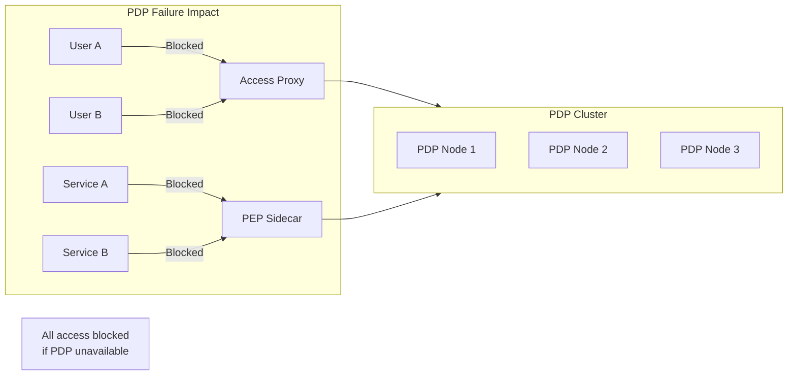
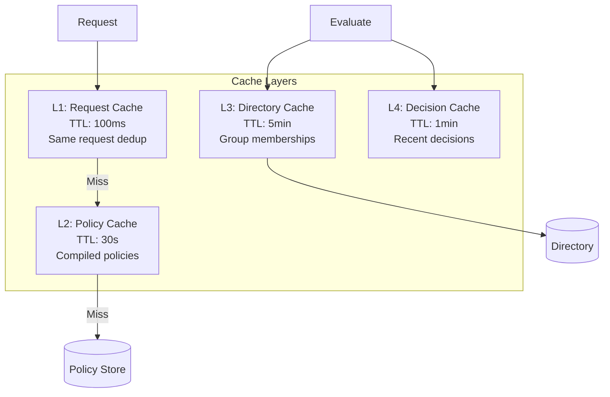
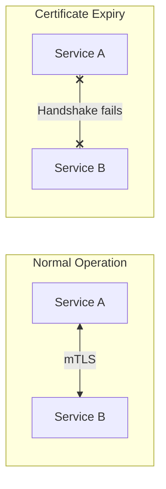
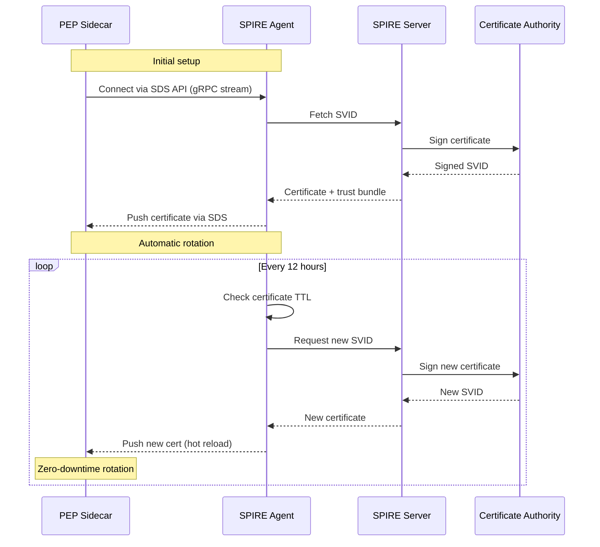
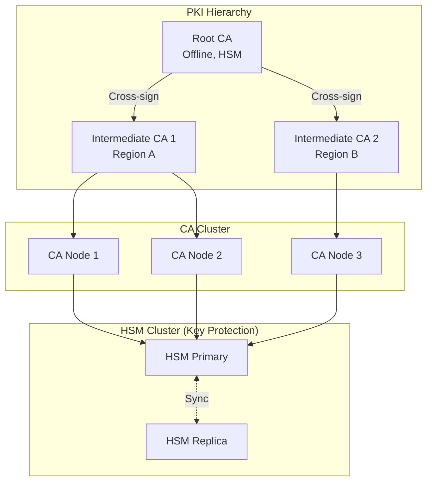
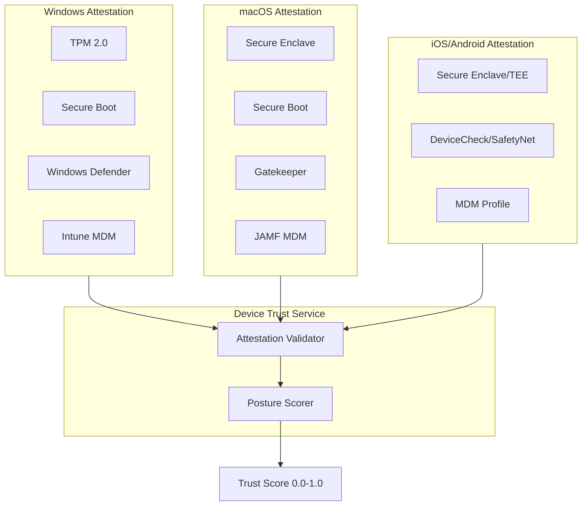
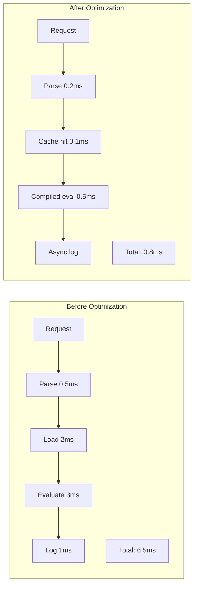
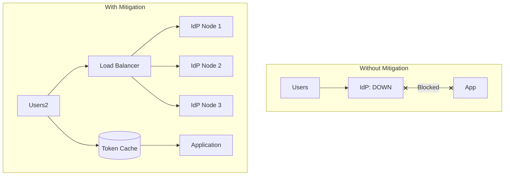
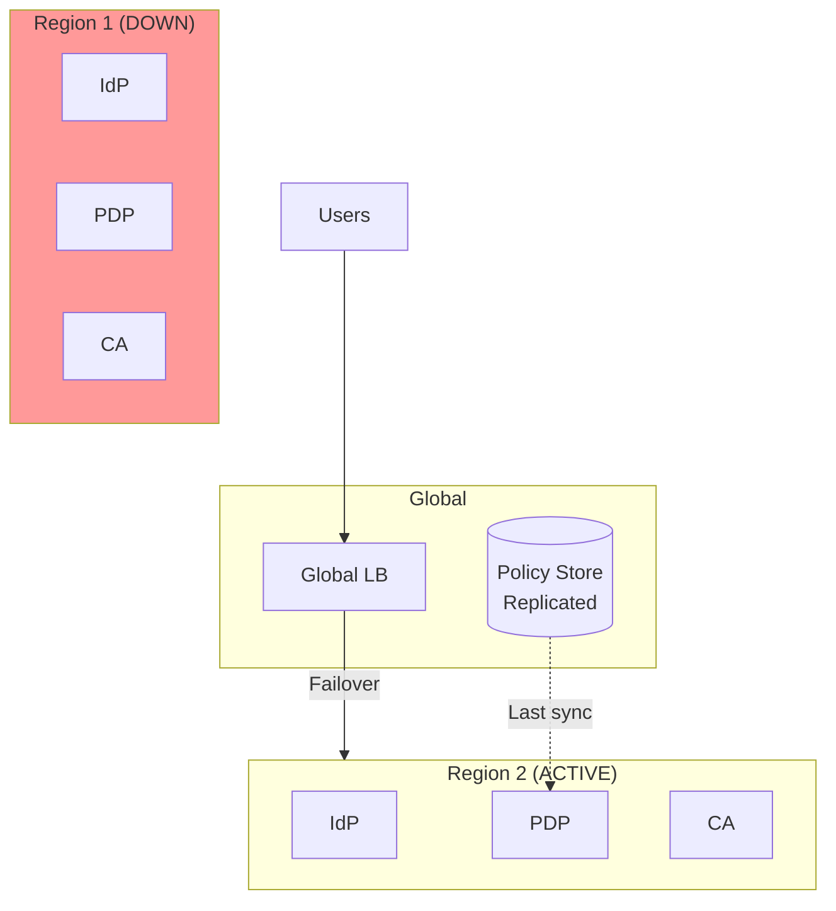

# Deep Dive & Bottleneck Analysis

[← Back to Index](./00-index.md)

---

## Critical Component Deep Dives

### Deep Dive 1: Policy Decision Point (PDP)

#### Why This Is Critical

The PDP is on the critical path for every access request. A slow or unavailable PDP directly impacts all users and services. At scale, the PDP must handle millions of policy evaluations per second while maintaining consistent decisions across all nodes.



#### How It Works Internally

**Policy Evaluation Pipeline:**

```
Request → Parse → Load Policies → Match → Evaluate Conditions → Decision → Log

1. Parse Request
   - Extract subject (user/service), resource, action
   - Validate request format
   - Enrich with context (time, location, device)

2. Load Applicable Policies
   - Index lookup by resource type and action
   - Filter by subject type (user vs service)
   - Return ordered by priority

3. Match Subject and Resource
   - Pattern matching (wildcards, regex)
   - Group/role membership resolution
   - SPIFFE ID matching for services

4. Evaluate Conditions
   - Resolve attribute references
   - Apply operators (EQ, GT, IN, etc.)
   - Short-circuit on first false condition

5. Determine Decision
   - First matching DENY wins
   - First matching ALLOW if no DENY
   - Default DENY if no match

6. Log and Return
   - Async audit log write
   - Return decision with reasons
```

**Caching Strategies:**



**Cache Key Design:**

```
Policy Cache Key:
  hash(resource_type + action)
  → Returns compiled policy matcher

Decision Cache Key:
  hash(subject_id + resource_id + action + context_hash)
  → Returns previous decision (if context unchanged)

Group Cache Key:
  hash(user_id + "groups")
  → Returns user's group memberships
```

#### Consistency vs Latency Trade-offs

| Approach | Consistency | Latency | Use Case |
|----------|-------------|---------|----------|
| **Sync policy fetch** | Strong | Higher (10-20ms) | Critical resources |
| **Local cache + async sync** | Eventual (30s) | Low (1-5ms) | Most requests |
| **Embedded policies** | Stale (minutes) | Lowest (<1ms) | Edge PEPs |

**Recommended Hybrid Approach:**

```
IF resource.sensitivity == CRITICAL THEN
    // Always fetch fresh policy
    policy = fetch_policy_sync(resource)
ELSE IF cache.has(policy_key) AND cache.age < 30s THEN
    // Use cached policy
    policy = cache.get(policy_key)
ELSE
    // Async refresh, use stale
    trigger_async_refresh(policy_key)
    policy = cache.get_stale(policy_key)
```

#### Failure Modes

| Failure | Impact | Handling |
|---------|--------|----------|
| PDP node crash | Reduced capacity | Health checks + auto-scaling |
| Policy store unreachable | Stale policies | Local cache with extended TTL |
| Directory service down | Can't resolve groups | Cache memberships, fail-open for known users |
| Network partition | Split decisions | Regional isolation, accept temporary inconsistency |
| Memory exhaustion | Node crash | Circuit breaker, shed load |

**Fail-Safe Decision Logic:**

```
FUNCTION make_decision_with_fallback(request):
    TRY
        result = evaluate_policies(request)
        RETURN result
    CATCH PolicyStoreUnavailable:
        IF cache.has_decision(request) THEN
            log.warn("Using cached decision")
            RETURN cache.get_decision(request)
        ELSE IF request.subject IN known_users AND request.resource.sensitivity != CRITICAL THEN
            log.warn("Fail-open: known user, non-critical resource")
            RETURN Decision(ALLOW, degraded: TRUE)
        ELSE
            log.error("Fail-closed: cannot evaluate")
            RETURN Decision(DENY, reason: "Policy service unavailable")
```

---

### Deep Dive 2: Certificate Authority & Rotation

#### Why This Is Critical

The CA is foundational to Zero Trust - without valid certificates, mTLS fails and services cannot communicate. Certificate rotation must be seamless; any disruption causes service-to-service authentication failures.



#### Certificate Lifecycle Management

**Short-Lived Certificate Strategy:**

```
Certificate Parameters:
├── TTL: 24 hours (1 day)
├── Rotation Trigger: 50% of TTL (12 hours)
├── Overlap Period: 1 hour (both old and new valid)
├── Key Type: ECDSA P-256 (faster than RSA)
└── SPIFFE ID: Encoded in SAN extension

Timeline:
0h      12h      23h    24h
|--------|--------|-----|
  Valid   Rotate   Grace  Expire
          ↓
       New cert issued
       Old cert still valid
```

**Secret Discovery Service (SDS) Pattern:**



**Certificate Rotation Algorithm:**

```
CLASS CertificateManager:

    FUNCTION manage_certificate_lifecycle():
        WHILE TRUE:
            current_cert = get_current_certificate()

            // Calculate time until rotation needed
            time_to_rotate = current_cert.expires_at - NOW() - (TTL * 0.5)

            IF time_to_rotate <= 0 THEN
                // Time to rotate
                new_cert = rotate_certificate()
                IF new_cert != NULL THEN
                    deploy_certificate(new_cert)
                    log.info("Certificate rotated successfully")
                ELSE
                    log.error("Certificate rotation failed")
                    alert_on_call()

            SLEEP(MIN(time_to_rotate, 5 minutes))


    FUNCTION rotate_certificate() -> Certificate:
        // Generate new key pair
        key_pair = generate_key_pair(ECDSA_P256)

        // Create CSR
        csr = create_csr(key_pair.private_key, spiffe_id)

        // Request signed certificate from CA
        TRY
            signed_cert = ca_client.sign_certificate(
                csr: csr,
                ttl: 24 hours,
                attestation: get_attestation_data()
            )

            // Verify new certificate
            IF validate_certificate(signed_cert) THEN
                RETURN Certificate(
                    cert: signed_cert,
                    key: key_pair.private_key,
                    chain: ca_client.get_chain()
                )
        CATCH Exception as e:
            log.error("Failed to rotate certificate: " + e)
            metrics.increment("cert_rotation_failures")

        RETURN NULL


    FUNCTION deploy_certificate(cert: Certificate):
        // Atomic certificate swap
        WITH lock:
            // Store new certificate
            cert_store.write_atomic(cert)

            // Signal SDS to push new cert to sidecars
            sds_server.notify_certificate_update(cert)

            // Wait for confirmation from sidecars
            confirmed = wait_for_sidecar_ack(timeout: 30s)

            IF NOT confirmed THEN
                log.warn("Some sidecars did not acknowledge cert update")
                // Old cert still valid, will catch up
```

#### CA High Availability



#### Failure Modes

| Failure | Impact | Handling |
|---------|--------|----------|
| CA node down | Reduced signing capacity | HA cluster, automatic failover |
| HSM failure | Cannot sign certificates | HSM cluster, backup keys |
| Root CA compromise | Total trust loss | Offline root, key ceremony for rotation |
| Mass cert expiration | Service outage | Extended grace period, emergency rotation |
| CRL service down | Cannot check revocation | OCSP stapling, cached CRL |

---

### Deep Dive 3: Device Trust Attestation

#### Why This Is Critical

Device trust ensures that only secure, compliant devices access resources. Without proper attestation, a compromised or malicious device could gain access even with valid user credentials.

#### Platform-Specific Attestation



**TPM Attestation Flow:**

```
1. Challenge Request
   - Server generates random nonce
   - Sends to device

2. TPM Quote
   - TPM creates quote with:
     - PCR values (platform state)
     - Nonce (prevents replay)
     - Signature (proves TPM authenticity)

3. Verification
   - Server verifies:
     - TPM certificate chain (authentic TPM)
     - Signature validity
     - PCR values match expected (no tampering)
     - Nonce matches (freshness)

4. Result
   - PASSED: Device hardware trusted
   - FAILED: Potential compromise
```

**Attestation Validation Algorithm:**

```
CLASS DeviceAttestationValidator:

    FUNCTION validate_attestation(attestation: AttestationData) -> AttestationResult:
        platform = attestation.platform

        IF platform == WINDOWS THEN
            RETURN validate_tpm_attestation(attestation)
        ELSE IF platform == MACOS THEN
            RETURN validate_secure_enclave(attestation)
        ELSE IF platform == IOS THEN
            RETURN validate_device_check(attestation)
        ELSE IF platform == ANDROID THEN
            RETURN validate_safety_net(attestation)
        ELSE
            RETURN AttestationResult(valid: FALSE, reason: "Unknown platform")


    FUNCTION validate_tpm_attestation(attestation: TPMAttestation) -> AttestationResult:
        // Verify TPM certificate chain
        cert_result = verify_tpm_certificate_chain(
            attestation.aik_certificate,
            trusted_tpm_roots
        )
        IF NOT cert_result.valid THEN
            RETURN AttestationResult(valid: FALSE, reason: "Invalid TPM certificate")

        // Verify quote signature
        quote = attestation.quote
        signature_valid = verify_signature(
            quote.data,
            quote.signature,
            attestation.aik_public_key
        )
        IF NOT signature_valid THEN
            RETURN AttestationResult(valid: FALSE, reason: "Invalid quote signature")

        // Verify nonce (anti-replay)
        IF quote.nonce != expected_nonce THEN
            RETURN AttestationResult(valid: FALSE, reason: "Nonce mismatch")

        // Verify PCR values
        pcr_result = verify_pcr_values(quote.pcr_values)
        IF NOT pcr_result.valid THEN
            RETURN AttestationResult(
                valid: FALSE,
                reason: "PCR values indicate tampering",
                details: pcr_result.mismatched_pcrs
            )

        RETURN AttestationResult(
            valid: TRUE,
            platform: WINDOWS,
            tpm_manufacturer: extract_tpm_manufacturer(attestation),
            boot_state: SECURE_BOOT_ENABLED
        )


    FUNCTION verify_pcr_values(pcr_values: map[int]bytes) -> PCRResult:
        // PCR 0: BIOS
        // PCR 7: Secure Boot state
        // PCR 11: BitLocker

        issues = []

        // Check Secure Boot is enabled
        IF pcr_values[7] NOT IN known_good_secureboot_values THEN
            issues.APPEND("Secure Boot may be disabled or modified")

        // Check for known malware PCR patterns
        IF matches_known_malware_pattern(pcr_values) THEN
            issues.APPEND("PCR values match known malware pattern")

        RETURN PCRResult(
            valid: LEN(issues) == 0,
            issues: issues
        )
```

#### Continuous Posture Monitoring

```
Posture Check Frequency:
├── Real-time: Disk encryption status changes
├── Every 15 minutes: OS patch level, firewall state
├── Every hour: Antivirus definitions
├── Every 4 hours: Full compliance check
└── On-demand: Before high-risk access

Posture Change Events → Risk Re-evaluation → Access Adjustment
```

---

## Bottleneck Analysis

### Bottleneck 1: Policy Evaluation Latency at Scale

**Problem:** At 100K+ policy evaluations per second, even small latencies accumulate.



**Mitigation Strategies:**

| Strategy | Improvement | Trade-off |
|----------|-------------|-----------|
| **Policy compilation** | 5-10x faster evaluation | Memory for compiled policies |
| **Decision caching** | 90%+ cache hit rate | Stale decisions possible |
| **Async logging** | Remove from critical path | Log delivery delay |
| **Connection pooling** | Reduce connection overhead | Memory per connection |
| **Local PDP embedding** | Eliminate network hop | Policy sync complexity |

**Policy Compilation Pattern:**

```
// Instead of interpreting JSON policy on each request
// Compile to optimized decision tree

CompiledPolicy {
    matcher: PrecomputedMatcher  // Regex compiled, hash indexes built
    condition_evaluator: OptimizedConditionChain
    decision: ALLOW | DENY
}

// Compilation happens on policy update
// Evaluation is O(1) hash lookup + condition checks
```

### Bottleneck 2: Certificate Distribution During Mass Rotation

**Problem:** If certificates approach expiry simultaneously, CA faces thundering herd.

```
10,000 workloads × cert rotation at same time = CA overload

Mitigation: Jittered rotation
- Each workload rotates at random point in rotation window
- Spread: 12h window → ~0.23 certs/sec vs 10K certs at once
```

**Jittered Rotation Algorithm:**

```
FUNCTION calculate_rotation_time(cert: Certificate, workload_id: string) -> Time:
    // Base rotation at 50% of TTL
    base_rotation = cert.issued_at + (cert.ttl * 0.5)

    // Jitter window: 10% of TTL
    jitter_window = cert.ttl * 0.1

    // Deterministic jitter based on workload ID (consistent across restarts)
    jitter_hash = hash(workload_id + cert.serial_number)
    jitter_offset = (jitter_hash % jitter_window) - (jitter_window / 2)

    RETURN base_rotation + jitter_offset
```

### Bottleneck 3: IdP as Single Point of Failure

**Problem:** All user authentication flows through the IdP. If unavailable, no new logins.



**Mitigation Strategies:**

| Strategy | Implementation | Trade-off |
|----------|----------------|-----------|
| **IdP HA cluster** | 3+ nodes, active-active | Cost, sync complexity |
| **Token caching** | Valid tokens cached at edge | Token revocation delay |
| **Offline tokens** | Long-lived refresh tokens | Longer exposure window |
| **Federated IdPs** | Multiple IdP backends | User experience (IdP selection) |
| **Emergency bypass** | Break-glass accounts | Security risk if abused |

**Token Validation with Cache:**

```
FUNCTION validate_token_with_fallback(token: JWT) -> TokenValidation:
    // Check local cache first
    cache_key = hash(token)
    IF cache.has(cache_key) THEN
        cached = cache.get(cache_key)
        IF cached.expires_at > NOW() THEN
            RETURN cached.validation_result

    // Try online validation
    TRY
        result = idp_client.validate_token(token)
        cache.set(cache_key, result, TTL=5 minutes)
        RETURN result
    CATCH IdPUnavailable:
        // Offline validation (verify signature only)
        IF verify_jwt_signature(token, cached_idp_public_keys) THEN
            IF token.exp > NOW() THEN
                log.warn("IdP unavailable, using offline validation")
                RETURN TokenValidation(valid: TRUE, offline_mode: TRUE)

        RETURN TokenValidation(valid: FALSE, reason: "Cannot validate token")
```

---

## Concurrency & Race Conditions Summary

### Potential Race Conditions

| Race Condition | Trigger | Impact | Solution |
|----------------|---------|--------|----------|
| Policy update during eval | Policy change mid-request | Inconsistent decision | Version pinning per request |
| Certificate rotation | New cert not deployed to all sidecars | mTLS handshake fails | Overlap period, gradual rollout |
| Session invalidation | Revoke during active request | Stale session used | Short token TTL, blocklist |
| Device posture change | Compliance drops during session | Access continues | Continuous re-evaluation |
| Group membership change | User removed from group | Stale access | Cache invalidation, short TTL |

### Policy Version Consistency

```
FUNCTION evaluate_with_version_pinning(request: AccessRequest) -> Decision:
    // Pin to current policy version at request start
    policy_version = policy_store.get_current_version()

    // All policy lookups use this version
    policies = policy_store.get_policies(
        resource: request.resource,
        version: policy_version
    )

    // Evaluate with consistent policy set
    decision = evaluate_policies(policies, request)

    // Log decision with version for audit
    log_decision(decision, policy_version)

    RETURN decision
```

---

## Failure Scenario Analysis

### Scenario: Regional Outage



**Handling:**
- DNS/GLB automatically fails over to healthy region
- Users re-authenticate against Region 2 IdP
- Certificates from Region 1 CA still valid until expiry
- Policy decisions continue with replicated policy store

### Scenario: CA Key Compromise

**Response Playbook:**

```
1. IMMEDIATE (0-5 min)
   - Revoke compromised CA certificate
   - Update trust bundle to exclude compromised CA
   - Alert all security teams

2. SHORT-TERM (5-60 min)
   - Activate backup CA with new keys
   - Begin mass certificate re-issuance
   - Monitor for unauthorized certificate usage

3. MEDIUM-TERM (1-24 hours)
   - Complete certificate rotation for all workloads
   - Forensic analysis of compromise
   - Update HSM access controls

4. LONG-TERM
   - Post-incident review
   - Update key ceremony procedures
   - Consider shorter certificate TTLs
```

### Scenario: Policy Store Corruption

```
Detection:
- Checksum mismatch on policy fetch
- Anomalous decision patterns (mass denials or allows)
- Schema validation failures

Recovery:
1. Halt policy sync to PDP nodes
2. PDP nodes continue with cached (last known good) policies
3. Restore from versioned backup
4. Validate restored policies
5. Resume sync with version rollback
```
