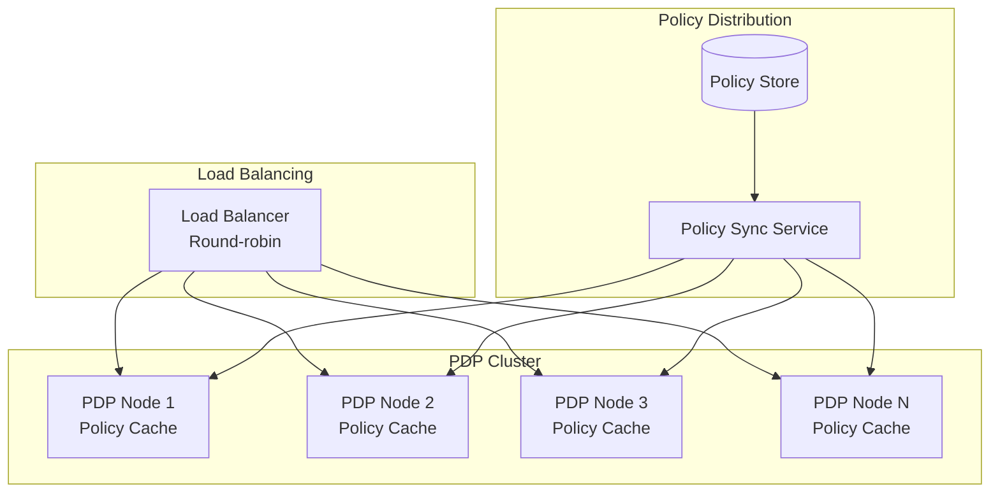
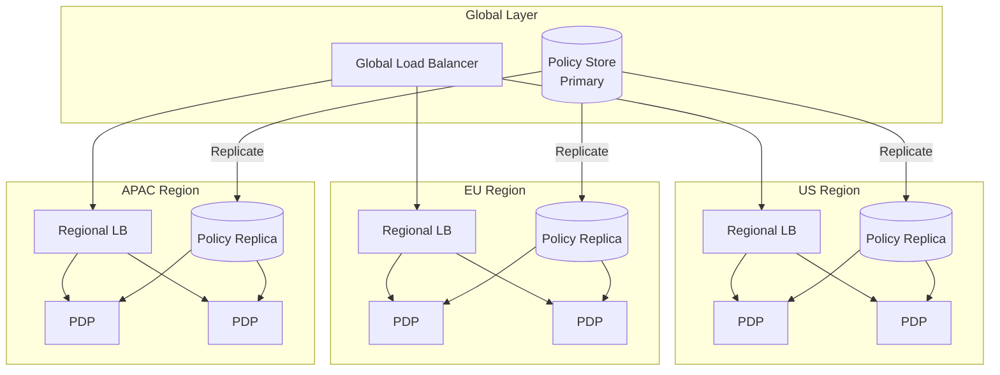
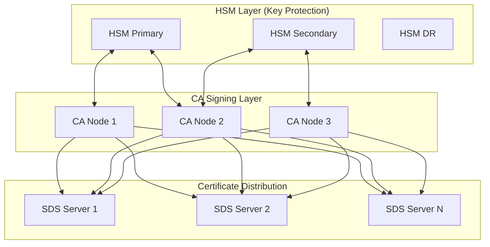
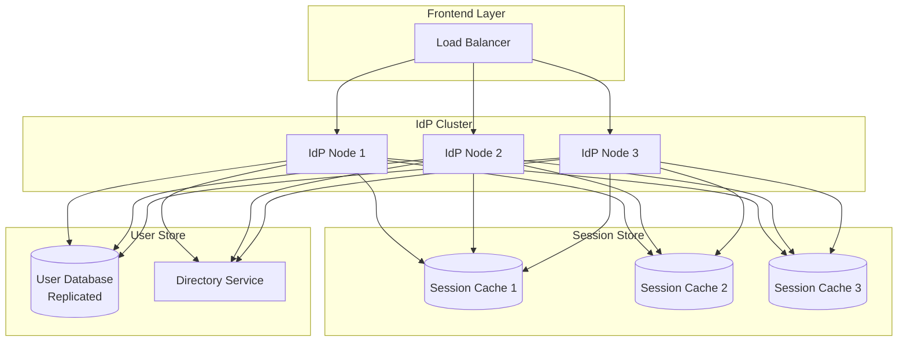
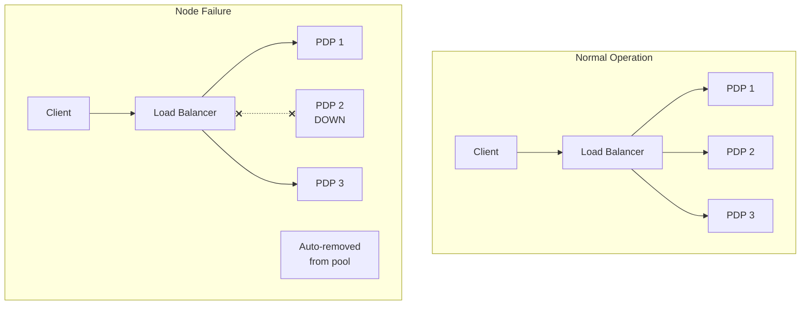
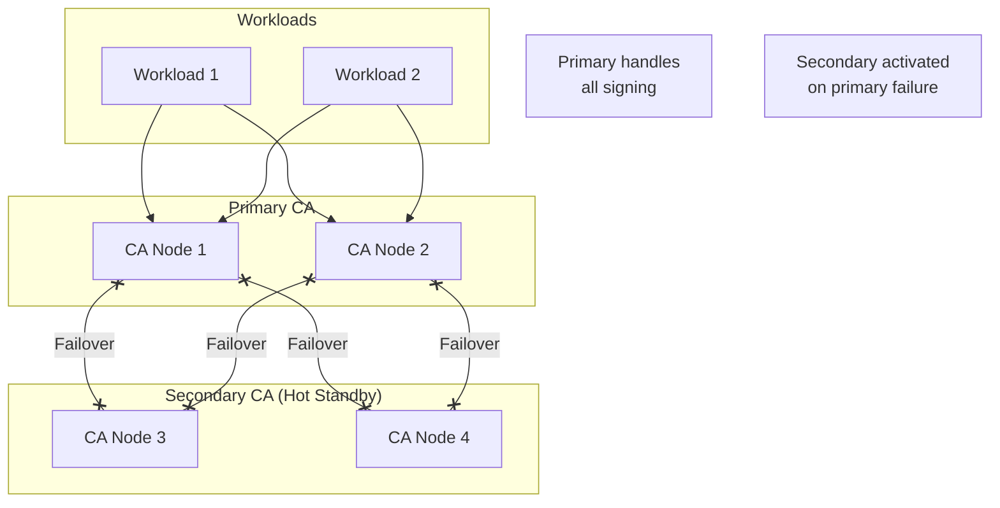
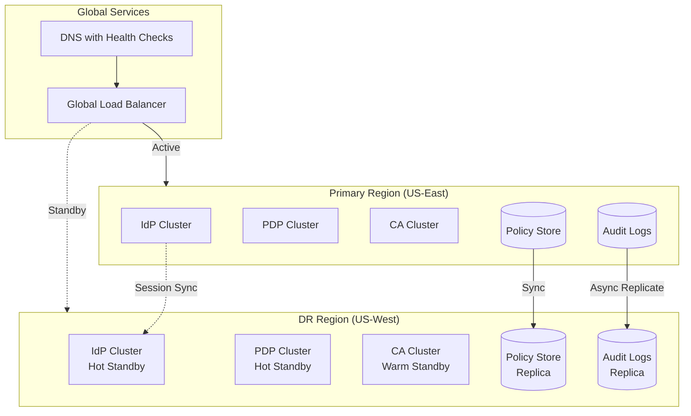
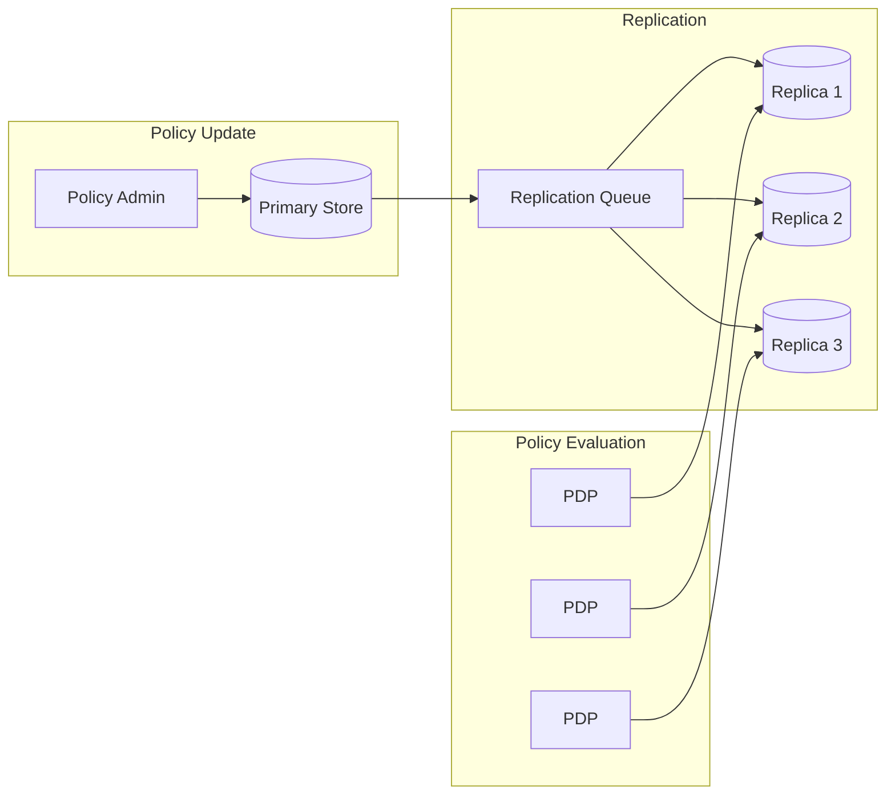

# Scalability & Reliability

[← Back to Index](./00-index.md)

---

## Scaling Strategies

### Policy Decision Point (PDP) Scaling

#### Horizontal Scaling



**Scaling Triggers:**

| Metric | Scale Out | Scale In |
|--------|-----------|----------|
| CPU utilization | > 70% for 5 min | < 30% for 15 min |
| Policy eval latency (p99) | > 8ms | < 3ms |
| Request queue depth | > 1000 | < 100 |
| Error rate | > 0.1% | < 0.01% |

**Stateless PDP Design:**

```
PDP Node Configuration:
├── No local persistent state
├── Policy cache loaded on startup
├── Cache invalidation via pub/sub
├── Health check endpoint
└── Graceful shutdown (drain connections)

Scaling Properties:
├── Add nodes: Immediate capacity increase
├── Remove nodes: Graceful drain, then terminate
├── Rolling updates: One node at a time
└── Zero-downtime deployment: Blue-green or canary
```

#### Regional PDP Deployment



**Regional Policy Sync:**

```
Sync Strategy: Async replication with version vector

Primary Region:
1. Policy update received
2. Assign version number
3. Write to primary store
4. Publish to replication queue

Secondary Regions:
1. Receive update from queue
2. Apply if version > local version
3. Acknowledge receipt
4. PDP cache invalidation

Consistency Window: < 5 seconds typical
Conflict Resolution: Last-write-wins (version-based)
```

### Certificate Authority Scaling

#### CA Cluster Architecture



**Scaling Considerations:**

| Component | Scaling Approach | Limit |
|-----------|------------------|-------|
| HSM | Add HSM appliances | Cost, ~5 HSMs typical |
| CA Signing | Horizontal + key sharing | HSM throughput |
| SDS Servers | Horizontal, stateless | Unlimited |
| Certificate Store | Sharded by trust domain | Storage |

**Signing Rate Optimization:**

```
// Batch signing for efficiency
FUNCTION batch_sign_certificates(csrs: CSR[]) -> Certificate[]:
    // Group CSRs by trust domain
    batches = group_by_trust_domain(csrs)

    results = []
    FOR batch IN batches:
        // Single HSM session per batch
        WITH hsm_session(batch.trust_domain):
            FOR csr IN batch.csrs:
                cert = sign_certificate(csr)
                results.APPEND(cert)

    RETURN results

// HSM session reuse: 10x signing throughput
```

### Identity Provider Scaling



**Session Affinity vs Shared State:**

| Approach | Pros | Cons | Use Case |
|----------|------|------|----------|
| **Sticky sessions** | Simple, no shared state | Uneven load, failover issues | Small scale |
| **Shared session store** | Even load, failover works | Additional component | Recommended |
| **Stateless (JWT only)** | Simplest | Large tokens, no server revocation | Limited use |

---

## Fault Tolerance

### PDP Fault Tolerance



**Health Check Configuration:**

```
Health Check:
  endpoint: /health
  interval: 5 seconds
  timeout: 2 seconds
  healthy_threshold: 2
  unhealthy_threshold: 3

Health Response:
{
  "status": "healthy" | "degraded" | "unhealthy",
  "policy_cache_age_ms": 1234,
  "policy_version": "v2024.01.15.001",
  "last_sync_success": "2024-01-15T12:00:00Z",
  "dependencies": {
    "policy_store": "healthy",
    "directory_service": "healthy"
  }
}
```

**Graceful Degradation Modes:**

| Mode | Trigger | Behavior |
|------|---------|----------|
| **Normal** | All healthy | Full functionality |
| **Degraded - Cache Only** | Policy store unreachable | Use cached policies, warn on age > 5min |
| **Degraded - Fail Open** | PDP capacity < 50% | Allow known users, deny unknown |
| **Emergency** | PDP capacity < 10% | Allow all with audit flag |

### CA Fault Tolerance



**Certificate Validity Overlap:**

```
Certificate Overlap Strategy:

Old Certificate: |===================|
                 ^issued           ^expires (24h)

New Certificate:              |===================|
                              ^issued (12h)     ^expires (36h)

Overlap Window:               |=========|
                              12h     24h
                              (12 hour overlap)

During overlap:
- Both certificates valid
- Gradual rollout of new cert
- No service disruption
```

### Circuit Breaker Pattern

```
CLASS CircuitBreaker:

    STATES = [CLOSED, OPEN, HALF_OPEN]

    failure_threshold = 5
    success_threshold = 3
    timeout = 30 seconds

    FUNCTION call(operation) -> Result:
        IF state == OPEN THEN
            IF NOW() > last_failure_time + timeout THEN
                state = HALF_OPEN
            ELSE
                RETURN fallback_result()

        TRY
            result = operation()
            record_success()
            RETURN result
        CATCH Exception:
            record_failure()
            THROW

    FUNCTION record_failure():
        failure_count += 1
        last_failure_time = NOW()

        IF failure_count >= failure_threshold THEN
            state = OPEN
            log.warn("Circuit breaker opened")

    FUNCTION record_success():
        IF state == HALF_OPEN THEN
            success_count += 1
            IF success_count >= success_threshold THEN
                state = CLOSED
                failure_count = 0
                log.info("Circuit breaker closed")
```

---

## Disaster Recovery

### Recovery Objectives

| Component | RTO | RPO | Rationale |
|-----------|-----|-----|-----------|
| **PDP** | < 5 min | 0 (stateless) | Critical path, must be fast |
| **IdP** | < 15 min | < 1 min | Authentication critical |
| **CA** | < 30 min | 0 (key in HSM) | Certificates valid until expiry |
| **Policy Store** | < 10 min | < 1 min | Versioned, point-in-time recovery |
| **Audit Logs** | < 1 hour | < 5 min | Compliance, async acceptable |

### Multi-Region Disaster Recovery



### Failover Procedures

**Automated Failover (< 5 min):**

```
Trigger Conditions:
- Primary region health check fails for 3 consecutive checks
- Primary region latency > 500ms for 2 minutes
- Primary region error rate > 5% for 2 minutes

Failover Steps:
1. GLB detects primary unhealthy (30s)
2. DNS update to route to secondary (60s TTL)
3. Secondary PDP/IdP activated (already hot)
4. Secondary CA begins signing (warm, 2-3 min to full capacity)
5. Monitoring confirms traffic shift
6. Alert operations team

Total Automated Failover: ~3-5 minutes
```

**Manual Failover (Planned Maintenance):**

```
1. Pre-failover Checks
   - Verify secondary region health
   - Confirm policy sync up-to-date
   - Test CA signing in secondary

2. Traffic Drain
   - Gradually shift traffic to secondary (10% increments)
   - Monitor error rates and latency
   - Pause on anomaly

3. Complete Failover
   - Route 100% traffic to secondary
   - Update DNS TTL to longer value
   - Disable primary region

4. Maintenance Window
   - Perform maintenance on primary
   - Test primary region health

5. Failback
   - Reverse process (gradual traffic shift)
   - Confirm primary healthy before full failback
```

### CA Key Recovery

```
CA Key Disaster Recovery:

Key Storage:
├── Primary HSM: Active signing key
├── Secondary HSM: Replicated key (same site)
├── DR HSM: Replicated key (DR site)
└── Offline Backup: Encrypted key shares (M-of-N)

Recovery Scenarios:

1. Single HSM Failure:
   - Failover to secondary HSM (automatic)
   - RTO: < 1 minute

2. Site-wide HSM Failure:
   - Activate DR site HSM
   - RTO: < 30 minutes

3. All HSMs Lost (catastrophic):
   - Reconstruct from offline backup (M-of-N key ceremony)
   - Requires N key holders physically present
   - RTO: 4-24 hours (depending on key holder availability)

Key Ceremony for Recovery:
1. Gather M of N key holders
2. Each provides their key share
3. Reconstruct master key in secure facility
4. Import to new HSM
5. Verify key by signing test certificate
6. Resume operations
```

### Policy Store Recovery

```
Policy Store Disaster Recovery:

Backup Strategy:
├── Continuous replication to DR region
├── Point-in-time snapshots every 15 minutes
├── Daily full backups retained 30 days
└── Monthly archives retained 1 year

Recovery Steps:

1. Assess Damage
   - Determine extent of corruption/loss
   - Identify last known good state

2. Select Recovery Point
   - Option A: Latest replica (< 1 min RPO)
   - Option B: Last snapshot (< 15 min RPO)
   - Option C: Daily backup (< 24h RPO)

3. Restore
   - Provision new policy store cluster
   - Restore from selected backup
   - Verify policy integrity (checksums)

4. Reconnect
   - Update PDP nodes to point to restored store
   - Trigger policy sync
   - Verify policy version matches expected

5. Validate
   - Run policy evaluation tests
   - Compare decisions against baseline
   - Confirm no unauthorized policy changes
```

---

## Capacity Planning

### Growth Projections

```
Year 1 Baseline:
├── 100,000 users
├── 10,000 workloads
├── 50,000 policy evaluations/second
└── 30,000 active certificates

Year 2 (+50% growth):
├── 150,000 users
├── 15,000 workloads
├── 75,000 policy evaluations/second
└── 45,000 active certificates

Year 3 (+100% from baseline):
├── 200,000 users
├── 20,000 workloads
├── 100,000 policy evaluations/second
└── 60,000 active certificates
```

### Infrastructure Scaling Plan

| Component | Year 1 | Year 2 | Year 3 |
|-----------|--------|--------|--------|
| PDP Nodes | 10 | 15 | 20 |
| IdP Nodes | 5 | 7 | 10 |
| CA Nodes | 3 | 4 | 5 |
| Policy Store | 5 nodes | 7 nodes | 9 nodes |
| Audit Pipeline | 10 nodes | 15 nodes | 20 nodes |

### Load Testing Strategy

```
Load Test Scenarios:

1. Normal Load
   - 100% of expected production traffic
   - Sustained for 1 hour
   - All latency SLOs met

2. Peak Load (3x normal)
   - 300% of expected traffic
   - Sustained for 15 minutes
   - Latency degradation acceptable

3. Spike Test
   - 0 to 500% in 1 minute
   - Verify auto-scaling triggers
   - No errors during scale-up

4. Soak Test
   - 150% load for 24 hours
   - Check for memory leaks, connection exhaustion
   - Verify log rotation works

5. Chaos Test
   - Kill random nodes during load
   - Simulate network partitions
   - Verify graceful degradation
```

---

## Data Consistency

### Policy Consistency Model



**Consistency Guarantees:**

| Scenario | Guarantee | Mechanism |
|----------|-----------|-----------|
| Single PDP node | Strong consistency | Local cache coherence |
| Multi-PDP (same region) | < 1 second consistency | Pub/sub invalidation |
| Multi-region | < 30 second consistency | Async replication |
| Policy rollback | Immediate | Version-based rollback |

### Version Vector for Policy Sync

```
STRUCT PolicyVersion:
    region: string
    sequence: int64
    timestamp: int64

FUNCTION sync_policy(incoming: Policy):
    local_version = get_local_version(incoming.policy_id)
    incoming_version = incoming.version

    IF version_greater(incoming_version, local_version) THEN
        // Apply update
        store_policy(incoming)
        update_local_version(incoming.policy_id, incoming_version)
        invalidate_pdp_cache(incoming.policy_id)
    ELSE IF version_concurrent(incoming_version, local_version) THEN
        // Conflict - use deterministic resolution
        resolved = resolve_conflict(local, incoming)
        store_policy(resolved)
    ELSE
        // Incoming is older, ignore
        log.debug("Ignoring older policy version")

FUNCTION version_greater(a, b) -> bool:
    // Component-wise comparison
    RETURN a.sequence > b.sequence OR
           (a.sequence == b.sequence AND a.timestamp > b.timestamp)
```
