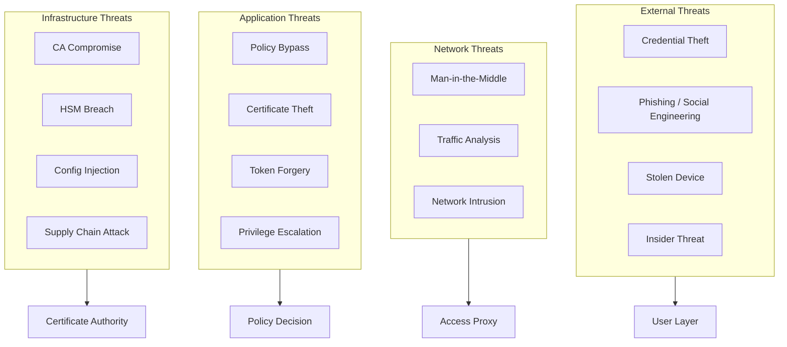
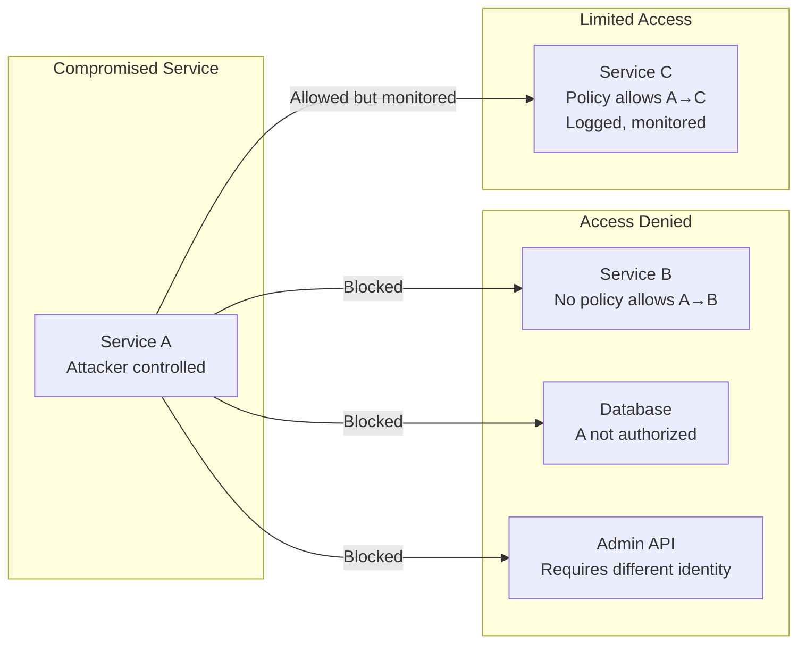
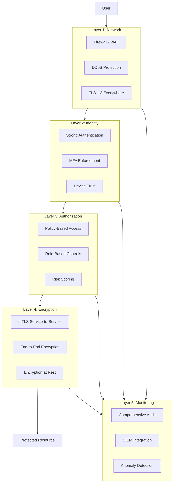

# Security & Compliance

[← Back to Index](./00-index.md)

---

## Threat Model

### Attack Surface Analysis



### Top Attack Vectors & Mitigations

#### 1. Compromised User Credentials

**Threat:** Attacker obtains valid username/password through phishing or breach.

**Mitigations:**

| Control | Implementation | Effectiveness |
|---------|----------------|---------------|
| **MFA (mandatory)** | TOTP, WebAuthn, push notification | Blocks 99%+ credential attacks |
| **Device binding** | Token tied to device certificate | Stolen creds useless without device |
| **Risk-based auth** | Step-up MFA on suspicious activity | Adaptive protection |
| **Password hygiene** | Breach database checks, complexity | Reduce credential quality attacks |

```
Authentication Flow with MFA:

1. User submits credentials
2. IdP validates password
3. Check risk signals:
   - New device? → MFA required
   - Unusual location? → MFA required
   - High-sensitivity resource? → MFA required
4. MFA challenge (WebAuthn preferred)
5. Issue short-lived token (1 hour)
6. Bind token to device certificate
```

#### 2. Stolen or Compromised Device

**Threat:** Attacker gains access to device with valid certificates/tokens.

**Mitigations:**

| Control | Implementation | Effectiveness |
|---------|----------------|---------------|
| **Device attestation** | TPM/Secure Enclave verification | Detect rooted/compromised devices |
| **Remote wipe** | MDM integration | Revoke access immediately |
| **Short-lived certs** | 24h TTL with continuous validation | Limit exposure window |
| **Continuous posture** | Real-time compliance monitoring | Detect changes post-auth |

```
Compromised Device Response:

1. Detection (MDM reports device compromised)
2. Immediate Actions (automated):
   - Revoke all active sessions
   - Revoke device certificates
   - Add device to blocklist
3. User notification
4. Require re-enrollment with fresh device attestation
```

#### 3. Lateral Movement After Breach

**Threat:** Attacker compromises one service, attempts to access others.

**Mitigations:**

| Control | Implementation | Effectiveness |
|---------|----------------|---------------|
| **Micro-segmentation** | Per-service policies | Contain blast radius |
| **Least privilege** | Minimum required access | Reduce accessible resources |
| **Service identity** | SPIFFE/mTLS | Verify service-to-service calls |
| **Anomaly detection** | Unusual access patterns | Detect lateral movement |



#### 4. Certificate or Key Compromise

**Threat:** Private key of service certificate or CA key leaked.

**Mitigations:**

| Scenario | Response | Recovery Time |
|----------|----------|---------------|
| **Single service key** | Revoke cert, issue new | < 5 minutes |
| **Intermediate CA key** | Revoke CA, re-issue all certs | < 30 minutes |
| **Root CA key** | Key ceremony, new trust chain | 4-24 hours |

```
Certificate Revocation Process:

1. Identify compromised certificate (serial number)
2. Add to Certificate Revocation List (CRL)
3. Push OCSP staple update
4. Notify all PEPs to refresh revocation data
5. Issue replacement certificate (if service cert)
6. Forensic investigation
```

#### 5. Policy Bypass Attempts

**Threat:** Attacker attempts to circumvent policy enforcement.

**Attack Patterns and Defenses:**

| Attack | Defense |
|--------|---------|
| Modify request after policy check | PEP re-validates on every request |
| Forge identity claims | Signature verification, token binding |
| Exploit policy logic errors | Policy simulation/testing, audit |
| Time-of-check-time-of-use (TOCTOU) | Atomic policy evaluation |
| Header injection | Strict input validation, allowlists |

---

## Defense in Depth

### Security Layers



### Micro-Segmentation Enforcement

```
Segmentation Policy Example:

// Production workloads cannot access dev resources
POLICY "prod-no-dev-access" {
    effect: DENY
    subjects: [
        { type: SERVICE, attributes: { environment: "production" } }
    ]
    resources: [
        { type: SERVICE, attributes: { environment: "development" } }
    ]
    actions: ["*"]
}

// Payment service can only call specific downstream services
POLICY "payment-service-allowed-calls" {
    effect: ALLOW
    subjects: [
        { type: SERVICE, spiffe_id: "spiffe://example.com/ns/prod/sa/payment-service" }
    ]
    resources: [
        { type: SERVICE, spiffe_ids: [
            "spiffe://example.com/ns/prod/sa/ledger-service",
            "spiffe://example.com/ns/prod/sa/fraud-detection"
        ] }
    ]
    actions: ["POST", "GET"]
}
```

### Continuous Verification

```
Verification Points:

1. Initial Authentication
   - User identity verified
   - Device posture checked
   - Risk score calculated

2. Every Request
   - Policy evaluated
   - Token validated
   - mTLS certificate verified

3. Periodic Re-evaluation (every 15 min)
   - Device posture refreshed
   - Risk score updated
   - Session validity confirmed

4. On Sensitivity Change
   - Step-up authentication for high-risk actions
   - Additional verification for sensitive data

5. Continuous Monitoring
   - Behavioral anomaly detection
   - Session terminated on policy violation
```

---

## Authentication & Authorization

### Authentication Mechanisms

| Layer | Method | Use Case |
|-------|--------|----------|
| **User → Access Proxy** | OIDC + MFA | Human users |
| **Service → PEP** | mTLS + SPIFFE | Service-to-service |
| **Device → DTS** | Platform attestation | Device trust |
| **Admin → PAP** | OIDC + MFA + approval | Policy management |

### Multi-Factor Authentication Matrix

| Scenario | Factors Required |
|----------|-----------------|
| Standard access | Password + TOTP/Push |
| High-sensitivity resource | Password + WebAuthn |
| Admin operations | Password + WebAuthn + Peer approval |
| New device | Password + Email + Phone |
| Unusual location | Additional verification step |

### Authorization Model

```
Hybrid ABAC + ReBAC Model:

ABAC (Attribute-Based):
├── User attributes: department, role, clearance
├── Resource attributes: sensitivity, owner, type
├── Environment: time, location, device trust
└── Combine with boolean logic

ReBAC (Relationship-Based):
├── User IS_MEMBER_OF Group
├── Group HAS_ACCESS_TO Resource
├── User OWNS Resource
├── Resource IS_CHILD_OF Parent_Resource
└── Graph traversal for authorization

Combined Example:
ALLOW IF (
    subject.role IN ["engineer", "admin"] AND
    resource.sensitivity <= subject.clearance AND
    context.device.trust_score >= 0.8 AND
    graph.has_path(subject, "CAN_ACCESS", resource)
)
```

---

## Data Security

### Encryption Standards

| Data State | Encryption | Key Management |
|------------|------------|----------------|
| In Transit | TLS 1.3, mTLS | Auto-managed certs |
| At Rest (HSM) | AES-256-GCM | HSM-protected |
| At Rest (Database) | AES-256-GCM | KMS |
| At Rest (Logs) | AES-256-GCM | Separate key |
| Backups | AES-256-GCM | Offline key ceremony |

### Sensitive Data Handling

```
Data Classification:

PUBLIC
├── General documentation
├── Public-facing configurations
└── No special handling

INTERNAL
├── Policy definitions
├── Service configurations
└── Encrypted at rest, access logged

CONFIDENTIAL
├── User identities
├── Device information
├── Encrypted, access audited, retention limits

SECRET
├── CA private keys
├── HSM credentials
├── HSM-only access, key ceremony required
```

### PII Handling

| Data | Classification | Handling |
|------|---------------|----------|
| User ID | Internal | Hash in logs |
| Email | Confidential | Encrypt, redact in logs |
| IP Address | Confidential | Truncate in analytics |
| Device Fingerprint | Confidential | Hash, time-limited retention |
| Geolocation | Confidential | Coarse granularity only |

---

## Compliance Mapping

### NIST SP 800-207 (Zero Trust Architecture)

| NIST Tenet | Implementation |
|------------|----------------|
| **All resources are secured** | mTLS everywhere, policy enforcement at every access point |
| **All communication secured** | TLS 1.3 + mTLS for all connections |
| **Per-session access** | Short-lived tokens (1h), certificates (24h) |
| **Dynamic policy** | Real-time policy evaluation with context |
| **Asset monitoring** | Continuous device posture assessment |
| **Strict authentication** | MFA required, device binding |
| **Continuous improvement** | Audit logs feed into security analytics |

### SOC 2 Type II Alignment

| Trust Principle | Controls |
|-----------------|----------|
| **Security** | MFA, encryption, access controls, intrusion detection |
| **Availability** | HA architecture, DR procedures, monitoring |
| **Confidentiality** | Data classification, encryption, access logging |
| **Processing Integrity** | Policy versioning, audit trails, change management |
| **Privacy** | PII handling, data minimization, retention policies |

### GDPR Considerations

| Requirement | Implementation |
|-------------|----------------|
| **Lawful basis** | Legitimate interest (security) documented |
| **Data minimization** | Collect only necessary identity attributes |
| **Right to access** | User can request access decision history |
| **Right to erasure** | Device and session data deletable |
| **Data protection** | Encryption, access controls, audit |
| **Breach notification** | Incident response within 72 hours |

### PCI-DSS (if applicable)

| Requirement | Implementation |
|-------------|----------------|
| **Req 1: Network security** | Micro-segmentation, mTLS |
| **Req 3: Protect stored data** | Encryption at rest |
| **Req 4: Encrypt transmission** | TLS 1.3 everywhere |
| **Req 7: Restrict access** | Least privilege, policy-based |
| **Req 8: Identify users** | Strong authentication, MFA |
| **Req 10: Track access** | Comprehensive audit logging |
| **Req 12: Security policies** | Documented and enforced |

---

## Security Operations

### Incident Response for Zero Trust

```
Incident Categories:

P1 - Critical:
├── CA key compromise
├── Mass unauthorized access
├── Policy engine failure allowing bypass
└── Response: All-hands, 15-min SLA

P2 - High:
├── Single service identity compromise
├── Device posture bypass
├── Anomalous access patterns detected
└── Response: On-call team, 1-hour SLA

P3 - Medium:
├── Failed authentication spike
├── Policy evaluation errors
├── Certificate rotation failures
└── Response: Next business day

P4 - Low:
├── Individual access denied (legitimate)
├── Configuration drift
└── Response: Backlog
```

### Security Review Checklist

**Design Review:**
- [ ] Threat model documented
- [ ] Attack surface minimized
- [ ] Defense in depth applied
- [ ] Fail-closed by default

**Implementation Review:**
- [ ] Input validation on all APIs
- [ ] Secrets not hardcoded
- [ ] Dependencies scanned
- [ ] mTLS properly configured

**Deployment Review:**
- [ ] TLS certificates valid
- [ ] HSM access restricted
- [ ] Network segmentation verified
- [ ] Audit logging enabled

**Operations Review:**
- [ ] Alerts configured
- [ ] Runbooks documented
- [ ] Incident response tested
- [ ] Key rotation scheduled

---

## Key Ceremony Procedures

### Root CA Key Generation

```
Root CA Key Ceremony:

Prerequisites:
├── Secure facility (audited, surveilled)
├── M-of-N key holders present (e.g., 3 of 5)
├── Independent auditor present
├── HSM initialized and verified

Procedure:
1. Verify HSM is in factory state
2. Generate root key pair in HSM (ECDSA P-384 or RSA-4096)
3. Export key shares to M-of-N smart cards
4. Distribute smart cards to key holders
5. Generate root certificate (self-signed)
6. Export root certificate (public only)
7. Verify certificate signature
8. Secure HSM for production use
9. Store backup smart cards in separate secure locations

Duration: 4-8 hours
Participants: 5-7 people
Documentation: Video recorded, signed attestation
```

### Emergency Key Recovery

```
Emergency Key Recovery Procedure:

Trigger: Root or Intermediate CA key unavailable

1. Assemble key holders (M of N required)
2. Verify identity of each holder
3. Transport to secure facility
4. Each holder provides their key share
5. Reconstruct key in new HSM
6. Verify key by signing test certificate
7. Cross-sign with backup CA (if available)
8. Update trust bundles across all systems
9. Resume normal operations
10. Post-incident review

Estimated Duration: 4-24 hours depending on holder availability
```
