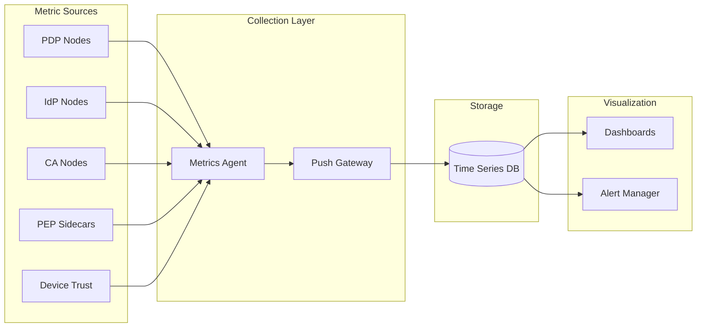
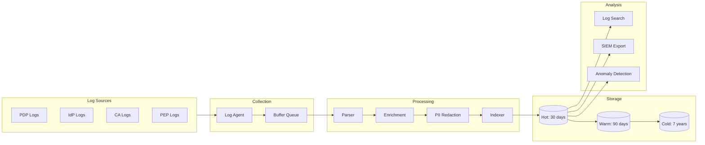
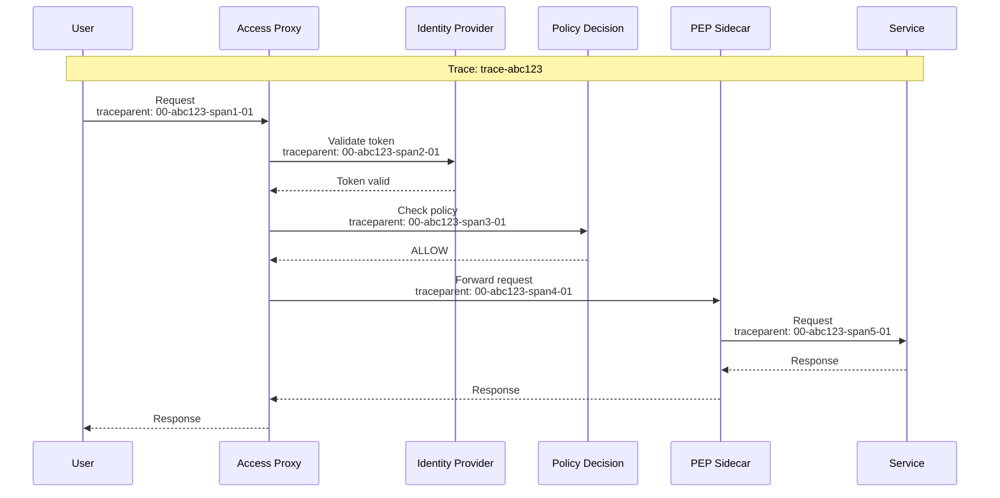

# Observability

[← Back to Index](./00-index.md)

---

## Metrics (USE/RED Method)

### USE Metrics (for Resources)

**U**tilization, **S**aturation, **E**rrors

| Resource | Utilization | Saturation | Errors |
|----------|-------------|------------|--------|
| **PDP CPU** | pdp_cpu_usage_percent | pdp_request_queue_depth | pdp_errors_total |
| **PDP Memory** | pdp_memory_used_bytes | pdp_gc_pause_duration_ms | pdp_oom_events |
| **IdP CPU** | idp_cpu_usage_percent | idp_auth_queue_depth | idp_auth_errors_total |
| **CA CPU** | ca_cpu_usage_percent | ca_signing_queue_depth | ca_signing_errors_total |
| **HSM** | hsm_operations_per_sec | hsm_queue_depth | hsm_errors_total |
| **Policy Store** | policy_store_cpu_percent | policy_sync_lag_seconds | policy_store_errors |

### RED Metrics (for Services)

**R**ate, **E**rrors, **D**uration

| Service | Rate | Errors | Duration |
|---------|------|--------|----------|
| **Policy Evaluation** | policy_evaluations_total | policy_eval_errors_total | policy_eval_latency_seconds |
| **Authentication** | auth_attempts_total | auth_failures_total | auth_latency_seconds |
| **Certificate Signing** | cert_signing_requests_total | cert_signing_errors_total | cert_signing_latency_seconds |
| **Device Posture Check** | device_checks_total | device_check_errors_total | device_check_latency_seconds |
| **mTLS Handshake** | mtls_handshakes_total | mtls_handshake_failures_total | mtls_handshake_latency_ms |

### Key Business Metrics

```
# Access Decision Metrics
access_decisions_total{result="allowed|denied", user_tier="free|premium|enterprise", resource_type="api|database|service"}
access_denied_reasons_total{reason="policy_denied|expired_token|invalid_device|no_matching_policy"}

# Authentication Metrics
auth_attempts_total{method="password|sso|mfa", result="success|failure"}
mfa_challenges_total{type="totp|webauthn|push", result="success|failure|timeout"}

# Certificate Metrics
active_certificates_total{type="workload|user|ca"}
certificate_rotations_total{result="success|failure"}
certificate_expiry_days_bucket{le="1|7|14|30"}

# Device Trust Metrics
device_trust_scores_histogram{platform="windows|macos|ios|android"}
device_compliance_status{status="compliant|non_compliant|unknown"}

# Policy Metrics
policy_evaluations_by_result{result="allow|deny|not_applicable"}
policy_cache_hit_rate
policy_sync_lag_seconds
```

### Metric Collection Architecture



---

## Dashboard Design

### Operations Dashboard

```
┌─────────────────────────────────────────────────────────────────────────┐
│  ZERO TRUST - OPERATIONS DASHBOARD                                      │
├─────────────────────────────────────────────────────────────────────────┤
│                                                                         │
│  ┌─────────────┐  ┌─────────────┐  ┌─────────────┐  ┌─────────────┐    │
│  │ Policy Evals│  │ Deny Rate   │  │ P99 Latency │  │ Active Certs│    │
│  │  125,432/s  │  │    2.1%     │  │    4.2ms    │  │   28,450    │    │
│  │   ▲ 8%      │  │   ▼ 0.3%   │  │   ▲ 0.5ms   │  │   ▲ 150     │    │
│  └─────────────┘  └─────────────┘  └─────────────┘  └─────────────┘    │
│                                                                         │
│  Access Decisions (24h)                    Policy Eval Latency         │
│  ┌──────────────────────────────┐         ┌──────────────────────┐    │
│  │ Allow: 97.9% ███████████████ │         │ p50: 1.2ms           │    │
│  │ Deny:   2.1% ▌               │         │ p95: 3.1ms           │    │
│  │                              │         │ p99: 4.2ms           │    │
│  │ Denials by Reason:           │         │ max: 15.3ms          │    │
│  │  Policy denied: 65%          │         └──────────────────────┘    │
│  │  Device non-compliant: 20%   │                                      │
│  │  Expired token: 10%          │         Certificate Health           │
│  │  Unknown identity: 5%        │         ┌──────────────────────┐    │
│  └──────────────────────────────┘         │ Healthy: 99.2%       │    │
│                                           │ Expiring <24h: 0.5%  │    │
│  Authentication Activity                   │ Expiring <7d: 2.1%   │    │
│  ┌──────────────────────────────┐         │ Revoked: 0.2%        │    │
│  │    ▂▃▄▅▆▇█▇▆▅▄▃▂▂▃▄▅▆▇█     │         └──────────────────────┘    │
│  │  Peak: 5,234 auth/min @ 9AM  │                                      │
│  │  MFA Rate: 45%               │         Device Compliance            │
│  │  MFA Success: 99.1%          │         ┌──────────────────────┐    │
│  └──────────────────────────────┘         │ Compliant: 94.2%     │    │
│                                           │ Non-compliant: 4.1%  │    │
│  Component Health                          │ Unknown: 1.7%        │    │
│  ┌──────────────────────────────┐         └──────────────────────┘    │
│  │ PDP Cluster:    ● Healthy    │                                      │
│  │ IdP Cluster:    ● Healthy    │                                      │
│  │ CA Cluster:     ● Healthy    │                                      │
│  │ Policy Store:   ● Healthy    │                                      │
│  │ Device Trust:   ○ Degraded   │                                      │
│  └──────────────────────────────┘                                      │
└─────────────────────────────────────────────────────────────────────────┘
```

### Security Dashboard

```
┌─────────────────────────────────────────────────────────────────────────┐
│  ZERO TRUST - SECURITY DASHBOARD                                        │
├─────────────────────────────────────────────────────────────────────────┤
│                                                                         │
│  ┌─────────────┐  ┌─────────────┐  ┌─────────────┐  ┌─────────────┐    │
│  │ Failed Auth │  │ Risky Access│  │ Policy Viol │  │ Cert Revoked│    │
│  │    1,234    │  │     89      │  │      12     │  │      3      │    │
│  │   ▼ 5%      │  │   ▲ 15%    │  │   ▼ 2      │  │   ─ 0       │    │
│  └─────────────┘  └─────────────┘  └─────────────┘  └─────────────┘    │
│                                                                         │
│  Authentication Failures (24h)             High-Risk Access Attempts    │
│  ┌──────────────────────────────┐         ┌──────────────────────┐    │
│  │ By Reason:                   │         │ Unknown location: 45 │    │
│  │  Invalid password: 45%       │         │ New device: 23       │    │
│  │  MFA failed: 25%             │         │ Unusual time: 12     │    │
│  │  Unknown user: 15%           │         │ Behavior anomaly: 9  │    │
│  │  Device blocked: 10%         │         │                      │    │
│  │  Account locked: 5%          │         │ ▲ 15% from yesterday │    │
│  └──────────────────────────────┘         └──────────────────────┘    │
│                                                                         │
│  Top Denied Users                          Top Denied Resources         │
│  ┌──────────────────────────────┐         ┌──────────────────────┐    │
│  │ 1. user_*** (87 denials)     │         │ 1. /api/admin (234)  │    │
│  │ 2. user_*** (54 denials)     │         │ 2. /api/sensitive (156)   │
│  │ 3. user_*** (32 denials)     │         │ 3. database:prod (98)│    │
│  │ 4. user_*** (28 denials)     │         │ 4. /api/export (67)  │    │
│  │ 5. user_*** (21 denials)     │         │ 5. /api/delete (45)  │    │
│  └──────────────────────────────┘         └──────────────────────┘    │
│                                                                         │
│  Policy Changes (7d)                       Certificate Events (24h)     │
│  ┌──────────────────────────────┐         ┌──────────────────────┐    │
│  │ ● Policy "admin-access" mod  │         │ Issued: 1,234        │    │
│  │   by admin@co 2h ago         │         │ Renewed: 890         │    │
│  │ ● Policy "dev-readonly" add  │         │ Revoked: 3           │    │
│  │   by sec-team@co 1d ago      │         │ Expired: 12          │    │
│  │ ● Policy "contractor" mod    │         │ Failed issuance: 2   │    │
│  │   by admin@co 3d ago         │         └──────────────────────┘    │
│  └──────────────────────────────┘                                      │
└─────────────────────────────────────────────────────────────────────────┘
```

---

## Logging

### What to Log

| Event | Log Level | Required Fields |
|-------|-----------|-----------------|
| Access allowed | INFO | request_id, subject, resource, action, policy_id |
| Access denied | WARN | request_id, subject, resource, action, deny_reason |
| Authentication success | INFO | user_id, method, device_id, ip |
| Authentication failure | WARN | user_id (if known), method, failure_reason, ip |
| MFA challenge | INFO | user_id, mfa_type, result |
| Certificate issued | INFO | spiffe_id, serial, expires_at |
| Certificate revoked | WARN | serial, reason, revoked_by |
| Policy change | INFO | policy_id, change_type, changed_by, diff_summary |
| Device posture change | INFO | device_id, old_status, new_status |
| High-risk access | WARN | request_id, risk_score, risk_factors |

### Log Levels Strategy

```
DEBUG: Detailed troubleshooting (dev only)
       - Policy evaluation steps
       - Cache hits/misses
       - Attribute resolution

INFO:  Normal operations
       - Successful access decisions
       - Authentication completions
       - Certificate lifecycle events
       - Policy sync completion

WARN:  Potential issues
       - Access denied
       - High-risk access attempts
       - Certificate approaching expiry
       - Degraded mode entry

ERROR: Failures requiring attention
       - Policy evaluation failures
       - Certificate signing errors
       - HSM communication errors
       - IdP unreachable

FATAL: System cannot continue
       - CA key unavailable
       - Policy store corruption
       - Critical component failure
```

### Structured Log Format

**Access Decision Log:**

```json
{
  "timestamp": "2024-01-15T12:34:56.789Z",
  "level": "INFO",
  "event": "access_decision",
  "trace_id": "abc123def456",
  "span_id": "span789",

  "subject": {
    "user_id": "usr_***",
    "user_email_hash": "a1b2c3...",
    "service_id": null,
    "spiffe_id": null,
    "ip_address": "192.168.xxx.xxx",
    "device_id": "dev_***"
  },

  "resource": {
    "type": "api",
    "id": "/api/v1/orders",
    "action": "GET",
    "sensitivity": "internal"
  },

  "decision": {
    "result": "ALLOW",
    "policy_id": "pol_12345",
    "policy_version": 42,
    "risk_score": 15.2,
    "conditions_evaluated": 5,
    "cache_hit": true
  },

  "context": {
    "session_id": "sess_***",
    "geo_location": "US-CA",
    "time_of_day": "business_hours",
    "device_trust_score": 0.92
  },

  "performance": {
    "total_latency_ms": 3.2,
    "policy_eval_ms": 1.5,
    "cache_lookup_ms": 0.2
  }
}
```

**Authentication Log:**

```json
{
  "timestamp": "2024-01-15T12:34:56.789Z",
  "level": "INFO",
  "event": "authentication",

  "user": {
    "user_id": "usr_***",
    "email_hash": "a1b2c3..."
  },

  "authentication": {
    "method": "password",
    "result": "success",
    "mfa_required": true,
    "mfa_method": "webauthn",
    "mfa_result": "success"
  },

  "device": {
    "device_id": "dev_***",
    "platform": "macos",
    "trust_score": 0.95,
    "new_device": false
  },

  "session": {
    "session_id": "sess_***",
    "token_type": "jwt",
    "expires_in_seconds": 3600
  },

  "context": {
    "ip_address": "192.168.xxx.xxx",
    "geo_location": "US-CA",
    "user_agent_hash": "xyz789..."
  }
}
```

### Log Pipeline



---

## Distributed Tracing

### Trace Propagation



### Key Spans

| Span Name | Parent | Attributes |
|-----------|--------|------------|
| `zero_trust.access_check` | user.request | user_id, resource, action |
| `zero_trust.token_validation` | access_check | token_type, cache_hit |
| `zero_trust.policy_evaluation` | access_check | policy_count, decision |
| `zero_trust.device_check` | access_check | device_id, trust_score |
| `zero_trust.mtls_handshake` | service.call | peer_spiffe_id |
| `zero_trust.cert_validation` | mtls_handshake | cert_serial, chain_length |

### Sampling Strategy

```
Sampling Rules:

// Always trace denied requests (security events)
IF decision == DENY THEN
    sample = TRUE

// Always trace slow requests
IF latency_ms > 50 THEN
    sample = TRUE

// Always trace errors
IF error THEN
    sample = TRUE

// Sample successful requests at 1%
IF random() < 0.01 THEN
    sample = TRUE

// Always trace during incidents
IF incident_mode THEN
    sample = TRUE
```

---

## Alerting

### Critical Alerts (P1 - Page)

| Alert | Condition | Response |
|-------|-----------|----------|
| **PDP Cluster Down** | healthy_pdp_nodes == 0 for 1 min | Page on-call, failover |
| **CA Unavailable** | cert_signing_errors > 50% for 5 min | Page on-call, check HSM |
| **Mass Access Denials** | deny_rate > 20% for 5 min | Page security + on-call |
| **IdP Down** | auth_success_rate < 10% for 2 min | Page on-call |
| **Policy Store Corrupt** | policy_sync_errors > 10 for 1 min | Page on-call |

### Warning Alerts (P2 - Slack)

| Alert | Condition | Response |
|-------|-----------|----------|
| **High Latency** | policy_eval_p99 > 15ms for 10 min | Investigate, scale if needed |
| **Certificate Expiry** | certs_expiring_24h > 100 | Check rotation |
| **Device Compliance Drop** | compliance_rate < 90% | Notify security team |
| **Policy Sync Lag** | sync_lag > 60s | Check policy store |
| **Elevated Denials** | deny_rate > 10% for 30 min | Review policies |

### Alert Configuration Example

```yaml
# High Policy Evaluation Latency
alert: ZeroTrustHighLatency
expr: |
  histogram_quantile(0.99,
    sum(rate(policy_eval_latency_bucket[5m])) by (le)
  ) > 0.015
for: 10m
labels:
  severity: warning
  team: platform
annotations:
  summary: "Policy evaluation p99 latency above 15ms"
  description: "Current p99 latency: {{ $value | humanizeDuration }}"
  runbook: "https://wiki.internal/runbooks/zero-trust-latency"
  dashboard: "https://grafana.internal/d/zero-trust"

# Mass Access Denials
alert: ZeroTrustMassdenials
expr: |
  (
    sum(rate(access_decisions_total{result="denied"}[5m]))
    /
    sum(rate(access_decisions_total[5m]))
  ) > 0.20
for: 5m
labels:
  severity: critical
  team: security
annotations:
  summary: "Access denial rate above 20%"
  description: "{{ $value | humanizePercentage }} of requests denied"
  runbook: "https://wiki.internal/runbooks/mass-denials"
```

---

## Runbook References

### Runbook: High Policy Evaluation Latency

```
Symptom: policy_eval_p99 > 15ms

Diagnostic Steps:

1. Check PDP cluster health
   - Dashboard: PDP Operations panel
   - Are all nodes healthy?
   - CPU/Memory utilization?

2. Check policy cache hit rate
   - Query: policy_cache_hit_rate
   - If low, check policy store connectivity

3. Check policy complexity
   - Are there recently added complex policies?
   - Large number of conditions per policy?

4. Check directory service
   - Group/role lookups slow?
   - LDAP/directory response times?

5. Check for hot resources
   - Specific resources with high query rate?
   - Consider caching optimization

Remediation:
- Scale PDP cluster horizontally
- Optimize slow policies
- Increase cache TTL (with consistency trade-off)
- Add local caching for hot policies

Escalation: Platform Engineering team
```

### Runbook: Mass Access Denials

```
Symptom: deny_rate > 20% for 5+ minutes

Diagnostic Steps:

1. Identify denial reason breakdown
   - Query: access_denied_reasons_total
   - Which reason is most common?

2. If "policy_denied":
   - Check for recent policy changes
   - Rollback if problematic change identified
   - Check policy sync status across PDP nodes

3. If "invalid_device":
   - Check device posture service
   - MDM connectivity?
   - Device compliance policy change?

4. If "expired_token":
   - Check IdP health
   - Token signing key rotation?
   - Clock skew between services?

5. If sudden spike:
   - Correlate with deployments
   - Check for attack patterns
   - Enable additional logging

Remediation:
- Rollback problematic policy changes
- Fix device posture service
- Clear and refresh auth tokens
- Enable permissive mode if legitimate users blocked

Escalation: Security team + Platform Engineering
```

---

## Audit & Compliance Reporting

### Compliance Reports

```
Available Reports:

1. Access Decision Audit (SOC 2, GDPR)
   - All access decisions with full context
   - Filter by time, user, resource
   - Export: CSV, JSON

2. Policy Change History
   - All policy modifications with diff
   - Who changed, when, approval
   - Export: PDF, JSON

3. Certificate Lifecycle
   - Issuance, renewal, revocation events
   - CA operations audit
   - Export: PDF

4. Authentication Summary
   - Login attempts, success/failure rates
   - MFA usage statistics
   - Export: CSV, PDF

5. Device Compliance Trend
   - Compliance rate over time
   - Non-compliant device inventory
   - Export: CSV
```

### Report Generation

```
// Example: Generate SOC 2 Access Audit Report

FUNCTION generate_access_audit_report(start_date, end_date) -> Report:
    events = query_audit_logs(
        event_type: "access_decision",
        start: start_date,
        end: end_date
    )

    report = Report()

    // Summary statistics
    report.total_decisions = COUNT(events)
    report.allow_rate = COUNT(events WHERE result="ALLOW") / report.total_decisions
    report.deny_rate = 1 - report.allow_rate

    // Breakdown by resource type
    report.by_resource_type = GROUP_BY(events, resource.type)

    // Breakdown by user
    report.by_user = GROUP_BY(events, subject.user_id)

    // Policy usage
    report.policy_usage = GROUP_BY(events WHERE result="ALLOW", decision.policy_id)

    // Denial reasons
    report.denial_reasons = GROUP_BY(events WHERE result="DENY", decision.deny_reason)

    // High-risk events
    report.high_risk_events = FILTER(events, risk_score > 70)

    RETURN report
```
