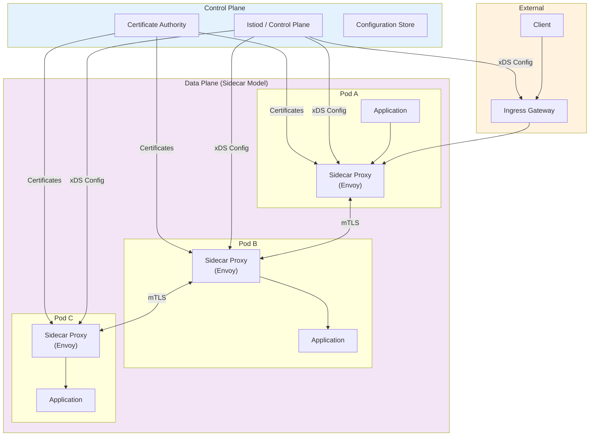

# Service Mesh Design

[Back to System Design Index](../README.md)

---

## Overview

A **Service Mesh** is a dedicated infrastructure layer that handles service-to-service communication within a microservices architecture. It abstracts the network from application code, managing critical cross-cutting concerns like traffic routing, load balancing, security (mTLS), observability, and resilience patterns without requiring changes to application code.

The mesh is implemented through lightweight network proxies deployed alongside application containers (sidecar pattern) or as shared per-node infrastructure (sidecar-less pattern). These proxies intercept all network traffic, enabling fine-grained control over service communication while the control plane manages configuration distribution, certificate issuance, and policy enforcement.

---

## Key Characteristics

| Characteristic | Value | Implication |
|----------------|-------|-------------|
| **Traffic Pattern** | Billions of requests/day in large deployments | Proxy overhead must be minimal |
| **Latency Sensitivity** | < 10ms overhead p99 acceptable | Data plane on critical path |
| **Consistency Model** | Eventual for config, strong for mTLS | Configuration propagation delay tolerable |
| **Availability Requirement** | 99.99% (data plane), 99.9% (control plane) | Sidecars cache config for resilience |
| **State Management** | Stateless proxies, centralized control plane | Proxy restarts don't lose state |
| **Security Model** | Zero-trust, mTLS everywhere | Every request authenticated/encrypted |

---

## Quick Navigation

| Document | Description |
|----------|-------------|
| [01 - Requirements & Estimations](./01-requirements-and-estimations.md) | Functional/non-functional requirements, capacity planning, SLOs |
| [02 - High-Level Design](./02-high-level-design.md) | Architecture diagrams, data flow, key decisions |
| [03 - Low-Level Design](./03-low-level-design.md) | Data model, API design (xDS), algorithms (pseudocode) |
| [04 - Deep Dive & Bottlenecks](./04-deep-dive-and-bottlenecks.md) | Envoy internals, control plane scaling, mTLS infrastructure |
| [05 - Scalability & Reliability](./05-scalability-and-reliability.md) | Scaling strategies, fault tolerance, multi-cluster |
| [06 - Security & Compliance](./06-security-and-compliance.md) | mTLS, SPIFFE, threat model, zero-trust alignment |
| [07 - Observability](./07-observability.md) | Metrics, distributed tracing, logging, alerting |
| [08 - Interview Guide](./08-interview-guide.md) | 45-min pacing, trap questions, trade-offs |

---

## Complexity Rating: High

| Aspect | Complexity | Reason |
|--------|------------|--------|
| **Data Plane (Proxy)** | High | Complex filter chains, protocol handling, hot restart |
| **Control Plane** | High | Config generation, xDS serving, certificate authority |
| **mTLS Infrastructure** | High | PKI management, certificate rotation, SPIFFE identities |
| **Traffic Management** | Medium-High | Routing rules, circuit breaking, retry logic |
| **Observability** | Medium | Automatic span generation, metric aggregation |
| **Multi-cluster** | Very High | Cross-cluster service discovery, trust domains |

---

## Implementation Comparison

| Aspect | Istio | Linkerd | Cilium | Istio Ambient |
|--------|-------|---------|--------|---------------|
| **Data Plane** | Envoy (C++) | linkerd2-proxy (Rust) | eBPF + kernel | Ztunnel (Rust) |
| **Architecture** | Sidecar per pod | Sidecar per pod | Sidecar-less | Per-node L4 + optional L7 |
| **Memory Overhead** | ~60MB/proxy | ~10MB/proxy | Minimal (~1MB agent) | ~5MB/node |
| **CPU Overhead** | 0.2 vCPU/1000 RPS | 0.05 vCPU/1000 RPS | Minimal | ~50% less than sidecar |
| **Latency Overhead** | 25-35% | 5-15% | 5-10% | 10-15% |
| **mTLS** | Optional (config) | Default enabled | Enabled | Default enabled |
| **Configuration** | Many CRDs | Minimal CRDs | Moderate | Moderate |
| **Maturity** | Production-ready | Production-ready | Growing adoption | GA (v1.24+) |
| **Best For** | Feature breadth | Simplicity/performance | Performance/scale | Resource efficiency |

---

## Architecture Overview



---

## Core Concepts

### Data Plane vs Control Plane

| Component | Responsibility | Characteristics |
|-----------|---------------|-----------------|
| **Data Plane** | Handle actual traffic: routing, load balancing, mTLS, observability | Latency-critical, stateless, resilient to control plane failure |
| **Control Plane** | Configure data plane: generate configs, issue certificates, define policies | Eventually consistent, centralized, can tolerate brief outages |

### Sidecar Pattern

```
┌─────────────────────────────────────────────┐
│                    Pod                       │
│  ┌──────────────┐    ┌───────────────────┐  │
│  │ Application  │    │   Sidecar Proxy   │  │
│  │  Container   │◄──►│    (Envoy)        │  │
│  │              │    │                   │  │
│  │  localhost   │    │  iptables rules   │  │
│  │  :8080       │    │  intercept all    │  │
│  └──────────────┘    │  traffic          │  │
│                      └─────────┬─────────┘  │
└────────────────────────────────┼────────────┘
                                 │
                        All external traffic
                        flows through proxy
```

### xDS Protocol

The discovery service protocol used by control planes to configure proxies:

| API | Full Name | Purpose |
|-----|-----------|---------|
| **LDS** | Listener Discovery Service | Configure listeners (ports, protocols) |
| **RDS** | Route Discovery Service | Configure routing rules |
| **CDS** | Cluster Discovery Service | Configure upstream clusters |
| **EDS** | Endpoint Discovery Service | Configure service endpoints |
| **SDS** | Secret Discovery Service | Distribute certificates/secrets |
| **ADS** | Aggregated Discovery Service | Unified stream for all xDS |

---

## Key Trade-offs

```
Sidecar (Per-Pod) ←─────────────────────────→ Sidecar-less (Per-Node)
        ↑                                              ↑
  Full L7 features                              Lower resource overhead
  More isolation                                Kernel-level efficiency
  Higher memory/CPU                             Limited L7 features
  Configuration per pod                         Shared across pods

Istio (Feature Rich) ←───────────────────────→ Linkerd (Minimal)
        ↑                                              ↑
  Comprehensive features                        Simple, focused
  Complex configuration                         Easy to operate
  Many CRDs to learn                           Opinionated defaults
  Enterprise adoption                           Performance-first

Push Config ←────────────────────────────────→ Pull Config
        ↑                                              ↑
  Fast propagation                              Lower control plane load
  Higher control plane load                     Potential staleness
  Consistent updates                            Simpler architecture
```

### Trade-off Analysis

| Trade-off | Option A | Option B | Decision Factors |
|-----------|----------|----------|------------------|
| **Deployment Model** | Sidecar per pod | Per-node proxy | Resource constraints, L7 needs |
| **Proxy Technology** | Envoy (C++) | Custom (Rust) | Feature needs vs performance |
| **mTLS Strategy** | Permissive mode | Strict mode | Migration path, security posture |
| **Configuration** | Full mesh config | Discovery selectors | Cluster size, config complexity |
| **Multi-cluster** | Flat network | Gateway-based | Network topology, latency |

---

## Real-World Implementations

| Company | Implementation | Key Innovation | Scale |
|---------|---------------|----------------|-------|
| **Lyft** | Envoy (originated here) | Open-sourced Envoy, ratelimit service | Hundreds of thousands RPS |
| **Airbnb** | AirMesh (Istio-based) | Custom Viaduct control plane | 90%+ production traffic |
| **Uber** | Custom mesh | Dynamic subsetting in control plane | Millions of containers |
| **Pinterest** | Envoy-based mesh | Custom control plane | Large-scale deployment |
| **DoorDash** | Istio + Signadot | Production preview testing via mesh | Growing scale |
| **Google** | Internal mesh | BeyondCorp, mTLS everywhere | Billions of requests |

---

## Algorithm Summary

| Algorithm/Pattern | Purpose | Complexity | Use Case |
|-------------------|---------|------------|----------|
| **Weighted Round Robin** | Traffic distribution | O(1) per request | Canary deployments |
| **Consistent Hashing** | Session affinity | O(log n) | Stateful services |
| **Circuit Breaker** | Failure isolation | O(1) state machine | Prevent cascading failures |
| **Exponential Backoff** | Retry strategy | O(1) | Transient failure recovery |
| **Token Bucket** | Rate limiting | O(1) | Traffic shaping |
| **Outlier Detection** | Endpoint health | O(endpoints) | Remove unhealthy backends |

---

## When to Use a Service Mesh

| Scenario | Benefit |
|----------|---------|
| **Microservices at scale** | Unified traffic management |
| **Zero-trust security** | Automatic mTLS, no code changes |
| **Multi-language environment** | Language-agnostic policies |
| **Complex traffic patterns** | Canary, A/B testing, traffic mirroring |
| **Compliance requirements** | Encryption, audit logging |
| **Observability gaps** | Automatic metrics, traces, logs |

## When NOT to Use a Service Mesh

| Scenario | Alternative |
|----------|-------------|
| **Simple monolith** | Not needed |
| **< 10 services** | Overhead may not justify benefits |
| **Extreme latency sensitivity** | Consider application-level libraries |
| **Resource-constrained environments** | Sidecar overhead may be prohibitive |
| **Team unfamiliar with Kubernetes** | Adds significant operational complexity |

---

## Related System Designs

| Design | Relationship |
|--------|--------------|
| [1.14 API Gateway](../1.14-api-gateway-design/00-index.md) | North-south traffic management (mesh handles east-west) |
| [2.10 Zero Trust Security](../2.10-zero-trust-security-architecture/00-index.md) | Service mesh implements zero-trust for services |
| [1.1 Distributed Rate Limiter](../1.1-distributed-rate-limiter/00-index.md) | Rate limiting algorithms used by mesh |
| [1.2 Distributed Load Balancer](../1.2-distributed-load-balancer/00-index.md) | Load balancing strategies |
| [1.10 Service Discovery](../1.10-service-discovery-system/00-index.md) | Mesh integrates with service discovery |
| [1.8 Distributed Lock Manager](../1.8-distributed-lock-manager/00-index.md) | Leader election in control plane |

---

## Further Reading

- Envoy Proxy Documentation (envoyproxy.io)
- Istio Documentation (istio.io)
- Linkerd Documentation (linkerd.io)
- Cilium Service Mesh (cilium.io)
- "Service Mesh Patterns" by Lew Tucker
- CNCF Service Mesh Interface (SMI) specification

---

**Next: [01 - Requirements & Estimations](./01-requirements-and-estimations.md)**
