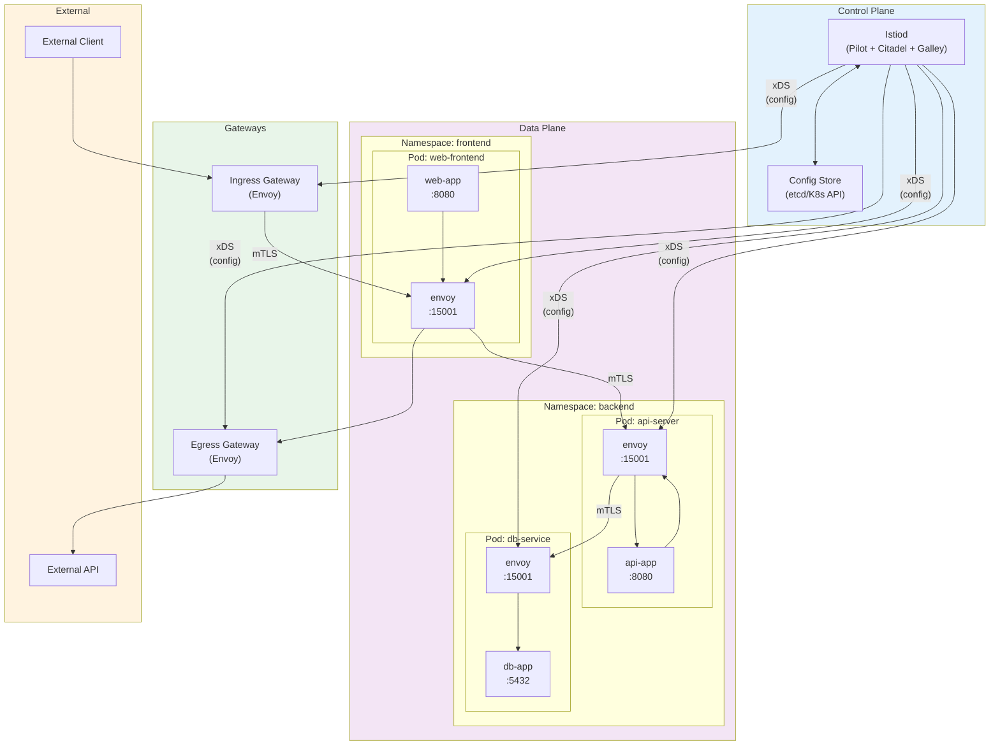
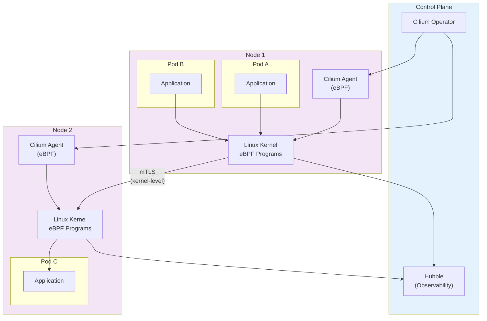
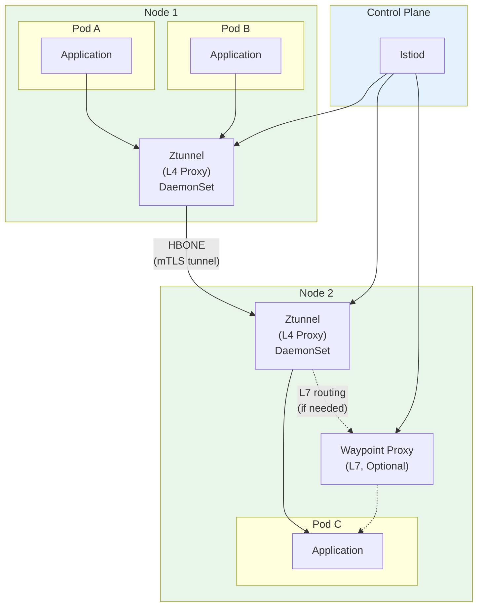
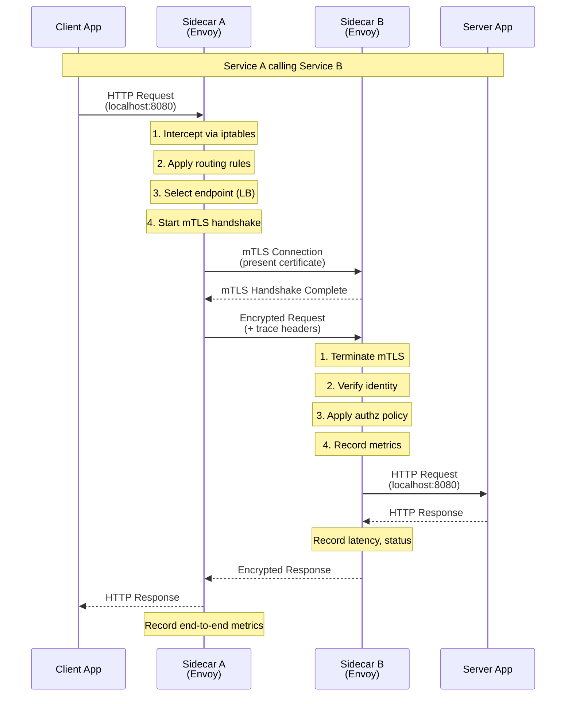
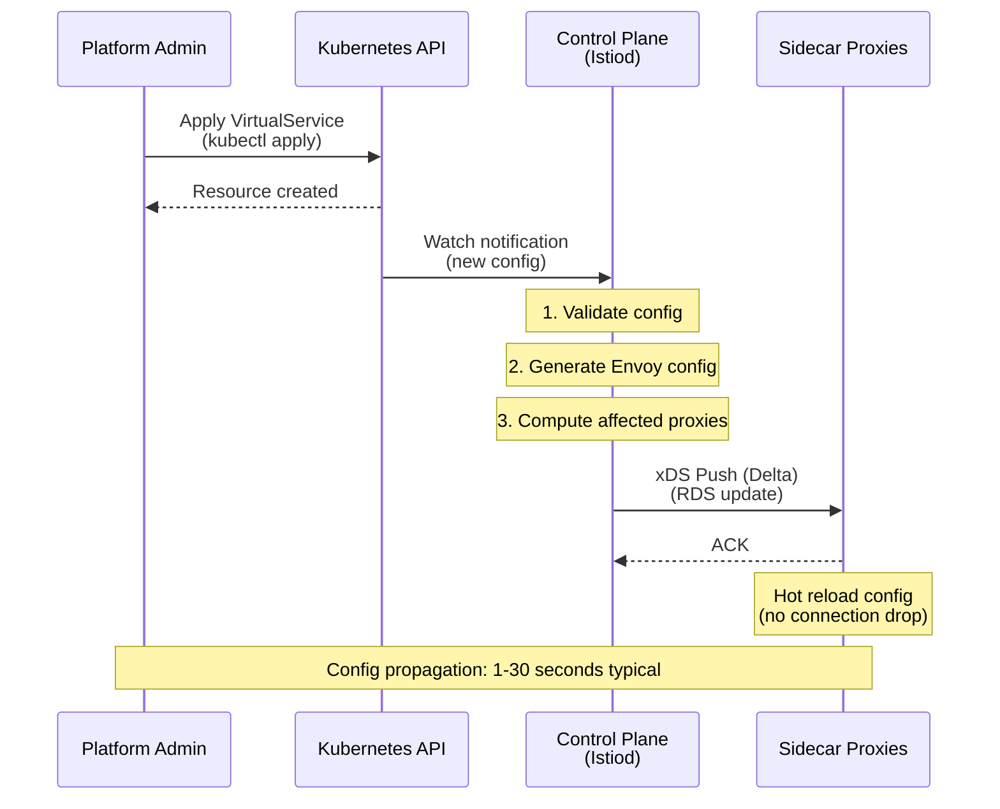
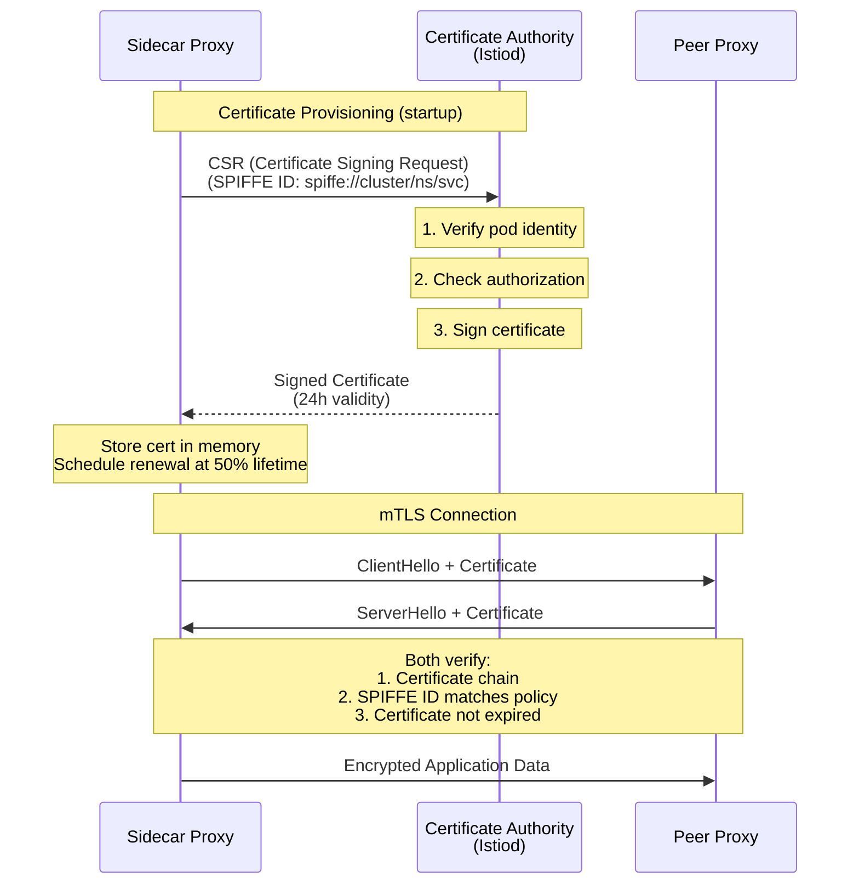
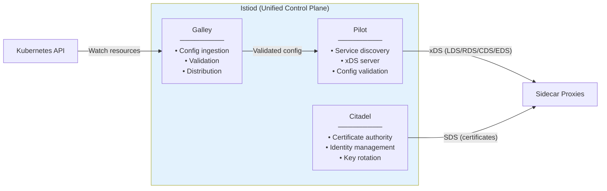
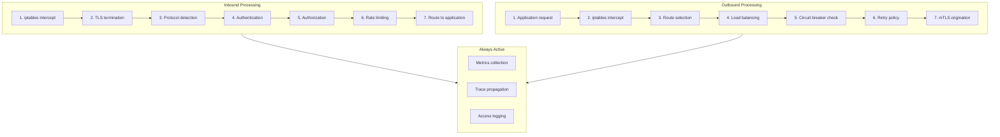

# Service Mesh Design - High-Level Design

[Back to Index](./00-index.md) | [Previous: Requirements](./01-requirements-and-estimations.md) | [Next: Low-Level Design](./03-low-level-design.md)

---

## Architecture Overview

A service mesh consists of two primary components: the **data plane** (network proxies that handle actual traffic) and the **control plane** (management layer that configures and coordinates the data plane).

---

## Sidecar Architecture (Istio/Linkerd Model)



---

## Sidecar-Less Architecture (Cilium / Istio Ambient)



---

## Istio Ambient Mode Architecture



---

## Data Flow: Request Through Sidecar Mesh



---

## Configuration Propagation Flow



---

## mTLS Handshake and Certificate Flow



---

## Key Architectural Decisions

### Decision 1: Sidecar vs Sidecar-less

| Factor | Sidecar (Istio/Linkerd) | Sidecar-less (Cilium/Ambient) |
|--------|-------------------------|-------------------------------|
| **L7 Features** | Full HTTP/gRPC features | Limited (L4 focus) or optional waypoint |
| **Resource Overhead** | ~60MB + CPU per pod | ~5MB per node |
| **Isolation** | Per-pod isolation | Shared per node |
| **Complexity** | Higher (more moving parts) | Lower (fewer components) |
| **Maturity** | Production-proven | Emerging (growing adoption) |

**Recommendation**: Start with sidecar model for full feature set. Consider sidecar-less for resource-constrained environments or when L7 features are not critical.

### Decision 2: Proxy Technology

| Factor | Envoy (C++) | linkerd2-proxy (Rust) | eBPF (Kernel) |
|--------|-------------|----------------------|---------------|
| **Performance** | Good | Better (lower latency) | Best (kernel-level) |
| **Memory** | ~60MB | ~10MB | Minimal |
| **Extensibility** | WASM filters, Lua | Limited | BPF programs |
| **Protocol Support** | HTTP/1-3, gRPC, TCP | HTTP/1-2, gRPC, TCP | L3/L4 + limited L7 |
| **Ecosystem** | Largest | Growing | Growing |

**Recommendation**: Envoy for maximum flexibility and ecosystem. linkerd2-proxy for performance-critical, simpler deployments. eBPF for extreme scale.

### Decision 3: Configuration Model

```
┌─────────────────────────────────────────────────────────────────┐
│                    Configuration Approaches                      │
├─────────────────────────────────────────────────────────────────┤
│                                                                  │
│  Kubernetes CRDs (Istio)              Service Mesh Interface    │
│  ─────────────────────                ───────────────────────   │
│  • VirtualService                     • TrafficTarget            │
│  • DestinationRule                    • HTTPRouteGroup           │
│  • Gateway                            • TrafficSplit             │
│  • AuthorizationPolicy                • TrafficMetrics           │
│  • PeerAuthentication                                            │
│                                                                  │
│  Pros: Fine-grained control           Pros: Portable             │
│  Cons: Istio-specific                 Cons: Limited features     │
│                                                                  │
└─────────────────────────────────────────────────────────────────┘
```

### Decision 4: Multi-Cluster Strategy

| Approach | Network Requirement | Latency | Complexity |
|----------|---------------------|---------|------------|
| **Flat Network** | Pod IPs routable across clusters | Lowest | Low |
| **Gateway-Based** | Only gateway IPs exposed | Higher | Medium |
| **Federated** | Independent meshes with trust | Variable | High |

---

## Component Responsibilities

### Control Plane Components



### Data Plane Components

| Component | Responsibility | Protocol |
|-----------|---------------|----------|
| **Sidecar Proxy** | Traffic interception, routing, mTLS, observability | HTTP/1-2, gRPC, TCP |
| **Ingress Gateway** | North-south traffic entry, TLS termination | HTTPS, HTTP/2 |
| **Egress Gateway** | Controlled external access, logging | HTTPS, TCP |
| **Waypoint Proxy** | L7 processing in ambient mode | HTTP/gRPC |

---

## Traffic Flow Patterns

### East-West Traffic (Service-to-Service)

```
┌─────────────────────────────────────────────────────────────────┐
│                                                                  │
│    Service A                           Service B                 │
│    ┌────────┐    ┌─────────┐    ┌─────────┐    ┌────────┐      │
│    │  App   │───►│ Sidecar │═══►│ Sidecar │───►│  App   │      │
│    └────────┘    └─────────┘    └─────────┘    └────────┘      │
│                       │              │                          │
│                       ▼              ▼                          │
│              ┌─────────────────────────────┐                   │
│              │   mTLS Encrypted Channel    │                   │
│              │   + Trace Context           │                   │
│              │   + Metrics Collection      │                   │
│              └─────────────────────────────┘                   │
│                                                                  │
└─────────────────────────────────────────────────────────────────┘
```

### North-South Traffic (External to Mesh)

```
┌─────────────────────────────────────────────────────────────────┐
│                                                                  │
│  External                    Mesh                               │
│  Client         Ingress      Service                            │
│    │            Gateway        │                                │
│    │    HTTPS      │    mTLS   │                                │
│    │───────────────►═══════════►                                │
│    │               │           │                                │
│    │               │           │                                │
│    │  TLS          │  Identity │                                │
│    │  Termination  │  Injection│                                │
│    │               │           │                                │
└─────────────────────────────────────────────────────────────────┘
```

---

## Architecture Pattern Checklist

| Pattern | Decision | Rationale |
|---------|----------|-----------|
| **Sync vs Async** | Synchronous (request-response) | Real-time traffic management |
| **Push vs Pull Config** | Push (xDS from control plane) | Fast propagation, consistent updates |
| **Stateless vs Stateful** | Stateless proxies, stateful control plane | Proxy resilience, simplified scaling |
| **Centralized vs Distributed** | Centralized control plane, distributed data plane | Manageability vs performance |
| **mTLS Mode** | Strict (production), Permissive (migration) | Security requirements |
| **Observability** | Automatic (proxy-generated) | No application changes |

---

## High-Level Request Processing



---

## Technology Stack Summary

| Layer | Component | Technology Options |
|-------|-----------|-------------------|
| **Control Plane** | Config Management | Kubernetes CRDs, etcd |
| **Control Plane** | Service Discovery | Kubernetes, Consul |
| **Control Plane** | Certificate Authority | Built-in CA, cert-manager, Vault |
| **Data Plane** | Proxy | Envoy, linkerd2-proxy, Cilium |
| **Data Plane** | Sidecar Injection | Mutating webhook, CNI plugin |
| **Observability** | Metrics | Prometheus, OpenTelemetry |
| **Observability** | Tracing | Jaeger, Zipkin, Tempo |
| **Observability** | Visualization | Kiali, Grafana |

---

**Next: [03 - Low-Level Design](./03-low-level-design.md)**
