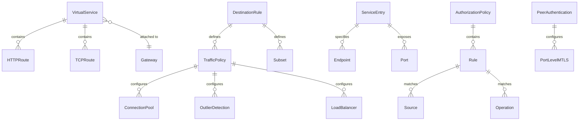
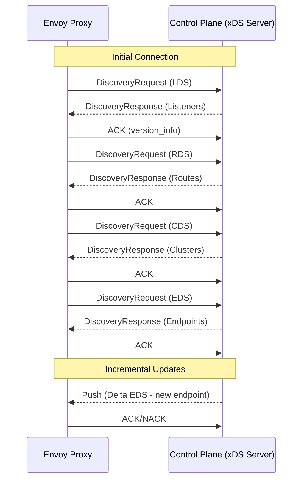

# Service Mesh Design - Low-Level Design

[Back to Index](./00-index.md) | [Previous: High-Level Design](./02-high-level-design.md) | [Next: Deep Dive](./04-deep-dive-and-bottlenecks.md)

---

## Data Model

### Core Configuration Resources



### VirtualService Schema

```yaml
# VirtualService: Defines routing rules for traffic
apiVersion: networking.istio.io/v1beta1
kind: VirtualService
metadata:
  name: reviews-route
  namespace: default
spec:
  hosts:
    - reviews                    # Service name or FQDN
  gateways:
    - mesh                       # Apply to mesh traffic
  http:
    - match:
        - headers:
            end-user:
              exact: jason       # Header-based routing
      route:
        - destination:
            host: reviews
            subset: v2           # Route to v2 for user "jason"
    - route:
        - destination:
            host: reviews
            subset: v1
          weight: 90             # 90% to v1
        - destination:
            host: reviews
            subset: v2
          weight: 10             # 10% to v2
      retries:
        attempts: 3
        perTryTimeout: 2s
      timeout: 10s
```

### DestinationRule Schema

```yaml
# DestinationRule: Defines policies after routing
apiVersion: networking.istio.io/v1beta1
kind: DestinationRule
metadata:
  name: reviews-destination
spec:
  host: reviews
  trafficPolicy:
    connectionPool:
      tcp:
        maxConnections: 100      # Max TCP connections
      http:
        h2UpgradePolicy: UPGRADE
        http1MaxPendingRequests: 100
        http2MaxRequests: 1000
    loadBalancer:
      simple: LEAST_REQUEST      # LB algorithm
    outlierDetection:
      consecutive5xxErrors: 5    # Ejection threshold
      interval: 30s
      baseEjectionTime: 30s
      maxEjectionPercent: 50
  subsets:
    - name: v1
      labels:
        version: v1
    - name: v2
      labels:
        version: v2
      trafficPolicy:
        loadBalancer:
          simple: ROUND_ROBIN    # Subset-specific policy
```

### AuthorizationPolicy Schema

```yaml
# AuthorizationPolicy: Defines access control
apiVersion: security.istio.io/v1beta1
kind: AuthorizationPolicy
metadata:
  name: httpbin-policy
  namespace: default
spec:
  selector:
    matchLabels:
      app: httpbin
  action: ALLOW
  rules:
    - from:
        - source:
            principals:
              - cluster.local/ns/default/sa/frontend
        - source:
            namespaces:
              - production
      to:
        - operation:
            methods:
              - GET
              - POST
            paths:
              - /api/*
      when:
        - key: request.headers[x-api-key]
          values:
            - valid-key-*
```

---

## xDS API Design

The xDS protocol is the standard for configuring Envoy proxies dynamically.

### xDS Resource Types

| API | Resource | Purpose | Update Frequency |
|-----|----------|---------|------------------|
| **LDS** | Listener | Configure listening ports and filter chains | Low (config changes) |
| **RDS** | RouteConfiguration | Define routing rules | Medium (route changes) |
| **CDS** | Cluster | Configure upstream clusters | Medium (service changes) |
| **EDS** | ClusterLoadAssignment | Endpoint addresses | High (pod churn) |
| **SDS** | Secret | Certificates and keys | Low (rotation) |

### xDS Protocol Flow



### xDS Message Format

```
DiscoveryRequest:
├── version_info: string       # Last received version
├── node: Node                 # Proxy identification
│   ├── id: string            # Unique proxy ID
│   ├── cluster: string       # Cluster name
│   └── metadata: Struct      # Additional info
├── resource_names: []string   # Requested resources
├── type_url: string          # Resource type
└── error_detail: Status      # Error if NACK

DiscoveryResponse:
├── version_info: string       # Current version
├── resources: []Any          # Configuration resources
├── type_url: string          # Resource type
├── nonce: string             # Response identifier
└── control_plane: ControlPlane # Control plane info
```

### Listener Configuration (LDS)

```
Listener:
├── name: "0.0.0.0_8080"
├── address:
│   └── socket_address:
│       ├── address: "0.0.0.0"
│       └── port_value: 8080
├── filter_chains:
│   └── FilterChain:
│       ├── filter_chain_match:
│       │   └── application_protocols: ["http/1.1", "h2c"]
│       ├── filters:
│       │   └── HttpConnectionManager:
│       │       ├── stat_prefix: "inbound_8080"
│       │       ├── route_config_name: "inbound|8080|http|service"
│       │       └── http_filters:
│       │           ├── envoy.filters.http.jwt_authn
│       │           ├── envoy.filters.http.rbac
│       │           └── envoy.filters.http.router
│       └── transport_socket:
│           └── DownstreamTlsContext (mTLS)
└── traffic_direction: INBOUND
```

---

## Core Algorithms

### 1. Weighted Traffic Splitting

```
ALGORITHM: WeightedTrafficSplit
────────────────────────────────────────────────────────────────

INPUT:
  destinations: List of (endpoint, weight) pairs
  request: Incoming request

OUTPUT:
  selected_endpoint: Endpoint to route to

PSEUDOCODE:

function selectEndpoint(destinations, request):
    // Calculate total weight
    total_weight = sum(d.weight for d in destinations)

    // Generate random number [0, total_weight)
    random_value = random() * total_weight

    // Select based on cumulative weight
    cumulative = 0
    for destination in destinations:
        cumulative += destination.weight
        if random_value < cumulative:
            return destination.endpoint

    // Fallback to last destination
    return destinations[-1].endpoint

EXAMPLE:
  destinations = [(v1, 90), (v2, 10)]
  total_weight = 100

  If random_value = 45:
    cumulative = 90 (v1) → 45 < 90 → return v1

  If random_value = 95:
    cumulative = 90 (v1) → 95 >= 90
    cumulative = 100 (v2) → 95 < 100 → return v2

TIME COMPLEXITY: O(n) where n = number of destinations
SPACE COMPLEXITY: O(1)
```

### 2. Circuit Breaker State Machine

```
ALGORITHM: CircuitBreakerStateMachine
────────────────────────────────────────────────────────────────

STATES:
  CLOSED:      Normal operation, requests pass through
  OPEN:        Failures exceeded threshold, requests fail fast
  HALF_OPEN:   Testing if service recovered

TRANSITIONS:
  CLOSED → OPEN:       failure_count >= threshold within window
  OPEN → HALF_OPEN:    timeout_duration elapsed
  HALF_OPEN → CLOSED:  success_count >= success_threshold
  HALF_OPEN → OPEN:    any failure occurs

PSEUDOCODE:

class CircuitBreaker:
    state = CLOSED
    failure_count = 0
    success_count = 0
    last_failure_time = null
    config = {
        failure_threshold: 5,
        success_threshold: 3,
        timeout: 30s,
        window: 60s
    }

    function execute(request):
        if state == OPEN:
            if now() - last_failure_time > config.timeout:
                transition_to(HALF_OPEN)
            else:
                return CIRCUIT_OPEN_ERROR

        try:
            response = forward_request(request)
            on_success()
            return response
        catch error:
            on_failure()
            throw error

    function on_success():
        if state == HALF_OPEN:
            success_count += 1
            if success_count >= config.success_threshold:
                transition_to(CLOSED)
        else:
            reset_failure_count()

    function on_failure():
        last_failure_time = now()
        failure_count += 1

        if state == HALF_OPEN:
            transition_to(OPEN)
        elif failure_count >= config.failure_threshold:
            transition_to(OPEN)

    function transition_to(new_state):
        state = new_state
        failure_count = 0
        success_count = 0

STATE DIAGRAM:

    ┌─────────────────────────────────────────────────┐
    │                                                  │
    │  ┌────────┐   failures >= threshold  ┌────────┐ │
    │  │ CLOSED │─────────────────────────►│  OPEN  │ │
    │  └────────┘                          └────────┘ │
    │       ▲                                   │     │
    │       │ successes >= threshold            │     │
    │       │                          timeout  │     │
    │  ┌────────────┐                  elapsed  │     │
    │  │ HALF_OPEN  │◄─────────────────────────┘     │
    │  └────────────┘                                 │
    │       │                                          │
    │       │ any failure                             │
    │       └─────────────────────────────────────────┘
    │
    └──────────────────────────────────────────────────
```

### 3. Retry with Exponential Backoff

```
ALGORITHM: RetryWithExponentialBackoff
────────────────────────────────────────────────────────────────

INPUT:
  request: The request to execute
  config: {
    max_attempts: 3,
    initial_interval: 100ms,
    max_interval: 10s,
    multiplier: 2.0,
    jitter: 0.1,
    retryable_codes: [502, 503, 504]
  }

OUTPUT:
  response: Successful response or final error

PSEUDOCODE:

function executeWithRetry(request, config):
    attempt = 0
    interval = config.initial_interval

    while attempt < config.max_attempts:
        attempt += 1

        try:
            response = execute(request)

            if response.status in config.retryable_codes:
                if attempt >= config.max_attempts:
                    return response  // Final attempt, return error
                // Fall through to retry logic
            else:
                return response  // Success or non-retryable error

        catch TransientError as e:
            if attempt >= config.max_attempts:
                throw e

        // Calculate backoff with jitter
        jitter_range = interval * config.jitter
        jittered_interval = interval + random(-jitter_range, jitter_range)

        sleep(jittered_interval)

        // Increase interval for next retry
        interval = min(interval * config.multiplier, config.max_interval)

    throw MaxRetriesExceeded

EXAMPLE TIMELINE:
  Attempt 1: Execute immediately → 503 error
  Wait: 100ms ± 10ms (jitter)
  Attempt 2: Execute → 503 error
  Wait: 200ms ± 20ms
  Attempt 3: Execute → 200 OK (success)

TIME COMPLEXITY: O(attempts)
SPACE COMPLEXITY: O(1)
```

### 4. Least Request Load Balancing

```
ALGORITHM: LeastRequestLoadBalancer
────────────────────────────────────────────────────────────────

INPUT:
  endpoints: List of available endpoints with current request counts
  choice_count: Number of random endpoints to consider (default: 2)

OUTPUT:
  selected: Endpoint with fewest active requests

PSEUDOCODE:

function selectEndpoint(endpoints, choice_count=2):
    if len(endpoints) == 0:
        return null

    if len(endpoints) == 1:
        return endpoints[0]

    // Power of Two Random Choices (P2C)
    // Select 'choice_count' random endpoints and pick the one
    // with fewest active requests

    candidates = []
    for i in range(min(choice_count, len(endpoints))):
        idx = random_int(0, len(endpoints) - 1)
        candidates.append(endpoints[idx])

    // Select endpoint with minimum active requests
    selected = min(candidates, key=lambda e: e.active_requests)

    return selected

// Alternative: Full scan (slower but more accurate)
function selectEndpointFullScan(endpoints):
    return min(endpoints, key=lambda e: e.active_requests)

WHY P2C?
  - Full scan: O(n) for every request
  - P2C: O(1) with provably good load distribution
  - Research shows P2C achieves near-optimal load balancing

ENDPOINT STATE:
  endpoint = {
      address: "10.0.0.1:8080",
      active_requests: 5,      // Currently in-flight
      weight: 100,             // Static weight
      health: HEALTHY          // Health check status
  }
```

### 5. Consistent Hashing for Session Affinity

```
ALGORITHM: ConsistentHashingRouter
────────────────────────────────────────────────────────────────

PURPOSE:
  Route requests with same key to same endpoint (session affinity)
  Minimize redistribution when endpoints change

DATA STRUCTURE:
  ring: Sorted map of hash_value → endpoint
  virtual_nodes_per_endpoint: 100 (configurable)

PSEUDOCODE:

class ConsistentHashRing:
    ring = SortedMap()  // hash → endpoint
    endpoints = Set()

    function addEndpoint(endpoint):
        endpoints.add(endpoint)
        for i in range(virtual_nodes_per_endpoint):
            hash = hash_function(endpoint.id + ":" + i)
            ring[hash] = endpoint

    function removeEndpoint(endpoint):
        endpoints.remove(endpoint)
        for i in range(virtual_nodes_per_endpoint):
            hash = hash_function(endpoint.id + ":" + i)
            ring.remove(hash)

    function route(key):
        if ring.isEmpty():
            return null

        hash = hash_function(key)

        // Find first endpoint with hash >= key hash
        // (clockwise on the ring)
        entry = ring.ceilingEntry(hash)

        if entry == null:
            // Wrap around to first endpoint
            entry = ring.firstEntry()

        return entry.value

HASH KEYS (configurable):
  - Header value (e.g., x-session-id)
  - Cookie value
  - Source IP
  - Query parameter

EXAMPLE:
  Endpoints: A, B, C (with virtual nodes)
  Ring: [0.1→A, 0.2→B, 0.3→A, 0.5→C, 0.7→B, 0.9→C]

  route("user-123") → hash = 0.45 → ceiling = 0.5 → C
  route("user-456") → hash = 0.15 → ceiling = 0.2 → B
```

### 6. mTLS Certificate Validation

```
ALGORITHM: mTLSCertificateValidation
────────────────────────────────────────────────────────────────

INPUT:
  peer_certificate: Certificate presented by peer
  trust_bundle: Trusted CA certificates
  expected_identity: Expected SPIFFE ID (optional)

OUTPUT:
  valid: Boolean indicating if certificate is valid
  identity: Extracted SPIFFE identity

PSEUDOCODE:

function validateCertificate(peer_cert, trust_bundle, expected_identity):
    // Step 1: Verify certificate chain
    chain = buildCertificateChain(peer_cert, trust_bundle)
    if not chain:
        return {valid: false, error: "Invalid certificate chain"}

    for cert in chain:
        if cert.notBefore > now() or cert.notAfter < now():
            return {valid: false, error: "Certificate expired"}

    // Step 2: Verify signature
    for i in range(len(chain) - 1):
        if not verifySignature(chain[i], chain[i+1].publicKey):
            return {valid: false, error: "Invalid signature"}

    // Step 3: Extract SPIFFE identity from SAN
    identity = null
    for san in peer_cert.subjectAltNames:
        if san.type == URI and san.value.startsWith("spiffe://"):
            identity = san.value
            break

    if not identity:
        return {valid: false, error: "No SPIFFE identity"}

    // Step 4: Verify identity matches expected (if specified)
    if expected_identity and identity != expected_identity:
        return {valid: false, error: "Identity mismatch"}

    return {valid: true, identity: identity}

SPIFFE ID FORMAT:
  spiffe://<trust-domain>/ns/<namespace>/sa/<service-account>

  Example: spiffe://cluster.local/ns/default/sa/frontend

CERTIFICATE STRUCTURE:
  X.509 Certificate:
  ├── Subject: (usually empty for SPIFFE)
  ├── Issuer: Mesh CA
  ├── Validity: 24 hours (short-lived)
  ├── Public Key: ECDSA P-256
  ├── Subject Alternative Names:
  │   └── URI: spiffe://cluster.local/ns/default/sa/frontend
  └── Signature: Signed by CA
```

---

## Envoy Filter Chain Processing

```
REQUEST PROCESSING PIPELINE:
════════════════════════════════════════════════════════════════

┌─────────────────────────────────────────────────────────────┐
│                    LISTENER FILTERS                          │
│  ┌─────────┐ ┌─────────────┐ ┌────────────┐                │
│  │  TLS    │→│   HTTP      │→│  Original  │                │
│  │Inspector│ │ Inspector   │ │  Dst       │                │
│  └─────────┘ └─────────────┘ └────────────┘                │
└─────────────────────────────────────────────────────────────┘
                           │
                           ▼
┌─────────────────────────────────────────────────────────────┐
│                    NETWORK FILTERS                           │
│  ┌──────────────────────────────────────────────────────┐  │
│  │              HTTP Connection Manager                  │  │
│  │  ┌─────────────────────────────────────────────────┐ │  │
│  │  │               HTTP FILTERS                       │ │  │
│  │  │  ┌────────┐ ┌────────┐ ┌────────┐ ┌──────────┐ │ │  │
│  │  │  │ JWT    │→│ RBAC   │→│ Fault  │→│  Router  │ │ │  │
│  │  │  │ Authn  │ │ Authz  │ │ Inject │ │          │ │ │  │
│  │  │  └────────┘ └────────┘ └────────┘ └──────────┘ │ │  │
│  │  └─────────────────────────────────────────────────┘ │  │
│  └──────────────────────────────────────────────────────┘  │
└─────────────────────────────────────────────────────────────┘
                           │
                           ▼
┌─────────────────────────────────────────────────────────────┐
│                    CLUSTER SELECTION                         │
│  ┌─────────────┐ ┌─────────────┐ ┌─────────────┐           │
│  │   Route     │→│   Subset    │→│    Load     │           │
│  │   Match     │ │   Match     │ │  Balancing  │           │
│  └─────────────┘ └─────────────┘ └─────────────┘           │
└─────────────────────────────────────────────────────────────┘
                           │
                           ▼
┌─────────────────────────────────────────────────────────────┐
│                    UPSTREAM CONNECTION                       │
│  ┌─────────────┐ ┌─────────────┐ ┌─────────────┐           │
│  │  Connection │→│    mTLS     │→│   Health    │           │
│  │    Pool     │ │ Origination │ │   Check     │           │
│  └─────────────┘ └─────────────┘ └─────────────┘           │
└─────────────────────────────────────────────────────────────┘
```

---

## Data Structures

### Endpoint Health State

```
EndpointHealthState:
├── address: "10.0.0.1:8080"
├── health_status: HEALTHY | UNHEALTHY | DEGRADED | TIMEOUT
├── outlier_status:
│   ├── ejected: false
│   ├── ejection_time: null
│   └── consecutive_failures: 0
├── active_health_check:
│   ├── last_check_time: timestamp
│   ├── last_success_time: timestamp
│   └── consecutive_successes: 5
└── load_balancing_weight: 100
```

### Connection Pool State

```
ConnectionPoolState:
├── cluster_name: "outbound|8080||reviews.default"
├── tcp_pool:
│   ├── max_connections: 100
│   ├── active_connections: 45
│   ├── pending_connections: 2
│   └── connect_timeout: 5s
├── http_pool:
│   ├── max_requests_per_connection: 100
│   ├── active_requests: 120
│   ├── pending_requests: 5
│   └── idle_connections: 10
└── circuit_breaker:
    ├── state: CLOSED
    ├── remaining_retries: 3
    └── pending_requests: 5
```

---

## API Endpoints

### Control Plane APIs

| Endpoint | Method | Purpose |
|----------|--------|---------|
| `/v1/discovery:fetch` | POST | Fetch xDS resources |
| `/v1/discovery:stream` | gRPC | Stream xDS updates |
| `/ready` | GET | Readiness probe |
| `/healthz` | GET | Health check |
| `/debug/config_dump` | GET | Dump current config |
| `/stats` | GET | Proxy statistics |

### Sidecar Admin APIs (Debug)

```
GET /config_dump
  Returns: Complete Envoy configuration

GET /clusters
  Returns: Upstream cluster status

GET /listeners
  Returns: Listener configuration

GET /stats?format=prometheus
  Returns: Metrics in Prometheus format

POST /logging?level=debug
  Effect: Change log level dynamically

POST /drain_listeners
  Effect: Start graceful shutdown
```

---

**Next: [04 - Deep Dive & Bottlenecks](./04-deep-dive-and-bottlenecks.md)**
