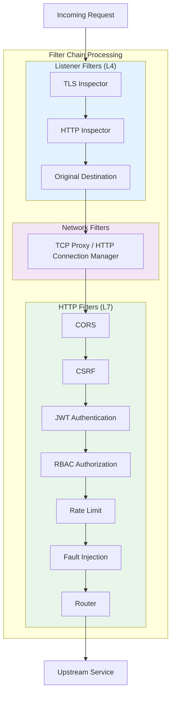
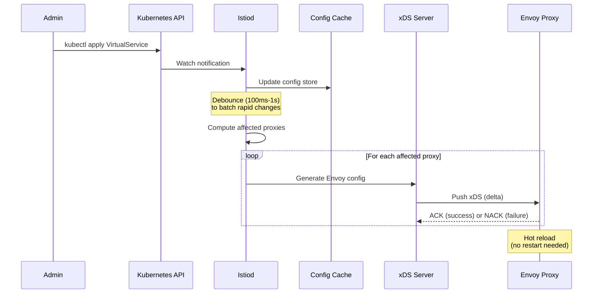

# Service Mesh Design - Deep Dive & Bottlenecks

[Back to Index](./00-index.md) | [Previous: Low-Level Design](./03-low-level-design.md) | [Next: Scalability](./05-scalability-and-reliability.md)

---

## Critical Component #1: Sidecar Proxy (Envoy)

### Why Critical?

The sidecar proxy sits on the data path for every request. Its performance, reliability, and resource consumption directly impact application behavior.

### Internal Architecture

```
ENVOY PROXY ARCHITECTURE:
═══════════════════════════════════════════════════════════════

┌─────────────────────────────────────────────────────────────┐
│                    ENVOY PROCESS                             │
├─────────────────────────────────────────────────────────────┤
│                                                              │
│  ┌─────────────────────────────────────────────────────┐   │
│  │                    MAIN THREAD                       │   │
│  │  • Configuration management                          │   │
│  │  • xDS client (control plane connection)            │   │
│  │  • Admin interface                                   │   │
│  │  • Hot restart coordination                          │   │
│  └─────────────────────────────────────────────────────┘   │
│                                                              │
│  ┌─────────────────────────────────────────────────────┐   │
│  │                   WORKER THREADS                     │   │
│  │  ┌──────────────┐ ┌──────────────┐ ┌──────────────┐ │   │
│  │  │   Worker 0   │ │   Worker 1   │ │   Worker N   │ │   │
│  │  │  ┌────────┐  │ │  ┌────────┐  │ │  ┌────────┐  │ │   │
│  │  │  │ Event  │  │ │  │ Event  │  │ │  │ Event  │  │ │   │
│  │  │  │ Loop   │  │ │  │ Loop   │  │ │  │ Loop   │  │ │   │
│  │  │  │(libevent)│ │ │  │(libevent)│ │ │  │(libevent)│ │   │
│  │  │  └────────┘  │ │  └────────┘  │ │  └────────┘  │ │   │
│  │  │  ┌────────┐  │ │  ┌────────┐  │ │  ┌────────┐  │ │   │
│  │  │  │Listener│  │ │  │Listener│  │ │  │Listener│  │ │   │
│  │  │  │Sockets │  │ │  │Sockets │  │ │  │Sockets │  │ │   │
│  │  │  └────────┘  │ │  └────────┘  │ │  └────────┘  │ │   │
│  │  └──────────────┘ └──────────────┘ └──────────────┘ │   │
│  └─────────────────────────────────────────────────────┘   │
│                                                              │
│  ┌─────────────────────────────────────────────────────┐   │
│  │              SHARED DATA STRUCTURES                  │   │
│  │  • Thread Local Storage (TLS) for per-worker state  │   │
│  │  • Read-Copy-Update (RCU) for config updates        │   │
│  │  • Lock-free connection pools                        │   │
│  └─────────────────────────────────────────────────────┘   │
│                                                              │
└─────────────────────────────────────────────────────────────┘

Worker threads: Default = number of CPU cores
Memory model: Thread-local where possible, shared read-only data
```

### Filter Chain Execution



### Hot Restart Mechanism

```
HOT RESTART PROCESS:
════════════════════════════════════════════════════════════════

Purpose: Update Envoy binary or config without dropping connections

Timeline:
─────────────────────────────────────────────────────────────────

T+0s    [Old Envoy] Running, handling traffic
        │
T+0s    [New Envoy] Starts, connects to old Envoy via Unix socket
        │
        │           ┌───────────────────────────────────┐
        │           │  Shared memory transfer:          │
        │           │  • Listener sockets (fd passing)  │
        │           │  • Statistics                     │
        │           │  • Hot restart epoch              │
        │           └───────────────────────────────────┘
        │
T+1s    [New Envoy] Takes over listener sockets
        [Old Envoy] Stops accepting new connections
        │
T+1s-   [Both] Process requests on existing connections
T+60s   [Old Envoy] Drains existing connections
        │
T+60s   [Old Envoy] Exits
        [New Envoy] Sole owner of all sockets

Key Points:
• Zero dropped connections during restart
• Uses Unix domain sockets for coordination
• Parent/child process relationship
• Configurable drain period (default 60s)
```

### Failure Modes

| Failure | Impact | Detection | Mitigation |
|---------|--------|-----------|------------|
| **Proxy crash** | Service unreachable | Kubernetes liveness probe | Pod restart, circuit breaker |
| **Memory exhaustion** | OOM kill, connection drops | Memory metrics, OOM events | Memory limits, connection limits |
| **CPU saturation** | Latency increase | CPU metrics, p99 latency | CPU limits, horizontal scaling |
| **Config rejection** | Proxy uses stale config | xDS NACK, error logs | Validation, gradual rollout |
| **TLS handshake failure** | Request failure | mTLS error metrics | Certificate debugging, permissive mode |

---

## Critical Component #2: Control Plane (Istiod)

### Why Critical?

The control plane generates and distributes configuration to all proxies. Its availability affects the mesh's ability to adapt to changes.

### Istiod Architecture

```
ISTIOD INTERNAL ARCHITECTURE:
═══════════════════════════════════════════════════════════════

┌─────────────────────────────────────────────────────────────┐
│                         ISTIOD                               │
├─────────────────────────────────────────────────────────────┤
│                                                              │
│  ┌───────────────────────────────────────────────────────┐ │
│  │                    CONFIG INGESTION                    │ │
│  │  ┌─────────────┐  ┌─────────────┐  ┌──────────────┐  │ │
│  │  │ Kubernetes  │  │   Consul    │  │    File      │  │ │
│  │  │   Watcher   │  │   Watcher   │  │   Watcher    │  │ │
│  │  └──────┬──────┘  └──────┬──────┘  └──────┬───────┘  │ │
│  │         └────────────────┼────────────────┘          │ │
│  │                          ▼                            │ │
│  │  ┌─────────────────────────────────────────────────┐ │ │
│  │  │              CONFIG STORE (in-memory)            │ │ │
│  │  │  • VirtualServices, DestinationRules, Gateways  │ │ │
│  │  │  • ServiceEntries, AuthorizationPolicies        │ │ │
│  │  └─────────────────────────────────────────────────┘ │ │
│  └───────────────────────────────────────────────────────┘ │
│                          │                                  │
│                          ▼                                  │
│  ┌───────────────────────────────────────────────────────┐ │
│  │                  CONFIG GENERATION                     │ │
│  │                                                        │ │
│  │  Config Store ──► Translation ──► Envoy Config        │ │
│  │                                                        │ │
│  │  Per proxy:                                            │ │
│  │  • Compute relevant services (scope)                  │ │
│  │  • Generate LDS (listeners)                           │ │
│  │  • Generate RDS (routes)                              │ │
│  │  • Generate CDS (clusters)                            │ │
│  │  • Generate EDS (endpoints)                           │ │
│  └───────────────────────────────────────────────────────┘ │
│                          │                                  │
│                          ▼                                  │
│  ┌───────────────────────────────────────────────────────┐ │
│  │                    XDS SERVER                          │ │
│  │                                                        │ │
│  │  ┌─────────────────────────────────────────────────┐  │ │
│  │  │              gRPC Stream Manager                 │  │ │
│  │  │  • Connection per proxy (~10K connections)      │  │ │
│  │  │  • Delta xDS (incremental updates)              │  │ │
│  │  │  • ACK/NACK handling                            │  │ │
│  │  └─────────────────────────────────────────────────┘  │ │
│  └───────────────────────────────────────────────────────┘ │
│                                                              │
│  ┌───────────────────────────────────────────────────────┐ │
│  │                 CERTIFICATE AUTHORITY                  │ │
│  │                                                        │ │
│  │  • CSR processing                                     │ │
│  │  • Certificate signing (short-lived, 24h default)     │ │
│  │  • SDS server for certificate distribution            │ │
│  │  • Root CA management                                 │ │
│  └───────────────────────────────────────────────────────┘ │
│                                                              │
└─────────────────────────────────────────────────────────────┘
```

### Configuration Push Flow



### Failure Modes

| Failure | Impact | Detection | Mitigation |
|---------|--------|-----------|------------|
| **Istiod crash** | No config updates | Kubernetes deployment | Multiple replicas, cached configs in proxies |
| **Slow config generation** | Delayed updates | Latency metrics | Horizontal scaling, discovery selectors |
| **etcd unavailable** | Cannot read K8s resources | K8s API errors | etcd HA, local cache |
| **xDS connection overload** | Proxies disconnect | Connection count metrics | More replicas, connection limits |
| **Config validation failure** | Bad config rejected | Admission webhook errors | Strict validation, staging env |

---

## Critical Component #3: mTLS Infrastructure

### Why Critical?

mTLS provides the security foundation for zero-trust. Certificate management failures can cause service outages or security vulnerabilities.

### Certificate Lifecycle

```
CERTIFICATE LIFECYCLE:
═══════════════════════════════════════════════════════════════

┌─────────────────────────────────────────────────────────────┐
│                  CERTIFICATE PROVISIONING                    │
├─────────────────────────────────────────────────────────────┤
│                                                              │
│  1. Pod Starts                                               │
│     │                                                        │
│     ▼                                                        │
│  2. Sidecar Injected (init container + envoy)               │
│     │                                                        │
│     ▼                                                        │
│  3. Envoy connects to Istiod via SDS                        │
│     │                                                        │
│     ▼                                                        │
│  4. Envoy generates key pair locally                        │
│     │                                                        │
│     ▼                                                        │
│  5. Envoy sends CSR to Istiod                               │
│     │                                                        │
│     │  CSR contains:                                         │
│     │  • Public key                                          │
│     │  • Requested SPIFFE ID                                 │
│     │  • Pod metadata (namespace, service account)          │
│     │                                                        │
│     ▼                                                        │
│  6. Istiod validates request                                 │
│     │                                                        │
│     │  Validation:                                           │
│     │  • Token verification (K8s SA token)                  │
│     │  • Pod exists and matches claims                      │
│     │  • Namespace/SA allowed to get identity               │
│     │                                                        │
│     ▼                                                        │
│  7. Istiod signs certificate                                 │
│     │                                                        │
│     │  Certificate:                                          │
│     │  • 24 hour validity (configurable)                    │
│     │  • SPIFFE ID in SAN                                    │
│     │  • Signed by mesh CA                                   │
│     │                                                        │
│     ▼                                                        │
│  8. Certificate delivered to Envoy via SDS                  │
│     │                                                        │
│     ▼                                                        │
│  9. Envoy ready for mTLS                                     │
│                                                              │
└─────────────────────────────────────────────────────────────┘

CERTIFICATE ROTATION:
═══════════════════════════════════════════════════════════════

Timeline (24h certificate):
──────────────────────────────────────────────────────────────
T+0h:   Certificate issued
T+12h:  Renewal window starts (50% lifetime)
T+12h:  Envoy requests new certificate
T+12h:  New certificate installed (hot swap)
T+24h:  Old certificate expires (already replaced)

Key Points:
• Rotation happens automatically
• No service disruption
• Grace period for clock skew
• Failed renewal → use existing cert until expiry
```

### SPIFFE Identity Model

```
SPIFFE IDENTITY:
═══════════════════════════════════════════════════════════════

Format: spiffe://<trust-domain>/<workload-path>

Examples:
─────────────────────────────────────────────────────────────
spiffe://cluster.local/ns/default/sa/frontend
         │               │  │       │  └─ Service Account
         │               │  │       └─ "sa" = service account
         │               │  └─ Namespace
         │               └─ "ns" = namespace
         └─ Trust Domain (mesh identifier)

Trust Boundaries:
─────────────────────────────────────────────────────────────

┌─────────────────────────────────────────────────────────┐
│                   Trust Domain: cluster.local            │
│                                                          │
│  ┌──────────────┐    ┌──────────────┐                  │
│  │  Namespace:  │    │  Namespace:  │                  │
│  │   default    │    │  production  │                  │
│  │              │    │              │                  │
│  │  SA:frontend │    │  SA:backend  │                  │
│  │  SA:backend  │    │  SA:database │                  │
│  └──────────────┘    └──────────────┘                  │
│                                                          │
│  All workloads in trust domain can verify each other    │
│  AuthorizationPolicy controls which can communicate     │
│                                                          │
└─────────────────────────────────────────────────────────┘
```

### Failure Modes

| Failure | Impact | Detection | Mitigation |
|---------|--------|-----------|------------|
| **CA unavailable** | New pods can't get certs | CSR timeout metrics | CA HA, longer cert validity |
| **Certificate expired** | mTLS handshake fails | Cert expiry metrics | Renewal automation, alerts |
| **Clock skew** | Cert appears invalid | notBefore/notAfter errors | NTP sync, clock skew tolerance |
| **Root CA rotation** | Trust chain broken | Validation failures | Gradual rotation with overlap |
| **Private key compromise** | Identity spoofing | (Detection difficult) | Short-lived certs, revocation |

---

## Concurrency & Race Conditions

### Configuration Propagation Race

```
PROBLEM: Config Not Yet Propagated
═══════════════════════════════════════════════════════════════

Scenario: Deploy new service version during traffic routing change

Timeline:
─────────────────────────────────────────────────────────────
T+0s:   Admin applies VirtualService (90% v1, 10% v2)
T+1s:   Istiod generates new config
T+2s:   Proxy A receives update
T+5s:   Proxy B receives update (delayed)
T+3-5s: Proxy B routes based on OLD config → inconsistent

                    ┌─────────────────────────────────┐
                    │         CONFIG STATE            │
                    ├─────────────────────────────────┤
                    │  Time    ProxyA    ProxyB       │
                    │  T+2s    v2(NEW)   v1(OLD)      │
                    │  T+3s    v2(NEW)   v1(OLD)  ←RACE│
                    │  T+5s    v2(NEW)   v2(NEW)      │
                    └─────────────────────────────────┘

Mitigations:
─────────────────────────────────────────────────────────────
1. Wait for config propagation before traffic shift
   • Use mesh observability to verify config version

2. Use gradual rollout
   • Start with 1%, verify, increase slowly

3. Feature flags at application level
   • Double-check version at application

4. Accept eventual consistency
   • Brief inconsistency often acceptable
```

### Circuit Breaker State Synchronization

```
PROBLEM: Distributed Circuit Breaker State
═══════════════════════════════════════════════════════════════

Challenge: Each sidecar maintains independent circuit breaker state

Scenario:
─────────────────────────────────────────────────────────────

                   Service B (failing)
                         ▲
            ┌────────────┼────────────┐
            │            │            │
         ProxyA       ProxyB       ProxyC
     (CB: OPEN)    (CB: CLOSED)  (CB: HALF_OPEN)
            │            │            │
         AppA         AppB         AppC

Problem: Different sidecars have different views
• ProxyA saw failures → OPEN
• ProxyB hasn't seen failures yet → CLOSED
• ProxyC is testing recovery → HALF_OPEN

Result: Inconsistent behavior across callers

Mitigations:
─────────────────────────────────────────────────────────────
1. This is actually acceptable behavior
   • Each caller gets independent protection
   • Cascading failure still prevented

2. For global circuit breaker, use external service
   • Centralized rate limiting service
   • Shared state in Redis/distributed cache

3. Outlier detection (Envoy) provides similar effect
   • Ejection decisions based on observed errors
   • Per-endpoint, not per-caller
```

### Endpoint Update Race

```
PROBLEM: Stale Endpoint Information
═══════════════════════════════════════════════════════════════

Scenario: Pod terminating but still receiving traffic

Timeline:
─────────────────────────────────────────────────────────────
T+0s:   Pod receives SIGTERM, starts graceful shutdown
T+0s:   Pod removed from K8s Endpoints
T+1s:   Istiod detects change
T+2s:   Istiod generates new EDS (without terminated pod)
T+3-5s: Proxies receive EDS update

Problem: T+0-5s proxies still route to terminating pod

                    ┌─────────────────────────────────┐
                    │         POD STATE               │
                    │                                  │
                    │  T+0s:  Running → Terminating   │
                    │  T+0s:  Removed from Endpoints  │
                    │  T+30s: Pod terminated          │
                    │                                  │
                    │  Proxies unaware until T+5s     │
                    └─────────────────────────────────┘

Mitigations:
─────────────────────────────────────────────────────────────
1. Graceful shutdown in application
   • Pod keeps serving during termination grace period
   • preStop hook adds delay before shutdown

2. Connection draining
   • Envoy drains connections when pod enters terminating
   • Allows in-flight requests to complete

3. Health check failure
   • Pod returns unhealthy during shutdown
   • Faster detection than endpoint removal

4. Retry on connection failure
   • Retry policy handles connection refused
```

---

## Bottleneck Analysis

### Bottleneck #1: Sidecar Resource Overhead

```
RESOURCE OVERHEAD ANALYSIS:
═══════════════════════════════════════════════════════════════

Per-Pod Costs (Istio with Envoy):
─────────────────────────────────────────────────────────────
Component          Memory          CPU (idle)    CPU (1K RPS)
─────────────────────────────────────────────────────────────
Envoy proxy        50-80 MB        10m           200m
Pilot-agent        10-20 MB        5m            10m
─────────────────────────────────────────────────────────────
Total per pod      60-100 MB       15m           210m

Cluster Impact (1000 pods):
─────────────────────────────────────────────────────────────
Memory:            60-100 GB (sidecars alone)
CPU (idle):        15 cores
CPU (1M RPS):      210 cores

Mitigation Strategies:
─────────────────────────────────────────────────────────────

1. Resource limits tuning
   • Profile actual usage, set appropriate limits
   • Avoid over-provisioning

2. Selective mesh enrollment
   • Not all services need mesh features
   • Use mesh only where needed

3. Sidecar-less alternatives
   • Cilium: Per-node instead of per-pod
   • Istio Ambient: Ztunnel per node (~90% memory reduction)

4. Proxy tuning
   • Reduce concurrency (--concurrency flag)
   • Disable unused features
   • Optimize connection pool sizes
```

### Bottleneck #2: Control Plane Scaling

```
CONTROL PLANE BOTTLENECKS:
═══════════════════════════════════════════════════════════════

Scaling Limits:
─────────────────────────────────────────────────────────────
Component          Limit Factor           Typical Limit
─────────────────────────────────────────────────────────────
xDS connections    Memory, CPU            ~5K per replica
Config generation  CPU, complexity        ~1K services
K8s watch          API server load        All namespaces
─────────────────────────────────────────────────────────────

Config Propagation Delay (Large Mesh):
─────────────────────────────────────────────────────────────
• Small mesh (100 pods):     1-5 seconds
• Medium mesh (1K pods):     5-15 seconds
• Large mesh (10K pods):     15-60 seconds

Mitigation Strategies:
─────────────────────────────────────────────────────────────

1. Horizontal scaling
   • Multiple Istiod replicas (3-5 typical)
   • Proxies distributed across replicas

2. Discovery selectors
   • Watch only relevant namespaces
   • Dramatically reduces watch load

   Example:
   meshConfig:
     discoverySelectors:
       - matchLabels:
           istio-discovery: enabled

3. Sidecar resource scoping
   • Configure which services each sidecar knows about
   • Reduces per-proxy config size

   Example:
   apiVersion: networking.istio.io/v1beta1
   kind: Sidecar
   spec:
     egress:
       - hosts:
           - "./*"           # Same namespace
           - "istio-system/*"

4. Delta xDS
   • Send only changes, not full config
   • Enabled by default in recent versions
```

### Bottleneck #3: mTLS Handshake Overhead

```
MTLS OVERHEAD ANALYSIS:
═══════════════════════════════════════════════════════════════

Handshake Cost:
─────────────────────────────────────────────────────────────
Full handshake:        2-5ms (ECDHE key exchange)
Session resumption:    0.5-1ms (cached session)
Connection reuse:      0ms (HTTP/2 multiplexing)

Impact by Connection Pattern:
─────────────────────────────────────────────────────────────
Pattern                Overhead        Mitigation
─────────────────────────────────────────────────────────────
Many short connections High (new HS)   Connection pooling
Long-lived (HTTP/2)    Low (amortized) Already optimal
High fan-out           Medium          Session resumption
─────────────────────────────────────────────────────────────

Mitigation Strategies:
─────────────────────────────────────────────────────────────

1. Connection pooling
   • Reuse connections aggressively
   • Configure maxRequestsPerConnection appropriately

2. HTTP/2 multiplexing
   • Single connection for many requests
   • Default for gRPC

3. Session resumption
   • TLS session tickets
   • Reduces handshake cost for new connections

4. Hardware acceleration
   • ECDSA hardware support in modern CPUs
   • AES-NI for encryption
```

---

## Performance Tuning Guidelines

| Parameter | Default | High-Throughput | Low-Latency |
|-----------|---------|-----------------|-------------|
| **Concurrency** | CPU cores | Same | Reduce if CPU-bound |
| **Connection pool (TCP)** | 1024 | 4096+ | 512 |
| **Connection pool (HTTP2)** | 1024 | 4096+ | Same |
| **Circuit breaker threshold** | 1024 | 4096+ | 256 |
| **Access log** | Enabled | Sampling | Disable |
| **Tracing sampling** | 1% | 0.1% | 1% |

---

**Next: [05 - Scalability & Reliability](./05-scalability-and-reliability.md)**
