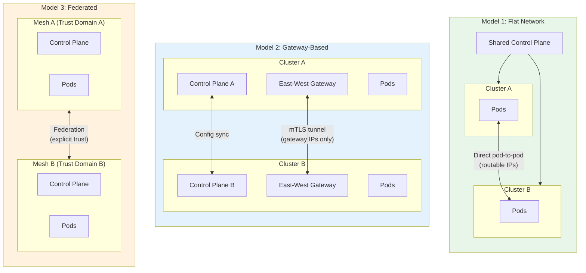

# Service Mesh Design - Scalability & Reliability

[Back to Index](./00-index.md) | [Previous: Deep Dive](./04-deep-dive-and-bottlenecks.md) | [Next: Security](./06-security-and-compliance.md)

---

## Scalability Strategies

### Horizontal Scaling: Control Plane

```
CONTROL PLANE SCALING:
═══════════════════════════════════════════════════════════════

Architecture: Multiple Istiod Replicas
─────────────────────────────────────────────────────────────

                    ┌─────────────────────────────────────┐
                    │         Kubernetes Service          │
                    │            (istiod)                 │
                    └─────────────────┬───────────────────┘
                                      │
                    ┌─────────────────┼─────────────────┐
                    │                 │                 │
               ┌────▼────┐      ┌────▼────┐      ┌────▼────┐
               │ Istiod  │      │ Istiod  │      │ Istiod  │
               │    0    │      │    1    │      │    2    │
               └────┬────┘      └────┬────┘      └────┬────┘
                    │                 │                 │
                    │    Shared configuration via       │
                    │    Kubernetes API (etcd)          │
                    │                 │                 │
               ┌────┼─────────────────┼─────────────────┼────┐
               │    │                 │                 │    │
             Proxy Proxy            Proxy            Proxy Proxy
               1     2                3                4     5

Key Points:
• Proxies connect to any Istiod replica (load balanced)
• All replicas serve identical configuration
• No state sharing needed between replicas
• Kubernetes etcd is source of truth

Scaling Guidelines:
─────────────────────────────────────────────────────────────
Cluster Size         Istiod Replicas    Resources per Replica
─────────────────────────────────────────────────────────────
< 500 pods           2                  2 CPU, 4GB RAM
500-2000 pods        3                  4 CPU, 8GB RAM
2000-10000 pods      5                  8 CPU, 16GB RAM
> 10000 pods         Multi-cluster      Scale horizontally
─────────────────────────────────────────────────────────────
```

### Horizontal Scaling: Data Plane

```
DATA PLANE SCALING:
═══════════════════════════════════════════════════════════════

Sidecar Model: Scales with Pods
─────────────────────────────────────────────────────────────
• Each pod gets its own sidecar
• Automatic scaling with application
• No central bottleneck for data path
• Linear resource growth with pod count

Per-Node Model (Ambient/Cilium):
─────────────────────────────────────────────────────────────
• Shared proxy per node
• Better resource efficiency
• Still scales with node count

                    ┌─────────────────────────────────────┐
                    │              NODE 1                  │
                    │  ┌─────────┐   ┌─────────────────┐  │
                    │  │  Ztunnel│   │ Pod A │ Pod B   │  │
                    │  │ (shared)│◄──│       │         │  │
                    │  └─────────┘   └─────────────────┘  │
                    └─────────────────────────────────────┘
                                      │
                              mTLS tunnel
                                      │
                    ┌─────────────────────────────────────┐
                    │              NODE 2                  │
                    │  ┌─────────┐   ┌─────────────────┐  │
                    │  │  Ztunnel│   │ Pod C │ Pod D   │  │
                    │  │ (shared)│◄──│       │         │  │
                    │  └─────────┘   └─────────────────┘  │
                    └─────────────────────────────────────┘

Benefit: 100 pods on 3 nodes = 3 proxies (not 100)
```

### Database/State Scaling

```
STATE MANAGEMENT:
═══════════════════════════════════════════════════════════════

The service mesh control plane is largely stateless.
State is stored in:

1. Kubernetes etcd (configuration)
   • VirtualServices, DestinationRules, etc.
   • Scales with Kubernetes cluster
   • Use etcd best practices for HA

2. In-memory (runtime)
   • xDS connection state in Istiod
   • Certificate cache
   • Lost on restart (rebuilt from K8s)

3. Short-lived certificates
   • Issued on-demand
   • Not persisted long-term

No Database Required:
─────────────────────────────────────────────────────────────
• Mesh config = Kubernetes resources
• Endpoints = Kubernetes service discovery
• Certificates = Generated on demand
• Metrics = External system (Prometheus)
• Traces = External system (Jaeger)

This simplifies operations significantly.
```

### Caching Strategy

```
CACHING IN SERVICE MESH:
═══════════════════════════════════════════════════════════════

Level 1: Sidecar Configuration Cache
─────────────────────────────────────────────────────────────
Location:   Envoy proxy memory
Contents:   xDS configuration (routes, clusters, endpoints)
TTL:        Until new config pushed or proxy restart
Size:       10-100 MB depending on mesh size

Benefit: Proxy operates independently if control plane unavailable

Level 2: Certificate Cache
─────────────────────────────────────────────────────────────
Location:   Envoy proxy memory (via SDS)
Contents:   mTLS certificates and private keys
TTL:        Certificate validity (default 24h)
Size:       < 1 MB

Benefit: Reduced CA load, faster connection setup

Level 3: Connection Pool
─────────────────────────────────────────────────────────────
Location:   Per sidecar
Contents:   TCP/HTTP connections to upstreams
TTL:        Configurable idle timeout
Size:       Connections × memory per conn

Benefit: Avoid connection setup overhead, mTLS amortization

Level 4: DNS Cache
─────────────────────────────────────────────────────────────
Location:   Envoy proxy
Contents:   DNS resolution results
TTL:        DNS TTL (respects upstream)
Size:       Minimal

Benefit: Reduced DNS query load

Cache Invalidation:
─────────────────────────────────────────────────────────────
• Config: Push from control plane (delta xDS)
• Certs: Automatic rotation before expiry
• Connections: Health check failure, outlier detection
• DNS: TTL expiry
```

---

## Multi-Cluster Mesh

### Federation Models



### Multi-Cluster Configuration

```
MULTI-CLUSTER SETUP (Gateway-Based):
═══════════════════════════════════════════════════════════════

Step 1: Establish Trust
─────────────────────────────────────────────────────────────
• Share root CA between clusters
• Or use common external CA (cert-manager, Vault)

Step 2: Deploy East-West Gateways
─────────────────────────────────────────────────────────────
• Gateway exposed via LoadBalancer
• Handles cross-cluster mTLS

Step 3: Configure Remote Clusters
─────────────────────────────────────────────────────────────
• Each cluster knows about remote endpoints
• ServiceEntry or automatic discovery

Step 4: Cross-Cluster Traffic Flow
─────────────────────────────────────────────────────────────

Request: ServiceA (Cluster1) → ServiceB (Cluster2)

  Cluster 1                          Cluster 2
  ┌────────────────┐                ┌────────────────┐
  │                │                │                │
  │  ServiceA      │                │   ServiceB     │
  │     │          │                │      ▲         │
  │     ▼          │                │      │         │
  │  Sidecar A     │                │   Sidecar B    │
  │     │          │                │      ▲         │
  │     ▼          │                │      │         │
  │  E-W Gateway   │────mTLS────────│  E-W Gateway   │
  │                │   tunnel       │                │
  └────────────────┘                └────────────────┘

Locality-Aware Load Balancing:
─────────────────────────────────────────────────────────────
• Prefer local cluster endpoints
• Failover to remote cluster if local unhealthy
• Configurable via DestinationRule localityLbSetting
```

---

## Fault Tolerance

### Control Plane Failure Handling

```
CONTROL PLANE FAILURE SCENARIOS:
═══════════════════════════════════════════════════════════════

Scenario 1: Single Istiod Replica Fails
─────────────────────────────────────────────────────────────
Impact:     Proxies reconnect to surviving replicas
Duration:   < 30 seconds (connection timeout + reconnect)
User Impact: None (proxies have cached config)

Scenario 2: All Istiod Replicas Fail
─────────────────────────────────────────────────────────────
Impact:     No config updates, no new certificates
Duration:   Until recovery
User Impact:
  • Existing traffic: Continues (cached config)
  • New pods: Cannot start (no certs)
  • Config changes: Not applied
  • Cert expiry: Services fail after 24h

Mitigation:
  • Multi-replica deployment (3+ replicas)
  • PodDisruptionBudget (minAvailable: 2)
  • Fast restart (< 60 seconds)
  • Long certificate validity for emergency (24h+)

Scenario 3: Kubernetes API Server Unavailable
─────────────────────────────────────────────────────────────
Impact:     Istiod cannot watch configuration changes
Duration:   Until K8s recovery
User Impact:
  • Existing traffic: Continues
  • New configurations: Not applied
  • Pod changes: Not reflected in EDS

Recovery Behavior:
─────────────────────────────────────────────────────────────

┌───────────────────────────────────────────────────────────┐
│                 PROXY RESILIENCE                          │
├───────────────────────────────────────────────────────────┤
│                                                           │
│  Control Plane Down:                                      │
│  ┌─────────────────────────────────────────────────────┐ │
│  │ Time     Proxy State        Traffic                 │ │
│  │ T+0      Uses cached config Works normally          │ │
│  │ T+1h     Uses cached config Works normally          │ │
│  │ T+12h    Cert renewal fails Works (cert valid 24h)  │ │
│  │ T+24h    Cert expires       mTLS failures start     │ │
│  └─────────────────────────────────────────────────────┘ │
│                                                           │
│  Key: Proxies are designed to operate independently      │
│                                                           │
└───────────────────────────────────────────────────────────┘
```

### Data Plane Failure Handling

```
SIDECAR FAILURE SCENARIOS:
═══════════════════════════════════════════════════════════════

Scenario 1: Sidecar Crash
─────────────────────────────────────────────────────────────
Detection:  Kubernetes liveness probe
Recovery:   Container restart (< 10 seconds)
User Impact:
  • Traffic to/from pod fails during restart
  • Other pods unaffected
  • Retry policies help callers

Scenario 2: Sidecar Resource Exhaustion
─────────────────────────────────────────────────────────────
Symptoms:   High latency, connection failures
Detection:  Memory/CPU metrics, connection timeouts
Recovery:   Pod restart or resource limit increase
Prevention: Proper resource limits, load testing

Scenario 3: Network Partition
─────────────────────────────────────────────────────────────
Impact:     Proxy cannot reach upstream services
Detection:  Connection failures, outlier detection
Handling:
  • Circuit breaker opens
  • Retries (if transient)
  • Failover to alternative endpoints
  • Return error after exhausting retries

RESILIENCE PATTERNS IN MESH:
═══════════════════════════════════════════════════════════════

┌─────────────────────────────────────────────────────────────┐
│                    RESILIENCE STACK                          │
├─────────────────────────────────────────────────────────────┤
│                                                              │
│  Request comes in                                            │
│         │                                                    │
│         ▼                                                    │
│  ┌─────────────────┐                                        │
│  │  Rate Limiting  │  Protect from overload                 │
│  └────────┬────────┘                                        │
│           │                                                  │
│           ▼                                                  │
│  ┌─────────────────┐                                        │
│  │ Circuit Breaker │  Fast fail if downstream sick          │
│  └────────┬────────┘                                        │
│           │                                                  │
│           ▼                                                  │
│  ┌─────────────────┐                                        │
│  │    Timeout      │  Don't wait forever                    │
│  └────────┬────────┘                                        │
│           │                                                  │
│           ▼                                                  │
│  ┌─────────────────┐                                        │
│  │     Retry       │  Handle transient failures             │
│  └────────┬────────┘                                        │
│           │                                                  │
│           ▼                                                  │
│  ┌─────────────────┐                                        │
│  │ Outlier Detect  │  Avoid unhealthy endpoints             │
│  └────────┬────────┘                                        │
│           │                                                  │
│           ▼                                                  │
│  ┌─────────────────┐                                        │
│  │ Load Balancing  │  Distribute load                       │
│  └─────────────────┘                                        │
│                                                              │
└─────────────────────────────────────────────────────────────┘
```

### Graceful Degradation

```
DEGRADATION STRATEGIES:
═══════════════════════════════════════════════════════════════

1. Feature Degradation
─────────────────────────────────────────────────────────────
If control plane unavailable:
  ✓ Traffic routing continues (cached)
  ✓ mTLS continues (until cert expiry)
  ✗ New config changes not applied
  ✗ New services not discovered

2. Security Degradation (Emergency Only)
─────────────────────────────────────────────────────────────
Permissive mTLS mode:
  • Accept both mTLS and plaintext
  • Use during migration or emergency
  • NOT recommended for production steady-state

3. Observability Degradation
─────────────────────────────────────────────────────────────
If observability backend overloaded:
  • Reduce trace sampling rate
  • Disable access logging
  • Keep core metrics only

4. Partial Mesh (Gradual Rollout)
─────────────────────────────────────────────────────────────
Not all services need full mesh:
  • Critical path: Full mesh features
  • Background jobs: Maybe skip mTLS
  • Development: Permissive mode OK
```

---

## Disaster Recovery

### RTO and RPO

| Component | RPO | RTO | Recovery Method |
|-----------|-----|-----|-----------------|
| **Control Plane Config** | 0 | 5 min | Kubernetes etcd backup/restore |
| **Certificates** | N/A | Regenerated | New certs issued on recovery |
| **Traffic Rules** | 0 | 5 min | Git-ops reapply |
| **Data Plane** | N/A | 30 sec | Pod restart with injection |

### Backup Strategy

```
BACKUP STRATEGY:
═══════════════════════════════════════════════════════════════

What to Backup:
─────────────────────────────────────────────────────────────
1. Kubernetes resources (CRDs)
   • VirtualServices
   • DestinationRules
   • Gateways
   • AuthorizationPolicies
   • PeerAuthentication

2. Root CA (if self-managed)
   • Private key (highly sensitive)
   • Certificate chain
   • Store in secure vault (HashiCorp Vault, cloud KMS)

3. Istiod configuration
   • IstioOperator resource
   • ConfigMaps
   • Secrets (if any custom)

What NOT to Backup:
─────────────────────────────────────────────────────────────
• Workload certificates (short-lived, regenerated)
• Endpoint data (derived from K8s)
• Metrics/traces (external systems)

Backup Method:
─────────────────────────────────────────────────────────────
# Export all Istio resources
kubectl get virtualservices,destinationrules,gateways,\
  authorizationpolicies,peerauthentications \
  --all-namespaces -o yaml > istio-backup.yaml

# Better: Use GitOps (ArgoCD, Flux)
# Configuration in Git = always recoverable
```

### Multi-Region Considerations

```
MULTI-REGION MESH:
═══════════════════════════════════════════════════════════════

Architecture Options:
─────────────────────────────────────────────────────────────

Option A: Single Global Mesh
┌─────────────────────────────────────────────────────────────┐
│  Pros:                          Cons:                       │
│  • Unified config               • Control plane latency     │
│  • Simple service discovery     • Single trust domain       │
│  • Consistent policies          • Large blast radius        │
└─────────────────────────────────────────────────────────────┘

Option B: Regional Meshes with Federation
┌─────────────────────────────────────────────────────────────┐
│  Pros:                          Cons:                       │
│  • Regional autonomy            • Config sync complexity    │
│  • Lower latency                • Multiple trust domains    │
│  • Fault isolation              • Cross-region routing      │
└─────────────────────────────────────────────────────────────┘

Recommended: Regional meshes for large deployments
─────────────────────────────────────────────────────────────

        Region A                    Region B
    ┌──────────────┐            ┌──────────────┐
    │   Mesh A     │            │   Mesh B     │
    │              │            │              │
    │  ┌────────┐  │  Gateway   │  ┌────────┐  │
    │  │Services│◄─┼────────────┼─►│Services│  │
    │  └────────┘  │            │  └────────┘  │
    │              │            │              │
    │  Control     │   Sync     │  Control     │
    │  Plane A     │◄──────────►│  Plane B     │
    └──────────────┘            └──────────────┘

Failover Strategy:
─────────────────────────────────────────────────────────────
1. DNS-based: Global load balancer routes to healthy region
2. Mesh-based: Locality-aware LB with failover priorities
3. Application-based: Client retry to alternate region
```

---

## Scaling Checklist

| Scale Point | Trigger | Action |
|-------------|---------|--------|
| **500 pods** | Config generation slow | Add Istiod replica |
| **1000 pods** | xDS latency > 5s | Discovery selectors |
| **2000 pods** | Memory pressure | Sidecar resource scoping |
| **5000 pods** | Control plane CPU > 80% | Multi-cluster or sidecar-less |
| **10000+ pods** | Architectural limit | Multi-cluster mandatory |

---

**Next: [06 - Security & Compliance](./06-security-and-compliance.md)**
