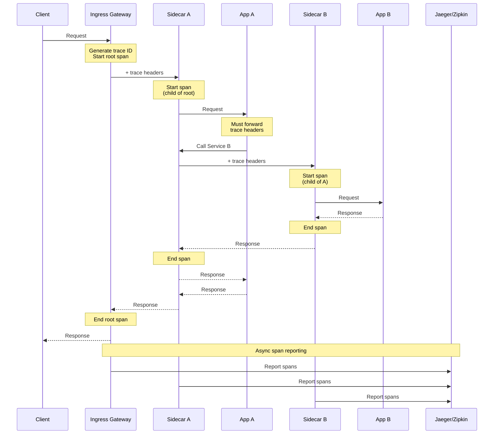

# Service Mesh Design - Observability

[Back to Index](./00-index.md) | [Previous: Security](./06-security-and-compliance.md) | [Next: Interview Guide](./08-interview-guide.md)

---

## Observability Overview

Service mesh provides "observability for free" - metrics, traces, and logs are automatically collected by sidecar proxies without application code changes.

```
THREE PILLARS OF OBSERVABILITY:
═══════════════════════════════════════════════════════════════

┌─────────────────────────────────────────────────────────────┐
│                    OBSERVABILITY                             │
├─────────────────┬─────────────────┬─────────────────────────┤
│     METRICS     │     TRACES      │         LOGS            │
├─────────────────┼─────────────────┼─────────────────────────┤
│ What: Numeric   │ What: Request   │ What: Discrete          │
│ measurements    │ flow across     │ events                  │
│                 │ services        │                         │
├─────────────────┼─────────────────┼─────────────────────────┤
│ When: Aggregate │ When: Sample    │ When: Every request     │
│ over time       │ (1-100%)        │ or event                │
├─────────────────┼─────────────────┼─────────────────────────┤
│ Why: Alerting,  │ Why: Debug      │ Why: Audit,             │
│ dashboards,     │ latency,        │ forensics,              │
│ capacity        │ dependencies    │ debugging               │
├─────────────────┼─────────────────┼─────────────────────────┤
│ Tools:          │ Tools:          │ Tools:                  │
│ Prometheus      │ Jaeger          │ Fluentd                 │
│ Grafana         │ Zipkin          │ ELK Stack               │
│ Datadog         │ Tempo           │ Loki                    │
└─────────────────┴─────────────────┴─────────────────────────┘
```

---

## Metrics

### Golden Signals (RED/USE)

```
GOLDEN SIGNALS FOR SERVICES:
═══════════════════════════════════════════════════════════════

RED Method (Request-focused):
─────────────────────────────────────────────────────────────
R - Rate:       Requests per second
E - Errors:     Failed requests per second
D - Duration:   Latency distribution (p50, p95, p99)

USE Method (Resource-focused):
─────────────────────────────────────────────────────────────
U - Utilization:  Percentage of resource capacity used
S - Saturation:   Queue depth, pending work
E - Errors:       Resource errors

Service Mesh Metrics (Automatically Collected):
─────────────────────────────────────────────────────────────

┌────────────────────────────────────────────────────────────┐
│  Metric Name                  │ Type      │ Description    │
├────────────────────────────────────────────────────────────┤
│  istio_requests_total         │ Counter   │ Total requests │
│  istio_request_duration_ms    │ Histogram │ Latency        │
│  istio_request_bytes          │ Histogram │ Request size   │
│  istio_response_bytes         │ Histogram │ Response size  │
│  istio_tcp_connections_opened │ Counter   │ TCP connections│
│  istio_tcp_connections_closed │ Counter   │ TCP closed     │
│  istio_tcp_sent_bytes         │ Counter   │ Bytes sent     │
│  istio_tcp_received_bytes     │ Counter   │ Bytes received │
└────────────────────────────────────────────────────────────┘

Labels (Dimensions):
─────────────────────────────────────────────────────────────
• source_workload, source_namespace, source_app
• destination_workload, destination_namespace, destination_app
• destination_service, destination_service_name
• request_protocol (HTTP, gRPC, TCP)
• response_code (200, 500, etc.)
• response_flags (timeout, circuit breaker, etc.)
• connection_security_policy (mutual_tls, none)
```

### Prometheus Integration

```
PROMETHEUS METRICS COLLECTION:
═══════════════════════════════════════════════════════════════

Architecture:
─────────────────────────────────────────────────────────────

  ┌──────────────┐     ┌──────────────┐     ┌──────────────┐
  │   Envoy      │     │   Envoy      │     │   Envoy      │
  │   Sidecar    │     │   Sidecar    │     │   Sidecar    │
  │   :15020     │     │   :15020     │     │   :15020     │
  └──────┬───────┘     └──────┬───────┘     └──────┬───────┘
         │                    │                    │
         │    Prometheus scrapes /stats/prometheus │
         │                    │                    │
         └────────────────────┼────────────────────┘
                              │
                              ▼
                    ┌─────────────────┐
                    │   Prometheus    │
                    │   Server        │
                    └────────┬────────┘
                             │
                             ▼
                    ┌─────────────────┐
                    │     Grafana     │
                    │   Dashboards    │
                    └─────────────────┘

Scrape Configuration:
─────────────────────────────────────────────────────────────

# Prometheus scrape config for Istio
scrape_configs:
  - job_name: 'envoy-stats'
    metrics_path: /stats/prometheus
    kubernetes_sd_configs:
      - role: pod
    relabel_configs:
      - source_labels: [__meta_kubernetes_pod_container_name]
        regex: istio-proxy
        action: keep
      - source_labels: [__address__, __meta_kubernetes_pod_annotation_prometheus_io_port]
        action: replace
        regex: ([^:]+)(?::\d+)?;(\d+)
        replacement: $1:$2
        target_label: __address__

Key Queries:
─────────────────────────────────────────────────────────────

# Request rate by service
sum(rate(istio_requests_total[5m])) by (destination_service)

# Error rate
sum(rate(istio_requests_total{response_code=~"5.."}[5m]))
/
sum(rate(istio_requests_total[5m]))

# P99 latency
histogram_quantile(0.99,
  sum(rate(istio_request_duration_milliseconds_bucket[5m]))
  by (destination_service, le)
)

# Success rate by service
sum(rate(istio_requests_total{response_code!~"5.."}[5m])) by (destination_service)
/
sum(rate(istio_requests_total[5m])) by (destination_service)
```

---

## Distributed Tracing

### Trace Propagation

```
DISTRIBUTED TRACING IN MESH:
═══════════════════════════════════════════════════════════════

How It Works:
─────────────────────────────────────────────────────────────

1. Envoy proxy automatically generates spans
2. Trace context propagated via headers
3. Application must forward headers for full traces
4. Spans sent to tracing backend

Trace Context Headers:
─────────────────────────────────────────────────────────────
• x-request-id           (unique request identifier)
• x-b3-traceid           (B3 format - trace ID)
• x-b3-spanid            (B3 format - span ID)
• x-b3-parentspanid      (B3 format - parent span)
• x-b3-sampled           (B3 format - sampling decision)
• traceparent            (W3C format - standard)
• tracestate             (W3C format - vendor state)

Span Structure:
─────────────────────────────────────────────────────────────

  Trace: abc123
  │
  ├── Span: Ingress Gateway (root)
  │   ├── service: istio-ingressgateway
  │   ├── duration: 150ms
  │   └── tags: {http.method: GET, http.url: /api/orders}
  │
  └── Span: api-server (child)
      ├── service: api-server
      ├── duration: 100ms
      ├── tags: {component: proxy}
      │
      └── Span: database-service (child)
          ├── service: database
          ├── duration: 50ms
          └── tags: {db.type: postgresql}

What Mesh Captures Automatically:
─────────────────────────────────────────────────────────────
✓ Request entry/exit at proxy
✓ Upstream connection time
✓ Request/response timing
✓ HTTP headers, status codes
✓ Service identity

What Application Must Do:
─────────────────────────────────────────────────────────────
! Forward trace headers in outbound requests
! (Otherwise traces break at application boundary)
```

### Tracing Architecture



### Sampling Strategies

```
TRACE SAMPLING:
═══════════════════════════════════════════════════════════════

Why Sample?
─────────────────────────────────────────────────────────────
• Full tracing = massive data volume
• Network/storage costs
• Performance overhead
• Most traces are "normal" (not interesting)

Sampling Strategies:
─────────────────────────────────────────────────────────────

1. Probabilistic (Random)
   • Sample X% of all traces
   • Simple, predictable volume
   • May miss rare events

   Config: SAMPLING_RATE=0.01 (1%)

2. Rate Limiting
   • Sample up to N traces/second
   • Consistent volume regardless of traffic
   • Better for cost control

   Config: MAX_TRACES_PER_SECOND=100

3. Adaptive/Dynamic
   • Adjust rate based on conditions
   • Higher rate during errors
   • Lower rate during normal operation

4. Head-based vs Tail-based
   • Head: Decide at trace start
   • Tail: Decide after trace complete
   • Tail allows sampling interesting traces

Recommended Settings:
─────────────────────────────────────────────────────────────
Environment     Sample Rate    Rationale
─────────────────────────────────────────────────────────────
Development     100%           Full visibility for debugging
Staging         10-50%         Thorough testing
Production      0.1-1%         Cost/performance balance
Production      100% (errors)  Always capture failures
─────────────────────────────────────────────────────────────
```

---

## Access Logging

### Log Configuration

```
ACCESS LOG CONFIGURATION:
═══════════════════════════════════════════════════════════════

Default Format (Envoy):
─────────────────────────────────────────────────────────────
[%START_TIME%] "%REQ(:METHOD)% %REQ(X-ENVOY-ORIGINAL-PATH?:PATH)%
%PROTOCOL%" %RESPONSE_CODE% %RESPONSE_FLAGS% %BYTES_RECEIVED%
%BYTES_SENT% %DURATION% "%REQ(X-FORWARDED-FOR)%"
"%REQ(USER-AGENT)%" "%REQ(X-REQUEST-ID)%" "%REQ(:AUTHORITY)%"
"%UPSTREAM_HOST%"

JSON Format (Recommended):
─────────────────────────────────────────────────────────────

apiVersion: networking.istio.io/v1alpha3
kind: EnvoyFilter
metadata:
  name: access-log-format
  namespace: istio-system
spec:
  configPatches:
    - applyTo: NETWORK_FILTER
      match:
        listener:
          filterChain:
            filter:
              name: envoy.filters.network.http_connection_manager
      patch:
        operation: MERGE
        value:
          typed_config:
            "@type": type.googleapis.com/envoy.extensions.filters.
                     network.http_connection_manager.v3.HttpConnectionManager
            access_log:
              - name: envoy.access_loggers.file
                typed_config:
                  "@type": type.googleapis.com/envoy.extensions.
                           access_loggers.file.v3.FileAccessLog
                  path: /dev/stdout
                  log_format:
                    json_format:
                      timestamp: "%START_TIME%"
                      method: "%REQ(:METHOD)%"
                      path: "%REQ(X-ENVOY-ORIGINAL-PATH?:PATH)%"
                      protocol: "%PROTOCOL%"
                      response_code: "%RESPONSE_CODE%"
                      response_flags: "%RESPONSE_FLAGS%"
                      bytes_received: "%BYTES_RECEIVED%"
                      bytes_sent: "%BYTES_SENT%"
                      duration: "%DURATION%"
                      upstream_host: "%UPSTREAM_HOST%"
                      source_principal: "%DOWNSTREAM_PEER_URI_SAN%"
                      destination_principal: "%UPSTREAM_PEER_URI_SAN%"
                      trace_id: "%REQ(X-B3-TRACEID)%"
                      request_id: "%REQ(X-REQUEST-ID)%"

Log Fields Explained:
─────────────────────────────────────────────────────────────
RESPONSE_FLAGS common values:
  - : No flag (normal)
  UH: No healthy upstream
  UF: Upstream connection failure
  UO: Upstream overflow (circuit breaker)
  NR: No route configured
  URX: Upstream retry limit exceeded
  DC: Downstream connection termination
  LR: Local reset
  UR: Upstream remote reset
```

### Log Aggregation

```
LOG AGGREGATION ARCHITECTURE:
═══════════════════════════════════════════════════════════════

┌─────────────────────────────────────────────────────────────┐
│                       CLUSTER                                │
│                                                              │
│  ┌──────────┐  ┌──────────┐  ┌──────────┐                  │
│  │  Pod     │  │  Pod     │  │  Pod     │                  │
│  │ ┌──────┐ │  │ ┌──────┐ │  │ ┌──────┐ │                  │
│  │ │Envoy │ │  │ │Envoy │ │  │ │Envoy │ │                  │
│  │ │logs  │ │  │ │logs  │ │  │ │logs  │ │                  │
│  │ └──┬───┘ │  │ └──┬───┘ │  │ └──┬───┘ │                  │
│  └────┼─────┘  └────┼─────┘  └────┼─────┘                  │
│       │             │             │                         │
│       └─────────────┼─────────────┘                         │
│                     │                                        │
│              ┌──────▼──────┐                                │
│              │   Fluentd   │  (DaemonSet on each node)      │
│              │   /Fluent   │                                │
│              │    Bit      │                                │
│              └──────┬──────┘                                │
│                     │                                        │
└─────────────────────┼────────────────────────────────────────┘
                      │
                      ▼
              ┌──────────────┐
              │   Kafka/     │  (Optional buffer)
              │   Kinesis    │
              └──────┬───────┘
                     │
         ┌───────────┼───────────┐
         │           │           │
         ▼           ▼           ▼
   ┌──────────┐ ┌──────────┐ ┌──────────┐
   │ Elastic  │ │   Loki   │ │   S3/    │
   │ Search   │ │          │ │  GCS     │
   └──────────┘ └──────────┘ └──────────┘
         │           │
         ▼           ▼
   ┌──────────┐ ┌──────────┐
   │  Kibana  │ │ Grafana  │
   └──────────┘ └──────────┘

Volume Estimation:
─────────────────────────────────────────────────────────────
Per request log: ~500 bytes (JSON)
1M requests/day: ~500 MB/day (uncompressed)
Compression: ~10x reduction
Retention 30 days: ~1.5 GB stored
```

---

## Visualization (Kiali)

```
KIALI SERVICE MESH VISUALIZATION:
═══════════════════════════════════════════════════════════════

Features:
─────────────────────────────────────────────────────────────
• Service graph visualization
• Real-time traffic animation
• Health indicators
• Configuration validation
• Istio config management

Service Graph View:
─────────────────────────────────────────────────────────────

        ┌─────────┐
        │ Ingress │
        │ Gateway │
        └────┬────┘
             │
             ▼
        ┌─────────┐      ┌──────────┐
        │frontend │─────►│ api-svc  │
        │  ●●●    │      │   ●●○    │
        └─────────┘      └────┬─────┘
                              │
                   ┌──────────┼──────────┐
                   │          │          │
                   ▼          ▼          ▼
             ┌─────────┐ ┌─────────┐ ┌─────────┐
             │ user-db │ │order-db │ │ cache   │
             │   ●●●   │ │   ●○○   │ │   ●●●   │
             └─────────┘ └─────────┘ └─────────┘

Legend: ●●● Healthy  ●●○ Degraded  ●○○ Unhealthy

Graph Features:
─────────────────────────────────────────────────────────────
• Traffic rate on edges
• Error rate highlighting
• mTLS lock indicators
• Response time badges
• Namespace filtering
• Version-based views
```

---

## Alerting

### Alert Definitions

```
ALERTING RULES:
═══════════════════════════════════════════════════════════════

Critical Alerts (Page Immediately):
─────────────────────────────────────────────────────────────

# High error rate
- alert: ServiceHighErrorRate
  expr: |
    sum(rate(istio_requests_total{response_code=~"5.."}[5m]))
    by (destination_service)
    /
    sum(rate(istio_requests_total[5m]))
    by (destination_service)
    > 0.05
  for: 2m
  labels:
    severity: critical
  annotations:
    summary: "High error rate on {{ $labels.destination_service }}"
    description: "Error rate is {{ $value | humanizePercentage }}"

# Service completely down
- alert: ServiceDown
  expr: |
    sum(rate(istio_requests_total[5m]))
    by (destination_service) == 0
    AND
    sum(up{job="envoy-stats"}) > 0
  for: 5m
  labels:
    severity: critical

Warning Alerts:
─────────────────────────────────────────────────────────────

# High latency
- alert: ServiceHighLatency
  expr: |
    histogram_quantile(0.99,
      sum(rate(istio_request_duration_milliseconds_bucket[5m]))
      by (destination_service, le)
    ) > 1000
  for: 5m
  labels:
    severity: warning
  annotations:
    summary: "P99 latency > 1s for {{ $labels.destination_service }}"

# Circuit breaker triggering
- alert: CircuitBreakerOpen
  expr: |
    sum(rate(istio_requests_total{response_flags="UO"}[5m]))
    by (destination_service) > 0
  for: 1m
  labels:
    severity: warning

Control Plane Alerts:
─────────────────────────────────────────────────────────────

# Istiod unavailable
- alert: IstiodDown
  expr: up{job="istiod"} == 0
  for: 1m
  labels:
    severity: critical

# Config sync delay
- alert: ConfigPropagationSlow
  expr: |
    pilot_proxy_convergence_time_bucket{le="30"} /
    pilot_proxy_convergence_time_bucket{le="+Inf"}
    < 0.9
  for: 5m
  labels:
    severity: warning

# Certificate expiry
- alert: CertificateExpiringSoon
  expr: |
    (certmanager_certificate_expiration_timestamp_seconds
    - time()) / 86400 < 7
  for: 1h
  labels:
    severity: warning
```

### Alert Routing

```
ALERT ROUTING STRATEGY:
═══════════════════════════════════════════════════════════════

Severity Mapping:
─────────────────────────────────────────────────────────────
Critical → PagerDuty → On-call engineer
Warning  → Slack #alerts → Team channel
Info     → Dashboard only → No notification

Route by Service:
─────────────────────────────────────────────────────────────
payment-service alerts → payments-oncall
user-service alerts    → platform-oncall
default                → infra-oncall

Alertmanager Config Example:
─────────────────────────────────────────────────────────────

route:
  group_by: ['alertname', 'destination_service']
  group_wait: 30s
  group_interval: 5m
  repeat_interval: 4h
  receiver: 'default'
  routes:
    - match:
        severity: critical
      receiver: 'pagerduty'
    - match:
        severity: warning
      receiver: 'slack-alerts'

receivers:
  - name: 'pagerduty'
    pagerduty_configs:
      - service_key: '<key>'
  - name: 'slack-alerts'
    slack_configs:
      - channel: '#alerts'
```

---

## Observability Best Practices

| Category | Practice | Rationale |
|----------|----------|-----------|
| **Metrics** | Use labels judiciously | High cardinality = cost |
| **Tracing** | Sample in production | Full tracing too expensive |
| **Logging** | JSON format | Machine parseable |
| **Alerting** | Alert on symptoms, not causes | Reduce noise |
| **Dashboards** | USE/RED per service | Consistent mental model |
| **Retention** | Metrics: 15d, Traces: 7d, Logs: 30d | Balance cost/utility |

---

**Next: [08 - Interview Guide](./08-interview-guide.md)**
