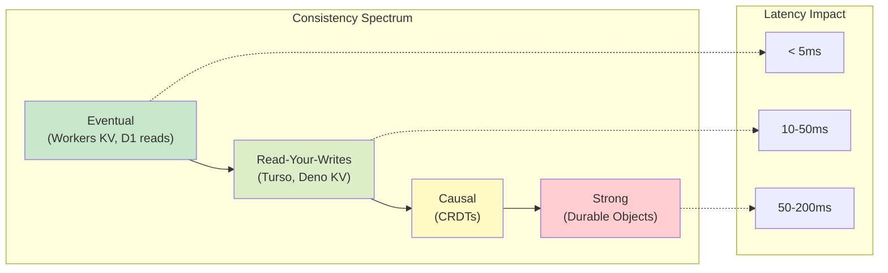
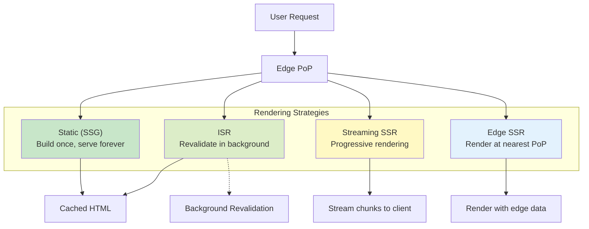
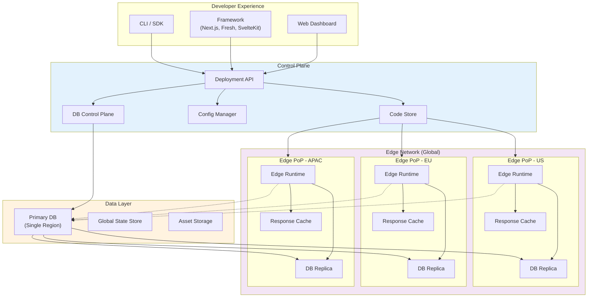

# Edge-Native Application Platform

[Back to System Design Index](../README.md)

---

## Overview

An **Edge-Native Application Platform** enables developers to build and deploy full-stack applications that execute at globally distributed edge locations with data that lives close to users. Unlike traditional edge computing (which focuses on running code at the edge), edge-native platforms provide the complete application stack: edge databases with global replication, state synchronization primitives, and rendering strategies optimized for low latency.

These platforms combine edge compute runtimes (V8 isolates, WASM) with edge-native databases (SQLite-based replicas, distributed KV stores) to deliver sub-50ms response times globally while supporting rich application patterns like streaming server-side rendering, incremental static regeneration, and real-time collaboration.

---

## Key Characteristics

| Characteristic | Value | Implication |
|----------------|-------|-------------|
| Traffic Pattern | Read-heavy (100:1 ratio), globally distributed | Edge-local reads, routed writes |
| Latency Target | p99 < 50ms for reads, < 200ms for writes | Data must be at the edge |
| Data Model | Key-value, relational (SQLite), document | Multiple storage primitives |
| Consistency | Eventual for reads, strong for coordination | Accept lag, read-your-writes |
| Replication | WAL-based, CRDT-based, or primary-replica | Trade-off: lag vs simplicity |
| Rendering | Streaming SSR, ISR, Edge Middleware | HTML generated at edge |
| Cold Start | < 5ms (isolates), near-zero (embedded DB) | No connection overhead |

---

## Quick Navigation

| Document | Purpose |
|----------|---------|
| [01 - Requirements & Estimations](./01-requirements-and-estimations.md) | Functional/non-functional requirements, capacity planning, SLOs |
| [02 - High-Level Design](./02-high-level-design.md) | Architecture diagrams, data flow, key decisions |
| [03 - Low-Level Design](./03-low-level-design.md) | Data models, API design, algorithms (pseudocode) |
| [04 - Deep Dive & Bottlenecks](./04-deep-dive-and-bottlenecks.md) | Edge DB replication, streaming SSR, state sync |
| [05 - Scalability & Reliability](./05-scalability-and-reliability.md) | Scaling strategies, fault tolerance, disaster recovery |
| [06 - Security & Compliance](./06-security-and-compliance.md) | Edge authentication, data residency, threat model |
| [07 - Observability](./07-observability.md) | Metrics, logging, tracing, alerting |
| [08 - Interview Guide](./08-interview-guide.md) | 45-min pacing, trap questions, trade-offs |

---

## Complexity Rating: High

| Aspect | Complexity | Reason |
|--------|------------|--------|
| Edge Database Replication | High | WAL sync, conflict resolution, read-your-writes |
| Global State Sync | High | CRDTs, eventual consistency, cross-region coordination |
| Streaming SSR | Medium | React streaming, Suspense boundaries, partial hydration |
| Framework Integration | Medium | Next.js, Fresh, SvelteKit edge adapters |
| Multi-Tenancy | High | Database-per-tenant, isolation, resource limits |
| Observability | Medium | Distributed tracing across 100+ edge locations |

---

## Relationship to Edge Computing Platform (2.8)

This design builds on [2.8 Edge Computing Platform](../2.8-edge-computing-platform/00-index.md):

| Layer | 2.8 Coverage | 2.12 Coverage |
|-------|--------------|---------------|
| **Infrastructure** | V8 isolates, Firecracker, WASM | Assumes edge runtime exists |
| **Routing** | Anycast DNS, PoP selection | Leverages existing routing |
| **Stateless Compute** | Edge functions, cold starts | Foundation for app logic |
| **State (KV)** | Workers KV, eventual consistency | Expanded: edge SQL, CRDTs |
| **State (Strong)** | Durable Objects | Extended: edge databases |
| **Application Layer** | Basic patterns | **Full coverage**: frameworks, SSR, ISR |
| **Developer Experience** | Deployment, CLI | **Full coverage**: full-stack DX |

---

## Edge Database Comparison

| Database | Type | Consistency | Replication | Best For |
|----------|------|-------------|-------------|----------|
| **Deno KV** | Distributed KV | Eventual (FoundationDB) | Global, automatic | Full-stack Deno apps |
| **Cloudflare D1** | SQLite replicas | Eventual (read), Strong (write) | Read replicas at edge | Relational data, multi-tenant |
| **Turso/libSQL** | Embedded SQLite | Eventual (WAL sync) | Embedded replicas | Database-per-user, offline-first |
| **Workers KV** | Distributed KV | Eventual (~60s) | Global, automatic | Config, sessions, cache |
| **Durable Objects** | Single-instance | Strong | N/A (single location) | Coordination, counters, locks |
| **Edge Config** | Read-only KV | Strong (versioned) | Instant global push | Feature flags, A/B tests |

---

## Real-World Platforms

| Platform | Edge Runtime | Edge Database | Key Features | Scale |
|----------|--------------|---------------|--------------|-------|
| **Deno Deploy** | V8 Isolates | Deno KV (FoundationDB) | TypeScript-first, sub-second deploys | 35+ regions |
| **Vercel Edge** | V8 Runtime | Edge Config, KV | Next.js integration, ISR, streaming | Global edge network |
| **Cloudflare Pages** | V8 Isolates | D1, KV, Durable Objects | Full-stack, Hyperdrive | 300+ PoPs |
| **Netlify Edge** | Deno Runtime | (External DBs) | Geolocation, A/B testing | Global edge |
| **Fly.io** | Firecracker | LiteFS (SQLite) | Full VM, persistent | 30+ regions |

---

## Rendering Strategy Comparison

| Strategy | When Rendered | Freshness | Latency | Best For |
|----------|---------------|-----------|---------|----------|
| **Static (SSG)** | Build time | Stale until rebuild | Fastest | Marketing pages, docs |
| **ISR** | Background revalidation | Semi-fresh (interval) | Fast | Product pages, blogs |
| **Streaming SSR** | Request time (streamed) | Fresh | Medium | Personalized dashboards |
| **Edge SSR** | Request time (at edge) | Fresh | Low | Geo-personalized content |
| **CSR** | Client-side | Fresh | Slow initial | Highly interactive apps |

---

## Architecture Overview

---

## Key Design Decisions Summary

| Decision | Options | Recommendation | Rationale |
|----------|---------|----------------|-----------|
| Edge DB Model | KV / SQLite / Document | SQLite (D1/Turso) | Rich queries, familiar SQL |
| Replication | WAL-based / CRDT / Primary-replica | WAL-based | Simpler, read-your-writes |
| Consistency | Eventual / Causal / Strong | Eventual + read-your-writes | Balance latency and correctness |
| Rendering | SSG / ISR / Streaming SSR | ISR + Streaming SSR | Fresh content, good latency |
| State Sync | Polling / WebSocket / CRDT | WebSocket + CRDT for collab | Real-time, conflict-free |
| Framework | Next.js / Fresh / SvelteKit | Framework-agnostic | Support multiple ecosystems |

---

## Interview Quick Reference

### Must-Know Concepts

1. **Edge Database**: SQLite or KV store replicated to edge locations for low-latency reads
2. **WAL Replication**: Write-Ahead Log frames synced from primary to replicas
3. **Read-Your-Writes**: Guarantee that writes are immediately visible to the writer
4. **ISR (Incremental Static Regeneration)**: Static pages revalidated in background
5. **Streaming SSR**: Server renders and streams HTML progressively to client
6. **CRDTs**: Conflict-free Replicated Data Types for eventual consistency without coordination

### Key Trade-offs

| Trade-off | Option A | Option B |
|-----------|----------|----------|
| Latency vs consistency | Eventual (fast reads) | Strong (correct reads) |
| Simplicity vs flexibility | Single-writer (no conflicts) | CRDTs (multi-writer) |
| Freshness vs cost | Streaming SSR (per-request) | ISR (cached, periodic) |
| Query power vs distribution | Edge SQL (rich) | KV (simple, faster) |

### Red Flags in Interviews

- Using traditional PostgreSQL without edge replication strategy
- Ignoring write amplification when replicating globally
- Assuming strong consistency is free at the edge
- Not considering replication lag in read-after-write scenarios
- Proposing client-side rendering for SEO-critical pages

---

## Related System Designs

- [2.8 - Edge Computing Platform](../2.8-edge-computing-platform/00-index.md) - Underlying edge infrastructure
- [1.15 - Content Delivery Network (CDN)](../1.15-content-delivery-network-cdn/00-index.md) - Static asset caching
- [2.7 - Feature Flag Management](../2.7-feature-flag-management/00-index.md) - Edge Config patterns
- [1.4 - Distributed LRU Cache](../1.4-distributed-lru-cache/00-index.md) - Caching fundamentals
- [2.9 - Multi-Region Active-Active](../2.9-multi-region-active-active/00-index.md) - Global consistency patterns

---

**Next: [01 - Requirements & Estimations](./01-requirements-and-estimations.md)**
