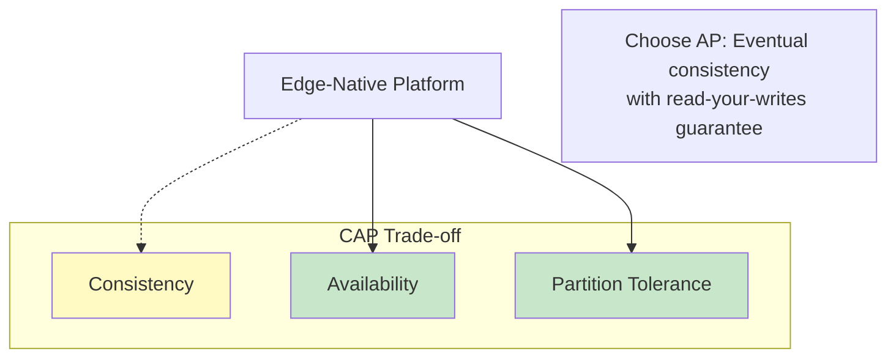

# Requirements & Estimations

[Back to Index](./00-index.md) | [Next: High-Level Design](./02-high-level-design.md)

---

## Functional Requirements

### Core Features (In Scope)

| Feature | Description | Priority |
|---------|-------------|----------|
| **Full-Stack Deployment** | Deploy frontend + backend + database as a single unit to global edge | P0 |
| **Edge Database** | Globally replicated database with edge-local reads | P0 |
| **Edge Middleware** | Request-level logic (auth, routing, personalization) at edge | P0 |
| **Streaming SSR** | Server-side render and stream HTML progressively | P0 |
| **ISR Support** | Incremental Static Regeneration with background revalidation | P0 |
| **Global State Sync** | Real-time state synchronization across regions | P1 |
| **Edge Config** | Low-latency feature flags and configuration | P1 |
| **Multi-Tenant Isolation** | Database-per-tenant with resource isolation | P1 |
| **Framework Adapters** | Support Next.js, Fresh, SvelteKit, Remix | P1 |
| **Real-Time Subscriptions** | WebSocket-based live queries | P2 |

### Explicit Non-Goals (Out of Scope)

| Feature | Reason |
|---------|--------|
| Heavy computation at edge | Edge has CPU/memory limits; use serverless for compute-heavy |
| OLAP / Analytics queries | Edge DBs optimized for OLTP; use data warehouse |
| Large file storage | Use blob storage / CDN for files > 1MB |
| Long-running processes | Edge functions have timeout limits (50ms-30s) |
| Full RDBMS features | No stored procedures, triggers, or complex joins at edge |

---

## Non-Functional Requirements

### CAP Theorem Position

**Justification**: Edge-native applications prioritize availability and partition tolerance. Network partitions between edge locations and primary database are common. We accept eventual consistency for reads with read-your-writes guarantee for the writing client.

### Consistency Model

| Data Type | Consistency | Rationale |
|-----------|-------------|-----------|
| **Read Replicas** | Eventual (1-60s lag) | Fast local reads, acceptable staleness |
| **Writer's View** | Read-your-writes | Writer sees their own writes immediately |
| **Coordination Data** | Strong (Durable Objects) | Counters, locks, rate limits need strong consistency |
| **Feature Flags** | Eventual with instant push | Edge Config pattern: push on change |
| **Session Data** | Eventual with sticky routing | Session affinity to single edge location |

### Availability Targets

| Component | Availability | Downtime/Year | Rationale |
|-----------|--------------|---------------|-----------|
| Edge Runtime | 99.99% | 52 minutes | Per-PoP, anycast failover |
| Edge DB Reads | 99.99% | 52 minutes | Local replicas, no network dependency |
| Edge DB Writes | 99.9% | 8.7 hours | Single primary, failover time |
| Global Platform | 99.999% | 5 minutes | Multi-PoP redundancy |
| Control Plane | 99.9% | 8.7 hours | Deployments can wait |

### Latency Targets

| Operation | p50 | p95 | p99 | Measurement Point |
|-----------|-----|-----|-----|-------------------|
| Edge Read (KV) | 2ms | 5ms | 10ms | Edge PoP to response |
| Edge Read (SQL) | 5ms | 15ms | 30ms | Edge PoP to response |
| Edge Write | 50ms | 100ms | 200ms | Edge to primary ACK |
| Streaming SSR (TTFB) | 20ms | 50ms | 100ms | First byte to client |
| ISR Revalidation | - | - | 5s | Background, async |
| Global DNS | 5ms | 10ms | 20ms | DNS resolution |

### Durability Guarantees

| Data Type | Durability | Recovery |
|-----------|------------|----------|
| Primary Database | 99.999999999% (11 nines) | Multi-AZ replication |
| Edge Replicas | Best effort | Rebuilt from primary |
| Session Data | 99.9% | Acceptable loss on PoP failure |
| Feature Flags | 99.99% | Instant re-push from source |

---

## Capacity Estimations

### Assumptions

| Parameter | Value | Source |
|-----------|-------|--------|
| Target Users | Global SaaS application | Typical use case |
| DAU | 10 million | Business requirement |
| MAU | 50 million | ~5:1 DAU:MAU ratio |
| Requests per user per day | 100 | Mix of page views + API calls |
| Read:Write ratio | 100:1 | Read-heavy application |
| Average read payload | 2 KB | JSON response |
| Average write payload | 1 KB | Form submission |
| Peak:Average ratio | 10:1 | Flash sales, viral events |

### Traffic Estimations

| Metric | Calculation | Result |
|--------|-------------|--------|
| **Daily Requests** | 10M DAU × 100 requests | 1 billion/day |
| **Average QPS** | 1B / 86,400 | ~11,500 QPS |
| **Peak QPS** | 11,500 × 10 | ~115,000 QPS |
| **Read QPS (avg)** | 11,500 × 100/101 | ~11,400 QPS |
| **Write QPS (avg)** | 11,500 × 1/101 | ~114 QPS |
| **Read QPS (peak)** | 115,000 × 100/101 | ~114,000 QPS |
| **Write QPS (peak)** | 115,000 × 1/101 | ~1,140 QPS |

### Storage Estimations

| Metric | Calculation | Result |
|--------|-------------|--------|
| **Daily Write Volume** | 114 QPS × 86,400s × 1KB | ~10 GB/day |
| **Monthly Write Volume** | 10 GB × 30 | ~300 GB/month |
| **Year 1 Storage** | 300 GB × 12 × 1.5 (indexes) | ~5.4 TB |
| **Year 5 Storage** | 5.4 TB × 5 × 1.2 (growth) | ~32 TB |
| **Edge Replica Size** | Hot data subset | ~500 GB per PoP |
| **Total Edge Storage** | 500 GB × 100 PoPs | ~50 TB globally |

### Bandwidth Estimations

| Metric | Calculation | Result |
|--------|-------------|--------|
| **Read Bandwidth (avg)** | 11,400 QPS × 2 KB | ~23 MB/s |
| **Read Bandwidth (peak)** | 114,000 QPS × 2 KB | ~230 MB/s |
| **Write Bandwidth (avg)** | 114 QPS × 1 KB | ~0.1 MB/s |
| **Daily Egress** | 23 MB/s × 86,400 | ~2 TB/day |
| **Monthly Egress** | 2 TB × 30 | ~60 TB/month |

### Database Sizing

| Metric | Value | Notes |
|--------|-------|-------|
| **Databases per tenant** | 1 | Database-per-tenant model |
| **Max tenants** | 100,000 | Multi-tenant SaaS |
| **Max DB size** | 10 GB | D1/Turso limit |
| **Total primary storage** | 100,000 × 10 GB (max) | ~1 PB theoretical max |
| **Typical DB size** | 100 MB | Most tenants are small |
| **Typical total storage** | 100,000 × 100 MB | ~10 TB actual |

### Edge Location Distribution

| Region | Traffic Share | Required PoPs | Per-PoP QPS (peak) |
|--------|---------------|---------------|-------------------|
| North America | 40% | 30 | ~1,500 |
| Europe | 30% | 25 | ~1,400 |
| Asia Pacific | 20% | 30 | ~770 |
| Rest of World | 10% | 15 | ~770 |
| **Total** | 100% | 100 | - |

---

## SLOs / SLAs

### Service Level Objectives

| Metric | Target | Measurement Window | Measurement Method |
|--------|--------|-------------------|-------------------|
| **Availability** | 99.99% | Monthly | (1 - error_requests / total_requests) × 100 |
| **Read Latency (p99)** | < 50ms | 5 minutes | Edge function duration |
| **Write Latency (p99)** | < 200ms | 5 minutes | Time to primary ACK |
| **Replication Lag (p99)** | < 60s | 5 minutes | Primary to replica delay |
| **Deployment Time** | < 60s | Per deployment | Code push to global availability |
| **Error Rate** | < 0.1% | 5 minutes | 5xx responses / total |

### Service Level Agreements (Customer-Facing)

| Tier | Availability | Read Latency | Support | Price Point |
|------|--------------|--------------|---------|-------------|
| **Free** | 99.9% | Best effort | Community | $0 |
| **Pro** | 99.95% | p99 < 100ms | Email | $20/month |
| **Business** | 99.99% | p99 < 50ms | Priority | $100/month |
| **Enterprise** | 99.99% + SLA credits | p99 < 30ms | Dedicated | Custom |

### SLA Credit Schedule

| Availability | Monthly Credit |
|--------------|----------------|
| < 99.99% but ≥ 99.9% | 10% |
| < 99.9% but ≥ 99.0% | 25% |
| < 99.0% | 50% |

---

## Resource Limits

### Per-Request Limits

| Resource | Limit | Rationale |
|----------|-------|-----------|
| CPU Time | 50ms (edge), 30s (serverless) | Fair sharing |
| Memory | 128 MB | Edge location constraints |
| Request Body | 1 MB | Prevents abuse |
| Response Body | 10 MB | CDN caching limits |
| Subrequests | 50 | Prevents cascading failures |

### Per-Database Limits

| Resource | Limit | Rationale |
|----------|-------|-----------|
| Database Size | 10 GB | D1/Turso model |
| Rows per Query | 100,000 | Memory protection |
| Query Time | 30s | Prevent long-running queries |
| Concurrent Connections | 1,000 | Connection pooling |
| Writes per Second | 100 | Primary capacity |

### Per-Account Limits

| Resource | Free | Pro | Enterprise |
|----------|------|-----|------------|
| Databases | 5 | 50 | Unlimited |
| Requests/month | 1M | 10M | Unlimited |
| Storage | 5 GB | 50 GB | 500 GB+ |
| Edge Locations | All | All | Dedicated |
| Custom Domains | 1 | 10 | Unlimited |

---

## Cost Model

### Operational Cost Breakdown (At Scale)

| Component | Monthly Cost | % of Total | Cost Driver |
|-----------|--------------|------------|-------------|
| Edge Compute | $50,000 | 30% | Request volume, CPU time |
| Edge Storage | $30,000 | 18% | Replica storage across PoPs |
| Primary Database | $20,000 | 12% | Write volume, storage |
| Bandwidth (Egress) | $40,000 | 24% | Response size × requests |
| Control Plane | $15,000 | 9% | API, deployment infra |
| Observability | $12,000 | 7% | Logs, metrics, traces |
| **Total** | $167,000 | 100% | - |

### Cost per Request

| Tier | Cost per 1M Requests | Notes |
|------|---------------------|-------|
| Edge Function | $0.50 | Includes compute + routing |
| Edge DB Read | $0.25 | Local replica read |
| Edge DB Write | $1.00 | Primary write + replication |
| Bandwidth | $0.10/GB | Egress to users |

---

## Interview Discussion Points

### Clarifying Questions to Ask

1. **Scale**: "How many users? What's the geographic distribution?"
2. **Read/Write Ratio**: "Is this read-heavy or write-heavy?"
3. **Consistency Needs**: "Can users tolerate slightly stale data?"
4. **Latency Requirements**: "What's the acceptable p99 latency?"
5. **Data Model**: "Is the data relational or key-value?"
6. **Real-Time Needs**: "Do users need live updates?"

### Back-of-Envelope Tips

- **1 DAU = ~100 requests/day** (typical web app)
- **1M DAU = ~1,000 QPS average** (1M × 100 / 86,400)
- **Peak = 10× average** (conservative)
- **Edge read = 5-10ms** (local)
- **Edge write = 50-200ms** (to primary)
- **10 GB database = 100M rows** (100 bytes/row average)

---

**Next: [02 - High-Level Design](./02-high-level-design.md)**
