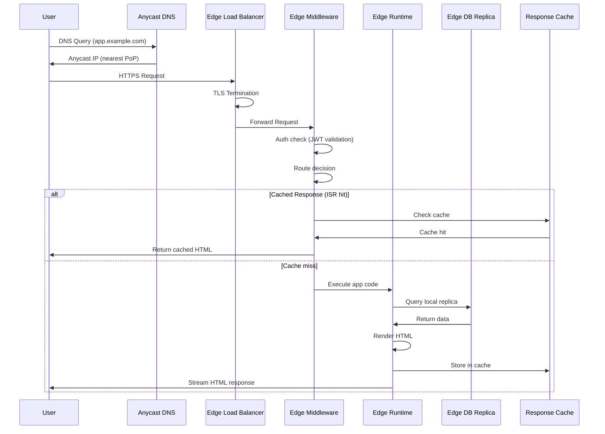
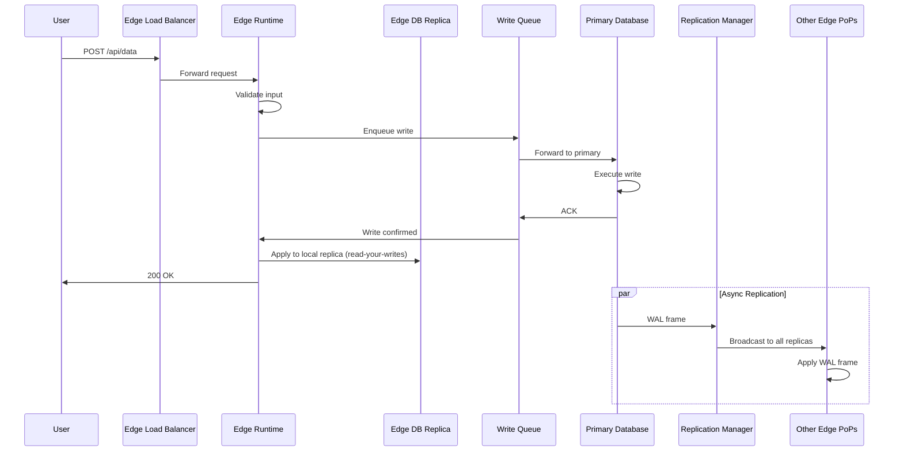
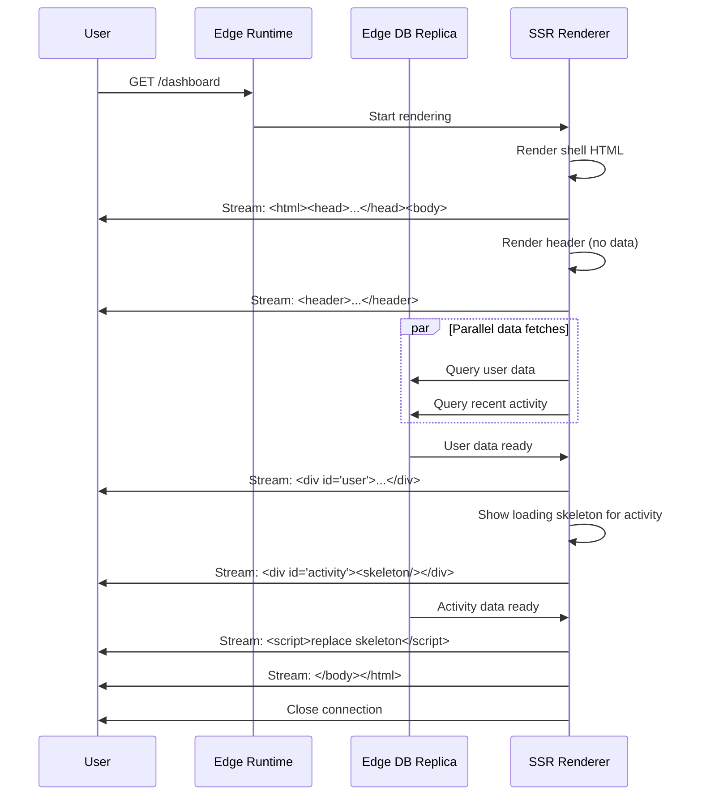
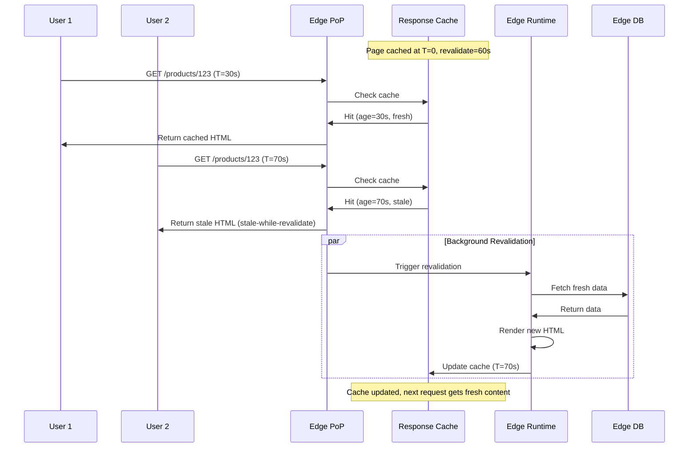
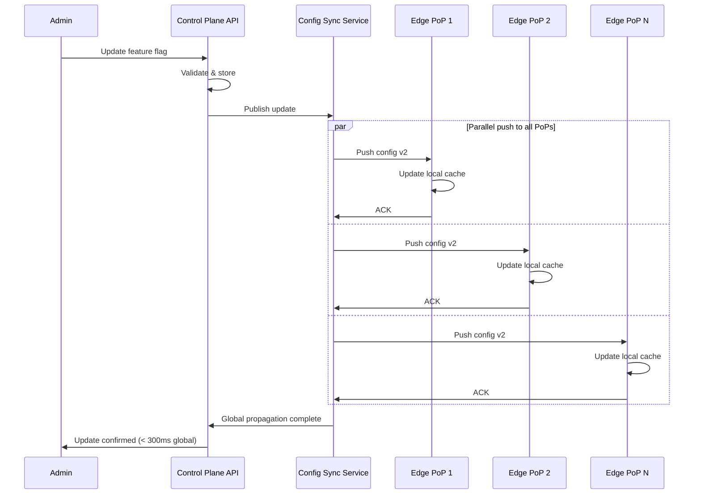

# High-Level Design

[Back to Index](./00-index.md) | [Previous: Requirements](./01-requirements-and-estimations.md) | [Next: Low-Level Design](./03-low-level-design.md)

---

## System Architecture

The edge-native application platform follows a **three-tier architecture**: Control Plane (centralized), Edge Network (globally distributed), and Data Layer (primary + replicas).

```mermaid
flowchart TB
    subgraph Developers["Developer Experience"]
        CLI["CLI / SDK"]
        Framework["Framework Adapter<br/>(Next.js, Fresh, SvelteKit)"]
        Dashboard["Web Dashboard"]
        CICD["CI/CD Integration"]
    end

    subgraph ControlPlane["Control Plane (Multi-Region)"]
        direction TB
        DeployAPI["Deployment API"]
        AuthService["Auth Service"]

        subgraph Storage["Central Storage"]
            CodeStore["Code Artifact Store"]
            ConfigDB["Configuration DB"]
            MetricsDB["Metrics Aggregation"]
        end

        subgraph Orchestration["Orchestration"]
            Deployer["Global Deployer"]
            DBController["DB Controller"]
            ConfigSync["Config Sync Service"]
        end
    end

    subgraph EdgeNetwork["Edge Network (100+ PoPs)"]
        subgraph PoP1["Edge PoP - North America"]
            LB1["Load Balancer"]
            Runtime1["Edge Runtime<br/>(V8 Isolates)"]
            Middleware1["Edge Middleware"]
            EdgeDB1["Edge DB Replica"]
            Cache1["Response Cache"]
            EdgeConfig1["Edge Config Cache"]
        end

        subgraph PoP2["Edge PoP - Europe"]
            LB2["Load Balancer"]
            Runtime2["Edge Runtime"]
            Middleware2["Edge Middleware"]
            EdgeDB2["Edge DB Replica"]
            Cache2["Response Cache"]
            EdgeConfig2["Edge Config Cache"]
        end

        subgraph PoP3["Edge PoP - Asia Pacific"]
            LB3["Load Balancer"]
            Runtime3["Edge Runtime"]
            Middleware3["Edge Middleware"]
            EdgeDB3["Edge DB Replica"]
            Cache3["Response Cache"]
            EdgeConfig3["Edge Config Cache"]
        end
    end

    subgraph DataLayer["Data Layer"]
        subgraph Primary["Primary Region"]
            PrimaryDB["Primary Database<br/>(SQLite/FoundationDB)"]
            WriteQueue["Write Queue"]
            ReplicationMgr["Replication Manager"]
        end

        subgraph GlobalState["Global State"]
            KVStore["Global KV Store"]
            DurableObj["Durable Objects<br/>(Strong Consistency)"]
        end

        BlobStore["Blob Storage<br/>(Assets, Uploads)"]
    end

    subgraph Users["Global Users"]
        U1["Users (NA)"]
        U2["Users (EU)"]
        U3["Users (APAC)"]
    end

    %% Developer flows
    CLI --> DeployAPI
    Framework --> DeployAPI
    Dashboard --> DeployAPI
    CICD --> DeployAPI

    DeployAPI --> AuthService
    DeployAPI --> CodeStore
    DeployAPI --> ConfigDB

    Deployer --> CodeStore
    Deployer --> PoP1
    Deployer --> PoP2
    Deployer --> PoP3

    DBController --> PrimaryDB
    ConfigSync --> EdgeConfig1
    ConfigSync --> EdgeConfig2
    ConfigSync --> EdgeConfig3

    %% User request flows
    U1 --> LB1
    U2 --> LB2
    U3 --> LB3

    LB1 --> Middleware1 --> Runtime1
    LB2 --> Middleware2 --> Runtime2
    LB3 --> Middleware3 --> Runtime3

    Runtime1 --> EdgeDB1
    Runtime2 --> EdgeDB2
    Runtime3 --> EdgeDB3

    Runtime1 --> Cache1
    Runtime2 --> Cache2
    Runtime3 --> Cache3

    %% Data flows
    EdgeDB1 -.->|Writes| WriteQueue
    EdgeDB2 -.->|Writes| WriteQueue
    EdgeDB3 -.->|Writes| WriteQueue

    WriteQueue --> PrimaryDB

    ReplicationMgr --> EdgeDB1
    ReplicationMgr --> EdgeDB2
    ReplicationMgr --> EdgeDB3

    Runtime1 -.-> DurableObj
    Runtime2 -.-> DurableObj
    Runtime3 -.-> DurableObj

    Runtime1 -.-> KVStore
    Runtime2 -.-> KVStore
    Runtime3 -.-> KVStore

    PoP1 --> MetricsDB
    PoP2 --> MetricsDB
    PoP3 --> MetricsDB

    style ControlPlane fill:#e3f2fd
    style EdgeNetwork fill:#f3e5f5
    style DataLayer fill:#fff3e0
    style Users fill:#e8f5e9
```

---

## Core Components

### Control Plane

| Component | Responsibility | Technology Pattern |
|-----------|---------------|-------------------|
| **Deployment API** | Accept code uploads, manage deployments | REST/gRPC API |
| **Auth Service** | API key validation, team management | OAuth2/OIDC |
| **Code Artifact Store** | Store versioned application bundles | Object Storage |
| **Configuration DB** | Routes, env vars, database bindings | Distributed SQL |
| **Global Deployer** | Orchestrate code push to all PoPs | Event-driven pipeline |
| **DB Controller** | Manage database lifecycle, migrations | Control loop |
| **Config Sync Service** | Push config changes to edge | Pub/Sub |
| **Metrics Aggregation** | Collect and aggregate edge metrics | Time-series DB |

### Edge Network (Per PoP)

| Component | Responsibility | Technology Pattern |
|-----------|---------------|-------------------|
| **Load Balancer** | TLS termination, request routing | L7 proxy |
| **Edge Middleware** | Auth, routing, personalization before app | V8 isolate |
| **Edge Runtime** | Execute application code | V8 isolates / WASM |
| **Edge DB Replica** | Local read replica of primary database | SQLite / KV |
| **Response Cache** | Cache rendered pages (ISR, static) | In-memory + SSD |
| **Edge Config Cache** | Local cache of feature flags | In-memory |

### Data Layer

| Component | Responsibility | Technology Pattern |
|-----------|---------------|-------------------|
| **Primary Database** | Single source of truth for writes | SQLite (via SRS) / FoundationDB |
| **Write Queue** | Buffer writes from edge before primary | Message Queue |
| **Replication Manager** | WAL streaming to edge replicas | Change Data Capture |
| **Global KV Store** | Eventually consistent key-value | Distributed KV |
| **Durable Objects** | Strongly consistent coordination | Single-instance per ID |
| **Blob Storage** | Large files, user uploads | Object Storage |

---

## Data Flow Diagrams

### Read Path (Edge-Local)

### Write Path (Routed to Primary)

### Streaming SSR Flow

### ISR Revalidation Flow

### Edge Config Update Flow

---

## Key Architectural Decisions

### Decision 1: Edge Database Strategy

| Option | Pros | Cons | Verdict |
|--------|------|------|---------|
| **Distributed KV (Deno KV)** | Simple API, automatic replication | No SQL, limited queries | For simple data |
| **SQLite Replicas (D1/Turso)** | Full SQL, familiar, rich queries | Replication complexity | **Default choice** |
| **Embedded Replicas (Turso)** | Zero network latency for reads | Not for serverless | For VPS/containers |
| **External DB + Hyperdrive** | Use existing PostgreSQL | Still has network hop | For migrations |

**Recommendation**: SQLite-based replicas (D1 or Turso model) for most applications. Use KV for sessions/cache, Durable Objects for coordination.

### Decision 2: Consistency Model

| Option | Latency | Correctness | Complexity | Verdict |
|--------|---------|-------------|------------|---------|
| **Strong (all writes)** | High (~200ms) | Perfect | Low | Overkill for most |
| **Eventual (all reads)** | Low (~5ms) | Stale possible | Low | Too weak |
| **Read-your-writes** | Low for reads | Writer sees own writes | Medium | **Recommended** |
| **Causal (CRDTs)** | Low | Causal ordering | High | For collaboration |

**Recommendation**: Read-your-writes as the default. Use strong consistency only for coordination (via Durable Objects).

### Decision 3: Rendering Strategy

| Option | Freshness | Latency | Cost | Best For |
|--------|-----------|---------|------|----------|
| **Static (SSG)** | Stale | Fastest | Lowest | Docs, marketing |
| **ISR** | Semi-fresh | Fast | Low | Product pages, blogs |
| **Streaming SSR** | Fresh | Medium | Medium | Dashboards |
| **Edge SSR** | Fresh | Low | Higher | Geo-personalized |

**Recommendation**: ISR as default for content pages. Streaming SSR for personalized/dynamic pages. Static for truly static content.

### Decision 4: Write Handling at Edge

| Option | Latency | Consistency | Complexity | Verdict |
|--------|---------|-------------|------------|---------|
| **Direct to primary** | Higher | Strong | Low | Simple, but slow |
| **Queue + async** | Lower perceived | Eventual | Medium | Risk of loss |
| **Queue + sync ACK** | Medium | Read-your-writes | Medium | **Recommended** |
| **Multi-master + CRDT** | Lowest | Eventual | High | For collaboration |

**Recommendation**: Queue writes at edge, wait for primary ACK, then update local replica immediately for read-your-writes.

### Decision 5: Framework Integration

| Framework | Edge Support | SSR Model | Best For |
|-----------|--------------|-----------|----------|
| **Next.js** | Edge Middleware, Edge Functions | Streaming SSR, ISR | React apps |
| **Fresh** | Native Deno | Islands architecture | Deno-first |
| **SvelteKit** | Adapter-based | Streaming | Svelte apps |
| **Remix** | Edge deployment | Streaming | React + data |
| **Astro** | Hybrid | Islands | Content sites |

**Recommendation**: Framework-agnostic platform with first-class adapters for each framework.

---

## Architecture Pattern Checklist

| Pattern | Decision | Rationale |
|---------|----------|-----------|
| Sync vs Async | **Sync** for reads, **Async** for writes | Read latency critical, writes can queue |
| Event-driven vs Request-response | **Request-response** for API, **Event-driven** for replication | User-facing is synchronous |
| Push vs Pull (data) | **Push** for replication, **Pull** for queries | Minimize lag, standard query model |
| Stateless vs Stateful | **Stateless** edge functions, **Stateful** Durable Objects | Scale edge easily, coordinate centrally |
| Read vs Write optimization | **Read-optimized** (local replicas) | 100:1 read:write ratio |
| Real-time vs Batch | **Real-time** for requests, **Batch** for analytics | User experience vs efficiency |
| Edge vs Origin | **Edge-first** with origin fallback | Minimize latency |

---

## Failure Modes & Mitigations

| Failure Mode | Impact | Detection | Mitigation |
|--------------|--------|-----------|------------|
| Edge PoP outage | Traffic to that PoP fails | Health checks, BGP | Anycast routes to next PoP |
| Edge DB replica lag | Stale reads | Lag monitoring | Accept eventual, read-your-writes |
| Primary DB failure | Writes fail | Health checks | Automatic failover to standby |
| Write queue full | Write backpressure | Queue depth metrics | Shed load, return 503 |
| Replication failure | Replicas diverge | Checksum verification | Rebuild replica from primary |
| Config sync failure | Stale feature flags | Version tracking | Fall back to cached config |
| Framework render error | 500 errors | Error rate monitoring | Graceful degradation, error boundary |

---

## Graceful Degradation Levels

| Level | Trigger | Behavior |
|-------|---------|----------|
| **Level 0 (Normal)** | All systems healthy | Full functionality |
| **Level 1 (Replica Lag)** | Replication > 60s behind | Warn users about stale data |
| **Level 2 (Primary Slow)** | Write latency > 500ms | Queue writes, return optimistic response |
| **Level 3 (Primary Down)** | Primary unreachable | Read-only mode, reject writes |
| **Level 4 (Edge Degraded)** | Multiple PoPs down | Route to remaining PoPs, higher latency |
| **Level 5 (Control Plane Down)** | Control plane unreachable | Existing deployments work, no changes |

---

## Technology Stack Summary

| Layer | Technology | Rationale |
|-------|------------|-----------|
| **Edge Runtime** | V8 Isolates, WASM | Sub-5ms cold start |
| **Edge Database** | SQLite (D1/Turso model) | Rich queries, familiar SQL |
| **Edge KV** | Distributed KV | Sessions, cache |
| **Primary Database** | SQLite via SRS / FoundationDB | Durability, transactions |
| **Replication** | WAL-based streaming | Efficient, incremental |
| **Strong Consistency** | Durable Objects pattern | Single-instance coordination |
| **Response Cache** | In-memory + SSD | ISR, static caching |
| **Config Store** | Push-based Edge Config | Instant updates |
| **Load Balancer** | L7 proxy with TLS | Routing, termination |
| **DNS** | Anycast | Automatic geo-routing |
| **Metrics** | Time-series DB | High-cardinality |
| **Logs** | Streaming pipeline | Real-time aggregation |

---

## Interview Tips: High-Level Design Phase

### Key Points to Cover

1. **Three-tier separation**: Control plane / Edge network / Data layer
2. **Edge database strategy**: Local replicas for reads, routed writes
3. **Consistency model**: Eventual + read-your-writes as default
4. **Rendering strategy**: ISR for content, streaming SSR for dynamic
5. **Replication mechanism**: WAL-based for efficiency

### Common Follow-up Questions

- "How do you handle writes at the edge?" → Queue to primary, wait for ACK, update local replica
- "What if the primary is slow?" → Optimistic response, async replication, read-your-writes
- "How do you ensure consistency?" → Single-writer primary, read-your-writes guarantee
- "Why not just use a global PostgreSQL?" → Connection overhead, cold starts, latency for reads

### Diagram Tips

- Start with users → edge → data layer (top to bottom)
- Show read path (local) vs write path (routed) clearly
- Highlight replication arrows as dashed (async)
- Separate control plane from data plane

---

**Next: [03 - Low-Level Design](./03-low-level-design.md)**
