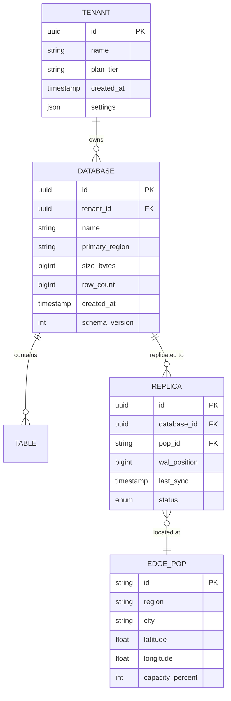
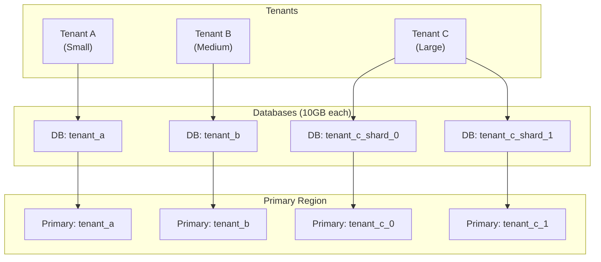

# Low-Level Design

[Back to Index](./00-index.md) | [Previous: High-Level Design](./02-high-level-design.md) | [Next: Deep Dive & Bottlenecks](./04-deep-dive-and-bottlenecks.md)

---

## Data Models

### Edge Database Schema (SQLite-based)



### Edge KV Schema

```
Key Structure: /{tenant_id}/{namespace}/{key}

Value Structure:
{
    "value": <binary | json | string>,
    "version": <uint64>,           // Logical clock
    "ttl": <timestamp | null>,     // Expiration time
    "metadata": {
        "content_type": "application/json",
        "created_at": <timestamp>,
        "updated_at": <timestamp>,
        "writer_pop": "us-east-1"
    }
}

Indexes:
- Primary: (tenant_id, namespace, key)
- Secondary: (tenant_id, namespace, ttl) for expiration scan
- Secondary: (tenant_id, updated_at) for sync tracking
```

### Session Storage Schema

```
Key: /sessions/{session_id}

Value:
{
    "user_id": "user_123",
    "created_at": "2025-01-15T10:30:00Z",
    "expires_at": "2025-01-15T22:30:00Z",
    "data": {
        "cart_id": "cart_456",
        "preferences": {...}
    },
    "metadata": {
        "ip_hash": "abc123",
        "user_agent_hash": "def456",
        "geo": {
            "country": "US",
            "region": "CA"
        }
    }
}

TTL: 12 hours (configurable)
Consistency: Eventual with sticky routing
```

### Feature Flag / Edge Config Schema

```
Key: /config/{tenant_id}/{flag_name}

Value:
{
    "key": "new_checkout_flow",
    "enabled": true,
    "version": 42,
    "rules": [
        {
            "condition": {
                "type": "percentage",
                "value": 10
            },
            "variant": "treatment"
        },
        {
            "condition": {
                "type": "user_segment",
                "segment": "beta_users"
            },
            "variant": "treatment"
        }
    ],
    "default_variant": "control",
    "updated_at": "2025-01-15T10:30:00Z"
}

Propagation: Push on change (< 300ms global)
```

### ISR Cache Entry Schema

```
Key: /cache/{tenant_id}/{route_hash}

Value:
{
    "html": "<html>...</html>",
    "headers": {
        "content-type": "text/html",
        "cache-control": "s-maxage=60, stale-while-revalidate=86400"
    },
    "generated_at": "2025-01-15T10:30:00Z",
    "revalidate_after": "2025-01-15T10:31:00Z",
    "data_hash": "sha256:abc123",
    "route": "/products/123",
    "params": {"id": "123"}
}

States:
- FRESH: generated_at + revalidate <= now
- STALE: generated_at + revalidate < now (serve while revalidating)
- EXPIRED: generated_at + max_age < now (must regenerate)
```

---

## API Design

### Database API (HTTP)

#### Execute Query

```
POST /v1/databases/{database_id}/query
Authorization: Bearer {api_token}
Content-Type: application/json

Request:
{
    "sql": "SELECT * FROM users WHERE id = ?",
    "params": ["user_123"],
    "consistency": "local" | "primary",  // Optional, default: local
    "timeout_ms": 5000                    // Optional
}

Response (200 OK):
{
    "results": [
        {"id": "user_123", "name": "Alice", "email": "alice@example.com"}
    ],
    "meta": {
        "rows_read": 1,
        "rows_written": 0,
        "duration_ms": 2.5,
        "served_by": "us-west-1",
        "replica_lag_ms": 150
    }
}

Response (409 Conflict - Optimistic Lock):
{
    "error": {
        "code": "CONFLICT",
        "message": "Row was modified by another transaction",
        "details": {
            "expected_version": 5,
            "actual_version": 6
        }
    }
}
```

#### Execute Transaction

```
POST /v1/databases/{database_id}/transaction
Authorization: Bearer {api_token}
Content-Type: application/json

Request:
{
    "statements": [
        {
            "sql": "UPDATE accounts SET balance = balance - ? WHERE id = ?",
            "params": [100, "account_a"]
        },
        {
            "sql": "UPDATE accounts SET balance = balance + ? WHERE id = ?",
            "params": [100, "account_b"]
        }
    ],
    "isolation": "serializable"  // Optional, default: snapshot
}

Response (200 OK):
{
    "results": [
        {"rows_affected": 1},
        {"rows_affected": 1}
    ],
    "meta": {
        "transaction_id": "txn_abc123",
        "duration_ms": 45,
        "routed_to": "primary"
    }
}
```

### Edge KV API

```
// Get
GET /v1/kv/{namespace}/{key}
Authorization: Bearer {api_token}

Response (200 OK):
{
    "value": {...},
    "version": 42,
    "metadata": {...}
}

// Put
PUT /v1/kv/{namespace}/{key}
Authorization: Bearer {api_token}
Content-Type: application/json
If-Match: 41  // Optional: optimistic concurrency

Request:
{
    "value": {...},
    "ttl_seconds": 3600,
    "metadata": {...}
}

Response (200 OK):
{
    "version": 42,
    "written_at": "2025-01-15T10:30:00Z"
}

// List
GET /v1/kv/{namespace}?prefix=user_&limit=100&cursor=abc
Authorization: Bearer {api_token}

Response (200 OK):
{
    "keys": [
        {"key": "user_1", "version": 10},
        {"key": "user_2", "version": 15}
    ],
    "cursor": "def",
    "has_more": true
}

// Delete
DELETE /v1/kv/{namespace}/{key}
Authorization: Bearer {api_token}

Response (204 No Content)
```

### Edge Middleware API (Runtime)

```
// Middleware function signature (pseudocode)
function middleware(request, context) -> response | next

// Context object
context = {
    geo: {
        country: "US",
        region: "CA",
        city: "San Francisco",
        latitude: 37.7749,
        longitude: -122.4194
    },
    request_id: "req_abc123",
    pop: "sfo1",

    // Edge Config access
    config: {
        get(key) -> value,
        getAll() -> map
    },

    // Edge KV access (async)
    kv: {
        get(key) -> promise<value>,
        put(key, value, options) -> promise<void>
    },

    // Continue to next middleware or origin
    next() -> promise<response>,

    // Rewrite URL (internal redirect)
    rewrite(url) -> response,

    // Redirect (external)
    redirect(url, status) -> response
}

// Example: Geo-based routing
function middleware(request, context) {
    if (context.geo.country === "DE") {
        return context.rewrite("/de" + request.url.pathname)
    }
    return context.next()
}

// Example: A/B test assignment
function middleware(request, context) {
    let variant = context.kv.get("ab:" + getUserId(request))
    if (!variant) {
        variant = Math.random() < 0.5 ? "control" : "treatment"
        context.kv.put("ab:" + getUserId(request), variant, {ttl: 86400})
    }
    request.headers.set("x-variant", variant)
    return context.next()
}
```

### Deployment API

```
POST /v1/deployments
Authorization: Bearer {api_token}
Content-Type: multipart/form-data

Request:
- artifact: <binary bundle>
- config: {
    "name": "my-app",
    "framework": "nextjs",
    "routes": [
        {"path": "/api/*", "runtime": "edge"},
        {"path": "/*", "runtime": "static"}
    ],
    "env": {
        "DATABASE_URL": "@database_production"
    },
    "regions": ["all"] | ["us", "eu"]
  }

Response (202 Accepted):
{
    "deployment_id": "dpl_abc123",
    "status": "pending",
    "url": "https://my-app-abc123.edge.app",
    "production_url": "https://my-app.com"
}

// Check deployment status
GET /v1/deployments/{deployment_id}

Response (200 OK):
{
    "deployment_id": "dpl_abc123",
    "status": "ready",  // pending | building | deploying | ready | failed
    "regions": {
        "us-east-1": "ready",
        "eu-west-1": "ready",
        "ap-northeast-1": "ready"
    },
    "created_at": "2025-01-15T10:30:00Z",
    "ready_at": "2025-01-15T10:30:45Z"
}
```

---

## Core Algorithms

### Algorithm 1: WAL-Based Replication

```
// Primary side: Capture and broadcast WAL frames
FUNCTION capture_wal_frames():
    wal_position = get_current_wal_position()

    WHILE true:
        frames = read_wal_frames_since(wal_position)

        IF frames.length > 0:
            FOR EACH replica IN get_active_replicas():
                // Async broadcast to all replicas
                ASYNC send_frames(replica, frames)

            wal_position = frames.last().position

        SLEEP(10ms)  // Polling interval

// Replica side: Apply WAL frames
FUNCTION apply_wal_frames(frames):
    FOR EACH frame IN frames:
        IF frame.position <= local_wal_position:
            SKIP  // Already applied

        IF frame.position > local_wal_position + 1:
            // Gap detected, request missing frames
            request_missing_frames(local_wal_position + 1, frame.position)

        BEGIN_TRANSACTION
        apply_frame_to_sqlite(frame)
        local_wal_position = frame.position
        COMMIT_TRANSACTION

    update_sync_timestamp()
```

### Algorithm 2: Read-Your-Writes Consistency

```
// Client-side: Track write position
client_state = {
    last_write_position: 0,
    last_write_pop: null
}

FUNCTION write(sql, params):
    response = send_to_primary(sql, params)

    // Track the write position
    client_state.last_write_position = response.wal_position
    client_state.last_write_pop = response.primary_pop

    // Optimistically update local replica
    send_to_local_replica(sql, params, response.wal_position)

    RETURN response

FUNCTION read(sql, params):
    local_position = get_local_replica_position()

    IF local_position >= client_state.last_write_position:
        // Local replica is up-to-date, read locally
        RETURN query_local_replica(sql, params)
    ELSE:
        // Local replica is behind, wait or route to primary
        IF wait_for_replica(client_state.last_write_position, timeout=100ms):
            RETURN query_local_replica(sql, params)
        ELSE:
            // Timeout: fall back to primary
            RETURN query_primary(sql, params)
```

### Algorithm 3: ISR Revalidation

```
FUNCTION handle_isr_request(route, params):
    cache_key = generate_cache_key(route, params)
    entry = cache.get(cache_key)

    IF entry == null:
        // Cache miss: generate and cache
        html = render_page(route, params)
        cache.put(cache_key, {
            html: html,
            generated_at: now(),
            revalidate_after: now() + revalidate_seconds
        })
        RETURN html

    IF entry.revalidate_after > now():
        // Fresh: return cached
        RETURN entry.html

    // Stale: return cached but trigger background revalidation
    ASYNC revalidate_in_background(cache_key, route, params)
    RETURN entry.html  // Stale-while-revalidate

FUNCTION revalidate_in_background(cache_key, route, params):
    // Acquire revalidation lock (prevent thundering herd)
    IF NOT acquire_lock("revalidate:" + cache_key, ttl=30s):
        RETURN  // Another worker is already revalidating

    TRY:
        html = render_page(route, params)
        cache.put(cache_key, {
            html: html,
            generated_at: now(),
            revalidate_after: now() + revalidate_seconds
        })
    FINALLY:
        release_lock("revalidate:" + cache_key)
```

### Algorithm 4: Edge Routing Decision

```
FUNCTION route_request(request, context):
    // Step 1: Check if this is a write operation
    IF request.method IN ["POST", "PUT", "DELETE", "PATCH"]:
        RETURN route_to_primary(request)

    // Step 2: Check consistency header
    IF request.headers["x-consistency"] == "strong":
        RETURN route_to_primary(request)

    // Step 3: Check if client needs read-your-writes
    client_write_pos = parse_int(request.headers["x-last-write-position"])
    IF client_write_pos > 0:
        local_pos = get_local_replica_position()
        IF local_pos < client_write_pos:
            // Wait briefly for replica to catch up
            IF NOT wait_for_position(client_write_pos, timeout=50ms):
                RETURN route_to_primary(request)

    // Step 4: Route to local replica
    RETURN route_to_local_replica(request)

FUNCTION route_to_primary(request):
    primary_pop = get_primary_pop_for_database(request.database_id)

    IF current_pop == primary_pop:
        RETURN execute_locally(request)
    ELSE:
        RETURN forward_to_pop(primary_pop, request)
```

### Algorithm 5: CRDT Merge (Last-Writer-Wins Register)

```
// LWW Register: Each value has a timestamp, highest timestamp wins
STRUCTURE LWWRegister:
    value: any
    timestamp: (logical_clock, writer_id)  // Tuple for total ordering

FUNCTION merge(local: LWWRegister, remote: LWWRegister) -> LWWRegister:
    IF compare_timestamps(remote.timestamp, local.timestamp) > 0:
        RETURN remote
    ELSE:
        RETURN local

FUNCTION compare_timestamps(a, b) -> int:
    IF a.logical_clock != b.logical_clock:
        RETURN a.logical_clock - b.logical_clock
    ELSE:
        // Tie-breaker: lexicographic comparison of writer_id
        RETURN compare_strings(a.writer_id, b.writer_id)

FUNCTION write(key, value):
    local_clock = increment_logical_clock()
    writer_id = get_current_pop_id()

    new_register = LWWRegister {
        value: value,
        timestamp: (local_clock, writer_id)
    }

    // Broadcast to all replicas
    FOR EACH replica IN get_all_replicas():
        ASYNC send_update(replica, key, new_register)

    RETURN new_register

FUNCTION receive_update(key, remote_register):
    local_register = storage.get(key)
    merged = merge(local_register, remote_register)
    storage.put(key, merged)
```

### Algorithm 6: Streaming SSR Chunking

```
FUNCTION stream_ssr_response(request, route):
    response_stream = create_response_stream()

    // Send initial HTML shell immediately
    shell = render_html_shell(route)
    response_stream.write(shell.head)
    response_stream.write(shell.body_start)
    response_stream.flush()

    // Render components with Suspense boundaries
    component_tree = get_component_tree(route)
    pending_components = []

    FOR EACH component IN component_tree.breadth_first():
        IF component.has_suspense_boundary:
            // Start async data fetch
            pending_components.push({
                component: component,
                data_promise: fetch_component_data(component)
            })
            // Write placeholder
            response_stream.write(render_suspense_fallback(component))
        ELSE:
            // Render synchronously
            html = render_component(component)
            response_stream.write(html)

    response_stream.flush()

    // Stream in async components as they resolve
    WHILE pending_components.length > 0:
        resolved = AWAIT any_of(pending_components.map(p => p.data_promise))

        html = render_component(resolved.component, resolved.data)
        replacement_script = generate_replacement_script(resolved.component.id, html)

        response_stream.write(replacement_script)
        response_stream.flush()

        pending_components.remove(resolved)

    response_stream.write(shell.body_end)
    response_stream.close()
```

---

## Indexing Strategy

### Edge Database Indexes

| Table | Index | Columns | Purpose |
|-------|-------|---------|---------|
| users | PRIMARY | id | Lookup by ID |
| users | idx_email | email | Login lookup |
| users | idx_tenant | tenant_id, created_at | Tenant user listing |
| orders | PRIMARY | id | Lookup by ID |
| orders | idx_user | user_id, created_at DESC | User order history |
| orders | idx_status | status, created_at | Admin order queue |
| sessions | PRIMARY | session_id | Session lookup |
| sessions | idx_expiry | expires_at | Expiration cleanup |

### KV Indexing

```
// KV stores typically support:
// 1. Exact key lookup: O(1)
// 2. Prefix scan: O(n) where n = matching keys

// Design keys for efficient access patterns:

// Pattern 1: User sessions (exact lookup)
Key: /sessions/{session_id}

// Pattern 2: User's orders (prefix scan)
Key: /orders/{user_id}/{order_id}
Scan: /orders/{user_id}/ -> all orders for user

// Pattern 3: Time-ordered events (prefix + sort)
Key: /events/{tenant_id}/{timestamp_reverse}/{event_id}
// Use reverse timestamp for recent-first ordering
// timestamp_reverse = MAX_TIMESTAMP - actual_timestamp
```

---

## Partitioning / Sharding Strategy

### Database-per-Tenant Model



**Sharding Key Selection:**

| Use Case | Shard Key | Rationale |
|----------|-----------|-----------|
| Multi-tenant SaaS | tenant_id | Isolates tenants, simple routing |
| Large tenant | tenant_id + user_id % N | Distributes within tenant |
| Global app | user_id | Even distribution |
| Geo-partitioned | region | Data locality for compliance |

### Shard Routing

```
FUNCTION route_to_shard(tenant_id, key):
    tenant_config = get_tenant_config(tenant_id)

    IF tenant_config.shard_count == 1:
        RETURN tenant_config.primary_shard

    // Consistent hashing for multi-shard tenants
    shard_index = consistent_hash(key) % tenant_config.shard_count
    RETURN tenant_config.shards[shard_index]
```

---

## Data Retention Policy

| Data Type | Retention | Archive Strategy |
|-----------|-----------|------------------|
| User data | Until deletion | Soft delete, 30-day recovery |
| Session data | 24 hours | Auto-expire via TTL |
| Logs (edge) | 7 days | Archive to cold storage |
| Logs (aggregated) | 90 days | Sampled after 30 days |
| Metrics | 30 days (raw), 1 year (aggregated) | Downsample hourly |
| Backups | 30 days (daily), 1 year (weekly) | Geo-redundant storage |
| ISR cache | Configurable (default: 24 hours) | Auto-evict LRU |

---

## Interview Tips: Low-Level Design Phase

### Key Points to Cover

1. **Schema design**: Show tenant isolation, proper indexing
2. **API design**: RESTful, proper error codes, pagination
3. **Consistency handling**: Read-your-writes algorithm
4. **Replication mechanism**: WAL-based streaming
5. **Caching strategy**: ISR revalidation logic

### Common Follow-up Questions

- "How do you handle schema migrations at edge?" → Versioned schemas, backward-compatible changes, rolling deployment
- "What if a WAL frame is lost?" → Gap detection, request missing frames, rebuild from snapshot
- "How do you prevent thundering herd on ISR?" → Revalidation lock with TTL
- "How do you handle large tenants?" → Per-tenant sharding with consistent hashing

---

**Next: [04 - Deep Dive & Bottlenecks](./04-deep-dive-and-bottlenecks.md)**
