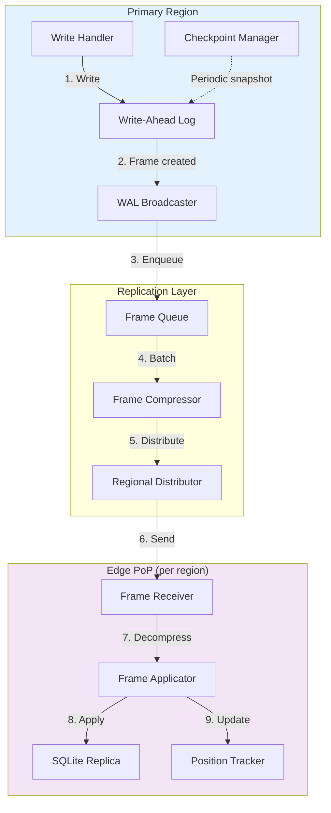
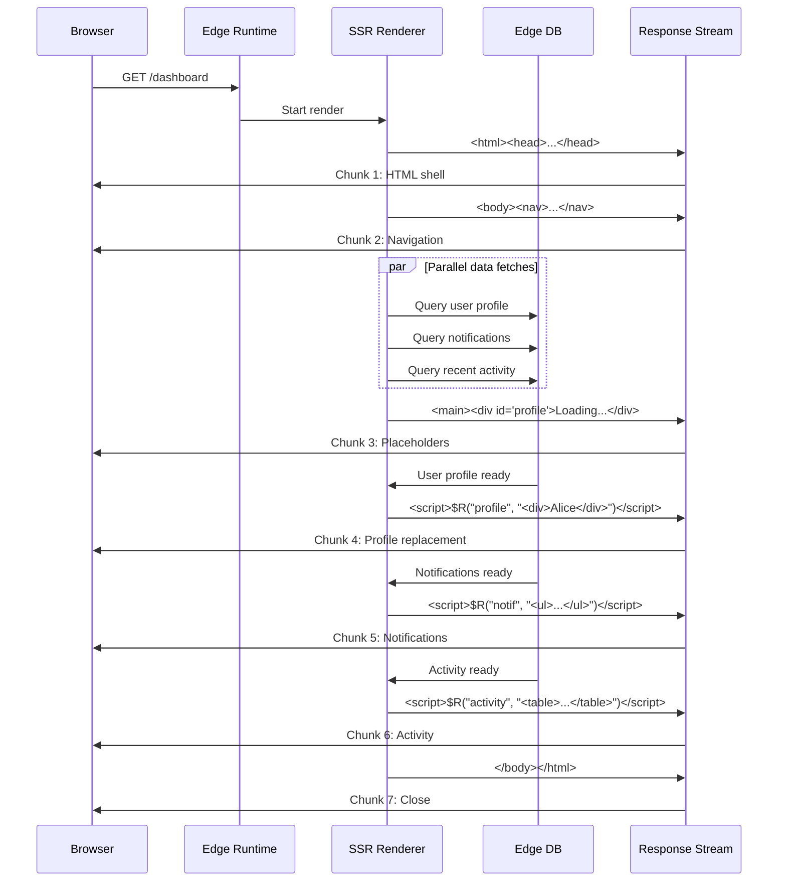
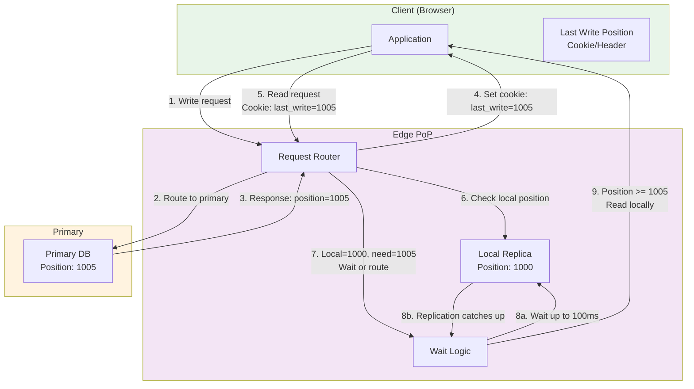
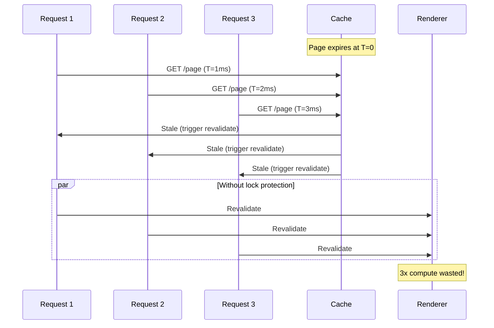
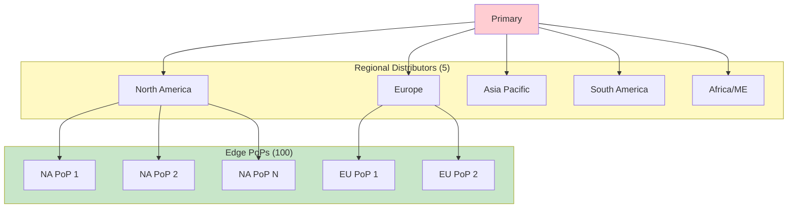

# Deep Dive & Bottlenecks

[Back to Index](./00-index.md) | [Previous: Low-Level Design](./03-low-level-design.md) | [Next: Scalability & Reliability](./05-scalability-and-reliability.md)

---

## Critical Component Deep Dives

### Deep Dive 1: Edge Database Replication Engine

#### Why This Is Critical

The edge database replication engine is the heart of the edge-native platform. It determines:
- **Read latency**: Local replicas enable sub-10ms reads
- **Write consistency**: How quickly writes propagate globally
- **Data freshness**: Acceptable staleness for edge reads
- **Failure recovery**: How replicas catch up after outages

#### How It Works Internally



**WAL Frame Structure:**

```
Frame {
    position: uint64       // Monotonically increasing
    timestamp: uint64      // Unix timestamp (microseconds)
    checksum: uint32       // CRC32 of payload
    operation: enum        // INSERT, UPDATE, DELETE, CREATE_TABLE, etc.
    table_id: uint32
    row_data: bytes        // Serialized row (before/after for UPDATE)
    transaction_id: uint64 // For grouping atomic operations
}

Frame Batch {
    start_position: uint64
    end_position: uint64
    frame_count: uint32
    compressed_payload: bytes  // LZ4 compressed frames
    batch_checksum: uint32
}
```

**Replication Protocol:**

```
// Primary: Broadcast loop
FUNCTION broadcast_wal_frames():
    last_broadcast_position = load_last_broadcast_position()

    WHILE true:
        // Read new frames from WAL
        frames = wal.read_frames_after(last_broadcast_position, max_batch_size=1000)

        IF frames.empty():
            SLEEP(10ms)
            CONTINUE

        // Compress and batch
        batch = create_batch(frames)
        compressed = lz4_compress(batch)

        // Get list of active replicas per region
        FOR EACH region IN get_regions():
            regional_replicas = get_replicas_in_region(region)

            // Send to regional distributor (one per region)
            regional_distributor = get_distributor(region)
            ASYNC regional_distributor.broadcast(compressed, regional_replicas)

        last_broadcast_position = frames.last().position
        persist_last_broadcast_position(last_broadcast_position)

// Replica: Apply loop
FUNCTION apply_replication_stream():
    expected_position = local_db.get_wal_position() + 1

    WHILE true:
        batch = receive_batch(timeout=1000ms)

        IF batch == null:
            // No data, check if we're behind
            primary_position = query_primary_position()
            IF primary_position > expected_position + 1000:
                // Too far behind, request snapshot
                trigger_snapshot_rebuild()
            CONTINUE

        IF batch.start_position > expected_position:
            // Gap detected
            request_missing_frames(expected_position, batch.start_position)
            CONTINUE

        IF batch.end_position < expected_position:
            // Duplicate, skip
            CONTINUE

        // Decompress and apply
        frames = decompress_and_parse(batch)

        BEGIN_TRANSACTION
        FOR EACH frame IN frames:
            IF frame.position >= expected_position:
                apply_frame(frame)
        local_db.set_wal_position(batch.end_position)
        COMMIT_TRANSACTION

        expected_position = batch.end_position + 1
```

#### Failure Modes

| Failure | Detection | Recovery |
|---------|-----------|----------|
| Network partition | No frames received for > 30s | Reconnect, request missing frames |
| Frame corruption | Checksum mismatch | Request retransmission |
| Replica too far behind | Position gap > 10,000 | Rebuild from snapshot |
| Primary failure | Health check timeout | Promote standby, replicas reconnect |
| Disk full on replica | Write error | Alert, stop applying, truncate old data |

#### Performance Characteristics

| Metric | Value | Notes |
|--------|-------|-------|
| Replication lag (same region) | 10-50ms | Low network latency |
| Replication lag (cross-region) | 50-200ms | Network RTT dominated |
| Frame batch size | 1-1000 frames | Adaptive based on throughput |
| Compression ratio | 3-5x | LZ4 on row data |
| Recovery time (gap fill) | 100ms per 1000 frames | Sequential replay |
| Snapshot rebuild time | 1-10 minutes | Depends on database size |

---

### Deep Dive 2: Streaming SSR at Edge

#### Why This Is Critical

Streaming SSR is the key differentiator for edge-native applications:
- **Time to First Byte (TTFB)**: User sees content immediately
- **Perceived performance**: Progressive loading feels faster
- **SEO**: Full HTML available for crawlers
- **Edge execution**: Rendered close to user, not at origin

#### How It Works Internally



**Streaming Protocol:**

```
// Chunked Transfer Encoding
HTTP/1.1 200 OK
Content-Type: text/html; charset=utf-8
Transfer-Encoding: chunked

// Chunk format: size (hex) + CRLF + data + CRLF
1a5\r\n
<!DOCTYPE html><html><head>...</head><body>\r\n

8f\r\n
<nav>...</nav><main>\r\n

// Suspense placeholder
4c\r\n
<div id="profile" data-suspense>Loading profile...</div>\r\n

// Replacement script (after data loads)
7b\r\n
<script>$R("profile","<div class='profile'><h1>Alice</h1></div>")</script>\r\n

// Final chunk
2f\r\n
</main></body></html>\r\n

// End of stream
0\r\n
\r\n
```

**Replacement Script ($R function):**

```javascript
// Injected at start of HTML
window.$R = function(id, html) {
    const target = document.querySelector(`[data-suspense][id="${id}"]`);
    if (target) {
        const template = document.createElement('template');
        template.innerHTML = html;
        target.replaceWith(template.content);
    }
};
```

**Edge Runtime Streaming Implementation:**

```
FUNCTION stream_render(request, route):
    // Create streaming response
    response = new StreamingResponse()
    response.headers["Content-Type"] = "text/html; charset=utf-8"
    response.headers["Transfer-Encoding"] = "chunked"

    // Start sending response immediately
    writer = response.get_writer()

    // Render shell (synchronous, fast)
    shell = render_shell(route)
    writer.write(shell.head)
    writer.write("<body>")
    writer.write(shell.static_content)
    writer.flush()

    // Track pending Suspense boundaries
    pending = []

    FOR EACH component IN route.components:
        IF component.needs_data:
            // Create placeholder with unique ID
            placeholder_id = generate_id()
            writer.write(render_placeholder(component, placeholder_id))

            // Start async data fetch
            pending.push({
                id: placeholder_id,
                promise: fetch_data(component)
            })
        ELSE:
            // Render immediately
            writer.write(render_component(component))

    writer.flush()

    // Stream in async components as they resolve
    WHILE pending.length > 0:
        // Wait for any promise to resolve
        resolved = AWAIT Promise.race(pending.map(p => p.promise.then(d => ({id: p.id, data: d}))))

        // Render and send replacement script
        html = render_component_with_data(resolved.id, resolved.data)
        script = `<script>$R("${resolved.id}",${JSON.stringify(html)})</script>`
        writer.write(script)
        writer.flush()

        // Remove from pending
        pending = pending.filter(p => p.id != resolved.id)

    // Close HTML
    writer.write("</body></html>")
    writer.close()

    RETURN response
```

#### Failure Modes

| Failure | Impact | Mitigation |
|---------|--------|------------|
| Data fetch timeout | Component shows loading forever | Client-side timeout + error boundary |
| Edge runtime crash | Partial HTML sent | Connection closes, browser shows partial |
| Database unavailable | All data components fail | Graceful degradation to static content |
| Client disconnects early | Wasted compute | Detect abort signal, stop rendering |

---

### Deep Dive 3: Read-Your-Writes Consistency

#### Why This Is Critical

Read-your-writes is the minimum consistency guarantee users expect:
- User creates a post → sees it immediately in their feed
- User updates profile → sees changes on next page load
- User adds to cart → cart shows new item

Without this guarantee, users see confusing behavior and lose trust.

#### How It Works Internally



**Client-Side Position Tracking:**

```
// Cookie-based tracking
Set-Cookie: __edge_write_pos=1005; Path=/; Max-Age=300; SameSite=Lax

// Or header-based (for API clients)
Response Header: X-Write-Position: 1005
Request Header: X-Read-After-Position: 1005
```

**Server-Side Implementation:**

```
FUNCTION handle_read_request(request):
    // Extract required position from client
    required_position = get_required_position(request)

    IF required_position == 0:
        // No write tracking, read from local replica
        RETURN query_local_replica(request.query)

    // Get current local replica position
    local_position = local_replica.get_position()

    IF local_position >= required_position:
        // Local replica is caught up, read locally
        RETURN query_local_replica(request.query)

    // Local replica is behind, need to wait or route
    wait_result = wait_for_position(required_position, timeout=100ms)

    IF wait_result.success:
        // Replica caught up within timeout
        RETURN query_local_replica(request.query)
    ELSE:
        // Timeout: fall back to primary (expensive but correct)
        response = query_primary(request.query)
        response.headers["X-Routed-To"] = "primary"
        response.headers["X-Reason"] = "replica-lag"
        RETURN response

FUNCTION wait_for_position(required_position, timeout):
    deadline = now() + timeout

    WHILE now() < deadline:
        current = local_replica.get_position()
        IF current >= required_position:
            RETURN {success: true, waited_ms: now() - (deadline - timeout)}

        // Wait for replication event or small interval
        SLEEP(min(10ms, deadline - now()))

    RETURN {success: false, final_position: local_replica.get_position()}

FUNCTION get_required_position(request):
    // Check cookie first
    cookie_pos = parse_cookie(request, "__edge_write_pos")
    IF cookie_pos:
        RETURN cookie_pos

    // Check header
    header_pos = request.headers["X-Read-After-Position"]
    IF header_pos:
        RETURN parse_int(header_pos)

    RETURN 0
```

#### Failure Modes

| Failure | Impact | Mitigation |
|---------|--------|------------|
| Replica permanently behind | All reads route to primary | Alert, investigate replication |
| Cookie lost | User sees stale data once | Acceptable, self-corrects |
| Clock skew | Position comparison fails | Use logical clocks, not timestamps |
| Primary failover | Position resets | New primary starts from last known |

---

## Concurrency & Race Conditions

### Race Condition 1: ISR Thundering Herd

**Problem**: When a cached page expires, multiple simultaneous requests trigger revalidation.



**Solution**: Revalidation lock with stale-while-revalidate

```
FUNCTION handle_isr_request(route):
    cache_key = get_cache_key(route)
    entry = cache.get(cache_key)

    IF entry.is_fresh():
        RETURN entry.html

    // Stale: return immediately, revalidate in background
    response = entry.html  // Serve stale

    // Try to acquire revalidation lock (non-blocking)
    lock_key = "revalidate:" + cache_key
    IF redis.setnx(lock_key, "1", ttl=30s):
        // We got the lock, revalidate
        ASYNC revalidate_and_cache(route, cache_key, lock_key)
    // Else: another request is already revalidating

    RETURN response

FUNCTION revalidate_and_cache(route, cache_key, lock_key):
    TRY:
        html = render_page(route)
        cache.put(cache_key, html, ttl=revalidate_seconds)
    FINALLY:
        redis.delete(lock_key)
```

### Race Condition 2: Write-Write Conflict

**Problem**: Two concurrent writes to the same row from different edge locations.

**Solution**: Single-writer principle (all writes go to primary)

```
// All writes are serialized at the primary
// Primary uses optimistic locking or serializable transactions

FUNCTION write_with_optimistic_lock(table, id, data, expected_version):
    result = execute_sql(
        "UPDATE {table} SET data = ?, version = version + 1 WHERE id = ? AND version = ?",
        [data, id, expected_version]
    )

    IF result.rows_affected == 0:
        // Conflict: another write happened
        THROW ConflictError("Row was modified")

    RETURN result.new_version
```

### Race Condition 3: Session Overwrite

**Problem**: User has multiple tabs, each updating session state.

**Solution**: Merge-friendly session structure or last-writer-wins

```
// Option 1: Last-Writer-Wins (simple)
session = {
    user_id: "123",
    updated_at: timestamp,
    data: {...}
}
// Higher timestamp wins on conflict

// Option 2: Merge-friendly structure (for specific fields)
session = {
    user_id: "123",
    cart: {
        items: [...],  // Use CRDT for merging
        updated_at: timestamp
    },
    preferences: {
        theme: "dark",
        updated_at: timestamp
    }
}
// Merge each field independently
```

---

## Bottleneck Analysis

### Bottleneck 1: Write Amplification in Global Replication

**Problem**: Every write to the primary must be replicated to 100+ edge locations.

| Metric | Value |
|--------|-------|
| Write QPS (primary) | 1,000 |
| Edge locations | 100 |
| Bytes per write | 500 |
| Amplification factor | 100x |
| Total egress | 50 MB/s |

**Mitigations:**

1. **Batch replication**: Group frames into batches (reduce overhead)
2. **Regional distributors**: Primary → 5 regions → 20 PoPs each (tree topology)
3. **Compression**: LZ4 compress batches (3-5x reduction)
4. **Selective replication**: Only replicate hot data to all PoPs



### Bottleneck 2: Cold Start for Edge Functions

**Problem**: First request to an edge function incurs initialization overhead.

| Runtime | Cold Start | Warm Invocation |
|---------|------------|-----------------|
| V8 Isolate | 5-10ms | < 1ms |
| WASM | 1-5ms | < 0.1ms |
| Container | 500ms-2s | 10-50ms |

**Mitigations:**

1. **Warm pools**: Keep pre-initialized isolates ready
2. **Code pre-compilation**: Parse and compile code at deploy time
3. **Predictive warming**: Warm isolates for expected traffic patterns

```
FUNCTION manage_warm_pool(function_id):
    // Target pool size based on recent traffic
    recent_qps = get_recent_qps(function_id, window=5m)
    target_size = max(1, recent_qps * 0.1)  // 10% of QPS as warm pool

    current_size = warm_pool.count(function_id)

    IF current_size < target_size:
        // Warm more isolates
        FOR i IN range(target_size - current_size):
            isolate = create_isolate(function_id)
            warm_pool.add(function_id, isolate)

    IF current_size > target_size * 2:
        // Shrink pool (with hysteresis)
        excess = current_size - target_size
        warm_pool.evict(function_id, count=excess)
```

### Bottleneck 3: Database Connection Overhead

**Problem**: Traditional databases require TCP connection setup, TLS handshake, authentication.

| Operation | Latency |
|-----------|---------|
| TCP handshake | 1 RTT (50-200ms cross-region) |
| TLS handshake | 2 RTT (100-400ms) |
| Auth | 1 RTT (50-200ms) |
| **Total overhead** | **200-800ms** |

**Mitigations:**

1. **Embedded replicas**: Database runs in-process (Turso model)
2. **Connection pooling**: Hyperdrive maintains warm connections
3. **HTTP-based protocol**: Reuse existing HTTPS connections

```
// Hyperdrive connection pooling
FUNCTION get_connection(database_url):
    pool_key = hash(database_url)

    // Check for existing connection in pool
    connection = connection_pool.get(pool_key)

    IF connection AND connection.is_alive():
        RETURN connection

    // Create new connection (expensive)
    connection = create_database_connection(database_url)
    connection_pool.put(pool_key, connection, ttl=300s)

    RETURN connection

// Result: Subsequent queries skip 200-800ms connection setup
```

### Bottleneck 4: Replication Lag Causing Primary Fallback

**Problem**: When replicas are behind, reads route to primary, increasing primary load.

**Mitigations:**

1. **Increase wait timeout**: Wait longer for replica to catch up
2. **Adaptive routing**: Only route critical reads to primary
3. **Accept staleness**: For non-critical reads, return stale data

```
FUNCTION adaptive_routing(request, required_position):
    local_position = local_replica.get_position()
    lag = required_position - local_position

    IF lag <= 0:
        RETURN read_from_local()

    IF lag <= 100:
        // Small lag: wait briefly
        wait_for_position(required_position, timeout=50ms)
        RETURN read_from_local()

    IF lag <= 1000 AND NOT request.requires_strong_consistency:
        // Medium lag: return stale for non-critical reads
        log_warning("Serving stale data", lag=lag)
        RETURN read_from_local()

    // Large lag or critical read: route to primary
    RETURN read_from_primary()
```

---

## Performance Optimization Techniques

### Technique 1: Edge-Side Includes (ESI)

Compose pages from cached fragments:

```html
<!-- Page template with ESI -->
<html>
<body>
    <esi:include src="/fragments/header" />
    <main>
        <esi:include src="/fragments/product/123" />
    </main>
    <esi:include src="/fragments/footer" />
</body>
</html>

<!-- Each fragment cached independently with different TTLs -->
/fragments/header: TTL=1 hour (rarely changes)
/fragments/product/123: TTL=5 minutes (inventory updates)
/fragments/footer: TTL=1 day (static)
```

### Technique 2: Partial Hydration (Islands)

Only hydrate interactive components:

```html
<!-- Static HTML (no JS) -->
<header>Welcome, Alice</header>

<!-- Interactive island (hydrated) -->
<div data-island="cart-button">
    <button>Cart (3)</button>
    <script type="module" src="/islands/cart-button.js"></script>
</div>

<!-- Static HTML -->
<article>Product description...</article>

<!-- Another island -->
<div data-island="reviews">
    <script type="module" src="/islands/reviews.js"></script>
</div>
```

### Technique 3: Speculative Prefetching

Prefetch likely next pages:

```
FUNCTION prefetch_links(current_page):
    // Analyze page content for links
    links = extract_links(current_page)

    // Score links by likelihood of navigation
    scored_links = []
    FOR link IN links:
        score = calculate_navigation_probability(link, current_page)
        scored_links.push({link, score})

    // Prefetch top 3 most likely
    top_links = sorted(scored_links, by=score, desc=true).slice(0, 3)

    FOR link IN top_links:
        // Add prefetch hint to response
        response.headers.append("Link", `<${link.url}>; rel=prefetch`)
```

---

## Interview Tips: Deep Dive Phase

### Questions to Expect

1. "Walk me through how a write propagates from edge to all replicas"
2. "What happens if replication fails mid-way?"
3. "How do you prevent thundering herd on cache expiration?"
4. "Explain your read-your-writes implementation"

### Key Points to Cover

- **WAL replication**: Frame-based, position tracking, gap detection
- **Streaming SSR**: Chunked encoding, Suspense boundaries, replacement scripts
- **Consistency**: Position tracking, wait logic, fallback to primary
- **Concurrency**: Locks for ISR, single-writer for writes, CRDT for collaboration

### Red Flags to Avoid

- Not considering replication lag in read-after-write
- Ignoring thundering herd problem
- Proposing complex multi-master without discussing conflict resolution
- Forgetting about partial failure scenarios

---

**Next: [05 - Scalability & Reliability](./05-scalability-and-reliability.md)**
