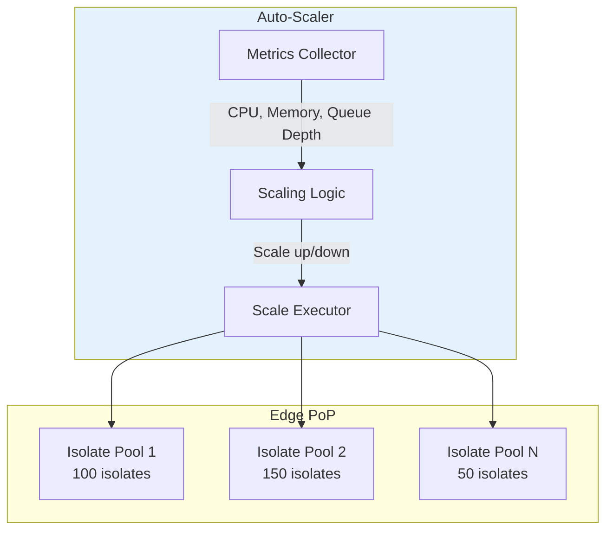
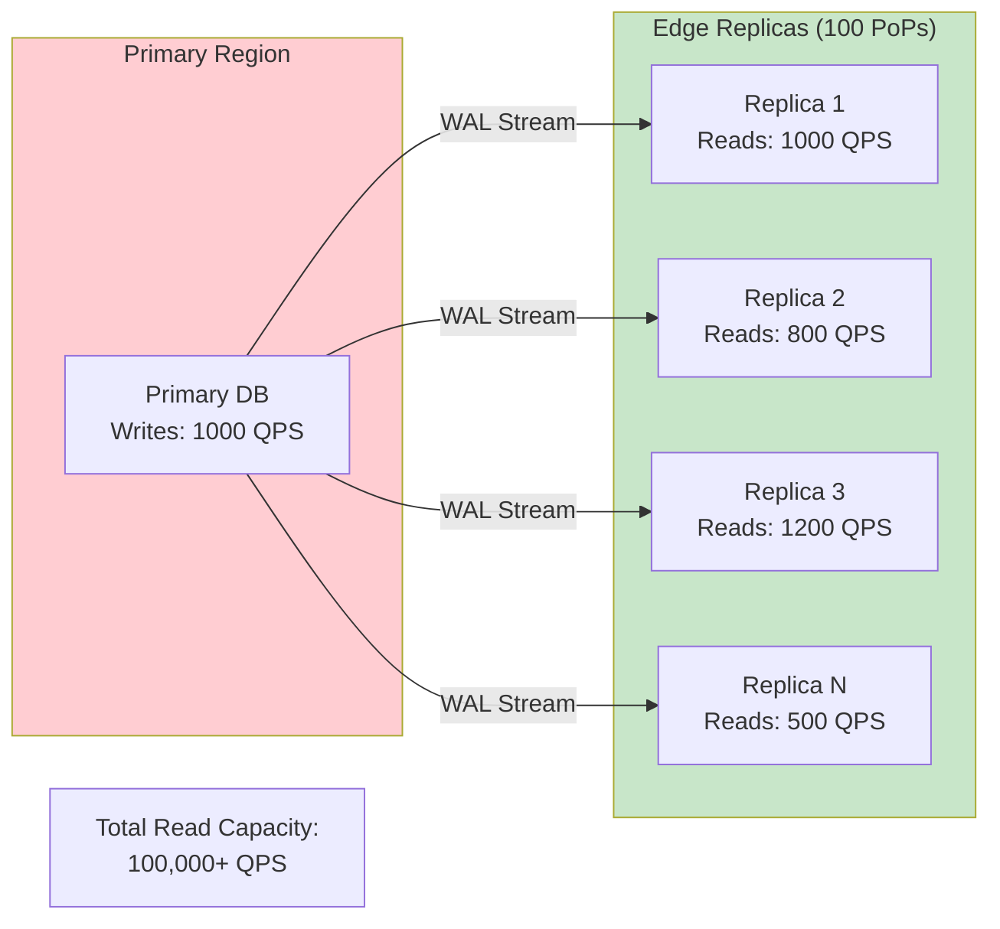
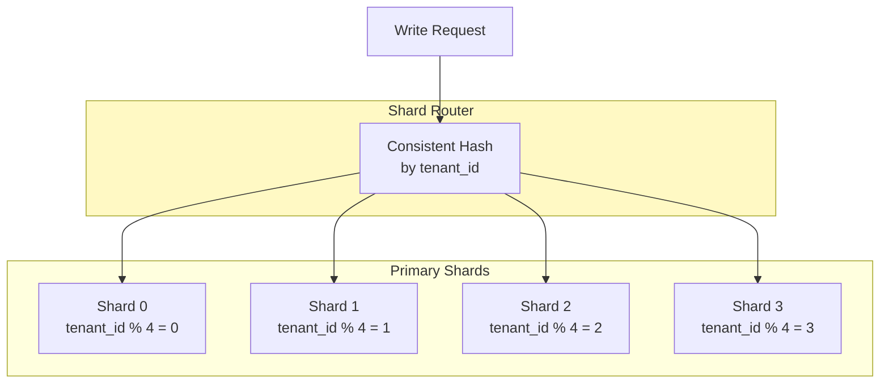
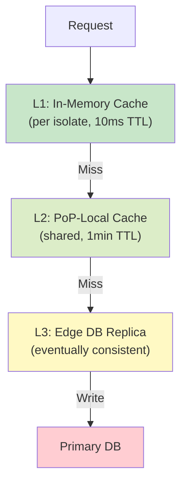
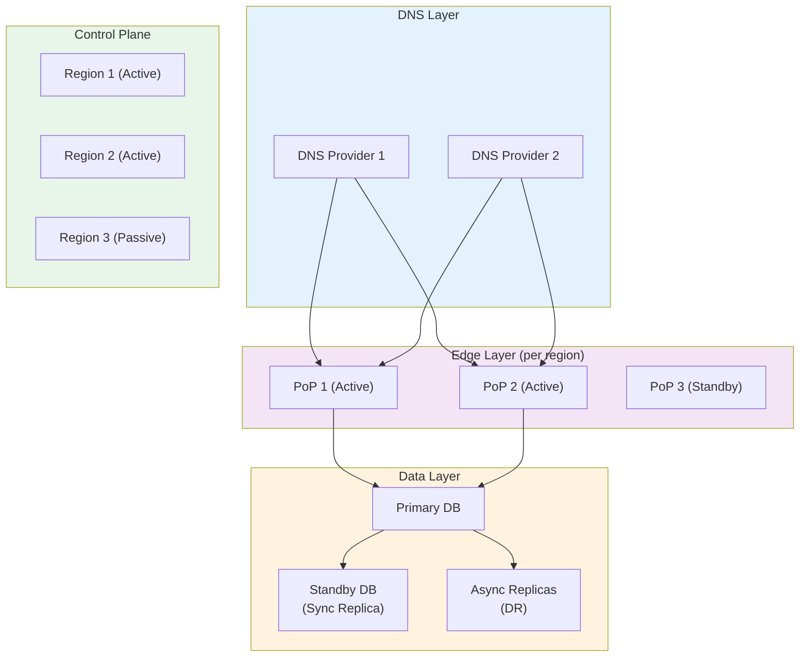
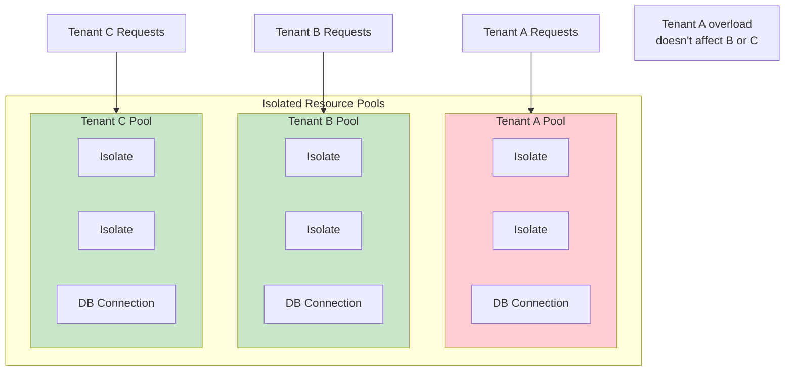
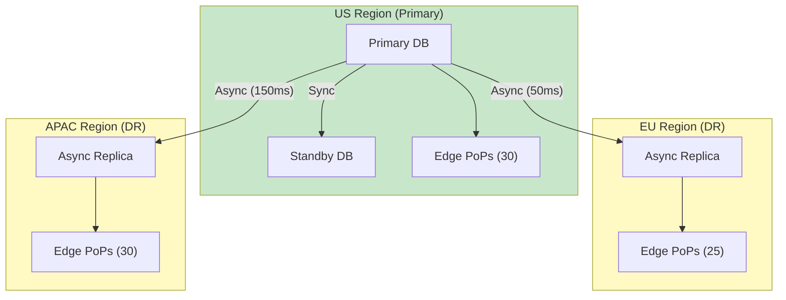

# Scalability & Reliability

[Back to Index](./00-index.md) | [Previous: Deep Dive & Bottlenecks](./04-deep-dive-and-bottlenecks.md) | [Next: Security & Compliance](./06-security-and-compliance.md)

---

## Scalability

### Horizontal vs Vertical Scaling

| Component | Scaling Strategy | Rationale |
|-----------|-----------------|-----------|
| Edge Runtime | Horizontal (add PoPs, add isolates) | Stateless, easy to replicate |
| Edge DB Replicas | Horizontal (add replicas per PoP) | Read scaling at each location |
| Primary Database | Vertical first, then shard | Writes are serialized |
| Control Plane | Horizontal (multi-region) | Stateless API servers |
| Replication Layer | Horizontal (regional distributors) | Tree topology |

### Edge Runtime Scaling



**Auto-Scaling Algorithm:**

```
FUNCTION calculate_desired_capacity(function_id, pop_id):
    // Inputs
    current_qps = get_current_qps(function_id, pop_id)
    avg_latency_ms = get_avg_latency(function_id, pop_id)
    queue_depth = get_queue_depth(function_id, pop_id)
    current_isolates = get_isolate_count(function_id, pop_id)

    // Thresholds
    target_utilization = 0.7  // 70% target
    max_latency_ms = 50
    max_queue_depth = 100

    // Calculate based on QPS (requests per second per isolate)
    rps_per_isolate = 100  // Assuming 10ms avg processing
    qps_based_capacity = ceil(current_qps / (rps_per_isolate * target_utilization))

    // Adjust for latency pressure
    IF avg_latency_ms > max_latency_ms:
        latency_factor = avg_latency_ms / max_latency_ms
        qps_based_capacity = qps_based_capacity * latency_factor

    // Adjust for queue pressure
    IF queue_depth > max_queue_depth:
        queue_factor = 1 + (queue_depth / max_queue_depth)
        qps_based_capacity = qps_based_capacity * queue_factor

    // Apply limits
    min_capacity = 1
    max_capacity = 1000
    desired = clamp(qps_based_capacity, min_capacity, max_capacity)

    // Smooth scaling (avoid thrashing)
    IF desired > current_isolates * 1.2:
        RETURN current_isolates * 1.5  // Scale up by 50%
    ELIF desired < current_isolates * 0.5:
        RETURN current_isolates * 0.7  // Scale down by 30%
    ELSE:
        RETURN current_isolates  // No change
```

### Database Scaling

#### Read Scaling (Edge Replicas)



**Read scaling is nearly unlimited**: Add more edge locations or more replicas per location.

#### Write Scaling (Sharding)

When a single primary becomes the bottleneck:



**Sharding Strategies:**

| Strategy | Pros | Cons | Best For |
|----------|------|------|----------|
| Tenant-based | Simple routing, good isolation | Uneven distribution | Multi-tenant SaaS |
| Hash-based | Even distribution | Cross-shard queries hard | Single-tenant apps |
| Range-based | Range queries within shard | Hot spots on recent data | Time-series |
| Geographic | Data locality | Complex routing | Compliance requirements |

### Database-Per-Tenant Scaling

```
// Scaling model for multi-tenant SaaS

Tenant Tiers:
- Free: Shared database (100 tenants per DB)
- Pro: Dedicated database (10GB limit)
- Enterprise: Dedicated database + read replicas

Capacity Planning:
- 100,000 tenants
- 10% Pro (10,000 dedicated DBs)
- 1% Enterprise (1,000 with replicas)
- 89% Free (890 shared DBs)

Total databases: 10,000 + 1,000 + 890 = 11,890
Average size: 500MB
Total storage: ~6TB primary + ~600TB replicas (100 PoPs)
```

### Caching Layers



| Cache Layer | Latency | Hit Rate | Size | Scope |
|-------------|---------|----------|------|-------|
| L1 (In-Memory) | < 1ms | 30-50% | 10MB per isolate | Single isolate |
| L2 (PoP-Local) | 1-5ms | 60-80% | 10GB per PoP | All isolates in PoP |
| L3 (Edge DB) | 5-15ms | 95%+ | Full replica | All PoPs (eventually consistent) |

### Hot Spot Mitigation

**Problem**: Popular content causes load concentration.

**Solutions:**

1. **Request coalescing**: Multiple requests for same resource share one fetch

```
FUNCTION coalesced_fetch(key):
    // Check if fetch is already in progress
    IF in_flight_requests.has(key):
        // Wait for existing request
        RETURN in_flight_requests.get(key).promise

    // Start new fetch
    promise = fetch_from_origin(key)
    in_flight_requests.set(key, {promise: promise, started: now()})

    result = AWAIT promise
    in_flight_requests.delete(key)
    RETURN result
```

2. **Consistent hashing with virtual nodes**: Spread load across multiple cache nodes

3. **Rate limiting per resource**: Prevent single resource from overwhelming system

---

## Reliability & Fault Tolerance

### Single Points of Failure (SPOF) Analysis

| Component | SPOF Risk | Mitigation |
|-----------|-----------|------------|
| Primary Database | High | Standby replica, automatic failover |
| Anycast DNS | Medium | Multi-provider DNS |
| Control Plane | Low | Multi-region, existing deployments work |
| Edge PoP | None | Anycast routes to next nearest |
| Replication Manager | Medium | Multiple instances, leader election |

### Redundancy Strategy



### Failover Mechanisms

#### Primary Database Failover

```
FUNCTION monitor_primary():
    consecutive_failures = 0
    failure_threshold = 3
    check_interval = 5s

    WHILE true:
        IF NOT health_check_primary():
            consecutive_failures += 1
            log_warning("Primary health check failed", count=consecutive_failures)

            IF consecutive_failures >= failure_threshold:
                trigger_failover()
                RETURN
        ELSE:
            consecutive_failures = 0

        SLEEP(check_interval)

FUNCTION trigger_failover():
    log_critical("Initiating primary failover")

    // 1. Stop writes to old primary
    set_primary_read_only()

    // 2. Wait for standby to catch up
    standby_position = get_standby_position()
    primary_position = get_primary_position()

    IF standby_position < primary_position:
        // Some writes may be lost
        log_warning("Potential data loss", lost_positions=primary_position - standby_position)

    // 3. Promote standby
    promote_standby_to_primary()

    // 4. Update routing
    update_dns_to_new_primary()

    // 5. Notify edge replicas
    broadcast_primary_change()

    log_info("Failover complete", new_primary=standby_id)
```

#### Edge PoP Failover

**Automatic via Anycast:**

```
// BGP-based automatic failover
// No application logic needed

Timeline:
T=0: PoP-A fails (stops responding to health checks)
T=5s: BGP health check fails
T=10s: BGP withdraws route for PoP-A
T=15s: Clients automatically route to PoP-B (next nearest)

Total failover time: ~15 seconds (can be tuned to 5-10s)
```

### Circuit Breaker Pattern

```
CLASS CircuitBreaker:
    state = CLOSED  // CLOSED, OPEN, HALF_OPEN
    failure_count = 0
    failure_threshold = 5
    reset_timeout = 30s
    last_failure_time = null

    FUNCTION call(operation):
        IF state == OPEN:
            IF now() - last_failure_time > reset_timeout:
                state = HALF_OPEN
            ELSE:
                THROW CircuitOpenError()

        TRY:
            result = operation()

            IF state == HALF_OPEN:
                state = CLOSED
                failure_count = 0

            RETURN result

        CATCH error:
            failure_count += 1
            last_failure_time = now()

            IF failure_count >= failure_threshold:
                state = OPEN
                log_warning("Circuit breaker opened", service=operation.name)

            THROW error

// Usage
primary_db_breaker = CircuitBreaker()

FUNCTION write_to_db(query):
    RETURN primary_db_breaker.call(() => execute_query(query))
```

### Retry Strategy

```
FUNCTION retry_with_backoff(operation, max_retries=3):
    base_delay = 100ms
    max_delay = 5s

    FOR attempt IN range(max_retries):
        TRY:
            RETURN operation()
        CATCH RetryableError as error:
            IF attempt == max_retries - 1:
                THROW error

            // Exponential backoff with jitter
            delay = min(base_delay * (2 ** attempt), max_delay)
            jitter = random(0, delay * 0.1)
            SLEEP(delay + jitter)

            log_info("Retrying operation", attempt=attempt+1, delay_ms=delay)

// Retryable errors:
// - Network timeout
// - 503 Service Unavailable
// - 429 Too Many Requests (with Retry-After header)
// - Connection reset

// Non-retryable errors:
// - 400 Bad Request
// - 401 Unauthorized
// - 404 Not Found
// - 409 Conflict
```

### Graceful Degradation

| Feature | Normal Mode | Degraded Mode | Trigger |
|---------|-------------|---------------|---------|
| Edge DB Reads | Local replica | Stale data with warning | Replication lag > 60s |
| Edge DB Writes | Sync to primary | Queue with async ACK | Primary latency > 500ms |
| Streaming SSR | Full streaming | Static fallback | Render errors > 5% |
| Feature Flags | Real-time | Cached defaults | Config service down |
| Analytics | Real-time | Batch (delayed) | Analytics service down |

```
FUNCTION render_page_with_degradation(request):
    TRY:
        // Normal path: streaming SSR with data
        RETURN stream_render(request)
    CATCH RenderError:
        // Degraded: serve static shell
        log_warning("Render failed, serving static shell")
        RETURN serve_static_shell(request)
    CATCH DataError:
        // Degraded: serve cached version
        cached = get_cached_version(request.url)
        IF cached:
            log_warning("Data fetch failed, serving cached")
            RETURN cached
        ELSE:
            // Ultimate fallback: error page
            RETURN serve_error_page(503)
```

### Bulkhead Pattern

Isolate failures to prevent cascade:



---

## Disaster Recovery

### RTO and RPO Targets

| Scenario | RTO | RPO | Strategy |
|----------|-----|-----|----------|
| Single PoP failure | 15 seconds | 0 | Anycast failover |
| Primary DB failure | 5 minutes | < 1 minute | Standby promotion |
| Region failure | 30 minutes | < 5 minutes | Cross-region failover |
| Global outage | 4 hours | < 1 hour | Restore from backup |

### Backup Strategy

```
// Backup schedule
Primary Database:
- Continuous: WAL archiving to object storage
- Hourly: Incremental backup
- Daily: Full backup
- Weekly: Full backup + integrity check

Edge Replicas:
- No backup (rebuilt from primary)

Configuration:
- Every change: Version-controlled, audit logged
- Daily: Full export to object storage

Retention:
- WAL: 7 days
- Hourly backups: 24 hours
- Daily backups: 30 days
- Weekly backups: 1 year
```

### Recovery Procedures

**Scenario: Primary Database Corruption**

```
PROCEDURE recover_from_corruption():
    // 1. Identify corruption time
    corruption_time = analyze_logs_for_corruption()

    // 2. Stop all writes
    enable_global_read_only_mode()
    notify_operations_team()

    // 3. Find last good backup
    backup = find_backup_before(corruption_time)

    // 4. Restore to new primary
    new_primary = provision_database_server()
    restore_backup(new_primary, backup)

    // 5. Apply WAL up to corruption point
    apply_wal(new_primary, from=backup.wal_position, to=corruption_time - 1s)

    // 6. Verify integrity
    run_integrity_checks(new_primary)

    // 7. Switch traffic
    update_dns(new_primary)
    rebuild_all_edge_replicas(new_primary)

    // 8. Re-enable writes
    disable_read_only_mode()

    // 9. Post-incident
    create_incident_report()
```

### Multi-Region Considerations



**Regional Failover:**

| Failure | Action | Data Loss Risk |
|---------|--------|----------------|
| US Primary fails | Promote US Standby | None (sync) |
| US Region fails | Promote EU Async | Up to 50ms of writes |
| US + EU fail | Promote APAC Async | Up to 150ms of writes |

---

## Interview Tips: Scalability & Reliability Phase

### Key Points to Cover

1. **Horizontal scaling**: Edge runtime scales by adding PoPs and isolates
2. **Read scaling**: Unlimited via edge replicas
3. **Write scaling**: Shard by tenant when needed
4. **Automatic failover**: Anycast for edge, standby for primary
5. **Graceful degradation**: Serve stale data, static fallback

### Common Follow-up Questions

- "How do you handle a traffic spike?" → Auto-scaling + request coalescing + caching
- "What if the primary database fails?" → Standby promotion, < 5 min RTO
- "How do you prevent a bad tenant from affecting others?" → Bulkhead pattern, resource limits
- "What's your backup strategy?" → Continuous WAL + hourly incremental + daily full

### Red Flags to Avoid

- Relying on vertical scaling for primary database
- No failover strategy for primary
- Not considering cascade failures
- Ignoring noisy neighbor problem in multi-tenant

---

**Next: [06 - Security & Compliance](./06-security-and-compliance.md)**
