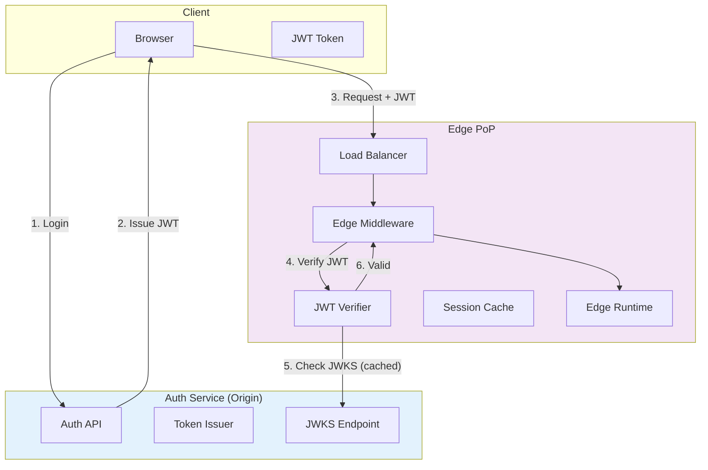
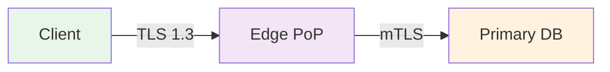
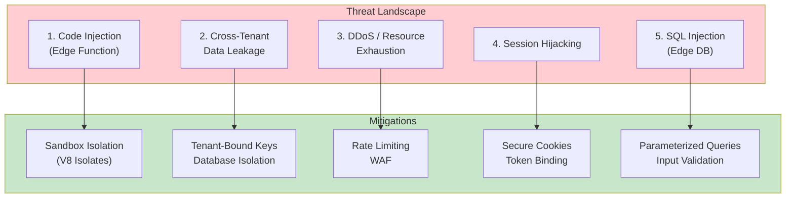
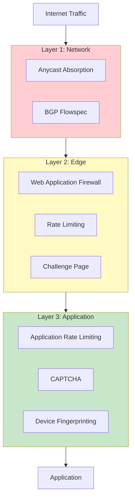
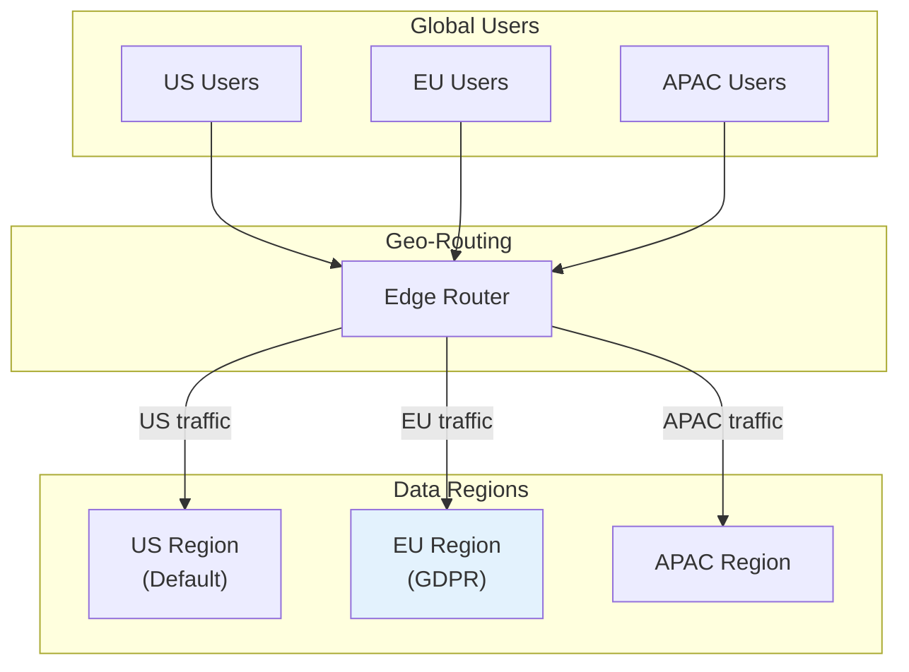

# Security & Compliance

[Back to Index](./00-index.md) | [Previous: Scalability & Reliability](./05-scalability-and-reliability.md) | [Next: Observability](./07-observability.md)

---

## Authentication & Authorization

### Authentication at the Edge

Edge-native platforms must authenticate requests close to users to minimize latency:



**JWT Verification at Edge:**

```
// JWKS caching at edge
GLOBAL jwks_cache = {}
GLOBAL jwks_cache_ttl = 1 hour

FUNCTION verify_jwt_at_edge(token):
    // 1. Decode header (without verification)
    header = decode_jwt_header(token)
    kid = header.kid

    // 2. Get public key from cached JWKS
    public_key = get_cached_jwks(kid)

    IF public_key == null:
        // Key not in cache, fetch from origin
        public_key = fetch_and_cache_jwks(kid)

    // 3. Verify signature
    IF NOT verify_signature(token, public_key):
        THROW UnauthorizedError("Invalid signature")

    // 4. Verify claims
    payload = decode_jwt_payload(token)

    IF payload.exp < now():
        THROW UnauthorizedError("Token expired")

    IF payload.iss != expected_issuer:
        THROW UnauthorizedError("Invalid issuer")

    IF payload.aud != expected_audience:
        THROW UnauthorizedError("Invalid audience")

    RETURN payload

FUNCTION get_cached_jwks(kid):
    IF jwks_cache.has(kid) AND jwks_cache[kid].expires > now():
        RETURN jwks_cache[kid].key
    RETURN null

FUNCTION fetch_and_cache_jwks(kid):
    // Fetch from auth service
    jwks = http_get(jwks_endpoint)

    FOR key IN jwks.keys:
        jwks_cache[key.kid] = {
            key: key,
            expires: now() + jwks_cache_ttl
        }

    RETURN jwks_cache[kid].key
```

### Session Management

```
// Session stored in Edge KV
Session Schema:
{
    session_id: "sess_abc123",
    user_id: "user_456",
    created_at: "2025-01-15T10:00:00Z",
    expires_at: "2025-01-15T22:00:00Z",
    refresh_token_hash: "sha256:...",
    metadata: {
        ip_hash: "sha256:...",
        user_agent_hash: "sha256:...",
        device_id: "device_789"
    }
}

// Session validation at edge
FUNCTION validate_session(session_id):
    session = edge_kv.get("sessions:" + session_id)

    IF session == null:
        THROW UnauthorizedError("Session not found")

    IF session.expires_at < now():
        edge_kv.delete("sessions:" + session_id)
        THROW UnauthorizedError("Session expired")

    // Extend session on activity (sliding window)
    IF session.expires_at - now() < 6 hours:
        session.expires_at = now() + 12 hours
        edge_kv.put("sessions:" + session_id, session, ttl=12 hours)

    RETURN session
```

### Authorization Models

| Model | Description | Best For |
|-------|-------------|----------|
| **RBAC** | Role-Based Access Control | Simple permission structures |
| **ABAC** | Attribute-Based Access Control | Complex, dynamic rules |
| **ReBAC** | Relationship-Based Access Control | Document/resource sharing |

**Edge-Optimized RBAC:**

```
// Embed permissions in JWT (for small permission sets)
JWT Payload:
{
    sub: "user_123",
    roles: ["admin", "editor"],
    permissions: ["read:posts", "write:posts", "delete:posts"],
    org_id: "org_456"
}

// Permission check at edge (no origin call)
FUNCTION check_permission(user, permission):
    IF permission IN user.permissions:
        RETURN true

    IF "admin" IN user.roles:
        RETURN true  // Admin has all permissions

    RETURN false
```

**ABAC for Complex Rules:**

```
// Policy stored in Edge Config (pushed from origin)
Policy:
{
    rules: [
        {
            effect: "allow",
            action: "delete:post",
            conditions: {
                "user.id": {"equals": "resource.author_id"},
                "resource.status": {"not_equals": "published"}
            }
        },
        {
            effect: "allow",
            action: "delete:post",
            conditions: {
                "user.roles": {"contains": "moderator"}
            }
        }
    ]
}

FUNCTION evaluate_policy(user, action, resource):
    FOR rule IN policy.rules:
        IF rule.action == action AND evaluate_conditions(rule.conditions, user, resource):
            RETURN rule.effect

    RETURN "deny"  // Default deny
```

---

## Data Security

### Encryption at Rest

| Data Type | Encryption | Key Management |
|-----------|------------|----------------|
| Primary Database | AES-256 | Platform-managed or customer-managed |
| Edge Replicas | AES-256 | Platform-managed (derived keys) |
| Edge KV | AES-256 | Platform-managed |
| Backups | AES-256 | Separate backup keys |
| Logs | AES-256 | Rotating keys |

**Embedded Replica Encryption (Turso Model):**

```
// Client-side encryption key management
FUNCTION create_encrypted_replica(encryption_key):
    client = create_db_client({
        url: database_url,
        embedded_replica_path: "./local.db",
        encryption_key: encryption_key  // AES-256 key
    })

    // Data encrypted at rest in local SQLite file
    // Key never sent to server

    RETURN client
```

### Encryption in Transit



| Connection | Protocol | Cipher Suites |
|------------|----------|---------------|
| Client → Edge | TLS 1.3 | TLS_AES_256_GCM_SHA384, TLS_CHACHA20_POLY1305_SHA256 |
| Edge → Primary | mTLS | Same as above + client certificate |
| Replication | mTLS | Same + message authentication |

### PII Handling

```
// PII detection and masking
PII_PATTERNS = {
    email: /[a-zA-Z0-9._%+-]+@[a-zA-Z0-9.-]+\.[a-zA-Z]{2,}/,
    phone: /\+?[1-9]\d{1,14}/,
    ssn: /\d{3}-\d{2}-\d{4}/,
    credit_card: /\d{4}[\s-]?\d{4}[\s-]?\d{4}[\s-]?\d{4}/
}

FUNCTION mask_pii(data, fields_to_mask):
    FOR field IN fields_to_mask:
        IF data.has(field):
            data[field] = hash_or_mask(data[field])

    RETURN data

FUNCTION hash_or_mask(value):
    // For searchable fields: deterministic hash
    // For display fields: partial masking

    IF is_email(value):
        RETURN mask_email(value)  // j***@example.com

    IF is_phone(value):
        RETURN mask_phone(value)  // ***-***-1234

    RETURN sha256(value + salt)
```

### Data Masking and Anonymization

```
// Column-level encryption for sensitive fields
CREATE TABLE users (
    id TEXT PRIMARY KEY,
    email TEXT,  -- Plaintext for auth
    email_hash TEXT,  -- For lookups
    name_encrypted BLOB,  -- Encrypted
    ssn_encrypted BLOB,  -- Encrypted
    created_at TIMESTAMP
);

// Application-level encryption
FUNCTION encrypt_sensitive_field(value, key):
    nonce = generate_random_nonce(12)
    ciphertext = aes_gcm_encrypt(value, key, nonce)
    RETURN base64_encode(nonce + ciphertext)

FUNCTION decrypt_sensitive_field(encrypted, key):
    decoded = base64_decode(encrypted)
    nonce = decoded[0:12]
    ciphertext = decoded[12:]
    RETURN aes_gcm_decrypt(ciphertext, key, nonce)
```

---

## Threat Model

### Top Attack Vectors



### Threat Analysis

| Threat | Likelihood | Impact | Mitigation |
|--------|------------|--------|------------|
| **Edge Function Code Injection** | Medium | High | V8 isolate sandboxing, code review, CSP |
| **Cross-Tenant Data Access** | Low | Critical | Database isolation, tenant-scoped queries |
| **DDoS Attack** | High | Medium | Anycast absorption, rate limiting, WAF |
| **Session Hijacking** | Medium | High | Secure cookies, token binding, short TTL |
| **SQL Injection** | Medium | High | Parameterized queries, ORM |
| **Replay Attacks** | Medium | Medium | Nonce validation, request signing |
| **Man-in-the-Middle** | Low | High | TLS 1.3, certificate pinning |
| **Supply Chain Attack** | Low | Critical | Dependency scanning, lockfiles |

### Mitigation Details

**1. Edge Function Sandboxing:**

```
// V8 Isolate security boundaries
Isolate Properties:
- Memory limit: 128MB
- CPU time limit: 50ms
- No file system access
- No raw socket access
- Limited network (fetch only)
- No eval() or Function() constructor
- No SharedArrayBuffer (Spectre mitigation)

// Resource limits enforced by runtime
IF isolate.memory_usage > 128MB:
    terminate_isolate()
    RETURN 500 "Resource limit exceeded"

IF isolate.cpu_time > 50ms:
    terminate_isolate()
    RETURN 500 "Execution timeout"
```

**2. Tenant Isolation:**

```
// Database-level isolation
Each tenant gets:
- Separate database file
- Unique encryption key
- Isolated connection pool

// Query-level isolation (for shared databases)
FUNCTION query_with_tenant_scope(tenant_id, sql, params):
    // Automatically inject tenant filter
    scoped_sql = add_tenant_filter(sql, tenant_id)

    // Verify no cross-tenant access
    IF contains_other_tenant_data(scoped_sql, tenant_id):
        THROW SecurityError("Cross-tenant access denied")

    RETURN execute(scoped_sql, params)
```

**3. Rate Limiting:**

```
// Multi-layer rate limiting
LAYERS:
  1. Global (DDoS protection): 10M requests/second
  2. Per IP: 1000 requests/minute
  3. Per User: 100 requests/second
  4. Per Endpoint: Configurable

FUNCTION check_rate_limit(request):
    ip = get_client_ip(request)
    user_id = get_user_id(request)
    endpoint = request.path

    // Check each layer
    IF NOT check_limit("global"):
        RETURN 503  // Service overloaded

    IF NOT check_limit("ip:" + ip, limit=1000, window=60s):
        RETURN 429  // Too many requests

    IF user_id AND NOT check_limit("user:" + user_id, limit=100, window=1s):
        RETURN 429

    IF NOT check_limit("endpoint:" + endpoint, limit=get_endpoint_limit(endpoint)):
        RETURN 429

    RETURN null  // Allowed
```

**4. Secure Session Management:**

```
// Secure cookie attributes
Set-Cookie: session_id=abc123;
    Path=/;
    HttpOnly;           // No JavaScript access
    Secure;             // HTTPS only
    SameSite=Strict;    // CSRF protection
    Max-Age=43200;      // 12 hours

// Token binding (optional, for high-security)
Session includes:
- Device fingerprint hash
- Client certificate thumbprint (mTLS)

FUNCTION validate_token_binding(session, request):
    expected_fingerprint = session.device_fingerprint
    actual_fingerprint = compute_fingerprint(request)

    IF expected_fingerprint != actual_fingerprint:
        invalidate_session(session.id)
        THROW SecurityError("Token binding mismatch")
```

---

## DDoS Protection

### Defense Layers



### Challenge Page System

```
FUNCTION handle_suspicious_request(request):
    risk_score = calculate_risk_score(request)

    IF risk_score < 30:
        RETURN allow_request(request)

    IF risk_score < 70:
        // JavaScript challenge
        RETURN serve_js_challenge(request)

    IF risk_score < 90:
        // CAPTCHA challenge
        RETURN serve_captcha(request)

    // Block
    RETURN block_request(request)

FUNCTION calculate_risk_score(request):
    score = 0

    // IP reputation
    IF is_known_bad_ip(request.ip):
        score += 50

    // Request rate
    IF get_recent_request_count(request.ip) > 100:
        score += 20

    // User agent analysis
    IF is_suspicious_user_agent(request.headers["user-agent"]):
        score += 15

    // Missing headers
    IF NOT has_expected_headers(request):
        score += 10

    // Geographic anomaly
    IF is_geographic_anomaly(request):
        score += 5

    RETURN score
```

---

## Compliance

### Data Residency



**Jurisdiction Configuration:**

```
// Database configuration with data residency
database_config = {
    name: "my-database",
    primary_location: "eu-west-1",  // GDPR requirement
    allowed_regions: ["eu-west-1", "eu-central-1"],  // EU only
    restricted_regions: ["us-*", "ap-*"]  // No replication outside EU
}

// Enforced at platform level
FUNCTION create_replica(database, region):
    IF region IN database.restricted_regions:
        THROW ComplianceError("Region not allowed for this database")

    IF region NOT IN database.allowed_regions:
        THROW ComplianceError("Region not in allowed list")

    create_replica_in_region(database, region)
```

### Compliance Frameworks

| Framework | Key Requirements | Platform Support |
|-----------|------------------|------------------|
| **GDPR** | Data residency, right to erasure, consent | EU regions, data export API, audit logs |
| **HIPAA** | PHI protection, audit trails, encryption | BAA available, encryption at rest/transit |
| **PCI DSS** | Cardholder data protection, access control | Compliant infrastructure, tokenization |
| **SOC 2** | Security, availability, confidentiality | Audit reports, access logs |

### Audit Logging

```
// Comprehensive audit log for compliance
Audit Log Entry:
{
    event_id: "evt_abc123",
    timestamp: "2025-01-15T10:30:45.123Z",
    event_type: "data.read",
    actor: {
        type: "user",
        id: "user_456",
        ip: "203.0.113.50",
        user_agent: "Mozilla/5.0..."
    },
    resource: {
        type: "database",
        id: "db_789",
        tenant_id: "tenant_012"
    },
    action: {
        method: "SELECT",
        query_hash: "sha256:...",
        rows_affected: 10
    },
    result: "success",
    metadata: {
        edge_pop: "fra1",
        request_id: "req_xyz789",
        duration_ms: 5
    }
}

// Retention: 1 year minimum, immutable storage
// Export: Available via API for compliance audits
```

### Right to Erasure (GDPR)

```
FUNCTION handle_deletion_request(user_id):
    // 1. Verify identity
    verify_user_identity(user_id)

    // 2. Find all user data across databases
    databases = find_databases_with_user_data(user_id)

    FOR db IN databases:
        // 3. Delete from primary
        execute_deletion(db.primary, user_id)

        // 4. Ensure propagation to replicas
        wait_for_replication(db, timeout=60s)

    // 5. Delete from KV stores
    delete_kv_by_prefix("user:" + user_id)

    // 6. Delete from backups (or mark for exclusion)
    mark_for_backup_exclusion(user_id)

    // 7. Audit log (keep for compliance, anonymized)
    log_deletion_event(user_id)

    // 8. Confirm deletion
    RETURN {
        status: "completed",
        deleted_at: now(),
        confirmation_id: generate_confirmation_id()
    }
```

---

## Security Best Practices

### Input Validation

```
FUNCTION validate_input(input, schema):
    // 1. Type validation
    IF typeof(input) != schema.type:
        THROW ValidationError("Invalid type")

    // 2. Length limits
    IF schema.max_length AND len(input) > schema.max_length:
        THROW ValidationError("Input too long")

    // 3. Pattern matching
    IF schema.pattern AND NOT regex_match(input, schema.pattern):
        THROW ValidationError("Invalid format")

    // 4. Sanitization (for display)
    IF schema.sanitize:
        input = html_escape(input)

    // 5. Allow-list validation (for enums)
    IF schema.allowed_values AND input NOT IN schema.allowed_values:
        THROW ValidationError("Value not allowed")

    RETURN input
```

### Secure Defaults

| Setting | Secure Default | Reason |
|---------|----------------|--------|
| CORS | Disabled | Prevent cross-origin attacks |
| Cookies | HttpOnly, Secure, SameSite=Strict | Prevent XSS, CSRF |
| Headers | CSP, X-Frame-Options, X-Content-Type-Options | Prevent injection, clickjacking |
| TLS | 1.3 only | Modern security |
| SQL | Parameterized queries only | Prevent injection |
| Logging | PII masked | Privacy compliance |

### Security Headers

```
// Default security headers for all responses
Security-Headers:
    Content-Security-Policy: default-src 'self'; script-src 'self' 'unsafe-inline'
    X-Frame-Options: DENY
    X-Content-Type-Options: nosniff
    X-XSS-Protection: 1; mode=block
    Referrer-Policy: strict-origin-when-cross-origin
    Permissions-Policy: geolocation=(), microphone=(), camera=()
    Strict-Transport-Security: max-age=31536000; includeSubDomains; preload
```

---

## Interview Tips: Security Phase

### Key Points to Cover

1. **Authentication at edge**: JWT verification, JWKS caching
2. **Tenant isolation**: Database separation, scoped queries
3. **DDoS protection**: Multi-layer defense, challenge pages
4. **Compliance**: Data residency, audit logging, right to erasure

### Common Follow-up Questions

- "How do you prevent one tenant from accessing another's data?" → Database isolation + query scoping + tenant-bound keys
- "How do you handle JWT expiration at edge?" → Short-lived tokens + refresh token rotation
- "How do you comply with GDPR?" → EU-only regions + data export API + deletion workflow

### Red Flags to Avoid

- Storing sensitive data in JWT payload
- Not considering edge-specific security (caching tokens too long)
- Ignoring multi-tenant isolation
- No rate limiting strategy

---

**Next: [07 - Observability](./07-observability.md)**
