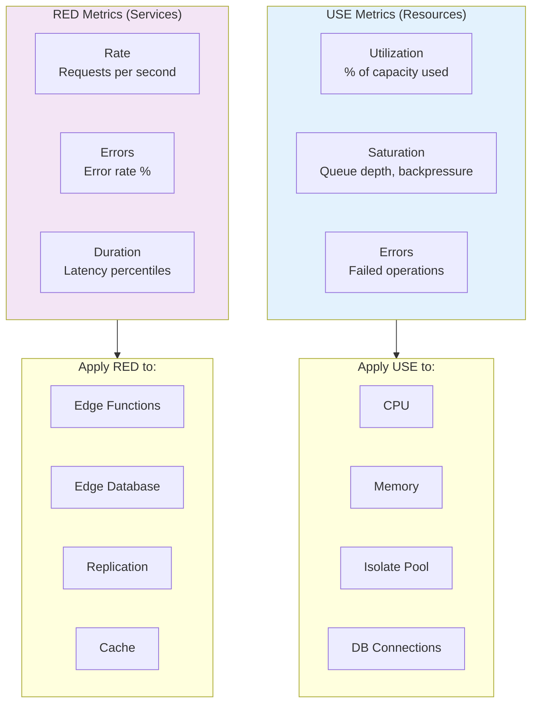
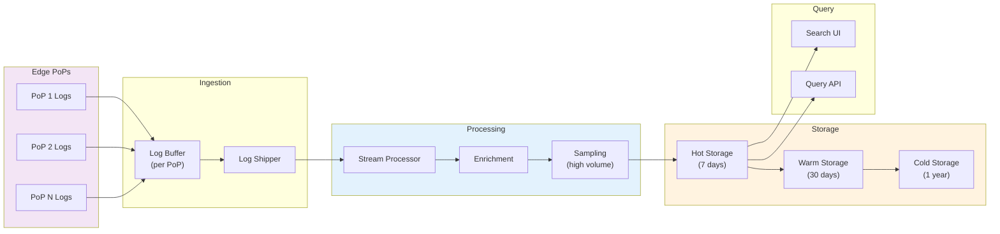
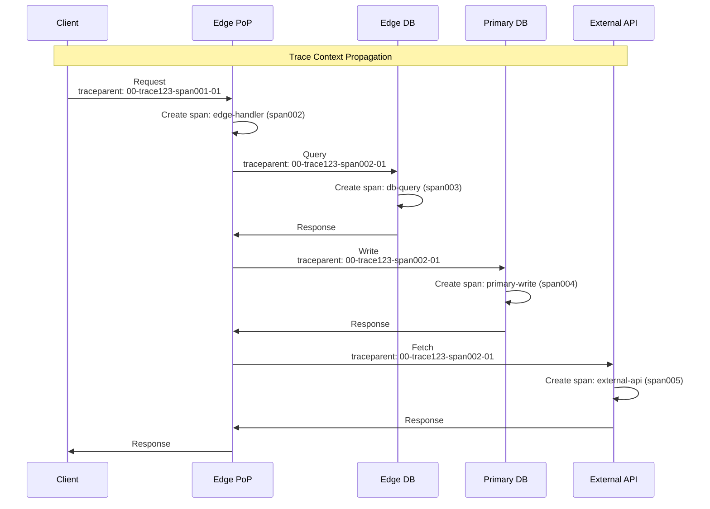

# Observability

[Back to Index](./00-index.md) | [Previous: Security & Compliance](./06-security-and-compliance.md) | [Next: Interview Guide](./08-interview-guide.md)

---

## Metrics

### Key Metrics Framework

The platform uses a combination of **USE** (Utilization, Saturation, Errors) for resources and **RED** (Rate, Errors, Duration) for services.



### Core Metrics

#### Edge Function Metrics

| Metric | Type | Labels | Description |
|--------|------|--------|-------------|
| `edge_function_requests_total` | Counter | function_id, pop, status | Total requests |
| `edge_function_duration_seconds` | Histogram | function_id, pop | Request latency |
| `edge_function_errors_total` | Counter | function_id, pop, error_type | Errors by type |
| `edge_function_cold_starts_total` | Counter | function_id, pop | Cold start count |
| `edge_function_isolate_count` | Gauge | function_id, pop | Active isolates |
| `edge_function_memory_bytes` | Gauge | function_id, pop | Memory usage |
| `edge_function_cpu_time_seconds` | Histogram | function_id, pop | CPU time consumed |

#### Edge Database Metrics

| Metric | Type | Labels | Description |
|--------|------|--------|-------------|
| `edge_db_queries_total` | Counter | db_id, pop, operation | Total queries |
| `edge_db_query_duration_seconds` | Histogram | db_id, pop, operation | Query latency |
| `edge_db_rows_read_total` | Counter | db_id, pop | Rows read |
| `edge_db_rows_written_total` | Counter | db_id | Rows written |
| `edge_db_replication_lag_seconds` | Gauge | db_id, pop | Replication lag |
| `edge_db_replica_position` | Gauge | db_id, pop | WAL position |
| `edge_db_size_bytes` | Gauge | db_id | Database size |

#### Cache Metrics

| Metric | Type | Labels | Description |
|--------|------|--------|-------------|
| `cache_requests_total` | Counter | cache_type, pop, status | Cache requests |
| `cache_hit_ratio` | Gauge | cache_type, pop | Hit rate |
| `cache_size_bytes` | Gauge | cache_type, pop | Cache size |
| `cache_evictions_total` | Counter | cache_type, pop | Evictions |
| `isr_revalidations_total` | Counter | route, pop | ISR revalidations |
| `isr_stale_serves_total` | Counter | route, pop | Stale-while-revalidate serves |

#### Replication Metrics

| Metric | Type | Labels | Description |
|--------|------|--------|-------------|
| `replication_frames_sent_total` | Counter | db_id, region | Frames sent |
| `replication_frames_applied_total` | Counter | db_id, pop | Frames applied |
| `replication_lag_frames` | Gauge | db_id, pop | Frame lag |
| `replication_bandwidth_bytes` | Counter | region | Bandwidth used |
| `replication_errors_total` | Counter | db_id, error_type | Replication errors |

### Dashboard Design

```
┌─────────────────────────────────────────────────────────────────┐
│                    Edge Platform Overview                        │
├─────────────────────────────────────────────────────────────────┤
│                                                                  │
│  ┌─────────────┐  ┌─────────────┐  ┌─────────────┐  ┌─────────┐│
│  │ Request Rate│  │ Error Rate  │  │ p99 Latency │  │ Avail.  ││
│  │   125K/s    │  │   0.02%     │  │   45ms      │  │ 99.99%  ││
│  └─────────────┘  └─────────────┘  └─────────────┘  └─────────┘│
│                                                                  │
│  ┌─────────────────────────────────────────────────────────────┐│
│  │                     Request Rate by PoP                      ││
│  │  [World map with heat overlay showing request distribution]  ││
│  └─────────────────────────────────────────────────────────────┘│
│                                                                  │
│  ┌──────────────────────────┐  ┌───────────────────────────────┐│
│  │   Latency Distribution   │  │    Replication Lag by Region  ││
│  │ p50: 12ms                │  │ US-East:  15ms                ││
│  │ p95: 35ms                │  │ EU-West:  45ms                ││
│  │ p99: 45ms                │  │ APAC:     120ms               ││
│  │ [Histogram visualization]│  │ [Time series graph]           ││
│  └──────────────────────────┘  └───────────────────────────────┘│
│                                                                  │
│  ┌──────────────────────────┐  ┌───────────────────────────────┐│
│  │    Cache Performance     │  │      Top Functions by Load    ││
│  │ ISR Hit Rate: 92%        │  │ 1. /api/products   45K/s      ││
│  │ KV Hit Rate:  78%        │  │ 2. /api/users      32K/s      ││
│  │ Edge DB Hit: 99%         │  │ 3. /api/orders     28K/s      ││
│  │ [Stacked bar chart]      │  │ [Bar chart]                   ││
│  └──────────────────────────┘  └───────────────────────────────┘│
│                                                                  │
└─────────────────────────────────────────────────────────────────┘
```

### Alerting Thresholds

| Alert | Condition | Severity | Action |
|-------|-----------|----------|--------|
| High Error Rate | error_rate > 1% for 5min | Critical | Page on-call |
| High Latency | p99 > 200ms for 5min | Warning | Investigate |
| Replication Lag | lag > 60s for 10min | Warning | Check primary |
| Replication Lag | lag > 300s for 5min | Critical | Page on-call |
| Cold Start Spike | cold_starts > 50% for 5min | Warning | Scale warm pool |
| Primary Down | primary_health = 0 for 30s | Critical | Trigger failover |
| PoP Unhealthy | pop_error_rate > 5% | Warning | Check PoP |
| Cache Hit Rate Low | hit_rate < 50% for 10min | Warning | Review cache config |

---

## Logging

### Log Levels Strategy

| Level | When to Use | Examples |
|-------|-------------|----------|
| **ERROR** | Unrecoverable failures | Uncaught exception, DB connection failure |
| **WARN** | Recoverable issues | Retry succeeded, cache miss, stale data served |
| **INFO** | Normal operations | Request completed, deployment finished |
| **DEBUG** | Detailed debugging | Query details, cache decisions |

### Structured Log Format

```json
{
    "timestamp": "2025-01-15T10:30:45.123Z",
    "level": "INFO",
    "message": "Request completed",
    "service": "edge-function",
    "trace_id": "abc123xyz789",
    "span_id": "def456",
    "request_id": "req_abc123",
    "pop": "sfo1",
    "function_id": "fn_xyz",
    "tenant_id": "tenant_123",
    "http": {
        "method": "GET",
        "path": "/api/products/123",
        "status_code": 200,
        "duration_ms": 45,
        "request_size_bytes": 256,
        "response_size_bytes": 1024
    },
    "db": {
        "queries": 2,
        "total_duration_ms": 12,
        "rows_read": 15,
        "replica_used": true,
        "replica_lag_ms": 50
    },
    "cache": {
        "hits": 1,
        "misses": 1
    },
    "client": {
        "ip_hash": "sha256:...",
        "country": "US",
        "region": "CA"
    }
}
```

### What to Log

| Category | Log | Don't Log |
|----------|-----|-----------|
| **Requests** | Path, method, status, duration | Full request body |
| **Errors** | Error type, stack trace, context | Sensitive error details |
| **Database** | Query duration, rows affected | Full SQL queries with params |
| **Auth** | Login attempts, failures | Passwords, tokens |
| **Business** | Key actions (order placed, etc.) | PII (mask or hash) |

### Log Pipeline



### Real-Time Log Streaming

```
// WebSocket-based log streaming (Deno Deploy model)
FUNCTION stream_logs(tenant_id, filters):
    websocket = create_websocket_connection()

    // Subscribe to log stream
    subscription = log_stream.subscribe({
        tenant_id: tenant_id,
        filters: filters,  // e.g., {level: "ERROR", function_id: "fn_xyz"}
        callback: (log_entry) => {
            websocket.send(JSON.stringify(log_entry))
        }
    })

    // Handle client disconnect
    websocket.on_close(() => {
        subscription.unsubscribe()
    })

// Client usage:
const ws = new WebSocket("wss://logs.edge.app/stream?tenant=123")
ws.onmessage = (event) => {
    const log = JSON.parse(event.data)
    console.log(`[${log.level}] ${log.message}`)
}
```

---

## Distributed Tracing

### Trace Propagation



### Trace Context Format (W3C)

```
// W3C Trace Context headers
traceparent: 00-{trace-id}-{span-id}-{flags}
tracestate: vendor=value

Example:
traceparent: 00-0af7651916cd43dd8448eb211c80319c-b7ad6b7169203331-01
tracestate: edge=sfo1,ryw=1005

// Breakdown:
// 00 = version
// 0af7651916cd43dd8448eb211c80319c = trace ID (16 bytes)
// b7ad6b7169203331 = parent span ID (8 bytes)
// 01 = flags (01 = sampled)
```

### Key Spans to Instrument

| Span Name | Attributes | Duration Includes |
|-----------|------------|-------------------|
| `edge.request` | http.method, http.route, http.status_code | Full request lifecycle |
| `edge.middleware` | middleware.name | Middleware execution |
| `edge.function` | function.id, function.version | Function execution |
| `edge.db.query` | db.system, db.operation, db.rows_affected | Query + network |
| `edge.db.write` | db.system, db.operation | Write to primary |
| `edge.cache.get` | cache.type, cache.hit | Cache lookup |
| `edge.replication.wait` | db.replica_lag | Waiting for replica |
| `edge.fetch` | http.url, http.method | Outbound HTTP |
| `edge.render` | render.type (ssr, isr) | HTML rendering |

### Sampling Strategy

```
FUNCTION should_sample(trace_context, request):
    // Always sample errors
    IF request.resulted_in_error:
        RETURN true

    // Always sample slow requests
    IF request.duration_ms > 500:
        RETURN true

    // Always sample specific paths (debugging)
    IF request.path IN debug_paths:
        RETURN true

    // Head-based sampling for normal traffic
    // Hash trace ID for deterministic sampling
    sample_rate = get_sample_rate(request.tenant_id)  // e.g., 1%
    hash = fnv1a_hash(trace_context.trace_id)
    RETURN (hash % 100) < (sample_rate * 100)

// Sample rates by tier:
// Free: 0.1%
// Pro: 1%
// Enterprise: 10%
```

---

## Alerting

### Alert Categories

#### Critical Alerts (Page-Worthy)

```yaml
alerts:
  - name: PrimaryDatabaseDown
    condition: primary_health_check == 0 for 30s
    severity: critical
    runbook: /runbooks/primary-failover
    notification: pagerduty

  - name: GlobalErrorRateHigh
    condition: global_error_rate > 5% for 3m
    severity: critical
    runbook: /runbooks/high-error-rate
    notification: pagerduty

  - name: ReplicationStopped
    condition: replication_lag_seconds > 300 for 5m
    severity: critical
    runbook: /runbooks/replication-failure
    notification: pagerduty
```

#### Warning Alerts

```yaml
alerts:
  - name: HighLatency
    condition: p99_latency_ms > 200 for 5m
    severity: warning
    runbook: /runbooks/high-latency
    notification: slack

  - name: CacheHitRateLow
    condition: cache_hit_rate < 50% for 10m
    severity: warning
    runbook: /runbooks/cache-performance
    notification: slack

  - name: HighColdStartRate
    condition: cold_start_rate > 30% for 5m
    severity: warning
    runbook: /runbooks/cold-starts
    notification: slack

  - name: PoPUnhealthy
    condition: pop_error_rate > 3% for 5m
    severity: warning
    runbook: /runbooks/pop-health
    notification: slack
```

### Runbook Template

```markdown
# Runbook: High Replication Lag

## Alert
`replication_lag_seconds > 60 for 10min`

## Impact
- Users may see stale data
- Read-your-writes guarantee may fail
- May cause fallback to primary (increased latency)

## Diagnosis
1. Check primary database health
   ```
   curl https://api.edge.app/internal/health/primary
   ```

2. Check replication lag per region
   ```
   curl https://api.edge.app/internal/metrics/replication-lag
   ```

3. Check network connectivity
   ```
   curl https://api.edge.app/internal/health/network
   ```

## Common Causes
1. Primary overloaded (high write volume)
2. Network partition between regions
3. Replica disk full
4. Replication manager failure

## Resolution Steps

### If primary overloaded:
1. Scale primary vertically or shard
2. Implement write batching

### If network partition:
1. Check cloud provider status page
2. Verify BGP routes
3. Contact network team

### If replica disk full:
1. Increase disk allocation
2. Clean up old WAL files

### If replication manager failure:
1. Restart replication manager
2. If persists, rebuild replica from snapshot

## Escalation
If not resolved in 30 minutes, escalate to:
- Primary: @database-team
- Secondary: @platform-team
```

---

## Observability Best Practices

### Correlation IDs

```
// Ensure all related logs/traces share IDs
Request Flow:
1. Client sends request
2. Edge generates request_id, extracts/generates trace_id
3. All logs include: {request_id, trace_id, span_id}
4. Database queries tagged with trace context
5. Errors include full context for debugging

// Example correlated log query:
SELECT * FROM logs
WHERE trace_id = 'abc123'
ORDER BY timestamp ASC

// Returns all logs across all services for this request
```

### Cardinality Management

```
// HIGH cardinality (avoid in labels):
// - user_id (millions of unique values)
// - request_id (unique per request)
// - IP address

// LOW cardinality (good for labels):
// - function_id (hundreds)
// - pop (tens)
// - status_code (tens)
// - error_type (tens)

// Rule of thumb: Label values < 1000
// For high-cardinality data, use logs not metrics
```

### Cost Optimization

| Data Type | Retention | Sampling | Cost Driver |
|-----------|-----------|----------|-------------|
| Metrics (raw) | 30 days | None | Cardinality |
| Metrics (aggregated) | 1 year | Downsampled | Storage |
| Logs (debug) | 3 days | 1% | Volume |
| Logs (info) | 7 days | 10% | Volume |
| Logs (error) | 30 days | 100% | Volume |
| Traces | 7 days | 1-10% | Storage |

---

## Interview Tips: Observability Phase

### Key Points to Cover

1. **Metrics**: USE for resources, RED for services
2. **Logging**: Structured, correlated, sampled for high volume
3. **Tracing**: W3C trace context, key spans, sampling strategy
4. **Alerting**: Multi-tier (critical vs warning), runbooks

### Common Follow-up Questions

- "How do you debug a slow request?" → Trace ID → spans → identify slow component
- "How do you handle high-cardinality metrics?" → Use logs for high-cardinality, labels for low
- "How do you correlate logs across services?" → Request ID + Trace ID propagation
- "How do you reduce observability costs?" → Sampling, tiered retention, aggregation

### Red Flags to Avoid

- No distributed tracing across edge and primary
- Logging PII without masking
- No alerting on replication lag
- No runbooks for critical alerts

---

**Next: [08 - Interview Guide](./08-interview-guide.md)**
