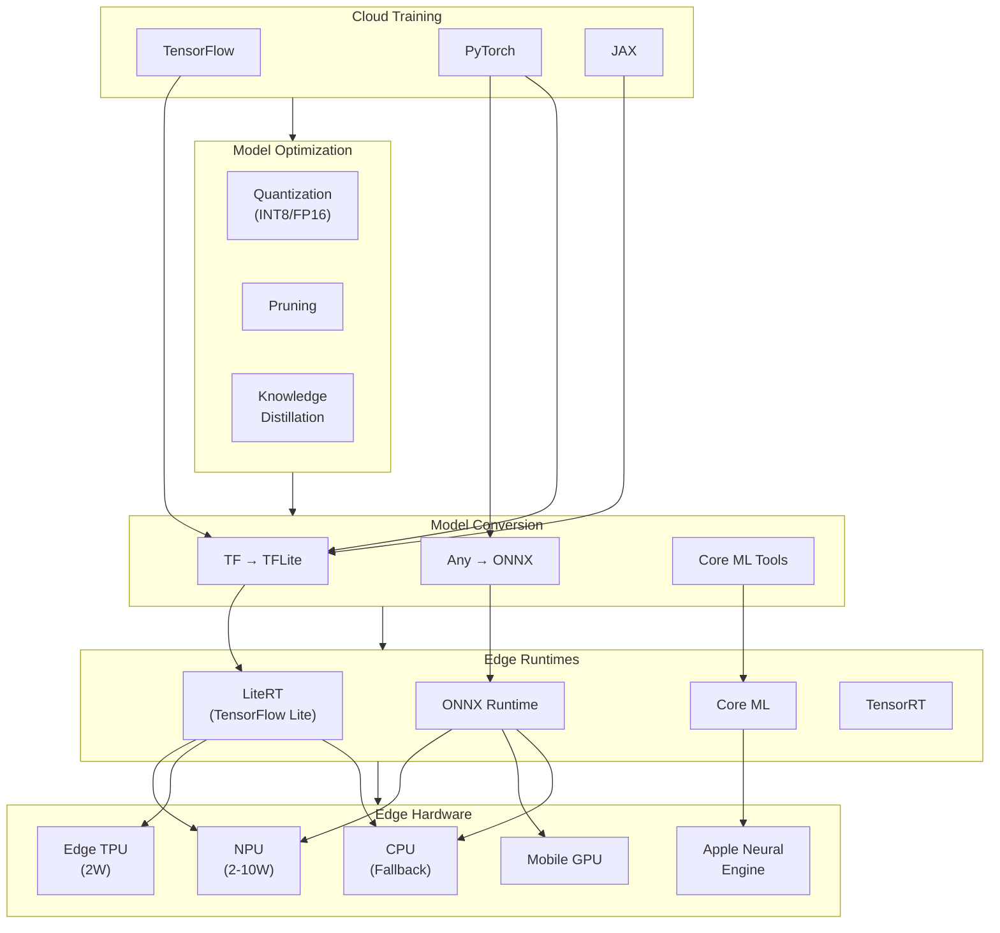

# Edge AI/ML Inference

## Overview

Edge AI/ML Inference enables machine learning model execution directly on edge devices—smartphones, IoT sensors, autonomous vehicles, and embedded systems—rather than relying on cloud infrastructure. This architectural approach delivers sub-10ms inference latency, preserves user privacy by keeping data on-device, enables offline operation, and eliminates per-inference cloud costs.

The system encompasses the complete lifecycle: model training in the cloud, compression and optimization for edge deployment (quantization, pruning, knowledge distillation), distribution to heterogeneous device fleets, on-device inference using hardware accelerators (NPUs, TPUs), and federated learning for privacy-preserving model improvement across millions of devices.

---

## Key Characteristics

| Characteristic | Value | Implication |
|----------------|-------|-------------|
| Inference Latency | < 10ms on-device | Real-time applications (camera, voice, driving) |
| Model Size | 10MB - 3GB compressed | Device storage and memory constraints |
| Power Consumption | 2-10W (NPU) vs 50-700W (GPU) | Battery life and thermal limits |
| Connectivity | 0-100% uptime | Must operate fully offline |
| Hardware Heterogeneity | NPU, TPU, GPU, CPU variants | Multi-target compilation required |
| Privacy Model | On-device processing | Raw data never leaves device |
| Fleet Scale | Millions to billions of devices | Distributed model updates and telemetry |

---

## Quick Navigation

| Document | Description |
|----------|-------------|
| [01 - Requirements & Estimations](./01-requirements-and-estimations.md) | Functional/non-functional requirements, capacity planning, SLOs |
| [02 - High-Level Design](./02-high-level-design.md) | System architecture, data flows, key decisions |
| [03 - Low-Level Design](./03-low-level-design.md) | Data models, APIs, algorithms (quantization, FedAvg) |
| [04 - Deep Dive & Bottlenecks](./04-deep-dive-and-bottlenecks.md) | Quantization pipeline, hardware abstraction, FL orchestration |
| [05 - Scalability & Reliability](./05-scalability-and-reliability.md) | Fleet scaling, fault tolerance, disaster recovery |
| [06 - Security & Compliance](./06-security-and-compliance.md) | Threat model, differential privacy, secure aggregation |
| [07 - Observability](./07-observability.md) | Metrics, logging, alerting for edge fleets |
| [08 - Interview Guide](./08-interview-guide.md) | 45-min pacing, trap questions, quick reference |

---

## Complexity Rating

| Aspect | Complexity | Reason |
|--------|------------|--------|
| Model Compression | High | INT8/FP16 quantization accuracy trade-offs, calibration requirements |
| Federated Learning | High | Secure aggregation, non-IID data handling, client dropout |
| Hardware Abstraction | High | NPU/TPU/CPU variance, delegate selection, operator coverage |
| Model Distribution | Medium | OTA updates, staged rollouts, version management |
| Inference Optimization | Medium | Runtime selection, batching, memory mapping |
| Overall | **High** | Combines ML optimization with distributed systems at scale |

---

## Technology Comparison

### ML Inference Runtimes

| Runtime | Platforms | Quantization | Model Formats | Best For |
|---------|-----------|--------------|---------------|----------|
| **LiteRT (TensorFlow Lite)** | Android, iOS, Linux, MCU | INT8, FP16, dynamic | TFLite, SavedModel | Cross-platform mobile/IoT |
| **ONNX Runtime** | All major platforms | INT8, FP16, FP8 | ONNX | Framework interoperability |
| **Core ML** | iOS, macOS, watchOS | INT8, FP16, palettization | mlmodel, mlpackage | Apple ecosystem native |
| **TensorRT** | NVIDIA GPUs | INT8, FP16 | TRT engines | High-performance GPU inference |
| **PyTorch Mobile** | Android, iOS | QINT8, dynamic | TorchScript | Research-to-production |

### Quantization Techniques

| Technique | Memory Reduction | Accuracy Impact | Complexity |
|-----------|------------------|-----------------|------------|
| **FP16** | 50% | Minimal (< 0.1%) | Low |
| **INT8 PTQ** | 75% | Low (0.5-2%) | Medium |
| **INT8 QAT** | 75% | Minimal (< 0.5%) | High |
| **INT4** | 87.5% | Moderate (2-5%) | High |
| **Mixed Precision** | 60-70% | Minimal | Medium |

### Hardware Accelerators

| Accelerator | Power | Performance | Use Case |
|-------------|-------|-------------|----------|
| **NPU (Neural Engine)** | 2-10W | 1-50 TOPS | Mobile, IoT, always-on |
| **Edge TPU** | 2W | 4 TOPS | Low-power edge inference |
| **Mobile GPU** | 5-15W | 1-5 TFLOPS | Graphics + ML hybrid |
| **CPU (optimized)** | 1-10W | Variable | Fallback, universal support |
| **Custom ASIC** | Variable | 10-100+ TOPS | Autonomous vehicles, robotics |

---

## Technology Landscape

---

## Key Design Decisions Summary

| Decision | Options | Recommendation | Rationale |
|----------|---------|----------------|-----------|
| **Primary Runtime** | LiteRT, ONNX, CoreML | Platform-specific (LiteRT for Android, CoreML for iOS) | Native optimization, hardware delegate support |
| **Quantization** | PTQ vs QAT | QAT for production, PTQ for prototyping | QAT achieves < 0.5% accuracy loss |
| **FL Algorithm** | FedAvg, FedProx, SCAFFOLD | FedAvg + secure aggregation | Proven at scale, privacy-preserving |
| **Model Format** | Universal vs platform-specific | Platform-specific with ONNX as interchange | Better optimization per platform |
| **Distribution** | Push vs Pull | Pull with push notification | Device autonomy, bandwidth control |
| **Hardware Fallback** | Strict vs graceful | Graceful degradation (NPU → GPU → CPU) | Ensures universal compatibility |

---

## Interview Quick Reference

### Must-Know Concepts

| Concept | Key Point |
|---------|-----------|
| **Quantization** | INT8 = 75% memory reduction with < 1% accuracy loss using QAT |
| **Federated Learning** | Train across devices without centralizing data; secure aggregation prevents gradient exposure |
| **Hardware Abstraction** | Delegates/providers map operators to NPU/GPU/CPU transparently |
| **Model Distribution** | OTA updates with staged rollouts, checksum validation, atomic swap |
| **Offline Operation** | Full inference capability without network connectivity |

### Key Trade-offs

| Trade-off | Consideration |
|-----------|--------------|
| **Accuracy vs Size** | More aggressive quantization = smaller model but potential accuracy loss |
| **Latency vs Power** | NPU is fast but drains battery; balance with CPU for background tasks |
| **Privacy vs Learning** | Stronger DP guarantees = more noise = slower convergence |
| **Generalization vs Personalization** | Global model vs on-device fine-tuning trade-off |

### Red Flags in Interviews

- Assuming cloud inference for latency-sensitive applications
- Ignoring hardware heterogeneity across device fleet
- Treating federated learning as standard distributed training
- Forgetting offline operation requirements
- Not considering model update failure scenarios

---

## Real-World Systems

| System | Approach | Scale | Key Innovation |
|--------|----------|-------|----------------|
| **Apple Intelligence** | On-device 3B param foundation model | Billions of devices | Apple Neural Engine optimization, 33 tok/s on M1 Max |
| **Tesla FSD** | Custom AI5 chip for autonomous driving | Millions of vehicles | 40x speedup, 10x cheaper than H100 inference |
| **Google Pixel** | Tensor TPU for on-device ML | 100M+ devices | Real-time translation, photo enhancement |
| **Google Keyboard (Gboard)** | Federated learning for next-word prediction | Billions of users | Privacy-preserving personalization |
| **Meta Smart Glasses** | NPU inference for real-time translation | Millions of devices | Sub-100ms latency |

---

## Related System Designs

| Design | Relevance |
|--------|-----------|
| [2.8 - Edge Computing Platform](../2.8-edge-computing-platform/00-index.md) | Infrastructure for edge workloads, V8 isolates |
| [2.12 - Edge-Native Application Platform](../2.12-edge-native-application-platform/00-index.md) | Edge database, global state, low latency |
| [1.15 - Content Delivery Network](../1.15-content-delivery-network-cdn/00-index.md) | Model distribution via CDN |
| [5.2 - ML Models Deployment System](../5.2-ml-models-deployment-system/00-index.md) | Cloud ML serving patterns (future) |

---

## Key Numbers to Remember

| Metric | Value | Context |
|--------|-------|---------|
| INT8 memory reduction | ~75% vs FP32 | Standard quantization benefit |
| NPU power consumption | 2-10W | vs 50-700W for datacenter GPUs |
| Apple on-device LLM | 3B params | Running at 33 tokens/sec on M1 Max |
| Tesla AI5 speedup | 40x | Compared to previous generation |
| Typical FL participation | 10-20% | Of eligible fleet per round |
| Model cold start | < 2 seconds | First inference after app launch |
| Target inference latency | < 30ms | For real-time vision applications |

---

[Next: 01 - Requirements & Estimations →](./01-requirements-and-estimations.md)
