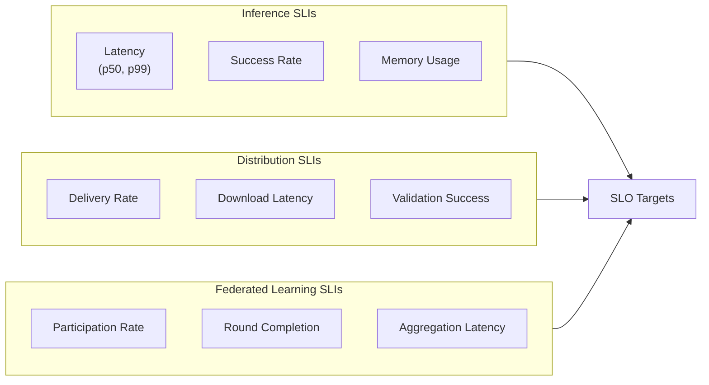

# Requirements & Estimations

[← Previous: Index](./00-index.md) | [Next: High-Level Design →](./02-high-level-design.md)

---

## Functional Requirements

### P0 - Must Have (Core Functionality)

| ID | Requirement | Description |
|----|-------------|-------------|
| FR-1 | On-Device Inference | Execute ML models locally without network connectivity |
| FR-2 | Model Distribution | Deploy and update models to edge devices over-the-air |
| FR-3 | Model Quantization | Compress models (INT8, FP16) for edge hardware constraints |
| FR-4 | Hardware Abstraction | Single API across NPU, TPU, GPU, and CPU backends |
| FR-5 | Offline Operation | Full inference functionality without network connectivity |
| FR-6 | Model Versioning | Track model versions, support A/B testing and rollback |
| FR-7 | Model Validation | Verify model integrity (checksum) before loading |
| FR-8 | Graceful Fallback | Degrade to CPU if NPU/GPU unavailable |

### P1 - Should Have (Enhanced Functionality)

| ID | Requirement | Description |
|----|-------------|-------------|
| FR-9 | Federated Learning | Train models across devices without centralizing data |
| FR-10 | Secure Aggregation | Privacy-preserving gradient aggregation for FL |
| FR-11 | Model Caching | Efficient local storage with LRU eviction |
| FR-12 | Batch Inference | Process multiple inputs efficiently |
| FR-13 | Dynamic Quantization | Runtime precision adjustment based on hardware |
| FR-14 | Feature Extraction | On-device preprocessing and feature computation |
| FR-15 | Staged Rollout | Gradual model deployment (1% → 10% → 100%) |

### P2 - Nice-to-Have (Advanced Features)

| ID | Requirement | Description |
|----|-------------|-------------|
| FR-16 | Knowledge Distillation | Train smaller student models from larger teachers |
| FR-17 | Neural Architecture Search | Auto-optimize model architecture for target hardware |
| FR-18 | Continuous Learning | On-device model fine-tuning without full retraining |
| FR-19 | Model Composition | Combine multiple models for complex pipelines |
| FR-20 | Personalization Layer | User-specific model adaptation while preserving privacy |

### Out of Scope

| Exclusion | Rationale |
|-----------|-----------|
| Full model training on edge | Compute/memory constraints; only fine-tuning supported |
| GPU-class workloads on mobile | Power/thermal limits; cloud offload for heavy inference |
| Real-time video training | Bandwidth and compute prohibitive |
| Custom hardware design | Focus on software abstractions over existing hardware |
| Model architecture research | Use established architectures (MobileNet, EfficientNet) |

---

## Non-Functional Requirements

### Performance Requirements

| Metric | Target | Rationale |
|--------|--------|-----------|
| **Inference Latency (Vision)** | < 30ms p99 | Real-time camera applications (30 FPS) |
| **Inference Latency (NLP)** | < 100ms p99 | Conversational AI responsiveness |
| **LLM Token Generation** | > 20 tokens/sec | Readable text generation speed |
| **Model Load Time** | < 500ms | App responsiveness on launch |
| **Cold Start (First Inference)** | < 2s | Time from app launch to first result |
| **Warm Inference** | < 10ms p50 | Subsequent inferences after model loaded |

### Resource Constraints

| Resource | Limit | Rationale |
|----------|-------|-----------|
| **Model Size (Mobile)** | < 500MB | Device storage constraints |
| **Model Size (Embedded)** | < 50MB | IoT/MCU flash limits |
| **Runtime Memory** | < 2GB | Shared device memory with OS and apps |
| **Peak Memory (Inference)** | < 500MB | Avoid OOM during inference |
| **Power (Continuous)** | < 5W | Battery life for mobile devices |
| **Power (Burst)** | < 15W | Thermal throttling limits |
| **CPU Utilization** | < 30% sustained | Background operation without UI impact |

### Availability & Reliability

| Metric | Target | Measurement |
|--------|--------|-------------|
| **Inference Success Rate** | 99.9% | Per device per day |
| **Model Load Success** | 99.99% | Per load attempt |
| **FL Round Completion** | 95% | Per participating device |
| **Model Update Delivery** | 99.5% within 24h | Staged rollout completion |
| **Offline Availability** | 100% | Core inference without network |

### Scalability Targets

| Metric | Target | Context |
|--------|--------|---------|
| **Device Fleet** | 1B+ devices | Global mobile deployment |
| **Models per Device** | 10-50 | Multiple features using ML |
| **Inferences per Day per Device** | 1K-100K | Vision, voice, text combined |
| **FL Participants per Round** | 10K-1M | Subset of eligible devices |
| **Model Update Frequency** | Weekly-Monthly | Continuous improvement cycle |

### Consistency Model

| Aspect | Model | Justification |
|--------|-------|---------------|
| **Model Version** | Eventual consistency | Staged rollouts; devices update at different times |
| **Inference Results** | Strong (local) | Deterministic on-device execution |
| **FL Gradients** | Causal consistency | Rounds complete in order |
| **Telemetry** | Best-effort | Sampling acceptable for metrics |

---

## Capacity Estimations

### Assumptions

| Parameter | Value | Basis |
|-----------|-------|-------|
| Active device fleet | 100 million | Mid-size deployment |
| Models per device | 5 | Vision, NLP, recommendation, etc. |
| Average model size | 100MB | After quantization |
| Inferences per device/day | 1,000 | Mix of use cases |
| FL participation rate | 10% | Per round |
| FL rounds per week | 7 | Daily improvement cycle |
| Model update frequency | Bi-weekly | New versions |
| Telemetry sample rate | 1% | Privacy-preserving sampling |

### Inference Volume

```
Daily Inferences = Devices × Inferences per Day
                 = 100,000,000 × 1,000
                 = 100 billion inferences/day

Peak QPS (assuming 8-hour active window):
Peak QPS = Daily Inferences / (8 × 3,600)
         = 100B / 28,800
         = 3.5 million inferences/second (distributed across devices)
```

### Model Distribution

```
Model Update (Full Fleet):
Storage per Device = 5 models × 100MB = 500MB
Full Fleet Storage = 100M × 500MB = 50 PB (theoretical max)

Bi-weekly Update (Staged 10% → 50% → 100%):
Day 1:  10M devices × 100MB = 1 PB
Day 3:  50M devices × 100MB = 5 PB
Day 7: 100M devices × 100MB = 10 PB

CDN Bandwidth (Peak Day):
= 50M devices × 100MB / 86,400 seconds
= 5 PB / 86,400
= 58 GB/s (absorbed by CDN edge caching)
```

### Federated Learning

```
FL Round Participation:
Eligible Devices = 100M × 50% (meets conditions: WiFi, charging, idle) = 50M
Selected per Round = 50M × 10% = 5M devices

Gradient Upload per Round:
Compressed Gradient Size = 10MB (100MB model, 10:1 compression)
Total Upload = 5M × 10MB = 50 TB per round

Aggregation Compute:
Model Parameters = 25M (typical MobileNet)
Gradients to Aggregate = 5M
Compute = O(participants × parameters) = O(5M × 25M) = O(125 trillion ops)
= ~1000 GPU-hours per round
```

### Telemetry

```
Telemetry Events per Device/Day:
- Inference count: 1
- Latency histogram: 1
- Error events: ~0.1
- Model load events: ~5

Total Events per Day:
= 100M devices × 7 events × 1% sample
= 7 million events/day

Storage (30-day retention):
= 7M × 30 × 1KB average
= 210 GB
```

### Capacity Summary

| Resource | Estimation | Calculation |
|----------|------------|-------------|
| Daily Inferences | 100 billion | 100M devices × 1K/day |
| Peak Inference QPS | 3.5M/sec | Distributed across fleet |
| Model Storage (Fleet) | 50 PB | 100M × 5 × 100MB |
| CDN Peak Bandwidth | 58 GB/s | 50M updates/day × 100MB |
| FL Round Upload | 50 TB | 5M participants × 10MB |
| FL Aggregation Compute | 1000 GPU-hrs/round | O(5M × 25M params) |
| Telemetry Storage | 210 GB/month | 7M events/day × 30 × 1KB |

---

## SLOs & SLAs

### Service Level Indicators (SLIs)



### SLO Targets

| Category | SLI | SLO Target | Measurement Window |
|----------|-----|------------|-------------------|
| **Inference** | Latency (p99) | < 30ms (vision), < 100ms (NLP) | Per device/day |
| **Inference** | Success Rate | > 99.9% | Per device/day |
| **Inference** | Model Load Success | > 99.99% | Per attempt |
| **Distribution** | Update Delivery | > 99.5% within 24h | Per rollout |
| **Distribution** | Download Success | > 99.9% | Per attempt |
| **FL** | Round Completion | > 95% | Per round |
| **FL** | Aggregation Latency | < 1 hour | Per round |

### SLA Tiers

| Tier | Inference SLA | Distribution SLA | FL SLA | Support |
|------|---------------|------------------|--------|---------|
| **Free/Consumer** | Best-effort | Weekly updates | N/A | Community |
| **Pro** | 99.5% success | 48h delivery | Optional | Email |
| **Enterprise** | 99.9% success | 24h delivery | Included | 24/7 |
| **Critical** | 99.99% success | 4h delivery | Priority | Dedicated |

### Error Budget

```
Monthly Error Budget (99.9% SLA):
Allowed Failures = 1,000,000 inferences × 0.1% = 1,000 failures/day

Weekly Error Budget Consumption:
- Model load failures: 100 (10%)
- NPU unavailable fallback: 500 (50%)
- OOM errors: 200 (20%)
- Timeout errors: 100 (10%)
- Other: 100 (10%)

Remaining Budget: 0 (healthy)
```

---

## Cost Model

### Cost Dimensions

| Component | Cost Driver | Estimation |
|-----------|-------------|------------|
| **Model Training** | GPU-hours | $2-5 per training run |
| **Quantization** | CPU-hours | $0.10 per model |
| **CDN Distribution** | Bandwidth | $0.02 per GB |
| **FL Aggregation** | GPU-hours | $50-100 per round |
| **Telemetry Storage** | GB-months | $0.02 per GB |
| **Model Registry** | Storage | $0.01 per GB-month |

### Cost Optimization Strategies

| Strategy | Savings | Trade-off |
|----------|---------|-----------|
| **Delta Updates** | 80-90% bandwidth | Complexity in patching |
| **Staged Rollouts** | Reduced blast radius | Slower full deployment |
| **Telemetry Sampling** | 99% reduction | Less granular data |
| **Hierarchical FL** | 50-70% aggregation compute | Added complexity |
| **Model Caching (CDN)** | 60-80% origin bandwidth | Cache invalidation |

---

## Interview Tips: Requirements Phase

### Questions to Ask Interviewer

1. "What types of ML models? Vision, NLP, recommendation, generative?"
2. "What are the target devices? Mobile, IoT, automotive, embedded?"
3. "Is federated learning a requirement or nice-to-have?"
4. "What's the acceptable accuracy loss from quantization?"
5. "Is offline operation mandatory?"
6. "What's the expected fleet size and geographic distribution?"
7. "Are there regulatory requirements (GDPR, HIPAA)?"

### Estimation Shortcuts

| Metric | Quick Estimate |
|--------|----------------|
| Model size after INT8 | Original ÷ 4 |
| Inference speedup (NPU vs CPU) | 10-50x |
| FL round bandwidth | Participants × Compressed Model Size |
| CDN cost | $0.02/GB for first 10TB/month |
| Memory for inference | ~2x model size (weights + activations) |

### Red Flags to Avoid

- Ignoring offline operation requirements
- Assuming homogeneous hardware across fleet
- Not considering battery/power constraints
- Forgetting model validation and integrity checks
- Over-promising FL convergence speed

---

[← Previous: Index](./00-index.md) | [Next: High-Level Design →](./02-high-level-design.md)
