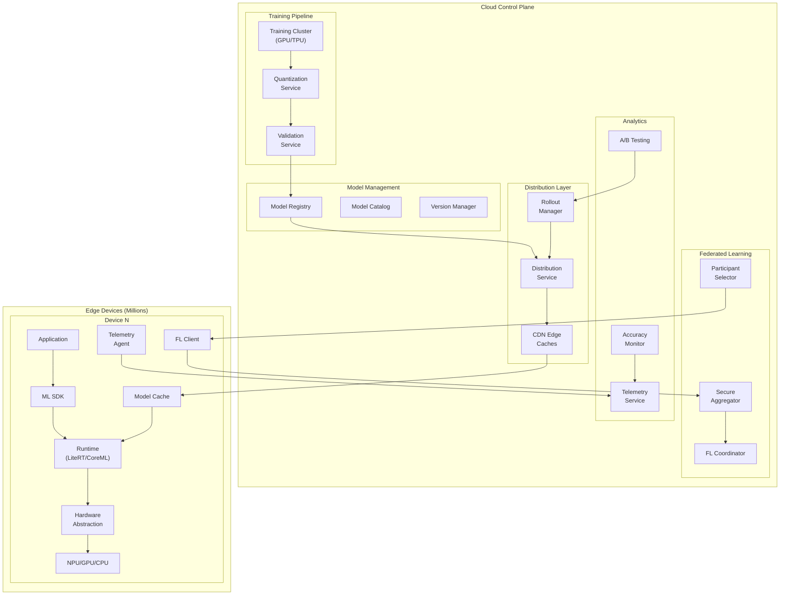
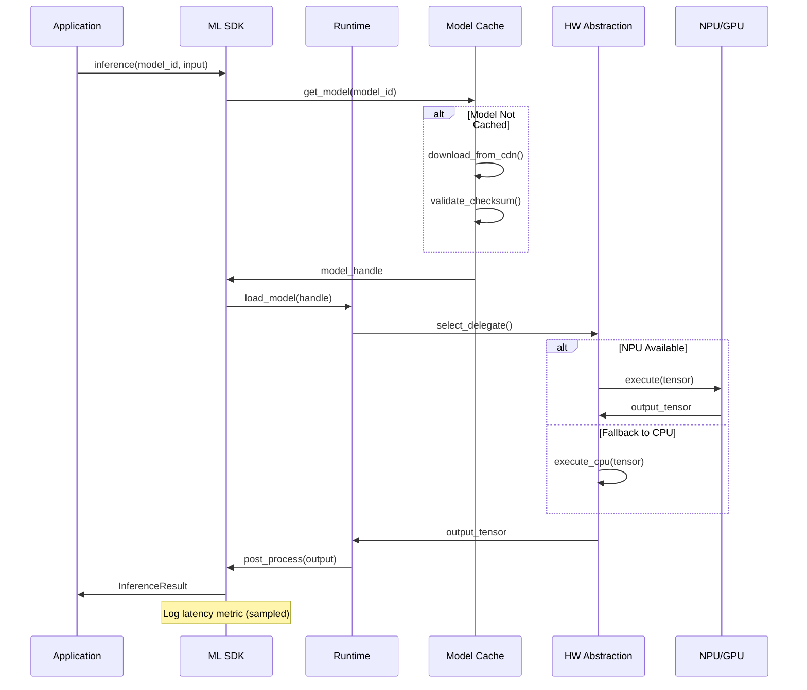
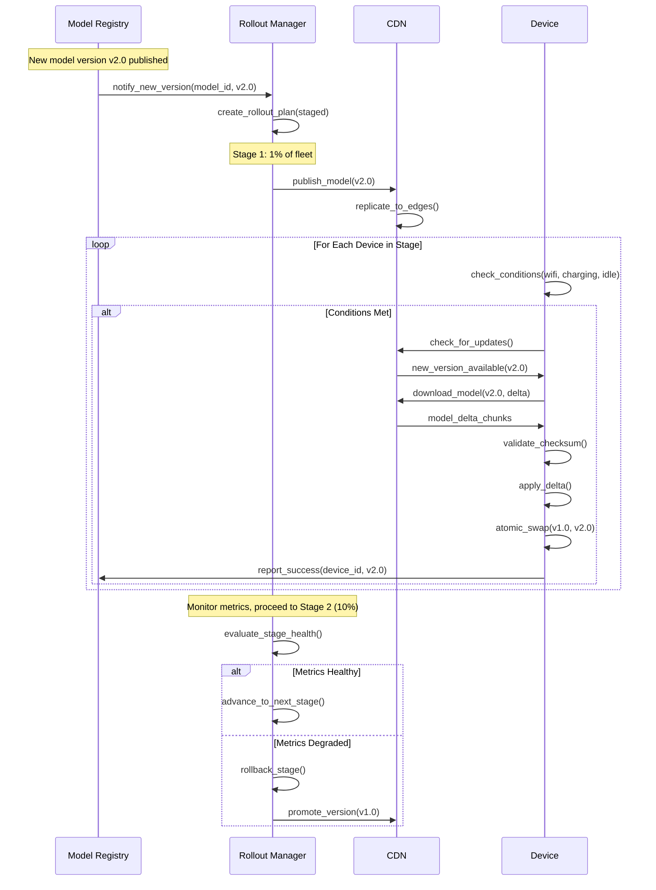
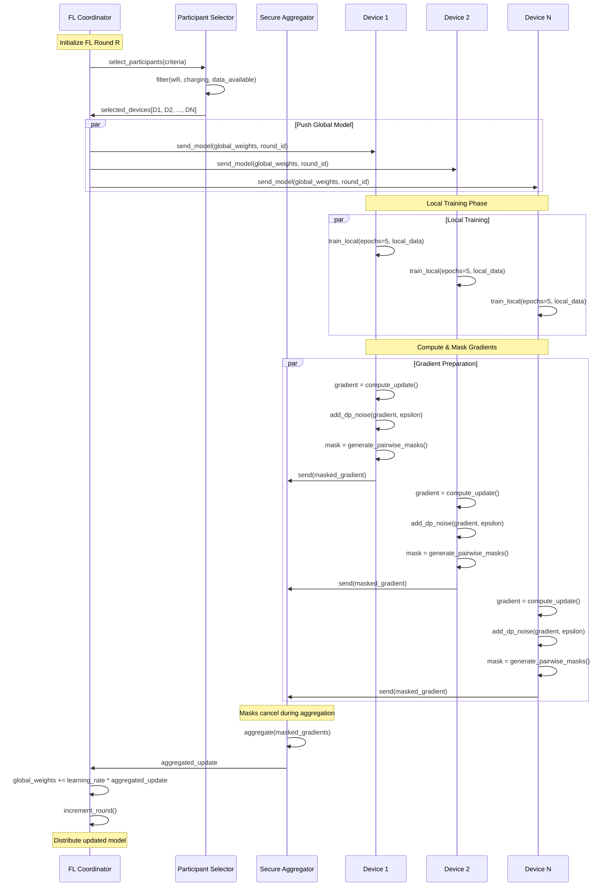
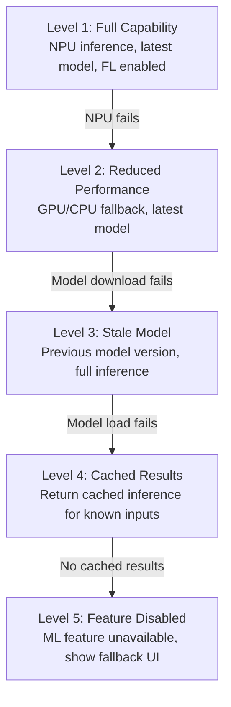

# High-Level Design

[← Previous: Requirements](./01-requirements-and-estimations.md) | [Next: Low-Level Design →](./03-low-level-design.md)

---

## System Architecture

---

## Core Components

### Cloud Components

| Component | Responsibility | Key Technologies |
|-----------|---------------|------------------|
| **Training Cluster** | Train base models on large datasets | GPU/TPU clusters, distributed training |
| **Quantization Service** | Convert FP32 → INT8/FP16, calibrate | TF Model Optimization Toolkit, ONNX Quantization |
| **Validation Service** | Test quantized models, measure accuracy loss | Automated test suites, benchmark datasets |
| **Model Registry** | Store versioned models with metadata | Object storage, metadata DB |
| **Distribution Service** | Orchestrate model delivery to devices | CDN integration, staged rollouts |
| **FL Coordinator** | Manage federated learning rounds | Task scheduling, round orchestration |
| **Secure Aggregator** | Privacy-preserving gradient aggregation | Secure aggregation protocol, DP |
| **Telemetry Service** | Collect and analyze inference metrics | Time-series DB, streaming analytics |

### Edge Components

| Component | Responsibility | Key Technologies |
|-----------|---------------|------------------|
| **ML SDK** | High-level API for applications | Platform-specific SDKs |
| **Runtime** | Execute model inference | LiteRT, Core ML, ONNX Runtime |
| **Model Cache** | Store and manage local models | Local storage, LRU eviction |
| **Hardware Abstraction** | Map operations to hardware | Delegates, execution providers |
| **FL Client** | Local training and gradient computation | On-device training, DP noise |
| **Telemetry Agent** | Sample and report metrics | Batched upload, privacy filtering |

---

## Data Flow Diagrams

### Inference Flow

### Model Distribution Flow

### Federated Learning Flow

---

## Key Architectural Decisions

### Decision 1: ML Runtime Selection

| Option | Pros | Cons |
|--------|------|------|
| **LiteRT (TensorFlow Lite)** | Broad device support, mature ecosystem, Google backing | Larger SDK size, TF-centric |
| **ONNX Runtime** | Framework-agnostic, cross-platform | Less mobile-optimized than native |
| **Core ML** | Best Apple silicon optimization, OS integration | Apple-only |
| **Custom Runtime** | Full control, minimal size | Massive development effort |

**Recommendation:** Platform-specific approach
- **Android:** LiteRT with GPU/NNAPI delegates
- **iOS:** Core ML for Apple Neural Engine optimization
- **Cross-platform fallback:** ONNX Runtime

**Rationale:** Native runtimes leverage hardware-specific optimizations that generic runtimes cannot match. The 2-3x performance difference justifies maintaining platform-specific integrations.

### Decision 2: Quantization Strategy

| Option | Memory Reduction | Accuracy Impact | Complexity |
|--------|------------------|-----------------|------------|
| **Post-Training Quantization (PTQ)** | 75% (INT8) | 0.5-3% loss | Low |
| **Quantization-Aware Training (QAT)** | 75% (INT8) | < 0.5% loss | High |
| **Dynamic Quantization** | 50% (weights only) | Minimal | Low |
| **Mixed Precision** | 60% | Minimal | Medium |

**Recommendation:** QAT for production models, PTQ for rapid prototyping

**Rationale:** QAT requires retraining but achieves < 0.5% accuracy loss vs 2-3% for PTQ. For production models deployed to billions of devices, the additional training cost is justified.

### Decision 3: Federated Learning Algorithm

| Option | Convergence | Communication | Non-IID Handling |
|--------|-------------|---------------|------------------|
| **FedAvg** | Good | Low | Poor |
| **FedProx** | Good | Low | Better |
| **SCAFFOLD** | Better | Higher | Good |
| **FedAdam** | Fast | Medium | Good |

**Recommendation:** FedAvg with secure aggregation and differential privacy

**Rationale:** FedAvg is battle-tested at Google scale (Gboard). Non-IID issues addressed through client weighting and personalization layers rather than algorithm complexity.

### Decision 4: Model Distribution Strategy

| Option | Bandwidth | Complexity | Rollback Speed |
|--------|-----------|------------|----------------|
| **Full Model Push** | High | Low | Fast |
| **Delta Updates** | Low (80-90% savings) | High | Slower |
| **Pull on Demand** | Distributed over time | Low | Fast |
| **Hybrid (Pull + Delta)** | Low | Medium | Fast |

**Recommendation:** Pull-based with delta updates and push notifications

**Rationale:** Pull respects device conditions (WiFi, charging), delta updates reduce bandwidth 80-90%, push notifications trigger checks when new versions available.

### Decision 5: Hardware Fallback Strategy

| Option | Latency Impact | Reliability | Complexity |
|--------|----------------|-------------|------------|
| **Strict (Fail if NPU unavailable)** | None | Poor | Low |
| **Graceful (NPU → GPU → CPU)** | Variable | High | Medium |
| **Adaptive (Choose based on conditions)** | Optimized | High | High |

**Recommendation:** Graceful degradation with user notification

**Rationale:** Device heterogeneity is extreme. 20-30% of devices may lack NPU support. Graceful fallback ensures universal functionality while adaptive optimization handles varying conditions.

---

## Architecture Pattern Checklist

| Pattern | Decision | Rationale |
|---------|----------|-----------|
| **Sync vs Async** | Async for model distribution, sync for inference | Distribution is background; inference is blocking |
| **Push vs Pull** | Pull-based distribution with push notifications | Device autonomy, bandwidth control |
| **Stateless vs Stateful** | Stateless runtime, stateful cache | Runtime can restart; cache persists models |
| **Read-heavy vs Write-heavy** | Read-heavy (inference >> training) | 1000:1 read:write ratio typical |
| **Real-time vs Batch** | Real-time inference, batch FL training | User-facing requires real-time |
| **Edge vs Cloud** | Edge for inference, cloud for training/aggregation | Latency and privacy requirements |

---

## Failure Modes & Mitigations

| Failure Mode | Impact | Detection | Mitigation |
|--------------|--------|-----------|------------|
| **Model Corruption** | Inference fails or produces garbage | Checksum mismatch | Re-download, fallback to previous version |
| **NPU Unavailable** | Slow inference | Hardware probe fails | Graceful fallback to GPU/CPU |
| **OOM During Inference** | App crash | Memory monitoring | Memory-mapped models, reduce batch size |
| **Model Download Fails** | Can't update | Retry count exceeded | CDN failover, resume download |
| **FL Client Dropout** | Incomplete round | Heartbeat timeout | Minimum participation threshold |
| **Gradient Poisoning** | Model degradation | Anomaly detection | Robust aggregation, outlier rejection |
| **Version Mismatch** | Feature incompatibility | Version check | Enforce minimum SDK version |

---

## Graceful Degradation Levels

| Level | Trigger | User Impact | Recovery |
|-------|---------|-------------|----------|
| **Level 1** | Normal operation | Full experience | N/A |
| **Level 2** | NPU unavailable | Slower inference (2-5x) | Retry NPU periodically |
| **Level 3** | Download failure | Older model accuracy | Background retry |
| **Level 4** | Model load failure | Limited to cached inputs | Full app restart |
| **Level 5** | Complete failure | Feature unavailable | Manual update |

---

## Technology Stack Summary

| Layer | Technology | Rationale |
|-------|------------|-----------|
| **Cloud Training** | TensorFlow/PyTorch on GPU/TPU clusters | Industry standard, scalable |
| **Quantization** | TF Model Optimization Toolkit, ONNX Quantization | Integrated pipelines |
| **Model Registry** | Object Storage (blob) + PostgreSQL (metadata) | Scalable, queryable |
| **CDN** | Multi-region CDN with edge caching | Low-latency distribution |
| **Android Runtime** | LiteRT with NNAPI delegate | Native optimization |
| **iOS Runtime** | Core ML with Neural Engine | Apple silicon optimized |
| **FL Server** | Custom coordinator + secure aggregation | Privacy requirements |
| **Telemetry** | Prometheus/InfluxDB | Time-series optimized |

---

## Interview Tips: High-Level Design Phase

### Key Points to Cover

1. **Start with inference flow** - Most common use case
2. **Highlight offline capability** - Critical differentiator from cloud ML
3. **Show hardware abstraction** - Demonstrates understanding of device heterogeneity
4. **Include FL if relevant** - Shows awareness of privacy-preserving ML
5. **Draw CDN for distribution** - Shows understanding of scale

### Common Follow-up Questions

| Question | Key Points to Address |
|----------|----------------------|
| "Why not just use cloud inference?" | Latency (< 10ms impossible), privacy, offline, cost |
| "How do you handle device heterogeneity?" | Hardware abstraction layer, graceful fallback |
| "What if model update fails?" | Atomic swap, version fallback, staged rollouts |
| "How do you ensure model quality?" | Validation pipeline, staged rollouts, A/B testing |

### Diagram Tips

- Show clear separation between cloud and edge
- Include CDN as intermediary for distribution
- Show FL as optional/parallel path
- Indicate async vs sync flows
- Label latency expectations on critical paths

---

[← Previous: Requirements](./01-requirements-and-estimations.md) | [Next: Low-Level Design →](./03-low-level-design.md)
