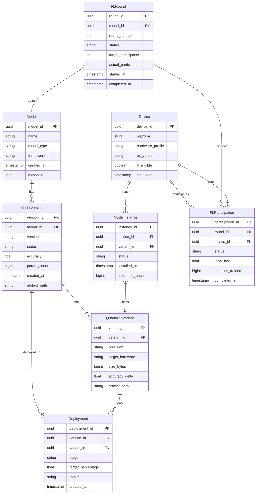
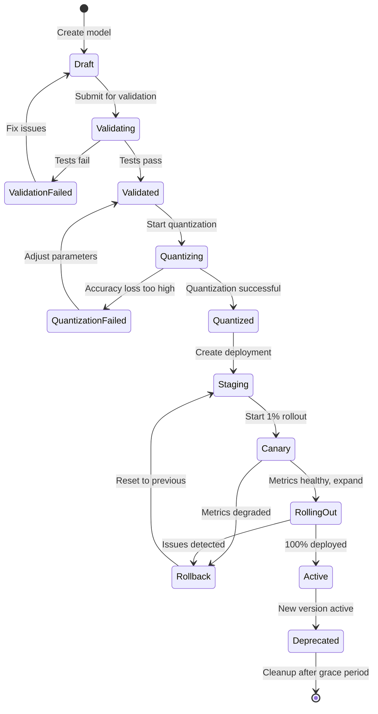
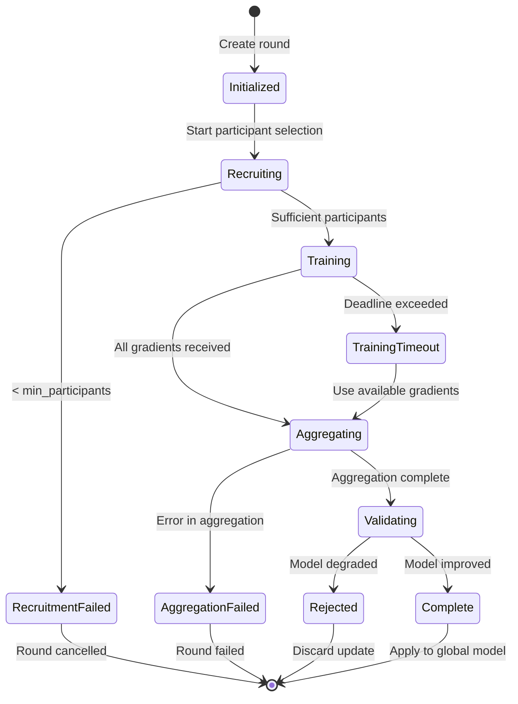
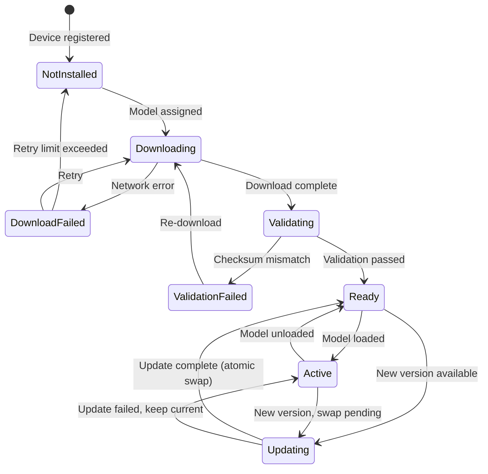

# Low-Level Design

[← Previous: High-Level Design](./02-high-level-design.md) | [Next: Deep Dive & Bottlenecks →](./04-deep-dive-and-bottlenecks.md)

---

## Data Models

### Entity Relationship Diagram



### Core Tables

#### Models Table

```sql
CREATE TABLE models (
    model_id        UUID PRIMARY KEY DEFAULT gen_random_uuid(),
    name            VARCHAR(255) NOT NULL,
    model_type      VARCHAR(50) NOT NULL,  -- 'vision', 'nlp', 'recommendation'
    framework       VARCHAR(50) NOT NULL,  -- 'tensorflow', 'pytorch', 'jax'
    owner           VARCHAR(255) NOT NULL,
    description     TEXT,
    created_at      TIMESTAMP DEFAULT NOW(),
    updated_at      TIMESTAMP DEFAULT NOW(),
    metadata        JSONB DEFAULT '{}'::jsonb,

    CONSTRAINT unique_model_name UNIQUE (name)
);

CREATE INDEX idx_models_type ON models(model_type);
CREATE INDEX idx_models_framework ON models(framework);
```

#### Model Versions Table

```sql
CREATE TABLE model_versions (
    version_id      UUID PRIMARY KEY DEFAULT gen_random_uuid(),
    model_id        UUID NOT NULL REFERENCES models(model_id),
    version         VARCHAR(50) NOT NULL,  -- Semantic versioning: '2.1.0'
    status          VARCHAR(20) NOT NULL DEFAULT 'draft',
        -- 'draft', 'validating', 'validated', 'deploying', 'active', 'deprecated'
    accuracy        DECIMAL(5,4),          -- e.g., 0.9523
    param_count     BIGINT NOT NULL,       -- Number of parameters
    created_at      TIMESTAMP DEFAULT NOW(),
    artifact_path   VARCHAR(512) NOT NULL, -- Path in object storage
    training_config JSONB,                 -- Hyperparameters, dataset info
    validation_metrics JSONB,              -- Accuracy, latency benchmarks

    CONSTRAINT unique_model_version UNIQUE (model_id, version)
);

CREATE INDEX idx_versions_model ON model_versions(model_id);
CREATE INDEX idx_versions_status ON model_versions(status);
```

#### Quantized Variants Table

```sql
CREATE TABLE quantized_variants (
    variant_id      UUID PRIMARY KEY DEFAULT gen_random_uuid(),
    version_id      UUID NOT NULL REFERENCES model_versions(version_id),
    precision       VARCHAR(20) NOT NULL,  -- 'fp32', 'fp16', 'int8', 'int4'
    target_hardware VARCHAR(50) NOT NULL,  -- 'npu', 'gpu', 'cpu', 'universal'
    size_bytes      BIGINT NOT NULL,
    accuracy_delta  DECIMAL(5,4),          -- Accuracy loss vs FP32
    latency_ms      DECIMAL(8,2),          -- Benchmark latency
    created_at      TIMESTAMP DEFAULT NOW(),
    artifact_path   VARCHAR(512) NOT NULL,
    calibration_config JSONB,              -- Calibration dataset, samples

    CONSTRAINT unique_variant UNIQUE (version_id, precision, target_hardware)
);

CREATE INDEX idx_variants_version ON quantized_variants(version_id);
CREATE INDEX idx_variants_precision ON quantized_variants(precision);
```

#### Devices Table

```sql
CREATE TABLE devices (
    device_id       UUID PRIMARY KEY,
    platform        VARCHAR(20) NOT NULL,  -- 'android', 'ios', 'linux'
    hardware_profile VARCHAR(100),         -- 'npu_v1', 'gpu_adreno', 'cpu_arm'
    os_version      VARCHAR(50),
    sdk_version     VARCHAR(20),
    fl_eligible     BOOLEAN DEFAULT false,
    last_seen       TIMESTAMP,
    capabilities    JSONB,                 -- NPU TOPS, memory, etc.
    created_at      TIMESTAMP DEFAULT NOW(),

    CONSTRAINT valid_platform CHECK (platform IN ('android', 'ios', 'linux', 'embedded'))
);

CREATE INDEX idx_devices_platform ON devices(platform);
CREATE INDEX idx_devices_fl_eligible ON devices(fl_eligible) WHERE fl_eligible = true;
```

#### FL Rounds Table

```sql
CREATE TABLE fl_rounds (
    round_id            UUID PRIMARY KEY DEFAULT gen_random_uuid(),
    model_id            UUID NOT NULL REFERENCES models(model_id),
    round_number        INT NOT NULL,
    status              VARCHAR(20) NOT NULL DEFAULT 'initialized',
        -- 'initialized', 'recruiting', 'training', 'aggregating', 'completed', 'failed'
    target_participants INT NOT NULL,
    actual_participants INT DEFAULT 0,
    min_participants    INT NOT NULL,
    local_epochs        INT NOT NULL DEFAULT 5,
    learning_rate       DECIMAL(10,8),
    dp_epsilon          DECIMAL(5,2),      -- Differential privacy budget
    started_at          TIMESTAMP,
    completed_at        TIMESTAMP,
    global_loss_before  DECIMAL(10,6),
    global_loss_after   DECIMAL(10,6),
    aggregated_weights_path VARCHAR(512),

    CONSTRAINT unique_round UNIQUE (model_id, round_number)
);

CREATE INDEX idx_fl_rounds_model ON fl_rounds(model_id);
CREATE INDEX idx_fl_rounds_status ON fl_rounds(status);
```

---

## API Design

### Model Management API

#### Create Model

```
POST /v1/models
Content-Type: application/json

Request:
{
    "name": "image-classifier-v2",
    "model_type": "vision",
    "framework": "tensorflow",
    "description": "MobileNetV3 for image classification"
}

Response: 201 Created
{
    "model_id": "550e8400-e29b-41d4-a716-446655440000",
    "name": "image-classifier-v2",
    "created_at": "2025-01-22T10:30:00Z"
}
```

#### Upload Model Version

```
POST /v1/models/{model_id}/versions
Content-Type: multipart/form-data

Form Fields:
- version: "2.1.0"
- artifact: <binary model file>
- training_config: {"epochs": 100, "learning_rate": 0.001}

Response: 201 Created
{
    "version_id": "660e8400-e29b-41d4-a716-446655440001",
    "version": "2.1.0",
    "status": "validating",
    "artifact_path": "models/image-classifier-v2/2.1.0/model.savedmodel"
}
```

#### Quantize Model

```
POST /v1/models/{model_id}/versions/{version}/quantize
Content-Type: application/json

Request:
{
    "precision": "int8",
    "target_hardware": "npu",
    "calibration_dataset": "gs://datasets/imagenet-calibration",
    "calibration_samples": 1000
}

Response: 202 Accepted
{
    "job_id": "quant-770e8400-e29b-41d4-a716-446655440002",
    "status": "processing",
    "estimated_completion": "2025-01-22T11:00:00Z"
}
```

#### Deploy Model

```
POST /v1/models/{model_id}/versions/{version}/deploy
Content-Type: application/json

Request:
{
    "variant_id": "880e8400-e29b-41d4-a716-446655440003",
    "strategy": "staged",
    "stages": [
        {"percentage": 1, "duration_hours": 24},
        {"percentage": 10, "duration_hours": 48},
        {"percentage": 50, "duration_hours": 72},
        {"percentage": 100}
    ],
    "rollback_threshold": {
        "error_rate": 0.01,
        "latency_p99_ms": 50
    }
}

Response: 201 Created
{
    "deployment_id": "990e8400-e29b-41d4-a716-446655440004",
    "stage": 1,
    "status": "rolling_out"
}
```

### On-Device Runtime API (Pseudocode)

```
INTERFACE EdgeMLRuntime:
    // Model Management
    FUNCTION load_model(model_path: String, options: LoadOptions) -> ModelHandle
        // Load model from local storage or download if needed
        // Options: delegate preference, memory mapping, warm-up

    FUNCTION unload_model(handle: ModelHandle) -> void
        // Release model resources

    FUNCTION get_model_info(handle: ModelHandle) -> ModelInfo
        // Return model metadata: input/output shapes, precision, size

    // Inference
    FUNCTION inference(handle: ModelHandle, input: Tensor) -> Tensor
        // Synchronous inference, blocking

    FUNCTION inference_async(handle: ModelHandle, input: Tensor, callback: InferenceCallback) -> void
        // Asynchronous inference with callback

    FUNCTION batch_inference(handle: ModelHandle, inputs: List<Tensor>) -> List<Tensor>
        // Process multiple inputs efficiently

    // Hardware
    FUNCTION get_hardware_info() -> HardwareCapabilities
        // Return available delegates: NPU, GPU, CPU
        // Include TOPS, memory, supported operations

    FUNCTION set_delegate(delegate_type: DelegateType) -> void
        // Force specific hardware backend

    FUNCTION benchmark(handle: ModelHandle, iterations: Int) -> BenchmarkResult
        // Run inference benchmark, return latency stats


STRUCT LoadOptions:
    preferred_delegate: DelegateType  // NPU, GPU, CPU, AUTO
    memory_map: Boolean               // Use memory-mapped loading
    num_threads: Int                  // CPU thread count
    warm_up_runs: Int                 // Pre-inference warm-up


STRUCT ModelInfo:
    model_id: String
    version: String
    precision: String
    input_shapes: List<Shape>
    output_shapes: List<Shape>
    size_bytes: Int
    supported_delegates: List<DelegateType>


STRUCT HardwareCapabilities:
    npu_available: Boolean
    npu_tops: Float
    gpu_available: Boolean
    gpu_tflops: Float
    cpu_cores: Int
    available_memory_mb: Int
```

### Federated Learning API

#### Create FL Round

```
POST /v1/fl/rounds
Content-Type: application/json

Request:
{
    "model_id": "550e8400-e29b-41d4-a716-446655440000",
    "target_participants": 10000,
    "min_participants": 5000,
    "local_epochs": 5,
    "learning_rate": 0.01,
    "dp_config": {
        "epsilon": 8.0,
        "delta": 1e-5,
        "max_grad_norm": 1.0
    },
    "selection_criteria": {
        "min_samples": 100,
        "require_wifi": true,
        "require_charging": true
    }
}

Response: 201 Created
{
    "round_id": "aa0e8400-e29b-41d4-a716-446655440005",
    "round_number": 42,
    "status": "recruiting"
}
```

#### Submit Gradient Update (Device → Server)

```
POST /v1/fl/rounds/{round_id}/gradients
Content-Type: application/octet-stream
X-Device-ID: {device_id}
X-Samples-Trained: 1500
X-Local-Loss: 0.342

Body: <compressed, masked gradient tensor>

Response: 200 OK
{
    "acknowledged": true,
    "participants_so_far": 7823
}
```

#### Get Aggregated Model (Device ← Server)

```
GET /v1/fl/rounds/{round_id}/model
X-Device-ID: {device_id}

Response: 200 OK
Content-Type: application/octet-stream
X-Round-Status: completed
X-Global-Loss: 0.285

Body: <updated model weights>
```

---

## Core Algorithms

### Algorithm 1: INT8 Post-Training Quantization (PTQ)

```
ALGORITHM int8_post_training_quantization(model, calibration_data):
    """
    Quantize a floating-point model to INT8 using calibration data.
    Uses min-max quantization with per-tensor scaling.
    """
    INPUT:
        model: FP32 neural network model
        calibration_data: Representative dataset (100-1000 samples)
    OUTPUT:
        quantized_model: INT8 model with scale/zero-point per tensor

    // Phase 1: Collect activation statistics
    activation_stats = {}

    FOR each layer IN model.layers:
        activation_stats[layer.name] = {
            'min': +infinity,
            'max': -infinity,
            'histogram': empty_histogram(bins=2048)
        }

    FOR each batch IN calibration_data:
        // Forward pass collecting statistics
        activations = model.forward_with_hooks(batch)

        FOR each layer_name, activation IN activations:
            stats = activation_stats[layer_name]
            stats['min'] = min(stats['min'], activation.min())
            stats['max'] = max(stats['max'], activation.max())
            stats['histogram'].update(activation.flatten())

    // Phase 2: Compute quantization parameters
    quant_params = {}

    FOR each layer IN model.layers:
        stats = activation_stats[layer.name]

        // Symmetric quantization for weights
        IF layer.has_weights:
            w_max = max(abs(layer.weights.min()), abs(layer.weights.max()))
            weight_scale = w_max / 127  // INT8 symmetric: [-127, 127]
            weight_zero_point = 0

            quant_params[layer.name + '_weight'] = {
                'scale': weight_scale,
                'zero_point': weight_zero_point
            }

        // Asymmetric quantization for activations
        a_min = stats['min']
        a_max = stats['max']
        activation_scale = (a_max - a_min) / 255  // INT8 asymmetric: [0, 255]
        activation_zero_point = round(-a_min / activation_scale)
        activation_zero_point = clamp(activation_zero_point, 0, 255)

        quant_params[layer.name + '_activation'] = {
            'scale': activation_scale,
            'zero_point': activation_zero_point
        }

    // Phase 3: Quantize weights
    quantized_model = copy(model.structure)

    FOR each layer IN model.layers:
        IF layer.has_weights:
            params = quant_params[layer.name + '_weight']
            q_weights = round(layer.weights / params['scale'])
            q_weights = clamp(q_weights, -127, 127)
            quantized_model.layers[layer.name].weights = q_weights.as_int8()

        quantized_model.layers[layer.name].quant_params = quant_params[layer.name + '_activation']

    RETURN quantized_model

    // Complexity: O(calibration_samples × model_forward_pass)
    // Memory: O(layers × histogram_bins) for statistics
```

### Algorithm 2: Federated Averaging (FedAvg)

```
ALGORITHM federated_averaging(global_model, device_fleet, config):
    """
    Train a model across distributed devices without centralizing data.
    Implements McMahan et al. (2017) FedAvg algorithm.
    """
    INPUT:
        global_model: Initial model weights W_0
        device_fleet: Set of all available devices
        config: {rounds, local_epochs, batch_size, learning_rate,
                 participation_fraction, min_participants}
    OUTPUT:
        global_model: Trained model weights W_final

    W = global_model.weights

    FOR round_t IN 1 to config.rounds:
        // Step 1: Select participating devices
        eligible_devices = filter(device_fleet, is_eligible)
        // is_eligible: has WiFi, charging, sufficient data, idle

        IF length(eligible_devices) < config.min_participants:
            CONTINUE  // Skip round, not enough participants

        selected_devices = random_sample(
            eligible_devices,
            fraction = config.participation_fraction
        )

        // Step 2: Distribute global model
        FOR each device IN selected_devices:
            device.receive_model(W)

        // Step 3: Local training (parallel on devices)
        local_updates = []

        PARALLEL FOR each device IN selected_devices:
            W_local = copy(W)
            n_k = device.local_data_size

            FOR epoch IN 1 to config.local_epochs:
                FOR batch IN device.local_data.batches(config.batch_size):
                    gradient = compute_gradient(W_local, batch)
                    W_local = W_local - config.learning_rate * gradient

            // Compute update (delta)
            delta_k = W_local - W
            local_updates.append((n_k, delta_k))

        // Step 4: Aggregate updates (weighted by data size)
        total_samples = sum(n_k for (n_k, _) in local_updates)
        aggregated_delta = zeros_like(W)

        FOR (n_k, delta_k) IN local_updates:
            weight = n_k / total_samples
            aggregated_delta = aggregated_delta + weight * delta_k

        // Step 5: Update global model
        W = W + aggregated_delta

        // Log round metrics
        log_round_metrics(round_t, length(local_updates), total_samples)

    global_model.weights = W
    RETURN global_model

    // Complexity: O(rounds × participants × local_epochs × local_data)
    // Communication: O(rounds × participants × model_size)
```

### Algorithm 3: Secure Aggregation Protocol

```
ALGORITHM secure_aggregation(participants, gradients):
    """
    Aggregate gradients without revealing individual contributions.
    Based on Bonawitz et al. (2017) secure aggregation protocol.
    Server learns only the sum, not individual gradients.
    """
    INPUT:
        participants: List of device IDs [D_1, D_2, ..., D_n]
        gradients: Map of device_id -> gradient vector
    OUTPUT:
        aggregated: Sum of all gradients (individual gradients never exposed)

    n = length(participants)

    // Phase 0: Setup (one-time per FL session)
    // Each participant generates key pair
    FOR each device D_i IN participants:
        (pk_i, sk_i) = generate_key_pair()
        broadcast(pk_i)  // Share public key with all participants

    // Phase 1: Share Secret Seeds (pairwise)
    // Each pair of participants establishes shared secret
    shared_secrets = {}

    FOR each pair (D_i, D_j) WHERE i < j:
        // Diffie-Hellman key exchange
        s_ij = DH_agree(sk_i, pk_j)  // D_i computes
        s_ji = DH_agree(sk_j, pk_i)  // D_j computes
        // s_ij == s_ji (shared secret)
        shared_secrets[(i, j)] = s_ij

    // Phase 2: Mask Gradients
    // Each participant masks their gradient with pairwise masks
    masked_gradients = {}

    FOR each device D_i IN participants:
        g_i = gradients[D_i]
        mask_i = zeros_like(g_i)

        FOR each device D_j IN participants WHERE j != i:
            // Generate deterministic mask from shared secret
            seed = shared_secrets[(min(i,j), max(i,j))]
            pairwise_mask = PRG(seed, length=g_i.size)  // Pseudo-random generator

            IF i < j:
                mask_i = mask_i + pairwise_mask
            ELSE:
                mask_i = mask_i - pairwise_mask

        masked_gradients[D_i] = g_i + mask_i

    // Phase 3: Aggregate (masks cancel out)
    // Server collects masked gradients
    // sum(mask_i for all i) = 0 because +pairwise_mask and -pairwise_mask cancel

    aggregated = zeros_like(gradients[participants[0]])

    FOR each D_i IN participants:
        aggregated = aggregated + masked_gradients[D_i]

    // aggregated = sum(g_i + mask_i) = sum(g_i) + sum(mask_i) = sum(g_i) + 0

    RETURN aggregated / n

    // Security: Server sees only masked gradients, never individual g_i
    // Complexity: O(n^2 × gradient_size) for pairwise secrets
    // Communication: O(n^2) for key exchange, O(n × gradient_size) for aggregation
```

### Algorithm 4: Knowledge Distillation

```
ALGORITHM knowledge_distillation(teacher, student, data, config):
    """
    Train a smaller student model to mimic a larger teacher model.
    Hinton et al. (2015) distillation with soft targets.
    """
    INPUT:
        teacher: Large pre-trained model (frozen)
        student: Smaller model to train
        data: Training dataset
        config: {temperature, alpha, epochs, learning_rate}
    OUTPUT:
        student: Trained student model

    T = config.temperature  // Typically 3-20, higher = softer probabilities
    alpha = config.alpha    // Balance between distillation and hard loss

    FOR epoch IN 1 to config.epochs:
        FOR batch IN data.batches():
            inputs, hard_labels = batch

            // Teacher inference (no gradient)
            WITH no_grad():
                teacher_logits = teacher.forward(inputs)
                soft_targets = softmax(teacher_logits / T)

            // Student inference
            student_logits = student.forward(inputs)
            student_soft = softmax(student_logits / T)
            student_hard = softmax(student_logits)

            // Distillation loss (KL divergence on soft targets)
            // Multiply by T^2 to scale gradients appropriately
            distillation_loss = T * T * KL_divergence(soft_targets, student_soft)

            // Hard loss (standard cross-entropy)
            hard_loss = cross_entropy(student_hard, hard_labels)

            // Combined loss
            total_loss = alpha * distillation_loss + (1 - alpha) * hard_loss

            // Update student
            gradient = compute_gradient(student, total_loss)
            student.weights = student.weights - config.learning_rate * gradient

        // Evaluate student accuracy
        accuracy = evaluate(student, validation_data)
        log_epoch_metrics(epoch, accuracy, total_loss)

    RETURN student

    // Why it works:
    // - Soft targets from teacher contain "dark knowledge"
    // - Teacher's probability distribution over wrong classes is informative
    // - e.g., "7" looks more like "1" than "3" - teacher encodes this

    // Complexity: O(epochs × data_size × (teacher_forward + student_forward_backward))
    // Typical compression: 10-100x parameter reduction with <2% accuracy loss
```

### Algorithm 5: Hardware Delegate Selection

```
ALGORITHM select_optimal_delegate(model, hardware_caps, latency_budget):
    """
    Select the best hardware delegate for inference given constraints.
    """
    INPUT:
        model: Loaded model with operator requirements
        hardware_caps: Available hardware capabilities
        latency_budget: Maximum acceptable latency (ms)
    OUTPUT:
        delegate: Selected delegate (NPU, GPU, or CPU)
        expected_latency: Predicted latency

    // Get model operator requirements
    required_ops = model.get_required_operators()

    // Check NPU first (most efficient)
    IF hardware_caps.npu_available:
        npu_coverage = compute_op_coverage(required_ops, NPU_SUPPORTED_OPS)

        IF npu_coverage >= 0.95:  // 95% ops supported
            estimated_latency = estimate_latency(model, 'npu', hardware_caps.npu_tops)

            IF estimated_latency <= latency_budget:
                RETURN ('npu', estimated_latency)

        ELIF npu_coverage >= 0.80:  // Partial NPU, rest on CPU
            // Split execution: NPU for supported, CPU for unsupported
            estimated_latency = estimate_split_latency(model, 'npu', 'cpu', npu_coverage)

            IF estimated_latency <= latency_budget:
                RETURN ('npu_hybrid', estimated_latency)

    // Check GPU
    IF hardware_caps.gpu_available:
        gpu_coverage = compute_op_coverage(required_ops, GPU_SUPPORTED_OPS)

        IF gpu_coverage >= 0.90:
            estimated_latency = estimate_latency(model, 'gpu', hardware_caps.gpu_tflops)

            IF estimated_latency <= latency_budget:
                RETURN ('gpu', estimated_latency)

    // Fallback to CPU (always available)
    estimated_latency = estimate_latency(model, 'cpu', hardware_caps.cpu_cores)

    IF estimated_latency <= latency_budget:
        RETURN ('cpu', estimated_latency)
    ELSE:
        // Cannot meet latency budget
        RETURN ('cpu', estimated_latency, WARNING: 'latency_exceeded')


FUNCTION estimate_latency(model, delegate, compute_capacity):
    """
    Estimate inference latency based on model FLOPs and hardware capacity.
    """
    model_flops = model.total_flops
    memory_bytes = model.memory_footprint

    IF delegate == 'npu':
        // NPU: TOPS (tera operations per second)
        compute_time = model_flops / (compute_capacity * 1e12) * 1000  // ms
        memory_time = memory_bytes / (10 * 1e9) * 1000  // ~10 GB/s bandwidth
    ELIF delegate == 'gpu':
        compute_time = model_flops / (compute_capacity * 1e12) * 1000
        memory_time = memory_bytes / (20 * 1e9) * 1000  // ~20 GB/s
    ELSE:  // CPU
        effective_gflops = compute_capacity * 2  // cores × ~2 GFLOPS/core
        compute_time = model_flops / (effective_gflops * 1e9) * 1000
        memory_time = memory_bytes / (5 * 1e9) * 1000  // ~5 GB/s

    // Inference is often memory-bound
    RETURN max(compute_time, memory_time) * 1.2  // 20% overhead buffer
```

---

## State Machines

### Model Lifecycle



### FL Round Lifecycle



### Device Model State



---

## Wire Formats

### Model Manifest Format

```json
{
    "format_version": "1.0",
    "model_id": "550e8400-e29b-41d4-a716-446655440000",
    "version": "2.1.0",
    "variant": {
        "precision": "int8",
        "target_hardware": "npu"
    },
    "artifact": {
        "path": "models/classifier/2.1.0/model_int8_npu.tflite",
        "size_bytes": 25600000,
        "checksum_sha256": "a3f2b8c9d4e5f6a7b8c9d0e1f2a3b4c5d6e7f8a9b0c1d2e3f4a5b6c7d8e9f0a1"
    },
    "delta": {
        "from_version": "2.0.0",
        "path": "models/classifier/2.1.0/delta_from_2.0.0.patch",
        "size_bytes": 2560000
    },
    "requirements": {
        "min_sdk_version": "3.2.0",
        "min_memory_mb": 256,
        "supported_delegates": ["npu", "gpu", "cpu"]
    },
    "metadata": {
        "input_shape": [1, 224, 224, 3],
        "output_shape": [1, 1000],
        "labels_path": "models/classifier/2.1.0/labels.txt"
    }
}
```

### Gradient Encoding (Sparse, Compressed)

```
Gradient Wire Format:
+----------------+----------------+----------------+
| Header (16B)   | Index Data     | Value Data     |
+----------------+----------------+----------------+

Header:
- Magic: 4 bytes ("GRAD")
- Version: 2 bytes
- Compression: 2 bytes (0=none, 1=gzip, 2=lz4)
- Sparsity: 4 bytes (percentage of non-zero values)
- Num Elements: 4 bytes

For Sparse Gradients (sparsity > 50%):
- Index Data: Variable-length encoded indices of non-zero elements
- Value Data: FP16 values for non-zero elements

For Dense Gradients:
- Value Data: FP16 values for all elements (no index data)

Typical Compression Ratio: 10:1 to 100:1
- 100MB FP32 model → 10MB FP16 → 1MB sparse+compressed
```

---

## Interview Tips: Low-Level Design Phase

### Key Points to Cover

1. **Data model should reflect relationships** - Model → Versions → Variants → Deployments
2. **APIs should be idempotent** - Retrying a deployment shouldn't cause issues
3. **Algorithms should have complexity analysis** - Show you understand computational costs
4. **State machines clarify lifecycle** - Easier to discuss failure modes

### Common Deep-Dive Topics

| Topic | What to Discuss |
|-------|-----------------|
| **Quantization** | PTQ vs QAT, calibration data, accuracy-size trade-off |
| **FedAvg** | Non-IID handling, weighted aggregation, convergence |
| **Secure Aggregation** | Pairwise masking, dropout handling, communication cost |
| **Delegate Selection** | Operator coverage, fallback strategy, latency estimation |

### Questions to Expect

- "How do you handle operator not supported on NPU?"
- "What if a device drops out mid-FL round?"
- "How do you ensure quantization doesn't degrade accuracy too much?"
- "What's the communication complexity of secure aggregation?"

---

[← Previous: High-Level Design](./02-high-level-design.md) | [Next: Deep Dive & Bottlenecks →](./04-deep-dive-and-bottlenecks.md)
