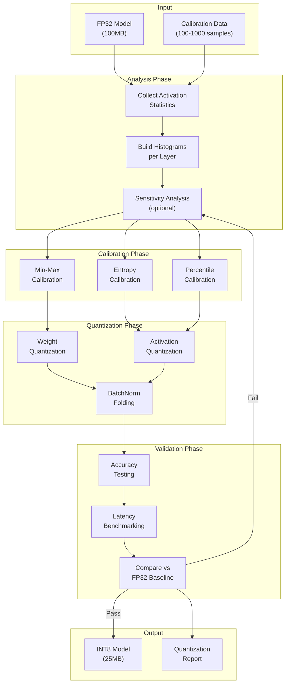
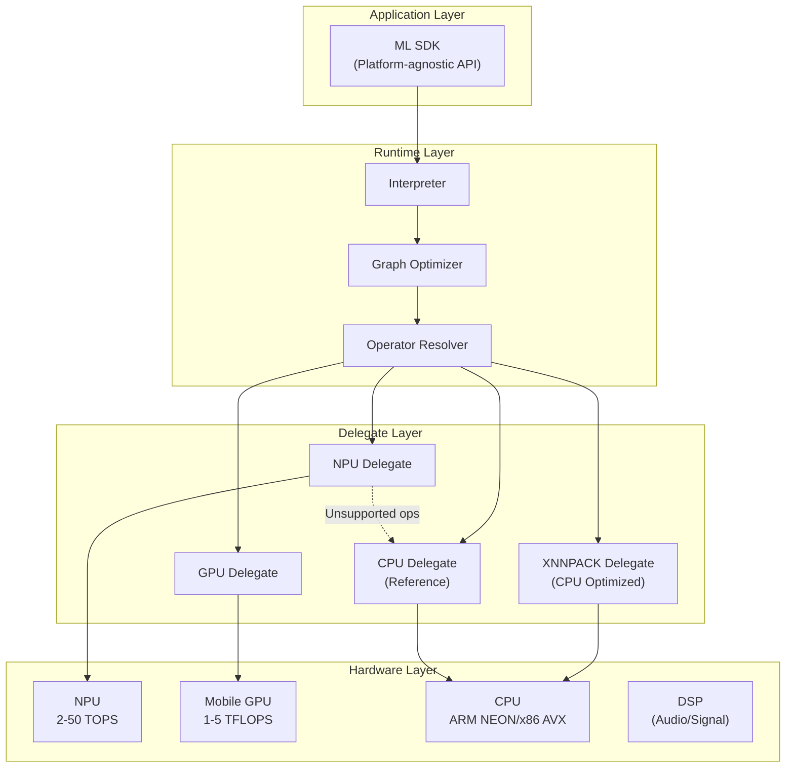
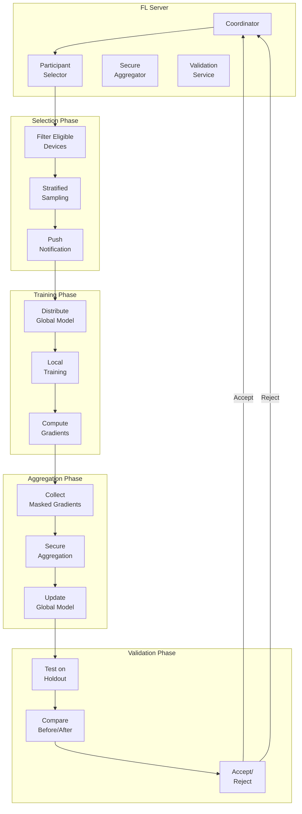

# Deep Dive & Bottlenecks

[← Previous: Low-Level Design](./03-low-level-design.md) | [Next: Scalability & Reliability →](./05-scalability-and-reliability.md)

---

## Deep Dive 1: Quantization Pipeline

### Why This Is Critical

Quantization is the single most impactful optimization for edge deployment. A well-executed quantization pipeline can achieve:
- **75% memory reduction** (FP32 → INT8)
- **2-4x inference speedup** on NPUs optimized for integer operations
- **50% power reduction** due to simpler arithmetic units

Poor quantization leads to:
- Unacceptable accuracy degradation (> 2-3%)
- Model that won't fit in device memory
- Inference too slow for real-time applications

### How It Works Internally



### Quantization Schemes Comparison

| Scheme | Memory | Accuracy Impact | Hardware Support | Use Case |
|--------|--------|-----------------|------------------|----------|
| **FP32** | Baseline | None | Universal | Reference |
| **FP16** | 50% reduction | < 0.1% | GPU, some NPU | GPU inference |
| **BF16** | 50% reduction | < 0.1% | TPU, newer NPU | Training-compatible |
| **INT8 Symmetric** | 75% reduction | 0.5-1% | NPU, CPU SIMD | Weight quantization |
| **INT8 Asymmetric** | 75% reduction | 0.3-0.8% | NPU | Activations |
| **INT4** | 87.5% reduction | 2-5% | Limited | Extreme compression |
| **Mixed (INT8/FP16)** | 60-70% reduction | 0.2-0.5% | NPU with FP16 fallback | Best accuracy-size trade-off |

### Calibration Methods Deep Dive

```
METHOD: Min-Max Calibration
    scale = (max_val - min_val) / (qmax - qmin)
    zero_point = qmin - round(min_val / scale)

    Pros: Simple, fast
    Cons: Sensitive to outliers

METHOD: Entropy Calibration (KL Divergence)
    // Find threshold that minimizes KL divergence between FP32 and quantized distributions
    FOR threshold IN candidate_thresholds:
        quantized_dist = quantize_with_threshold(fp32_dist, threshold)
        kl_div = KL_divergence(fp32_dist, quantized_dist)
        IF kl_div < best_kl_div:
            best_threshold = threshold

    Pros: Handles outliers better
    Cons: Slower, requires more calibration data

METHOD: Percentile Calibration
    // Use percentile (e.g., 99.99%) instead of absolute min/max
    min_val = percentile(activations, 0.01)
    max_val = percentile(activations, 99.99)

    Pros: Robust to outliers
    Cons: May clip valid activations
```

### Per-Layer vs Per-Tensor Quantization

| Granularity | Accuracy | Model Size | Inference Speed |
|-------------|----------|------------|-----------------|
| **Per-tensor** | Lower | Smallest | Fastest |
| **Per-channel** (weights) | Higher | Same | Same |
| **Per-layer** (activations) | Medium | Same | Same |
| **Per-group** | Highest | Slightly larger | Slower |

**Recommendation:** Per-channel for weights, per-tensor for activations (industry standard).

### Failure Modes and Recovery

| Failure | Symptoms | Cause | Recovery |
|---------|----------|-------|----------|
| **Accuracy collapse** | > 5% accuracy drop | Sensitive layers quantized too aggressively | Use mixed precision, keep sensitive layers in FP16 |
| **NaN outputs** | Inference produces NaN | Scale overflow, division by zero | Check for zero ranges, add epsilon |
| **Clipping artifacts** | Visual artifacts in images | Outliers in activations | Use percentile calibration |
| **Slow inference** | No speedup vs FP32 | Unsupported ops falling back to FP32 | Check operator coverage, use hardware-supported ops |

---

## Deep Dive 2: Hardware Abstraction Layer

### Why This Is Critical

Device heterogeneity is extreme in edge deployments:
- **NPU availability:** Only 30-50% of Android devices have dedicated NPUs
- **NPU generations:** Performance varies 10x between generations
- **Operator support:** Different NPUs support different operations
- **Memory constraints:** Range from 1GB (low-end) to 16GB (flagship)

Without proper hardware abstraction:
- Code must be written for each hardware variant
- Fallback handling is inconsistent
- Performance is unpredictable

### Architecture



### Delegate Selection Algorithm

```
FUNCTION select_delegate(model, constraints):
    delegates = get_available_delegates()
    scored_delegates = []

    FOR each delegate IN delegates:
        // Check operator coverage
        coverage = compute_coverage(model.ops, delegate.supported_ops)

        IF coverage < 0.8:
            CONTINUE  // Skip delegates with < 80% coverage

        // Estimate performance
        latency = estimate_latency(model, delegate)
        power = estimate_power(model, delegate)
        memory = estimate_memory(model, delegate)

        // Check constraints
        IF latency > constraints.max_latency:
            CONTINUE
        IF memory > constraints.max_memory:
            CONTINUE

        // Score: lower is better
        score = (
            0.5 * (latency / constraints.max_latency) +
            0.3 * (power / constraints.max_power) +
            0.2 * (1 - coverage)
        )

        scored_delegates.append((delegate, score, coverage))

    // Sort by score
    scored_delegates.sort(by=score)

    IF scored_delegates is empty:
        RETURN (CPU_DELEGATE, WARNING)

    best = scored_delegates[0]
    IF best.coverage < 1.0:
        // Hybrid execution: best delegate + CPU for unsupported ops
        RETURN HybridDelegate(best.delegate, CPU_DELEGATE)

    RETURN best.delegate
```

### Memory Management Strategies

| Strategy | Latency Impact | Memory Efficiency | Use Case |
|----------|----------------|-------------------|----------|
| **Eager Loading** | High initial, low inference | Low (all in memory) | Frequently used models |
| **Memory Mapping** | Low initial, low inference | High (OS paging) | Large models |
| **Lazy Loading** | Low initial, variable inference | High | Infrequent use |
| **Streaming** | Continuous | Very high | Cannot fit in memory |

```
MEMORY-MAPPED MODEL LOADING:

// Instead of loading entire model into RAM:
buffer = allocate(model_size)  // BAD: 500MB allocation
read(model_file, buffer)

// Memory-map the file:
mapped_region = mmap(model_file, READ_ONLY)  // GOOD: No allocation
// OS loads pages on demand, evicts under memory pressure

Benefits:
- Near-instant "load" time
- Memory shared with other processes using same model
- OS handles memory pressure automatically

Caveats:
- Slightly higher inference latency (page faults)
- Model file must be on local storage (not compressed)
```

### Failure Modes and Recovery

| Failure | Detection | Impact | Recovery |
|---------|-----------|--------|----------|
| **NPU driver crash** | Exception/timeout | Single inference fails | Restart inference, fallback to GPU/CPU |
| **OOM during inference** | Memory exception | App crash | Reduce batch size, use memory mapping |
| **Delegate initialization failure** | Init returns error | Cannot use delegate | Fallback to next delegate |
| **Operator not supported** | Compilation fails | Cannot run model | Partial execution with fallback |
| **Thermal throttling** | Performance degradation | Slower inference | Reduce frequency, notify app |

---

## Deep Dive 3: Federated Learning Orchestration

### Why This Is Critical

Federated learning enables model improvement from billions of devices without collecting sensitive data. However, orchestration is complex:
- **Client selection:** Choose representative, available devices
- **Non-IID data:** User data distributions vary wildly
- **Communication efficiency:** Minimize bandwidth usage
- **Dropout handling:** Devices go offline mid-round
- **Privacy guarantees:** Prevent gradient attacks

### FL Round Orchestration Flow



### Client Selection Strategies

| Strategy | Pros | Cons | Use Case |
|----------|------|------|----------|
| **Random** | Simple, unbiased | May miss rare classes | Homogeneous data |
| **Stratified** | Representative | Requires metadata | Heterogeneous data |
| **Active** | Focuses on valuable clients | Complex, may bias | Non-IID severe |
| **Clustered** | Groups similar clients | Needs clustering | Regional models |

```
STRATIFIED CLIENT SELECTION:

FUNCTION select_participants(eligible_devices, target_count, stratify_by):
    // Group devices by stratification attribute (e.g., region, device_type)
    groups = group_by(eligible_devices, stratify_by)

    // Calculate per-group quota proportional to group size
    total = sum(len(g) for g in groups)
    quotas = {g: round(target_count * len(g) / total) for g in groups}

    selected = []
    FOR each group, quota IN quotas:
        // Random sample within group
        group_sample = random_sample(group, min(quota, len(group)))
        selected.extend(group_sample)

    // Adjust if under/over target due to rounding
    WHILE len(selected) < target_count:
        // Add from largest group
        remaining = eligible_devices - selected
        selected.append(random_choice(remaining))

    RETURN selected[:target_count]
```

### Non-IID Data Handling

Non-IID (non-independent and identically distributed) data is the primary challenge in FL:
- User A has mostly cat photos
- User B has mostly dog photos
- Training on each biases towards their distribution

| Technique | How It Works | Overhead |
|-----------|--------------|----------|
| **FedProx** | Add proximal term to keep local models close to global | Low |
| **SCAFFOLD** | Estimate and correct client drift | Medium |
| **FedNova** | Normalize updates by local steps | Low |
| **Personalization layers** | Keep some layers device-specific | Medium |
| **Data augmentation** | Augment local data for diversity | Low |

```
FEDPROX MODIFICATION:

// Standard local training loss:
loss = model_loss(predictions, labels)

// FedProx adds proximal term:
proximal_term = (mu / 2) * ||w_local - w_global||^2
loss = model_loss(predictions, labels) + proximal_term

// mu controls how much local model can deviate from global
// Higher mu = more conservative updates, slower convergence
// Lower mu = more local adaptation, risk of drift
// Typical mu: 0.01 to 0.1
```

### Dropout Handling

```
DROPOUT-TOLERANT AGGREGATION:

FUNCTION aggregate_with_dropout(round_id, timeout, min_participants):
    received_gradients = []
    deadline = now() + timeout

    WHILE now() < deadline:
        IF new_gradient_received():
            gradient = receive_gradient()
            received_gradients.append(gradient)

        IF len(received_gradients) >= min_participants:
            // Early termination if we have enough
            IF now() > deadline - grace_period:
                BREAK

    IF len(received_gradients) < min_participants:
        // Round failed
        RETURN FAILURE, "Insufficient participants"

    // Proceed with available gradients
    // Weight by data size, not by expected participants
    RETURN aggregate(received_gradients)

// Implications:
// - Set min_participants conservatively (50-70% of target)
// - Use heartbeats to detect stragglers early
// - Consider asynchronous FL for high-dropout scenarios
```

### Failure Modes and Recovery

| Failure | Symptoms | Recovery |
|---------|----------|----------|
| **Low participation** | < min_participants | Extend deadline, relax criteria, abort round |
| **Model divergence** | Loss increasing | Reduce learning rate, increase proximal term |
| **Gradient explosion** | NaN in aggregated model | Gradient clipping, reject outlier updates |
| **Byzantine clients** | Accuracy degradation | Robust aggregation (trimmed mean, Krum) |
| **Slow convergence** | Many rounds with no improvement | Increase local epochs, tune hyperparameters |

---

## Bottleneck Analysis

### Bottleneck 1: Model Load Time

| Cause | Impact | Detection | Mitigation |
|-------|--------|-----------|------------|
| Large model file | > 2s cold start | Timing measurement | Compression, delta updates |
| Storage I/O | Slow on low-end devices | I/O metrics | Memory-mapped loading |
| Model parsing | CPU-bound | Profiling | Pre-compiled models, FlatBuffers |
| Delegate initialization | NPU driver warmup | Timing | Background pre-warming |

**Mitigation Strategy:**
```
OPTIMIZED MODEL LOADING:

1. Use memory-mapped files (instant "load")
2. Pre-compile model for target delegate (avoid runtime compilation)
3. Background pre-warm during app launch
4. Use FlatBuffers format (zero-copy parsing)

Result: 500ms cold start → 50ms warm start
```

### Bottleneck 2: NPU Availability

| Cause | Impact | Detection | Mitigation |
|-------|--------|-----------|------------|
| No NPU hardware | 5-10x slower | Hardware probe | GPU/CPU optimized path |
| NPU driver issues | Inference fails | Exception handling | Graceful fallback |
| Thermal throttling | Variable latency | Temperature monitoring | Adaptive batching |
| NPU busy (other apps) | Contention | Resource monitoring | CPU fallback during contention |

**Mitigation Strategy:**
```
HARDWARE-AWARE EXECUTION:

1. Probe hardware at app startup, cache capabilities
2. Maintain optimized model variants for NPU, GPU, CPU
3. Select variant based on current conditions
4. Monitor latency, switch delegates if degraded

IF npu_latency > 2 * expected_latency:
    switch_to_gpu()
    log_anomaly("NPU throttled")
```

### Bottleneck 3: FL Communication

| Cause | Impact | Detection | Mitigation |
|-------|--------|-----------|------------|
| Large gradient size | Bandwidth, battery | Size measurement | Gradient compression |
| Unstable connectivity | Round failures | Connection monitoring | Resumable uploads |
| Server overload | Timeout errors | Error rate monitoring | Regional aggregators |
| Synchronization | Stragglers delay round | Progress tracking | Async aggregation |

**Mitigation Strategy:**
```
GRADIENT COMPRESSION PIPELINE:

1. Sparsification: Keep top-k% gradients (k=1-10%)
   Compression: 10-100x

2. Quantization: FP32 → FP16 → INT8
   Compression: 4x

3. Entropy coding: Huffman/arithmetic coding
   Compression: 1.5-2x

Combined: 100MB → 1MB (100x compression)
Accuracy impact: < 1% with proper tuning
```

### Bottleneck 4: Memory During Inference

| Cause | Impact | Detection | Mitigation |
|-------|--------|-----------|------------|
| Model too large | OOM crash | Memory monitoring | Quantization, pruning |
| Activation memory | Spikes during inference | Peak memory tracking | Operator fusion, in-place ops |
| Multiple models loaded | Memory pressure | Memory profiling | LRU model cache |
| Memory fragmentation | Allocation failures | Fragmentation metrics | Memory pools |

**Mitigation Strategy:**
```
MEMORY OPTIMIZATION:

1. Memory mapping: Model weights not in heap
2. Operator fusion: Reduce intermediate tensors
3. In-place operations: Reuse activation buffers
4. Model cache with LRU eviction
5. Lazy loading: Load model segments on demand

Memory budget: 500MB
- Model weights: 100MB (memory-mapped)
- Peak activations: 200MB (in-place optimized)
- Runtime overhead: 50MB
- Buffer: 150MB
```

---

## Concurrency & Race Conditions

### Race Condition 1: Model Update During Inference

```
SCENARIO:
Thread 1: Running inference with model v1
Thread 2: Downloading and installing model v2

RACE:
- Thread 2 overwrites model file while Thread 1 is reading
- Corrupted inference or crash

SOLUTION: Atomic Swap
1. Download v2 to temp location
2. Validate v2 (checksum, test inference)
3. Atomic rename: temp → model_v2
4. Update model pointer atomically
5. Next inference uses v2
6. Keep v1 until all v1 inferences complete (ref counting)

IMPLEMENTATION:
model_lock = RWLock()

FUNCTION inference(input):
    model_lock.read_lock()
    result = current_model.inference(input)
    model_lock.read_unlock()
    RETURN result

FUNCTION update_model(new_model_path):
    // Prepare new model
    new_model = load_and_validate(new_model_path)

    // Swap atomically
    model_lock.write_lock()
    old_model = current_model
    current_model = new_model
    model_lock.write_unlock()

    // Cleanup old model after grace period
    schedule_cleanup(old_model, delay=60s)
```

### Race Condition 2: Concurrent FL Rounds

```
SCENARIO:
Round N still aggregating
Round N+1 starts selection

RACE:
- Device participates in both rounds
- Gradient from Round N applied to Round N+1's base model

SOLUTION: Round Isolation
1. Each round has unique round_id
2. Gradients tagged with round_id
3. Server rejects gradients from wrong round
4. Client checks round_id before training

IMPLEMENTATION:
FUNCTION on_training_request(round_id, global_model):
    IF active_round_id != None AND active_round_id != round_id:
        RETURN BUSY, "Already in round " + active_round_id

    active_round_id = round_id
    // ... training ...
    submit_gradient(round_id, gradient)
    active_round_id = None
```

### Race Condition 3: Cache Eviction During Load

```
SCENARIO:
Thread 1: Loading model A from cache
Thread 2: Evicting model A due to memory pressure

RACE:
- Thread 2 deletes model A file while Thread 1 is loading
- Thread 1 fails or gets corrupt data

SOLUTION: Reference Counting
1. Increment ref count before loading
2. Eviction only allowed when ref count = 0
3. Decrement ref count when inference handle released

IMPLEMENTATION:
cache_entries = {}
cache_lock = Mutex()

FUNCTION get_model(model_id):
    cache_lock.lock()
    IF model_id IN cache_entries:
        entry = cache_entries[model_id]
        entry.ref_count += 1
        cache_lock.unlock()
        RETURN entry.model

    // Load model
    model = load_from_storage(model_id)
    cache_entries[model_id] = CacheEntry(model, ref_count=1)
    cache_lock.unlock()
    RETURN model

FUNCTION release_model(model_id):
    cache_lock.lock()
    cache_entries[model_id].ref_count -= 1
    maybe_evict()  // Only evicts entries with ref_count = 0
    cache_lock.unlock()
```

---

## Interview Tips: Deep Dive Phase

### How to Navigate This Section

1. **Pick ONE topic** - Quantization OR FL orchestration, not both
2. **Go deep, not wide** - Show mastery of chosen topic
3. **Connect to trade-offs** - Every decision has costs
4. **Discuss failure modes** - Shows production experience

### Topics by Audience

| Interviewer Background | Recommended Deep Dive |
|-----------------------|----------------------|
| ML/AI team | Quantization pipeline, accuracy-size trade-offs |
| Infrastructure team | Hardware abstraction, delegate selection |
| Privacy/Security team | FL orchestration, secure aggregation |
| Mobile/Client team | Memory management, race conditions |

### Key Numbers to Memorize

| Metric | Value | Context |
|--------|-------|---------|
| INT8 memory reduction | 75% | vs FP32 |
| Typical accuracy loss (QAT) | < 0.5% | Well-tuned |
| NPU power | 2-10W | vs 50-700W GPU |
| FL gradient compression | 10-100x | Sparse + quantized |
| Model load time target | < 500ms | Cold start |
| Memory-mapped overhead | ~0ms | Load time |

---

[← Previous: Low-Level Design](./03-low-level-design.md) | [Next: Scalability & Reliability →](./05-scalability-and-reliability.md)
