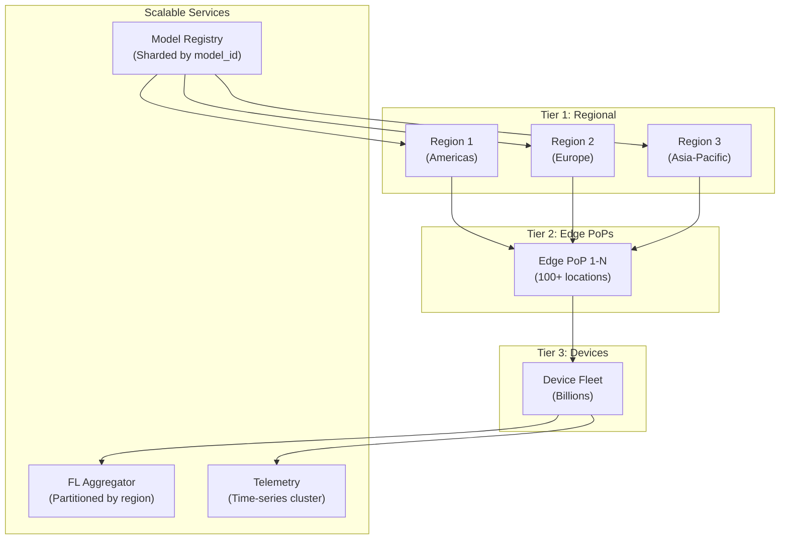
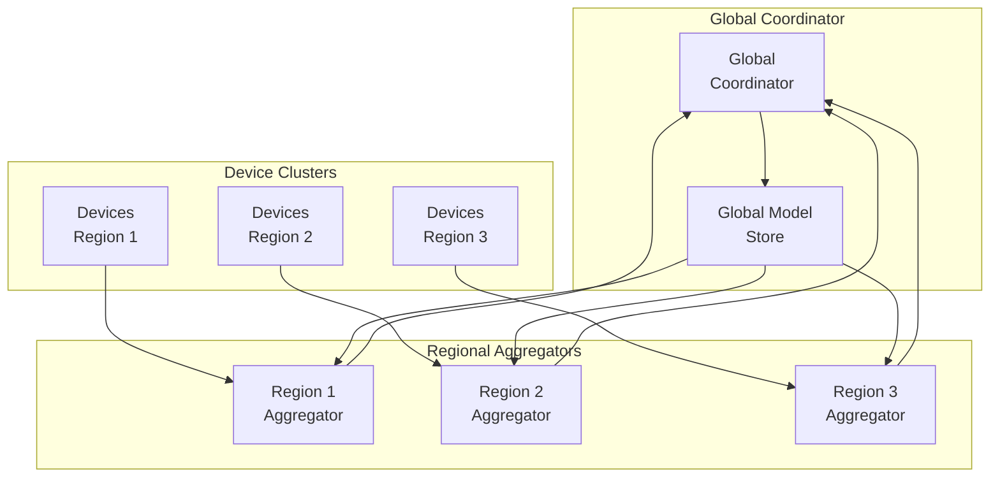
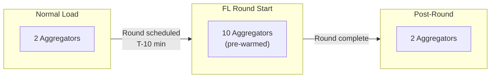
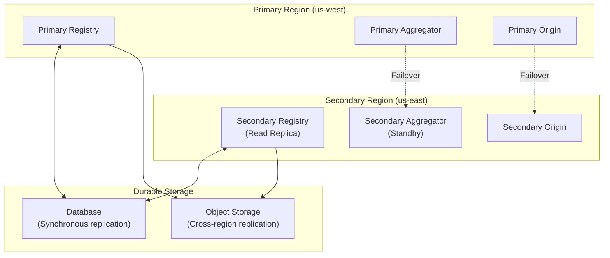
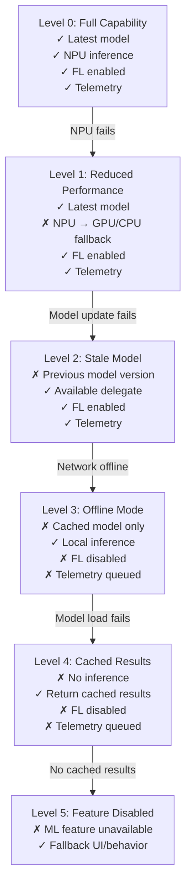
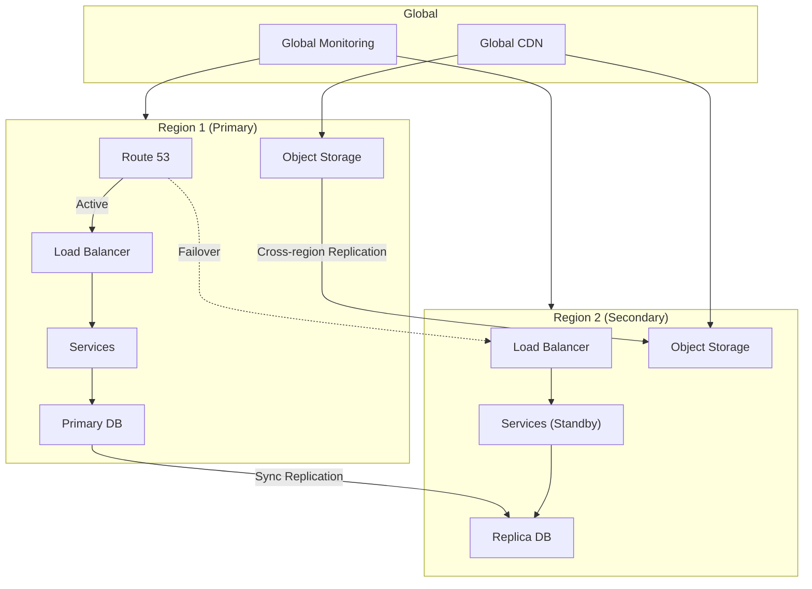

# Scalability & Reliability

[← Previous: Deep Dive & Bottlenecks](./04-deep-dive-and-bottlenecks.md) | [Next: Security & Compliance →](./06-security-and-compliance.md)

---

## Scalability Strategy

### Scale Dimensions

| Dimension | Current | 10x Scale | 100x Scale | Key Challenge |
|-----------|---------|-----------|------------|---------------|
| **Device Fleet** | 100M | 1B | 10B | Model distribution bandwidth |
| **Models per Device** | 5 | 50 | 100 | Storage management |
| **Inferences per Day** | 100B | 1T | 10T | Telemetry aggregation |
| **FL Participants/Round** | 10K | 100K | 1M | Aggregation compute |
| **Model Updates/Month** | 2 | 10 | 50 | CDN and staging |

### Horizontal Scaling



#### Model Registry Scaling

| Scale | Strategy | Implementation |
|-------|----------|----------------|
| **< 1K models** | Single database | PostgreSQL with read replicas |
| **1K - 100K models** | Sharded by model_id hash | Multiple PostgreSQL shards |
| **> 100K models** | Distributed metadata + Object storage | Cassandra/DynamoDB + blob storage |

```
SHARDING STRATEGY:

shard_id = hash(model_id) % num_shards

// Model lookup
FUNCTION get_model(model_id):
    shard = get_shard(model_id)
    metadata = shard.query("SELECT * FROM models WHERE id = ?", model_id)
    artifact_url = object_storage.get_url(metadata.artifact_path)
    RETURN (metadata, artifact_url)

// Shard rebalancing
// Add new shards without reshuffling existing data
// Use consistent hashing with virtual nodes
```

#### FL Aggregator Scaling



**Hierarchical Aggregation:**
```
HIERARCHICAL FL:

1. Devices upload gradients to regional aggregator
2. Regional aggregator computes regional aggregate
3. Regional aggregates sent to global coordinator
4. Global coordinator computes final aggregate
5. Updated model distributed back through hierarchy

Benefits:
- Reduces cross-region bandwidth by 10-100x
- Lower latency for participants
- Regional fault isolation

Trade-offs:
- Slightly different convergence properties
- Regional skew if data distribution varies
```

#### CDN Distribution Scaling

| Fleet Size | CDN Strategy | Bandwidth Optimization |
|------------|--------------|------------------------|
| **< 1M devices** | Single CDN provider | Standard edge caching |
| **1M - 100M** | Multi-CDN with geo-routing | Delta updates, compression |
| **> 100M** | Multi-CDN + ISP partnerships | Pre-positioning, P2P assist |

```
DELTA UPDATE STRATEGY:

// Instead of distributing 100MB model:
full_model_size = 100MB
delta_size = compute_delta(v1, v2)  // ~10MB (90% reduction)

// Devices with v1:
IF device.has_version(v1):
    download(delta_v1_to_v2, 10MB)
    apply_delta(local_model, delta)
ELSE:
    download(full_model_v2, 100MB)

// Bandwidth savings at scale:
// 100M devices × 100MB = 10 PB
// 100M devices × 10MB = 1 PB (10x reduction)
```

### Vertical Scaling Considerations

| Component | Vertical Limit | When to Scale Horizontally |
|-----------|----------------|---------------------------|
| **FL Aggregator** | 64 cores, 256GB RAM | > 100K gradients/round |
| **Model Registry DB** | 32 cores, 128GB RAM | > 10K QPS |
| **Telemetry Ingestion** | Single node limit | > 1M events/sec |

---

## Auto-Scaling

### Auto-Scaling Triggers

| Component | Metric | Scale-Up Trigger | Scale-Down Trigger |
|-----------|--------|------------------|-------------------|
| **CDN Edge** | Cache hit rate | < 80% | > 95% |
| **FL Aggregator** | Round duration | > 2x baseline | < 0.5x baseline |
| **Telemetry Ingestion** | Queue depth | > 10K events | < 1K events |
| **Model Registry** | Query latency p99 | > 100ms | < 20ms |

### Capacity Planning Formula

```
FL Aggregator Capacity:

aggregation_time = (participants × model_size) / aggregation_throughput

Required instances = ceiling(
    (target_participants × model_size) /
    (max_round_duration × throughput_per_instance)
)

Example:
- Target: 1M participants
- Model: 100MB (25M params × 4 bytes)
- Max round duration: 1 hour
- Throughput per instance: 100K gradients/hour

Required = ceiling(1M / 100K) = 10 instances
```

### Burst Handling



**Pre-Warming Strategy:**
```
FL ROUND PREPARATION:

1. T-30 min: Announce round to orchestrator
2. T-15 min: Pre-warm aggregator instances
3. T-5 min: Pre-warm CDN caches with global model
4. T-0: Start participant selection
5. T+60 min: Round deadline
6. T+90 min: Scale down aggregators
```

---

## Fault Tolerance

### Failure Scenarios and Mitigations

| Failure | Blast Radius | Detection | Mitigation | Recovery Time |
|---------|--------------|-----------|------------|---------------|
| **Single device failure** | 1 device | Heartbeat timeout | Automatic retry | Immediate |
| **Regional CDN outage** | 10-20% of fleet | Health checks | Failover to backup CDN | < 5 min |
| **FL Aggregator crash** | Current round | Process monitoring | Restart, resume from checkpoint | < 10 min |
| **Model Registry outage** | All deployments | Database health | Read replica failover | < 1 min |
| **Global CDN outage** | All updates | Multi-CDN monitoring | Manual CDN switch | < 30 min |

### Single Points of Failure (SPOF) Analysis

| Component | SPOF Risk | Mitigation |
|-----------|-----------|------------|
| **Model Registry** | High | Active-passive with auto-failover |
| **FL Coordinator** | Medium | Stateless with persistent state in DB |
| **CDN Origin** | High | Multi-region origin servers |
| **Telemetry Aggregator** | Low | Stateless, data in Kafka |

### Redundancy Strategy



### Failover Mechanisms

#### Model Distribution Failover

```
CDN FAILOVER:

primary_cdn = "cdn1.example.com"
backup_cdn = "cdn2.example.com"

FUNCTION download_model(model_url):
    TRY:
        response = fetch(primary_cdn + model_url, timeout=30s)
        IF response.status == 200:
            RETURN response.body
    CATCH timeout, connection_error:
        log_warning("Primary CDN failed, trying backup")

    TRY:
        response = fetch(backup_cdn + model_url, timeout=30s)
        RETURN response.body
    CATCH:
        RETURN ERROR("All CDNs unavailable")

// Client-side resilience:
// - Retry with exponential backoff
// - Use cached model if download fails
// - Report failure for monitoring
```

#### FL Round Failover

```
FL COORDINATOR FAILOVER:

// State stored in persistent storage (not in memory)
round_state = {
    round_id: "xxx",
    status: "aggregating",
    received_gradients: ["device1", "device2", ...],
    checkpoint_path: "s3://fl-state/round-xxx.ckpt"
}

FUNCTION recover_round(round_id):
    // Load state from persistent storage
    state = load_state(round_id)

    IF state.status == "recruiting":
        // Restart selection
        resume_recruitment(state)
    ELIF state.status == "training":
        // Wait for remaining gradients
        resume_collection(state)
    ELIF state.status == "aggregating":
        // Resume aggregation from checkpoint
        gradients = load_checkpoint(state.checkpoint_path)
        resume_aggregation(gradients)

// Checkpointing strategy:
// - Checkpoint every 10% of expected gradients
// - Checkpoint before aggregation starts
// - Keep last 3 checkpoints
```

### Circuit Breaker Pattern

```
CIRCUIT BREAKER FOR NPU DELEGATE:

class NPUCircuitBreaker:
    state = CLOSED  // CLOSED, OPEN, HALF_OPEN
    failure_count = 0
    failure_threshold = 5
    reset_timeout = 60 seconds
    last_failure_time = None

    FUNCTION execute(inference_fn):
        IF state == OPEN:
            IF now() - last_failure_time > reset_timeout:
                state = HALF_OPEN
            ELSE:
                RETURN fallback_to_cpu(inference_fn)

        TRY:
            result = inference_fn()  // Run on NPU
            IF state == HALF_OPEN:
                state = CLOSED
                failure_count = 0
            RETURN result
        CATCH NPUError:
            failure_count += 1
            last_failure_time = now()
            IF failure_count >= failure_threshold:
                state = OPEN
                log_alert("NPU circuit breaker OPEN")
            RETURN fallback_to_cpu(inference_fn)
```

---

## Graceful Degradation

### Degradation Levels



### Degradation Decision Matrix

| Condition | Action | User Impact | Recovery |
|-----------|--------|-------------|----------|
| NPU unavailable | Use GPU/CPU | 2-5x slower | Monitor, retry NPU |
| Model download fails | Use previous version | Slightly lower accuracy | Background retry |
| Network offline | Local inference only | No updates, no FL | Queue operations |
| Model load fails | Use cached results | Limited to known inputs | App restart |
| Complete failure | Disable feature | Feature unavailable | Manual intervention |

### Load Shedding

```
LOAD SHEDDING FOR FL:

// During high demand, prioritize based on value
FUNCTION should_accept_participant(device, round):
    // Current load
    current_participants = round.participant_count
    target = round.target_participants
    max_capacity = round.max_participants

    IF current_participants >= max_capacity:
        RETURN REJECT, "At capacity"

    // Priority scoring
    priority = compute_priority(device)
    // Factors: data freshness, past participation, data size

    // Dynamic threshold based on load
    acceptance_threshold = (max_capacity - current_participants) / max_capacity

    IF priority >= acceptance_threshold:
        RETURN ACCEPT
    ELSE:
        RETURN REJECT, "Low priority, try next round"
```

---

## Disaster Recovery

### Recovery Objectives

| Scenario | RTO | RPO | Strategy |
|----------|-----|-----|----------|
| **Single region failure** | 5 min | 0 (sync replication) | Auto-failover to secondary |
| **Multi-region failure** | 1 hour | 1 hour | Manual failover, restore from backup |
| **Data corruption** | 4 hours | 24 hours | Point-in-time recovery |
| **Complete infrastructure loss** | 24 hours | 24 hours | Rebuild from backups |

### Backup Strategy

| Data | Backup Frequency | Retention | Storage |
|------|------------------|-----------|---------|
| **Model artifacts** | On publish | Forever | Cross-region object storage |
| **Model metadata** | Continuous (CDC) | 90 days | Replicated database |
| **FL round state** | Per checkpoint | 7 days | Object storage |
| **Device registry** | Daily | 30 days | Database backup |
| **Telemetry** | Continuous | 90 days | Time-series DB |

### Recovery Procedures

```
DISASTER RECOVERY RUNBOOK:

SCENARIO: Primary region failure

1. DETECT (< 5 min)
   - Automated health checks fail
   - Alert triggered to on-call

2. ASSESS (5-10 min)
   - Confirm outage scope
   - Check data replication lag
   - Identify affected services

3. FAILOVER (10-30 min)
   - Update DNS to secondary region
   - Promote read replicas to primary
   - Start FL aggregators in secondary
   - Notify CDN to use secondary origin

4. VALIDATE (15-30 min)
   - Run smoke tests
   - Verify model downloads work
   - Test FL round initiation
   - Check telemetry ingestion

5. COMMUNICATE
   - Update status page
   - Notify stakeholders

6. POST-INCIDENT
   - Root cause analysis
   - Update runbooks
   - Improve automation
```

### Multi-Region Architecture



---

## Interview Tips: Scalability Phase

### Key Points to Emphasize

1. **Start with scale dimensions** - Show you understand what needs to scale
2. **Horizontal over vertical** - Most components should scale out
3. **Geographic distribution** - Critical for global edge deployments
4. **Hierarchical architectures** - Especially for FL aggregation
5. **Graceful degradation** - Don't just discuss failure, discuss continued operation

### Scaling Questions to Expect

| Question | Key Points |
|----------|------------|
| "How do you handle 10x growth?" | Horizontal scaling, sharding, CDN edge caching |
| "What about 1 billion devices?" | Hierarchical FL, regional aggregation, multi-CDN |
| "Single point of failure?" | Database replication, multi-region, stateless services |
| "What if a region goes down?" | Auto-failover, data replication, DR procedures |

### Numbers to Know

| Metric | Value | Context |
|--------|-------|---------|
| CDN edge bandwidth | 50+ Tbps | Global CDN capacity |
| Database read replica lag | < 100ms | Acceptable for model metadata |
| FL aggregation throughput | 100K gradients/hour/instance | Single aggregator |
| Regional failover time | < 5 min | Automated failover |
| Model download retry | 3 attempts, exponential backoff | Client resilience |

---

[← Previous: Deep Dive & Bottlenecks](./04-deep-dive-and-bottlenecks.md) | [Next: Security & Compliance →](./06-security-and-compliance.md)
