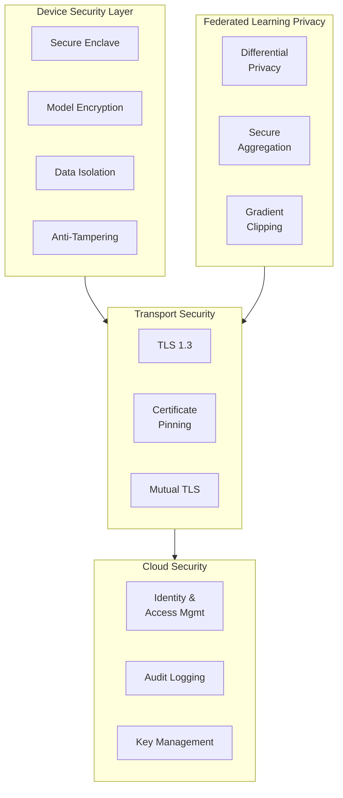
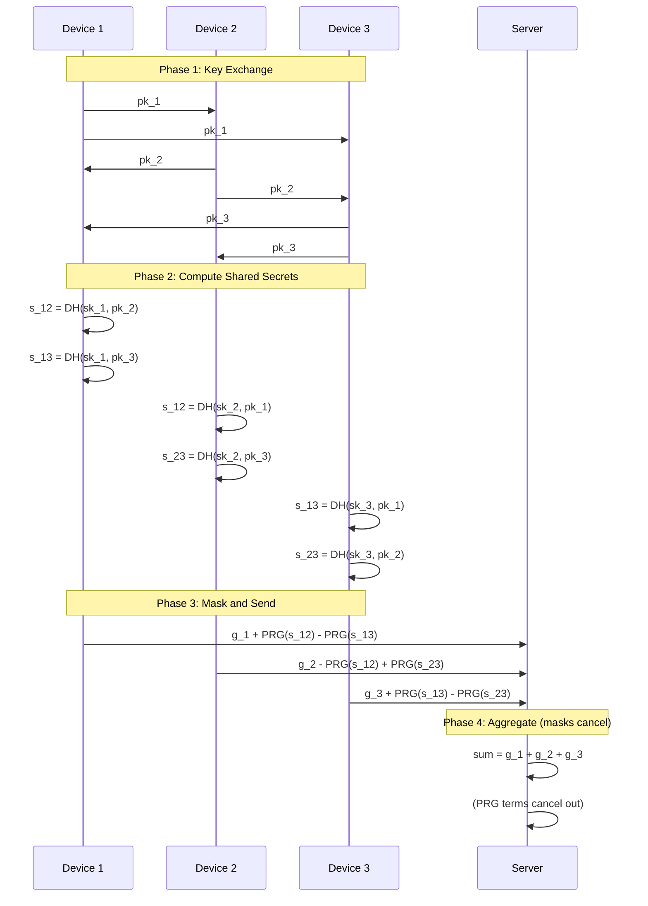

# Security & Compliance

[← Previous: Scalability & Reliability](./05-scalability-and-reliability.md) | [Next: Observability →](./07-observability.md)

---

## Security Model Overview

Edge AI/ML Inference systems handle sensitive user data and valuable model IP. Security must address:
- **User data privacy:** Training data never leaves devices
- **Model IP protection:** Prevent model extraction and theft
- **FL privacy:** Gradients can leak information about training data
- **Supply chain security:** Ensure models aren't tampered with



---

## On-Device Security

### Model Protection

| Threat | Mitigation | Implementation |
|--------|------------|----------------|
| **Model extraction** | Encryption at rest | AES-256-GCM with device-bound key |
| **Reverse engineering** | Obfuscation | Weight scrambling, operator renaming |
| **Memory dumping** | Secure enclave | Load sensitive layers in TEE |
| **Binary patching** | Code signing | Verify app signature before loading |

### Model Encryption Implementation

```
MODEL ENCRYPTION:

// Encryption key derived from device-specific secrets
device_key = KDF(
    device_id + secure_enclave_key + model_id,
    salt=random_bytes(32),
    iterations=100000
)

// Encrypt model on download
FUNCTION encrypt_model(model_bytes, device_key):
    nonce = random_bytes(12)
    ciphertext = AES_GCM_encrypt(
        key=device_key,
        nonce=nonce,
        plaintext=model_bytes,
        aad=model_metadata  // Additional authenticated data
    )
    RETURN nonce + ciphertext

// Decrypt model on load
FUNCTION decrypt_model(encrypted_model, device_key):
    nonce = encrypted_model[:12]
    ciphertext = encrypted_model[12:]
    plaintext = AES_GCM_decrypt(
        key=device_key,
        nonce=nonce,
        ciphertext=ciphertext,
        aad=model_metadata
    )
    RETURN plaintext

// Key never leaves device
// Model decrypted only in memory during inference
// Memory cleared after inference
```

### Secure Enclave Integration

```
SECURE ENCLAVE USAGE:

// Store encryption keys in hardware-backed secure storage
KeyStore keystore = KeyStore.getInstance("AndroidKeyStore")  // or iOS Keychain

// Generate key that never leaves secure enclave
KeyGenerator keygen = KeyGenerator.getInstance("AES", "AndroidKeyStore")
keygen.init(
    KeyGenParameterSpec.Builder("model_key")
        .setKeySize(256)
        .setBlockModes(KeyProperties.BLOCK_MODE_GCM)
        .setEncryptionPaddings(KeyProperties.ENCRYPTION_PADDING_NONE)
        .setUserAuthenticationRequired(false)  // or true for sensitive models
        .setIsStrongBoxBacked(true)  // Hardware security module
        .build()
)

// For highly sensitive inference (e.g., biometrics):
// Run inference inside Trusted Execution Environment (TEE)
// - ARM TrustZone
// - Intel SGX
// - Apple Secure Enclave
```

### Anti-Tampering Measures

| Measure | Protection | Overhead |
|---------|------------|----------|
| **Code signing** | Unauthorized modifications | None (OS-provided) |
| **Runtime integrity checks** | Memory tampering | Low |
| **Obfuscation** | Reverse engineering | None at runtime |
| **Root/jailbreak detection** | Elevated privileges | Low |
| **Debugger detection** | Runtime analysis | Low |

```
RUNTIME INTEGRITY:

FUNCTION verify_integrity():
    // Check app signature
    IF NOT verify_app_signature():
        RETURN FAIL, "App signature invalid"

    // Check for debugging
    IF debugger_attached():
        RETURN FAIL, "Debugger detected"

    // Check for root/jailbreak
    IF device_is_rooted():
        log_warning("Rooted device detected")
        // May allow with reduced functionality

    // Verify model checksum
    IF NOT verify_model_checksum(loaded_model):
        RETURN FAIL, "Model integrity check failed"

    RETURN OK
```

---

## Federated Learning Privacy

### Differential Privacy

Differential privacy ensures that the model doesn't memorize individual training examples.

```
DIFFERENTIAL PRIVACY IN FL:

Configuration:
    epsilon: 8.0        # Privacy budget (lower = more private)
    delta: 1e-5         # Probability of privacy failure
    noise_multiplier: 1.1   # Gaussian noise scale
    max_grad_norm: 1.0  # Gradient clipping threshold

FUNCTION train_with_dp(model, batch, config):
    // Forward pass
    predictions = model.forward(batch.inputs)
    loss = compute_loss(predictions, batch.labels)

    // Compute per-sample gradients
    per_sample_grads = compute_per_sample_gradients(model, loss)

    // Clip gradients (bound sensitivity)
    clipped_grads = []
    FOR grad IN per_sample_grads:
        norm = L2_norm(grad)
        IF norm > config.max_grad_norm:
            grad = grad * (config.max_grad_norm / norm)
        clipped_grads.append(grad)

    // Aggregate clipped gradients
    aggregated = mean(clipped_grads)

    // Add Gaussian noise
    noise_scale = config.noise_multiplier * config.max_grad_norm / len(batch)
    noise = gaussian(mean=0, std=noise_scale, shape=aggregated.shape)
    private_grad = aggregated + noise

    // Update model
    model.weights -= learning_rate * private_grad

    RETURN model

// Privacy accounting:
// Each round consumes part of privacy budget
// Track cumulative (epsilon, delta) using RDP or GDP
```

### Privacy Budget Management

| Rounds | Epsilon per Round | Cumulative Epsilon | Privacy Level |
|--------|-------------------|-------------------|---------------|
| 10 | 2.0 | ~6.3 | Strong |
| 100 | 0.5 | ~5.0 | Strong |
| 1000 | 0.1 | ~3.2 | Very Strong |

```
PRIVACY BUDGET TRACKING:

class PrivacyAccountant:
    def __init__(self, target_epsilon, target_delta):
        self.target_epsilon = target_epsilon
        self.target_delta = target_delta
        self.steps = []

    def consume(self, epsilon, delta):
        self.steps.append((epsilon, delta))

        # Compute cumulative privacy loss using composition theorem
        cumulative = self.compute_cumulative()

        IF cumulative.epsilon > self.target_epsilon:
            RAISE PrivacyBudgetExceeded()

    def compute_cumulative(self):
        # Advanced composition (Kairouz et al., 2015)
        # Better than naive sum for many rounds
        RETURN advanced_composition(self.steps, self.target_delta)

    def remaining_budget(self):
        cumulative = self.compute_cumulative()
        RETURN self.target_epsilon - cumulative.epsilon
```

### Secure Aggregation Protocol

Prevents the server from seeing individual gradients.



### Handling Dropout in Secure Aggregation

```
DROPOUT-RESILIENT SECURE AGGREGATION:

// Problem: If device drops out, their masks don't cancel
// Solution: Secret sharing for recovery

PHASE 1: Setup
    FOR each device D_i:
        // Generate blinding factor
        b_i = random()

        // Secret-share b_i among all other devices
        shares = shamir_secret_share(b_i, threshold=t, total=n)
        FOR each device D_j:
            send_share(D_j, shares[j])

PHASE 2: Mask and Send
    // Each device adds their blinding factor
    masked_g_i = g_i + b_i + sum_of_pairwise_masks

PHASE 3: Handle Dropouts
    IF device D_k drops out:
        // Surviving devices reconstruct D_k's blinding factor
        shares = collect_shares_for(D_k)
        IF len(shares) >= threshold:
            b_k = reconstruct(shares)
            // Subtract b_k from aggregate
        ELSE:
            // Cannot recover, round fails

// Threshold typically set at 50-70% of participants
// Allows up to 30-50% dropout without round failure
```

---

## Threat Model

### Attack Vectors

| Attack | Target | Likelihood | Impact | Mitigation |
|--------|--------|------------|--------|------------|
| **Model theft** | Model IP | Medium | High | Encryption, obfuscation, TEE |
| **Gradient inversion** | Training data | Low | High | DP, secure aggregation, gradient clipping |
| **Model poisoning** | Model integrity | Medium | High | Robust aggregation, anomaly detection |
| **Membership inference** | Privacy | Medium | Medium | DP, training data limits |
| **Data extraction** | User data | Medium | High | On-device only, no data upload |
| **Man-in-the-middle** | Communications | Low | High | TLS 1.3, certificate pinning |
| **Denial of service** | Availability | Medium | Medium | Rate limiting, device attestation |

### Gradient Inversion Attack

```
ATTACK: Gradient Inversion
    // Attacker has access to model and gradient
    // Goal: Reconstruct training data

    FUNCTION invert_gradient(model, gradient, num_samples):
        // Initialize random "fake" data
        fake_data = random_inputs(num_samples)

        FOR iteration IN 1..1000:
            // Compute gradient for fake data
            fake_gradient = compute_gradient(model, fake_data)

            // Minimize distance between gradients
            loss = MSE(gradient, fake_gradient)
            loss += TV_regularization(fake_data)  # Total variation

            fake_data -= learning_rate * gradient_wrt_fake_data(loss)

        RETURN fake_data  # Approximation of original training data

MITIGATION:
    1. Differential privacy (adds noise)
    2. Secure aggregation (server never sees individual gradients)
    3. Large batch sizes (harder to invert)
    4. Gradient compression/sparsification
    5. Train only on aggregated data from many users
```

### Model Poisoning Attack

```
ATTACK: Model Poisoning
    // Malicious device sends bad gradients to degrade model

    FUNCTION poison_gradient(legitimate_gradient, target_class):
        // Scale gradient to have outsized impact
        poisoned = legitimate_gradient * 10

        // Or, inject backdoor
        backdoor_gradient = compute_gradient_for_backdoor(target_class)
        poisoned = legitimate_gradient + backdoor_gradient

        RETURN poisoned

MITIGATION: Robust Aggregation
    FUNCTION robust_aggregate(gradients):
        // Option 1: Trimmed Mean
        FOR each parameter:
            values = [g[param] for g in gradients]
            sorted_values = sort(values)
            trimmed = sorted_values[trim:-trim]  # Remove top/bottom 10%
            aggregated[param] = mean(trimmed)

        // Option 2: Krum
        // Select gradient closest to others (by distance)
        distances = compute_pairwise_distances(gradients)
        scores = [sum of k nearest distances for each gradient]
        selected = gradient with lowest score

        // Option 3: Anomaly Detection
        // Flag gradients with unusual magnitude or direction
        mean_grad = mean(gradients)
        FOR g IN gradients:
            distance = cosine_distance(g, mean_grad)
            IF distance > threshold:
                reject(g)

        RETURN aggregated
```

### Membership Inference Attack

```
ATTACK: Membership Inference
    // Determine if specific data was used for training

    // Train shadow models on known in/out data
    shadow_models = train_shadow_models(known_data)

    // Build attack classifier
    attack_classifier = train_on_shadow_model_outputs()

    // Attack target model
    FUNCTION is_member(model, data_point):
        output = model.inference(data_point)
        confidence = max(output)
        prediction = attack_classifier(confidence)
        RETURN prediction  # True = was in training data

MITIGATION:
    1. Differential privacy (bounded memorization)
    2. Regularization (reduce overfitting)
    3. Limit training data per user
    4. Output perturbation (add noise to inference)
```

---

## Authentication & Authorization

### Device Authentication

```
DEVICE ATTESTATION:

FUNCTION authenticate_device(device):
    // Step 1: Verify device certificate
    IF NOT verify_certificate(device.cert, trusted_ca):
        RETURN FAIL, "Invalid certificate"

    // Step 2: Hardware attestation
    // Android: SafetyNet / Play Integrity API
    // iOS: DeviceCheck / App Attest
    attestation = device.get_attestation()
    IF NOT verify_attestation(attestation):
        RETURN FAIL, "Attestation failed"

    // Step 3: App integrity
    IF NOT verify_app_signature(device.app_signature):
        RETURN FAIL, "Invalid app signature"

    // Step 4: Device ID binding
    device_id = derive_device_id(device.cert, device.hardware_id)
    IF device_id != registered_device_id(device):
        RETURN FAIL, "Device ID mismatch"

    RETURN OK, device_id
```

### FL Participation Authorization

| Check | Purpose | Enforcement |
|-------|---------|-------------|
| **Device attestation** | Ensure genuine device | Hardware attestation |
| **App version** | Ensure compatible client | Version check |
| **Eligibility criteria** | Meet conditions (WiFi, charging) | Client-side + server verification |
| **Rate limiting** | Prevent abuse | Per-device participation limits |
| **Round authorization** | Authorized for specific round | Round-specific token |

### API Security

```
API AUTHENTICATION:

// Model download (device → CDN)
GET /v1/models/{model_id}/download
Authorization: Bearer <device_token>
X-Device-ID: <device_id>
X-Device-Attestation: <attestation_blob>

// Device token is short-lived JWT
{
    "sub": "device_123",
    "aud": "model-service",
    "exp": 1706054400,  // 1 hour validity
    "scope": ["model:read"],
    "device_attestation_hash": "abc123..."
}

// FL gradient submission (device → FL server)
POST /v1/fl/rounds/{round_id}/gradients
Authorization: Bearer <round_token>
X-Device-ID: <device_id>
Content-Type: application/octet-stream

// Round token is specific to FL round
{
    "sub": "device_123",
    "aud": "fl-service",
    "exp": 1706058000,  // Round deadline
    "round_id": "round_42",
    "scope": ["fl:participate"]
}
```

---

## Data Security

### Data Classification

| Data Type | Classification | Storage | Encryption | Retention |
|-----------|---------------|---------|------------|-----------|
| **Training data** | Highly Sensitive | On-device only | N/A (never transmitted) | User-controlled |
| **Model weights** | Confidential | Encrypted at rest | AES-256 | Per model policy |
| **Gradients** | Sensitive | In-transit only | TLS + secure aggregation | Round duration |
| **Telemetry** | Internal | Cloud storage | TLS + at-rest | 90 days |
| **Device metadata** | Internal | Cloud database | At-rest encryption | Account lifetime |

### Encryption Standards

| Data State | Encryption | Algorithm | Key Management |
|------------|------------|-----------|----------------|
| **In transit** | Mandatory | TLS 1.3 | Server certificates |
| **At rest (server)** | Mandatory | AES-256-GCM | Cloud KMS |
| **At rest (device)** | Mandatory | AES-256-GCM | Device keystore |
| **In processing** | Confidential compute (optional) | SGX/TrustZone | Hardware-bound |

### PII Handling

```
PII MINIMIZATION:

// On-device: PII never leaves device
PRINCIPLE: Training data stays local

// Telemetry: Anonymize before transmission
FUNCTION prepare_telemetry(event):
    anonymized = {
        "event_type": event.type,
        "timestamp": round_to_hour(event.timestamp),
        "model_id": event.model_id,
        "latency_bucket": bucket(event.latency),  // 0-10ms, 10-50ms, etc.
        "device_class": generalize(event.device_model),  // "flagship", "midrange"
        // NO: device_id, precise location, user_id
    }
    RETURN anonymized

// FL: Differential privacy prevents memorization
// Even if gradient is intercepted, individual data protected
```

---

## Compliance

### Regulatory Mapping

| Regulation | Applicability | Key Requirements | How Edge AI Helps |
|------------|---------------|------------------|-------------------|
| **GDPR** | EU users | Data minimization, right to erasure | Data stays on device |
| **CCPA** | California users | Data access, deletion rights | No centralized user data |
| **HIPAA** | Health data (US) | PHI protection, access controls | On-device health inference |
| **COPPA** | Children's data | Parental consent, data limits | No data collection |
| **LGPD** | Brazil users | Similar to GDPR | Same benefits |

### GDPR Compliance

| GDPR Principle | Implementation |
|----------------|----------------|
| **Data minimization** | Only collect aggregated gradients, not raw data |
| **Purpose limitation** | Gradients used only for model improvement |
| **Storage limitation** | Gradients deleted after round completion |
| **Right to erasure** | User can delete local data; FL doesn't store individual data |
| **Data portability** | Model available on user's device |
| **Privacy by design** | DP and secure aggregation built-in |

### HIPAA for Health Applications

```
HIPAA COMPLIANCE ARCHITECTURE:

// PHI (Protected Health Information) never leaves device
FUNCTION process_health_data(vital_signs):
    // Inference runs locally
    risk_score = local_model.inference(vital_signs)

    // Only aggregate metrics sent (if any)
    IF user_consents_to_analytics:
        send_anonymized_metrics({
            "risk_category": bucket(risk_score),  // "low", "medium", "high"
            "age_group": generalize(user.age),     // "18-25", "26-35", etc.
            "timestamp": round_to_day(now())
        })

    RETURN risk_score

// FL for health models:
// - Extra DP guarantees (lower epsilon)
// - Secure aggregation mandatory
// - Third-party auditing of privacy
```

### Audit Logging

```
AUDIT LOG REQUIREMENTS:

// Server-side: Full audit trail
{
    "timestamp": "2025-01-22T10:30:00Z",
    "event": "model_deployed",
    "actor": "system",
    "model_id": "health-risk-v2",
    "version": "2.1.0",
    "target_percentage": 10,
    "approval": "change_request_123"
}

{
    "timestamp": "2025-01-22T11:00:00Z",
    "event": "fl_round_started",
    "round_id": "round_42",
    "model_id": "health-risk-v2",
    "target_participants": 10000,
    "dp_epsilon": 8.0
}

// Device-side: Minimal logging (privacy)
{
    "event": "model_updated",
    "model_id": "health-risk-v2",
    "version": "2.1.0",
    "timestamp": "2025-01-22T12:00:00Z"
}
// NO: inference inputs, inference outputs, user data
```

---

## Interview Tips: Security Phase

### Key Points to Emphasize

1. **Privacy is the primary feature** - Edge AI exists because of privacy requirements
2. **Defense in depth** - Multiple layers (encryption, DP, secure aggregation)
3. **Threat model first** - Show understanding of realistic attacks
4. **Compliance awareness** - Connect to GDPR, HIPAA, etc.

### Security Questions to Expect

| Question | Key Points |
|----------|------------|
| "How do you protect the model?" | Encryption at rest, secure enclave, obfuscation |
| "What about gradient attacks?" | DP (quantify epsilon), secure aggregation, gradient clipping |
| "How do you handle compliance?" | Data never leaves device, GDPR-friendly, audit logging |
| "What if a device is compromised?" | TEE for sensitive ops, attestation, graceful degradation |

### Numbers to Know

| Metric | Value | Context |
|--------|-------|---------|
| Differential privacy epsilon | 1-10 | Lower = more private, 8 is common |
| Secure aggregation overhead | 2-3x communication | For pairwise secret exchange |
| Gradient clipping norm | 1.0 | Standard value |
| TLS version | 1.3 | Minimum required |

---

[← Previous: Scalability & Reliability](./05-scalability-and-reliability.md) | [Next: Observability →](./07-observability.md)
