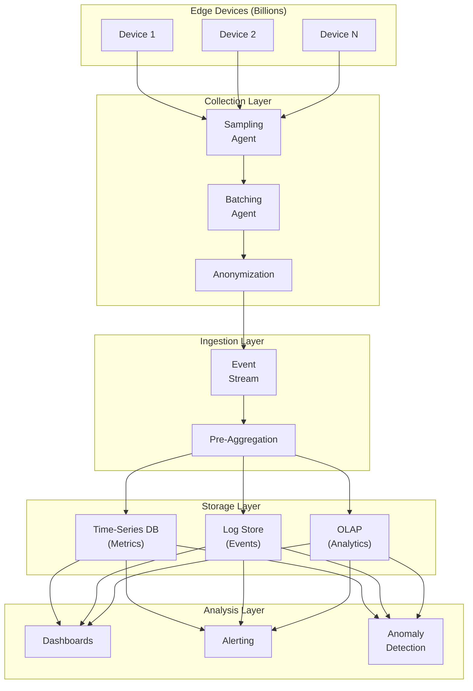
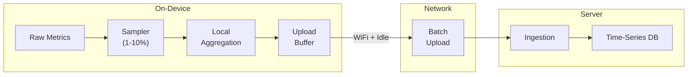
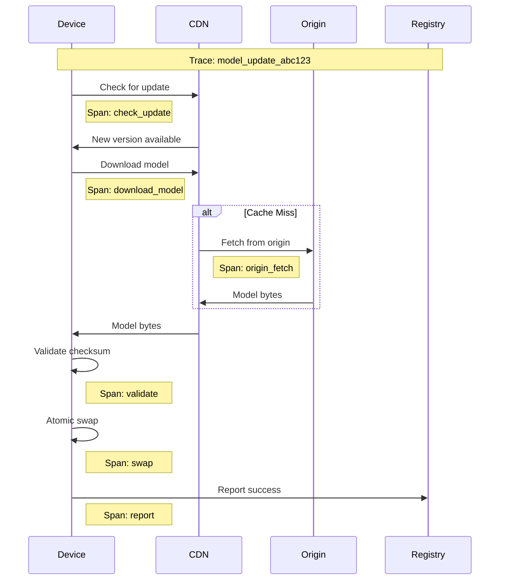
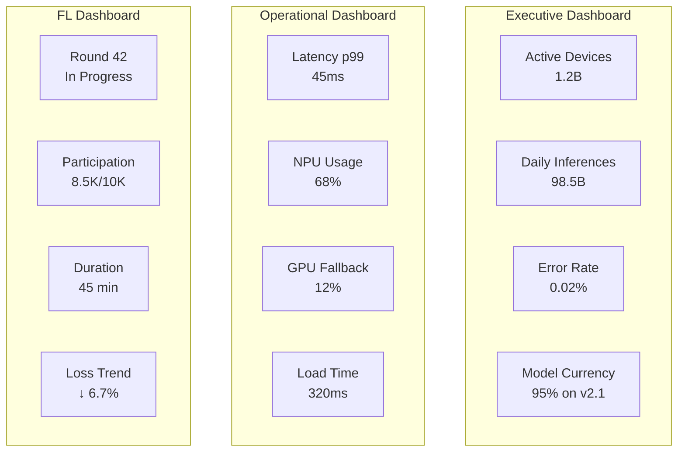

# Observability

[← Previous: Security & Compliance](./06-security-and-compliance.md) | [Next: Interview Guide →](./08-interview-guide.md)

---

## Observability Architecture

Edge AI/ML observability faces unique challenges:
- **Scale:** Billions of devices, millions of events per second
- **Privacy:** Cannot collect detailed inference data
- **Connectivity:** Intermittent, bandwidth-constrained
- **Heterogeneity:** Diverse devices with varying capabilities



---

## Metrics

### Key Metrics Overview

| Category | Metric | Type | Purpose |
|----------|--------|------|---------|
| **Inference** | inference_latency_ms | Histogram | Performance monitoring |
| **Inference** | inference_total | Counter | Usage tracking |
| **Inference** | inference_errors | Counter | Error rate |
| **Model** | model_load_duration_ms | Histogram | Load performance |
| **Model** | model_version_active | Gauge | Version distribution |
| **Model** | quantization_accuracy_delta | Gauge | Quality monitoring |
| **FL** | fl_round_participants | Gauge | Participation health |
| **FL** | fl_round_duration_s | Histogram | Round performance |
| **FL** | fl_gradient_size_bytes | Histogram | Communication cost |
| **Hardware** | delegate_usage | Counter | Hardware utilization |
| **Hardware** | memory_usage_mb | Gauge | Resource consumption |

### Metric Definitions

#### Inference Metrics

```
METRIC: inference_latency_ms
TYPE: Histogram
LABELS: model_id, model_version, delegate, device_class
BUCKETS: [1, 5, 10, 25, 50, 100, 250, 500, 1000]
DESCRIPTION: End-to-end inference latency

COLLECTION:
    // On-device, sampled
    IF random() < SAMPLE_RATE:  // 1% typical
        latency = measure_inference()
        emit_metric("inference_latency_ms", latency, {
            model_id: model.id,
            model_version: model.version,
            delegate: current_delegate,
            device_class: get_device_class()
        })

AGGREGATION:
    // p50, p90, p99 per model/delegate combination
    inference_latency_p50{model="classifier", delegate="npu"} 12.5
    inference_latency_p99{model="classifier", delegate="npu"} 45.2
```

```
METRIC: inference_total
TYPE: Counter
LABELS: model_id, status
DESCRIPTION: Total inference count

COLLECTION:
    // Always increment (lightweight)
    increment_counter("inference_total", {
        model_id: model.id,
        status: "success" | "error"
    })

AGGREGATION:
    // Rate per second
    rate(inference_total{model="classifier"}[5m])
```

#### Model Metrics

```
METRIC: model_load_duration_ms
TYPE: Histogram
LABELS: model_id, model_version, load_type
BUCKETS: [10, 50, 100, 250, 500, 1000, 2000, 5000]
DESCRIPTION: Time to load model into memory

LOAD_TYPES:
    - cold: First load after app start
    - warm: Subsequent load (cached)
    - switch: Switch between models
```

```
METRIC: model_version_active
TYPE: Gauge
LABELS: model_id, model_version
DESCRIPTION: Number of devices running each version

COLLECTION:
    // Reported periodically (daily)
    emit_metric("model_version_active", 1, {
        model_id: model.id,
        model_version: model.version
    })

SERVER-SIDE AGGREGATION:
    // Count devices per version
    model_version_active{model="classifier", version="2.1.0"} 45000000
    model_version_active{model="classifier", version="2.0.0"} 55000000
```

#### Federated Learning Metrics

```
METRIC: fl_round_participants
TYPE: Gauge
LABELS: round_id, model_id, stage
DESCRIPTION: Number of participants in FL round

STAGES:
    - selected: Initially selected
    - training: Currently training
    - submitted: Submitted gradient
    - completed: Round complete
```

```
METRIC: fl_round_duration_s
TYPE: Histogram
LABELS: model_id, outcome
BUCKETS: [60, 300, 600, 1800, 3600, 7200]
DESCRIPTION: Time from round start to completion

OUTCOMES:
    - success: Round completed normally
    - partial: Completed with < target participants
    - failed: Round aborted
```

#### Hardware Metrics

```
METRIC: delegate_usage
TYPE: Counter
LABELS: model_id, delegate, outcome
DESCRIPTION: Delegate selection outcomes

DELEGATES:
    - npu: Neural Processing Unit
    - gpu: Graphics Processing Unit
    - xnnpack: Optimized CPU
    - cpu: Reference CPU

OUTCOMES:
    - success: Delegate executed successfully
    - fallback: Fell back to another delegate
    - error: Delegate failed
```

### Metric Collection Strategy



```
ON-DEVICE METRIC COLLECTION:

class MetricCollector:
    buffer = []
    local_aggregates = {}
    SAMPLE_RATE = 0.01  // 1%
    MAX_BUFFER_SIZE = 1000
    UPLOAD_INTERVAL = 3600  // 1 hour

    FUNCTION record_metric(name, value, labels):
        // Always update local aggregates (counters, gauges)
        key = (name, labels)
        local_aggregates[key].update(value)

        // Sample detailed data (histograms)
        IF random() < SAMPLE_RATE:
            buffer.append({
                name: name,
                value: value,
                labels: labels,
                timestamp: now()
            })

        IF len(buffer) > MAX_BUFFER_SIZE:
            buffer = buffer[-MAX_BUFFER_SIZE:]  // Keep recent

    FUNCTION maybe_upload():
        IF network_available() AND device_idle() AND time_since_last_upload() > UPLOAD_INTERVAL:
            payload = {
                aggregates: local_aggregates,
                samples: buffer
            }
            upload(payload)
            buffer.clear()
            local_aggregates.reset_period()
```

---

## Logging

### Log Levels and Strategy

| Level | On-Device | Server | Examples |
|-------|-----------|--------|----------|
| **ERROR** | Always log | Full detail | Model load failure, inference crash |
| **WARN** | Always log | Aggregated | Delegate fallback, slow inference |
| **INFO** | Sampled (1%) | Aggregated | Model update, FL participation |
| **DEBUG** | Never upload | N/A | Detailed inference trace |

### Structured Log Format

```
LOG EVENT SCHEMA:

{
    "timestamp": "2025-01-22T10:30:00.123Z",
    "level": "WARN",
    "event_type": "delegate_fallback",
    "session_id": "abc123",  // Anonymized
    "model_id": "classifier-v2",
    "model_version": "2.1.0",
    "context": {
        "original_delegate": "npu",
        "fallback_delegate": "cpu",
        "reason": "unsupported_op",
        "op_name": "custom_attention"
    },
    "device_info": {
        "platform": "android",
        "device_class": "flagship",  // Generalized
        "sdk_version": "3.2.0"
    }
}
```

### Privacy-Preserving Logging

```
PRIVACY RULES:

// NEVER log:
- Inference inputs (images, text, audio)
- Inference outputs (predictions, probabilities)
- User identifiers (user_id, email, phone)
- Precise location (GPS coordinates)
- Device identifiers (IMEI, MAC address)

// ALWAYS anonymize:
- Session ID: hash(device_id + date)  // Changes daily
- Timestamps: Round to nearest hour for analysis
- Device model: Generalize to class (flagship, midrange, budget)

// AGGREGATE where possible:
- Instead of: "Inference took 45ms"
- Log: "Inference latency bucket: 25-50ms"
```

### Log Sampling Strategy

```
ADAPTIVE LOG SAMPLING:

class LogSampler:
    base_rate = 0.01  // 1% base rate
    error_rate = 1.0  // 100% for errors
    throttle_window = 60  // seconds
    event_counts = {}

    FUNCTION should_log(event):
        // Always log errors
        IF event.level == ERROR:
            RETURN true

        // Throttle repeated events
        key = event.event_type
        IF key IN event_counts:
            IF event_counts[key].recent_count > 100:
                // Heavily throttle repeated events
                RETURN random() < 0.001  // 0.1%

        // Apply base sampling rate
        RETURN random() < base_rate

    FUNCTION on_log(event):
        key = event.event_type
        event_counts[key].increment()
```

---

## Distributed Tracing

### Trace Contexts

| Flow | Trace Scope | Key Spans |
|------|-------------|-----------|
| **Inference** | Single device | preprocess → inference → postprocess |
| **Model Update** | Device ↔ CDN | check → download → validate → swap |
| **FL Round** | Server ↔ Devices | select → distribute → train → collect → aggregate |

### Model Distribution Tracing



### FL Round Tracing

```
FL ROUND TRACE STRUCTURE:

Trace: fl_round_42
├── Span: coordinator/start_round
│   ├── round_id: 42
│   └── target_participants: 10000
│
├── Span: coordinator/select_participants
│   ├── eligible_count: 50000
│   └── selected_count: 10000
│
├── [Parallel] Span: device/local_training (sampled)
│   ├── device_class: flagship
│   ├── samples_trained: 1500
│   ├── local_loss: 0.342
│   └── duration_s: 45
│
├── Span: aggregator/collect_gradients
│   ├── expected: 10000
│   ├── received: 8500
│   └── timeout_count: 1500
│
├── Span: aggregator/secure_aggregate
│   ├── gradient_count: 8500
│   └── duration_s: 120
│
└── Span: coordinator/complete_round
    ├── global_loss_before: 0.45
    ├── global_loss_after: 0.42
    └── improvement: 6.7%
```

### Trace Sampling

```
TRACE SAMPLING STRATEGY:

// Head-based sampling (decision at trace start)
SAMPLE_RATES = {
    "inference": 0.0001,      // 0.01% - very high volume
    "model_update": 0.01,      // 1% - important
    "fl_participation": 0.001  // 0.1% - high volume
}

// Tail-based sampling (decision after trace complete)
// Keep traces that:
// - Have errors
// - Are slow (p99+)
// - Match specific conditions

FUNCTION should_keep_trace(trace):
    IF trace.has_error:
        RETURN true
    IF trace.duration > p99_threshold:
        RETURN true
    IF trace.matches_debug_filter:
        RETURN true
    RETURN random() < SAMPLE_RATES[trace.type]
```

---

## Alerting

### Alert Categories

| Category | Severity | Response Time | Example |
|----------|----------|---------------|---------|
| **P1 - Critical** | Page | < 5 min | FL aggregator down, model corruption |
| **P2 - High** | Page (business hours) | < 30 min | Error rate spike, latency degradation |
| **P3 - Medium** | Ticket | < 4 hours | Single region issues, capacity warnings |
| **P4 - Low** | Ticket | < 24 hours | Minor anomalies, cleanup tasks |

### Alert Definitions

```yaml
# Critical Alerts (P1)

- name: InferenceErrorRateHigh
  severity: P1
  condition: |
    rate(inference_errors[5m]) / rate(inference_total[5m]) > 0.05
  for: 5m
  annotations:
    summary: "Inference error rate > 5% for {{ $labels.model_id }}"
    runbook: "https://runbooks/inference-errors"

- name: FLAggregatorDown
  severity: P1
  condition: |
    up{job="fl-aggregator"} == 0
  for: 2m
  annotations:
    summary: "FL Aggregator {{ $labels.instance }} is down"
    runbook: "https://runbooks/fl-aggregator-down"

# High Alerts (P2)

- name: InferenceLatencyHigh
  severity: P2
  condition: |
    histogram_quantile(0.99, inference_latency_ms) > 100
  for: 15m
  annotations:
    summary: "p99 inference latency > 100ms for {{ $labels.model_id }}"

- name: ModelUpdateFailureRate
  severity: P2
  condition: |
    rate(model_update_failures[1h]) / rate(model_update_attempts[1h]) > 0.01
  for: 1h
  annotations:
    summary: "Model update failure rate > 1%"

- name: FLRoundTimeout
  severity: P2
  condition: |
    fl_round_duration_s > 7200  # 2 hours
  annotations:
    summary: "FL round {{ $labels.round_id }} exceeded 2 hour timeout"

# Medium Alerts (P3)

- name: DelegateFailbackRate
  severity: P3
  condition: |
    rate(delegate_fallback_total[1h]) / rate(delegate_usage_total[1h]) > 0.1
  for: 1h
  annotations:
    summary: "Delegate fallback rate > 10%"

- name: FLParticipationLow
  severity: P3
  condition: |
    fl_round_participants / fl_round_target < 0.7
  for: 30m
  annotations:
    summary: "FL participation below 70% of target"
```

### Alert Routing

```
ALERT ROUTING:

P1 (Critical):
    - PagerDuty escalation
    - Slack #edge-ai-critical
    - Auto-create incident

P2 (High):
    - PagerDuty (business hours)
    - Slack #edge-ai-alerts
    - Create Jira ticket

P3 (Medium):
    - Slack #edge-ai-alerts
    - Create Jira ticket

P4 (Low):
    - Slack #edge-ai-info
    - Weekly review
```

---

## Dashboards

### Executive Dashboard

| Panel | Metrics | Refresh |
|-------|---------|---------|
| **Active Devices** | device_heartbeat_total | 1 min |
| **Daily Inferences** | sum(inference_total) | 5 min |
| **Error Rate** | errors/total | 1 min |
| **Model Distribution** | version_active by version | 1 hour |
| **FL Rounds Completed** | fl_rounds_complete | 1 hour |

### Operational Dashboard

| Panel | Metrics | Purpose |
|-------|---------|---------|
| **Inference Latency (p50/p99)** | Histogram quantiles | Performance |
| **Delegate Distribution** | delegate_usage by type | Hardware utilization |
| **Model Load Time** | model_load_duration_ms | User experience |
| **Error Breakdown** | errors by type | Debugging |
| **Regional Health** | metrics by region | Geographic issues |

### FL Dashboard

| Panel | Metrics | Purpose |
|-------|---------|---------|
| **Active Rounds** | fl_rounds by status | Round status |
| **Participation Rate** | actual/target | Health indicator |
| **Round Duration** | fl_round_duration_s | Performance |
| **Gradient Sizes** | fl_gradient_size_bytes | Communication cost |
| **Model Convergence** | global_loss over rounds | Training progress |

### Dashboard Example (Mermaid)



---

## Anomaly Detection

### Automated Anomaly Detection

```
ANOMALY DETECTION PIPELINE:

// Collect baseline statistics
FOR each metric IN monitored_metrics:
    baseline[metric] = {
        mean: rolling_mean(metric, window=7d),
        stddev: rolling_stddev(metric, window=7d),
        p50: rolling_percentile(metric, 50, window=7d),
        p99: rolling_percentile(metric, 99, window=7d)
    }

// Detect anomalies
FUNCTION detect_anomaly(metric, current_value):
    z_score = (current_value - baseline[metric].mean) / baseline[metric].stddev

    IF abs(z_score) > 3:
        RETURN ANOMALY, "Value is 3+ stddev from mean"

    IF current_value > baseline[metric].p99 * 1.5:
        RETURN ANOMALY, "Value is 50%+ above p99"

    RETURN NORMAL

// Correlate anomalies
FUNCTION find_root_cause(anomaly):
    // Find other metrics that changed at same time
    correlated = []
    FOR metric IN all_metrics:
        IF changed_significantly(metric, anomaly.timestamp):
            correlated.append(metric)

    // Suggest root cause based on correlations
    IF "delegate_fallback_rate" IN correlated:
        RETURN "Possible hardware issue causing delegate fallbacks"
    IF "model_version" IN correlated:
        RETURN "Anomaly correlated with model update"
```

### ML-Based Anomaly Detection

```
ML ANOMALY DETECTION:

// Train model on historical data
features = [
    "inference_latency_p50",
    "inference_latency_p99",
    "error_rate",
    "delegate_fallback_rate",
    "hour_of_day",
    "day_of_week"
]

model = IsolationForest(contamination=0.01)
model.fit(historical_data[features])

// Real-time scoring
FUNCTION score_current_state():
    current = collect_current_metrics(features)
    anomaly_score = model.decision_function(current)

    IF anomaly_score < threshold:
        alert("ML-detected anomaly", current)
```

---

## Interview Tips: Observability Phase

### Key Points to Emphasize

1. **Privacy constraints** - Can't collect everything; sampling and anonymization critical
2. **Scale challenges** - Billions of devices, different collection strategy than cloud
3. **Edge-specific metrics** - Hardware utilization, delegate selection, model updates
4. **Actionable alerting** - Don't just alert, provide runbook links

### Observability Questions to Expect

| Question | Key Points |
|----------|------------|
| "How do you monitor inference performance?" | Sampled latency histograms, aggregated error rates |
| "What about privacy?" | Anonymized device IDs, no PII, aggregation |
| "How do you handle the scale?" | Client-side sampling, batched uploads, pre-aggregation |
| "What alerts would you set up?" | Error rate, latency p99, FL participation, model failures |

### Numbers to Know

| Metric | Value | Context |
|--------|-------|---------|
| Metric sample rate | 0.1-1% | Typical for high-volume inference |
| Log sample rate | 1% normal, 100% errors | Adaptive sampling |
| Trace sample rate | 0.01% | Very high volume |
| Alert SLO | 99.9% | False positive rate |
| Dashboard refresh | 1-5 min | Real-time enough for operations |

---

[← Previous: Security & Compliance](./06-security-and-compliance.md) | [Next: Interview Guide →](./08-interview-guide.md)
