# Interview Guide

[← Previous: Observability](./07-observability.md) | [Back to Index →](./00-index.md)

---

## Interview Pacing (45-Minute Format)

```mermaid
gantt
    title Edge AI/ML Inference Interview Timeline
    dateFormat mm
    axisFormat %M min

    section Clarify
    Requirements & Scope       :a1, 00, 5m

    section High-Level
    Core Architecture          :a2, 05, 10m

    section Deep Dive
    Quantization OR FL         :a3, 15, 15m

    section Scale
    Trade-offs & Edge Cases    :a4, 30, 10m

    section Wrap
    Summary & Questions        :a5, 40, 5m
```



| Phase | Time | Focus | Goals |
|-------|------|-------|-------|
| **Clarify** | 0-5 min | Requirements | Scope the problem, identify constraints |
| **High-Level** | 5-15 min | Architecture | Draw core components, data flows |
| **Deep Dive** | 15-30 min | Critical Component | Show depth in ONE area |
| **Scale** | 30-40 min | Trade-offs | Discuss bottlenecks, failures, scale |
| **Wrap** | 40-45 min | Summary | Recap, answer follow-ups |

---

## Phase 1: Clarifying Questions (5 min)

### Essential Questions to Ask

| Question | Why It Matters | Impact on Design |
|----------|----------------|------------------|
| "What types of ML models?" | Vision vs NLP vs LLM | Different latency/memory requirements |
| "Target devices?" | Mobile, IoT, automotive | Hardware constraints vary dramatically |
| "Latency requirements?" | Real-time vs background | Determines delegate strategy |
| "Is federated learning needed?" | Privacy requirements | Adds significant complexity |
| "Acceptable accuracy loss?" | Quantization aggressiveness | INT4 vs INT8 vs FP16 |
| "Offline operation required?" | Network assumptions | Caching strategy |
| "Fleet size?" | Scale | Distribution architecture |

### Sample Clarification Dialogue

```
YOU: "Before I dive in, let me ask a few clarifying questions.
     What type of ML models are we deploying? Vision, NLP, or something else?"

INTERVIEWER: "Let's say image classification for a mobile camera app."

YOU: "Got it. What are the latency requirements? Real-time during capture,
     or can we process in the background?"

INTERVIEWER: "Real-time - users expect instant results."

YOU: "So we're looking at sub-30ms inference. What about model updates -
     do we need federated learning for privacy-preserving improvement?"

INTERVIEWER: "Yes, we'd like to improve the model from user data without
     collecting the images."

YOU: "Understood. Let me summarize: real-time image classification on mobile,
     with federated learning for model improvement. I'll design for that scope."
```

---

## Phase 2: High-Level Design (10 min)

### What to Draw

```
ESSENTIAL COMPONENTS:

┌─────────────────────────────────────────────────────────────────┐
│                        CLOUD                                      │
│  ┌──────────────┐  ┌──────────────┐  ┌──────────────┐           │
│  │   Training   │  │    Model     │  │      FL      │           │
│  │   Pipeline   │──│   Registry   │──│  Aggregator  │           │
│  └──────────────┘  └──────┬───────┘  └──────────────┘           │
│                           │                    ▲                  │
│                    ┌──────▼───────┐            │                  │
│                    │     CDN      │            │                  │
│                    └──────┬───────┘            │                  │
└───────────────────────────┼────────────────────┼──────────────────┘
                            │                    │
                            ▼                    │
┌───────────────────────────────────────────────────────────────────┐
│                        DEVICE                                      │
│  ┌──────────────┐  ┌──────────────┐  ┌──────────────┐            │
│  │     App      │──│   ML SDK     │──│   Runtime    │            │
│  └──────────────┘  └──────────────┘  └──────┬───────┘            │
│                                              │                    │
│         ┌──────────────┐  ┌─────────┴────────┐                   │
│         │ Model Cache  │  │  HW Abstraction  │────┬────┐         │
│         └──────────────┘  └──────────────────┘    │    │         │
│                                                   ▼    ▼         │
│                                               ┌─────┐┌─────┐     │
│                                               │ NPU ││ CPU │     │
│                                               └─────┘└─────┘     │
└───────────────────────────────────────────────────────────────────┘
```

### Key Points to Cover

1. **Inference flow:** App → SDK → Runtime → Hardware
2. **Model distribution:** Registry → CDN → Device Cache
3. **Hardware abstraction:** NPU/GPU/CPU with fallback
4. **FL loop (if required):** Device → Aggregator → Updated Model

### Key Phrases to Use

- "Data never leaves the device - inference is fully local"
- "Hardware abstraction layer enables NPU optimization with CPU fallback"
- "CDN-based distribution with delta updates for bandwidth efficiency"
- "Federated learning preserves privacy while enabling model improvement"

---

## Phase 3: Deep Dive (15 min)

### Option A: Quantization Pipeline

**When to choose:** Interviewer asks about model optimization, size, performance

```
KEY POINTS TO COVER:

1. Why quantization matters
   - FP32: 100MB model → INT8: 25MB model
   - 75% memory reduction
   - 2-4x speedup on NPU

2. PTQ vs QAT
   - PTQ: Post-training, fast, 1-2% accuracy loss
   - QAT: During training, slower, <0.5% accuracy loss

3. Calibration process
   - Collect activation statistics on representative data
   - Compute scale and zero-point per layer
   - Min-max vs entropy vs percentile calibration

4. Failure modes
   - Sensitive layers (first/last) may need FP16
   - Outlier activations cause clipping
   - Some operators don't support INT8

WALKTHROUGH:
"Let me walk through the quantization pipeline...

First, we take the FP32 model from training.
We run it on a calibration dataset - typically 100-1000 samples.
During this, we collect min/max statistics for each layer's activations.

For weights, we use symmetric quantization:
  scale = max(abs(weights)) / 127
  quantized = round(weights / scale)

For activations, we use asymmetric (0-255 range) with calibrated ranges.

The key trade-off is accuracy vs compression. With QAT, we can achieve
less than 0.5% accuracy drop. With PTQ, it's typically 1-2%.

If we see accuracy collapse on specific layers, we keep those in FP16
and use mixed precision. This is common for attention layers in transformers."
```

### Option B: Federated Learning

**When to choose:** Interviewer emphasizes privacy, distributed training

```
KEY POINTS TO COVER:

1. Why FL (not centralized training)
   - User data stays on device
   - GDPR/privacy compliance
   - Bandwidth savings

2. FedAvg algorithm
   - Select K devices
   - Each trains locally for E epochs
   - Upload gradients (not data)
   - Weighted aggregation by data size

3. Secure aggregation
   - Pairwise masking cancels during aggregation
   - Server never sees individual gradients
   - Handles dropout via secret sharing

4. Non-IID challenges
   - User data distributions differ
   - Can cause model divergence
   - Solutions: FedProx, personalization layers

WALKTHROUGH:
"For federated learning, let me explain the round structure...

Step 1: Selection
  We filter devices meeting criteria: WiFi, charging, idle, has data.
  Sample 10,000 from eligible pool.

Step 2: Distribution
  Push current global model to selected devices.

Step 3: Local Training
  Each device trains for 5 epochs on local data only.
  Applies differential privacy: gradient clipping + noise.

Step 4: Gradient Upload
  Devices compute: delta = local_weights - global_weights.
  Apply secure aggregation masks.
  Upload masked gradients.

Step 5: Aggregation
  Sum masked gradients (masks cancel out).
  Weight by data size: larger datasets have more influence.

The key privacy guarantee is differential privacy with epsilon=8.
This bounds how much any individual's data can affect the model.
Combined with secure aggregation, the server learns nothing about
individual training data."
```

### Option C: Hardware Abstraction

**When to choose:** Interviewer asks about device heterogeneity, performance

```
KEY POINTS TO COVER:

1. Hardware landscape
   - NPU: 2-10W, specialized for NN ops, not all devices
   - GPU: 5-15W, good performance, more universal
   - CPU: fallback, always available

2. Delegate selection
   - Check operator coverage
   - Estimate latency
   - Respect constraints (power, memory)

3. Fallback strategy
   - Graceful degradation
   - Hybrid execution (some ops on NPU, some on CPU)

4. Memory management
   - Memory-mapped loading (instant load)
   - Operator fusion (reduce intermediate tensors)

WALKTHROUGH:
"The hardware abstraction layer is critical because device capabilities
vary enormously...

When we load a model, we first probe available hardware:
  - Is NPU present? What generation?
  - GPU capabilities?
  - CPU core count?

Then we analyze operator coverage. NPUs typically support 80-95% of
common ops, but may lack custom attention or exotic activations.

The decision algorithm:
  1. Check NPU coverage > 95%? → Use NPU delegate
  2. Coverage 80-95%? → Hybrid: NPU + CPU fallback
  3. No NPU or poor coverage? → GPU delegate
  4. GPU unavailable? → Optimized CPU (XNNPACK)

For memory, we use memory-mapped loading. Instead of reading the
100MB model into RAM, we map the file directly. The OS handles
paging. This makes 'load time' essentially instant.

Key trade-off: NPU gives best latency and power efficiency, but
30-50% of devices don't have one. We must always have CPU fallback."
```

---

## Phase 4: Scale & Trade-offs (10 min)

### Trade-off Tables

| Trade-off | Option A | Option B | Recommendation |
|-----------|----------|----------|----------------|
| **INT8 vs FP16** | 75% smaller, faster | Higher accuracy | INT8 with QAT for production |
| **PTQ vs QAT** | Fast to implement | Better accuracy | QAT for < 1% accuracy loss |
| **On-device vs Cloud** | Privacy, low latency | Better accuracy, compute | On-device for edge |
| **FedAvg vs FedProx** | Simpler | Handles non-IID better | FedAvg for most cases |
| **Full vs Delta updates** | Simpler | 90% less bandwidth | Delta for production |

### Scale Discussion Points

```
SCALING QUESTIONS TO EXPECT:

Q: "How do you handle 10x growth (1B devices)?"
A: "Horizontal scaling at multiple layers:
    - CDN: Add more edge PoPs, multi-CDN
    - FL: Regional aggregators (hierarchical aggregation)
    - Model Registry: Shard by model_id
    Key insight: Most load is at edge (devices), not cloud."

Q: "What if a region goes down?"
A: "Devices continue operating offline with cached models.
    FL rounds in that region fail but others continue.
    Multi-region CDN ensures model distribution resilience.
    No single point of failure affects inference."

Q: "What's the bottleneck at 100M devices?"
A: "Model distribution bandwidth during updates.
    Solution: Delta updates (90% reduction) + staged rollouts.
    FL aggregation compute during rounds.
    Solution: Hierarchical aggregation (regional → global)."
```

### Failure Scenarios

| Failure | Impact | Mitigation |
|---------|--------|------------|
| Model download fails | Can't update | Use previous version, retry |
| NPU unavailable | Slow inference | Graceful CPU fallback |
| FL round dropout > 50% | Round fails | Lower threshold, async FL |
| Model produces bad results | User impact | Staged rollouts, quick rollback |
| Network offline | No updates/FL | Full offline inference |

---

## Phase 5: Wrap-up (5 min)

### Summary Template

```
"Let me summarize the key design decisions:

1. ARCHITECTURE
   - On-device inference for privacy and latency
   - Cloud for training and FL aggregation
   - CDN for model distribution

2. INFERENCE OPTIMIZATION
   - INT8 quantization with QAT for 75% size reduction
   - Hardware abstraction with NPU/GPU/CPU fallback
   - Sub-30ms latency target for real-time use

3. FEDERATED LEARNING
   - FedAvg with secure aggregation
   - Differential privacy (epsilon=8)
   - Regional aggregators for scale

4. KEY TRADE-OFFS
   - Prioritized privacy over model accuracy
   - Accepted complexity for offline support
   - Used platform-specific runtimes for best performance"
```

### Questions for the Interviewer

- "Are there specific constraints I should consider for the target devices?"
- "What's the expected model update frequency?"
- "Any thoughts on the FL approach for this use case?"

---

## Common Trap Questions

| Trap Question | What They're Testing | Best Answer |
|---------------|---------------------|-------------|
| "Why not just use cloud inference?" | Understanding edge benefits | "Three reasons: latency (can't achieve <10ms with network), privacy (data never leaves device), and cost (no per-inference charges). Plus offline operation." |
| "Just use FP32 for best accuracy" | Understanding constraints | "FP32 is 4x larger, won't fit in device memory, and NPUs are optimized for INT8. With QAT, we achieve <0.5% accuracy loss while gaining 2-4x speedup." |
| "FL is just distributed training" | FL nuances | "Key differences: non-IID data (users have different distributions), communication constraints (can't do many rounds), privacy requirements (can't see individual updates), and device heterogeneity." |
| "What if users have no data?" | Edge cases | "Federated learning uses only users with sufficient local data. Selection criteria ensure minimum samples. Global model works for all users; FL improves it over time." |
| "Why not train on the server?" | Privacy | "Collecting user images/text violates privacy expectations and regulations like GDPR. FL enables improvement without data collection." |

---

## Common Mistakes to Avoid

| Mistake | Why It's Wrong | Correct Approach |
|---------|---------------|------------------|
| Assuming all devices have NPU | Only 30-50% do | Always design for CPU fallback |
| Ignoring offline mode | Users expect it to work | Cache models, queue updates |
| Treating FL as regular training | Very different constraints | Address non-IID, dropout, privacy |
| Forgetting model update failures | Can corrupt device | Atomic swap, version rollback |
| Over-optimizing for latest hardware | Excludes most users | Design for median device |
| Collecting detailed telemetry | Privacy violation | Sample, anonymize, aggregate |

---

## Quick Reference Card

### Key Numbers

| Metric | Value | Context |
|--------|-------|---------|
| INT8 memory reduction | 75% | vs FP32 |
| INT8 latency speedup | 2-4x | On NPU |
| NPU power | 2-10W | vs 50-700W GPU |
| Typical FL participation | 10-20% | Of eligible devices |
| Model cold start target | < 2s | First inference |
| Inference latency target | < 30ms | Real-time vision |
| Apple on-device LLM | 3B params | 33 tok/s on M1 Max |
| DP epsilon (typical) | 4-10 | Lower = more private |

### Key Technologies

| Component | Technology |
|-----------|------------|
| Android Runtime | LiteRT (TensorFlow Lite) |
| iOS Runtime | Core ML |
| Cross-platform | ONNX Runtime |
| Quantization | INT8 (PTQ/QAT), FP16 |
| FL Algorithm | FedAvg + Secure Aggregation |
| DP Library | TF Privacy, Opacus |

### Key Formulas

```
Memory after INT8 = FP32_size × 0.25

Inference memory ≈ 2 × model_size  (weights + activations)

FL bandwidth = participants × compressed_gradient_size

CDN bandwidth = fleet_size × update_rate × model_size
             = 100M × 0.1/day × 100MB = 1 PB/day

Privacy budget: ε_total = Σ(ε_per_round) (simplified)
```

---

## Sample Interview Transcript

```
INTERVIEWER: "Design an edge ML system for real-time image classification
              on mobile devices."

YOU: "Great question. Let me start with a few clarifying questions.
     What's the target latency for inference?"

INTERVIEWER: "Users expect results within a second."

YOU: "Got it, so real-time. And is federated learning required for
     model improvement?"

INTERVIEWER: "Yes, we want to improve from user data without collecting images."

YOU: "Perfect. Let me draw the high-level architecture..."

[Draw architecture diagram]

YOU: "The system has three main components:
     1. Cloud: Training pipeline, model registry, FL aggregator
     2. CDN: Distributes models to devices
     3. Device: ML runtime with hardware abstraction

     For inference, the flow is App → SDK → Runtime → NPU.
     Models are INT8 quantized for 75% size reduction and 2-4x speedup.
     We use LiteRT on Android, Core ML on iOS.

     For federated learning, we select 10K devices per round that meet
     criteria: WiFi, charging, sufficient local data. Each trains locally
     for 5 epochs, applies DP noise, then uploads masked gradients.
     Server aggregates using secure aggregation so it never sees
     individual updates."

INTERVIEWER: "What if the NPU isn't available?"

YOU: "Good question. We handle this with graceful degradation.
     The hardware abstraction layer probes available delegates.
     If NPU isn't available - which is true for 30-50% of devices -
     we fall back to GPU, then to optimized CPU (XNNPACK).
     Latency degrades from ~10ms to ~50-100ms, but functionality
     is preserved. The app can show a spinner for slower devices."

INTERVIEWER: "How do you handle quantization accuracy loss?"

YOU: "We use Quantization-Aware Training instead of Post-Training
     Quantization. During training, we simulate INT8 quantization,
     so the model learns to be robust to reduced precision.
     This achieves <0.5% accuracy loss vs the 1-2% typical of PTQ.

     For sensitive layers like the first conv and final FC, we can
     keep them in FP16 using mixed precision if needed."

INTERVIEWER: "What are the main trade-offs in this design?"

YOU: "Three key trade-offs:
     1. Privacy vs accuracy: On-device FL can't match centralized
        training accuracy, but users trust us with their data.
     2. Size vs precision: INT8 is smaller/faster but loses some
        accuracy. We mitigate with QAT.
     3. Universality vs optimization: Platform-specific runtimes
        (LiteRT, CoreML) outperform universal ones like ONNX,
        but require more development effort."

INTERVIEWER: "Any questions for me?"

YOU: "Yes - what's the expected model update frequency, and are
     there any specific devices we need to optimize for?"
```

---

## Evaluation Rubric

### What Interviewers Look For

| Criteria | Weak | Strong |
|----------|------|--------|
| **Problem Scoping** | Jumps to solution | Clarifies requirements, identifies constraints |
| **System Design** | Missing key components | Complete architecture with clear data flows |
| **Technical Depth** | Surface-level | Deep understanding of ONE area |
| **Trade-offs** | One-sided | Explicit trade-offs with reasoned choices |
| **Scale Awareness** | Ignores scale | Addresses horizontal scaling, bottlenecks |
| **Failure Handling** | Assumes happy path | Discusses failures, degradation, recovery |
| **Communication** | Monologue | Interactive, checks understanding |

---

[← Previous: Observability](./07-observability.md) | [Back to Index →](./00-index.md)
