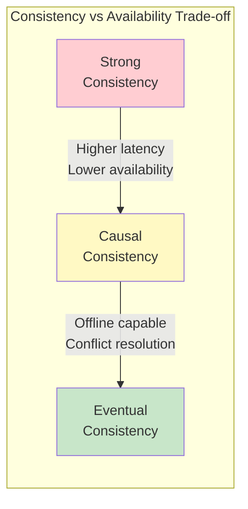
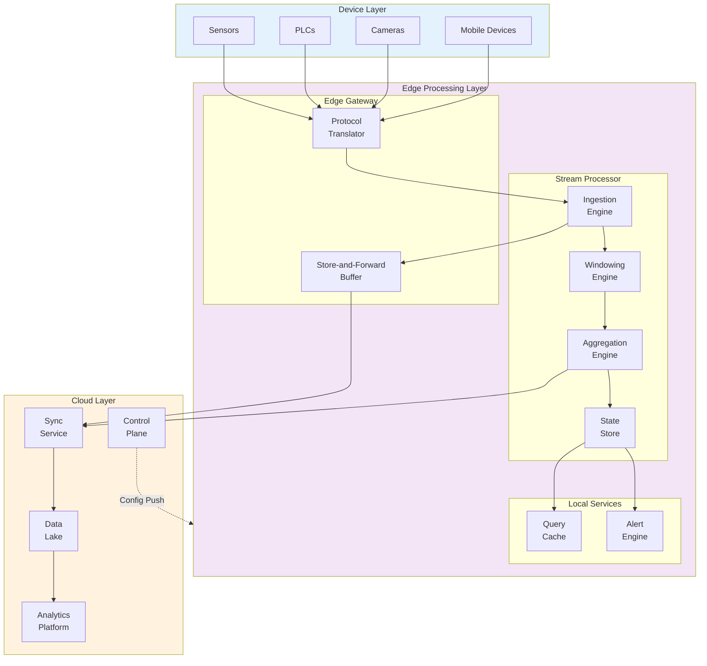

# Edge Data Processing

[Back to System Design Index](../README.md)

---

## Overview

Edge Data Processing enables real-time data ingestion, transformation, and aggregation at the network edge—close to where data is generated. Rather than streaming all raw data to centralized cloud infrastructure, edge processing reduces latency, minimizes bandwidth costs, and provides resilience during network outages through local-first architectures with store-and-forward capabilities.

This design covers stream processing engines running on resource-constrained edge nodes, time-sensitive networking for industrial applications, and synchronization patterns for eventual consistency between edge and cloud.

---

## Key Characteristics

| Characteristic | Value | Notes |
|----------------|-------|-------|
| **Traffic Pattern** | Write-heavy | Continuous sensor/device ingestion |
| **Latency Target** | < 50ms local, < 500ms sync | Real-time local, eventual cloud |
| **Consistency Model** | Eventual with causal ordering | Local-first, sync-later |
| **Availability Target** | 99.9% edge uptime | Must operate offline 24+ hours |
| **Data Model** | Time-series events | Timestamped, ordered streams |
| **State** | Stateful | Windowed aggregations, checkpoints |
| **Retention** | Hours locally, days in cloud | Tiered storage strategy |
| **Processing** | Stream + micro-batch | Real-time with periodic sync |

---

## Quick Navigation

| Section | Description |
|---------|-------------|
| [01 - Requirements & Estimations](./01-requirements-and-estimations.md) | Functional/non-functional requirements, capacity planning |
| [02 - High-Level Design](./02-high-level-design.md) | Architecture diagrams, data flow, key decisions |
| [03 - Low-Level Design](./03-low-level-design.md) | Data models, APIs, algorithms (pseudocode) |
| [04 - Deep Dive & Bottlenecks](./04-deep-dive-and-bottlenecks.md) | Critical components, failure modes, bottleneck analysis |
| [05 - Scalability & Reliability](./05-scalability-and-reliability.md) | Scaling strategies, fault tolerance, disaster recovery |
| [06 - Security & Compliance](./06-security-and-compliance.md) | Threat model, authentication, data protection |
| [07 - Observability](./07-observability.md) | Metrics, logging, tracing, alerting |
| [08 - Interview Guide](./08-interview-guide.md) | 45-min pacing, trap questions, trade-offs |

---

## Complexity Rating

| Aspect | Complexity | Reason |
|--------|------------|--------|
| **Requirements** | Medium | Well-defined streaming patterns, but variable edge constraints |
| **Architecture** | High | Distributed edge nodes, hybrid connectivity, state management |
| **Data Model** | Medium | Time-series with windowing, but standard event schemas |
| **Algorithms** | High | Watermarks, CRDTs, store-and-forward, downsampling |
| **Scaling** | High | Heterogeneous hardware, geo-distribution, offline handling |
| **Operations** | High | Remote edge management, firmware updates, state recovery |

**Overall: High**

---

## Technology Landscape

### Edge Stream Processing Engines

| Technology | Deployment | Throughput | State Management | Use Case |
|------------|------------|------------|------------------|----------|
| **Kafka (KRaft)** | 2GB+ RAM | 100+ MB/s | Log-based, durable | Industrial IoT, retail |
| **Flink (embedded)** | 4GB+ RAM | 50K+ events/s | RocksDB checkpoints | Complex event processing |
| **Benthos/Redpanda** | 512MB+ RAM | 10K+ events/s | In-memory | Lightweight edge |
| **ksqlDB** | 2GB+ RAM | 10K+ events/s | Kafka-backed | SQL-based transformations |
| **Custom (SQLite)** | 256MB+ RAM | 5K+ events/s | WAL-based | Minimal footprint |

### Time-Sensitive Networking (TSN) Standards

| Standard | Purpose | Latency | Use Case |
|----------|---------|---------|----------|
| **IEEE 802.1AS** | Time synchronization | < 1μs accuracy | Clock distribution |
| **IEEE 802.1Qbv** | Time-aware shaper | Deterministic scheduling | Critical traffic priority |
| **IEEE 802.1Qbu** | Frame preemption | Reduced latency | Interrupt non-critical frames |
| **IEEE 802.1CB** | Seamless redundancy | Zero packet loss | Dual-path failover |

### Consistency Spectrum

---

## Real-World Implementations

| Company/System | Architecture | Key Features | Scale |
|----------------|--------------|--------------|-------|
| **Chick-fil-A** | Kubernetes + Kafka per restaurant | Real-time analytics, offline operation | 3,000+ locations |
| **Tesla** | Custom edge stack in vehicles | Sensor fusion, local ML inference | Millions of vehicles |
| **Siemens Industrial Edge** | Docker containers on PLCs | OPC-UA integration, TSN support | Factory floors |
| **AWS IoT Greengrass** | Lambda at edge | Local compute, ML inference | Industrial IoT |
| **Azure IoT Edge** | Container modules | Store-and-forward, offline | Smart buildings |
| **Confluent Edge** | Kafka + ksqlDB | Stream processing, data sovereignty | Retail, manufacturing |

---

## Architecture Overview

---

## Key Design Decisions Summary

| Decision | Options | Recommendation | Rationale |
|----------|---------|----------------|-----------|
| **Ingestion Model** | Push vs Pull | Hybrid (push from devices, pull sync to cloud) | Devices push real-time; cloud pulls on schedule |
| **State Storage** | In-memory vs Persistent | Persistent (SQLite/RocksDB) | Survive restarts, support offline |
| **Consistency** | Strong vs Eventual | Eventual with causal ordering | Enable offline, resolve conflicts via CRDTs |
| **Windowing** | Time-based vs Count-based | Time-based (tumbling + sliding) | Natural fit for time-series analytics |
| **Sync Strategy** | Continuous vs Batch | Adaptive batch (based on connectivity) | Optimize bandwidth, handle variable networks |
| **Clock Sync** | NTP vs PTP | PTP for TSN, NTP for general | Sub-ms accuracy where needed |

---

## Interview Quick Reference

### Must-Know Concepts

| Concept | Definition |
|---------|------------|
| **Store-and-Forward** | Buffer data locally during outages, forward when connectivity returns |
| **Watermark** | Timestamp indicating all earlier events have been processed |
| **Tumbling Window** | Fixed-size, non-overlapping time windows for aggregation |
| **CRDT** | Conflict-Free Replicated Data Type for automatic conflict resolution |
| **Backpressure** | Mechanism to slow producers when consumers can't keep up |
| **Exactly-Once** | Processing guarantee where each event affects state exactly once |

### Key Trade-offs

| Trade-off | Option A | Option B |
|-----------|----------|----------|
| **Latency vs Cost** | Edge processing (faster, more hardware) | Cloud processing (slower, less hardware) |
| **Freshness vs Bandwidth** | Stream everything (fresh, high bandwidth) | Aggregate at edge (delayed, low bandwidth) |
| **Consistency vs Availability** | Strong consistency (unavailable offline) | Eventual consistency (available offline) |
| **Simplicity vs Features** | Stateless edge (simple, limited) | Stateful edge (complex, powerful) |

### Red Flags in Interviews

- Assuming always-connected network availability
- Ignoring time synchronization challenges across distributed edge nodes
- Not planning for buffer overflow during extended outages
- Overlooking clock skew impact on windowed aggregations
- Designing for cloud-scale hardware at resource-constrained edge

---

## Prerequisites

Before diving into this design, familiarity with the following is recommended:

- [1.5 - Distributed Log-Based Broker](../1.5-distributed-log-based-broker/00-index.md) - Kafka internals, partitioning
- [1.6 - Distributed Message Queue](../1.6-distributed-message-queue/00-index.md) - Message delivery guarantees
- [2.8 - Edge Computing Platform](../2.8-edge-computing-platform/00-index.md) - Edge execution environments
- [2.12 - Edge-Native Application Platform](../2.12-edge-native-application-platform/00-index.md) - Edge databases, state sync

---

## Related Designs

- [2.13 - Edge AI/ML Inference](../2.13-edge-ai-ml-inference/00-index.md) - ML models consuming edge data
- [2.15 - Edge-Native Feature Flags](../2.15-edge-native-feature-flags/00-index.md) - Configuration at edge (upcoming)
- [3.2 - Time-Series Database](../3.2-time-series-database/00-index.md) - Storage for processed data (upcoming)

---

[Next: Requirements & Estimations →](./01-requirements-and-estimations.md)
