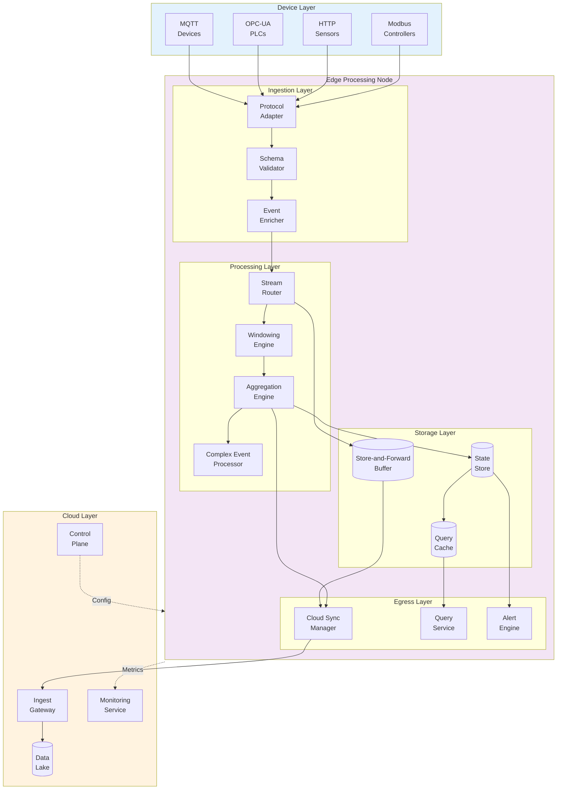
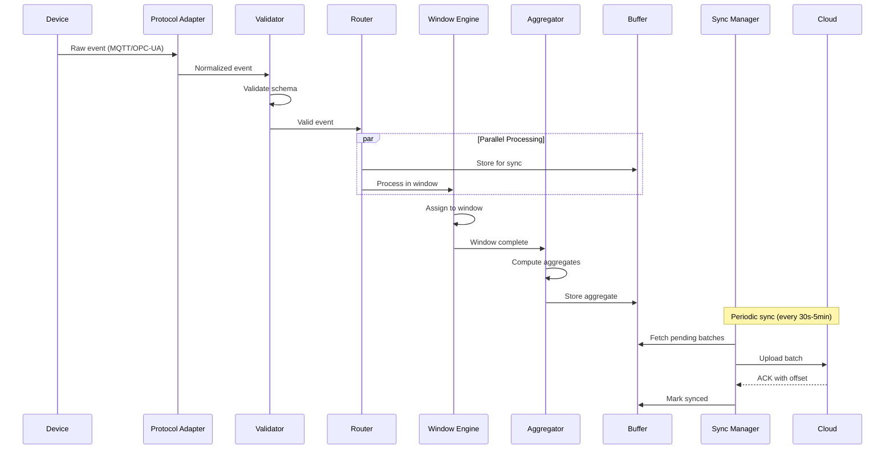
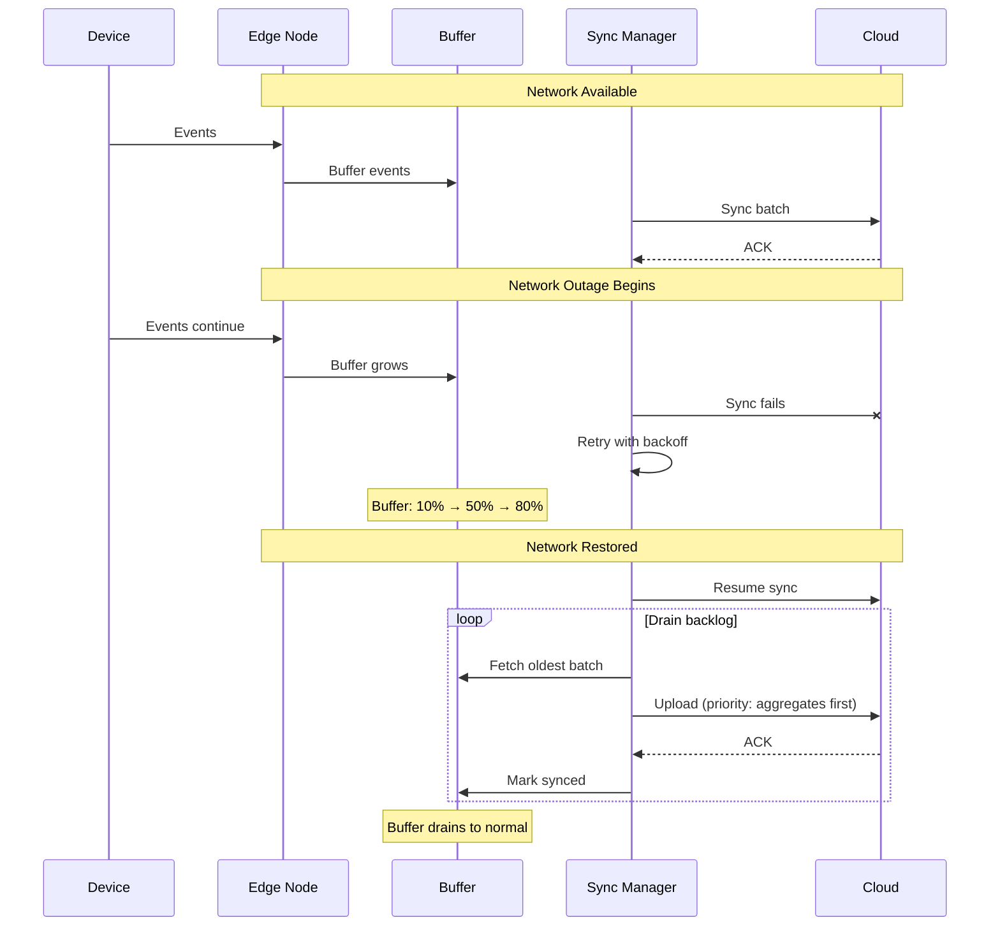
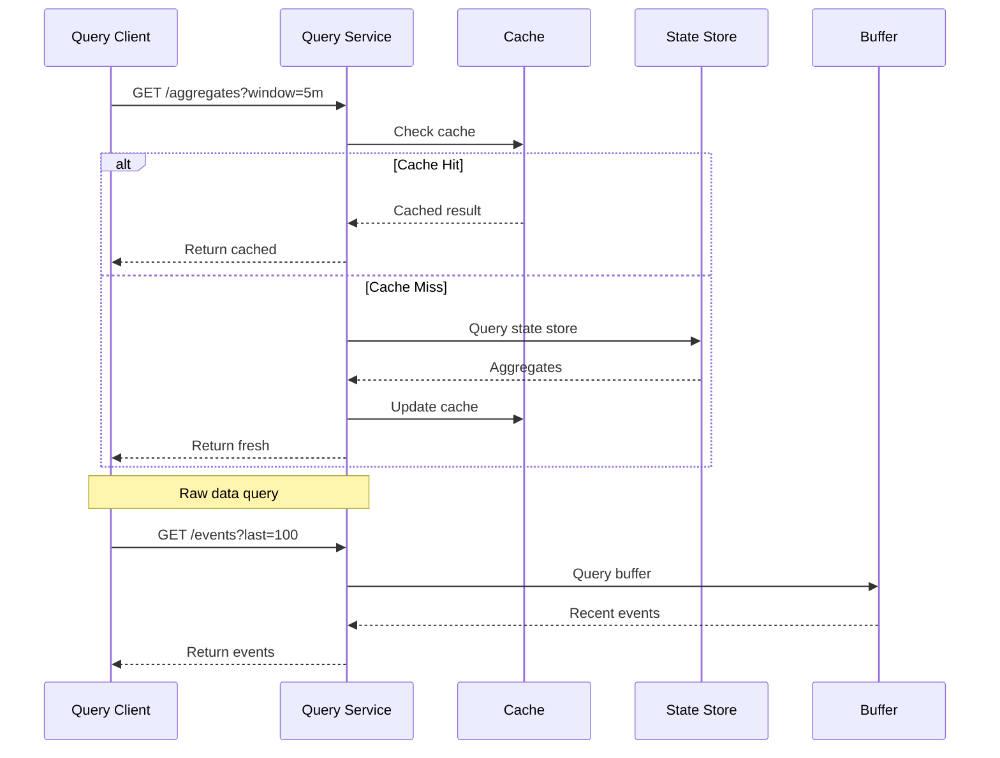
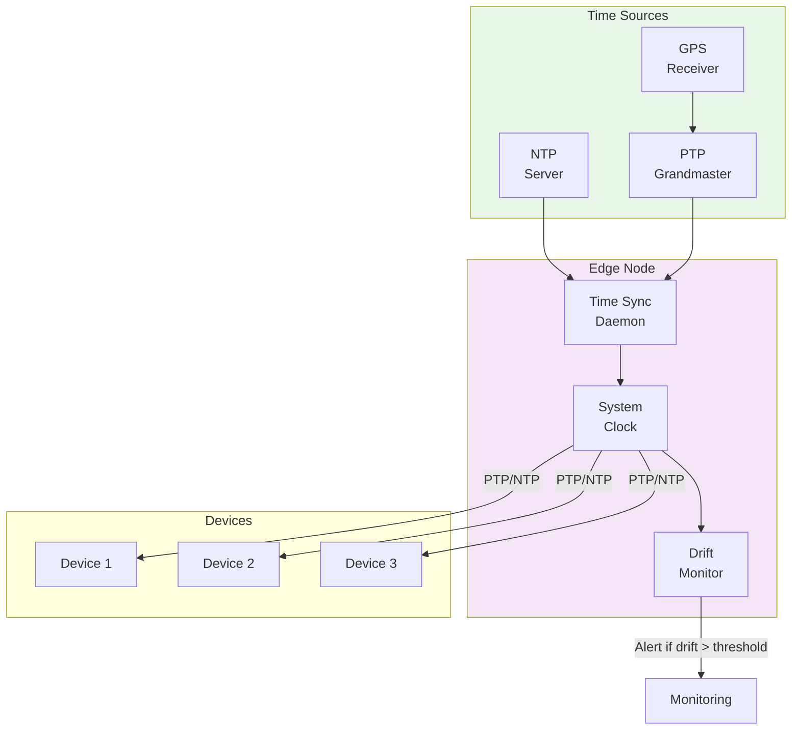
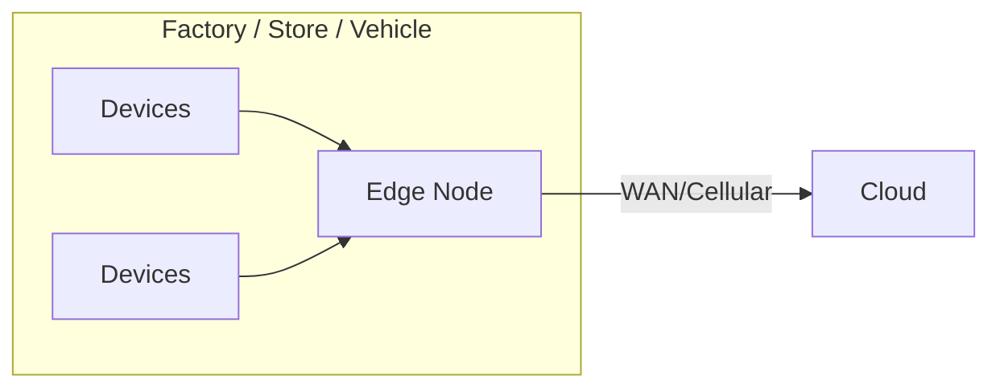
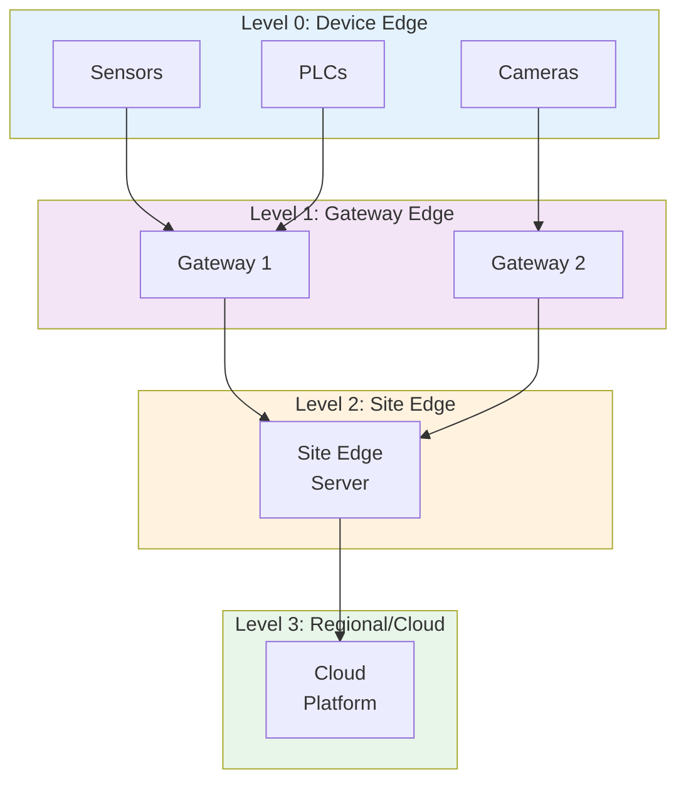
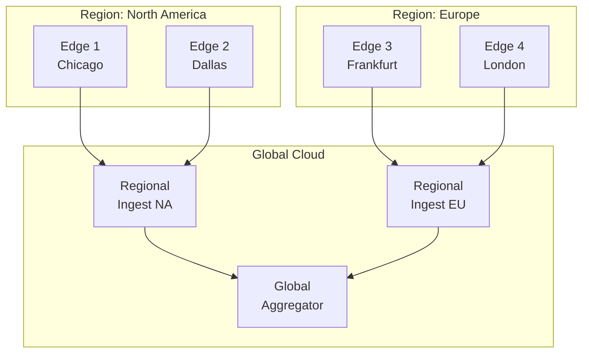

# High-Level Design

[Back to Index](./00-index.md) | [Previous: Requirements](./01-requirements-and-estimations.md) | [Next: Low-Level Design →](./03-low-level-design.md)

---

## System Architecture

---

## Component Descriptions

### Device Layer

| Component | Protocol | Data Type | Typical Sources |
|-----------|----------|-----------|-----------------|
| **MQTT Adapter** | MQTT 3.1.1/5.0 | Telemetry, events | IoT sensors, gateways |
| **OPC-UA Adapter** | OPC-UA Binary/JSON | Industrial data | PLCs, SCADA, HMIs |
| **HTTP Adapter** | REST/WebSocket | JSON payloads | Web-enabled devices |
| **Modbus Adapter** | Modbus TCP/RTU | Register values | Legacy industrial equipment |

### Ingestion Layer

| Component | Responsibility | Output |
|-----------|---------------|--------|
| **Protocol Adapter** | Convert device protocols to internal format | Normalized events |
| **Schema Validator** | Validate event structure, reject malformed | Valid events |
| **Event Enricher** | Add metadata (timestamp, edge_id, sequence) | Enriched events |

### Processing Layer

| Component | Responsibility | State |
|-----------|---------------|-------|
| **Stream Router** | Route events to appropriate processors | Stateless |
| **Windowing Engine** | Assign events to time windows | Window boundaries |
| **Aggregation Engine** | Compute statistics within windows | Partial aggregates |
| **Complex Event Processor** | Detect patterns across events | Pattern state |

### Storage Layer

| Component | Purpose | Durability |
|-----------|---------|------------|
| **Store-and-Forward Buffer** | Hold events for cloud sync | Persistent (WAL) |
| **State Store** | Window state, checkpoints | Persistent (RocksDB/SQLite) |
| **Query Cache** | Recent aggregates for fast queries | In-memory (LRU) |

### Egress Layer

| Component | Responsibility | Downstream |
|-----------|---------------|------------|
| **Cloud Sync Manager** | Batch and upload data to cloud | Cloud ingest gateway |
| **Query Service** | Serve local queries for aggregates | Local dashboards, APIs |
| **Alert Engine** | Evaluate thresholds, trigger alerts | Notification systems |

---

## Data Flow Patterns

### Pattern 1: Normal Operation (Write Path)

### Pattern 2: Network Outage and Recovery

### Pattern 3: Local Query Path

---

## Key Architectural Decisions

### Decision 1: Ingestion Model

| Option | Pros | Cons |
|--------|------|------|
| **Push-only** | Real-time, simple devices | Edge must handle bursts |
| **Pull-only** | Edge controls pace | Polling overhead, latency |
| **Hybrid (Recommended)** | Best of both | More complex |

**Recommendation: Hybrid**
- Devices **push** events to edge (real-time)
- Edge **pulls** from cloud for config (controlled)
- Cloud **pulls** from edge for sync (backpressure-friendly)

### Decision 2: State Management

| Option | Pros | Cons |
|--------|------|------|
| **Stateless (process and forget)** | Simple, fast recovery | No windowing, limited analytics |
| **In-memory state** | Fast processing | Lost on restart |
| **Persistent state (Recommended)** | Survives restarts | Slower writes |

**Recommendation: Persistent State with Checkpointing**
- Use RocksDB or SQLite for durability
- Checkpoint every 30 seconds
- Recover from last checkpoint on restart

### Decision 3: Consistency Model

| Option | Pros | Cons |
|--------|------|------|
| **Strong consistency** | Always correct | Unavailable offline |
| **Eventual consistency (Recommended)** | Available offline | Temporary inconsistency |
| **Causal consistency** | Preserves order | More complex |

**Recommendation: Eventual Consistency with Causal Ordering**
- Each device stream maintains causal order (sequence numbers)
- Cross-device operations are eventually consistent
- CRDTs handle conflicts during sync

### Decision 4: Windowing Strategy

| Window Type | Use Case | Trigger |
|-------------|----------|---------|
| **Tumbling** | Regular reporting (every 5 min) | Time-based |
| **Sliding** | Moving averages | Time-based with overlap |
| **Session** | Activity-based grouping | Inactivity gap |
| **Count-based** | Fixed batch sizes | Event count |

**Recommendation: Tumbling Windows as Default**
- 1-minute, 5-minute, 1-hour windows for different granularities
- Sliding windows for alerting (detect spikes)
- Session windows for user/device activity

### Decision 5: Sync Strategy

| Option | Pros | Cons |
|--------|------|------|
| **Continuous streaming** | Real-time cloud visibility | High bandwidth, complex |
| **Fixed interval batch** | Simple, predictable | Delayed visibility |
| **Adaptive batch (Recommended)** | Balances both | More complex |

**Recommendation: Adaptive Batch Sync**
- Normal: Sync every 1-5 minutes
- Backlog: Increase batch size, prioritize aggregates
- Critical: Stream immediately (alerts, anomalies)

---

## Time Synchronization Architecture

**Time Accuracy Requirements:**

| Environment | Protocol | Accuracy | Use Case |
|-------------|----------|----------|----------|
| **General IoT** | NTP | < 50ms | Logging, analytics |
| **Industrial** | PTP (IEEE 1588) | < 1ms | Coordinated control |
| **TSN-Enabled** | gPTP (802.1AS) | < 1μs | Real-time automation |

---

## Deployment Topology

### Single Edge Node (Small Deployment)

### Hierarchical Edge (Large Deployment)

### Multi-Site with Geo-Distribution

---

## Architecture Pattern Checklist

| Pattern | Decision | Rationale |
|---------|----------|-----------|
| Sync vs Async | **Async** (message-passing internally) | Decouple components, handle backpressure |
| Event-driven vs Request-response | **Event-driven** (streaming) | Natural fit for continuous data |
| Push vs Pull | **Hybrid** (push ingest, pull sync) | Real-time ingest, controlled sync |
| Stateless vs Stateful | **Stateful** (windowed processing) | Enable aggregations and patterns |
| Read-heavy vs Write-heavy | **Write-heavy** (ingest dominates) | Optimize write path |
| Real-time vs Batch | **Micro-batch** (streaming with batched sync) | Balance latency and efficiency |
| Edge vs Origin | **Edge-first** (process locally) | Reduce latency and bandwidth |

---

## Integration Points

### Upstream (Devices → Edge)

| Protocol | Port | Format | Notes |
|----------|------|--------|-------|
| MQTT | 1883/8883 | JSON/Protobuf | TLS on 8883 |
| OPC-UA | 4840 | Binary/JSON | UA Binary preferred |
| HTTP | 8080/8443 | JSON | REST or WebSocket |
| Modbus TCP | 502 | Binary | Legacy support |

### Downstream (Edge → Cloud)

| Protocol | Format | Batching | Notes |
|----------|--------|----------|-------|
| HTTPS | JSON/Protobuf | 1000 events or 30s | Compressed (gzip/zstd) |
| gRPC | Protobuf | Streaming | Bidirectional for control |
| Kafka Protocol | Avro/Protobuf | Producer batching | If Kafka in cloud |

### Control Plane (Cloud → Edge)

| Operation | Protocol | Frequency |
|-----------|----------|-----------|
| Configuration updates | gRPC/HTTPS | On-demand |
| Heartbeat/health | HTTPS | Every 30s |
| Firmware updates | HTTPS (chunked) | On-demand |
| Time sync | NTP/PTP | Continuous |

---

[Back to Index](./00-index.md) | [Previous: Requirements](./01-requirements-and-estimations.md) | [Next: Low-Level Design →](./03-low-level-design.md)
