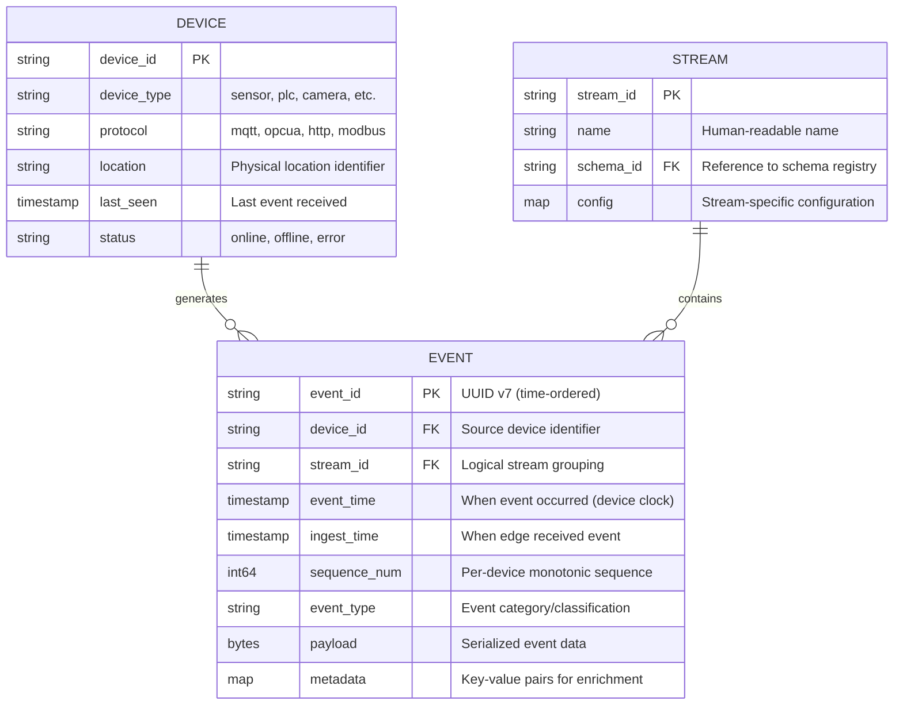
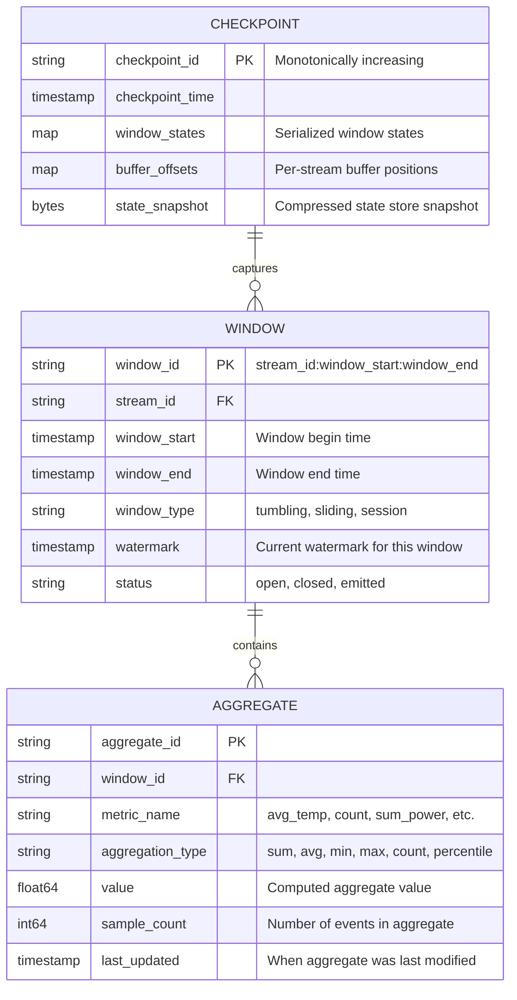
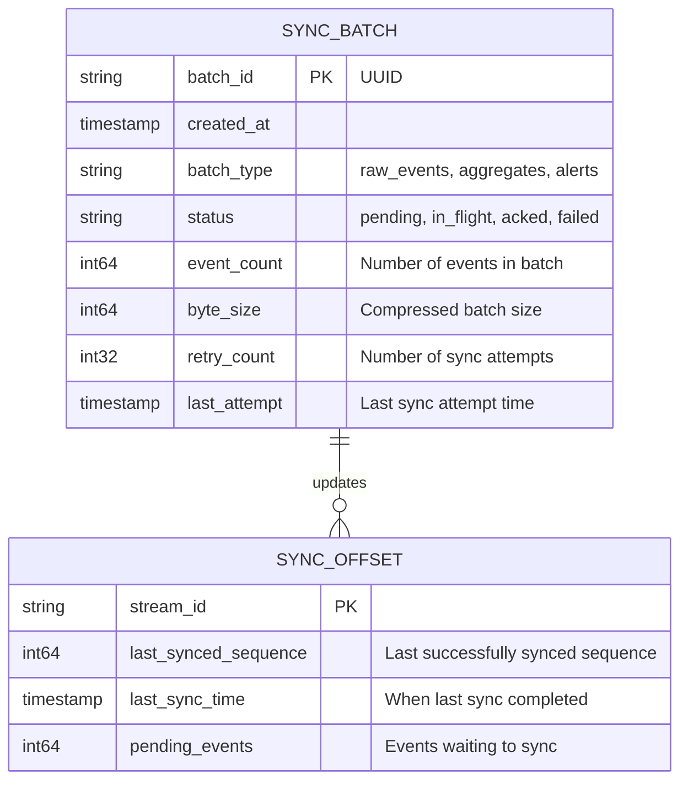

# Low-Level Design

[Back to Index](./00-index.md) | [Previous: High-Level Design](./02-high-level-design.md) | [Next: Deep Dive →](./04-deep-dive-and-bottlenecks.md)

---

## Data Model

### Event Schema



### Event Record Format

```
+------------------+------------------+------------------+------------------+
|    Header (32B)  |   Metadata (var) |   Payload (var)  |   Checksum (4B)  |
+------------------+------------------+------------------+------------------+

Header Layout:
+--------+--------+--------+--------+--------+--------+--------+--------+
| Magic  | Version| Flags  | EventType       | Timestamp (8B)            |
| (2B)   | (1B)   | (1B)   | (2B)            |                           |
+--------+--------+--------+--------+--------+--------+--------+--------+
| Sequence Number (8B)              | Device ID Hash (4B)| Payload Len(4B)|
+--------+--------+--------+--------+--------+--------+--------+--------+

Flags:
  Bit 0: Compressed (0=no, 1=yes)
  Bit 1: Encrypted (0=no, 1=yes)
  Bit 2: Has metadata (0=no, 1=yes)
  Bit 3: Priority (0=normal, 1=high)
  Bits 4-7: Reserved
```

### Window State Schema



### Sync State Schema



---

## API Design

### Ingestion API (Device → Edge)

#### POST /v1/events (Batch Ingestion)

```
POST /v1/events
Content-Type: application/json
X-Device-ID: device-123
X-Device-Token: <auth_token>

Request:
{
  "events": [
    {
      "event_type": "temperature_reading",
      "event_time": "2024-01-15T10:30:00.123Z",
      "sequence": 1001,
      "payload": {
        "sensor_id": "temp-001",
        "value": 23.5,
        "unit": "celsius"
      }
    },
    {
      "event_type": "temperature_reading",
      "event_time": "2024-01-15T10:30:01.456Z",
      "sequence": 1002,
      "payload": {
        "sensor_id": "temp-001",
        "value": 23.7,
        "unit": "celsius"
      }
    }
  ]
}

Response (200 OK):
{
  "accepted": 2,
  "rejected": 0,
  "errors": []
}

Response (207 Multi-Status):
{
  "accepted": 1,
  "rejected": 1,
  "errors": [
    {
      "index": 1,
      "code": "INVALID_SCHEMA",
      "message": "Missing required field: sensor_id"
    }
  ]
}
```

#### WebSocket /v1/events/stream (Streaming Ingestion)

```
WS /v1/events/stream
Upgrade: websocket
X-Device-ID: device-123

Client → Server (Event):
{
  "type": "event",
  "data": {
    "event_type": "temperature_reading",
    "event_time": "2024-01-15T10:30:00.123Z",
    "sequence": 1001,
    "payload": { "value": 23.5 }
  }
}

Server → Client (ACK):
{
  "type": "ack",
  "sequence": 1001
}

Server → Client (Backpressure):
{
  "type": "backpressure",
  "delay_ms": 100
}
```

### Query API (Local Queries)

#### GET /v1/aggregates

```
GET /v1/aggregates?stream=temperature&window=5m&metric=avg&from=2024-01-15T10:00:00Z&to=2024-01-15T11:00:00Z

Response (200 OK):
{
  "stream": "temperature",
  "window_size": "5m",
  "metric": "avg",
  "data": [
    {
      "window_start": "2024-01-15T10:00:00Z",
      "window_end": "2024-01-15T10:05:00Z",
      "value": 23.4,
      "sample_count": 300
    },
    {
      "window_start": "2024-01-15T10:05:00Z",
      "window_end": "2024-01-15T10:10:00Z",
      "value": 23.6,
      "sample_count": 298
    }
  ]
}
```

#### GET /v1/events (Raw Event Query)

```
GET /v1/events?stream=temperature&limit=100&after_sequence=1000

Response (200 OK):
{
  "events": [
    {
      "event_id": "01HN...",
      "device_id": "device-123",
      "event_time": "2024-01-15T10:30:00.123Z",
      "sequence": 1001,
      "payload": { "value": 23.5 }
    }
  ],
  "next_sequence": 1101,
  "has_more": true
}
```

### Sync API (Edge → Cloud)

#### POST /v1/sync/batch

```
POST /v1/sync/batch
Content-Type: application/x-protobuf
Content-Encoding: zstd
X-Edge-ID: edge-chicago-01
X-Batch-ID: batch-uuid-123
X-Idempotency-Key: edge-chicago-01:batch-uuid-123

Request: <compressed protobuf batch>

Response (200 OK):
{
  "batch_id": "batch-uuid-123",
  "status": "accepted",
  "events_processed": 1000,
  "sync_offset": {
    "stream_temperature": 5001,
    "stream_pressure": 3002
  }
}

Response (409 Conflict - Duplicate):
{
  "batch_id": "batch-uuid-123",
  "status": "already_processed",
  "original_sync_time": "2024-01-15T10:35:00Z"
}
```

### Control API (Cloud → Edge)

#### PUT /v1/config

```
PUT /v1/config
X-Config-Version: 42
X-Config-Signature: <hmac_signature>

Request:
{
  "version": 42,
  "streams": {
    "temperature": {
      "window_sizes": ["1m", "5m", "1h"],
      "aggregations": ["avg", "min", "max"],
      "retention_hours": 24
    }
  },
  "sync": {
    "interval_seconds": 60,
    "batch_size": 1000,
    "priority_streams": ["alerts"]
  },
  "alerts": {
    "temperature_high": {
      "condition": "avg > 30",
      "window": "5m",
      "action": "notify"
    }
  }
}

Response (200 OK):
{
  "applied_version": 42,
  "effective_time": "2024-01-15T10:36:00Z"
}
```

#### GET /v1/status

```
GET /v1/status

Response (200 OK):
{
  "edge_id": "edge-chicago-01",
  "status": "healthy",
  "uptime_seconds": 86400,
  "buffer": {
    "utilization_percent": 35,
    "pending_events": 50000,
    "oldest_event_age_seconds": 120
  },
  "sync": {
    "last_successful": "2024-01-15T10:35:00Z",
    "lag_seconds": 60,
    "status": "connected"
  },
  "processing": {
    "events_per_second": 5000,
    "latency_p99_ms": 12
  }
}
```

---

## Core Algorithms

### Algorithm 1: Store-and-Forward Buffer Management

```
STRUCTURE BufferEntry:
    event_id: STRING
    sequence: INT64
    timestamp: TIMESTAMP
    stream_id: STRING
    payload: BYTES
    status: ENUM (PENDING, SYNCING, SYNCED)
    retry_count: INT

STRUCTURE Buffer:
    storage: PersistentKVStore  // SQLite or RocksDB
    max_size_bytes: INT64
    current_size_bytes: INT64
    high_water_mark: FLOAT = 0.8
    low_water_mark: FLOAT = 0.6

FUNCTION append(event: Event) -> Result:
    // Check capacity
    IF current_size_bytes >= max_size_bytes * high_water_mark:
        TRIGGER backpressure_signal()

    IF current_size_bytes >= max_size_bytes:
        // Emergency: evict oldest synced entries
        evict_synced_entries(target_size = max_size_bytes * low_water_mark)

        IF current_size_bytes >= max_size_bytes:
            RETURN Error("Buffer full, data loss imminent")

    // Create entry
    entry = BufferEntry(
        event_id = event.id,
        sequence = event.sequence,
        timestamp = event.event_time,
        stream_id = event.stream_id,
        payload = serialize(event),
        status = PENDING,
        retry_count = 0
    )

    // Write with WAL for durability
    storage.put(
        key = format("{stream_id}:{sequence}"),
        value = entry,
        sync = TRUE  // fsync for durability
    )

    current_size_bytes += entry.size()
    RETURN Ok(entry.event_id)

FUNCTION fetch_sync_batch(batch_size: INT, priority_streams: LIST) -> List[BufferEntry]:
    batch = []

    // Priority streams first
    FOR stream IN priority_streams:
        entries = storage.scan(
            prefix = stream,
            filter = (status == PENDING),
            limit = batch_size - batch.length
        )
        batch.extend(entries)

    // Fill remaining with other streams
    IF batch.length < batch_size:
        entries = storage.scan(
            filter = (status == PENDING),
            order_by = timestamp ASC,
            limit = batch_size - batch.length
        )
        batch.extend(entries)

    // Mark as syncing
    FOR entry IN batch:
        entry.status = SYNCING
        storage.put(entry.key, entry)

    RETURN batch

FUNCTION mark_synced(batch_ids: List[STRING]):
    FOR id IN batch_ids:
        entry = storage.get(id)
        entry.status = SYNCED
        storage.put(entry.key, entry)

FUNCTION mark_failed(batch_ids: List[STRING]):
    FOR id IN batch_ids:
        entry = storage.get(id)
        entry.status = PENDING
        entry.retry_count += 1
        storage.put(entry.key, entry)

FUNCTION evict_synced_entries(target_size: INT64):
    // Delete oldest synced entries until below target
    cursor = storage.scan(filter = (status == SYNCED), order_by = timestamp ASC)

    WHILE current_size_bytes > target_size AND cursor.has_next():
        entry = cursor.next()
        storage.delete(entry.key)
        current_size_bytes -= entry.size()
```

**Complexity:**
- Append: O(1) amortized (B-tree insert)
- Fetch batch: O(batch_size)
- Mark synced: O(batch_size)
- Eviction: O(n) worst case, but amortized O(1) with incremental cleanup

---

### Algorithm 2: Tumbling Window Aggregation

```
STRUCTURE WindowKey:
    stream_id: STRING
    window_start: TIMESTAMP
    window_end: TIMESTAMP

STRUCTURE WindowState:
    count: INT64 = 0
    sum: FLOAT64 = 0
    min: FLOAT64 = +INF
    max: FLOAT64 = -INF
    sum_squares: FLOAT64 = 0  // For variance/stddev
    first_event_time: TIMESTAMP = NULL
    last_event_time: TIMESTAMP = NULL

STRUCTURE WindowManager:
    window_size_ms: INT64
    allowed_lateness_ms: INT64
    state_store: PersistentKVStore
    watermark: TIMESTAMP = EPOCH
    pending_windows: Map[WindowKey, WindowState]

FUNCTION process_event(event: Event):
    // Assign event to window(s)
    window_start = truncate_to_window(event.event_time, window_size_ms)
    window_end = window_start + window_size_ms
    window_key = WindowKey(event.stream_id, window_start, window_end)

    // Check if event is too late
    IF event.event_time < watermark - allowed_lateness_ms:
        LOG.warn("Dropping late event", event_time=event.event_time, watermark=watermark)
        metrics.increment("late_events_dropped")
        RETURN

    // Get or create window state
    IF window_key NOT IN pending_windows:
        // Try to load from state store (for recovery)
        stored_state = state_store.get(window_key)
        IF stored_state != NULL:
            pending_windows[window_key] = stored_state
        ELSE:
            pending_windows[window_key] = WindowState()

    state = pending_windows[window_key]

    // Update aggregates incrementally
    value = extract_numeric_value(event)
    state.count += 1
    state.sum += value
    state.min = MIN(state.min, value)
    state.max = MAX(state.max, value)
    state.sum_squares += value * value

    IF state.first_event_time == NULL:
        state.first_event_time = event.event_time
    state.last_event_time = event.event_time

FUNCTION advance_watermark(new_watermark: TIMESTAMP):
    old_watermark = watermark
    watermark = new_watermark

    // Find windows that should be closed
    closed_windows = []
    FOR window_key, state IN pending_windows:
        IF window_key.window_end <= watermark:
            closed_windows.append((window_key, state))

    // Emit and persist closed windows
    FOR window_key, state IN closed_windows:
        emit_window(window_key, state)
        state_store.put(window_key, state, status="closed")
        pending_windows.remove(window_key)

FUNCTION emit_window(key: WindowKey, state: WindowState):
    result = {
        "stream_id": key.stream_id,
        "window_start": key.window_start,
        "window_end": key.window_end,
        "aggregates": {
            "count": state.count,
            "sum": state.sum,
            "avg": state.sum / state.count IF state.count > 0 ELSE NULL,
            "min": state.min,
            "max": state.max,
            "variance": compute_variance(state),
            "stddev": sqrt(compute_variance(state))
        },
        "metadata": {
            "first_event": state.first_event_time,
            "last_event": state.last_event_time
        }
    }

    // Send to downstream (cache, sync buffer, alerts)
    output_sink.emit(result)

FUNCTION compute_variance(state: WindowState) -> FLOAT64:
    IF state.count < 2:
        RETURN 0
    mean = state.sum / state.count
    // Welford's online algorithm result
    RETURN (state.sum_squares - state.count * mean * mean) / (state.count - 1)

FUNCTION truncate_to_window(timestamp: TIMESTAMP, window_ms: INT64) -> TIMESTAMP:
    epoch_ms = timestamp.to_epoch_ms()
    window_start_ms = (epoch_ms / window_ms) * window_ms  // Integer division
    RETURN TIMESTAMP.from_epoch_ms(window_start_ms)

FUNCTION checkpoint() -> CheckpointData:
    // Persist all pending window states
    FOR window_key, state IN pending_windows:
        state_store.put(window_key, state, status="pending")

    RETURN CheckpointData(
        watermark = watermark,
        pending_window_keys = pending_windows.keys(),
        checkpoint_time = NOW()
    )

FUNCTION restore(checkpoint: CheckpointData):
    watermark = checkpoint.watermark
    FOR key IN checkpoint.pending_window_keys:
        state = state_store.get(key)
        IF state != NULL AND state.status == "pending":
            pending_windows[key] = state
```

**Complexity:**
- Process event: O(1)
- Advance watermark: O(w) where w = number of windows closing
- Checkpoint: O(w) where w = number of pending windows
- Memory: O(w * k) where k = number of distinct keys per window

---

### Algorithm 3: Watermark Generation

```
STRUCTURE WatermarkGenerator:
    max_out_of_orderness_ms: INT64
    idle_timeout_ms: INT64
    last_event_time: Map[STRING, TIMESTAMP]  // Per-stream
    current_watermark: TIMESTAMP = EPOCH

FUNCTION on_event(stream_id: STRING, event_time: TIMESTAMP):
    last_event_time[stream_id] = event_time

    // Compute new watermark
    new_watermark = compute_watermark()

    IF new_watermark > current_watermark:
        current_watermark = new_watermark
        emit_watermark(current_watermark)

FUNCTION compute_watermark() -> TIMESTAMP:
    // Watermark = minimum event time across all active streams - out-of-orderness
    min_time = +INF
    now = NOW()

    FOR stream_id, last_time IN last_event_time:
        // Check if stream is idle
        IF now - last_time > idle_timeout_ms:
            // Idle stream doesn't hold back watermark
            CONTINUE

        min_time = MIN(min_time, last_time)

    IF min_time == +INF:
        // All streams idle, advance watermark to current time
        RETURN now - max_out_of_orderness_ms

    RETURN min_time - max_out_of_orderness_ms

FUNCTION on_idle_timeout():
    // Periodically called to advance watermark even without events
    new_watermark = compute_watermark()
    IF new_watermark > current_watermark:
        current_watermark = new_watermark
        emit_watermark(current_watermark)
```

---

### Algorithm 4: CRDT-Based Conflict Resolution (G-Counter)

```
STRUCTURE GCounter:
    // Grow-only counter - increments only
    // State: map from node_id to local count
    counts: Map[STRING, INT64]

FUNCTION increment(node_id: STRING, amount: INT64 = 1):
    IF node_id NOT IN counts:
        counts[node_id] = 0
    counts[node_id] += amount

FUNCTION value() -> INT64:
    RETURN SUM(counts.values())

FUNCTION merge(other: GCounter) -> GCounter:
    // Merge by taking max of each node's count
    result = GCounter()
    all_nodes = UNION(counts.keys(), other.counts.keys())

    FOR node IN all_nodes:
        result.counts[node] = MAX(
            counts.get(node, 0),
            other.counts.get(node, 0)
        )

    RETURN result

// Example: Last-Write-Wins Register for config sync
STRUCTURE LWWRegister:
    value: ANY
    timestamp: TIMESTAMP
    node_id: STRING

FUNCTION set(new_value: ANY, ts: TIMESTAMP, node: STRING):
    IF ts > timestamp OR (ts == timestamp AND node > node_id):
        value = new_value
        timestamp = ts
        node_id = node

FUNCTION merge(other: LWWRegister) -> LWWRegister:
    IF other.timestamp > timestamp:
        RETURN other
    ELSE IF other.timestamp == timestamp AND other.node_id > node_id:
        RETURN other
    ELSE:
        RETURN self
```

---

### Algorithm 5: Time-Series Downsampling (LTTB)

```
// Largest-Triangle-Three-Buckets algorithm
// Preserves visual shape while reducing data points

FUNCTION downsample_lttb(data: List[Point], target_count: INT) -> List[Point]:
    IF data.length <= target_count:
        RETURN data

    result = []

    // Always keep first point
    result.append(data[0])

    // Calculate bucket size (excluding first and last points)
    bucket_size = (data.length - 2) / (target_count - 2)

    // Process each bucket
    a = 0  // Index of previously selected point

    FOR i FROM 0 TO target_count - 3:
        // Calculate bucket boundaries
        bucket_start = FLOOR((i + 1) * bucket_size) + 1
        bucket_end = FLOOR((i + 2) * bucket_size) + 1

        IF bucket_end > data.length - 1:
            bucket_end = data.length - 1

        // Calculate average point of next bucket (for triangle calculation)
        next_bucket_start = bucket_end
        next_bucket_end = FLOOR((i + 3) * bucket_size) + 1

        IF next_bucket_end > data.length - 1:
            next_bucket_end = data.length - 1

        avg_x, avg_y = average_point(data, next_bucket_start, next_bucket_end)

        // Find point in current bucket that forms largest triangle
        max_area = -1
        selected_index = bucket_start

        point_a = data[a]

        FOR j FROM bucket_start TO bucket_end - 1:
            // Calculate triangle area
            area = ABS(
                (point_a.x - avg_x) * (data[j].y - point_a.y) -
                (point_a.x - data[j].x) * (avg_y - point_a.y)
            ) * 0.5

            IF area > max_area:
                max_area = area
                selected_index = j

        result.append(data[selected_index])
        a = selected_index

    // Always keep last point
    result.append(data[data.length - 1])

    RETURN result

FUNCTION average_point(data: List[Point], start: INT, end: INT) -> (FLOAT, FLOAT):
    sum_x = 0
    sum_y = 0
    count = end - start

    FOR i FROM start TO end - 1:
        sum_x += data[i].x
        sum_y += data[i].y

    RETURN (sum_x / count, sum_y / count)
```

**Complexity:**
- Time: O(n) where n = input data length
- Space: O(target_count)
- Reduction ratio: typically 10:1 to 100:1 while preserving visual fidelity

---

## Indexing Strategy

### Buffer Index (SQLite)

```sql
CREATE TABLE buffer_events (
    event_id TEXT PRIMARY KEY,
    stream_id TEXT NOT NULL,
    sequence_num INTEGER NOT NULL,
    event_time INTEGER NOT NULL,  -- Unix timestamp ms
    ingest_time INTEGER NOT NULL,
    status INTEGER NOT NULL,      -- 0=pending, 1=syncing, 2=synced
    retry_count INTEGER DEFAULT 0,
    payload BLOB NOT NULL,

    -- Composite index for sync queries
    UNIQUE(stream_id, sequence_num)
);

-- Index for fetching pending events by stream
CREATE INDEX idx_buffer_sync ON buffer_events(status, stream_id, sequence_num)
    WHERE status = 0;

-- Index for eviction (oldest synced first)
CREATE INDEX idx_buffer_evict ON buffer_events(event_time)
    WHERE status = 2;

-- Index for time-range queries
CREATE INDEX idx_buffer_time ON buffer_events(stream_id, event_time);
```

### State Store Index (RocksDB)

```
Key Format: {namespace}:{stream_id}:{window_start_ms}
Value Format: Protobuf-encoded WindowState

Column Families:
- default: Window states
- metadata: Stream configs, checkpoints
- cache: Query cache (with TTL)

Prefix Scan Patterns:
- All windows for stream: prefix = "window:{stream_id}:"
- Windows in time range: prefix = "window:{stream_id}:" + range filter
- All pending checkpoints: prefix = "checkpoint:"
```

---

## Data Retention Policy

| Data Type | Local Retention | Cloud Retention | Eviction Policy |
|-----------|-----------------|-----------------|-----------------|
| Raw events (buffer) | 24-72 hours | 30-90 days | FIFO after sync |
| Aggregates (1-min) | 24 hours | 7 days | Time-based |
| Aggregates (5-min) | 7 days | 30 days | Time-based |
| Aggregates (1-hour) | 30 days | 1 year | Time-based |
| Alerts | 7 days | 1 year | Time-based |
| Checkpoints | Last 3 | N/A | Rolling |

---

[Back to Index](./00-index.md) | [Previous: High-Level Design](./02-high-level-design.md) | [Next: Deep Dive →](./04-deep-dive-and-bottlenecks.md)
