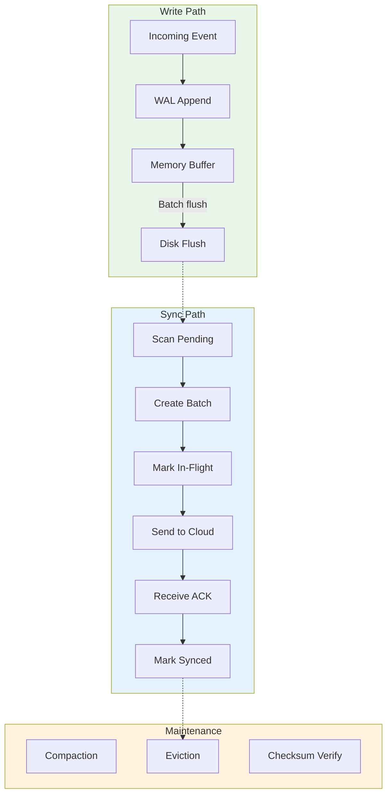
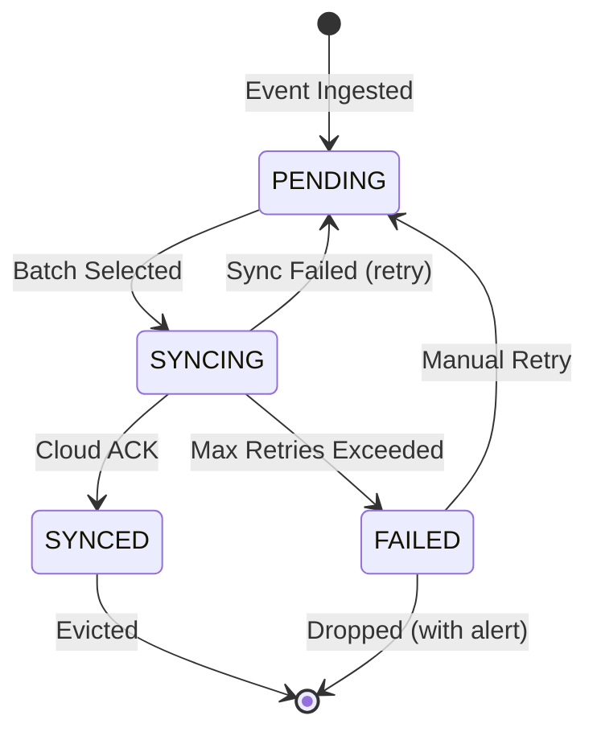
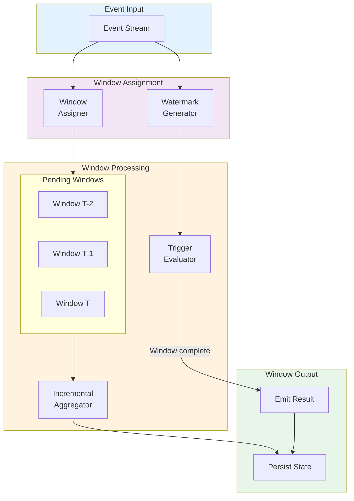
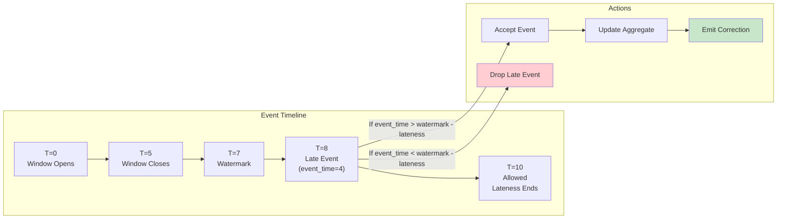
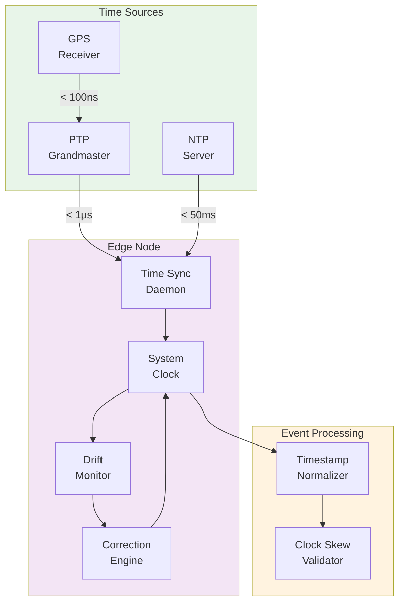
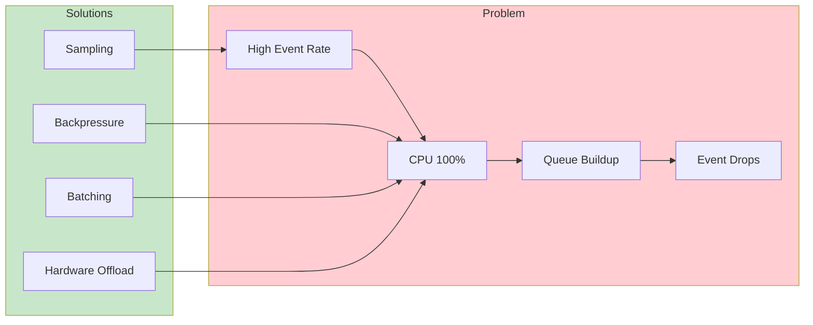
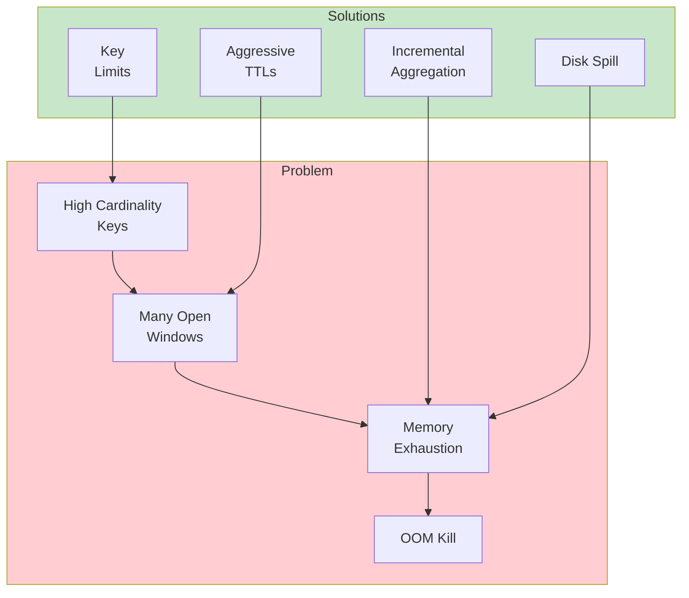
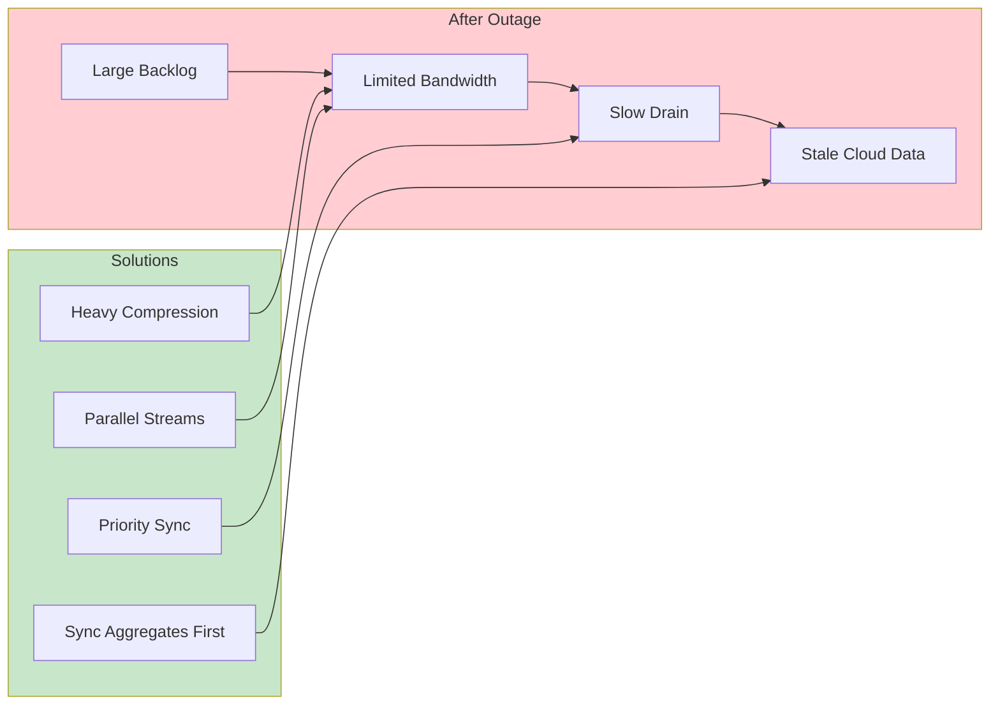

# Deep Dive & Bottlenecks

[Back to Index](./00-index.md) | [Previous: Low-Level Design](./03-low-level-design.md) | [Next: Scalability →](./05-scalability-and-reliability.md)

---

## Critical Component 1: Store-and-Forward Buffer

### Why This Is Critical

The store-and-forward buffer is the single most important component for edge reliability. It ensures **zero data loss** during network outages—a common occurrence in industrial, retail, and mobile edge deployments. Without a robust buffer:

- Events generated during outages would be lost permanently
- Recovery from network issues would require complex reconciliation
- SLA guarantees for data completeness would be impossible

The buffer must handle:
- **Sustained writes** at 10K+ events/second during normal operation
- **Burst writes** when downstream processing backs up
- **Extended outages** lasting hours or days
- **Crash recovery** without losing buffered data

### How It Works Internally



### Data Structures

**On-Disk Layout (SQLite WAL Mode):**

```
buffer/
├── events.db           # Main database
├── events.db-wal       # Write-ahead log
├── events.db-shm       # Shared memory
└── events.db.backup    # Periodic backup
```

**Buffer Entry Schema:**

```
BufferEntry:
  - event_id: UUID (16 bytes)
  - stream_id: string (indexed)
  - sequence_num: int64 (indexed, unique per stream)
  - event_time: int64 (milliseconds since epoch)
  - ingest_time: int64
  - status: enum {PENDING=0, SYNCING=1, SYNCED=2, FAILED=3}
  - retry_count: int32
  - payload: bytes (compressed with zstd)
  - checksum: uint32 (CRC32)
```

### Buffer State Machine



### Failure Modes and Recovery

| Failure | Symptoms | Cause | Recovery |
|---------|----------|-------|----------|
| **Buffer Full** | Backpressure signal, event rejection | Extended outage > buffer capacity | Priority eviction, sampling, alert |
| **WAL Corruption** | Startup failure, checksum errors | Power loss during write | Truncate WAL to last valid checkpoint |
| **Disk Full** | Write failures | Log growth, no eviction | Emergency eviction, expand storage |
| **Slow Disk** | High write latency, backpressure | Disk aging, overload | Batch writes, SSD upgrade |
| **Index Corruption** | Slow queries, missing data | Crash during compaction | Rebuild index from WAL |

**Recovery Procedure:**

```
FUNCTION recover_buffer():
    // 1. Check database integrity
    IF NOT verify_database_integrity():
        LOG.error("Database corruption detected")

        // Try WAL recovery
        IF recover_from_wal():
            LOG.info("Recovered from WAL")
        ELSE:
            // Fall back to backup
            IF restore_from_backup():
                LOG.warn("Restored from backup, some data may be lost")
            ELSE:
                // Last resort: reinitialize
                reinitialize_empty_database()
                ALERT("Buffer reinitialized, data loss occurred")

    // 2. Reset in-flight entries to pending
    UPDATE buffer_events
    SET status = PENDING, retry_count = retry_count + 1
    WHERE status = SYNCING

    // 3. Verify checksums on pending entries
    FOR entry IN SELECT * FROM buffer_events WHERE status = PENDING:
        IF NOT verify_checksum(entry):
            LOG.error("Checksum mismatch", entry_id=entry.event_id)
            MARK_CORRUPTED(entry)

    // 4. Resume normal operation
    start_sync_loop()
```

---

## Critical Component 2: Windowing Engine

### Why This Is Critical

The windowing engine transforms raw event streams into meaningful aggregates. It's critical because:

- **Real-time analytics** depend on accurate, timely window emissions
- **Alerting** uses windowed metrics (e.g., "avg temperature > 30°C over 5 minutes")
- **Data reduction** at edge relies on pre-aggregation (10:1 to 100:1 compression)
- **Consistency** across distributed systems requires correct handling of late events

### How It Works Internally



### Window Types Comparison

| Window Type | Trigger | Use Case | Memory Impact |
|-------------|---------|----------|---------------|
| **Tumbling** | Watermark passes window end | Regular reporting | O(active windows) |
| **Sliding** | Every slide interval | Moving averages | O(window/slide ratio) |
| **Session** | Inactivity gap | User/device sessions | O(active sessions) |
| **Global** | Count or time threshold | Running totals | O(1) per key |

### Late Event Handling



### Failure Modes and Recovery

| Failure | Symptoms | Cause | Recovery |
|---------|----------|-------|----------|
| **Watermark Stall** | Windows never close | Idle stream, stuck producer | Idle timeout advances watermark |
| **State Explosion** | OOM, slow processing | Too many distinct keys per window | Key cardinality limits, sampling |
| **Clock Skew** | Inconsistent window boundaries | Device clocks out of sync | NTP enforcement, watermark buffer |
| **Late Bursts** | Many late events dropped | Network delays, batch uploads | Increase allowed lateness |
| **Checkpoint Failure** | State loss on restart | Disk full, corruption | Rollback to previous checkpoint |

**State Recovery Procedure:**

```
FUNCTION recover_window_state(checkpoint: Checkpoint):
    // 1. Load checkpoint metadata
    watermark = checkpoint.watermark
    pending_keys = checkpoint.pending_window_keys

    // 2. Restore window states
    FOR key IN pending_keys:
        state = state_store.get(key)
        IF state != NULL AND state.status == "pending":
            pending_windows[key] = state
            LOG.info("Restored window", key=key, count=state.count)

    // 3. Determine replay starting point
    // Events after checkpoint but before crash need reprocessing
    replay_start = checkpoint.checkpoint_time
    replay_end = crash_time  // Determined from system logs

    // 4. Replay events from buffer
    events = buffer.scan(
        time_range = (replay_start, replay_end),
        status = ANY
    )

    FOR event IN events:
        // Re-process without re-buffering
        process_event(event, skip_buffer=TRUE)

    LOG.info("Window recovery complete",
        windows_restored = pending_windows.size(),
        events_replayed = events.count())
```

---

## Critical Component 3: Time Synchronization

### Why This Is Critical

Time synchronization is fundamental to edge data processing because:

- **Event ordering** depends on consistent timestamps
- **Window boundaries** are time-based
- **Cross-edge correlation** requires comparable timestamps
- **Debugging** needs accurate event timelines

Clock errors of even 1 second can cause:
- Events assigned to wrong windows
- False alerts from temporal correlation
- Data integrity issues during sync

### How It Works Internally



### Time Synchronization Protocols

| Protocol | Accuracy | Overhead | Use Case |
|----------|----------|----------|----------|
| **NTP** | 1-50ms | Low | General IoT, non-critical |
| **PTP (IEEE 1588)** | < 1μs | Medium | Industrial automation |
| **gPTP (802.1AS)** | < 1μs | Medium | TSN networks |
| **GPS** | < 100ns | High (hardware) | Reference clock |

### Timestamp Handling Strategy

```
FUNCTION normalize_timestamp(event: Event, edge_clock: Clock) -> Timestamp:
    device_time = event.event_time
    ingest_time = edge_clock.now()

    // Validate device timestamp
    time_diff = ABS(device_time - ingest_time)

    IF device_time > ingest_time + FUTURE_TOLERANCE:
        // Device clock is in future - use edge time
        LOG.warn("Future timestamp detected", diff_ms=time_diff)
        metrics.increment("clock_skew.future")
        RETURN ingest_time

    IF time_diff > MAX_CLOCK_SKEW:
        // Significant skew - flag for investigation
        LOG.error("Large clock skew detected", diff_ms=time_diff)
        metrics.increment("clock_skew.large")
        event.metadata["clock_skew_detected"] = TRUE

    // Prefer device time if within tolerance
    IF time_diff <= ACCEPTABLE_SKEW:
        RETURN device_time
    ELSE:
        // Blend: use device time offset from edge reference
        offset = ingest_time - device_time
        corrected = device_time + (offset * CORRECTION_FACTOR)
        RETURN corrected
```

### Failure Modes and Recovery

| Failure | Symptoms | Cause | Recovery |
|---------|----------|-------|----------|
| **NTP Unreachable** | Drift accumulates | Network outage | Fall back to local clock, alert |
| **GPS Signal Loss** | PTP degradation | Indoor, interference | Holdover mode, NTP fallback |
| **Clock Jump** | Window gaps, duplicates | Manual time change, leap second | Detect jumps, bridge windows |
| **Monotonicity Violation** | Sequence errors | Clock set backwards | Use monotonic counter as backup |

---

## Bottleneck Analysis

### Bottleneck 1: CPU Saturation Under Load



**Mitigation Strategies:**

| Strategy | Mechanism | Trade-off |
|----------|-----------|-----------|
| **Backpressure** | Signal upstream to slow down | Increases latency at source |
| **Sampling** | Process 1 in N events | Reduces accuracy |
| **Batching** | Process events in groups | Increases latency, improves throughput |
| **Aggregation Push-down** | Pre-aggregate at device | Requires device changes |
| **Hardware Offload** | FPGA/GPU for processing | Cost, complexity |

**Backpressure Implementation:**

```
FUNCTION check_capacity() -> BackpressureSignal:
    cpu_usage = system.cpu_percent()
    queue_depth = processing_queue.size()
    buffer_usage = buffer.utilization_percent()

    IF cpu_usage > 90 OR queue_depth > HIGH_WATERMARK:
        RETURN BackpressureSignal(
            action = "SLOW_DOWN",
            delay_ms = calculate_delay(cpu_usage, queue_depth),
            sample_rate = calculate_sample_rate(cpu_usage)
        )

    IF buffer_usage > 80:
        RETURN BackpressureSignal(
            action = "REJECT_LOW_PRIORITY",
            priority_threshold = 5
        )

    RETURN BackpressureSignal(action = "NONE")
```

### Bottleneck 2: Memory Pressure from Window State



**Memory Budget Calculation:**

```
FUNCTION calculate_memory_budget(config: Config) -> MemoryBudget:
    total_memory = system.available_memory()

    // Reserve for OS and base runtime
    reserved = 512 MB

    // Allocate remaining
    available = total_memory - reserved

    RETURN MemoryBudget(
        ingestion_buffer = available * 0.10,    // 10%
        window_state = available * 0.40,        // 40%
        query_cache = available * 0.20,         // 20%
        processing = available * 0.20,          // 20%
        headroom = available * 0.10             // 10% safety
    )
```

### Bottleneck 3: Storage I/O During Outages

**Problem:** During network outages, the buffer grows continuously. If I/O can't keep up with ingest rate, data is lost.

**Mitigation:**

| Strategy | Implementation | Impact |
|----------|---------------|--------|
| **SSD over HDD** | NVMe preferred | 10-100x write throughput |
| **Write batching** | Group commits (100ms) | Amortize fsync cost |
| **Compression** | zstd level 1 (fast) | 2-4x storage efficiency |
| **Tiered eviction** | Evict synced first, then downsample old | Preserve recent data |

### Bottleneck 4: Network Sync Backlog



**Priority Sync Algorithm:**

```
FUNCTION prioritized_sync(backlog: Buffer, bandwidth: INT) -> SyncPlan:
    plan = SyncPlan()

    // Phase 1: Sync alerts and critical events immediately
    critical = backlog.query(priority >= HIGH, limit = bandwidth * 0.2)
    plan.add_batch(critical, priority = 1)

    // Phase 2: Sync recent aggregates (last hour)
    recent_aggs = aggregates.query(time > NOW - 1 HOUR)
    plan.add_batch(recent_aggs, priority = 2)

    // Phase 3: Sync remaining aggregates
    older_aggs = aggregates.query(time <= NOW - 1 HOUR)
    plan.add_batch(older_aggs, priority = 3)

    // Phase 4: Sync raw events (downsampled if needed)
    IF backlog.size > bandwidth * DRAIN_TIME_TARGET:
        // Downsample to fit in target drain time
        sample_rate = (bandwidth * DRAIN_TIME_TARGET) / backlog.size
        raw_events = backlog.sample(rate = sample_rate)
    ELSE:
        raw_events = backlog.all()

    plan.add_batch(raw_events, priority = 4)

    RETURN plan
```

---

## Concurrency and Race Conditions

### Race Condition 1: Concurrent Buffer Access

**Scenario:** Ingestion thread writes while sync thread reads.

```
Thread A (Ingestion):        Thread B (Sync):
  read counter = 100
                               scan pending (sees 100)
  write event 101
  update counter = 101
                               mark 1-100 as syncing
                               // Event 101 missed!
```

**Solution:** Use row-level locking or optimistic concurrency:

```
FUNCTION safe_fetch_batch(batch_size: INT) -> List[Event]:
    // Use database transaction with snapshot isolation
    BEGIN TRANSACTION ISOLATION LEVEL SNAPSHOT

    // Fetch and lock rows atomically
    events = SELECT * FROM buffer
             WHERE status = PENDING
             ORDER BY sequence_num
             LIMIT batch_size
             FOR UPDATE SKIP LOCKED

    // Mark as syncing
    UPDATE buffer
    SET status = SYNCING
    WHERE event_id IN (events.ids)

    COMMIT
    RETURN events
```

### Race Condition 2: Window State Updates

**Scenario:** Two events for same window processed concurrently.

**Solution:** Per-key locking or single-threaded processing per key:

```
FUNCTION process_event_safe(event: Event):
    window_key = compute_window_key(event)

    // Acquire per-key lock
    WITH lock_manager.acquire(window_key):
        state = load_window_state(window_key)
        state = update_aggregate(state, event)
        save_window_state(window_key, state)
```

### Race Condition 3: Checkpoint During Processing

**Scenario:** Checkpoint captures inconsistent state if taken mid-processing.

**Solution:** Checkpoint barriers:

```
FUNCTION coordinated_checkpoint():
    // 1. Pause all processing
    FOR processor IN all_processors:
        processor.pause()
        processor.wait_for_idle()

    // 2. Flush pending writes
    state_store.flush()
    buffer.flush()

    // 3. Create consistent snapshot
    checkpoint = Checkpoint(
        id = generate_checkpoint_id(),
        watermark = current_watermark,
        window_states = snapshot_windows(),
        buffer_offsets = snapshot_buffer_offsets()
    )

    // 4. Persist checkpoint
    checkpoint_store.save(checkpoint)

    // 5. Resume processing
    FOR processor IN all_processors:
        processor.resume()

    RETURN checkpoint
```

---

[Back to Index](./00-index.md) | [Previous: Low-Level Design](./03-low-level-design.md) | [Next: Scalability →](./05-scalability-and-reliability.md)
